# Cerberus Release Process Understanding, Gaps And Improvement Ideas

This complete document consolidates KT-based current understanding, observations, open questions and possible improvement ideas into one reader copy.

## Complete Document Contents

| # | Source | Section |
| --- | --- | --- |
| 1 | `README.md` | [Cerberus Release Process Understanding, Gaps And Improvement Ideas](README.md) |
| 2 | `docs/system-state-problems-solutions.md` | [System State, Problems, Solution Options And Risks](docs/system-state-problems-solutions.md) |
| 3 | `docs/current-release-operating-model.md` | [Current Release Operating Model](docs/current-release-operating-model.md) |
| 4 | `docs/deployment-and-release-findings.md` | [Deployment And Release Findings](docs/deployment-and-release-findings.md) |
| 5 | `docs/cicd-deployment-findings-and-actions.md` | [CI/CD Deployment Findings And Actions](docs/cicd-deployment-findings-and-actions.md) |
| 6 | `docs/proposed-release-automation-flow.md` | [Proposed Release Automation Flow](docs/proposed-release-automation-flow.md) |
| 7 | `docs/automation-and-validation.md` | [Automation And Validation](docs/automation-and-validation.md) |
| 8 | `docs/hotfix-and-rollback.md` | [Hotfix And Rollback](docs/hotfix-and-rollback.md) |
| 9 | `docs/scope-ownership-approvals.md` | [Release Scope, Ownership And Approvals](docs/scope-ownership-approvals.md) |
| 10 | `docs/rollout-decision-proposals.md` | [Rollout Decision Proposals - Summary](docs/rollout-decision-proposals.md) |
| 11 | `docs/release-decision-register.md` | [Release Decision Register](docs/release-decision-register.md) |
| 12 | `docs/transformation-programme.md` | [Improvement Notes And Maturity Observations](docs/transformation-programme.md) |
| 13 | `docs/transformation-programme-delivery.md` | [Possible Improvement Path And Delivery Notes](docs/transformation-programme-delivery.md) |
| 14 | `docs/platform-engineering-strategy.md` | [Platform Engineering Strategy](docs/platform-engineering-strategy.md) |
| 15 | `docs/architecture-review/arb-package.md` | [Potential Future Architecture Review Considerations](docs/architecture-review/arb-package.md) |
| 16 | `docs/architecture-review/business-case-and-roadmap.md` | [Potential Benefits And Roadmap Notes](docs/architecture-review/business-case-and-roadmap.md) |
| 17 | `docs/architecture-review/operating-model-raci.md` | [Operating Model And RACI Notes](docs/architecture-review/operating-model-raci.md) |
| 18 | `docs/architecture-review/architecture-diagrams.md` | [Architecture Diagrams](docs/architecture-review/architecture-diagrams.md) |
| 19 | `docs/architecture-review/criticality-challenge-review.md` | [Criticality Challenge Notes](docs/architecture-review/criticality-challenge-review.md) |
| 20 | `docs/architecture-review/missing-enterprise-concerns.md` | [Additional Enterprise Concerns To Confirm](docs/architecture-review/missing-enterprise-concerns.md) |
| 21 | `docs/architecture-review/final-scorecard-and-verdict.md` | [Summary Assessment And Open Risks](docs/architecture-review/final-scorecard-and-verdict.md) |

---

> Source: `README.md`


**KT Notes, Current Understanding, Observations And Discussion Points**

This document captures my current understanding of the Cerberus CI/CD, release and deployment process based on KT sessions, discussions and follow-up analysis. It highlights areas that appear manual, unclear or risky, and proposes possible questions or improvement ideas for team discussion.

Some assumptions may be incomplete or wrong and should be validated with Gareth, Achilles, release management, the platform team and squad leads. This is not an approved operating model, a replacement for existing team decisions or a formal architecture proposal.

**Author positioning:** This is a working note from a developer currently onboarding into the Cerberus release process. It is intended to support discussion and shared understanding, not to override existing team decisions or established release management practices.

## Summary

```text
Avoid changing the branching model first.
First make the current release process visible, repeatable and auditable.
Then discuss whether the branch model should be kept, simplified or replaced.
```

## Structure

The notes are organised as a focused discussion pack plus appendix material. The main discussion pack stays on the Cerberus release-management problem: safer release flow, validation, ownership, hotfix/rollback and areas that may need confirmation.

### Main Discussion Pack

| Page | What It Covers |
| --- | --- |
| [System state, problems, solution options and risks](docs/system-state-problems-solutions.md) | Current-state summary, observed problems, possible solution options, risks and experience-based notes. |
| [Current release operating model](docs/current-release-operating-model.md) | End-to-end release flow: branches -> tags -> artefacts -> deploy -> reconciliation. |
| [Deployment and release findings](docs/deployment-and-release-findings.md) | How Helm scripts, secrets, manifests, umbrella charts and validation scripts actually work. |
| [CI/CD deployment findings and actions](docs/cicd-deployment-findings-and-actions.md) | Problem summary table, root causes, and recommended follow-up actions. |
| [Proposed release automation flow](docs/proposed-release-automation-flow.md) | Target automation: auto release branches, auto chart updates, reporting, changed-chart deploy. |
| [Automation and validation](docs/automation-and-validation.md) | Validation rules, release reporting, commit metadata, merge strategy. |
| [Hotfix and rollback](docs/hotfix-and-rollback.md) | Production hotfix flow, release-phase hotfix, rollback process, Liquibase rollback. |
| [Release scope, ownership and approvals](docs/scope-ownership-approvals.md) | Repository scope, service ownership, approval matrix. |
| [Rollout decision proposals](docs/rollout-decision-proposals.md) | Proposed discussion points for rollout behaviour. |
| [Release decision register](docs/release-decision-register.md) | Open decisions, owner gaps, required evidence and possible closure order. |
| [Improvement notes and maturity observations](docs/transformation-programme.md) | Root cause notes, risk observations, maturity scorecard and possible near-term target state. |
| [Possible improvement path and delivery notes](docs/transformation-programme-delivery.md) | Indicative phases, prioritisation, RACI, metrics to baseline, cost/benefit and improvement areas. |
| [Platform engineering strategy](docs/platform-engineering-strategy.md) | Environment promotion model, deployment strategies, observability gates. |
| [Potential architecture review notes](docs/architecture-review/index.md) | Optional later-stage review considerations, criticality challenge notes and open risks. |

Key problems at a glance:

| Problem | Impact |
| --- | --- |
| Release creation is manual-heavy | Days of effort per sprint, inconsistency, audit gaps. |
| Branch/tag timing rules unclear | Wrong artefacts, wrong manifests, unclear release state. |
| Release scope not explicit | Automation misses secrets, config, Liquibase or runbook changes. |
| Manifest validation too permissive | Wrong version or blocked work can reach production. |
| Chart deployment is manual | Every chart listed by hand; no changed-chart detection. |
| Hotfix/rollback not standardised | Drift between production, `main`, manifests and active releases. |
| No alerting for failed automation | Failed steps leave release state unclear. |
| Ownership not assigned | Nobody named for key decisions and approvals. |

## Suggested Reading Order

1. This page.
2. [System state, problems, solution options and risks](docs/system-state-problems-solutions.md) - current understanding and discussion summary.
3. [Current release operating model](docs/current-release-operating-model.md) - how it works today.
4. [CI/CD deployment findings and actions](docs/cicd-deployment-findings-and-actions.md) - what is broken.
5. [Proposed release automation flow](docs/proposed-release-automation-flow.md) - what the solution looks like.
6. [Deployment and release findings](docs/deployment-and-release-findings.md) - technical details.
7. [Automation and validation](docs/automation-and-validation.md) - validation, reporting, metadata and failure handling.
8. [Hotfix and rollback](docs/hotfix-and-rollback.md) - production recovery and reconciliation.
9. [Release scope, ownership and approvals](docs/scope-ownership-approvals.md) - scope, owners and approval points.
10. [Rollout decision proposals](docs/rollout-decision-proposals.md) - proposed discussion points to confirm or amend.
11. [Release decision register](docs/release-decision-register.md) - open decision tracker and possible closure order.
12. [Improvement notes and maturity observations](docs/transformation-programme.md) - root cause, maturity and possible target release state.
13. [Possible improvement path and delivery notes](docs/transformation-programme-delivery.md) - indicative phases, RACI, metrics and investment notes.
14. [Platform engineering strategy](docs/platform-engineering-strategy.md) - promotion model, deployment strategy and observability gates.
15. [Potential architecture review notes](docs/architecture-review/index.md) - optional later-stage review considerations and open risks.

## Visual Overview

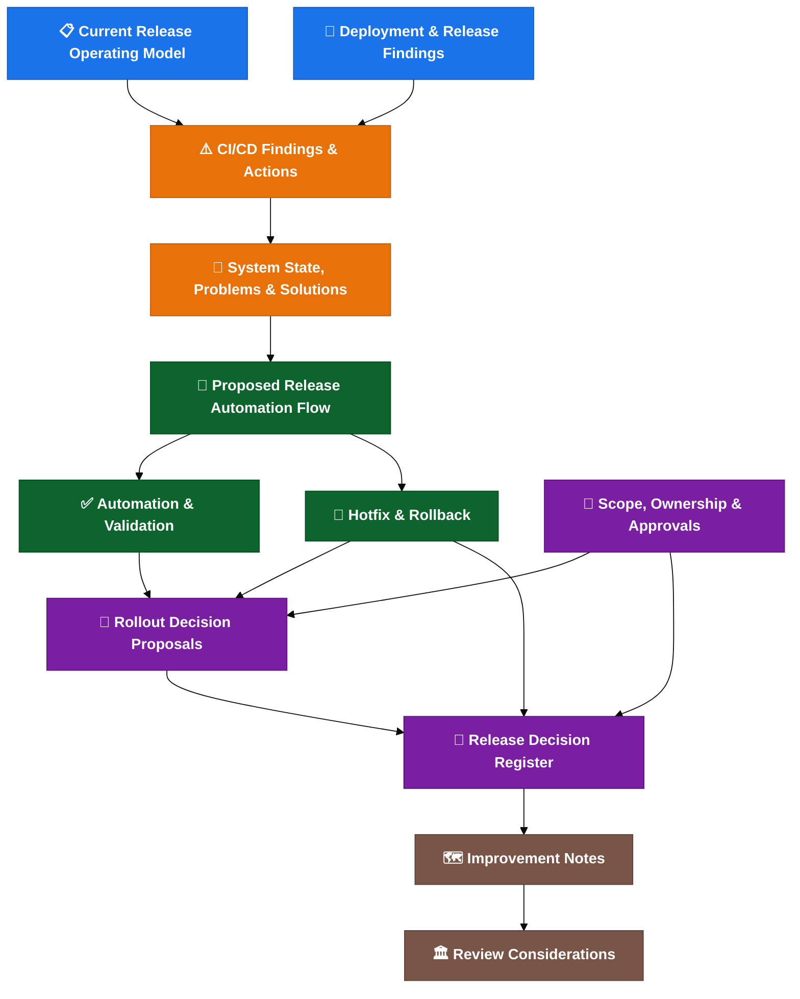

**Colour key:**
🔵 Current state · 🟠 Problems · 🟢 Solutions · 🟣 Decisions · 🟤 Review / improvement notes

---

> Source: `docs/system-state-problems-solutions.md`


# System State, Problems, Solution Options And Risks

This is a KT-based current-understanding summary of the CI/CD, branching, release and deployment notes.

It reflects my current understanding from KT sessions and follow-up analysis. Some assumptions may be incomplete and should be confirmed with Gareth, Achilles, release management, the platform team and squad leads before being treated as agreed process.

For the full detailed analysis, see [system state detailed analysis](docs/reference/system-state-problems-solutions-detailed.md).

## Current Understanding

### Current Situation In One Paragraph

Cerberus currently operates a GitFlow-like branching model, but the real release state is not contained within Git alone. It is fragmented across branches, tags, Docker images, Helm artefacts, the Cerberus deployment-management repository, manifests, environment-specific values files, Jira ticket metadata, secrets (managed through Git-crypt and Drone), Liquibase database scripts and runbooks. A branch rename or branching model simplification does not address this fragmentation. The release process is manual-heavy, validation is not strict enough, ownership is not fully assigned and operational procedures (hotfix, rollback, environment readiness) are not standardised. The automation pilot (Gareth/Achilles on the configuration service) is a strong first step, but it covers only part of the problem.

### Top Observations

| # | Observation | Impact | Possible Discussion Point | Confidence |
| --- | --- | --- | --- | --- |
| 1 | The issue appears broader than branching. | Changing the branch model alone would not fix the release process. | Stabilise the operating model before simplifying branches. | High |
| 2 | Release state appears fragmented across multiple systems. | No single view of what constitutes a release. | Map all release state areas; validate consistency through automation. | High |
| 3 | Release preparation appears manual-heavy. | Days of effort per sprint; inconsistency and audit gaps. | Move local scripts into Drone; automate branch/tag/chart creation where safe. | Medium |
| 4 | Tag, artefact and manifest validation may not be strict enough. | Wrong artefact or blocked work may reach production. | Consider fail-fast rules for wrong tag, missing tag and manifest/tag mismatch. | Medium |
| 5 | Release scope is not fully explicit. | Automation may miss secrets, config, Liquibase or runbook changes. | Confirm a release scope checklist per release. | Medium |
| 6 | Hotfix and rollback do not yet appear operationally standardised. | Production fixes may drift from main, manifests and active releases. | Confirm and test both hotfix and rollback flows. | Low / needs confirmation |
| 7 | Environment readiness does not appear to be a formal gate. | Deployment may fail due to incomplete setup. | Confirm readiness checks for values, secrets, tokens and access. | Low / needs confirmation |
| 8 | Ownership and approval responsibilities are not fully named in the notes. | Decisions may be delayed; escalation may be unclear. | Confirm named owners for key release activities. | Medium |
| 9 | Failed automation alerting and rerun rules appear incomplete. | A failed step can leave release state unclear and unresolved. | Confirm alerting channels, rerun safety rules and manual-intervention triggers. | Low / needs confirmation |
| 10 | Trunk-based development would likely be risky without stronger feature flags, validation and rollback maturity. | Premature simplification may create instability. | Keep the current baseline while release controls mature; reassess later. | Medium |

### Main Message

> **Changing the branch model alone will not make releases safer.**
>
> The safer path is to make the current release state visible, repeatable, validated, owned and auditable first; then simplify the branch model after the automation proves what is actually being released.

### Possible Later Direction

The immediate focus appears to be release operating model maturity: validation, ownership, automation and rollback. This is the focus of the current improvement discussion.

Beyond that, future platform capabilities should be treated as separate product decisions after the release foundation is proven.

This is a future maturity option, not part of the initial rollout. It should only be considered after release state visibility, strict validation, named ownership and tested rollback are stable. The feasibility and scope of such a platform would likely need separate platform strategy review and should be treated as a platform product decision.

## Release State Is Fragmented

The release process depends on multiple disconnected state areas. A problem in any one of them can invalidate the release.

| Release State Area | Current Location / Mechanism | Risk |
| --- | --- | --- |
| Source state | Git branches | Branch may not equal deployed state. |
| Release identity | Git tags / release versions | Wrong tag can create wrong artefact. |
| Build output | Docker images / Helm packages | Artefact may not match intended commit. |
| Deployment intent | Cerberus deployment-management / charts | Chart may not match release scope. |
| Environment config | Values files / feature flags | Deployed code may not be active. |
| Secrets | Git-crypt / managed secrets scripts / Drone secrets | Environment may not be ready. |
| Database changes | Liquibase | Rollback may be unsafe or impossible. |
| Release metadata | Jira labels / ticket fields | Release report may be incomplete. |
| Manual actions | Runbooks / release management | Audit trail may be weak. |
| Approval state | QAT / release owner decisions | Ownership may be unclear. |

**This is why a branch rename or branch-model change is not enough. Release safety depends on all of these states agreeing.**

## Business And Delivery Impact

| Problem | Delivery Impact | Operational Risk |
| --- | --- | --- |
| Manual release work | Release preparation takes days per sprint. | Human error and weak audit trail. |
| Weak validation | Wrong artefact may be released. | Production incident risk. |
| Unclear release scope | Config/secrets/DB changes may be missed. | Partial or broken release. |
| Weak rollback process | Recovery may be slow. | Longer incident duration. |
| Ownership gaps | Decisions are delayed. | Escalation confusion. |
| Environment readiness gaps | Late release failure. | Wasted release window. |
| Fragmented release state | Hard to prove what was deployed. | Audit and incident investigation risk. |

## Current Understanding Summary

```text
Avoid changing the branching model first.
First make the release process visible, repeatable, validated and owned.
Then discuss moving to the target main = production model through a controlled cutover.
```

The current problem is broader than branching. The release state is spread across branches, tags, images, Helm packages, Cerberus charts, manifests, values, secrets, Liquibase changes, JIRA metadata, QAT approval and post-release reconciliation.

The proposed direction appears sensible, but it should be treated as a phased operating-model discussion, not only a branch rename.

## Current System State

| Area | Current State | Confidence |
| --- | --- | --- |
| Branch model | GitFlow-like: feature -> `development` -> release branch -> `master` / production. | Medium |
| Target branch model | `main` represents production; release branches auto-created from `main`. | Proposed |
| Automation | Scripts work locally; Drone execution is the next step. | Medium |
| Pilot | Gareth/Achilles are testing on the new configuration service. | Medium |
| Artefact creation | Release tag triggers build, tests, scans and Helm artefact creation. | High |
| Deployment | Helm/package and Cerberus chart flow still has manual areas. | Medium |
| Release reporting | Expected to cross-reference JIRA, tags, services and chart changes. | Proposed |
| Validation | Existing scripts check some metadata, but strict fail/warn policy is not fully agreed. | Low/Medium |
| Hotfix/rollback | Concepts exist; operational runbook and reconciliation rules need confirmation. | Low/Medium |
| Environment readiness | Values, secrets, tokens and parity checks need clearer gates. | Low |
| Ownership | Templates exist; named owners and approvers are still incomplete. | Low |

## Main Problems

| # | Problem | Impact | Root Cause | Possible Action |
| --- | --- | --- | --- | --- |
| P1 | The issue can be misframed as "branching only". | A branch change may move risk rather than reduce it. | Release state is distributed across many systems. | Stabilise the operating model before changing the branch model. |
| P2 | Release work is too manual and locally executed. | Slow releases, inconsistent execution, weak audit trail. | Automation is not yet the normal central path. | Complete Drone pilot; make pipeline the agreed release path where the pilot proves safe. |
| P3 | Branch, tag and artefact timing rules are not strict enough. | Wrong artefacts or manifests can be produced. | Branch lifecycle and artefact lifecycle are different. | Enforce strict validation: wrong/missing tag = fail. |
| P4 | Release scope is unclear. | Secrets, config, Liquibase or runbook changes can be missed. | "All services" is not yet defined as a repo/change-type scope. | Define explicit release scope per repo and change type. |
| P5 | Manifest and ticket validation can be too permissive. | Blocked or wrong work can reach release. | Fail vs warning policy is still proposed. | Switch from warning to fail-fast after one dry-run release. |
| P6 | Changed-chart deployment is not yet a proven default. | Changed charts may be missed or unnecessary charts deployed. | Umbrella chart and service mapping need reliable detection. | Validate detection in pilot; deploy changed charts by default. |
| P7 | Hotfix and rollback are not operationally standardised. | Production can drift from branch, manifest and release records. | Rollback is treated as technical capability, not full process. | Document and test both flows before next production incident. |
| P8 | Environment readiness and parity are not explicit gates. | Release day failures can appear late. | Values, secrets, data, access and tokens are not centrally confirmed. | Consider formalising environment readiness as a deployment gate. |
| P9 | Secrets/config management will get harder at scale. | Onboarding, rotation and audit risk increase. | Git-crypt/GPG is workable but operationally heavy. | Evaluate External Secrets Operator for medium-term. |
| P10 | Trunk-based development is risky without stronger feature flags. | Incomplete work may need branch or config workarounds. | Feature flags appear deploy-time rather than dynamic runtime. | Keep current model; add runtime flags before reconsidering. |
| P11 | Ownership and approval gaps can break the rollout. | Failures, overrides and rollback decisions become slow. | RACI is not yet fully named. | Confirm named owners before expanding beyond pilot. |
| P12 | Alerting and rerun rules are incomplete. | Failed automation can leave state half-updated. | Failure modes are not yet production-readiness gates. | Define alerting channels and safe-rerun criteria. |

For detailed analysis of each problem, see the [detailed system analysis appendix](docs/reference/system-state-problems-solutions-detailed.md).

## Possible Improvement Path

### 1. Stabilise The Current Operating Model

Keep the current GitFlow-style model temporarily while the release process is made explicit.

Possible near-term discussion points:

- Confirm or amend the rollout decisions.
- Define release scope across repos and change types.
- Decide fail vs warning validation rules.
- Name release, hotfix, rollback, environment and alert owners.
- Keep the current process visible until automation is proven.

Risk:

- This can look like "no branching progress" unless time-boxed.

Mitigation:

- Treat it as a one-sprint decision cleanup and publish the exit criteria.

### 2. Move Release Automation Into Drone

Make Drone the central path for release branch, tag, chart update and report generation.

Possible next steps:

- Complete the configuration-service pilot.
- Test reruns and partial-failure recovery.
- Store release reports as pipeline artefacts or release records.
- Alert failures to the right squad/release channel.

Risk:

- Local scripts may fail in Drone because of token, proxy, secret or permission differences.

Mitigation:

- Keep pilot scope narrow and test both happy-path and failure-path cases.

### 3. Add Strict Release Validation

Possible strict-validation default:

```text
Wrong tag -> fail
Missing tag -> fail
Manifest/tag mismatch -> fail
Do-not-deploy marker -> fail unless explicitly overridden
Invalid ticket status -> fail or release-owner override
Unknown ownership -> fail or release-owner override
```

Risk:

- Early rollout may fail often because metadata quality is inconsistent.

Mitigation:

- Start with dry-run/report-only for one release, then switch to enforced fail-fast.

### 4. Consider Cutover To `main = Production`

Consider cutover only after the pilot and validation rules are green.

Safer cutover may be:

```text
Create or rename `main` from the confirmed production state.
Avoid renaming `development` to `main`.
```

Risk:

- `development` may contain work that has not reached production.

Mitigation:

- Freeze `development`, inventory open work and set branch protections before cutover.

### 5. Scale Changed-Chart Deployment

The default could be to deploy all changed charts, with exclusions requiring release-owner confirmation and an audit note.

Risk:

- Detection can miss a chart, especially with umbrella charts or cross-repo changes.

Mitigation:

- Keep mass diff and human review mandatory in the first rollout phases.

### 6. Make Hotfix And Rollback A Production Gate

Production release would likely need:

- hotfix flow,
- rollback vs fix-forward decision guide,
- manifest reconciliation checklist,
- branch reconciliation checklist,
- Liquibase rollback/fix-forward policy,
- named decision owner.

Risk:

- Rollback may be unsafe when DB/data changes are involved.

Mitigation:

- Require rollback blocks or explicit no-rollback justification for production Liquibase changes.

### 7. Modernise Later, Not First

Runtime feature flags, external secret management and observability hardening are valuable future improvements.

They should come after the release pipeline, validation and ownership model are stable.

## Go / No-Go Criteria

### Go For Automation Rollout

- Drone pilot succeeds for the configuration service.
- Generated tags, versions, chart changes and release report match expectations.
- Rerun is tested and safe.
- Failure alerting is defined.
- Manual chart edits are exception-only and audited.
- Release owner and backup are named.

### No-Go For Automation Rollout

- Scripts only work locally.
- Pipeline failure can be silent.
- Rerun can create duplicate or conflicting state.
- Release report does not match actual chart/manifest state.
- Drone secrets/tokens are not owned.

### Go For Branch Cutover

- Confirmed production state is known.
- `main` branch protection is ready.
- Automation targets the correct branch.
- Open work on `development` is inventoried.
- Hotfix and rollback reconciliation are confirmed.
- Strict validation has passed at least the pilot.

### No-Go For Branch Cutover

- Production state cannot be tied to branch/tag/manifest.
- Drone pilot is not green.
- `development` contains unknown open work.
- Rollback reconciliation is unclear.
- Forward-merge ownership is missing.

## Suggested Next Steps

```text
Phase 0: confirm decisions and ownership.
Phase 1: quick wins and strict validation dry-run.
Phase 2: Drone pilot.
Phase 3: controlled `main = production` cutover.
Phase 4: expand changed-chart deployment and shared dev.
Phase 5: optimise feature flags, secrets and observability.
```

The strongest suggested direction is to avoid a big-bang branch change. A safer path may be to make the release state auditable first, then simplify the branch model once the automation can prove what is actually being released.

For root cause notes, maturity observations, possible phases, RACI and metrics to baseline, see [improvement notes and maturity observations](docs/transformation-programme.md).


## One-Page Summary

### Current State

Cerberus uses a GitFlow-like branching model with release branches, tags, Helm packaging and environment promotion. The release process is functional but manual-heavy, with fragmented state across branches, tags, images, charts, manifests, Jira, secrets and runbooks. Automation is being piloted on the configuration service by Gareth/Achilles.

### Top 5 Risks

| # | Risk | Likelihood | Impact |
| --- | --- | --- | --- |
| 1 | Wrong artefact deployed due to weak tag/manifest validation. | Medium | High |
| 2 | Production incident with no standardised rollback procedure. | Medium | Critical |
| 3 | Release scope incomplete (missing secrets, config or DB changes). | High | High |
| 4 | Ownership gaps delay decisions during incidents. | High | Medium |
| 5 | Environment readiness failure blocks release at deploy time. | Medium | Medium |

### Top 5 Improvement Areas For Discussion

| # | Improvement Area | Effort | Priority |
| --- | --- | --- | --- |
| 1 | Move release automation scripts into Drone (complete the pilot). | Medium | Immediate |
| 2 | Enforce strict tag/manifest validation (fail on mismatch). | Low | Immediate |
| 3 | Document and test hotfix and rollback flows. | Medium | Before next production incident |
| 4 | Assign named owners for all release activities. | Low | Before pilot expands |
| 5 | Formalise environment readiness as a pre-deployment gate. | Low | Before new environments are used |

### Go / No-Go Criteria For Rollout Expansion

Before expanding the automation beyond the pilot:

- [ ] Configuration-service pilot completes successfully in Drone.
- [ ] Generated chart changes, versions and tags are correct.
- [ ] Release report is produced and matches expected content.
- [ ] Changed-chart detection identifies expected charts.
- [ ] Alerting for failed steps is in place.
- [ ] Rollback procedure is documented and tested.
- [ ] Named release owner and platform owner are assigned.
- [ ] At least one squad lead has reviewed and confirmed understanding.

### Suggested Immediate Next Step

> **Validate the current-state assumptions with Gareth, Achilles, release management and one squad lead before asking the team to confirm or amend the rollout decisions.**

---

> Source: `docs/current-release-operating-model.md`


# Current Release Operating Model

This page captures the current understanding of how branching, release and deployment fit together.

It is a current-state summary, not the final process definition. Keep this page short; use the linked detail pages for deeper implementation notes.

## Current Direction

The release process is still too manual-heavy. The target direction is to run the repeatable release work centrally through Drone, update Cerberus charts automatically and produce a release report that can be checked against JIRA.

Current status:

- Gareth/Achilles are testing the automation on the new configuration service.
- The scripts work locally; the remaining step is to run them through Drone.
- The automation is expected to generate service chart changes, versions, tags and release reports.
- Some manual server chart work may remain until the relevant Drone pipelines are updated.
- Lower environments are more ad hoc; higher-environment releases rely more heavily on server chart updates and release management.
- Changes may include service code, secrets, config, Liquibase/database changes and runbook work.
- The proposed target has `main` representing production/live state, with release branches auto-created at the start of each sprint/release.

For the proposed target flow, see [proposed release automation flow](docs/proposed-release-automation-flow.md).

For Helm, manifest, secrets and validation detail, see [deployment and release findings](docs/deployment-and-release-findings.md).

## Current Branching Model

The current approach is close to a GitFlow-style model:

```text
feature branch -> development -> release branch -> master / production
```

Current understanding:

- Feature or ticket branches are created for individual changes.
- Completed work is merged into `development`.
- `development` represents ongoing work and the candidate state for upcoming releases.
- Release branches are created from `development`.
- `master` is intended to reflect production/live state.
- Release branches are tagged to trigger releasable artefact creation.
- After release, the release branch should be reconciled back into `master` and `development`.
- Hotfixes should be possible from production state, but the exact back-merge and forward-merge process still needs confirmation.

Important transition note:

```text
The proposed target is not "rename development to main".
The target is "main represents the confirmed production state".
```

That distinction matters because `development` may contain work that has not reached production.

## End-To-End Flow

The release flow currently spans source control, artefact creation, deployment state, environment promotion and post-release reconciliation.

Compact current-state view:

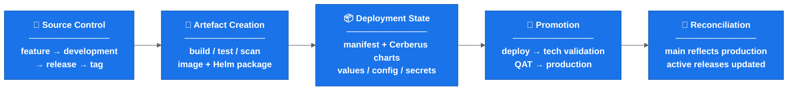

**Colour key:** Blue = release lifecycle phase.

Why this matters:

```text
Changing the branch model alone does not make the release safe.
The release is only safe when tag, artefact, chart, manifest, config, validation and reconciliation all agree.
```

## Deployment And Helm Summary

The current deployment path focuses on the service repo and the MMA Helm repo.

Key points:

- Individual service charts have had their own Drone pipelines around dev-environment Helm chart deployment.
- The current approach appears to deploy through the service repo instead.
- The MMA Helm repo contains scripts for Helm packaging, linting, templating, diffing, uploading and deployment-related tasks.
- Helm charts are deployed as packaged artefacts with environment-specific values files.
- Tag creation runs packaging/upload steps; deployment itself is promoted or manually triggered.
- Deployment parameters include target environment, deployment scope, release version/tag and chart names.
- Chart names may still need to be listed explicitly until changed-chart detection is reliable.

Temporary manual areas still needing confirmation:

- Which server chart updates remain manual.
- Which Drone pipeline changes are needed before server chart work is automated.
- Who performs manual chart updates during rollout.
- How manual chart changes are reviewed and reconciled with release reports.
- How cross-ticket dependencies are handled when a manual chart edit is still required.

## Tagging And Artefact Creation

A release branch alone does not produce a releasable service artefact. A tag is created on the release branch when it is ready.

Creating a tag appears to trigger:

- repository clone,
- Docker/test dependency setup,
- Artifactory login,
- service build,
- Maven install/tests for Spring Boot services,
- vulnerability scanning such as Trivy,
- code quality scanning such as Sonar,
- Helm package, Helm dependency build and Helm artefact upload.

Compact tag flow:


**Colour key:** Green = tag, artefact, manifest and deployment-candidate flow step.

Risk:

```text
If the tag points to the wrong commit, the rest of the process can look correct while deploying the wrong artefact.
```

## Manifest, Ticket And Release Metadata

Existing scripts appear to analyse release content using tickets, tags and manifest versions.

Observed responsibilities:

- Compare start tag and end tag.
- Identify tickets included in a release.
- Add or update release labels.
- Update changelog entries.
- Check ticket status.
- Check whether the correct tag version has been entered.
- Compare update versions with current manifest versions.
- Detect incorrect tags, missing tags, blocked tickets or invalid ticket statuses.

Open policy:

```text
Wrong tag, missing tag, manifest/tag mismatch and do-not-deploy markers should fail fast unless an explicit release-owner override is recorded.
```

See [automation and validation](docs/automation-and-validation.md).

## Configuration, Feature Flags And Activation

Deployment does not always mean activation.

Current understanding:

- A new feature or rule can be deployed without being active.
- Activation is controlled by feature flags and environment-specific values.
- Development teams decide which features need to be enabled in each environment.
- Some flag values appear to be controlled through chart values/config.

Operational implication:

```text
Code deployed != feature enabled
```

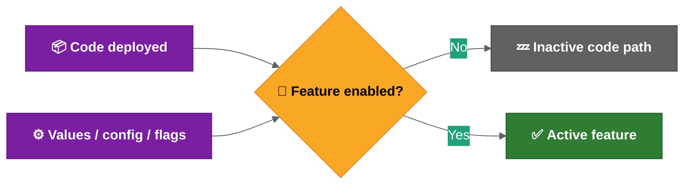

**Colour key:** Purple = deployed code/config state · Yellow = feature-flag decision · Grey = inactive path · Green = active feature.

If feature flags are baked into Helm values, enabling or disabling a feature may require redeployment. That means trunk-based development would move some complexity from branching into configuration and deployment.

## Testing, Validation And Approval

Deployment success and functional release confidence are different things.

Technical validation generally confirms:

- deployment completed,
- pods started successfully,
- health checks or monitoring passed.

Functional validation is separate:

- development teams may use Playwright or Cypress,
- QAT approval is required for SIT and above,
- a green deployment pipeline does not prove functional readiness.

Key principle:

```text
Deployment success != functional validation complete
```

## Environment And Operational Constraints

Environment differences are not fully documented yet.

Areas to confirm:

- data volume and data shape,
- configuration differences,
- feature flag defaults,
- secrets and credentials,
- external integrations,
- network/access constraints,
- operational permissions,
- required values files, Drone secrets and kube/robot tokens,
- whether lower environments are deployed ad hoc while higher environments use server chart releases.

Operational constraints also include:

- Thursday appears to be the regular release day.
- Some higher-environment actions may require PNR room/location access.
- Some commands may require tools pod access.
- Runbook steps may need to run alongside release activity.
- Screen sharing or recording while viewing decoded secrets is a security risk.
- If secrets are exposed, rotation may be required.

## Confirmation Needed

Before changing the branching model, confirm:

1. When release branches are cut.
2. When tags are created.
3. Which repositories are in scope.
4. Which steps are manual vs automated.
5. How hotfixes and rollback are handled.
6. How `master` / `main` is kept aligned with production.
7. Who owns release readiness, execution, validation and reconciliation.
8. How feature flag state is recorded in the release report.
9. Which environment readiness checks are mandatory before rollout.

## Related Detail

- Feature flag and environment management best practices are in [release engineering best practices](docs/release-engineering-best-practices.md).
- Proposed automation is in [proposed release automation flow](docs/proposed-release-automation-flow.md).
- Open rollout decisions are in [rollout decision proposals](docs/rollout-decision-proposals.md).

---

> Source: `docs/deployment-and-release-findings.md`


# Deployment And Release Findings

This page covers the current deployment, secrets, manifest and validation mechanisms that the proposed solution must either reuse, automate or replace.

Read this page together with:

- [Current release operating model](docs/current-release-operating-model.md) for the current end-to-end flow.
- [Proposed release automation flow](docs/proposed-release-automation-flow.md) for the target solution.
- [Rollout decision proposals](docs/rollout-decision-proposals.md) for decisions that still need team sign-off.

## 1. Deployment Scripts And Helm Flow

The current deployment path focuses on the service repo and the MMA Helm repo.

Key points:

- Individual service chart Drone pipelines have existed around dev-environment Helm chart deployment.
- The MMA Helm repo contains the deployment scripts for Helm packaging, linting, templating, mass diff, uploading and deployment.
- The MMA Helm repo is different from the MMA Helm library repo, which contains Helm templates/library content.
- Future Drone pipeline deployment changes are likely to touch the MMA Helm repo and possibly service repo environment setup scripts.

Current Helm flow:


**Colour key:** Grey = branch/source trigger · Blue = automated Helm/package checks · Purple = release tag · Orange = manual promotion · Green = environment deployment.

Important details:

- Helm charts are deployed as packages, not directly from local repo files.
- Environment-specific values files are included at deploy time.
- Linting and templating validate Helm/YAML rendering, but Kubernetes may still reject something Helm accepted.
- Mass diff compares rendered templates against the target/default branch to show what changes will be made.
- Tagging kicks off upload/deploy-related pipeline steps.
- Deployment itself is manually promoted/triggered.
- Deployment parameters include target environment, deployment scope, release version and chart names.
- Deployment scope can distinguish live, historical or both.
- To deploy all charts today, chart names may need to be listed explicitly.

## 2. Environment And Release Responsibilities

Current split of responsibilities:

- Developers/squads handle lower/squad environments.
- Release management handles SIT and higher environments.
- QAT approval is required before progressing beyond SIT.
- Production-like environments include B.Val/pre-production/production.
- From a technical deployment point of view, environment differences are mainly in values files, but operational process and access differ.
- B.Val may contain more data than production.
- Runbook repositories may contain environment-specific actions that must be executed alongside release activity.

Important distinction:

```text
Deployment success does not prove functional readiness.
```

Deployment checks mainly show that Helm/pods/deployment worked. Functional validation is handled by development teams and QAT, using tools such as Playwright or Cypress where available.

## 3. Feature Flags And Activation

Deployment does not always mean activation.

Feature activation may depend on values files or feature flags. Development teams decide what needs to be enabled in each environment.

Implication:

```text
The release process must track both deployed version and activation/config state.
```

## 4. Rollback Current State

Current rollback status:

- Automatic rollback is not built into the deployment scripts.
- If deployment fails, the pipeline does not automatically rollback.
- Monitoring failure does not automatically trigger rollback.
- Helm rollback is technically possible through Helm history/rollback commands.
- Recent practical behaviour has leaned towards fix-forward.

Implication:

```text
Rollback needs a documented operational process, not just Helm capability.
```

## 5. New Environment Setup Considerations

For new dev/test environments, several setup points must be addressed:

- Environment lists or setup scripts may need updating.
- Values files for new environments need to exist and match naming expectations.
- Drone secrets/tokens may need to be added for new environments.
- There is uncertainty around whether kube/robot tokens come from ACU or existing Drone/namespace secrets.
- This needs confirmation before new environments can be treated as ready.

Open items:

- Confirm which repos/scripts must be updated for each new environment.
- Confirm who owns Drone secret/token creation.
- Confirm whether ACU provides the required robot/kube tokens.
- Confirm minimum required secrets per environment.

## 6. Secrets Management

Current direction for managing secrets:

- Secrets are being extracted into the Cerberus/deployment-management structure.
- Managed secrets scripts can extract and encrypt secrets for an environment.
- Secret values are base64 encoded and encrypted.
- Secret keys should remain consistent between environments; values differ by environment.
- Access requires Git maintainer or Git-crypt maintainer setup, including GPG keys.
- The managed secrets script supports rotation and restore.
- Lower-level helper scripts such as export/encrypt secrets exist, but the managed secrets script is the main entry point.
- MSK secrets may have a separate area.

Implication:

```text
Secrets/config changes should be part of release scope and release readiness checks.
```

## 7. Release Artefact Creation

Service artefact creation flow:

- A release branch may not have a tag until it is ready.
- Creating a tag kicks off a tag creation pipeline.
- For Spring Boot services, the pipeline builds the service and runs Maven install/tests.
- Trivy vulnerability scanning and Sonar code-quality scanning run before deployable artefact creation.
- Helm package, Helm dependency build and Helm artefact upload are part of releasable artefact creation.
- Slack notification may be sent once the service artefact is created.

## 8. Umbrella Charts

The deployment-management repository packages services into umbrella charts.

Key points:

- There are around two dozen umbrella charts.
- Some umbrella charts contain one service; others contain many services.
- Release chart version updates currently happen by updating chart YAML/service versions.
- Umbrella charts allow related services to be deployed together or in isolation.

This matters for changed-chart deployment because the automation needs to reason at chart level as well as service level.

## 9. Auto Manifest And Tag Jump Scripts

Supporting scripts that still matter for release metadata, manifest generation and validation decisions.

Auto manifest has two main stages:

1. Create the release Jira ticket.
2. Create the manifest.

Supporting details:

- Scripts use Python plus tools such as `yq` and `jq`.
- Local/workspace runs may need proxy configuration to access Jira.
- Drone runs may not need the same proxy setup.
- Release version and ticket number are key inputs.
- The script gets release tickets from Jira by release label.
- The GitLab tag field on tickets is used to determine service versions/tags.
- `NA` can be used for changes that do not require a tag/version update.
- DB Liquibase has special handling because one Liquibase update may affect multiple projects.
- The script updates chart versions, writes changelog entries, creates a branch, pushes changes and raises an MR.
- Helper scripts exist for branch creation, commits, pushes and MRs.

## 10. Tag Jump Checker

The tag jump checker may be less central in the proposed non-linear release branch model, but it explains an important release risk.

It was used when the team could not safely release only a selected ticket because other merged changes might be pulled in as well.

The script:

- Compares base and release versions.
- Checks Git commit logs for ticket numbers.
- Compares discovered tickets against release tickets/labels.
- Uses labels such as tag jump and full release.
- Checks ticket status and GitLab tag fields.
- Warns or fails for missing/incorrect tag metadata.
- Flags `do not deploy` cases.
- Has dry-run support.

Known caveats:

- It may be less relevant with the proposed branching structure because version/tag order is not always linear.
- Rollback comparisons can be awkward because the script tends to prefer the higher/current version.
- Incorrect ticket numbers in commits can produce false positives.
- Some validation may currently be looser than expected, such as incorrect tags or no tags found passing when they should fail.

Implication:

```text
The new release automation must explicitly define strict validation rules for ticket status, missing tags, incorrect tags and do-not-deploy markers.
```

## Follow-Up Items

1. Confirm which scripts/repos must be updated for new dev/test environments.
2. Confirm Drone secret/token ownership for new environments.
3. Confirm whether deployment parameter validation is strict enough.
4. Confirm whether auto manifest/tag validation should fail on wrong tag, missing tag or invalid ticket status.
5. Confirm how `NA` tag entries should be represented in release reports.
6. Confirm whether tag jump logic is retired, replaced or adapted for the new branching model.
7. Confirm secrets access/onboarding process for maintainers.

## Related Best Practices

Helm versioning, values-file structure, umbrella chart dependency handling, mass diff usage and secrets-management options are summarised in [release engineering best practices](docs/release-engineering-best-practices.md).

---

> Source: `docs/cicd-deployment-findings-and-actions.md`


# CI/CD Deployment Findings And Actions

This page summarises the CI/CD and deployment findings.

Its purpose is to show:

1. How the current process works.
2. Which parts look manual, unclear, risky or inconsistent.
3. What may need to be standardised, automated or explicitly decided next.

## Analysis Frame

```text
The release challenge is broader than the branch model itself.

Branching is one part of the process, but CI/CD and deployment also depend on service tags, Helm artefacts, manifests, configuration and feature flags, runbooks, environment access, QAT approval, rollback and ownership.

The current process should be made visible, repeatable and auditable before the branching model is treated as the main fix.
```

## Process Areas Covered

- Release branch creation and merge strategy.
- Service tag creation and artefact generation.
- Image build, test, scan and Helm package upload.
- Cerberus chart and manifest updates.
- Deployment through service repo and MMA Helm scripts.
- Environment-specific values, secrets and runbooks.
- QAT approval and higher-environment promotion.
- Hotfix, rollback and post-release reconciliation.

## Problem Areas Identified

| Area | Current Problem | Why It Matters |
| --- | --- | --- |
| Manual release work | Release creation, chart updates, tag handling and deployment triggers still involve manual or locally run steps. | Manual work increases release time, inconsistency and audit gaps. |
| Branch/tag timing | Release branches, temporary tags and full release tags need clearer rules. | Wrong timing can create wrong artefacts, wrong manifests or unclear release state. |
| Release scope | "All services" and cross-repo release scope are not fully explicit. | Automation may include too much, too little or miss secrets/config/Liquibase/runbook changes. |
| Manifest validation | Missing tags, wrong tags, invalid ticket status and `do not deploy` cases need strict policy. | Weak validation can allow the wrong version or blocked work into a release. |
| Changed-chart deployment | Deploying all charts manually or listing chart names explicitly is inefficient. | The deployment should default to changed charts, with audited override. |
| Environment readiness | New dev/test environments need values files, setup entries and Drone secrets/tokens confirmed. | An environment can look available but fail deployment because setup is incomplete. |
| Hotfix and rollback | Hotfix source branch, back-merge and rollback reconciliation are not fully standardised. | Production fixes can drift from `main`/`development`, manifests and active release branches. |
| Alerting and rerun | Failed automation alerting and safe rerun rules are not fully defined. | A failed final Git/chart/reporting step can leave release state unclear. |

## Findings Flow

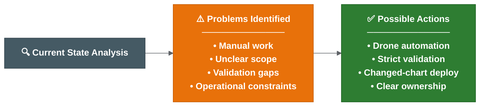

**Colour key:** Grey = current-state analysis · Orange = problems identified · Green = possible actions.

## Possible Actions

1. Keep the current-state flow in [current release operating model](docs/current-release-operating-model.md) as the baseline view.
2. Use [deployment and release findings](docs/deployment-and-release-findings.md) as the detailed source for deployment scripts, secrets, manifests and tag validation.
3. Move local/manual release automation into Drone once the configuration-service pilot is green.
4. Define strict validation for wrong tags, missing tags, manifest/tag mismatch, invalid ticket status and `do not deploy` markers.
5. Confirm repository scope for service code, Helm charts, deployment management, secrets/config, Liquibase and runbooks.
6. Confirm changed-chart deployment behaviour and the override confirmation path.
7. Document hotfix and rollback flows including branch, manifest and release report reconciliation.
8. Define alerting and rerun rules for failed automation steps.
9. Confirm new environment readiness criteria before treating any dev/test environment as release-ready.
10. Use [rollout decision proposals](docs/rollout-decision-proposals.md) as the decision record until owners confirm or amend them.

## Suggested Short-Term Focus

As stated in the [current understanding](docs/system-state-problems-solutions.md#current-understanding): stabilise the release operating model before changing the branching model. The priority actions are in the Possible Actions list above.

## Prioritisation: Effort vs Impact

Not all problems are equally important. Prioritise by impact and effort:

### Quick Wins (High Impact, Low Effort)

| Action | Why Quick Win |
| --- | --- |
| Pre-commit hook for ticket references | Already in progress. Prevents garbage commits entering release history. |
| Strict validation: fail on missing/wrong tag | Script change only. Prevents wrong artefacts reaching production. |
| Document deployment parameters | Write-up only. Removes tribal knowledge dependency. |
| Changed-chart detection in release report | Reporting change. Shows what should deploy without manual listing. |

### High Impact, Medium Effort

| Action | Why Important |
| --- | --- |
| Move release automation to Drone | Central, auditable, repeatable. Removes local-script dependency. |
| Auto release branch creation | Removes start-of-sprint manual work entirely. |
| Auto Cerberus chart branch updates | Removes most manual chart editing - the biggest time sink. |
| Alerting for failed steps | Makes failures visible instead of silent. |

### High Impact, High Effort

| Action | Why Harder |
| --- | --- |
| Full rollback runbook and testing | Requires cross-team agreement, environment access, testing time. |
| Environment parity documentation | Requires production access/knowledge that few people have. |
| Ownership matrix sign-off | Requires management decisions and role assignment. |
| Feature flag runtime control | Requires new tooling or infrastructure. |

### Possible Execution Order

```text
1. Quick wins (this sprint / next sprint)
2. Move automation to Drone (current pilot)
3. Auto release branch + chart updates (immediately after pilot green)
4. Alerting and strict validation (alongside #3)
5. Rollback runbook (before next production incident)
6. Ownership sign-off (before expanding beyond pilot squads)
7. Feature flags and environment parity (medium-term roadmap)
```

---

> Source: `docs/proposed-release-automation-flow.md`


# Proposed Release Automation Flow

This page summarises the proposed release automation flow.

It is still a proposal until the team confirms rollout timing, branch naming, quality gates and ownership.

For proposed answers to the open rollout decisions, see [rollout decision proposals](docs/rollout-decision-proposals.md).

## Current Pain

The current process is manual-heavy:

- Lower environments are deployed more ad hoc.
- Higher-environment releases rely on server chart updates.
- A feature deployment can require a manual tag, manual Cerberus chart branch/update and manual deployment trigger.
- Release branches need repeated tags and chart image updates as fixes, CVEs and last-minute changes are added.
- End-of-sprint release preparation can take several days and consume developer/senior time.

## Possible Branch Model

The possible direction under discussion is:

- `development` does not become `main`. `main` is created from the confirmed production baseline. `development` is transitional and later retired.
- `main` should represent what is live/production.
- When something is deployed to production, it should be merged into `main`.
- At the start of each sprint/release, release branches are automatically created from `main` for every repository that needs one.
- Feature and hotfix branches are taken from the relevant release branch.
- Multiple release branches may exist at the same time.
- If releases need to be chained, the automation should allow a release branch to be based on another release branch instead of `main`.

Working assumption to confirm:

```text
Move to `main` as the production/live baseline after an agreed cutover release.
Keep `development` as transitional until the automation pilot and branch protections are ready.
```

## Feature And Hotfix Branch Flow


**Colour key:** Orange = release branch · Green = feature/hotfix branch · Grey = commit/action step · Purple = temporary tag · Blue = build · Teal = chart update · Dark green = deploy handle.

Important details:

- Feature and hotfix branches are treated similarly by the automation.
- Each commit should build from the latest commit on the branch.
- The temporary branch tag should be stable for the branch, rather than generating a large number of images for every commit.
- The tag is expected to include the previous application version and the MMA/JIRA ticket reference.
- When the image is built successfully, the corresponding Cerberus chart branch should be updated automatically.
- The branch name/ticket becomes the deployment handle for dev test or other environments.

## Multi-Repo Change Aggregation

If multiple repositories use the same ticket/branch name, their changes should feed into the same Cerberus chart branch.

This means one ticket can collect:

- Service changes.
- Secrets/config changes.
- Liquibase/database changes.
- Runbook changes.
- Changes across multiple services that need to be tested together.

This is intended to remove most manual chart updates for multi-service changes.

## Release Branch Flow


**Colour key:** Purple = main/production · Orange = release branch · Green = feature/hotfix branches · Grey = merge step · Purple tag node = release tag/version · Teal = chart update · Blue = shared-dev deployment · Dark green = SIT+ promotion.

Important details:

- The release branch is what should be deployed to environments.
- Once a feature branch is merged into the release branch, the temporary branch tag is replaced by the full/incremented release version.
- The matching release branch on Cerberus charts should be updated automatically.
- The active release branch is intended to be deployed regularly, potentially automatically, to a shared dev environment for cross-team integration testing.
- Squad dev test environments remain separate from the shared dev environment.
- Ephemeral branch environments are not currently assumed, as ACP may not support them.

## Long-Running Or Delayed Features

A feature branch may start from one release branch but not be ready for that release.

In that case:

- The branch can continue to exist alongside later release branches.
- It does not have to be merged back into the source release branch.
- The team working on it should merge in the previous release and the next release as needed.
- The aim is to detect conflicts before opening or updating the merge request.

Proposed decision:

```text
Feature owners keep long-running branches current by merging in the relevant active release branch before MR updates.
Release owners track forward merges from earlier active releases into later active release branches.
```

## Release Reporting

The report should be generated from Cerberus chart changes between two tags or versions.

It should identify:

- Which charts changed.
- Which images changed on those charts.
- Which services changed.
- Which merged commits are included.
- Ticket number.
- Merge commit message.
- Team.
- Primary contact or assignee.
- Ticket status.

The report can be generated at any time by providing two tags. If no relevant changes exist between those tags, the report should be empty.

## Changed-Chart Deployment

The proposed deployment enhancement should:

- Detect which charts changed in the release.
- Deploy only the changed charts by default.
- Keep an override option to avoid a chart if there is a specific reason.
- Prefer deploying all updated charts in a release branch unless explicitly excluded.

Working assumption to confirm:

```text
Deploy all changed charts by default.
Only release owners can confirm exclusions, and the reason should be recorded in the release report or release notes.
```

## CVE And Renovate Flow

CVE and Renovate-style updates should follow the same pattern as normal team changes:

- CVE scanning should raise work against the release branch.
- CVE fixes should use a hotfix branch.
- Renovate MRs should target the active release branch.
- These MRs should look similar to team-raised MRs.
- Teams/release owners need to watch, review and merge them as part of release work.

### Ownership And SLA

| Item | Owner | SLA |
| --- | --- | --- |
| CVE scanning tool output | Security/DevOps tooling (automated) | Continuous |
| CVE hotfix branch creation | Owning squad or release owner | Within 1 working day of critical CVE |
| CVE MR review and merge | Owning squad lead | Within 2 working days for critical, sprint boundary for others |
| Renovate MR review | Owning squad | Within sprint, before release branch closure |
| Priority conflict resolution | Release owner | On demand |

If a CVE fix conflicts with release timing, the release owner decides whether to include it in the current release or defer to the next.

## Failure Handling And Quality Gates

The automation is expected to run defensively:

- The chart update step should run after the image and Helm chart are successfully built/uploaded.
- Most automation is Git commands, Git diffs/tags/logs and JIRA/reporting calls.
- If connectivity to Git or related services fails, the step should be rerunnable.
- If local commands completed but push failed, rerunning should push the generated tags/build numbers/chart changes.

Proposed policy:

- Add Slack/email notification before production rollout of the automation.
- Treat image build, Helm chart upload, tag generation, chart update and report generation failures as fail-fast.
- Allow rerun of the final Git/chart/reporting step after transient failures when artefacts were built successfully.
- Keep human approval before higher-environment promotion and production.

## Merge Commit Expectations

The preferred approach is a squash-style pattern to reduce noisy release branch history.

The key requirement is:

```text
The merge commit into the release branch should include the ticket number and a meaningful message.
```

Reason:

```text
The release branch commit history becomes the changelog.
```

Individual feature branch commits should ideally also follow the ticket/message pattern, because reports may be generated from long-running feature branches before they are merged and deleted.

## Items Still Needing Confirmation

1. When exactly is `main` created from the confirmed production baseline, and when is `development` retired?
2. What is the final branch naming convention?
3. Which release is the first rollout candidate?
4. Which repos get auto-created release branches?
5. Who is the named release owner for forward-merge tracking?
6. Where are release reports published and retained?
7. Which Slack/email channels receive automation failure alerts?

## Related Best Practices

Tag/version guidance, multi-repo orchestration, validation gates and rollback considerations are summarised in [release engineering best practices](docs/release-engineering-best-practices.md).

---

> Source: `docs/automation-and-validation.md`


# Automation And Validation

This page captures the automation work in progress and the validation rules that should be made explicit.

Open validation decisions are tracked in the [release decision register](docs/release-decision-register.md), especially D08, D09, D13, D14, D15 and D22.

## Why Automation Matters

The safest short-term improvement appears to be moving manual or locally run release scripts into centrally executed pipelines.

This would improve:

- Auditability.
- Central ownership of the release flow.
- Visibility of what has been run.
- Repeatability.
- Detection of which services actually have changes.
- Consistency around tags, manifests and release metadata.

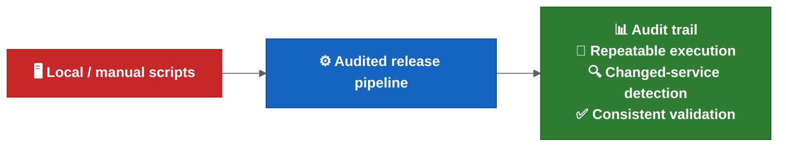

**Colour key:** Red = current local/manual execution · Blue = audited pipeline automation · Green = expected release-control benefits.

## Automation Work Mentioned

Existing scripts or automation steps appear to cover parts of the release process, including:

- Merging release branches into `master`.
- Cleaning up inactive release branches.
- Creating new release branches from `development`.
- Tagging release branches.
- Updating manifest merge requests with tags.
- Raising manifest merge requests in Cerberus deployment management.
- Comparing commits or services to identify what is in or out of a release branch.

Some of these steps currently require tweaking or are not fully automated yet.

## Current Automation Status

The current automation status is:

- Automation is being tested on the new configuration service.
- The scripts work locally.
- The remaining step is to get the automation and reporting running in Drone.
- The automation is expected to generate service chart changes, versions and tags.
- Release reports should help show what changed and what needs to be deployed.
- JIRA cross-reference is expected so the team can confirm that the release content matches the intended tickets.
- Changed-chart detection is being explored so the deployment logic can deploy only charts changed in the release.
- A Git pre-commit hook is in progress to reduce commits without MMA ticket references.
- Rollout may be possible within the next release or two, subject to confirmation.

For the end-to-end proposed flow, see [proposed release automation flow](docs/proposed-release-automation-flow.md).

For detailed findings around current Helm scripts and auto manifest tooling, see [deployment and release findings](docs/deployment-and-release-findings.md).

## Intended Direction

The proposed direction is:

- Move local scripts into pipelines.
- Reduce manual service chart management.
- Automatically identify what is in or out of a branch/release.
- Automate start-of-sprint and end-of-sprint release tasks.
- Reduce release work to one or two standard pipeline runs where practical.
- Roll the improved process out iteratively after review and team confirmation.

## Proposed Drone Rollout Checklist

Before the automation is treated as ready, confirm:

1. The pipeline runs successfully in Drone for the new configuration service.
2. Generated service chart changes are correct.
3. Generated versions are correct.
4. Generated tags are correct.
5. The release report is produced by the pipeline.
6. The release report includes the expected JIRA/ticket cross-reference.
7. Changed-chart detection identifies the expected charts.
8. Changed-chart deployment has an audited override path.
9. The report is stored somewhere durable enough to survive feature branch deletion.
10. Remaining manual server chart work is documented.
11. Rollout communication has been sent to squads.

## Release Reporting

The release report should answer:

- Which charts changed?
- Which images changed?
- Which services changed?
- Which tickets are included?
- Which tags were generated or expected?
- Which service chart changes were generated?
- Which manifest changes are needed?
- Which items are ready to deploy?
- Which items are blocked or need manual review?
- Which team owns the change?
- Who the primary contact/assignee is.
- What the ticket status is at report generation time.

Suggested retention policy to confirm:

```text
Generate the report before feature branch cleanup.
Store the report as a pipeline artefact and/or in the release management location.
Keep the report long enough for release validation, audit and incident investigation.
```

## Commit Metadata

Reporting and JIRA cross-reference depend on consistent commit metadata.

Suggested rule to confirm:

```text
Every commit that is intended to appear in release reporting should reference the relevant MMA/JIRA ticket.
```

Examples:

```text
MMA-1234 Add customer eligibility validation
MMA-5678 Fix manifest version comparison
```

The pre-commit hook should prevent obvious missing ticket references, but it should not be the only control. Merge request validation or pipeline validation may still be needed.

## Merge Strategy

The preferred approach is a squash-style pattern to keep release branch history readable.

The important requirement is not the exact Git button by itself. The important requirement is that the merge commit into the release branch contains:

- Ticket number.
- Meaningful message.
- Enough context to act as changelog history.

Individual feature branch commits should ideally follow the same pattern because long-running feature branches may also be used for reporting before they are merged and deleted.

## Failure Handling And Alerting

The automation is expected to run after image build and Helm chart upload have succeeded.

If the final Git/chart/reporting step fails because of a transient system issue, it should be rerunnable. There is a known gap:

```text
There is not currently an alerting model for failed automation steps.
```

Suggested policy:

- Send Slack/email alert for failed automation steps before production rollout.
- Include repository, branch, release version, failed step, Drone job link and rerun guidance.
- Treat the final Git/chart/reporting step as safe to rerun after transient failure if image and Helm artefact creation already succeeded.
- Require manual intervention when rerun would conflict with a manual chart edit or unknown repository state.
- Keep human approval before higher-environment promotion and production.

For the full proposed policy, see [rollout decision proposals](docs/rollout-decision-proposals.md).

## Tag And Artefact Validation

Tags are critical because they trigger releasable artefact creation.

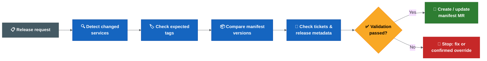

**Colour key:** Grey = release request/start · Blue = validation checks · Yellow = pass/fail decision · Green = continue/update manifest · Red = stop, fix or confirmed override.

Validation should make sure:

- The expected tag exists.
- The tag points to the expected release branch/commit.
- The tag version matches the intended release version.
- The artefact was built from the expected source.
- Helm artefacts were created successfully.
- Vulnerability and code quality scans completed according to the agreed policy.

## Manifest Validation

Manifest updates must match the service tags and artefacts being released.

Validation should make sure:

- Manifest versions match the release tags.
- Missing tags fail fast.
- Incorrect tag versions fail fast.
- Manifest merge requests include the expected services only.
- Current manifest versions are compared with update versions.
- Invalid or blocked ticket statuses are handled according to agreed rules.
- `do not deploy` markers are surfaced clearly and stop release unless explicitly overridden.
- `NA` tag entries are represented clearly and do not silently hide release-impacting changes.
- DB Liquibase exceptions are handled explicitly because one Liquibase update may affect multiple projects.

## Ticket And Release Metadata Validation

Observed script responsibilities include:

- Compare start tag and end tag.
- Identify tickets included in a release.
- Add or update release-related labels.
- Update the changelog.
- Check ticket status.
- Check whether the correct tag version has been entered.
- Detect blocked, invalid or missing release metadata.
- Create a release ticket.
- Create a manifest update branch/MR.
- Update chart versions from Jira GitLab tag fields.
- Write auto-manifest changelog entries.

The team should decide which cases are warnings and which cases must fail the pipeline.

## Possible Strict Validation Policy

Use a strict policy for release integrity:

```text
Wrong tag -> fail.
Missing tag -> fail.
Manifest/tag mismatch -> fail.
Invalid ticket status -> fail or require explicit override.
Unknown service ownership -> fail or require explicit release-owner confirmation.
Do-not-deploy marker -> fail unless release owner explicitly confirms an override.
```

Overrides may still be necessary, but they should be visible, confirmed and audited.

Items that still need explicit confirmation before strict enforcement:

- Whether wrong tags, missing tags and manifest/tag mismatch fail the release or only warn during a dry run.
- Which Jira statuses are valid, blocked or invalid for release.
- How `NA` tag entries are represented and when they are allowed.
- Who can confirm a validation override.
- Where the override evidence is stored.
- Where release reports are retained and how long they are kept.

## Auto Manifest And Tag Jump Follow-Up

Auto manifest and tag jump tooling should be reassessed against the proposed non-linear release branch model.

Follow-up needed:

- Decide whether tag jump checking is retired, replaced or adapted for the new branching model.
- Confirm whether strict mode should fail on wrong tags, missing tags and invalid ticket status.
- Confirm how `NA` GitLab tag entries are handled in reports.
- Confirm whether release label/tag metadata still uses the same Jira fields.
- Confirm whether local/workspace runs still require proxy setup for Jira access.

## Open Questions

- Which scripts are already reliable enough to move into pipelines?
- Which scripts need refactoring before pipeline execution?
- Who owns the standard release pipeline?
- Which pipeline steps require approval gates?
- How will the automation detect services with actual changes?
- What information should be included in the audit trail?
- What should fail immediately vs require manual approval or confirmed override?

## Related Best Practices

Validation gates, idempotent pipeline design, immutable artefacts, release metrics and supply-chain security considerations are summarised in [release engineering best practices](docs/release-engineering-best-practices.md).

---

> Source: `docs/hotfix-and-rollback.md`


# Hotfix And Rollback

This page captures the open hotfix and rollback questions.

Rollback and hotfix handling need to be clear because they affect the branching model, tag strategy, manifest updates and post-release reconciliation.

Open hotfix and rollback decisions are tracked in the [release decision register](docs/release-decision-register.md), especially D16, D17 and D18.

## Hotfix Current Understanding

Hotfixes should be possible from the production state, but the detailed flow still needs to be clarified.

There appear to be two distinct hotfix scenarios that need support:

### Production Hotfix (Critical Live Issue)

When a critical issue is found in production and no active release branch covers it:

```text
main / production state
  -> hotfix branch (from main)
  -> test and release hotfix
  -> update production
  -> merge hotfix back into main
  -> forward-merge hotfix into any active release branches
```

This is for urgent production fixes that cannot wait for the next release cycle.

### Release-Phase Hotfix (Issue Found During Release Preparation)

When an issue is found during release preparation or testing:

```text
active release branch
  -> hotfix branch (from release branch)
  -> test hotfix
  -> merge back into release branch
  -> release version incremented as normal
```

This is for fixes discovered during SIT, QAT or pre-production validation.

### Shared Behaviour

Both hotfix types share the following automation behaviour:

- Feature and hotfix branches are treated similarly by the automation.
- Commits on a hotfix branch should generate a deployable candidate and update the matching Cerberus chart branch.
- When merged into the target branch, the hotfix should increment the release version/tag like any other merged change.
- CVE and Renovate-style changes are expected to raise hotfix/MR work targeting the active release branch.

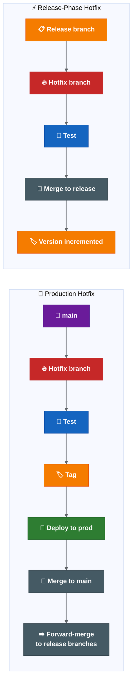

**Colour key:** Purple = production/main baseline · Red = hotfix branch · Blue = test step · Orange = tag/version or release branch · Green = production deployment · Grey = merge/reconciliation work.

## Hotfix Questions To Answer

- Who approves a hotfix merge?
- When is the hotfix tagged?
- How is the manifest updated?
- How is the hotfix forward-merged into active release branches?
- How do we prevent hotfix drift between production and `main`?
- How do CVE/Renovate hotfix branches get reviewed and prioritised during release work?
- What is the maximum acceptable time from hotfix decision to production deployment?

## Minimum Hotfix Operating Model To Confirm

Before production rollout, the team may want to confirm the following minimum model or replace it with a better one:

| Step | Production Hotfix Default | Release-Phase Hotfix Default | Approval / Evidence |
| --- | --- | --- | --- |
| Source branch | Known production baseline (`main` after cutover, current production branch before cutover). | Active release branch. | Release owner confirms source branch. |
| Approver | Release owner plus incident lead for critical production issues. | Release owner or delegated release approver. | Approval record linked to hotfix MR. |
| Tag timing | Tag after fix is reviewed, tested and accepted for production deployment. | Tag/version increment after merge back into release branch. | Tag and pipeline link. |
| Manifest update | Update manifest to the hotfix tag before production deploy. | Update release manifest as part of normal release preparation. | Manifest MR or deployment-management change. |
| Forward merge | Merge back to `main` and assess all active release branches. | Assess later active release branches before release closure. | Forward-merge checklist. |
| Closure | Confirm production state, manifest, release record and Jira are aligned. | Confirm release branch, manifest and report are aligned. | Release/hotfix closure note. |

## Rollback Current Understanding

Rollback appears to be technically possible through Helm, but it is not currently built into the automated deployment flow.

Current state:

```text
Rollback capability: technically possible through Helm
Automated rollback: not currently built into deployment flow
Operational rollback process: unclear / not fully standardised
Common practical response: fix-forward
```

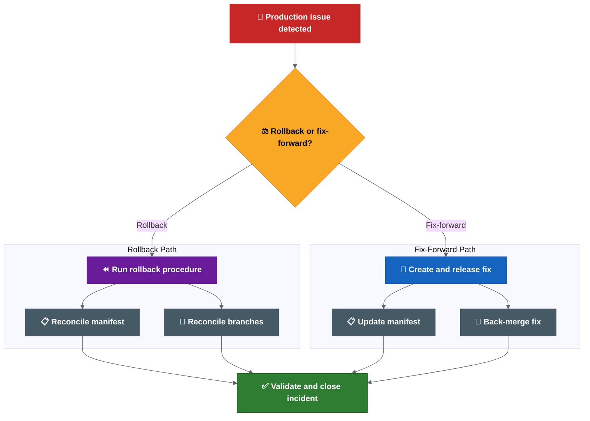

**Colour key:** Red = production issue · Yellow = rollback/fix-forward decision · Purple = rollback path · Blue = fix-forward path · Grey = reconciliation actions · Green = validated closure.

## Rollback Questions To Answer

- Is rollback a standard operating path or mostly an exception?
- When do we rollback vs fix-forward?
- Who owns the rollback decision?
- Who executes the rollback?
- Is rollback tested regularly?
- How are rollback actions audited?
- How are branches and manifests reconciled after rollback?

## Rollback vs Fix-Forward Decision Guide

The decision should be made by the release owner and incident lead, with input from the affected squad and platform owner.

| Situation | Default Decision | Why |
| --- | --- | --- |
| Bad deployment with no database or irreversible config change | Rollback candidate | Environment can likely return to the previous known-good release. |
| Defect can be fixed faster than rollback can be validated | Fix-forward candidate | Lower operational risk if the fix path is faster and clear. |
| Liquibase/data change has no rollback block | Fix-forward candidate | Database rollback may be unsafe or impossible. |
| Secret/config change is the failure cause | Case-by-case | May require config restore, secret rotation or both. |
| Security incident or exposed secret | Incident process first | Rotation and containment may matter more than application rollback. |
| Failed release partially deployed across services/charts | Stop and assess | Need manifest, chart and environment state before deciding. |

Every rollback or fix-forward decision should record:

- decision owner,
- reason,
- affected services/charts,
- database/config/secrets impact,
- selected rollback or fix-forward target,
- validation result,
- branch, manifest, release report and Jira reconciliation actions.

## What Exactly Rolls Back?

The rollback process should say whether rollback includes:

- Service image.
- Helm chart.
- Values/config.
- Manifest.
- Runbook changes.
- Secrets or environment variables.
- Database or data changes, where relevant.

If some items are not rolled back, the process should say so explicitly.

## Database And Liquibase Rollback

Database changes require special consideration because they are often forward-only.

### Current Understanding

- Liquibase is used for database schema and data changes.
- One Liquibase update may affect multiple projects.
- Liquibase changesets are typically applied once and tracked by checksum.
- There is no standard rollback block requirement documented.

### Proposed Rollback Rules

| Scenario | Action |
| --- | --- |
| Schema change with rollback block | Execute Liquibase rollback as part of the release rollback. |
| Schema change without rollback block | Fix-forward is likely the only safe option. Document why rollback is not possible. |
| Destructive data change (DROP, DELETE) | Cannot be rolled back. Fix-forward or restore from backup. Incident process applies. |
| Additive-only change (ADD COLUMN, new table) | May not need rollback if application code handles both states. |

### Suggested Practice

```text
Every production Liquibase changeset should include a rollback block or a documented justification for why rollback is not supported.
```

Release readiness for changes that include Liquibase should confirm:

1. Rollback block exists, or explicit documentation explains why not.
2. The change has been tested in a lower environment with the same rollback path.
3. The team understands whether fix-forward or rollback is the plan if the release fails.
4. If rollback is not possible, this is flagged in the release report.

## Branch And Manifest Reconciliation

Rollback is not only an environment action. It can create source-control and release-state questions.

The process should define:

- Whether `master` still reflects production after rollback.
- Whether the manifest is reverted or updated to the rollback version.
- Whether the failed release branch remains open.
- Whether a fix-forward branch is created.
- Whether `development` needs a revert, fix or follow-up merge.
- How the release notes/changelog reflect the rollback.

## Suggested Operating Principles

Useful principles to confirm:

- Hotfixes start from the known production baseline.
- `master` should stay aligned with production state.
- Hotfixes are back-merged into `development` and relevant active release branches.
- Rollback decisions are owned, documented and audited.
- Rollback instructions include code, chart, manifest, config and runbook impact.
- Fix-forward is allowed only when the risk is lower than rollback and the decision is explicit.

## Output Needed

The team should produce:

1. A documented hotfix flow.
2. A documented rollback flow.
3. A rollback vs fix-forward decision guide.
4. A branch reconciliation checklist.
5. A manifest reconciliation checklist.
6. Clear ownership for decision, execution and validation.

## Related Best Practices

Helm rollback limits, rollback runbook structure, hotfix time budgeting and Liquibase forward-only migration guidance are summarised in [release engineering best practices](docs/release-engineering-best-practices.md).

---

> Source: `docs/scope-ownership-approvals.md`


# Release Scope, Ownership And Approvals

This page captures the release scope, ownership and approval questions that should be clarified.

Open scope and ownership decisions are tracked in the [release decision register](docs/release-decision-register.md), especially D20 and D21.

## Why Scope Matters

The phrase "all services" needs a clear definition.

Release risk is not limited to source branches. It may also include Helm charts, manifests, configuration, secrets, runbooks and deployment management repositories.

If scope is unclear, automation may process too much, too little or the wrong thing.

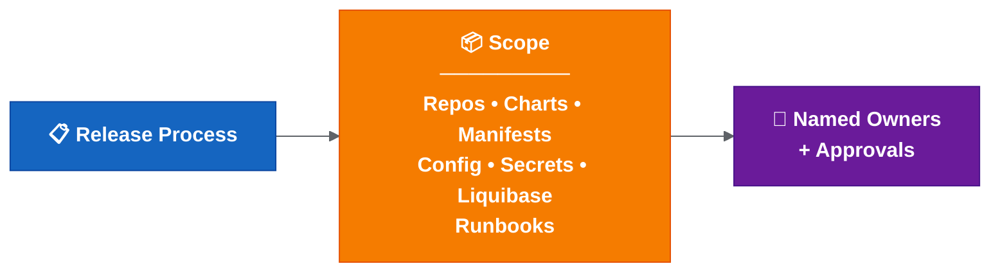

**Colour key:** Blue = release process · Orange = explicit release scope · Purple = named owners and approvals.

## Ownership Gap

Automation cannot replace accountability. If an automated step fails, someone still needs to decide whether to rerun, override, stop, roll back or fix forward. Without named owners, decisions are delayed and escalation is unclear.

| Area | Accountable Owner Needed | Why |
| --- | --- | --- |
| Release readiness | Release owner | Confirms release can progress. |
| Manifest/tag validation | Release owner / platform owner | Prevents wrong artefacts. |
| Drone secrets/tokens | Platform owner | Prevents environment failures. |
| Hotfix decision | Release owner / incident lead | Avoids production drift. |
| Rollback decision | Release owner / incident lead | Ensures fast incident response. |
| Changed-chart exclusion | Release owner | Prevents hidden deployment gaps. |
| Environment readiness | Platform / environment owner | Confirms deployability. |
| Alert response | Named squad/platform owner | Ensures failed automation is handled. |

## Repositories To Classify

Confirm whether these are in scope for the same release process:

- Service repositories.
- Helm chart repositories.
- Cerberus deployment management repository.
- Manifest repositories.
- Secrets/config repositories.
- Liquibase/database change repositories or scripts.
- Runbook repositories.
- Any release metadata or changelog repositories.

## Service Scope Questions

- What does "all services" mean in practice?
- Are release branches created for all services or only changed services?
- Can the automation detect services with actual changes?
- Are there services without clear squad ownership?
- Are shared libraries or shared charts included?
- Are environment-only changes included in the same release scope?
- Are secrets and Liquibase/database changes included in the same release readiness check?

## Change Types To Track

A production or feature change may involve more than application code.

Track whether each release includes:

| Change Type | Proposed Inclusion Status | Decision Needed | Notes |
| --- | --- | --- | --- |
| Application/service code | In scope by default | Confirm repository list | Service repository changes. |
| Service chart changes | In scope when changed | Confirm automation/manual boundary | May remain partly manual until Drone pipelines are updated. |
| Manifest updates | In scope by default | Confirm source of truth and approval point | Must match generated/expected tags. |
| Secrets/config changes | Needs decision per release | Confirm ownership and audit path | Needs careful handling and audit trail. |
| Liquibase/database changes | Needs decision per release | Confirm rollback/fix-forward plan | Needs release sequencing and rollback consideration. |
| Runbook steps | Needs decision per release | Confirm evidence and execution owner | Needed for manual or environment-specific operations. |

The release report should make these statuses visible for each release. If an item is excluded, the release owner should record the reason and approver.

## New Environment Readiness

Several setup points apply for new dev/test environments.

**An environment existing in Kubernetes does not mean it is release-ready.**

Before a new environment is treated as release-ready, confirm:

- [ ] Values files exist and match naming expectations.
- [ ] Environment name is supported by deployment scripts.
- [ ] Drone secrets/tokens are configured.
- [ ] Kube/robot token ownership is clear.
- [ ] Required secrets are present and encrypted correctly.
- [ ] Feature flag defaults are known and documented.
- [ ] External integrations are reachable.
- [ ] Required runbook steps are documented.
- [ ] Access and permissions are confirmed.
- [ ] Smoke test path is known and executable.

Known setup areas to verify:

- Required values files exist.
- Environment names are configured in the relevant setup/deploy scripts.
- Drone secrets/tokens exist for the environment.
- Kube/robot token ownership is clear.
- ACU responsibilities are clear where token/environment provisioning depends on them.
- Deployment scope behaviour is known for live, historical or both.
- Secret chart entries exist and use the expected encrypted format.

## Cross-Repository Ticket Grouping

The proposed automation relies heavily on consistent ticket and branch naming.

If multiple repositories use the same ticket/branch name, their changes should update the same Cerberus chart branch. This allows one feature ticket to group service, config, secret, Liquibase and runbook changes together for deployment/testing.

Open items:

- Confirm the exact branch/ticket naming rule.
- Confirm which repositories participate in cross-repo grouping.
- Confirm what happens when one ticket depends on another ticket/branch.
- Confirm who can manually adjust chart entries for cross-ticket dependencies.
- Confirm who owns secret/config updates when the change spans multiple repositories.

## Ownership Areas

Ownership should be explicit for:

- Merge approval into `development`.
- Release branch creation.
- Tag creation.
- Manifest update.
- Release readiness for each service.
- Deployment execution.
- QAT approval.
- Production release approval.
- Hotfix approval.
- Rollback decision and execution.
- Post-release validation.
- Branch and manifest reconciliation.

## Approval Points

Potential approval points:

- Merge to `development`.
- Release branch cut.
- Tag creation.
- Manifest merge request.
- Promotion to SIT.
- Promotion to higher environments.
- QAT approval.
- Production release.
- Rollback or fix-forward decision.
- Post-release closure.

The team should decide which approval points are mandatory and which can be automated.

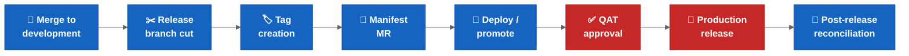

**Colour key:** Blue = release process step · Red = mandatory approval gate.

## Ownership Matrix Template

| Activity | Owner | Approver | Backup | Evidence |
| --- | --- | --- | --- | --- |
| Merge to `development` | Squad developer | Squad lead / peer reviewer | Another squad member | Merge request |
| Create release branch | Automation (Gareth/Achilles during pilot) | Release owner | Backup owner to assign | Pipeline/job link |
| Create service tag | Automation or release management | Release owner | Backup owner to assign | Tag + pipeline link |
| Update manifest | Automation (Gareth/Achilles during pilot) | Release owner | Backup owner to assign | Manifest MR |
| Deploy to lower environment | Squad developer | Squad lead | Another squad member | Deployment job |
| Deploy to SIT and above | Release management | Release owner | Backup owner to assign | Deployment job |
| QAT approval | QAT team | QAT lead | Backup owner to assign | Approval record |
| Production release | Release management | Release owner | Backup owner to assign | Release record |
| Hotfix | Squad developer (implements fix) | Release owner (approves) + incident lead (decides urgency) | Backup owner to assign | Hotfix MR/tag |
| Rollback | Platform / DevOps (executes) | Release owner (approves) + incident lead (decides) | Backup owner to assign | Rollback record |
| Post-release reconciliation | Automation + release owner | Release owner | Backup owner to assign | Merge records |

Note: Backup owners still need to be confirmed with team leads before rollout expansion. Known automation ownership sits with Gareth/Achilles for the pilot phase only; the long-term owner should be recorded in the [release decision register](docs/release-decision-register.md).

## Access And Operational Constraints

The release process should document operational constraints, including:

- Whether Thursday is the standard release day.
- Whether PNR room/location access is required for higher environments.
- Which commands require tools pod access.
- Which steps depend on environment variables or secrets.
- Which runbook steps must be executed alongside release.
- How secret exposure during screen sharing/recording is prevented.
- What happens if a secret is exposed and rotation is required.

## Output Needed

The team should produce:

1. A repository scope list.
2. A service scope list.
3. A service ownership list.
4. A release approval map.
5. A manual access/runbook checklist.
6. A post-release reconciliation owner and checklist.

## Related Best Practices

RACI, CODEOWNERS, branch protection, platform-vs-squad ownership and release-train guidance are summarised in [release engineering best practices](docs/release-engineering-best-practices.md).

---

> Source: `docs/rollout-decision-proposals.md`


# Rollout Decision Proposals - Summary

These are proposed discussion points that still need release/process-owner confirmation.

Confirmation status, accountable owner gaps and evidence requirements are tracked in the [release decision register](docs/release-decision-register.md).

This page is intentionally short. For rationale and detailed procedures, see [Rollout Decision Proposals - Detailed Rationale](docs/reference/rollout-decision-proposals-detailed.md).

## Decision Summary

| No | Area | Proposed Discussion Point | Confirmation Status |
| --- | --- | --- | --- |
| 1 | Branch baseline | Move to `main` as the production/live baseline after an agreed cutover release. | Needs confirmation |
| 2 | Production sync | No release is closed until the released state is reconciled back to `main`. | Needs confirmation |
| 3 | Release branches | Auto-create release branches at the start of each sprint/release from `main`. | Needs confirmation |
| 4 | Feature/hotfix branches | Create feature and release-phase hotfix branches from the relevant release branch. | Needs confirmation |
| 5 | Multiple active releases | Forward-merge production/release fixes into later active release branches before closure. | Needs owner |
| 6 | Changed-chart deployment | Deploy changed charts by default; require confirmed override to exclude one. | Needs confirmation |
| 7 | Quality gates | Keep human approval before higher-environment promotion and production. | Needs confirmation |
| 8 | Failure handling | Make final Git/chart/reporting steps idempotent and rerunnable. | Needs confirmation |
| 9 | Alerting | Add Slack/email alerts for failed automation steps before production rollout. | Needs owner |
| 10 | Shared dev | Roll out shared dev deployment in phases, starting with manual trigger. | Proposed |
| 11 | Ephemeral environments | Keep ephemeral branch environments out of scope for now. | Proposed |
| 12 | New environments | Treat new dev/test environments as ready only after values, Drone secrets/tokens and setup scripts are confirmed. | Needs confirmation |
| 13 | Auto manifest validation | Fail on wrong tag, missing tag, manifest/tag mismatch and do-not-deploy markers unless explicitly overridden. | Needs confirmation |
| 14 | Rollback reconciliation | After rollback, reconcile `main`, manifests, release records and JIRA tickets to match actual production state. | Needs confirmation |
| 15 | Tag jump checker | Retire after the new validation is green for two consecutive releases. | Proposed |

## Highest-Risk Decisions

These decisions should be confirmed first because they control release safety:

1. `main` should start from confirmed production state, not from `development`.
2. Wrong tag, missing tag and manifest/tag mismatch should fail fast.
3. Changed chart exclusions need release-owner confirmation and an audit note.
4. Rollback should reconcile branch, manifest, release report and JIRA state.
5. Failed automation needs an alert owner and safe rerun procedure.

## Cutover Guardrails

Avoid cutting over to `main = production` until:

- production state is tied to a known branch/tag/manifest,
- Drone pilot is green,
- branch protections are ready,
- open work on `development` is inventoried,
- hotfix and rollback reconciliation are confirmed,
- release owner and backup owner are named.

## Confirmation Checklist

Before rollout, the team may want to confirm or amend:

- cutover release and `main` branch protection,
- release branch naming and source branch,
- repository scope for auto-created release branches,
- forward-merge ownership,
- changed-chart deployment override rule,
- quality gates and human approval points,
- rerun/manual intervention procedure,
- alerting channels and owners,
- shared dev rollout phase,
- new environment readiness checklist,
- manifest/tag validation strictness,
- rollback reconciliation procedure,
- tag jump checker retirement plan.

## Related Detail

- Full decision rationale: [detailed rollout decision proposals](docs/reference/rollout-decision-proposals-detailed.md)
- Confirmation tracker: [release decision register](docs/release-decision-register.md)
- Rollout execution practices: [release engineering best practices](docs/release-engineering-best-practices.md)
- Ownership model: [release scope, ownership and approvals](docs/scope-ownership-approvals.md)

---

> Source: `docs/release-decision-register.md`


# Release Decision Register

This page is a working register for decisions that appear to need confirmation, rejection or explicit deferral before rollout behaviour changes.

The notes describe possible defaults. This register tracks whether those defaults have actually been discussed and agreed by the relevant owners.

## Status Definitions

| Status | Meaning |
| --- | --- |
| Proposed | A possible default exists, but the decision is not confirmed. |
| Needs confirmation | The decision needs confirmation before rollout expansion or branch cutover. |
| Needs owner | The decision cannot be executed until a named accountable owner and backup are assigned. |
| Confirmed | The relevant owner has confirmed the decision and evidence is recorded. |
| Deferred | The decision is intentionally out of scope for the current rollout. |
| Rejected | The proposal was not accepted; the replacement decision should be recorded. |

## Decision Register

| ID | Decision Area | Possible Default / Working Assumption | Current Status | Accountable Owner Needed | Confirmer Needed | Required Before | Evidence To Record |
| --- | --- | --- | --- | --- | --- | --- | --- |
| D01 | Branch baseline | Move to `main` as the production/live baseline after an agreed cutover release. | Needs confirmation | Release owner | Release/process owner + repo owners | Branch cutover | Cutover release, source branch/tag, branch protection record |
| D02 | Production sync | Avoid closing a release until production state is reconciled back to `main`. | Needs confirmation | Release owner | Release/process owner | First production rollout under new model | Merge record, release report, manifest state |
| D03 | Release branch creation | Auto-create release branches from `main` for every in-scope repository that needs one. | Needs confirmation | Automation owner | Release owner | Drone rollout expansion | Pipeline job link, repository scope list |
| D04 | Feature and hotfix branch source | Create feature and release-phase hotfix branches from the relevant release branch. | Needs confirmation | Squad lead / release owner | Release owner | Pilot squad briefing | Branch naming rule, squad guidance |
| D05 | Multiple active releases | Forward-merge production/release fixes into later active release branches before closure. | Needs owner | Release owner | Engineering managers | Before multiple active release branches are used | Forward-merge checklist and owner |
| D06 | Changed-chart deployment | Deploy changed charts by default; require confirmed override to exclude one. | Needs confirmation | Release owner | Release owner + platform owner | Changed-chart deployment rollout | Override record with reason and approver |
| D07 | Quality gates | Keep human approval before higher-environment promotion and production. | Needs confirmation | Release owner | Release/process owner + QAT lead | Production rollout | Approval workflow and evidence location |
| D08 | Failure handling | Make final Git/chart/reporting steps idempotent and rerunnable after transient failures. | Needs confirmation | Automation owner | Platform owner | Drone rollout expansion | Rerun procedure, pipeline evidence |
| D09 | Alerting | Add Slack/email alerts for failed automation steps before production rollout. | Needs owner | Platform owner | Release owner | Production rollout | Alert channel, owner rota, sample alert |
| D10 | Shared dev rollout | Roll out shared dev deployment in phases, starting with manual trigger. | Proposed | Platform owner | Release/process owner | Shared dev automation rollout | Rollout phase plan |
| D11 | Ephemeral environments | Keep ephemeral branch environments out of scope for now. | Proposed | Platform owner | Engineering leadership | Current scope confirmation | Scope note |
| D12 | New environment readiness | Treat environments as ready only after values, secrets/tokens and setup scripts are confirmed. | Needs confirmation | Platform/environment owner | Platform owner | Any new dev/test environment rollout | Completed readiness checklist |
| D13 | Manifest/tag validation | Fail on wrong tag, missing tag, manifest/tag mismatch and `do not deploy` markers unless explicitly overridden. | Needs confirmation | Platform / DevOps | Release owner + platform owner | Strict validation rollout | Validation rules, override record |
| D14 | `NA` tag entries | Avoid letting `NA` tag entries silently hide release-impacting changes; define when they are allowed. | Needs confirmation | Platform / DevOps | Release owner | Strict validation rollout | `NA` handling rule |
| D15 | Ticket status validation | Define which Jira statuses are valid, blocked or invalid for release. | Needs confirmation | Release owner | Release/process owner | Strict validation rollout | Status mapping |
| D16 | Rollback reconciliation | After rollback, reconcile `main`, manifests, release records and Jira tickets to actual production state. | Needs confirmation | Release owner + incident lead | Release/process owner | Production rollout | Rollback record, reconciliation checklist |
| D17 | Rollback vs fix-forward | Define when rollback is standard, when fix-forward is safer, and who decides. | Needs confirmation | Incident lead | Release owner + incident lead | Production rollout | Decision guide |
| D18 | Hotfix confirmation, approval route and tagging | Define hotfix confirmer/approver, tag timing, manifest update and forward-merge route. | Needs confirmation | Release owner | Release/process owner | Production hotfix readiness | Hotfix runbook |
| D19 | Tag jump checker retirement | Retire the tag jump checker only after new validation is green for two consecutive releases. | Proposed | Platform / DevOps | Release owner + platform owner | Tool retirement | Two green release records |
| D20 | Release scope | Define what "all services" means and which repositories/change types are included. | Needs confirmation | Release owner | Engineering managers | Rollout expansion | Repository and change-type scope list |
| D21 | Ownership matrix | Replace placeholders with named owners, approvers and backups. | Needs owner | Engineering managers | Release/process owner | Rollout expansion | Signed ownership matrix |
| D22 | Release report location | Define where release reports are published, retained and linked from. | Needs confirmation | Release owner | Release/process owner | Drone rollout expansion | Retention rule, report location |
| D23 | First rollout candidate | Confirm the first release/repository set that will use the new process. | Needs confirmation | Release owner | Engineering managers | Pilot start | Pilot scope and go/no-go result |

## Immediate Closure Order

1. Confirm D20 and D21 so scope and ownership are known.
2. Confirm D13, D14 and D15 before strict validation moves from dry-run to enforcement.
3. Confirm D16, D17 and D18 before production rollout.
4. Confirm D01, D02 and D05 before branch cutover.
5. Confirm D08, D09 and D22 before automation is used as the normal release path.

## Related Documents

- [Rollout decision proposals](docs/rollout-decision-proposals.md)
- [Release scope, ownership and approvals](docs/scope-ownership-approvals.md)
- [Hotfix and rollback](docs/hotfix-and-rollback.md)
- [Automation and validation](docs/automation-and-validation.md)
- [Improvement notes and maturity observations](docs/transformation-programme.md)

---

> Source: `docs/transformation-programme.md`


# Improvement Notes And Maturity Observations

This page captures maturity observations, possible improvement principles and a possible target shape for discussion.

It is not a committed transformation mandate. It is a working note to help confirm what needs to improve, who may need to be involved and which assumptions still need validation.

## Root Cause Analysis

| Problem | Root Cause | Evidence |
| --- | --- | --- |
| Failed or wrong release | Environment mismatch; tag/manifest validation not enforced. | Multiple tag versions created for same release (e.g. 581, 582, 583, 584). |
| Delayed release | Manual coordination across people, scripts and repos. | Release preparation reported to take days per sprint. |
| Rollback uncertainty | No tested operational rollback process; Liquibase may be forward-only. | Recent practical behaviour leans towards fix-forward. |
| Testing inconsistencies | Environment drift; lower envs deployed ad hoc while higher envs use chart releases. | Pre-prod may contain more data than production. |
| Unclear release content | Release metadata spread across Jira, Git tags, manifests and scripts. | Tag jump checker sometimes passes when it should fail. |
| Ownership confusion | RACI not assigned; "release management" is a function, not a named person per release. | Ownership matrix still requires named backup owners and formal confirmation. |

## Risk Assessment

| # | Risk | Likelihood | Impact | Priority | Mitigation |
| --- | --- | --- | --- | --- | --- |
| R1 | Production outage from wrong artefact. | Medium | Critical | P1 | Strict tag/manifest validation; fail on mismatch. |
| R2 | Extended incident due to no rollback process. | Medium | Critical | P1 | Document and test rollback flow; define time budget. |
| R3 | Release delays from manual coordination. | High | Medium | P2 | Automation pilot; Drone as agreed release path once proven. |
| R4 | Partial release (missing secrets/config/DB). | High | High | P1 | Explicit release scope checklist per release. |
| R5 | Audit failure from weak release trail. | Medium | High | P2 | Pipeline-generated release reports; immutable artefacts. |
| R6 | Environment failure at deploy time. | Medium | Medium | P3 | Explicit environment readiness gate. |
| R7 | Escalation confusion during incident. | High | Medium | P2 | Named owners per RACI. |
| R8 | Trunk-based instability. | Low (if deferred) | High | P3 | Avoid adopting trunk-based until feature flags mature. |

## Current Release Maturity Observations

| Area | Current Score | Possible Target Score | Gap |
| --- | --- | --- | --- |
| Source control and branching | 3.0 / 5 | 4.5 / 5 | Branch model clear but reconciliation and automation incomplete. |
| CI/CD pipeline | 3.0 / 5 | 4.5 / 5 | Pipeline exists but release steps are local/manual. |
| Release validation | 2.0 / 5 | 4.5 / 5 | Scripts exist but fail/warn policy not enforced. |
| Deployment automation | 2.5 / 5 | 4.0 / 5 | Helm/Drone works but manual chart updates and triggers remain. |
| Observability and monitoring | 2.0 / 5 | 4.0 / 5 | Health checks exist; no release-correlated observability gates. |
| Release governance and ownership | 2.0 / 5 | 4.5 / 5 | Templates exist; named owners and approval map need confirmation. |
| Hotfix and rollback | 1.5 / 5 | 4.0 / 5 | Technical capability exists; no tested operational process. |
| Environment management | 2.5 / 5 | 4.0 / 5 | Environments exist but readiness is not gated. |
| Secrets and config management | 2.5 / 5 | 4.0 / 5 | Git-crypt works but onboarding and rotation are heavy. |
| Release reporting and audit | 2.0 / 5 | 4.5 / 5 | Scripts generate some metadata; not yet pipeline-driven or mandatory. |

**Overall: Current 2.3 / 5 -> Possible target 4.3 / 5**

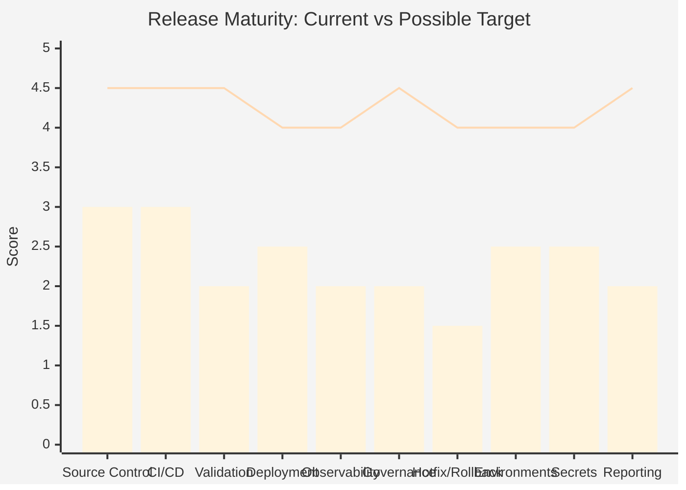

## Working Improvement Principles

1. **Avoid changing the branching model first.** Stabilise the release operating model before simplifying branches.
2. **Standardise release metadata.** Every release should be traceable from commit to production through tags, manifests, reports and Jira.
3. **Automate before reorganising.** Prove the automation works with the current model before introducing a new one.
4. **Improve visibility before restructuring.** Release reports, dashboards and alerting can make problems visible so they can be fixed.
5. **Reduce manual release activities where safe.** Every manual step is a consistency risk and a scaling bottleneck.
6. **Make ownership explicit.** Unnamed responsibilities tend to become unowned responsibilities.
7. **Test rollback before you need it.** A rollback process that has never been tested is not a reliable rollback process.
8. **Treat environment readiness as a gate, not an assumption.** An existing namespace is not necessarily a ready environment.

## Possible Target Operating Shape

### Current vs Target

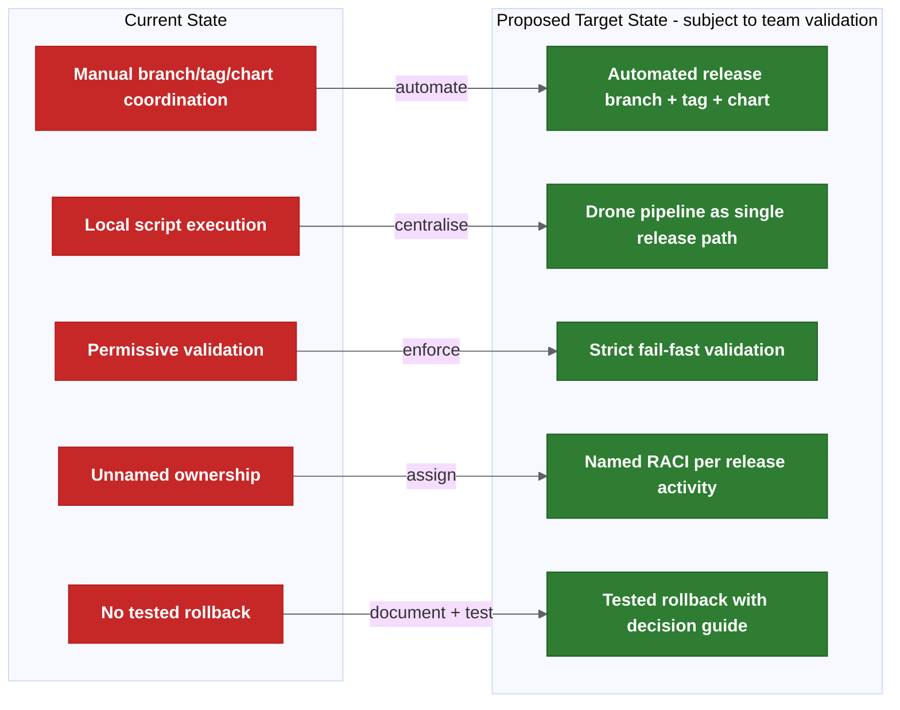

**Colour key:** Red = current-state weakness · Green = possible target control.

### Possible Target End State - Subject To Team Validation

```text
- main = production baseline (always).
- Release branches auto-created, short-lived (proposed: 1-2 sprint duration — needs confirmation).
- Feature/hotfix branches auto-generate deployable candidates.
- Cerberus charts auto-updated on merge.
- Changed-chart detection deploys only what changed.
- Release reports auto-generated with Jira cross-reference.
- Strict validation enforced (wrong tag = fail).
- Named owners for every release activity.
- Rollback tested and documented.
- Environment readiness gated.
- Alerting for all automation failures.
```

## Possible Future Topics - Not In Current Scope

After release metadata, strict validation, ownership, rollback and audit reporting are stable, the team may want to separately discuss:

- read-only release/deployment visibility across Git, Drone, Helm, deployment-management, Jira and Kubernetes,
- stronger observability links from release records to post-deploy health,
- longer-term platform dashboards for audit and incident investigation.

These topics are not part of the current KT-notes scope and would need separate ownership, evidence and review.

---

> Source: `docs/transformation-programme-delivery.md`


# Possible Improvement Path And Delivery Notes

This page contains an indicative improvement path, governance notes, possible metrics and discussion points for the release process.

For root cause notes, risk observations, maturity scorecard and possible target operating shape, see [improvement notes and maturity observations](docs/transformation-programme.md).

## Possible Phased Improvement Path

The phases below are indicative only. Actual timing depends on team confirmation, named owners, pilot evidence and agreement on exit criteria. Phase 0 remains open until the rollout decisions are confirmed, named owners/backups are assigned and exit criteria are published. See the [release decision register](docs/release-decision-register.md) for the live confirmation tracker.

| Phase | Timeframe | Focus | Key Deliverables |
| --- | --- | --- | --- |
| 0 | Indicative: Week 1-2 | Decisions and ownership | Confirm rollout decisions; assign named owners; publish exit criteria. Status: active / not yet closed. |
| 1 | Indicative: Month 1 | Quick wins | Pre-commit hook; strict validation dry-run; environment readiness checklist; rollback documentation. Starts after Phase 0 decisions are closed. |
| 2 | Month 2-3 | Release automation | Drone pilot green; auto branch/tag/chart; release reporting; alerting. |
| 3 | Month 3-4 | Branch cutover | Controlled `main = production` cutover; branch protections; forward-merge rules active. |
| 4 | Month 4-6 | Scale and harden | Changed-chart deployment default; shared dev auto-deploy; rerun safety; full RACI enforcement. |
| 5 | Month 6-12 | Modernise | Runtime feature flags; External Secrets Operator; SBOM generation; observability gates evaluation. |

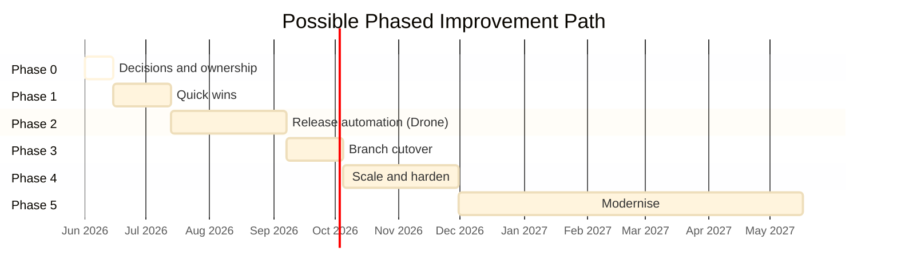

## Prioritisation Matrix

| Improvement Area | Impact | Effort | Priority Quadrant |
| --- | --- | --- | --- |
| Strict tag/manifest validation | High | Low | **Do first** |
| Release metadata standardisation | High | Low | **Do first** |
| Named ownership (RACI) | High | Low | **Do first** |
| Rollback documentation and testing | High | Medium | **Do first** |
| Environment readiness gate | High | Low | **Do first** |
| Drone release automation pilot | High | Medium | **Do next** |
| Release reporting dashboard | High | Medium | **Do next** |
| Changed-chart detection and deployment | High | Medium | **Do next** |
| Alerting for failed automation | Medium | Low | **Do next** |
| Branch cutover (`main = production`) | Medium | Medium | **Plan** |
| External Secrets Operator | Medium | Medium | **Plan** |
| Runtime feature flags | Medium | High | **Defer** |
| SBOM generation | Low-Medium | Low | **Plan** |
| Trunk-based development | Medium | Very High | **Defer** |

## RACI Matrix

| Activity | Dev / Squad | Tech Lead | Architect | Platform / DevOps | Release Owner | QAT | Incident Lead |
| --- | --- | --- | --- | --- | --- | --- | --- |
| Feature development | R | A | C | I | I | I | I |
| Merge to release branch | R | A | I | I | I | I | I |
| Release branch creation | I | I | I | R | A | I | I |
| Tag and artefact build | I | I | I | R | A | I | I |
| Manifest validation | I | C | C | R | A | I | I |
| Deploy to lower environments | R | A | I | C | I | I | I |
| Deploy to SIT and above | I | C | I | R | A | C | I |
| Functional validation | C | I | I | I | I | R/A | I |
| Production release approval | I | C | C | C | A | R | I |
| Hotfix decision | R (implements) | C | C | R (executes) | A | I | C (decides urgency) |
| Rollback decision | I | C | C | R (executes) | A | I | R (decides) |
| Post-release reconciliation | I | I | I | R | A | I | I |
| Environment readiness | I | I | C | R/A | C | I | I |
| Alert response | R | A | I | R | C | I | C |
| Release reporting | I | I | C | R | A | I | I |
| Incident investigation | C | C | I | R | C | I | A |

Legend: R = Responsible, A = Accountable, C = Consulted, I = Informed.

Note: Named individuals still need to be assigned. This matrix defines roles, not people. Incident Lead is the designated on-call or incident manager during an active incident. Needs confirmation with team leads.

## Potential Metrics To Baseline

Current values are estimates based on available notes and would need actual baseline measurement before becoming targets.

| Metric | Current (Estimated) | Possible Phase 2 Target | Possible Phase 4 Target | Measurement Source |
| --- | --- | --- | --- | --- |
| Deployment frequency | Monthly (approx.) | Fortnightly | Weekly | Drone pipeline history |
| Lead time (commit to production) | 10-15 days (estimated) | 5-7 days | 2-3 days | Git + Drone timestamps |
| Change failure rate | Unknown (estimated 10-15%) | < 5% | < 2% | Incident records |
| Mean time to restore (MTTR) | Unknown (estimated 4-8h) | < 2h | < 1h | Incident records |
| Release preparation effort | Days per sprint | < 1 day | < 2 hours | Team time tracking |
| Manual steps per release | 10+ (estimated) | < 5 | < 2 (confirm + trigger) | Process audit |
| Release report accuracy | Partial / manual | Auto-generated, reviewed | Auto-generated, trusted | Pipeline artefacts |
| Rollback test frequency | Never tested | Tested once per quarter | Tested every release cycle | Runbook execution log |
| Environment readiness failures | Unknown | Tracked and gated | Zero (gated) | Pre-deployment checks |

Note: these are suggested metrics, not committed targets.

## Cost / Benefit Analysis

| Improvement | Estimated Cost | Expected Benefit | Payback |
| --- | --- | --- | --- |
| Strict validation (fail-fast) | Low (script/config change) | Prevents wrong artefacts reaching production. | Immediate |
| Named ownership (RACI) | Low (management decision) | Faster decisions during incidents and releases. | Immediate |
| Rollback documentation | Low-Medium (documentation + testing) | Confidence for production incidents. | First incident avoided |
| Drone release automation | Medium (pilot + rollout) | Days saved per sprint; consistent execution. | 2-3 releases |
| Release reporting dashboard | Medium (tooling + pipeline) | Visibility for all stakeholders; audit trail. | Ongoing |
| Environment readiness gate | Low (checklist + pre-deploy check) | Eliminates late release failures. | First prevented failure |
| Changed-chart deployment | Medium (detection logic + validation) | Faster deploys; no unnecessary chart pushes. | Ongoing |
| External Secrets Operator | Medium (infrastructure + migration) | Simpler rotation; better audit; easier onboarding. | 6 months |
| Trunk-based development | Very High (culture + tooling + flags) | Uncertain until feature flags and validation mature. | Unknown |

## Suggested Investment Focus

> **A useful investment focus may be release governance, environment standardisation and deployment automation rather than immediate branching model replacement.**

The highest-return investments are low-cost, high-impact changes (strict validation, ownership, environment readiness) combined with the medium-cost automation pilot already in progress. Branch model simplification and platform modernisation should follow only once the operating model is stable and measurable.

## Top 10 Improvement Areas For Discussion

| # | Improvement Area | Indicative Phase |
| --- | --- | --- |
| 1 | Standardise release metadata (tags, manifests, Jira fields, commit format). | 0-1 |
| 2 | Establish release governance (named owners, approval map, RACI). | 0 |
| 3 | Enforce strict release validation (wrong/missing tag = fail). | 1 |
| 4 | Complete Drone release automation pilot. | 2 |
| 5 | Document and test rollback process. | 1 |
| 6 | Formalise environment readiness as a deployment gate. | 1 |
| 7 | Create release reporting dashboard. | 2 |
| 8 | Introduce release KPIs (DORA metrics + custom). | 2 |
| 9 | Strengthen audit trail (pipeline artefacts, immutable reports). | 2-3 |
| 10 | Re-evaluate branching strategy after maturity improvements (Phase 4+). | 4+ |

**Long-term note:** Future platform capabilities should be treated as separate product decisions, not as part of the first automation rollout.

---

> Source: `docs/platform-engineering-strategy.md`


# Platform Engineering Strategy

This page covers the platform-level capabilities that directly strengthen the release-management proposal: environment promotion, deployment strategy and observability gates.

## 1. Environment Promotion Model

### Current State

The current promotion path is understood but not formally documented as a model:

```text
Squad dev/test → Shared dev → SIT → B.Val / Pre-prod → Production
```

Promotion today is largely manual: a person triggers deployment to the next environment after the previous one passes some form of validation.

### Possible Promotion Model

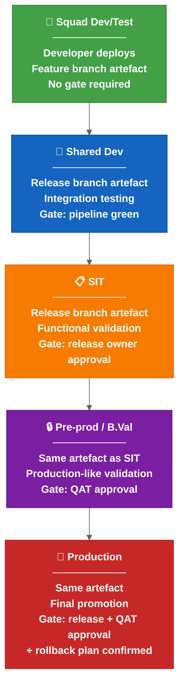

**Colour key:** Green = squad dev/test · Blue = shared dev · Orange = SIT · Purple = pre-prod / B.Val · Red = production.

### Promotion Rules

| Rule | Description |
| --- | --- |
| Immutable artefact | The same container image and Helm package moves through all environments. Never rebuild for a higher environment. |
| Environment-specific config only | Values files, secrets and feature flags are the only things that change between environments. |
| Gate before promotion | Each promotion requires a defined gate to pass. No silent auto-promote to production. |
| Audit trail | Every promotion records: who, when, which version, which gate passed, link to pipeline. |
| No skipping | Cannot promote to production without passing through pre-prod. Exception: confirmed emergency hotfix with explicit release-owner sign-off. |

### Promotion Gate Matrix

| Environment | Trigger | Gate | Approver |
| --- | --- | --- | --- |
| Squad dev/test | Developer push/trigger | Pipeline green | None (self-service) |
| Shared dev | Merge to release branch | Pipeline green + chart update complete | Automated |
| SIT | Release owner decision | Release report generated + changed charts identified | Release owner |
| Pre-prod / B.Val | QAT progression | SIT functional validation complete | QAT lead |
| Production | Release approval | QAT approved + rollback plan + release report final | Release owner + QAT |

---

## 2. Deployment Strategy

### Current State

The current deployment approach appears to be a standard Kubernetes **rolling update**: pods are replaced in sequence, health checks confirm readiness, and Helm manages the upgrade.

This works but has limitations:
- If health checks pass but functional issues exist, the full rollout completes before the problem is detected.
- Rollback requires manual `helm rollback` or redeployment.
- There is no traffic-based validation before full rollout.

### Deployment Strategy Options

```mermaid
%%{init: {'theme': 'base', 'themeVariables': {'lineColor': '#5f6368'}}}%%

flowchart TD
  subgraph CURRENT["Current: Rolling Update"]
    R1["Replace pods sequentially"]:::current
    R2["Health check gates"]:::current
    R3["Full rollout or manual rollback"]:::current
    R1 --> R2 --> R3
  end

  subgraph NEXT["Near-term: Blue-Green"]
    B1["Deploy new version alongside old"]:::next
    B2["Validate new version (no traffic)"]:::next
    B3["Switch traffic atomically"]:::next
    B4["Instant rollback: switch back"]:::next
    B1 --> B2 --> B3 --> B4
  end

  classDef current fill:#455a64,stroke:#37474f,color:#fff,font-weight:bold
  classDef next fill:#1565c0,stroke:#0d47a1,color:#fff,font-weight:bold
```

**Colour key:** Grey = current rolling-update model · Blue = near-term blue-green option.

### Strategy Comparison

| Strategy | Rollback Speed | Infrastructure Cost | Complexity | Best For |
| --- | --- | --- | --- | --- |
| Rolling update | Minutes (manual) | 1x | Low | Simple services, low traffic |
| Blue-green | Instant (traffic switch) | 2x during deploy | Medium | Stateless services, critical path |

### Possible Adoption Path

```text
Phase 1 (Now): Rolling update with documented manual rollback procedure.
Phase 2 (After automation stable): Blue-green for critical services (API gateway, core services).
```

---

## 3. Observability Gates

### Current State

The current process checks:
- Pods started (health check).
- Deployment completed (Helm reports success).
- Basic monitoring may exist but is not integrated into the release pipeline.

There is no automated observability gate that validates release health against SLOs before or after promotion.

### Possible Target: Observability-Driven Release Validation

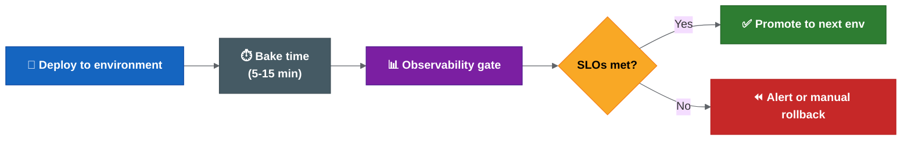

**Colour key:** Blue = deploy step · Grey = bake/wait period · Purple = observability gate · Yellow = SLO decision · Green = promote · Red = alert/manual rollback.

### Observability Gate Metrics

| Metric | What It Measures | Threshold Example | Source |
| --- | --- | --- | --- |
| Error rate (5xx) | Service returning errors | < 0.1% over bake period | Prometheus / OpenTelemetry |
| Latency P99 | Slowest requests | < 500ms (or < 2x baseline) | Prometheus / Datadog |
| Success rate | Requests completing successfully | > 99.9% | Application metrics |
| Pod restarts | Stability after deploy | 0 restarts in bake period | Kubernetes metrics |
| SLO burn rate | Rate of SLO budget consumption | < 1x normal burn | SLO platform |
| Business metric | Domain-specific health | No anomaly detected | Custom metrics |

### Implementation Options

| Approach | How It Works | Complexity |
| --- | --- | --- |
| Manual observability check | Human checks dashboards after deploy | Low (current state) |
| Pipeline metric query | Drone step queries Prometheus after deploy, fails if threshold breached | Medium |
| Keptn / Dynatrace | Full SLO-based quality gate evaluation | High |

### Possible Adoption Path

```text
Phase 1 (Now): Document key metrics and dashboards per service. Establish SLO targets.
Phase 2 (After Drone automation): Add a pipeline step that queries error rate and latency after deploy. Alert on breach.
```

### OpenTelemetry Integration

For services instrumented with OpenTelemetry:

```text
Traces → identify slow spans and error sources after deploy.
Metrics → feed observability gates (error rate, latency, throughput).
Logs → correlate errors with specific release version/commit.
```

The release report should include a link to the observability dashboard filtered by the deployed version, so reviewers can see the health state at a glance.

---

---

> Source: `docs/architecture-review/arb-package.md`


# Potential Future Architecture Review Considerations

Status: Optional review note / working reference.

## Possible ADR Topic: Controlled Release Foundation Before Future Platform Capabilities

### Context

Cerberus release state appears fragmented across Git, Drone, Helm, deployment-management, Jira, Kubernetes, secrets, Liquibase, runbooks and human approvals. If the team later seeks formal review, the near-term discussion would likely focus on release automation, stricter validation, clearer ownership, better evidence and tested recovery.

### Problem

The notes include both immediate release-control ideas and later platform-modernisation ideas. If these are treated as one approval scope, review risk increases. In a border-security context, automation must not create ungoverned deployment pathways or false confidence from incomplete release metadata.

### Options Considered

| Option | Description | Strengths | Weaknesses |
| --- | --- | --- | --- |
| A | Treat all improvement ideas as one programme. | Fast alignment, ambitious target. | Too much blast radius; unclear approvals. |
| B | Discuss controlled release-foundation work first. | Reduces risk, strengthens audit and ownership. | Slower path to platform intelligence. |
| C | Start future platform modernisation immediately. | Builds future capability early. | Data quality, ownership and governance not ready. |
| D | Do nothing beyond current process. | Avoids change risk. | Leaves current release and audit risks unresolved. |

### Suggested Position

Option B appears to be the safer discussion path: treat controlled release-foundation work separately from future platform modernisation, and gate later platform ideas on release metadata quality, ownership, security and operational evidence.

### Trade-Offs

| Trade-Off | Decision |
| --- | --- |
| Speed vs safety | Prefer controlled evolution and operational safety. |
| Automation vs human control | Automate evidence and repeatable steps; retain human approval for high-impact environments. |
| Centralisation vs resilience | Centralise visibility first; defer centralised control. |
| Innovation vs audit | Permit pilots only with audit, RBAC and source-of-truth discipline. |

### Consequences

- Release governance, validation, environment readiness and rollback become near-term priorities.
- Branch cutover is gated rather than assumed.
- Future platform capabilities are deferred until the release foundation has measurable evidence.

### Risks

| Risk | Mitigation |
| --- | --- |
| Teams expect immediate tooling rather than governance work. | Publish indicative phases and confirmation gates. |
| Automation becomes a hidden approval bypass. | Enforce SoD, approval records and manual gates. |
| Future-state architecture loses momentum. | Keep pilots on roadmap with measurable entry criteria. |
| Benefits remain unproven. | Start baseline measurement in Phase 1. |

### Potential Formal Review Questions

If this were reviewed formally, reviewers would likely want confirmation of:

1. Near-term release-foundation scope.
2. Explicit deferral of future platform trigger/action capabilities.
3. NFR and governance expectations below.
4. Conditions for moving from pilot to production rollout.

## Non-Functional Requirements

| Category | Target | Applies To | Evidence |
| --- | --- | --- | --- |
| Availability | Release automation evidence systems available during release windows. | Drone and release reports. | Availability dashboard and incident log. |
| Reliability | Release automation rerunnable for transient failures; no duplicate tags or chart updates. | Drone automation. | Idempotency tests and rerun records. |
| Security | RBAC, least privilege and no secret values in reports. | Release and reporting layers. | Access review and audit logs. |
| Auditability | Every approval, override, rerun, rollback and exclusion has a durable evidence link. | Release operating model. | Release record and report retention. |
| Performance | Standard release report generated within agreed release-window target. | Reporting. | Generation metrics. |
| Scalability | Support hundreds of services and multiple environments in release evidence and validation. | Release automation. | Capacity model and load test. |
| Data freshness | Release report data current at generation time. | Reporting. | Freshness metrics and alerts. |
| Data retention | Release evidence retained according to audit policy; minimum retention to be confirmed before rollout. | Reports, approvals, graph events. | Retention policy and purge logs. |
| Disaster recovery | Release evidence recoverable. Target RTO/RPO to be confirmed. | Reports. | DR test. |
| Compliance | Classification, SoD, privileged access, data sovereignty and change advisory alignment documented. | Whole package. | Security/architecture sign-off. |

## Possible Formal Review Conditions

| Condition | Required Before |
| --- | --- |
| Named release owner, platform owner, data owner and backups. | Rollout expansion. |
| Strict validation dry-run evidence. | Fail-fast enforcement. |
| Hotfix and rollback test completed. | Production rollout. |
| Environment readiness gate implemented. | New environment rollout. |
| Release report retention confirmed. | Drone rollout expansion. |
| Release metadata quality baseline measured. | Rollout expansion. |
| RBAC, audit and SoD confirmed. | Release automation expansion. |

---

> Source: `docs/architecture-review/business-case-and-roadmap.md`


# Potential Benefits And Roadmap Notes

Status: Optional review note / working reference.

## Potential Benefits To Validate

The values below are working assumptions and would need baseline measurement before being used as committed targets.

| Benefit | Current State | Possible Target State | KPI | Measurement Method |
| --- | --- | --- | --- | --- |
| Reduce release preparation effort | Days per sprint estimated. | Less than 1 day by Phase 2, less than 2 hours by Phase 4. | Release prep hours. | Time log plus release calendar. |
| Reduce wrong artefact risk | Tag and manifest validation not fully enforced. | Fail-fast validation with confirmed override process. | Validation failures caught before deploy. | Pipeline validation logs. |
| Improve incident investigation time | 30-60 minutes manual correlation estimated. | Less than 15 minutes for release-context evidence. | MTTI. | Incident timeline review. |
| Improve rollback decision speed | 15-30 minutes estimated to identify constraints. | Less than 5 minutes to identify rollback/fix-forward constraints. | Time to rollback decision. | Incident command log. |
| Improve audit readiness | Evidence spread across tools. | One release record links commit, tag, image, chart, manifest, approval and deploy. | Audit evidence retrieval time. | Audit drill. |
| Improve release metric visibility | Unknown or manual. | Weekly automated reporting after data maturity. | Deployment frequency, lead time, CFR, MTTR. | Git, Drone, incident records. |
| Reduce environment readiness failures | Unknown and not formally gated. | Zero deployments to unready environments. | Failed readiness checks. | Pre-deploy gate logs. |
| Reduce ownership escalation time | Owners not fully named. | Owner and backup visible for every release activity. | Time to identify owner. | Incident/release records. |

## KPI Baseline Plan

| KPI | Baseline Collection Window | Confidence |
| --- | --- | --- |
| Release prep hours | First 2 releases after review. | Medium, based on team reporting. |
| Validation failures | First 2 dry-run validation cycles. | High, pipeline data. |
| Incident investigation time | Next 3 incidents or incident drills. | Medium, sample size may be small. |
| Rollback decision time | Quarterly rollback drill. | Medium. |
| Audit evidence retrieval time | One audit simulation per release. | High. |
| Deployment frequency and lead time | 4 sprints of Git/Drone timestamps. | High. |

## Roadmap Review

| Phase | Current Plan Assessment | Hidden Risk | Discussion Point |
| --- | --- | --- | --- |
| Phase 0 | Useful focus on decisions and ownership. | May remain open if no accountable sponsor. | Add exit criteria and named decision forum. |
| Phase 1 | Good quick wins. | Strict validation may block releases unexpectedly. | Run dry-run first and publish failure taxonomy. |
| Phase 2 | Drone automation pilot is appropriate. | Automation may encode bad assumptions. | Pilot on limited repositories with manual approval. |
| Phase 3 | Branch cutover may be premature. | `main = production` can create confusion if production baseline is not proven. | Gate on rollback, validation, owner and open-work inventory. |
| Phase 4 | Scale-out is valuable. | Changed-chart deployment may miss dependencies. | Add dependency validation and override governance. |
| Phase 5 | Modernisation is sensible. | Feature flags and secrets work may expand scope. | Treat as separate platform epics. |

## Possible Roadmap

The phases are indicative only and should not be read as a committed delivery plan.

| Phase | Objective | Deliverables | Possible Success Criteria | Possible Exit Criteria |
| --- | --- | --- | --- | --- |
| 0 | Close governance foundation. | Decision register, named owners, release scope, approval map. | All P0 decisions assigned with owner and due date. | D20, D21, D13-D18 owner/approver identified. |
| 1 | Prove validation and evidence. | Dry-run strict validation, environment readiness checklist, release report retention. | Dry-run catches issues without blocking release. | Failure taxonomy and override process confirmed. |
| 2 | Pilot controlled Drone automation. | Auto branch/tag/chart/report for limited repositories. | Successful pilot for 2 releases with no manual correction. | Rerun and alert process tested. |
| 3 | Production readiness controls. | Hotfix and rollback drill, incident command model, audit drill. | Rollback/fix-forward decision executed in drill. | Production rollout go/no-go confirmed. |
| 4 | Scale release automation. | Changed-chart deployment with dependency checks, full RACI, reporting dashboard. | Reduced prep effort and no unconfirmed exclusions. | Release KPIs measured for 2 cycles. |
| 5 | Platform hardening. | Observability gates, SBOM/signing assessment, release metric reporting. | Demonstrated value without production blast radius. | Separate review for each production adoption. |

---

> Source: `docs/architecture-review/operating-model-raci.md`


# Operating Model And RACI Notes

Status: Optional review note / working reference.

## Ownership Model

| Domain | Accountable Owner | Responsibilities | Backup Required |
| --- | --- | --- | --- |
| Release governance | Release owner | Release scope, approvals, go/no-go, closure. | Yes |
| Platform automation | Platform / DevOps owner | Drone pipeline, validation scripts, alerting, rerun safety. | Yes |
| Service delivery | Squad lead | Service changes, feature readiness, test evidence. | Yes |
| Architecture | Principal / enterprise architect | Architecture guardrails, review submissions if needed, ADRs. | Yes |
| Release evidence quality | Release owner / platform data steward | Release report quality, freshness, classification and retention. | Yes |
| Security | Security owner | RBAC, SoD, privileged access, classification, audit. | Yes |
| Operations | Operations / incident lead | Incident command, rollback/fix-forward decision process. | Yes |
| QAT | QAT lead | Functional approval and release validation evidence. | Yes |
| Change management | Change advisory owner | CAB alignment, emergency change process, evidence. | Yes |

## RACI Matrix

| Activity | Platform Team | Engineering Teams | Architects | Release Managers | Product Owners | Operations | Security |
| --- | --- | --- | --- | --- | --- | --- | --- |
| Release scope definition | C | R | C | A | C | I | I |
| Service ownership mapping | C | R/A | I | C | C | I | I |
| Branch strategy confirmation | C | C | A | C | I | I | I |
| Release branch automation | R/A | C | C | C | I | I | C |
| Tag/manifest validation | R | C | C | A | I | I | C |
| Environment readiness gate | R | C | C | A | I | C | C |
| Higher-environment promotion | R | C | I | A | I | C | C |
| Production release approval | C | C | C | A | C | C | C |
| Hotfix decision | R | R | C | A | C | C | C |
| Rollback/fix-forward decision | R | C | C | C | I | A | C |
| Post-release reconciliation | R | C | I | A | I | C | I |
| Release report retention | R | I | C | A | I | I | C |
| Formal architecture review submission if needed | C | I | A/R | C | C | C | C |

Legend: R = Responsible, A = Accountable, C = Consulted, I = Informed.

## Governance Controls

| Control | Requirement |
| --- | --- |
| Separation of duties | The same person should not unilaterally approve, deploy and close a production release. |
| Privileged access | Admin access to Drone, deployment-management and secrets must be approved, logged and reviewed. |
| Change advisory | Production deployment and emergency hotfixes should map to the agreed normal or emergency change process. |
| Override control | Validation overrides, chart exclusions and rollback exceptions require named approver and reason. |
| Evidence retention | Release report, approval, pipeline, deployment and reconciliation evidence must be retained for audit. |
| Incident command | Rollback/fix-forward decisions must be owned by incident lead with release owner consultation. |
| Security review | Any release automation expansion requires RBAC, audit logging and data classification review. |
| Quarterly review | RACI, owner list, access rights and release metrics should be reviewed quarterly. |

---

> Source: `docs/architecture-review/architecture-diagrams.md`


# Architecture Diagrams

Status: Optional review note / working reference.

## Current State: Systems And Dependencies

```mermaid
flowchart TD
  DEV["Engineering Teams"] --> GIT["Git branches / tags"]
  DEV --> JIRA["Jira tickets / release metadata"]
  GIT --> DRONE["Drone CI/CD"]
  DRONE --> IMG["Container images"]
  DRONE --> HELM["Helm packages"]
  HELM --> DM["Deployment Management manifests"]
  DM --> K8S["Kubernetes environments"]
  JIRA --> REPORT["Release reports / changelog"]
  SECRETS["Git-crypt / Drone secrets"] --> K8S
  LIQ["Liquibase changes"] --> DB["Databases"]
  RUNBOOK["Manual runbooks"] --> K8S
  OBS["Observability tools"] --> OPS["Release / incident decisions"]
  K8S --> OBS
```

## Release Intelligence Architecture

```mermaid
flowchart TD
  REL["Release"] --> TICKETS["Jira tickets"]
  REL --> TAGS["Git tags"]
  TAGS --> BUILDS["Drone builds"]
  BUILDS --> ARTEFACTS["Images / Helm charts"]
  ARTEFACTS --> MANIFEST["Deployment manifest"]
  MANIFEST --> ENV["Environment state"]
  ENV --> HEALTH["Health signals"]
  REL --> APPROVALS["Approvals / overrides"]
  REL --> REPORT["Release report"]
  HEALTH --> REPORT
  APPROVALS --> REPORT
```

---

> Source: `docs/architecture-review/criticality-challenge-review.md`


# Criticality Challenge Notes

Status: Optional review note / working reference.

## Suitability Assessment

| Improvement Area | Suitable | Needs Modification | Not Recommended | Reason |
| --- | --- | --- | --- | --- |
| Stabilise release operating model first | Yes | No | No | Reduces systemic risk before structural change. |
| Branch strategy simplification | No | Yes | No | Good later, unsafe before validation and rollback are proven. |
| Release branch automation | Yes | Yes | No | Pilot only; scope and rerun controls required. |
| Drone migration for release scripts | Yes | Yes | No | Improves auditability but must not bypass approvals. |
| Strict validation framework | Yes | Yes | No | Strong control; dry-run first to avoid surprise release blocks. |
| Changed-chart deployment | No | Yes | No | Needs dependency analysis and audited exclusions. |
| Release reporting | Yes | Yes | No | Needs retention, classification and evidence ownership. |
| Release ownership model | Yes | Yes | No | Role model exists; named people/backups still required. |
| Event-driven architecture | Yes | Yes | No | Useful, but needs replay, DLQ and reconciliation controls. |
| Rollback recommendations | Yes | Yes | No | Needs a distinction between rollback, fix-forward and data constraints. |
| Environment promotion model | Yes | Yes | No | Strong if approvals and readiness gates are explicit. |
| Progressive delivery | No | Yes | No | Defer broad use; service-by-service evaluation. |
| GitOps | No | Yes | No | Non-prod evaluation only until source-of-truth discipline is proven. |
| Approval workflow automation | No | Yes | No | Automate evidence, not authority, until SoD is proven. |

## Scale And Criticality Scores

Scores: 1 poor, 5 excellent.

| Improvement Area | Operational Safety | Blast Radius | Recovery Complexity | Human Factors | Auditability | Security Impact | Platform Complexity |
| --- | --- | --- | --- | --- | --- | --- | --- |
| Strict validation | 5 | 4 | 4 | 4 | 5 | 4 | 3 |
| Named ownership | 5 | 5 | 5 | 5 | 5 | 4 | 4 |
| Drone automation pilot | 4 | 3 | 3 | 3 | 4 | 3 | 3 |
| Branch cutover | 3 | 2 | 3 | 3 | 4 | 3 | 3 |
| Changed-chart deployment | 3 | 2 | 2 | 3 | 4 | 3 | 3 |
| Hotfix/rollback process | 5 | 4 | 3 | 4 | 5 | 4 | 3 |
| Production GitOps | 2 | 2 | 2 | 3 | 4 | 3 | 2 |
| Progressive delivery auto-rollback | 2 | 2 | 2 | 2 | 4 | 3 | 2 |

## Automation Assumption Challenge

| Assumption | Why It May Be Valid | Why It May Be Dangerous | Required Safeguards |
| --- | --- | --- | --- |
| More automation is always better. | Removes manual inconsistency. | Automates mistakes at scale. | Pilot, dry-run, approval gates, kill switch. |
| Fewer approvals are better. | Reduces waiting and handoffs. | Removes human accountability in high-impact releases. | Keep production approval, SoD and emergency process. |
| Faster deployment is better. | Shorter lead time and less batching. | Can reduce review time and amplify blast radius. | Risk-based gates, scope controls, rollback drill. |
| GitOps is always better. | Improves drift detection and audit. | Introduces new controllers and operational model. | Non-prod pilot, RBAC, drift alerts, manual sync policy. |
| Progressive delivery is always better. | Can limit traffic exposure. | Requires high-quality telemetry and service architecture readiness. | Service eligibility, SLOs, manual review before auto-rollback. |
| Centralisation is better. | Reduces tool switching and improves visibility. | Creates attractive target and potential single point of control. | Read-only first, least privilege, audit, no bypass. |

## Rollback Assumption Challenge

| Area | Challenge | Recommendation |
| --- | --- | --- |
| Data consistency | Application rollback can conflict with schema/data state. | Record rollback eligibility per release. |
| Liquibase | Changesets may be forward-only or destructive. | Require rollback block or documented fix-forward plan. |
| Cross-system dependencies | One service rollback can break downstream compatibility. | Maintain dependency map and compatibility checks. |
| Partial rollback | Mixed versions may be worse than failed release. | Define service grouping and rollback units. |
| Event replay | Kafka/event consumers may process incompatible events. | Include event schema compatibility and replay plan. |
| Downstream systems | External consumers may observe already-emitted effects. | Treat rollback as operational decision, not pure technical reversal. |

---

> Source: `docs/architecture-review/missing-enterprise-concerns.md`


# Additional Enterprise Concerns To Confirm

Status: Optional review note / working reference.

## Disaster Recovery And Operational Resilience

| Concern | Gap | Possible Discussion Point |
| --- | --- | --- |
| Release evidence recovery | Evidence retention and recovery target not fully specified. | Define RTO/RPO for release reports, approval evidence and generated artefacts. |
| Release evidence recovery | Generated reports, approvals and pipeline evidence need recovery targets. | Consider a restore test for release evidence before production rollout. |
| Automation outage | Release automation could become operational dependency. | Keep manual break-glass path documented and confirmed. |
| Automation failure | Rerun guidance exists but needs incident-level playbook. | Add automation failure runbook with stop/continue criteria. |

## Multi-Region And Capacity Planning

| Concern | Gap | Possible Discussion Point |
| --- | --- | --- |
| Multi-region | Not enough discussion of deployment topology and regional resilience. | Document whether Cerberus requires active/active, active/passive or single-region controls. |
| Release evidence volume | Report, pipeline and audit evidence retention volume is not yet modelled. | Create volume model: releases/month, artefacts, retention window and audit exports. |
| Cost control | Storage and compute costs for retained release evidence could grow. | Add storage tiering, retention windows and cost guardrails. |

## Data Sovereignty, Security Accreditation And Compliance

| Concern | Gap | Possible Discussion Point |
| --- | --- | --- |
| Data sovereignty | Release evidence hosting location not specified. | Confirm UK hosting, approved regions and cross-border restrictions. |
| Security accreditation | Review notes mention classification but not full accreditation path. | Define security accreditation and threat modelling steps if the scope proceeds. |
| Sensitive topology | Release metadata can expose platform topology and operational patterns. | Classify topology, deployment and incident metadata. |
| Personnel data | Deployer names, ownership and audit logs may contain personal data. | Define lawful basis, retention and subject access handling. |
| Privileged access | Admin access model needs stronger controls. | Add privileged access workflow, break-glass and quarterly review. |

## Incident Command, Change Advisory And Ownership At Scale

| Concern | Gap | Possible Discussion Point |
| --- | --- | --- |
| Incident command | Rollback/fix-forward decision owner exists conceptually but not operationally. | Define incident roles, decision authority and communication channels. |
| Change advisory | CAB/emergency change relationship not explicit. | Map normal release, emergency hotfix and rollback to change processes. |
| Service ownership at scale | Ownership map needs to remain current across hundreds of services. | Add owner attestation cadence and stale-owner alerts. |
| Separation of duties | Automation expansion could blur approver/operator roles. | Enforce SoD in workflow and audit. |
| Operational training | New automation and reports may confuse teams without rehearsal. | Run release simulation and rollback drills before production rollout. |

---

> Source: `docs/architecture-review/final-scorecard-and-verdict.md`


# Summary Assessment And Open Risks

Status: Optional review note / working reference.

## Working Architecture Scorecard

| Area | Score | Rationale |
| --- | --- | --- |
| Architecture Quality | 7 / 10 | Strong diagnosis and possible target shape, but immediate vs future scope needs stronger gating. |
| Technical Feasibility | 7 / 10 | Release validation and Drone automation are feasible; automation expansion needs capacity and security design. |
| Business Value | 8 / 10 | Clear benefits around release safety, audit and incident response. |
| Governance | 6 / 10 | Decision register and RACI exist, but named owners and formal confirmations are missing. |
| Operational Readiness | 5 / 10 | Hotfix, rollback, DR, incident command and runbooks still need testing. |
| Reader Readiness | 7 / 10 | Good material exists; one-page framing is clearer. |
| Formal Review Readiness | 6 / 10 | Near-term scope may be discussable; full future platform scope would need separate evidence and ownership. |

## Top 10 Strengths

1. Correctly identifies that branching is not the root problem.
2. Emphasises release state visibility, repeatability and auditability.
3. Strong decision register and proposed confirmation flow.
4. Practical near-term validation and Drone automation focus.
5. Recognises hotfix and rollback as production gates.
6. Treats release reports as auditable evidence, not informal notes.
7. Future architecture ideas are clearly separated from immediate release controls.
8. Includes business case and operational benefits.
9. Acknowledges maturity phasing and future options.
10. Good foundation for team discussion and possible later review.

## Top 10 Risks

1. Future-state ideas may be mistaken for immediate implementation scope.
2. Named owners and backups are still missing.
3. Branch cutover could happen before operational readiness.
4. Rollback may be unrealistic for database/data/event changes.
5. Changed-chart deployment could miss hidden dependencies.
6. Poor metadata could produce wrong release conclusions.
7. Control plane trigger capability could bypass separation of duties.
8. Automation recommendations could create unsafe reliance without human approval.
9. DR, accreditation and capacity planning need stronger treatment.
10. Business benefits need baseline measurement.

## Top 10 Improvement Areas

1. Confirm near-term foundation scope separately from future platform scope.
2. Assign named owners and backups.
3. Add strict validation dry-run and failure taxonomy.
4. Run rollback and fix-forward drills.
5. Add incident command and emergency change model.
6. Add NFR and DR targets with evidence.
7. Add capacity model for graph/control-plane assumptions.
8. Add security classification and RBAC model across all release metadata.
9. Define prohibited automation behaviours.
10. Keep formal review conditions and deferred items explicit.

## Formal Review Considerations

If this were reviewed formally, the near-term release-foundation items would likely be more suitable for discussion than the future-state platform items. Formal approval would require named owners, evidence, clear guardrails and team agreement.

Reasoning:

The documentation has a strong understanding of the release engineering problem and the proposed near-term controls appear directionally sensible. However, under border-security criticality, ownership, rollback testing, DR, capacity, accreditation and separation-of-duties controls would likely need confirmation before the material could be treated as an agreed operating model.

## Border-Security Reality Check

| Category | Strongly Support | Modify | Defer |
| --- | --- | --- | --- |
| Release safety | Strict validation, release scope, named ownership, environment gates. | Changed-chart deployment with dependency controls. | Branch simplification until readiness proven. |
| Automation | Drone pilot, rerun safety, alerting. | Automation only with human gates. | Fully automated production promotion. |
| Recovery | Hotfix and rollback runbooks, fix-forward guide. | Rollback eligibility by release. | Automatic rollback for complex stateful services. |
| Intelligence | Release reports and audit evidence. | Release-context dashboards after evidence quality is proven. | Automated release decisions. |
| Platform control | Existing Drone/deployment-management controls. | Controlled workflow after SoD confirmation. | Central trigger control until separate formal review. |
| Modernisation | SBOM, image signing, observability dashboards. | Tooling pilots in non-prod. | Production GitOps/progressive delivery at scale. |

## Summary Position

If Cerberus genuinely processes 5+ billion records per month and supports UK border-security operations:

- Strongly support: release validation, ownership, environment readiness, hotfix/rollback testing, audit evidence, SBOM generation and controlled Drone automation.
- Modify: branch cutover, changed-chart deployment, GitOps and progressive delivery so they are gated, piloted and evidence-based.
- Defer until much later: central trigger control, production-wide GitOps, auto-rollback and progressive delivery.

Given the criticality and scale of the platform, any change should prefer controlled evolution, auditability and operational safety over rapid restructuring. The immediate discussion should stay on release safety and auditability, with future intelligence capabilities considered only after the foundation proves itself.
