# Cerberus Release Engineering Assessment

This complete document consolidates the Cerberus release engineering, platform strategy, knowledge graph and architecture review material into one reader copy.

## Complete Document Contents

| # | Source | Section |
| --- | --- | --- |
| 1 | `README.md` | [Cerberus Release Engineering Assessment](README.md) |
| 2 | `docs/system-state-problems-solutions.md` | [System State, Problems, Solution Options And Risks](docs/system-state-problems-solutions.md) |
| 3 | `docs/current-release-operating-model.md` | [Current Release Operating Model](docs/current-release-operating-model.md) |
| 4 | `docs/deployment-and-release-findings.md` | [Deployment And Release Findings](docs/deployment-and-release-findings.md) |
| 5 | `docs/cicd-deployment-findings-and-actions.md` | [CI/CD Deployment Findings And Actions](docs/cicd-deployment-findings-and-actions.md) |
| 6 | `docs/proposed-release-automation-flow.md` | [Proposed Release Automation Flow](docs/proposed-release-automation-flow.md) |
| 7 | `docs/branching-options.md` | [Branching Strategy Options](docs/branching-options.md) |
| 8 | `docs/automation-and-validation.md` | [Automation And Validation](docs/automation-and-validation.md) |
| 9 | `docs/hotfix-and-rollback.md` | [Hotfix And Rollback](docs/hotfix-and-rollback.md) |
| 10 | `docs/scope-ownership-approvals.md` | [Release Scope, Ownership And Approvals](docs/scope-ownership-approvals.md) |
| 11 | `docs/rollout-decision-proposals.md` | [Rollout Decision Proposals - Summary](docs/rollout-decision-proposals.md) |
| 12 | `docs/release-decision-register.md` | [Release Decision Register](docs/release-decision-register.md) |
| 13 | `docs/transformation-programme.md` | [Transformation Programme](docs/transformation-programme.md) |
| 14 | `docs/transformation-programme-delivery.md` | [Transformation Programme — Delivery](docs/transformation-programme-delivery.md) |
| 15 | `docs/squad-briefing-summary.md` | [Squad Briefing Summary](docs/squad-briefing-summary.md) |
| 16 | `docs/release-engineering-best-practices.md` | [Release Engineering Best Practices](docs/release-engineering-best-practices.md) |
| 17 | `docs/platform-engineering-strategy.md` | [Platform Engineering Strategy](docs/platform-engineering-strategy.md) |
| 18 | `docs/platform-engineering-strategy-advanced.md` | [Platform Engineering Strategy — Advanced](docs/platform-engineering-strategy-advanced.md) |
| 19 | `docs/deployment-knowledge-graph-design.md` | [Deployment Knowledge Graph](docs/deployment-knowledge-graph-design.md) |
| 20 | `docs/deployment-knowledge-graph-implementation.md` | [Deployment Knowledge Graph — Implementation And Workflows](docs/deployment-knowledge-graph-implementation.md) |
| 21 | `docs/deployment-knowledge-graph-operations.md` | [Deployment Knowledge Graph — Operations And Technology](docs/deployment-knowledge-graph-operations.md) |
| 22 | `docs/deployment-knowledge-graph-business-case.md` | [Deployment Knowledge Graph — Strategic Value, Business Case And Governance](docs/deployment-knowledge-graph-business-case.md) |
| 23 | `docs/advanced-architecture-sections.md` | [Advanced Architecture Sections](docs/advanced-architecture-sections.md) |
| 24 | `docs/reference/system-state-problems-solutions-detailed.md` | [System State, Problems, Solution Options And Risks - Detailed Analysis](docs/reference/system-state-problems-solutions-detailed.md) |
| 25 | `docs/reference/detailed-problems.md` | [Detailed Problem Analysis (P1–P12)](docs/reference/detailed-problems.md) |
| 26 | `docs/reference/detailed-solutions.md` | [Detailed Solution Options And Experience Notes (S1–S7)](docs/reference/detailed-solutions.md) |
| 27 | `docs/reference/rollout-decision-proposals-detailed.md` | [Rollout Decision Proposals - Detailed Rationale](docs/reference/rollout-decision-proposals-detailed.md) |
| 28 | `docs/reference/enterprise-knowledge-graph-proposal.md` | [Enterprise Knowledge Graph Architecture Proposal](docs/reference/enterprise-knowledge-graph-proposal.md) |
| 29 | `docs/architecture-review/index.md` | [Architecture Review Package](docs/architecture-review/index.md) |
| 30 | `docs/architecture-review/source-document-list.md` | [Architecture Review Source Document List](docs/architecture-review/source-document-list.md) |
| 31 | `docs/architecture-review/review-criteria.md` | [Architecture Review Criteria](docs/architecture-review/review-criteria.md) |
| 32 | `docs/architecture-review/recommendation-inventory.md` | [Recommendation Inventory](docs/architecture-review/recommendation-inventory.md) |
| 33 | `docs/architecture-review/executive-and-quality-review.md` | [Executive Summary And Architecture Quality Review](docs/architecture-review/executive-and-quality-review.md) |
| 34 | `docs/architecture-review/alignment-and-enterprise-architecture-review.md` | [Architecture Alignment And Enterprise Architecture Review](docs/architecture-review/alignment-and-enterprise-architecture-review.md) |
| 35 | `docs/architecture-review/arb-package.md` | [ARB Package](docs/architecture-review/arb-package.md) |
| 36 | `docs/architecture-review/business-case-and-roadmap.md` | [Business Case And Recommended Roadmap](docs/architecture-review/business-case-and-roadmap.md) |
| 37 | `docs/architecture-review/operating-model-raci.md` | [Operating Model And RACI](docs/architecture-review/operating-model-raci.md) |
| 38 | `docs/architecture-review/architecture-diagrams.md` | [Architecture Diagrams](docs/architecture-review/architecture-diagrams.md) |
| 39 | `docs/architecture-review/criticality-challenge-review.md` | [Criticality Challenge Review](docs/architecture-review/criticality-challenge-review.md) |
| 40 | `docs/architecture-review/missing-enterprise-concerns.md` | [Missing Enterprise Concerns](docs/architecture-review/missing-enterprise-concerns.md) |
| 41 | `docs/architecture-review/final-scorecard-and-verdict.md` | [Final Scorecard And Verdict](docs/architecture-review/final-scorecard-and-verdict.md) |

---

> Source: `README.md`


**Current State, Problems, Risks And Improvement Roadmap**

This folder contains the assessment of the Cerberus CI/CD, release and deployment process: what exists today, what is broken, and what should change.

This is an assessment and proposal, not an approved operating model. Items marked "Proposed" or "Needs confirmation" require team sign-off before implementation.

## Summary

```text
Do not change the branching model first.
First make the current release process visible, repeatable and auditable.
Then decide whether the branch model should be kept, simplified or replaced.
```

## Structure

The documentation is organised as a decision-ready synthesis plus three supporting layers:

### Decision-Ready Synthesis

| Page | What It Covers |
| --- | --- |
| [System state, problems, solution options and risks](docs/system-state-problems-solutions.md) | Clear current-state summary, problem analysis, solution options, risks and experience-based recommendations. |
| [Release decision register](docs/release-decision-register.md) | Single register for open rollout, ownership, validation, hotfix and rollback decisions. |

### Layer 1: Current State (What Exists Today)

| Page | What It Covers |
| --- | --- |
| [Current release operating model](docs/current-release-operating-model.md) | End-to-end release flow: branches -> tags -> artefacts -> deploy -> reconciliation. |
| [Deployment and release findings](docs/deployment-and-release-findings.md) | How Helm scripts, secrets, manifests, umbrella charts and validation scripts actually work. |

### Layer 2: Problems (What Is Broken Or Missing)

| Page | What It Covers |
| --- | --- |
| [CI/CD deployment findings and actions](docs/cicd-deployment-findings-and-actions.md) | Problem summary table, root causes, and recommended follow-up actions. |

Key problems at a glance:

| Problem | Impact |
| --- | --- |
| Release creation is manual-heavy | Days of effort per sprint, inconsistency, audit gaps. |
| Branch/tag timing rules unclear | Wrong artefacts, wrong manifests, unclear release state. |
| Release scope not explicit | Automation misses secrets, config, Liquibase or runbook changes. |
| Manifest validation too permissive | Wrong version or blocked work can reach production. |
| Chart deployment is manual | Every chart listed by hand; no changed-chart detection. |
| Hotfix/rollback not standardised | Drift between production, `main`, manifests and active releases. |
| No alerting for failed automation | Failed steps leave release state unclear. |
| Ownership not assigned | Nobody named for key decisions and approvals. |

### Layer 3: Proposed Solutions

| Page | What It Covers |
| --- | --- |
| [Proposed release automation flow](docs/proposed-release-automation-flow.md) | Target automation: auto release branches, auto chart updates, reporting, changed-chart deploy. |
| [Branching strategy options](docs/branching-options.md) | Three branch model options compared: GitFlow, simplified, trunk-based. |
| [Automation and validation](docs/automation-and-validation.md) | Validation rules, release reporting, commit metadata, merge strategy. |
| [Hotfix and rollback](docs/hotfix-and-rollback.md) | Production hotfix flow, release-phase hotfix, rollback process, Liquibase rollback. |
| [Release scope, ownership and approvals](docs/scope-ownership-approvals.md) | Repository scope, service ownership, approval matrix. |
| [Rollout decision proposals](docs/rollout-decision-proposals.md) | Proposed decisions ready for team approval (summary view; 23 decisions tracked in the register). |
| [Release decision register](docs/release-decision-register.md) | Approval status, owner gaps, required evidence and closure order for open decisions. |
| [Transformation programme](docs/transformation-programme.md) | Root cause, risk assessment, maturity scorecard, target state architecture, unified control plane future. |
| [Transformation programme — delivery](docs/transformation-programme-delivery.md) | Roadmap, prioritisation, RACI, success metrics, cost/benefit, top 10 recommendations. |
| [Squad briefing summary](docs/squad-briefing-summary.md) | Short update for squad leads: what changes, what to expect. |

### Transformation Programme

| Page | What It Covers |
| --- | --- |
| [Transformation programme](docs/transformation-programme.md) | Executable transformation programme: strategy, roadmap (Phase 0–7), RACI, metrics, prioritisation, Go/No-Go criteria, target operating model, executive investment view and top 10 recommendations. |

### Reference

| Page | What It Covers |
| --- | --- |
| [Architecture review package](docs/architecture-review/index.md) | ARB/executive review outputs, criticality challenge, NFRs, roadmap, RACI, diagrams and final verdict. |
| [Release engineering best practices](docs/release-engineering-best-practices.md) | Supporting industry guidance for branching, validation, Helm, rollback, ownership and rollout. |
| [Platform engineering strategy](docs/platform-engineering-strategy.md) | Environment promotion model, deployment strategies, observability gates. |
| [Platform engineering strategy — advanced](docs/platform-engineering-strategy-advanced.md) | GitOps readiness, SBOM, supply chain security, unified control plane. |
| [Deployment knowledge graph — design](docs/deployment-knowledge-graph-design.md) | Domain model, entity relationships, graph schema. |
| [Deployment knowledge graph — implementation](docs/deployment-knowledge-graph-implementation.md) | Event architecture, ingestion, API, search, workflows. |
| [Deployment knowledge graph — operations](docs/deployment-knowledge-graph-operations.md) | Security, retention, integrations, technology options, roadmap. |
| [Deployment knowledge graph — business case](docs/deployment-knowledge-graph-business-case.md) | Strategic value, ROI, governance model, risks, NFRs, AI enablement, decision record. |
| [Detailed system analysis](docs/reference/system-state-problems-solutions-detailed.md) | Full current state detail. |
| [Detailed problems (P1–P12)](docs/reference/detailed-problems.md) | Full problem analysis with root cause and evidence. |
| [Detailed solutions (S1–S7)](docs/reference/detailed-solutions.md) | Full solution options with risks and experience notes. |
| [Detailed rollout decisions](docs/reference/rollout-decision-proposals-detailed.md) | Full rationale behind the short rollout decision proposal page. |
| [Enterprise Knowledge Graph proposal](docs/reference/enterprise-knowledge-graph-proposal.md) | ARB-ready enterprise architecture proposal: business case, data model, security, AI enablement, roadmap. |
| [Advanced architecture sections](docs/advanced-architecture-sections.md) | Cerberus architecture mapping, event-driven ingestion model, data trust model, engineering copilot, platform product framing. |

## Suggested Reading Order

**Quick overview (10 min):**
1. This page.
2. [System state, problems, solution options and risks](docs/system-state-problems-solutions.md) - decision-ready synthesis.
3. [Current release operating model](docs/current-release-operating-model.md) - how it works today.
4. [CI/CD deployment findings and actions](docs/cicd-deployment-findings-and-actions.md) - what is broken.
5. [Proposed release automation flow](docs/proposed-release-automation-flow.md) - what the solution looks like.

**Full picture:**
6. [Deployment and release findings](docs/deployment-and-release-findings.md) - technical details.
7. [Branching strategy options](docs/branching-options.md) - branch model comparison.
8. [Rollout decision proposals](docs/rollout-decision-proposals.md) - decisions to approve.
9. [Release decision register](docs/release-decision-register.md) - approval tracker and closure order.

**For approvers:**
10. [Hotfix and rollback](docs/hotfix-and-rollback.md)
11. [Release scope, ownership and approvals](docs/scope-ownership-approvals.md)
12. [Automation and validation](docs/automation-and-validation.md)
13. [Release engineering best practices](docs/release-engineering-best-practices.md)
14. [Platform engineering strategy](docs/platform-engineering-strategy.md)

## Visual Overview

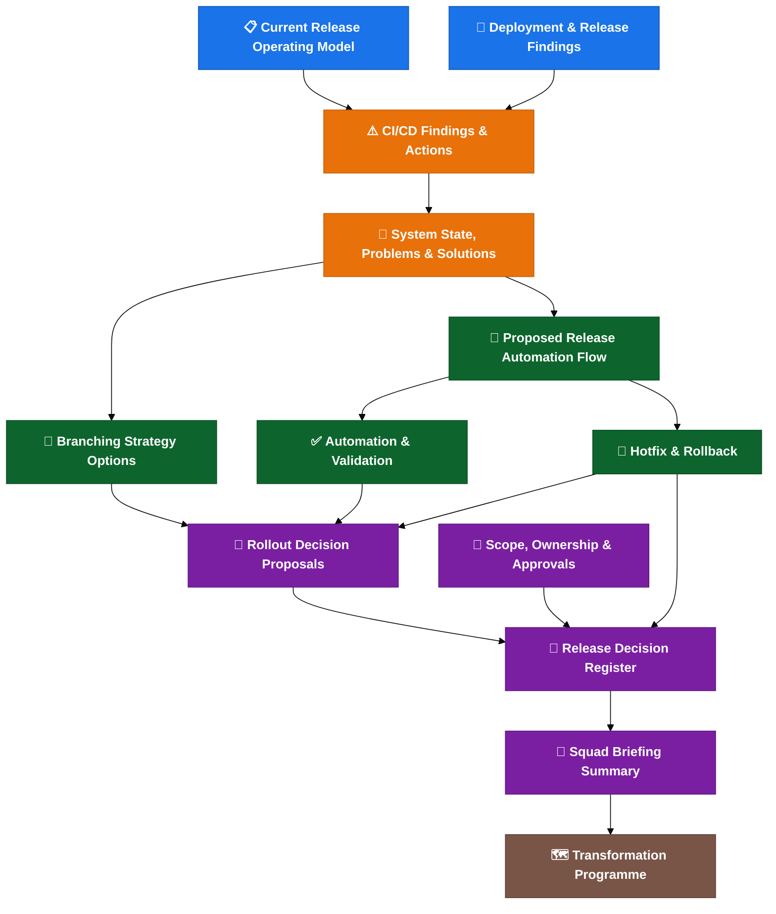

**Colour key:**
🔵 Current state · 🟠 Problems · 🟢 Solutions · 🟣 Decisions · 🟤 Transformation

---

> Source: `docs/system-state-problems-solutions.md`


# System State, Problems, Solution Options And Risks

This is the decision-ready summary of the CI/CD, branching, release and deployment documentation.

This is an assessment and proposal, not an approved operating model. Items marked "Proposed" or "Needs confirmation" require team sign-off before implementation.

For the full detailed analysis, see [system state detailed analysis](docs/reference/system-state-problems-solutions-detailed.md).

## Executive Assessment

### Current Situation In One Paragraph

Cerberus currently operates a GitFlow-like branching model, but the real release state is not contained within Git alone. It is fragmented across branches, tags, Docker images, Helm artefacts, the Cerberus deployment-management repository, manifests, environment-specific values files, Jira ticket metadata, secrets (managed through Git-crypt and Drone), Liquibase database scripts and runbooks. A branch rename or branching model simplification does not address this fragmentation. The release process is manual-heavy, validation is not strict enough, ownership is not fully assigned and operational procedures (hotfix, rollback, environment readiness) are not standardised. The automation pilot (Gareth/Achilles on the configuration service) is a strong first step, but it covers only part of the problem.

### Top Findings

| # | Finding | Impact | Recommended Action |
| --- | --- | --- | --- |
| 1 | The issue is broader than branching. | Changing the branch model alone does not fix the release process. | Stabilise the operating model before simplifying branches. |
| 2 | Release state is fragmented across multiple systems. | No single view of what constitutes a release. | Map all release state areas; validate consistency through automation. |
| 3 | Release preparation is manual-heavy. | Days of effort per sprint; inconsistency and audit gaps. | Move local scripts into Drone; automate branch/tag/chart creation. |
| 4 | Tag, artefact and manifest validation is not strict enough. | Wrong artefact or blocked work may reach production. | Fail fast on wrong tag, missing tag, manifest/tag mismatch. |
| 5 | Release scope is not fully explicit. | Automation may miss secrets, config, Liquibase or runbook changes. | Define and enforce a release scope checklist per release. |
| 6 | Hotfix and rollback are not operationally standardised. | Production fixes may drift from main, manifests and active releases. | Document and test both hotfix and rollback flows before next production incident. |
| 7 | Environment readiness is not a formal gate. | Deployment may fail due to incomplete setup (missing values, secrets, tokens). | Treat environment readiness as a mandatory pre-deployment gate. |
| 8 | Ownership and approval responsibilities are not fully named. | Decisions are delayed; escalation is unclear. | Assign named owners for every release activity. |
| 9 | Failed automation alerting and rerun rules are incomplete. | A failed step can leave release state unclear and unresolved. | Define alerting channels, rerun safety rules and manual-intervention triggers. |
| 10 | Trunk-based development would be risky without stronger feature flags, validation and rollback maturity. | Premature simplification may create instability. | Keep GitFlow-style baseline; reassess branch model after automation matures. |

### Main Message

> **Changing the branch model alone will not make releases safer.**
>
> The safer path is to make the current release state visible, repeatable, validated, owned and auditable first; then simplify the branch model after the automation proves what is actually being released.

### Long-Term Direction

The immediate goal is release operating model maturity: validation, ownership, automation and rollback. This is the focus of the current transformation programme.

Beyond that, a longer-term direction could be a unified deployment and release control plane — a single operational interface that sits above Git, Drone, Helm, deployment-management, Jira and environment metadata. Its purpose would be to give teams one place to view, approve, deploy, track and audit releases, rather than interacting with several disconnected tools.

This is a future maturity option, not part of the initial rollout. It should only be considered after release state visibility, strict validation, named ownership and tested rollback are stable. The feasibility and scope of such a platform would be subject to platform strategy approval and should be treated as a platform product decision.

## Release State Is Fragmented

The release process depends on multiple disconnected state areas. A problem in any one of them can invalidate the release.

| Release State Area | Current Location / Mechanism | Risk |
| --- | --- | --- |
| Source state | Git branches | Branch may not equal deployed state. |
| Release identity | Git tags / release versions | Wrong tag can create wrong artefact. |
| Build output | Docker images / Helm packages | Artefact may not match intended commit. |
| Deployment intent | Cerberus deployment-management / charts | Chart may not match release scope. |
| Environment config | Values files / feature flags | Deployed code may not be active. |
| Secrets | Git-crypt / managed secrets scripts / Drone secrets | Environment may not be ready. |
| Database changes | Liquibase | Rollback may be unsafe or impossible. |
| Release metadata | Jira labels / ticket fields | Release report may be incomplete. |
| Manual actions | Runbooks / release management | Audit trail may be weak. |
| Approval state | QAT / release owner decisions | Ownership may be unclear. |

**This is why a branch rename or branch-model change is not enough. Release safety depends on all of these states agreeing.**

## Business And Delivery Impact

| Problem | Delivery Impact | Operational Risk |
| --- | --- | --- |
| Manual release work | Release preparation takes days per sprint. | Human error and weak audit trail. |
| Weak validation | Wrong artefact may be released. | Production incident risk. |
| Unclear release scope | Config/secrets/DB changes may be missed. | Partial or broken release. |
| Weak rollback process | Recovery may be slow. | Longer incident duration. |
| Ownership gaps | Decisions are delayed. | Escalation confusion. |
| Environment readiness gaps | Late release failure. | Wasted release window. |
| Fragmented release state | Hard to prove what was deployed. | Audit and incident investigation risk. |

## Executive Summary

```text
Do not change the branching model first.
First make the release process visible, repeatable, validated and owned.
Then move to the target main = production model through a controlled cutover.
```

The current problem is broader than branching. The release state is spread across branches, tags, images, Helm packages, Cerberus charts, manifests, values, secrets, Liquibase changes, JIRA metadata, QAT approval and post-release reconciliation.

The proposed direction is good, but it should be treated as a phased operating-model change, not only a branch rename.

## Current System State

| Area | Current State | Confidence |
| --- | --- | --- |
| Branch model | GitFlow-like: feature -> `development` -> release branch -> `master` / production. | Medium |
| Target branch model | `main` represents production; release branches auto-created from `main`. | Proposed |
| Automation | Scripts work locally; Drone execution is the next step. | Medium |
| Pilot | Gareth/Achilles are testing on the new configuration service. | Medium |
| Artefact creation | Release tag triggers build, tests, scans and Helm artefact creation. | High |
| Deployment | Helm/package and Cerberus chart flow still has manual areas. | Medium |
| Release reporting | Expected to cross-reference JIRA, tags, services and chart changes. | Proposed |
| Validation | Existing scripts check some metadata, but strict fail/warn policy is not fully agreed. | Low/Medium |
| Hotfix/rollback | Concepts exist; operational runbook and reconciliation rules need approval. | Low/Medium |
| Environment readiness | Values, secrets, tokens and parity checks need clearer gates. | Low |
| Ownership | Templates exist; named owners and approvers are still incomplete. | Low |

## Main Problems

| # | Problem | Impact | Root Cause | Recommended Action |
| --- | --- | --- | --- | --- |
| P1 | The issue can be misframed as "branching only". | A branch change may move risk rather than reduce it. | Release state is distributed across many systems. | Stabilise the operating model before changing the branch model. |
| P2 | Release work is too manual and locally executed. | Slow releases, inconsistent execution, weak audit trail. | Automation is not yet the mandatory central path. | Complete Drone pilot; make pipeline the only release path. |
| P3 | Branch, tag and artefact timing rules are not strict enough. | Wrong artefacts or manifests can be produced. | Branch lifecycle and artefact lifecycle are different. | Enforce strict validation: wrong/missing tag = fail. |
| P4 | Release scope is unclear. | Secrets, config, Liquibase or runbook changes can be missed. | "All services" is not yet defined as a repo/change-type scope. | Define explicit release scope per repo and change type. |
| P5 | Manifest and ticket validation can be too permissive. | Blocked or wrong work can reach release. | Fail vs warning policy is still proposed. | Switch from warning to fail-fast after one dry-run release. |
| P6 | Changed-chart deployment is not yet a proven default. | Changed charts may be missed or unnecessary charts deployed. | Umbrella chart and service mapping need reliable detection. | Validate detection in pilot; deploy changed charts by default. |
| P7 | Hotfix and rollback are not operationally standardised. | Production can drift from branch, manifest and release records. | Rollback is treated as technical capability, not full process. | Document and test both flows before next production incident. |
| P8 | Environment readiness and parity are not explicit gates. | Release day failures can appear late. | Values, secrets, data, access and tokens are not centrally confirmed. | Formalise environment readiness as a mandatory gate. |
| P9 | Secrets/config management will get harder at scale. | Onboarding, rotation and audit risk increase. | Git-crypt/GPG is workable but operationally heavy. | Evaluate External Secrets Operator for medium-term. |
| P10 | Trunk-based development is risky without stronger feature flags. | Incomplete work may need branch or config workarounds. | Feature flags appear deploy-time rather than dynamic runtime. | Keep current model; add runtime flags before reconsidering. |
| P11 | Ownership and approval gaps can break the rollout. | Failures, overrides and rollback decisions become slow. | RACI is not yet fully named. | Assign named owners before expanding beyond pilot. |
| P12 | Alerting and rerun rules are incomplete. | Failed automation can leave state half-updated. | Failure modes are not yet production-readiness gates. | Define alerting channels and safe-rerun criteria. |

For detailed analysis of each problem, see the [detailed system analysis appendix](docs/reference/system-state-problems-solutions-detailed.md).

## Recommended Solution Path

### 1. Stabilise The Current Operating Model

Keep the current GitFlow-style model temporarily while the release process is made explicit.

Do now:

- Approve or amend the rollout decisions.
- Define release scope across repos and change types.
- Decide fail vs warning validation rules.
- Name release, hotfix, rollback, environment and alert owners.
- Keep the current process visible until automation is proven.

Risk:

- This can look like "no branching progress" unless time-boxed.

Mitigation:

- Treat it as a one-sprint decision cleanup and publish the exit criteria.

### 2. Move Release Automation Into Drone

Make Drone the central path for release branch, tag, chart update and report generation.

Do next:

- Complete the configuration-service pilot.
- Test reruns and partial-failure recovery.
- Store release reports as pipeline artefacts or release records.
- Alert failures to the right squad/release channel.

Risk:

- Local scripts may fail in Drone because of token, proxy, secret or permission differences.

Mitigation:

- Keep pilot scope narrow and test both happy-path and failure-path cases.

### 3. Add Strict Release Validation

Recommended default:

```text
Wrong tag -> fail
Missing tag -> fail
Manifest/tag mismatch -> fail
Do-not-deploy marker -> fail unless explicitly overridden
Invalid ticket status -> fail or release-owner override
Unknown ownership -> fail or release-owner override
```

Risk:

- Early rollout may fail often because metadata quality is inconsistent.

Mitigation:

- Start with dry-run/report-only for one release, then switch to enforced fail-fast.

### 4. Cut Over To `main = Production`

Only cut over after the pilot and validation rules are green.

Correct cutover:

```text
Create or rename `main` from the confirmed production state.
Do not rename `development` to `main`.
```

Risk:

- `development` may contain work that has not reached production.

Mitigation:

- Freeze `development`, inventory open work and set branch protections before cutover.

### 5. Scale Changed-Chart Deployment

Default to deploying all changed charts, with exclusions requiring release-owner approval and an audit note.

Risk:

- Detection can miss a chart, especially with umbrella charts or cross-repo changes.

Mitigation:

- Keep mass diff and human review mandatory in the first rollout phases.

### 6. Make Hotfix And Rollback A Production Gate

Production release should not proceed without:

- hotfix flow,
- rollback vs fix-forward decision guide,
- manifest reconciliation checklist,
- branch reconciliation checklist,
- Liquibase rollback/fix-forward policy,
- named decision owner.

Risk:

- Rollback may be unsafe when DB/data changes are involved.

Mitigation:

- Require rollback blocks or explicit no-rollback justification for production Liquibase changes.

### 7. Modernise Later, Not First

Runtime feature flags, external secret management, canary rollout and progressive delivery are valuable future improvements.

They should come after the release pipeline, validation and ownership model are stable.

## Go / No-Go Criteria

### Go For Automation Rollout

- Drone pilot succeeds for the configuration service.
- Generated tags, versions, chart changes and release report match expectations.
- Rerun is tested and safe.
- Failure alerting is defined.
- Manual chart edits are exception-only and audited.
- Release owner and backup are named.

### No-Go For Automation Rollout

- Scripts only work locally.
- Pipeline failure can be silent.
- Rerun can create duplicate or conflicting state.
- Release report does not match actual chart/manifest state.
- Drone secrets/tokens are not owned.

### Go For Branch Cutover

- Confirmed production state is known.
- `main` branch protection is ready.
- Automation targets the correct branch.
- Open work on `development` is inventoried.
- Hotfix and rollback reconciliation are approved.
- Strict validation has passed at least the pilot.

### No-Go For Branch Cutover

- Production state cannot be tied to branch/tag/manifest.
- Drone pilot is not green.
- `development` contains unknown open work.
- Rollback reconciliation is unclear.
- Forward-merge ownership is missing.

## Final Recommendation

```text
Phase 0: approve decisions and ownership.
Phase 1: quick wins and strict validation dry-run.
Phase 2: Drone pilot.
Phase 3: controlled `main = production` cutover.
Phase 4: expand changed-chart deployment and shared dev.
Phase 5: optimise feature flags, secrets and progressive delivery.
```

The strongest recommendation is to avoid a big-bang branch change. The safer path is to make the release state auditable first, then simplify the branch model once the automation can prove what is actually being released.

For the full transformation programme including root cause analysis, maturity assessment, roadmap, RACI, metrics and cost/benefit analysis, see [transformation programme](docs/transformation-programme.md).


## One-Page Summary

### Current State

Cerberus uses a GitFlow-like branching model with release branches, tags, Helm packaging and environment promotion. The release process is functional but manual-heavy, with fragmented state across branches, tags, images, charts, manifests, Jira, secrets and runbooks. Automation is being piloted on the configuration service by Gareth/Achilles.

### Top 5 Risks

| # | Risk | Likelihood | Impact |
| --- | --- | --- | --- |
| 1 | Wrong artefact deployed due to weak tag/manifest validation. | Medium | High |
| 2 | Production incident with no standardised rollback procedure. | Medium | Critical |
| 3 | Release scope incomplete (missing secrets, config or DB changes). | High | High |
| 4 | Ownership gaps delay decisions during incidents. | High | Medium |
| 5 | Environment readiness failure blocks release at deploy time. | Medium | Medium |

### Top 5 Recommendations

| # | Recommendation | Effort | Priority |
| --- | --- | --- | --- |
| 1 | Move release automation scripts into Drone (complete the pilot). | Medium | Immediate |
| 2 | Enforce strict tag/manifest validation (fail on mismatch). | Low | Immediate |
| 3 | Document and test hotfix and rollback flows. | Medium | Before next production incident |
| 4 | Assign named owners for all release activities. | Low | Before pilot expands |
| 5 | Formalise environment readiness as a pre-deployment gate. | Low | Before new environments are used |

### Go / No-Go Criteria For Rollout Expansion

Before expanding the automation beyond the pilot:

- [ ] Configuration-service pilot completes successfully in Drone.
- [ ] Generated chart changes, versions and tags are correct.
- [ ] Release report is produced and matches expected content.
- [ ] Changed-chart detection identifies expected charts.
- [ ] Alerting for failed steps is in place.
- [ ] Rollback procedure is documented and tested.
- [ ] Named release owner and platform owner are assigned.
- [ ] At least one squad lead has reviewed and confirmed understanding.

### Suggested Next Step

> **Validate the current-state assumptions with Gareth, Achilles, release management and one squad lead before asking for approval on the rollout decisions.**

---

<- [README](README.md) | -> [Transformation programme](docs/transformation-programme.md)

---

> Source: `docs/current-release-operating-model.md`


# Current Release Operating Model

This page captures the current understanding of how branching, release and deployment fit together.

It is a current-state summary, not the final process definition. Keep this page short; use the linked detail pages for deeper implementation notes.

## Current Direction

The release process is still too manual-heavy. The target direction is to run the repeatable release work centrally through Drone, update Cerberus charts automatically and produce a release report that can be checked against JIRA.

Current status:

- Gareth/Achilles are testing the automation on the new configuration service.
- The scripts work locally; the remaining step is to run them through Drone.
- The automation is expected to generate service chart changes, versions, tags and release reports.
- Some manual server chart work may remain until the relevant Drone pipelines are updated.
- Lower environments are more ad hoc; higher-environment releases rely more heavily on server chart updates and release management.
- Changes may include service code, secrets, config, Liquibase/database changes and runbook work.
- The proposed target has `main` representing production/live state, with release branches auto-created at the start of each sprint/release.

For the proposed target flow, see [proposed release automation flow](docs/proposed-release-automation-flow.md).

For Helm, manifest, secrets and validation detail, see [deployment and release findings](docs/deployment-and-release-findings.md).

## Current Branching Model

The current approach is close to a GitFlow-style model:

```text
feature branch -> development -> release branch -> master / production
```

Current understanding:

- Feature or ticket branches are created for individual changes.
- Completed work is merged into `development`.
- `development` represents ongoing work and the candidate state for upcoming releases.
- Release branches are created from `development`.
- `master` is intended to reflect production/live state.
- Release branches are tagged to trigger releasable artefact creation.
- After release, the release branch should be reconciled back into `master` and `development`.
- Hotfixes should be possible from production state, but the exact back-merge and forward-merge process still needs confirmation.

Important transition note:

```text
The proposed target is not "rename development to main".
The target is "main represents the confirmed production state".
```

That distinction matters because `development` may contain work that has not reached production.

## End-To-End Flow

The release flow currently spans source control, artefact creation, deployment state, environment promotion and post-release reconciliation.

Compact current-state view:

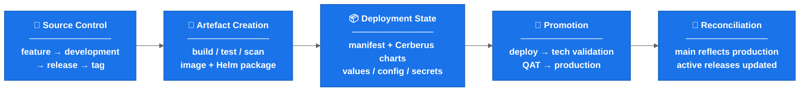

Why this matters:

```text
Changing the branch model alone does not make the release safe.
The release is only safe when tag, artefact, chart, manifest, config, validation and reconciliation all agree.
```

## Deployment And Helm Summary

The current deployment path focuses on the service repo and the MMA Helm repo.

Key points:

- Individual service charts have had their own Drone pipelines around dev-environment Helm chart deployment.
- The current approach appears to deploy through the service repo instead.
- The MMA Helm repo contains scripts for Helm packaging, linting, templating, diffing, uploading and deployment-related tasks.
- Helm charts are deployed as packaged artefacts with environment-specific values files.
- Tag creation runs packaging/upload steps; deployment itself is promoted or manually triggered.
- Deployment parameters include target environment, deployment scope, release version/tag and chart names.
- Chart names may still need to be listed explicitly until changed-chart detection is reliable.

Temporary manual areas still needing confirmation:

- Which server chart updates remain manual.
- Which Drone pipeline changes are needed before server chart work is automated.
- Who performs manual chart updates during rollout.
- How manual chart changes are reviewed and reconciled with release reports.
- How cross-ticket dependencies are handled when a manual chart edit is still required.

## Tagging And Artefact Creation

A release branch alone does not produce a releasable service artefact. A tag is created on the release branch when it is ready.

Creating a tag appears to trigger:

- repository clone,
- Docker/test dependency setup,
- Artifactory login,
- service build,
- Maven install/tests for Spring Boot services,
- vulnerability scanning such as Trivy,
- code quality scanning such as Sonar,
- Helm package, Helm dependency build and Helm artefact upload.

Compact tag flow:


Risk:

```text
If the tag points to the wrong commit, the rest of the process can look correct while deploying the wrong artefact.
```

## Manifest, Ticket And Release Metadata

Existing scripts appear to analyse release content using tickets, tags and manifest versions.

Observed responsibilities:

- Compare start tag and end tag.
- Identify tickets included in a release.
- Add or update release labels.
- Update changelog entries.
- Check ticket status.
- Check whether the correct tag version has been entered.
- Compare update versions with current manifest versions.
- Detect incorrect tags, missing tags, blocked tickets or invalid ticket statuses.

Open policy:

```text
Wrong tag, missing tag, manifest/tag mismatch and do-not-deploy markers should fail fast unless an explicit release-owner override is recorded.
```

See [automation and validation](docs/automation-and-validation.md).

## Configuration, Feature Flags And Activation

Deployment does not always mean activation.

Current understanding:

- A new feature or rule can be deployed without being active.
- Activation is controlled by feature flags and environment-specific values.
- Development teams decide which features need to be enabled in each environment.
- Some flag values appear to be controlled through chart values/config.

Operational implication:

```text
Code deployed != feature enabled
```

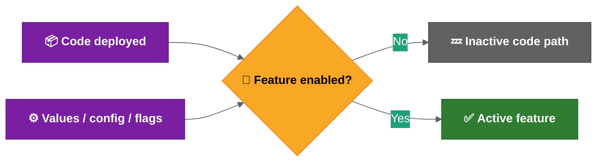

If feature flags are baked into Helm values, enabling or disabling a feature may require redeployment. That means trunk-based development would move some complexity from branching into configuration and deployment.

## Testing, Validation And Approval

Deployment success and functional release confidence are different things.

Technical validation generally confirms:

- deployment completed,
- pods started successfully,
- health checks or monitoring passed.

Functional validation is separate:

- development teams may use Playwright or Cypress,
- QAT approval is required for SIT and above,
- a green deployment pipeline does not prove functional readiness.

Key principle:

```text
Deployment success != functional validation complete
```

## Environment And Operational Constraints

Environment differences are not fully documented yet.

Areas to confirm:

- data volume and data shape,
- configuration differences,
- feature flag defaults,
- secrets and credentials,
- external integrations,
- network/access constraints,
- operational permissions,
- required values files, Drone secrets and kube/robot tokens,
- whether lower environments are deployed ad hoc while higher environments use server chart releases.

Operational constraints also include:

- Thursday appears to be the regular release day.
- Some higher-environment actions may require PNR room/location access.
- Some commands may require tools pod access.
- Runbook steps may need to run alongside release activity.
- Screen sharing or recording while viewing decoded secrets is a security risk.
- If secrets are exposed, rotation may be required.

## Confirmation Needed

Before changing the branching model, confirm:

1. When release branches are cut.
2. When tags are created.
3. Which repositories are in scope.
4. Which steps are manual vs automated.
5. How hotfixes and rollback are handled.
6. How `master` / `main` is kept aligned with production.
7. Who owns release readiness, execution, validation and reconciliation.
8. How feature flag state is recorded in the release report.
9. Which environment readiness checks are mandatory before rollout.

## Related Detail

- Feature flag and environment management best practices are in [release engineering best practices](docs/release-engineering-best-practices.md).
- Proposed automation is in [proposed release automation flow](docs/proposed-release-automation-flow.md).
- Open rollout decisions are in [rollout decision proposals](docs/rollout-decision-proposals.md).

---

<- [README](README.md) | -> [Deployment and release findings](docs/deployment-and-release-findings.md)

---

> Source: `docs/deployment-and-release-findings.md`


# Deployment And Release Findings

This page covers the current deployment, secrets, manifest and validation mechanisms that the proposed solution must either reuse, automate or replace.

Read this page together with:

- [Current release operating model](docs/current-release-operating-model.md) for the current end-to-end flow.
- [Proposed release automation flow](docs/proposed-release-automation-flow.md) for the target solution.
- [Rollout decision proposals](docs/rollout-decision-proposals.md) for decisions that still need team sign-off.

## 1. Deployment Scripts And Helm Flow

The current deployment path focuses on the service repo and the MMA Helm repo.

Key points:

- Individual service chart Drone pipelines have existed around dev-environment Helm chart deployment.
- The MMA Helm repo contains the deployment scripts for Helm packaging, linting, templating, mass diff, uploading and deployment.
- The MMA Helm repo is different from the MMA Helm library repo, which contains Helm templates/library content.
- Future Drone pipeline deployment changes are likely to touch the MMA Helm repo and possibly service repo environment setup scripts.

Current Helm flow:


Important details:

- Helm charts are deployed as packages, not directly from local repo files.
- Environment-specific values files are included at deploy time.
- Linting and templating validate Helm/YAML rendering, but Kubernetes may still reject something Helm accepted.
- Mass diff compares rendered templates against the target/default branch to show what changes will be made.
- Tagging kicks off upload/deploy-related pipeline steps.
- Deployment itself is manually promoted/triggered.
- Deployment parameters include target environment, deployment scope, release version and chart names.
- Deployment scope can distinguish live, historical or both.
- To deploy all charts today, chart names may need to be listed explicitly.

## 2. Environment And Release Responsibilities

Current split of responsibilities:

- Developers/squads handle lower/squad environments.
- Release management handles SIT and higher environments.
- QAT approval is required before progressing beyond SIT.
- Production-like environments include B.Val/pre-production/production.
- From a technical deployment point of view, environment differences are mainly in values files, but operational process and access differ.
- B.Val may contain more data than production.
- Runbook repositories may contain environment-specific actions that must be executed alongside release activity.

Important distinction:

```text
Deployment success does not prove functional readiness.
```

Deployment checks mainly show that Helm/pods/deployment worked. Functional validation is handled by development teams and QAT, using tools such as Playwright or Cypress where available.

## 3. Feature Flags And Activation

Deployment does not always mean activation.

Feature activation may depend on values files or feature flags. Development teams decide what needs to be enabled in each environment.

Implication:

```text
The release process must track both deployed version and activation/config state.
```

## 4. Rollback Current State

Current rollback status:

- Automatic rollback is not built into the deployment scripts.
- If deployment fails, the pipeline does not automatically rollback.
- Monitoring failure does not automatically trigger rollback.
- Helm rollback is technically possible through Helm history/rollback commands.
- Recent practical behaviour has leaned towards fix-forward.

Implication:

```text
Rollback needs a documented operational process, not just Helm capability.
```

## 5. New Environment Setup Considerations

For new dev/test environments, several setup points must be addressed:

- Environment lists or setup scripts may need updating.
- Values files for new environments need to exist and match naming expectations.
- Drone secrets/tokens may need to be added for new environments.
- There is uncertainty around whether kube/robot tokens come from ACU or existing Drone/namespace secrets.
- This needs confirmation before new environments can be treated as ready.

Open items:

- Confirm which repos/scripts must be updated for each new environment.
- Confirm who owns Drone secret/token creation.
- Confirm whether ACU provides the required robot/kube tokens.
- Confirm minimum required secrets per environment.

## 6. Secrets Management

Current direction for managing secrets:

- Secrets are being extracted into the Cerberus/deployment-management structure.
- Managed secrets scripts can extract and encrypt secrets for an environment.
- Secret values are base64 encoded and encrypted.
- Secret keys should remain consistent between environments; values differ by environment.
- Access requires Git maintainer or Git-crypt maintainer setup, including GPG keys.
- The managed secrets script supports rotation and restore.
- Lower-level helper scripts such as export/encrypt secrets exist, but the managed secrets script is the main entry point.
- MSK secrets may have a separate area.

Implication:

```text
Secrets/config changes should be part of release scope and release readiness checks.
```

## 7. Release Artefact Creation

Service artefact creation flow:

- A release branch may not have a tag until it is ready.
- Creating a tag kicks off a tag creation pipeline.
- For Spring Boot services, the pipeline builds the service and runs Maven install/tests.
- Trivy vulnerability scanning and Sonar code-quality scanning run before deployable artefact creation.
- Helm package, Helm dependency build and Helm artefact upload are part of releasable artefact creation.
- Slack notification may be sent once the service artefact is created.

## 8. Umbrella Charts

The deployment-management repository packages services into umbrella charts.

Key points:

- There are around two dozen umbrella charts.
- Some umbrella charts contain one service; others contain many services.
- Release chart version updates currently happen by updating chart YAML/service versions.
- Umbrella charts allow related services to be deployed together or in isolation.

This matters for changed-chart deployment because the automation needs to reason at chart level as well as service level.

## 9. Auto Manifest And Tag Jump Scripts

Supporting scripts that still matter for release metadata, manifest generation and validation decisions.

Auto manifest has two main stages:

1. Create the release Jira ticket.
2. Create the manifest.

Supporting details:

- Scripts use Python plus tools such as `yq` and `jq`.
- Local/workspace runs may need proxy configuration to access Jira.
- Drone runs may not need the same proxy setup.
- Release version and ticket number are key inputs.
- The script gets release tickets from Jira by release label.
- The GitLab tag field on tickets is used to determine service versions/tags.
- `NA` can be used for changes that do not require a tag/version update.
- DB Liquibase has special handling because one Liquibase update may affect multiple projects.
- The script updates chart versions, writes changelog entries, creates a branch, pushes changes and raises an MR.
- Helper scripts exist for branch creation, commits, pushes and MRs.

## 10. Tag Jump Checker

The tag jump checker may be less central in the proposed non-linear release branch model, but it explains an important release risk.

It was used when the team could not safely release only a selected ticket because other merged changes might be pulled in as well.

The script:

- Compares base and release versions.
- Checks Git commit logs for ticket numbers.
- Compares discovered tickets against release tickets/labels.
- Uses labels such as tag jump and full release.
- Checks ticket status and GitLab tag fields.
- Warns or fails for missing/incorrect tag metadata.
- Flags `do not deploy` cases.
- Has dry-run support.

Known caveats:

- It may be less relevant with the proposed branching structure because version/tag order is not always linear.
- Rollback comparisons can be awkward because the script tends to prefer the higher/current version.
- Incorrect ticket numbers in commits can produce false positives.
- Some validation may currently be looser than expected, such as incorrect tags or no tags found passing when they should fail.

Implication:

```text
The new release automation must explicitly define strict validation rules for ticket status, missing tags, incorrect tags and do-not-deploy markers.
```

## Follow-Up Items

1. Confirm which scripts/repos must be updated for new dev/test environments.
2. Confirm Drone secret/token ownership for new environments.
3. Confirm whether deployment parameter validation is strict enough.
4. Confirm whether auto manifest/tag validation should fail on wrong tag, missing tag or invalid ticket status.
5. Confirm how `NA` tag entries should be represented in release reports.
6. Confirm whether tag jump logic is retired, replaced or adapted for the new branching model.
7. Confirm secrets access/onboarding process for maintainers.

## Related Best Practices

Helm versioning, values-file structure, umbrella chart dependency handling, mass diff usage and secrets-management options are summarised in [release engineering best practices](docs/release-engineering-best-practices.md).

---

<- [Current release operating model](docs/current-release-operating-model.md) | -> [Proposed release automation flow](docs/proposed-release-automation-flow.md)

---

> Source: `docs/cicd-deployment-findings-and-actions.md`


# CI/CD Deployment Findings And Actions

This page summarises the CI/CD and deployment findings.

Its purpose is to show:

1. How the current process works.
2. Which parts look manual, unclear, risky or inconsistent.
3. What should be standardised, automated or explicitly decided next.

## Analysis Frame

```text
The release challenge is broader than the branch model itself.

Branching is one part of the process, but CI/CD and deployment also depend on service tags, Helm artefacts, manifests, configuration and feature flags, runbooks, environment access, QAT approval, rollback and ownership.

The current process should be made visible, repeatable and auditable before the branching model is treated as the main fix.
```

## Process Areas Covered

- Release branch creation and merge strategy.
- Service tag creation and artefact generation.
- Image build, test, scan and Helm package upload.
- Cerberus chart and manifest updates.
- Deployment through service repo and MMA Helm scripts.
- Environment-specific values, secrets and runbooks.
- QAT approval and higher-environment promotion.
- Hotfix, rollback and post-release reconciliation.

## Problem Areas Identified

| Area | Current Problem | Why It Matters |
| --- | --- | --- |
| Manual release work | Release creation, chart updates, tag handling and deployment triggers still involve manual or locally run steps. | Manual work increases release time, inconsistency and audit gaps. |
| Branch/tag timing | Release branches, temporary tags and full release tags need clearer rules. | Wrong timing can create wrong artefacts, wrong manifests or unclear release state. |
| Release scope | "All services" and cross-repo release scope are not fully explicit. | Automation may include too much, too little or miss secrets/config/Liquibase/runbook changes. |
| Manifest validation | Missing tags, wrong tags, invalid ticket status and `do not deploy` cases need strict policy. | Weak validation can allow the wrong version or blocked work into a release. |
| Changed-chart deployment | Deploying all charts manually or listing chart names explicitly is inefficient. | The deployment should default to changed charts, with audited override. |
| Environment readiness | New dev/test environments need values files, setup entries and Drone secrets/tokens confirmed. | An environment can look available but fail deployment because setup is incomplete. |
| Hotfix and rollback | Hotfix source branch, back-merge and rollback reconciliation are not fully standardised. | Production fixes can drift from `main`/`development`, manifests and active release branches. |
| Alerting and rerun | Failed automation alerting and safe rerun rules are not fully defined. | A failed final Git/chart/reporting step can leave release state unclear. |

## Findings Flow

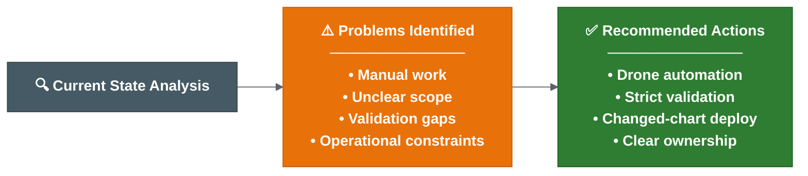

## Recommended Actions

1. Keep the current-state flow in [current release operating model](docs/current-release-operating-model.md) as the baseline view.
2. Use [deployment and release findings](docs/deployment-and-release-findings.md) as the detailed source for deployment scripts, secrets, manifests and tag validation.
3. Move local/manual release automation into Drone once the configuration-service pilot is green.
4. Define strict validation for wrong tags, missing tags, manifest/tag mismatch, invalid ticket status and `do not deploy` markers.
5. Confirm repository scope for service code, Helm charts, deployment management, secrets/config, Liquibase and runbooks.
6. Confirm changed-chart deployment behaviour and the override approval path.
7. Document hotfix and rollback flows including branch, manifest and release report reconciliation.
8. Define alerting and rerun rules for failed automation steps.
9. Confirm new environment readiness criteria before treating any dev/test environment as release-ready.
10. Use [rollout decision proposals](docs/rollout-decision-proposals.md) as the decision record until owners approve or amend them.

## Short-Term Recommendation

As stated in the [executive assessment](docs/system-state-problems-solutions.md#executive-assessment): stabilise the release operating model before changing the branching model. The priority actions are in the Recommended Actions list above.

## Prioritisation: Effort vs Impact

Not all problems are equally important. Prioritise by impact and effort:

### Quick Wins (High Impact, Low Effort)

| Action | Why Quick Win |
| --- | --- |
| Pre-commit hook for ticket references | Already in progress. Prevents garbage commits entering release history. |
| Strict validation: fail on missing/wrong tag | Script change only. Prevents wrong artefacts reaching production. |
| Document deployment parameters | Write-up only. Removes tribal knowledge dependency. |
| Changed-chart detection in release report | Reporting change. Shows what should deploy without manual listing. |

### High Impact, Medium Effort

| Action | Why Important |
| --- | --- |
| Move release automation to Drone | Central, auditable, repeatable. Removes local-script dependency. |
| Auto release branch creation | Removes start-of-sprint manual work entirely. |
| Auto Cerberus chart branch updates | Removes most manual chart editing - the biggest time sink. |
| Alerting for failed steps | Makes failures visible instead of silent. |

### High Impact, High Effort

| Action | Why Harder |
| --- | --- |
| Full rollback runbook and testing | Requires cross-team agreement, environment access, testing time. |
| Environment parity documentation | Requires production access/knowledge that few people have. |
| Ownership matrix sign-off | Requires management decisions and role assignment. |
| Feature flag runtime control | Requires new tooling or infrastructure. |

### Recommended Execution Order

```text
1. Quick wins (this sprint / next sprint)
2. Move automation to Drone (current pilot)
3. Auto release branch + chart updates (immediately after pilot green)
4. Alerting and strict validation (alongside #3)
5. Rollback runbook (before next production incident)
6. Ownership sign-off (before expanding beyond pilot squads)
7. Feature flags and environment parity (medium-term roadmap)
```

---

<- [Rollout decision proposals](docs/rollout-decision-proposals.md) | -> [Squad briefing summary](docs/squad-briefing-summary.md)

---

> Source: `docs/proposed-release-automation-flow.md`


# Proposed Release Automation Flow

This page summarises the proposed release automation flow.

It is still a proposal until the team confirms rollout timing, branch naming, quality gates and ownership.

For proposed answers to the open rollout decisions, see [rollout decision proposals](docs/rollout-decision-proposals.md).

## Current Pain

The current process is manual-heavy:

- Lower environments are deployed more ad hoc.
- Higher-environment releases rely on server chart updates.
- A feature deployment can require a manual tag, manual Cerberus chart branch/update and manual deployment trigger.
- Release branches need repeated tags and chart image updates as fixes, CVEs and last-minute changes are added.
- End-of-sprint release preparation can take several days and consume developer/senior time.

## Target Branch Model

The target direction is:

- `development` does not become `main`. `main` is created from the confirmed production baseline. `development` is transitional and later retired.
- `main` should represent what is live/production.
- When something is deployed to production, it should be merged into `main`.
- At the start of each sprint/release, release branches are automatically created from `main` for every repository that needs one.
- Feature and hotfix branches are taken from the relevant release branch.
- Multiple release branches may exist at the same time.
- If releases need to be chained, the automation should allow a release branch to be based on another release branch instead of `main`.

Proposed decision:

```text
Move to `main` as the production/live baseline after an agreed cutover release.
Keep `development` as transitional until the automation pilot and branch protections are ready.
```

## Feature And Hotfix Branch Flow


Important details:

- Feature and hotfix branches are treated similarly by the automation.
- Each commit should build from the latest commit on the branch.
- The temporary branch tag should be stable for the branch, rather than generating a large number of images for every commit.
- The tag is expected to include the previous application version and the MMA/JIRA ticket reference.
- When the image is built successfully, the corresponding Cerberus chart branch should be updated automatically.
- The branch name/ticket becomes the deployment handle for dev test or other environments.

## Multi-Repo Change Aggregation

If multiple repositories use the same ticket/branch name, their changes should feed into the same Cerberus chart branch.

This means one ticket can collect:

- Service changes.
- Secrets/config changes.
- Liquibase/database changes.
- Runbook changes.
- Changes across multiple services that need to be tested together.

This is intended to remove most manual chart updates for multi-service changes.

## Release Branch Flow


Important details:

- The release branch is what should be deployed to environments.
- Once a feature branch is merged into the release branch, the temporary branch tag is replaced by the full/incremented release version.
- The matching release branch on Cerberus charts should be updated automatically.
- The active release branch is intended to be deployed regularly, potentially automatically, to a shared dev environment for cross-team integration testing.
- Squad dev test environments remain separate from the shared dev environment.
- Ephemeral branch environments are not currently assumed, as ACP may not support them.

## Long-Running Or Delayed Features

A feature branch may start from one release branch but not be ready for that release.

In that case:

- The branch can continue to exist alongside later release branches.
- It does not have to be merged back into the source release branch.
- The team working on it should merge in the previous release and the next release as needed.
- The aim is to detect conflicts before opening or updating the merge request.

Proposed decision:

```text
Feature owners keep long-running branches current by merging in the relevant active release branch before MR updates.
Release owners track forward merges from earlier active releases into later active release branches.
```

## Release Reporting

The report should be generated from Cerberus chart changes between two tags or versions.

It should identify:

- Which charts changed.
- Which images changed on those charts.
- Which services changed.
- Which merged commits are included.
- Ticket number.
- Merge commit message.
- Team.
- Primary contact or assignee.
- Ticket status.

The report can be generated at any time by providing two tags. If no relevant changes exist between those tags, the report should be empty.

## Changed-Chart Deployment

The proposed deployment enhancement should:

- Detect which charts changed in the release.
- Deploy only the changed charts by default.
- Keep an override option to avoid a chart if there is a specific reason.
- Prefer deploying all updated charts in a release branch unless explicitly excluded.

Proposed decision:

```text
Deploy all changed charts by default.
Only release owners can approve exclusions, and the reason must be recorded in the release report or release notes.
```

## CVE And Renovate Flow

CVE and Renovate-style updates should follow the same pattern as normal team changes:

- CVE scanning should raise work against the release branch.
- CVE fixes should use a hotfix branch.
- Renovate MRs should target the active release branch.
- These MRs should look similar to team-raised MRs.
- Teams/release owners must watch, review and merge them as part of release work.

### Ownership And SLA

| Item | Owner | SLA |
| --- | --- | --- |
| CVE scanning tool output | Security/DevOps tooling (automated) | Continuous |
| CVE hotfix branch creation | Owning squad or release owner | Within 1 working day of critical CVE |
| CVE MR review and merge | Owning squad lead | Within 2 working days for critical, sprint boundary for others |
| Renovate MR review | Owning squad | Within sprint, before release branch closure |
| Priority conflict resolution | Release owner | On demand |

If a CVE fix conflicts with release timing, the release owner decides whether to include it in the current release or defer to the next.

## Failure Handling And Quality Gates

The automation is expected to run defensively:

- The chart update step should run after the image and Helm chart are successfully built/uploaded.
- Most automation is Git commands, Git diffs/tags/logs and JIRA/reporting calls.
- If connectivity to Git or related services fails, the step should be rerunnable.
- If local commands completed but push failed, rerunning should push the generated tags/build numbers/chart changes.

Proposed policy:

- Add Slack/email notification before production rollout of the automation.
- Treat image build, Helm chart upload, tag generation, chart update and report generation failures as fail-fast.
- Allow rerun of the final Git/chart/reporting step after transient failures when artefacts were built successfully.
- Keep human approval before higher-environment promotion and production.

## Merge Commit Expectations

The preferred approach is a squash-style pattern to reduce noisy release branch history.

The key requirement is:

```text
The merge commit into the release branch must include the ticket number and a meaningful message.
```

Reason:

```text
The release branch commit history becomes the changelog.
```

Individual feature branch commits should ideally also follow the ticket/message pattern, because reports may be generated from long-running feature branches before they are merged and deleted.

## Items Still Needing Formal Approval

1. When exactly is `main` created from the confirmed production baseline, and when is `development` retired?
2. What is the final branch naming convention?
3. Which release is the first rollout candidate?
4. Which repos get auto-created release branches?
5. Who is the named release owner for forward-merge tracking?
6. Where are release reports published and retained?
7. Which Slack/email channels receive automation failure alerts?

## Related Best Practices

GitOps alignment, tag/version guidance, multi-repo orchestration and progressive delivery considerations are summarised in [release engineering best practices](docs/release-engineering-best-practices.md).

---

<- [Deployment and release findings](docs/deployment-and-release-findings.md) | -> [Branching strategy options](docs/branching-options.md)

---

> Source: `docs/branching-options.md`


# Branching Strategy Options

This page compares the branching options discussed so far.

The key point: the branching model should be chosen based on what the release operating model can safely support.

Terminology note:

```text
In this documentation set:
- `master` refers to the current production baseline branch (existing state).
- `main` refers to the proposed production baseline branch (target state after cutover).
Where both are mentioned together, the context should make clear whether the current or target state is being discussed.
```

## Decision Lens

Before choosing a model, confirm whether the team has:

- Clear release scope across repositories and services.
- Reliable tag, artefact and manifest validation.
- A documented hotfix path.
- A documented rollback path.
- Clear service ownership and approvals.
- Strong enough test automation.
- Feature flags and configuration that can safely control incomplete work.

## Branch And Commit Hygiene To Confirm

Several branch hygiene points should be agreed before rollout.

Proposed branch naming examples:

| Branch Type | Purpose | Example |
| --- | --- | --- |
| `feature/*` | Individual ticket or feature work. | `feature/MMA-1234-login-validation` |
| `release/*` | Release candidate branch for a planned release. | `release/2026.06.1` |
| `hotfix/*` | Urgent fix from production state. | `hotfix/MMA-5678-prod-timeout` |
| `main` or `master` | Production/live baseline. | `main` |
| `development` | Integration branch, if retained. | `development` |

Proposed cleanup rule:

```text
Feature branches should be deleted after merge, once any required release report has been generated.
```

Proposed target model:

```text
main represents production/live.
release branches are auto-created from main at the start of each sprint/release.
feature and hotfix branches are created from the relevant release branch.
```

Transition note:

```text
Until the agreed cutover release, the current model remains active:
  feature branches -> development -> release branch -> master.
After cutover:
  feature branches -> release branch -> main.
Both models should not run simultaneously. The cutover date marks the switch.
```

For more detail, see [proposed release automation flow](docs/proposed-release-automation-flow.md).

Proposed decision:

```text
Move to `main` as the production/live baseline after an agreed cutover release.
Keep `development` transitional only until the automation pilot and branch protections are ready.
```

For the full proposal, see [rollout decision proposals](docs/rollout-decision-proposals.md).

## Multiple Active Release Branches

An important branch maintenance point: more than one release branch may exist at the same time.

If a feature starts from one release branch but is not ready for that release, it can continue alongside later releases. The team working on the feature should merge in the relevant release branches to detect conflicts before opening or updating the merge request.

Proposed rule:

```text
Forward-merge fixes from earlier active releases into later active release branches before release closure.
Feature owners keep long-running branches current by merging in the relevant active release branch before MR updates.
```

## Option 1: Continue With The Current GitFlow-Style Model

```text
feature branch -> development -> release branch -> master
```


Benefits:

- Keeps a familiar model.
- Separates active development from production.
- Allows release branch stabilisation.
- Supports production-based hotfixing if `master` is reliable.
- Provides a controlled release candidate branch.
- May be safer in the short term while automation and documentation improve.

Risks:

- More branches to manage.
- Requires disciplined reconciliation after release.
- Can create overhead across many services.
- Still depends on tag, manifest and configuration coordination.
- If reconciliation is missed, `master` may stop representing production accurately.

Best fit:

```text
Short-term baseline while the process is standardised and automated.
```

## Option 2: Reduce Reliance On `development`

Possible direction:

```text
feature branches -> release branches tracking live/main
```

Note: In this model, feature branches are created from `main` (not from the release branch). This differs from the proposed target model above, where feature branches are created from the release branch. Option 2 is presented as an alternative, not as the recommended direction.

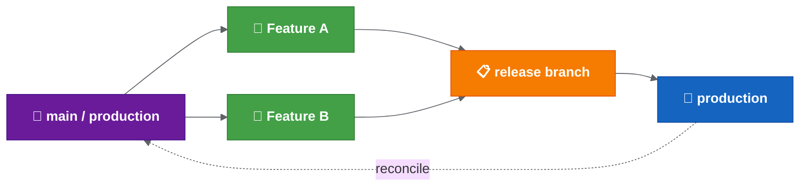

Benefits:

- Fewer long-lived branches.
- Closer alignment to production state.
- Potentially easier to reason about changes against live.
- May reduce branch management overhead if releases are frequent.

Risks:

- Less separation between active development and release preparation.
- Incomplete or risky work may be harder to isolate.
- Does not automatically solve manifest, config, feature flag or rollback complexity.
- Needs very clear release scope and ownership to avoid drift.

Best fit:

```text
Possible future simplification if release controls are already clear and reliable.
```

## Option 3: Move Towards Trunk-Based Development

Possible direction:

```text
short-lived branches -> trunk/main
release control -> feature flags/config
```

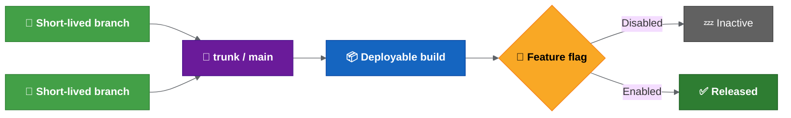

Benefits:

- Reduces long-running branches.
- Improves continuous integration.
- Reduces late merge conflict risk.
- Can support faster release cycles if operational controls are mature.

Risks:

- Requires strong runtime feature flag control.
- Requires configuration to be changeable without full redeployment, or with very low friction.
- Requires strong automated testing and monitoring.
- Instability may be harder to isolate if many changes are merged quickly.
- If feature flags are baked into charts or values files, the complexity may move into deployment/configuration.

Best fit:

```text
Longer-term target if release control can be separated from code integration.
```

## Trunk-Based Readiness Criteria

Before moving towards trunk-based development, confirm that:

- Runtime feature flags are available and reliable.
- Feature activation is independent of deployment.
- Configuration can be changed centrally or without full redeployment.
- Automated tests detect regressions quickly.
- Rollback or feature disablement is fast and well understood.
- Feature flag lifecycle is managed to avoid long-lived inactive code paths.
- Environment parity is well understood.
- Release ownership and approvals are clear.

## Suggested Short-Term Position

```text
Keep the current GitFlow-style model as the short-term baseline.
Improve automation, validation, hotfix handling, rollback handling and ownership.
Use those improvements to decide later whether to simplify the model or move towards trunk-based development.
```

## Practical Recommendation

Do not make the branching model carry all the process risk.

First standardise:

- Release branch timing.
- Tag timing.
- Manifest validation.
- Changed-service detection.
- Hotfix flow.
- Rollback flow.
- Post-release reconciliation.
- Ownership and approvals.

Then reassess whether the branch model is still the main constraint.

## Related Best Practices

Branching model selection, staged GitFlow-to-trunk transition guidance and common rollout mistakes are summarised in [release engineering best practices](docs/release-engineering-best-practices.md).

---

<- [Proposed release automation flow](docs/proposed-release-automation-flow.md) | -> [Automation and validation](docs/automation-and-validation.md)

---

> Source: `docs/automation-and-validation.md`


# Automation And Validation

This page captures the automation work in progress and the validation rules that should be made explicit.

Open validation decisions are tracked in the [release decision register](docs/release-decision-register.md), especially D08, D09, D13, D14, D15 and D22.

## Why Automation Matters

The safest short-term improvement appears to be moving manual or locally run release scripts into centrally executed pipelines.

This would improve:

- Auditability.
- Central ownership of the release flow.
- Visibility of what has been run.
- Repeatability.
- Detection of which services actually have changes.
- Consistency around tags, manifests and release metadata.

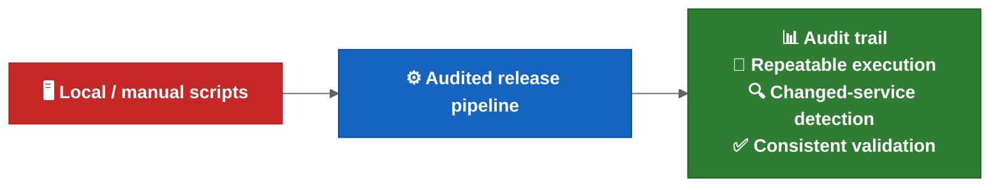

## Automation Work Mentioned

Existing scripts or automation steps appear to cover parts of the release process, including:

- Merging release branches into `master`.
- Cleaning up inactive release branches.
- Creating new release branches from `development`.
- Tagging release branches.
- Updating manifest merge requests with tags.
- Raising manifest merge requests in Cerberus deployment management.
- Comparing commits or services to identify what is in or out of a release branch.

Some of these steps currently require tweaking or are not fully automated yet.

## Current Automation Status

The current automation status is:

- Automation is being tested on the new configuration service.
- The scripts work locally.
- The remaining step is to get the automation and reporting running in Drone.
- The automation is expected to generate service chart changes, versions and tags.
- Release reports should help show what changed and what needs to be deployed.
- JIRA cross-reference is expected so the team can confirm that the release content matches the intended tickets.
- Changed-chart detection is being explored so the deployment logic can deploy only charts changed in the release.
- A Git pre-commit hook is in progress to reduce commits without MMA ticket references.
- Rollout may be possible within the next release or two, subject to confirmation.

For the end-to-end proposed flow, see [proposed release automation flow](docs/proposed-release-automation-flow.md).

For detailed findings around current Helm scripts and auto manifest tooling, see [deployment and release findings](docs/deployment-and-release-findings.md).

## Intended Direction

The proposed direction is:

- Move local scripts into pipelines.
- Reduce manual service chart management.
- Automatically identify what is in or out of a branch/release.
- Automate start-of-sprint and end-of-sprint release tasks.
- Reduce release work to one or two standard pipeline runs where practical.
- Roll the improved process out iteratively after review and sign-off.

## Proposed Drone Rollout Checklist

Before the automation is treated as ready, confirm:

1. The pipeline runs successfully in Drone for the new configuration service.
2. Generated service chart changes are correct.
3. Generated versions are correct.
4. Generated tags are correct.
5. The release report is produced by the pipeline.
6. The release report includes the expected JIRA/ticket cross-reference.
7. Changed-chart detection identifies the expected charts.
8. Changed-chart deployment has an audited override path.
9. The report is stored somewhere durable enough to survive feature branch deletion.
10. Remaining manual server chart work is documented.
11. Rollout communication has been sent to squads.

## Release Reporting

The release report should answer:

- Which charts changed?
- Which images changed?
- Which services changed?
- Which tickets are included?
- Which tags were generated or expected?
- Which service chart changes were generated?
- Which manifest changes are needed?
- Which items are ready to deploy?
- Which items are blocked or need manual review?
- Which team owns the change?
- Who the primary contact/assignee is.
- What the ticket status is at report generation time.

Suggested retention policy to confirm:

```text
Generate the report before feature branch cleanup.
Store the report as a pipeline artefact and/or in the release management location.
Keep the report long enough for release validation, audit and incident investigation.
```

## Commit Metadata

Reporting and JIRA cross-reference depend on consistent commit metadata.

Suggested rule to confirm:

```text
Every commit that is intended to appear in release reporting should reference the relevant MMA/JIRA ticket.
```

Examples:

```text
MMA-1234 Add customer eligibility validation
MMA-5678 Fix manifest version comparison
```

The pre-commit hook should prevent obvious missing ticket references, but it should not be the only control. Merge request validation or pipeline validation may still be needed.

## Merge Strategy

The preferred approach is a squash-style pattern to keep release branch history readable.

The important requirement is not the exact Git button by itself. The important requirement is that the merge commit into the release branch contains:

- Ticket number.
- Meaningful message.
- Enough context to act as changelog history.

Individual feature branch commits should ideally follow the same pattern because long-running feature branches may also be used for reporting before they are merged and deleted.

## Failure Handling And Alerting

The automation is expected to run after image build and Helm chart upload have succeeded.

If the final Git/chart/reporting step fails because of a transient system issue, it should be rerunnable. There is a known gap:

```text
There is not currently an alerting model for failed automation steps.
```

Recommended policy:

- Send Slack/email alert for failed automation steps before production rollout.
- Include repository, branch, release version, failed step, Drone job link and rerun guidance.
- Treat the final Git/chart/reporting step as safe to rerun after transient failure if image and Helm artefact creation already succeeded.
- Require manual intervention when rerun would conflict with a manual chart edit or unknown repository state.
- Keep human approval before higher-environment promotion and production.

For the full proposed policy, see [rollout decision proposals](docs/rollout-decision-proposals.md).

## Tag And Artefact Validation

Tags are critical because they trigger releasable artefact creation.

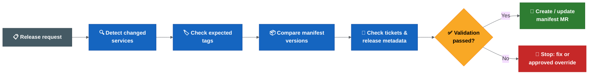

Validation should make sure:

- The expected tag exists.
- The tag points to the expected release branch/commit.
- The tag version matches the intended release version.
- The artefact was built from the expected source.
- Helm artefacts were created successfully.
- Vulnerability and code quality scans completed according to the agreed policy.

## Manifest Validation

Manifest updates must match the service tags and artefacts being released.

Validation should make sure:

- Manifest versions match the release tags.
- Missing tags fail fast.
- Incorrect tag versions fail fast.
- Manifest merge requests include the expected services only.
- Current manifest versions are compared with update versions.
- Invalid or blocked ticket statuses are handled according to agreed rules.
- `do not deploy` markers are surfaced clearly and stop release unless explicitly overridden.
- `NA` tag entries are represented clearly and do not silently hide release-impacting changes.
- DB Liquibase exceptions are handled explicitly because one Liquibase update may affect multiple projects.

## Ticket And Release Metadata Validation

Observed script responsibilities include:

- Compare start tag and end tag.
- Identify tickets included in a release.
- Add or update release-related labels.
- Update the changelog.
- Check ticket status.
- Check whether the correct tag version has been entered.
- Detect blocked, invalid or missing release metadata.
- Create a release ticket.
- Create a manifest update branch/MR.
- Update chart versions from Jira GitLab tag fields.
- Write auto-manifest changelog entries.

The team should decide which cases are warnings and which cases must fail the pipeline.

## Recommended Validation Policy

Use a strict policy for release integrity:

```text
Wrong tag -> fail.
Missing tag -> fail.
Manifest/tag mismatch -> fail.
Invalid ticket status -> fail or require explicit override.
Unknown service ownership -> fail or require explicit release-owner approval.
Do-not-deploy marker -> fail unless release owner explicitly approves an override.
```

Overrides may still be necessary, but they should be visible, approved and audited.

Items that still need explicit approval before strict enforcement:

- Whether wrong tags, missing tags and manifest/tag mismatch fail the release or only warn during a dry run.
- Which Jira statuses are valid, blocked or invalid for release.
- How `NA` tag entries are represented and when they are allowed.
- Who can approve a validation override.
- Where the override evidence is stored.
- Where release reports are retained and how long they are kept.

## Auto Manifest And Tag Jump Follow-Up

Auto manifest and tag jump tooling must be reassessed against the proposed non-linear release branch model.

Follow-up needed:

- Decide whether tag jump checking is retired, replaced or adapted for the new branching model.
- Confirm whether strict mode should fail on wrong tags, missing tags and invalid ticket status.
- Confirm how `NA` GitLab tag entries are handled in reports.
- Confirm whether release label/tag metadata still uses the same Jira fields.
- Confirm whether local/workspace runs still require proxy setup for Jira access.

## Open Questions

- Which scripts are already reliable enough to move into pipelines?
- Which scripts need refactoring before pipeline execution?
- Who owns the standard release pipeline?
- Which pipeline steps require approval gates?
- How will the automation detect services with actual changes?
- What information should be included in the audit trail?
- What should fail immediately vs require manual approval?

## Related Best Practices

Validation gates, idempotent pipeline design, immutable artefacts, release metrics and supply-chain security considerations are summarised in [release engineering best practices](docs/release-engineering-best-practices.md).

---

<- [Branching strategy options](docs/branching-options.md) | -> [Hotfix and rollback](docs/hotfix-and-rollback.md)

---

> Source: `docs/hotfix-and-rollback.md`


# Hotfix And Rollback

This page captures the open hotfix and rollback questions.

Rollback and hotfix handling need to be clear because they affect the branching model, tag strategy, manifest updates and post-release reconciliation.

Open hotfix and rollback decisions are tracked in the [release decision register](docs/release-decision-register.md), especially D16, D17 and D18.

## Hotfix Current Understanding

Hotfixes should be possible from the production state, but the detailed flow still needs to be clarified.

There are two distinct hotfix scenarios that must be supported:

### Production Hotfix (Critical Live Issue)

When a critical issue is found in production and no active release branch covers it:

```text
main / production state
  -> hotfix branch (from main)
  -> test and release hotfix
  -> update production
  -> merge hotfix back into main
  -> forward-merge hotfix into any active release branches
```

This is for urgent production fixes that cannot wait for the next release cycle.

### Release-Phase Hotfix (Issue Found During Release Preparation)

When an issue is found during release preparation or testing:

```text
active release branch
  -> hotfix branch (from release branch)
  -> test hotfix
  -> merge back into release branch
  -> release version incremented as normal
```

This is for fixes discovered during SIT, QAT or pre-production validation.

### Shared Behaviour

Both hotfix types share the following automation behaviour:

- Feature and hotfix branches are treated similarly by the automation.
- Commits on a hotfix branch should generate a deployable candidate and update the matching Cerberus chart branch.
- When merged into the target branch, the hotfix should increment the release version/tag like any other merged change.
- CVE and Renovate-style changes are expected to raise hotfix/MR work targeting the active release branch.

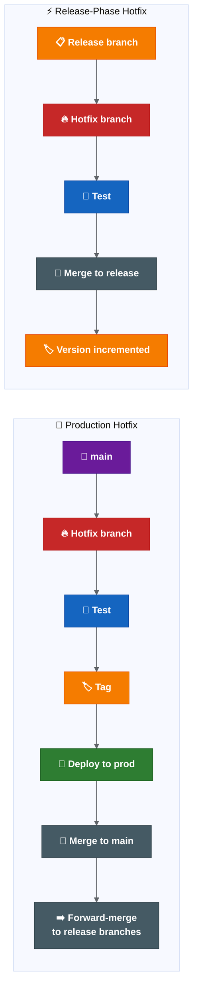

## Hotfix Questions To Answer

- Who approves a hotfix merge?
- When is the hotfix tagged?
- How is the manifest updated?
- How is the hotfix forward-merged into active release branches?
- How do we prevent hotfix drift between production and `main`?
- How do CVE/Renovate hotfix branches get reviewed and prioritised during release work?
- What is the maximum acceptable time from hotfix decision to production deployment?

## Minimum Hotfix Operating Model To Approve

Before production rollout, the team should approve the following minimum model or replace it with a better one:

| Step | Production Hotfix Default | Release-Phase Hotfix Default | Approval / Evidence |
| --- | --- | --- | --- |
| Source branch | Known production baseline (`main` after cutover, current production branch before cutover). | Active release branch. | Release owner confirms source branch. |
| Approver | Release owner plus incident lead for critical production issues. | Release owner or delegated release approver. | Approval record linked to hotfix MR. |
| Tag timing | Tag after fix is reviewed, tested and accepted for production deployment. | Tag/version increment after merge back into release branch. | Tag and pipeline link. |
| Manifest update | Update manifest to the hotfix tag before production deploy. | Update release manifest as part of normal release preparation. | Manifest MR or deployment-management change. |
| Forward merge | Merge back to `main` and assess all active release branches. | Assess later active release branches before release closure. | Forward-merge checklist. |
| Closure | Confirm production state, manifest, release record and Jira are aligned. | Confirm release branch, manifest and report are aligned. | Release/hotfix closure note. |

## Rollback Current Understanding

Rollback appears to be technically possible through Helm, but it is not currently built into the automated deployment flow.

Current state:

```text
Rollback capability: technically possible through Helm
Automated rollback: not currently built into deployment flow
Operational rollback process: unclear / not fully standardised
Common practical response: fix-forward
```

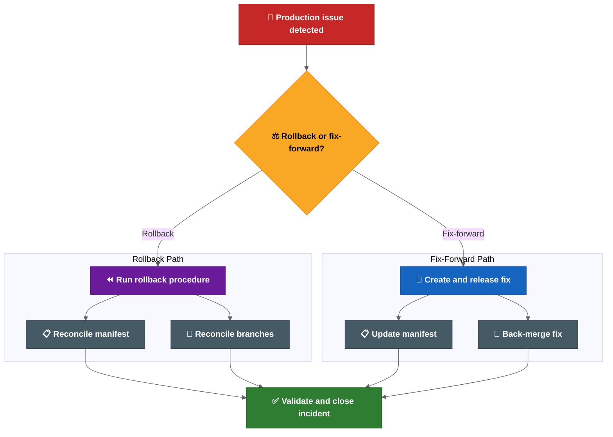

## Rollback Questions To Answer

- Is rollback a standard operating path or mostly an exception?
- When do we rollback vs fix-forward?
- Who owns the rollback decision?
- Who executes the rollback?
- Is rollback tested regularly?
- How are rollback actions audited?
- How are branches and manifests reconciled after rollback?

## Rollback vs Fix-Forward Decision Guide

The decision should be made by the release owner and incident lead, with input from the affected squad and platform owner.

| Situation | Default Decision | Why |
| --- | --- | --- |
| Bad deployment with no database or irreversible config change | Rollback candidate | Environment can likely return to the previous known-good release. |
| Defect can be fixed faster than rollback can be validated | Fix-forward candidate | Lower operational risk if the fix path is faster and clear. |
| Liquibase/data change has no rollback block | Fix-forward candidate | Database rollback may be unsafe or impossible. |
| Secret/config change is the failure cause | Case-by-case | May require config restore, secret rotation or both. |
| Security incident or exposed secret | Incident process first | Rotation and containment may matter more than application rollback. |
| Failed release partially deployed across services/charts | Stop and assess | Need manifest, chart and environment state before deciding. |

Every rollback or fix-forward decision should record:

- decision owner,
- reason,
- affected services/charts,
- database/config/secrets impact,
- selected rollback or fix-forward target,
- validation result,
- branch, manifest, release report and Jira reconciliation actions.

## What Exactly Rolls Back?

The rollback process should say whether rollback includes:

- Service image.
- Helm chart.
- Values/config.
- Manifest.
- Runbook changes.
- Secrets or environment variables.
- Database or data changes, where relevant.

If some items are not rolled back, the process should say so explicitly.

## Database And Liquibase Rollback

Database changes require special consideration because they are often forward-only.

### Current Understanding

- Liquibase is used for database schema and data changes.
- One Liquibase update may affect multiple projects.
- Liquibase changesets are typically applied once and tracked by checksum.
- There is no standard rollback block requirement documented.

### Proposed Rollback Rules

| Scenario | Action |
| --- | --- |
| Schema change with rollback block | Execute Liquibase rollback as part of the release rollback. |
| Schema change without rollback block | Fix-forward is likely the only safe option. Document why rollback is not possible. |
| Destructive data change (DROP, DELETE) | Cannot be rolled back. Fix-forward or restore from backup. Incident process applies. |
| Additive-only change (ADD COLUMN, new table) | May not need rollback if application code handles both states. |

### Recommended Practice

```text
Every production Liquibase changeset should include a rollback block or a documented justification for why rollback is not supported.
```

Release readiness for changes that include Liquibase should confirm:

1. Rollback block exists, or explicit documentation explains why not.
2. The change has been tested in a lower environment with the same rollback path.
3. The team understands whether fix-forward or rollback is the plan if the release fails.
4. If rollback is not possible, this is flagged in the release report.

## Branch And Manifest Reconciliation

Rollback is not only an environment action. It can create source-control and release-state questions.

The process should define:

- Whether `master` still reflects production after rollback.
- Whether the manifest is reverted or updated to the rollback version.
- Whether the failed release branch remains open.
- Whether a fix-forward branch is created.
- Whether `development` needs a revert, fix or follow-up merge.
- How the release notes/changelog reflect the rollback.

## Suggested Operating Principles

Useful principles to confirm:

- Hotfixes start from the known production baseline.
- `master` must stay aligned with production state.
- Hotfixes are back-merged into `development` and relevant active release branches.
- Rollback decisions are owned, documented and audited.
- Rollback instructions include code, chart, manifest, config and runbook impact.
- Fix-forward is allowed only when the risk is lower than rollback and the decision is explicit.

## Output Needed

The team should produce:

1. A documented hotfix flow.
2. A documented rollback flow.
3. A rollback vs fix-forward decision guide.
4. A branch reconciliation checklist.
5. A manifest reconciliation checklist.
6. Clear ownership for decision, execution and validation.

## Related Best Practices

Helm rollback limits, rollback runbook structure, hotfix time budgeting and Liquibase forward-only migration guidance are summarised in [release engineering best practices](docs/release-engineering-best-practices.md).

---

<- [Automation and validation](docs/automation-and-validation.md) | -> [Release scope, ownership and approvals](docs/scope-ownership-approvals.md)

---

> Source: `docs/scope-ownership-approvals.md`


# Release Scope, Ownership And Approvals

This page captures the release scope, ownership and approval questions that should be clarified.

Open scope and ownership decisions are tracked in the [release decision register](docs/release-decision-register.md), especially D20 and D21.

## Why Scope Matters

The phrase "all services" needs a clear definition.

Release risk is not limited to source branches. It may also include Helm charts, manifests, configuration, secrets, runbooks and deployment management repositories.

If scope is unclear, automation may process too much, too little or the wrong thing.

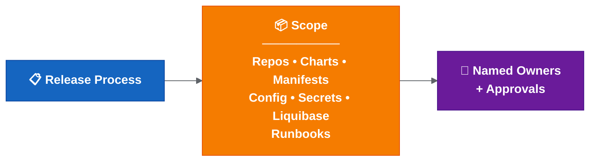

## Ownership Gap

Automation cannot replace accountability. If an automated step fails, someone still needs to decide whether to rerun, override, stop, roll back or fix forward. Without named owners, decisions are delayed and escalation is unclear.

| Area | Accountable Owner Needed | Why |
| --- | --- | --- |
| Release readiness | Release owner | Confirms release can progress. |
| Manifest/tag validation | Release owner / platform owner | Prevents wrong artefacts. |
| Drone secrets/tokens | Platform owner | Prevents environment failures. |
| Hotfix decision | Release owner / incident lead | Avoids production drift. |
| Rollback decision | Release owner / incident lead | Ensures fast incident response. |
| Changed-chart exclusion | Release owner | Prevents hidden deployment gaps. |
| Environment readiness | Platform / environment owner | Confirms deployability. |
| Alert response | Named squad/platform owner | Ensures failed automation is handled. |

## Repositories To Classify

Confirm whether these are in scope for the same release process:

- Service repositories.
- Helm chart repositories.
- Cerberus deployment management repository.
- Manifest repositories.
- Secrets/config repositories.
- Liquibase/database change repositories or scripts.
- Runbook repositories.
- Any release metadata or changelog repositories.

## Service Scope Questions

- What does "all services" mean in practice?
- Are release branches created for all services or only changed services?
- Can the automation detect services with actual changes?
- Are there services without clear squad ownership?
- Are shared libraries or shared charts included?
- Are environment-only changes included in the same release scope?
- Are secrets and Liquibase/database changes included in the same release readiness check?

## Change Types To Track

A production or feature change may involve more than application code.

Track whether each release includes:

| Change Type | Proposed Inclusion Status | Decision Needed | Notes |
| --- | --- | --- | --- |
| Application/service code | In scope by default | Confirm repository list | Service repository changes. |
| Service chart changes | In scope when changed | Confirm automation/manual boundary | May remain partly manual until Drone pipelines are updated. |
| Manifest updates | In scope by default | Confirm source of truth and approval point | Must match generated/expected tags. |
| Secrets/config changes | Needs decision per release | Confirm ownership and audit path | Needs careful handling and audit trail. |
| Liquibase/database changes | Needs decision per release | Confirm rollback/fix-forward plan | Needs release sequencing and rollback consideration. |
| Runbook steps | Needs decision per release | Confirm evidence and execution owner | Needed for manual or environment-specific operations. |

The release report should make these statuses visible for each release. If an item is excluded, the release owner should record the reason and approver.

## New Environment Readiness

Several setup points apply for new dev/test environments.

**An environment existing in Kubernetes does not mean it is release-ready.**

Before a new environment is treated as release-ready, confirm:

- [ ] Values files exist and match naming expectations.
- [ ] Environment name is supported by deployment scripts.
- [ ] Drone secrets/tokens are configured.
- [ ] Kube/robot token ownership is clear.
- [ ] Required secrets are present and encrypted correctly.
- [ ] Feature flag defaults are known and documented.
- [ ] External integrations are reachable.
- [ ] Required runbook steps are documented.
- [ ] Access and permissions are confirmed.
- [ ] Smoke test path is known and executable.

Known setup areas to verify:

- Required values files exist.
- Environment names are configured in the relevant setup/deploy scripts.
- Drone secrets/tokens exist for the environment.
- Kube/robot token ownership is clear.
- ACU responsibilities are clear where token/environment provisioning depends on them.
- Deployment scope behaviour is known for live, historical or both.
- Secret chart entries exist and use the expected encrypted format.

## Cross-Repository Ticket Grouping

The proposed automation relies heavily on consistent ticket and branch naming.

If multiple repositories use the same ticket/branch name, their changes should update the same Cerberus chart branch. This allows one feature ticket to group service, config, secret, Liquibase and runbook changes together for deployment/testing.

Open items:

- Confirm the exact branch/ticket naming rule.
- Confirm which repositories participate in cross-repo grouping.
- Confirm what happens when one ticket depends on another ticket/branch.
- Confirm who can manually adjust chart entries for cross-ticket dependencies.
- Confirm who owns secret/config updates when the change spans multiple repositories.

## Ownership Areas

Ownership should be explicit for:

- Merge approval into `development`.
- Release branch creation.
- Tag creation.
- Manifest update.
- Release readiness for each service.
- Deployment execution.
- QAT approval.
- Production release approval.
- Hotfix approval.
- Rollback decision and execution.
- Post-release validation.
- Branch and manifest reconciliation.

## Approval Points

Potential approval points:

- Merge to `development`.
- Release branch cut.
- Tag creation.
- Manifest merge request.
- Promotion to SIT.
- Promotion to higher environments.
- QAT approval.
- Production release.
- Rollback or fix-forward decision.
- Post-release closure.

The team should decide which approval points are mandatory and which can be automated.

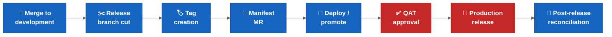

## Ownership Matrix Template

| Activity | Owner | Approver | Backup | Evidence |
| --- | --- | --- | --- | --- |
| Merge to `development` | Squad developer | Squad lead / peer reviewer | Another squad member | Merge request |
| Create release branch | Automation (Gareth/Achilles during pilot) | Release owner | Backup owner to assign | Pipeline/job link |
| Create service tag | Automation or release management | Release owner | Backup owner to assign | Tag + pipeline link |
| Update manifest | Automation (Gareth/Achilles during pilot) | Release owner | Backup owner to assign | Manifest MR |
| Deploy to lower environment | Squad developer | Squad lead | Another squad member | Deployment job |
| Deploy to SIT and above | Release management | Release owner | Backup owner to assign | Deployment job |
| QAT approval | QAT team | QAT lead | Backup owner to assign | Approval record |
| Production release | Release management | Release owner | Backup owner to assign | Release record |
| Hotfix | Squad developer (implements fix) | Release owner (approves) + incident lead (decides urgency) | Backup owner to assign | Hotfix MR/tag |
| Rollback | Platform / DevOps (executes) | Release owner (approves) + incident lead (decides) | Backup owner to assign | Rollback record |
| Post-release reconciliation | Automation + release owner | Release owner | Backup owner to assign | Merge records |

Note: Backup owners still need to be confirmed with team leads before rollout expansion. Known automation ownership sits with Gareth/Achilles for the pilot phase only; the long-term owner should be recorded in the [release decision register](docs/release-decision-register.md).

## Access And Operational Constraints

The release process should document operational constraints, including:

- Whether Thursday is the standard release day.
- Whether PNR room/location access is required for higher environments.
- Which commands require tools pod access.
- Which steps depend on environment variables or secrets.
- Which runbook steps must be executed alongside release.
- How secret exposure during screen sharing/recording is prevented.
- What happens if a secret is exposed and rotation is required.

## Output Needed

The team should produce:

1. A repository scope list.
2. A service scope list.
3. A service ownership list.
4. A release approval map.
5. A manual access/runbook checklist.
6. A post-release reconciliation owner and checklist.

## Related Best Practices

RACI, CODEOWNERS, branch protection, platform-vs-squad ownership and release-train guidance are summarised in [release engineering best practices](docs/release-engineering-best-practices.md).

---

<- [Hotfix and rollback](docs/hotfix-and-rollback.md) | -> [Rollout decision proposals](docs/rollout-decision-proposals.md)

---

> Source: `docs/rollout-decision-proposals.md`


# Rollout Decision Proposals - Summary

These are the proposed decisions that still need release/process-owner approval.

Approval status, accountable owner gaps and evidence requirements are tracked in the [release decision register](docs/release-decision-register.md).

This page is intentionally short. For rationale and detailed procedures, see [Rollout Decision Proposals - Detailed Rationale](docs/reference/rollout-decision-proposals-detailed.md).

## Decision Summary

| No | Area | Proposed Decision | Decision Status |
| --- | --- | --- | --- |
| 1 | Branch baseline | Move to `main` as the production/live baseline after an agreed cutover release. | Needs approval |
| 2 | Production sync | No release is closed until the released state is reconciled back to `main`. | Needs approval |
| 3 | Release branches | Auto-create release branches at the start of each sprint/release from `main`. | Needs approval |
| 4 | Feature/hotfix branches | Create feature and release-phase hotfix branches from the relevant release branch. | Needs approval |
| 5 | Multiple active releases | Forward-merge production/release fixes into later active release branches before closure. | Needs owner |
| 6 | Changed-chart deployment | Deploy changed charts by default; require approved override to exclude one. | Needs approval |
| 7 | Quality gates | Keep human approval before higher-environment promotion and production. | Needs approval |
| 8 | Failure handling | Make final Git/chart/reporting steps idempotent and rerunnable. | Needs approval |
| 9 | Alerting | Add Slack/email alerts for failed automation steps before production rollout. | Needs owner |
| 10 | Shared dev | Roll out shared dev deployment in phases, starting with manual trigger. | Proposed |
| 11 | Ephemeral environments | Keep ephemeral branch environments out of scope for now. | Proposed |
| 12 | New environments | Treat new dev/test environments as ready only after values, Drone secrets/tokens and setup scripts are confirmed. | Needs approval |
| 13 | Auto manifest validation | Fail on wrong tag, missing tag, manifest/tag mismatch and do-not-deploy markers unless explicitly overridden. | Needs approval |
| 14 | Rollback reconciliation | After rollback, reconcile `main`, manifests, release records and JIRA tickets to match actual production state. | Needs approval |
| 15 | Tag jump checker | Retire after the new validation is green for two consecutive releases. | Proposed |

## Highest-Risk Decisions

These decisions should be approved first because they control release safety:

1. `main` must start from confirmed production state, not from `development`.
2. Wrong tag, missing tag and manifest/tag mismatch should fail fast.
3. Changed chart exclusions need release-owner approval and an audit note.
4. Rollback must reconcile branch, manifest, release report and JIRA state.
5. Failed automation needs an alert owner and safe rerun procedure.

## Cutover Guardrails

Do not cut over to `main = production` until:

- production state is tied to a known branch/tag/manifest,
- Drone pilot is green,
- branch protections are ready,
- open work on `development` is inventoried,
- hotfix and rollback reconciliation are approved,
- release owner and backup owner are named.

## Approval Checklist

Before rollout, approve or amend:

- cutover release and `main` branch protection,
- release branch naming and source branch,
- repository scope for auto-created release branches,
- forward-merge ownership,
- changed-chart deployment override rule,
- quality gates and human approval points,
- rerun/manual intervention procedure,
- alerting channels and owners,
- shared dev rollout phase,
- new environment readiness checklist,
- manifest/tag validation strictness,
- rollback reconciliation procedure,
- tag jump checker retirement plan.

## Related Detail

- Full decision rationale: [detailed rollout decision proposals](docs/reference/rollout-decision-proposals-detailed.md)
- Approval tracker: [release decision register](docs/release-decision-register.md)
- Rollout execution practices: [release engineering best practices](docs/release-engineering-best-practices.md)
- Ownership model: [release scope, ownership and approvals](docs/scope-ownership-approvals.md)

---

<- [Release scope, ownership and approvals](docs/scope-ownership-approvals.md) | -> [CI/CD deployment findings and actions](docs/cicd-deployment-findings-and-actions.md)

---

> Source: `docs/release-decision-register.md`


# Release Decision Register

This page is the single register for decisions that must be approved, rejected or explicitly deferred before the release transformation is treated as an approved operating model.

The proposal documents describe recommended defaults. This register tracks whether those defaults have actually been agreed.

## Status Definitions

| Status | Meaning |
| --- | --- |
| Proposed | A recommended default exists, but the decision is not approved. |
| Needs approval | The decision must be approved before rollout expansion or branch cutover. |
| Needs owner | The decision cannot be executed until a named accountable owner and backup are assigned. |
| Approved | The relevant owner has approved the decision and evidence is recorded. |
| Deferred | The decision is intentionally out of scope for the current rollout. |
| Rejected | The proposal was not accepted; the replacement decision must be recorded. |

## Decision Register

| ID | Decision Area | Recommended Default | Current Status | Accountable Owner Needed | Approver Needed | Required Before | Evidence To Record |
| --- | --- | --- | --- | --- | --- | --- | --- |
| D01 | Branch baseline | Move to `main` as the production/live baseline after an agreed cutover release. | Needs approval | Release owner | Release/process owner + repo owners | Branch cutover | Cutover release, source branch/tag, branch protection record |
| D02 | Production sync | Do not close a release until production state is reconciled back to `main`. | Needs approval | Release owner | Release/process owner | First production rollout under new model | Merge record, release report, manifest state |
| D03 | Release branch creation | Auto-create release branches from `main` for every in-scope repository that needs one. | Needs approval | Automation owner | Release owner | Drone rollout expansion | Pipeline job link, repository scope list |
| D04 | Feature and hotfix branch source | Create feature and release-phase hotfix branches from the relevant release branch. | Needs approval | Squad lead / release owner | Release owner | Pilot squad briefing | Branch naming rule, squad guidance |
| D05 | Multiple active releases | Forward-merge production/release fixes into later active release branches before closure. | Needs owner | Release owner | Engineering managers | Before multiple active release branches are used | Forward-merge checklist and owner |
| D06 | Changed-chart deployment | Deploy changed charts by default; require approved override to exclude one. | Needs approval | Release owner | Release owner + platform owner | Changed-chart deployment rollout | Override record with reason and approver |
| D07 | Quality gates | Keep human approval before higher-environment promotion and production. | Needs approval | Release owner | Release/process owner + QAT lead | Production rollout | Approval workflow and evidence location |
| D08 | Failure handling | Make final Git/chart/reporting steps idempotent and rerunnable after transient failures. | Needs approval | Automation owner | Platform owner | Drone rollout expansion | Rerun procedure, pipeline evidence |
| D09 | Alerting | Add Slack/email alerts for failed automation steps before production rollout. | Needs owner | Platform owner | Release owner | Production rollout | Alert channel, owner rota, sample alert |
| D10 | Shared dev rollout | Roll out shared dev deployment in phases, starting with manual trigger. | Proposed | Platform owner | Release/process owner | Shared dev automation rollout | Rollout phase plan |
| D11 | Ephemeral environments | Keep ephemeral branch environments out of scope for now. | Proposed | Platform owner | Engineering leadership | Current transformation scope approval | Scope note |
| D12 | New environment readiness | Treat environments as ready only after values, secrets/tokens and setup scripts are confirmed. | Needs approval | Platform/environment owner | Platform owner | Any new dev/test environment rollout | Completed readiness checklist |
| D13 | Manifest/tag validation | Fail on wrong tag, missing tag, manifest/tag mismatch and `do not deploy` markers unless explicitly overridden. | Needs approval | Platform / DevOps | Release owner + platform owner | Strict validation rollout | Validation rules, override record |
| D14 | `NA` tag entries | Do not let `NA` tag entries silently hide release-impacting changes; define when they are allowed. | Needs approval | Platform / DevOps | Release owner | Strict validation rollout | `NA` handling rule |
| D15 | Ticket status validation | Define which Jira statuses are valid, blocked or invalid for release. | Needs approval | Release owner | Release/process owner | Strict validation rollout | Status mapping |
| D16 | Rollback reconciliation | After rollback, reconcile `main`, manifests, release records and Jira tickets to actual production state. | Needs approval | Release owner + incident lead | Release/process owner | Production rollout | Rollback record, reconciliation checklist |
| D17 | Rollback vs fix-forward | Define when rollback is standard, when fix-forward is safer, and who decides. | Needs approval | Incident lead | Release owner + incident lead | Production rollout | Decision guide |
| D18 | Hotfix approval and tagging | Define hotfix approver, tag timing, manifest update and forward-merge route. | Needs approval | Release owner | Release/process owner | Production hotfix readiness | Hotfix runbook |
| D19 | Tag jump checker retirement | Retire the tag jump checker only after new validation is green for two consecutive releases. | Proposed | Platform / DevOps | Release owner + platform owner | Tool retirement | Two green release records |
| D20 | Release scope | Define what "all services" means and which repositories/change types are included. | Needs approval | Release owner | Engineering managers | Rollout expansion | Repository and change-type scope list |
| D21 | Ownership matrix | Replace placeholders with named owners, approvers and backups. | Needs owner | Engineering managers | Release/process owner | Rollout expansion | Signed ownership matrix |
| D22 | Release report location | Define where release reports are published, retained and linked from. | Needs approval | Release owner | Release/process owner | Drone rollout expansion | Retention rule, report location |
| D23 | First rollout candidate | Confirm the first release/repository set that will use the new process. | Needs approval | Release owner | Engineering managers | Pilot start | Pilot scope and go/no-go result |

## Immediate Closure Order

1. Close D20 and D21 so scope and ownership are known.
2. Close D13, D14 and D15 before strict validation moves from dry-run to enforcement.
3. Close D16, D17 and D18 before production rollout.
4. Close D01, D02 and D05 before branch cutover.
5. Close D08, D09 and D22 before automation is used as the normal release path.

## Related Documents

- [Rollout decision proposals](docs/rollout-decision-proposals.md)
- [Release scope, ownership and approvals](docs/scope-ownership-approvals.md)
- [Hotfix and rollback](docs/hotfix-and-rollback.md)
- [Automation and validation](docs/automation-and-validation.md)
- [Transformation programme](docs/transformation-programme.md)

---

<- [Rollout decision proposals](docs/rollout-decision-proposals.md) | -> [Transformation programme](docs/transformation-programme.md)

---

> Source: `docs/transformation-programme.md`


# Transformation Programme

This page contains the transformation analysis, planning and governance structures that sit alongside the assessment findings.

It answers: "Who does what, when, how do we measure success, and what does it cost?"

## Root Cause Analysis

| Problem | Root Cause | Evidence |
| --- | --- | --- |
| Failed or wrong release | Environment mismatch; tag/manifest validation not enforced. | Multiple tag versions created for same release (e.g. 581, 582, 583, 584). |
| Delayed release | Manual coordination across people, scripts and repos. | Release preparation reported to take days per sprint. |
| Rollback uncertainty | No tested operational rollback process; Liquibase may be forward-only. | Recent practical behaviour leans towards fix-forward. |
| Testing inconsistencies | Environment drift; lower envs deployed ad hoc while higher envs use chart releases. | Pre-prod may contain more data than production. |
| Unclear release content | Release metadata spread across Jira, Git tags, manifests and scripts. | Tag jump checker sometimes passes when it should fail. |
| Ownership confusion | RACI not assigned; "release management" is a function, not a named person per release. | Ownership matrix still requires named backup owners and formal approval. |

## Risk Assessment

| # | Risk | Likelihood | Impact | Priority | Mitigation |
| --- | --- | --- | --- | --- | --- |
| R1 | Production outage from wrong artefact. | Medium | Critical | P1 | Strict tag/manifest validation; fail on mismatch. |
| R2 | Extended incident due to no rollback process. | Medium | Critical | P1 | Document and test rollback flow; define time budget. |
| R3 | Release delays from manual coordination. | High | Medium | P2 | Automation pilot; Drone as single release path. |
| R4 | Partial release (missing secrets/config/DB). | High | High | P1 | Explicit release scope checklist per release. |
| R5 | Audit failure from weak release trail. | Medium | High | P2 | Pipeline-generated release reports; immutable artefacts. |
| R6 | Environment failure at deploy time. | Medium | Medium | P3 | Formal environment readiness gate. |
| R7 | Escalation confusion during incident. | High | Medium | P2 | Named owners per RACI. |
| R8 | Trunk-based instability. | Low (if deferred) | High | P3 | Do not adopt trunk-based until feature flags mature. |

## Current Release Maturity Assessment

| Area | Current Score | Target Score | Gap |
| --- | --- | --- | --- |
| Source control and branching | 3.0 / 5 | 4.5 / 5 | Branch model clear but reconciliation and automation incomplete. |
| CI/CD pipeline | 3.0 / 5 | 4.5 / 5 | Pipeline exists but release steps are local/manual. |
| Release validation | 2.0 / 5 | 4.5 / 5 | Scripts exist but fail/warn policy not enforced. |
| Deployment automation | 2.5 / 5 | 4.0 / 5 | Helm/Drone works but manual chart updates and triggers remain. |
| Observability and monitoring | 2.0 / 5 | 4.0 / 5 | Health checks exist; no release-correlated observability gates. |
| Release governance and ownership | 2.0 / 5 | 4.5 / 5 | Templates exist; named owners and approval map incomplete. |
| Hotfix and rollback | 1.5 / 5 | 4.0 / 5 | Technical capability exists; no tested operational process. |
| Environment management | 2.5 / 5 | 4.0 / 5 | Environments exist but readiness is not gated. |
| Secrets and config management | 2.5 / 5 | 4.0 / 5 | Git-crypt works but onboarding and rotation are heavy. |
| Release reporting and audit | 2.0 / 5 | 4.5 / 5 | Scripts generate some metadata; not yet pipeline-driven or mandatory. |

**Overall: Current 2.3 / 5 → Target 4.3 / 5**

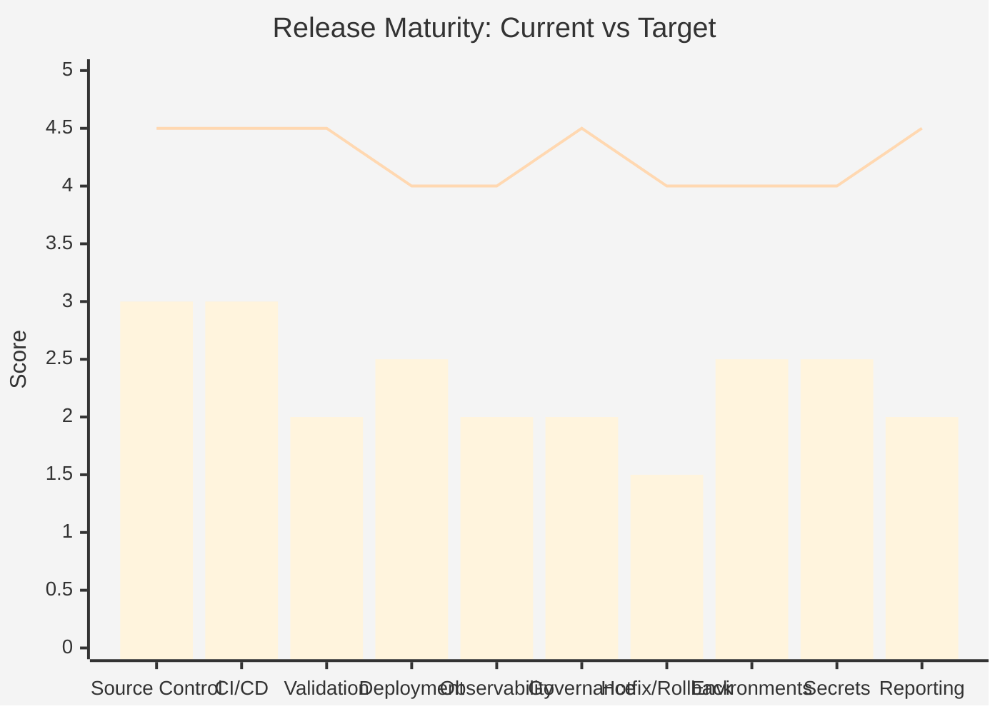

## Transformation Principles

1. **Do not change the branching model first.** Stabilise the release operating model before simplifying branches.
2. **Standardise release metadata.** Every release must be traceable from commit to production through tags, manifests, reports and Jira.
3. **Automate before reorganising.** Prove the automation works with the current model before introducing a new one.
4. **Improve visibility before restructuring.** Release reports, dashboards and alerting make problems visible so they can be fixed.
5. **Reduce manual release activities.** Every manual step is a consistency risk and a scaling bottleneck.
6. **Make ownership explicit.** Unnamed responsibilities are unowned responsibilities.
7. **Test rollback before you need it.** A rollback process that has never been tested is not a rollback process.
8. **Treat environment readiness as a gate, not an assumption.** An existing namespace is not a ready environment.

## Target State Architecture

### Current vs Target

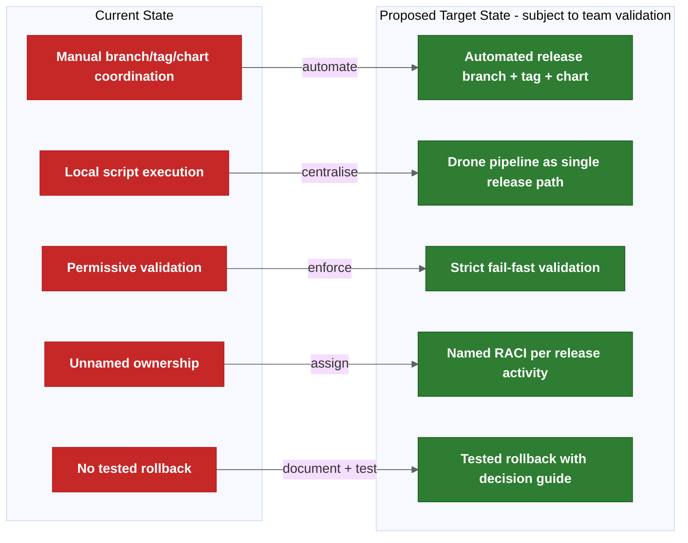

### Proposed Target End State - Subject To Team Validation

```text
- main = production baseline (always).
- Release branches auto-created, short-lived (proposed: 1-2 sprint duration — needs confirmation).
- Feature/hotfix branches auto-generate deployable candidates.
- Cerberus charts auto-updated on merge.
- Changed-chart detection deploys only what changed.
- Release reports auto-generated with Jira cross-reference.
- Strict validation enforced (wrong tag = fail).
- Named owners for every release activity.
- Rollback tested and documented.
- Environment readiness gated.
- Alerting for all automation failures.
```

## Future State: Unified Deployment And Release Control Plane

> **This is a future maturity option, not an immediate implementation requirement.**
>
> The technical implementation of this control plane is detailed in the [Deployment Knowledge Graph](docs/deployment-knowledge-graph-design.md) architecture. The Knowledge Graph is the data/intelligence layer; the Control Plane is the operational interface layer. Together they form the long-term unified platform.

### Why This Matters

The current release process is spread across: Git branches, Git tags, Docker images, Helm charts, Cerberus deployment-management, manifests, environment values, secrets, Liquibase, Jira, QAT approvals, release reports, manual runbooks and Drone pipeline execution.

The current transformation plan improves these areas through automation and validation, but it still leaves teams interacting with several tools to answer basic questions like "what is in this release?" or "what is deployed where?"

A unified control plane would reduce cognitive load and provide one operational view of release and deployment state. It would not replace the underlying tools — it would orchestrate and visualise them.

### What The Control Plane Would Do

| Capability | Description |
| --- | --- |
| Release inventory | Show all active, planned and historical releases. |
| Environment state | Show what version is deployed in each environment. |
| Deployment intent | Show what should be deployed according to deployment-management. |
| Actual runtime state | Show what is actually running in Kubernetes. |
| Approval workflow | Capture release owner, QAT and production approvals. |
| Validation status | Show tag, image, chart, manifest, Jira and environment readiness validation. |
| Rollback/fix-forward decision support | Show available rollback targets and known constraints. |
| Audit trail | Record who approved, deployed, overrode, rolled back or excluded a chart. |
| Release report dashboard | Expose release reports without needing to inspect pipeline logs manually. |
| Ownership view | Show squad/service owner, release owner and platform owner. |
| Alerting integration | Route failed automation or deployment issues to the right owners. |
| Metrics and DORA reporting | Track deployment frequency, lead time, failure rate and recovery time. |

### Current Tooling Relationship

The control plane should not initially replace existing tools. It should orchestrate and visualise them:

- Git remains the source of code history.
- Deployment-management remains the source of deployment intent.
- Drone remains the automation engine.
- Helm remains the packaging/deployment mechanism.
- Jira remains the work and release metadata source.
- Kubernetes remains the runtime state.
- Observability tools remain the health signal source.

> **The control plane should not become a second source of truth. It should read from, validate and coordinate the existing sources of truth.**

### Conceptual Architecture

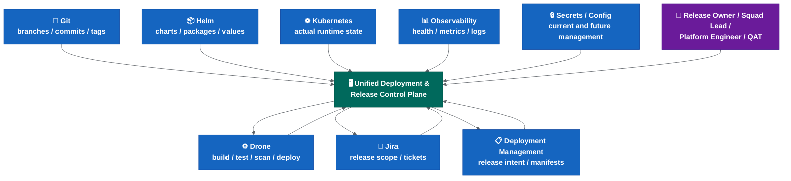

The platform gives a single operational view. It can trigger approved automation through Drone. It should not bypass existing validation gates. It should record decisions and overrides. It should reconcile intended state against actual state.

### Example User Journeys

**Release Owner Journey:**
1. Opens release dashboard.
2. Selects active release.
3. Reviews included services and Jira tickets.
4. Checks validation status.
5. Reviews changed charts.
6. Confirms environment readiness.
7. Approves promotion to SIT or production.
8. Sees deployment progress and post-deployment health.

**Squad Lead Journey:**
1. Checks whether squad services are included in release.
2. Reviews branch/tag/image/chart status.
3. Sees failed validations.
4. Fixes missing Jira tag, ownership or manifest mismatch.
5. Confirms service readiness.

**Platform Engineer Journey:**
1. Reviews failed pipeline or deployment automation.
2. Checks Drone job, manifest, Helm chart and Kubernetes state.
3. Determines whether rerun is safe.
4. Records manual intervention or override.
5. Confirms state reconciliation.

**Incident / Rollback Journey:**
1. Incident detected.
2. Control plane shows current deployed version.
3. Shows previous known good release.
4. Shows whether Liquibase rollback exists.
5. Shows whether config/secrets changed.
6. Release owner chooses rollback or fix-forward.
7. Decision is recorded.
8. Branch, manifest and Jira reconciliation tasks are created.

### Maturity Path

| Phase | Capability | Description |
| --- | --- | --- |
| Phase 1 | Read-only dashboard | View release, environment, manifest and deployment state. |
| Phase 2 | Validation dashboard | Show tag/image/chart/manifest/Jira/environment readiness status. |
| Phase 3 | Approval workflow | Capture release owner, QAT and production approvals. |
| Phase 4 | Controlled deployment trigger | Trigger Drone deployment jobs from the control plane after approval. |
| Phase 5 | Rollback assistant | Show rollback candidates and required reconciliation steps. |
| Phase 6 | Metrics and audit reporting | Provide DORA metrics, release KPIs and audit exports. |
| Phase 7 | GitOps / progressive delivery integration | Integrate with ArgoCD, Argo Rollouts or future deployment controllers if adopted. |

### Non-Goals For The First Version

- Do not replace Drone initially.
- Do not replace Helm initially.
- Do not replace deployment-management initially.
- Do not create a second deployment source of truth.
- Do not allow uncontrolled production deployment.
- Do not bypass QAT or release owner approval.
- Do not combine this with the first branch cutover.
- Do not implement progressive delivery at the same time as the first control-plane version.

### Risks And Mitigations

| Risk | Why It Matters | Mitigation |
| --- | --- | --- |
| Becomes another source of truth | Creates more fragmentation instead of reducing it. | Read from existing sources; write only approved decisions and audit records. |
| Too much scope too early | Could delay immediate release automation work. | Start read-only; separate from initial rollout. |
| Bypasses existing controls | Could weaken governance. | Integrate with existing approval gates and validation rules. |
| Poor data quality | Dashboard is only useful if underlying metadata is reliable. | Complete validation and metadata standardisation first. |
| Ownership unclear | Platform may become unowned tooling. | Assign product/platform ownership before build. |
| Security exposure | Dashboard may show sensitive release, secret or environment metadata. | Apply RBAC, audit logging and avoid showing raw secrets. |

### Success Criteria

- Release owner can answer "what is in this release?" from one place.
- Platform team can answer "what is deployed where?" from one place.
- Squad leads can see validation failures without reading pipeline logs.
- Production deployment approval is recorded in one auditable workflow.
- Rollback candidate and constraints are visible during incidents.
- Every production deployment links to: Git commit/tag, Docker image, Helm chart, deployment-management manifest, Jira release scope, approval record, deployment job and post-deployment health signal.

### Decision Required Before Starting

Before starting this future work, the team must decide:

- Whether the control plane is an internal platform product.
- Who owns it.
- Whether deployment-management remains the source of deployment intent.
- Whether the control plane can trigger Drone jobs or is read-only.
- What RBAC model applies.
- How approval records are stored.
- What audit/export requirements exist.
- Whether this integrates with future GitOps tooling.

For roadmap, RACI, metrics, cost/benefit and recommendations, see [transformation programme — delivery](docs/transformation-programme-delivery.md).

---

← [System state, problems, solutions and risks](docs/system-state-problems-solutions.md) | → [Transformation programme — delivery](docs/transformation-programme-delivery.md)

---

> Source: `docs/transformation-programme-delivery.md`


# Transformation Programme — Delivery

This page contains the roadmap, governance structures, metrics and recommendations for the release transformation.

For root cause analysis, risk assessment, maturity scorecard and target state architecture, see [transformation programme](docs/transformation-programme.md).

## Transformation Roadmap

Roadmap status reflects execution readiness, not document-writing progress. Phase 0 remains active until the rollout decisions are approved, named owners/backups are assigned and exit criteria are published. See the [release decision register](docs/release-decision-register.md) for the live approval tracker.

| Phase | Timeframe | Focus | Key Deliverables |
| --- | --- | --- | --- |
| 0 | Now (Week 1-2) | Decisions and ownership | Approve rollout decisions; assign named owners; publish exit criteria. Status: active / not yet closed. |
| 1 | Month 1 | Quick wins | Pre-commit hook; strict validation dry-run; environment readiness checklist; rollback documentation. Starts after Phase 0 decisions are closed. |
| 2 | Month 2-3 | Release automation | Drone pilot green; auto branch/tag/chart; release reporting; alerting. |
| 3 | Month 3-4 | Branch cutover | Controlled `main = production` cutover; branch protections; forward-merge rules active. |
| 4 | Month 4-6 | Scale and harden | Changed-chart deployment default; shared dev auto-deploy; rerun safety; full RACI enforcement. |
| 5 | Month 6-12 | Modernise | Runtime feature flags; External Secrets Operator; SBOM generation; observability gates evaluation; read-only deployment/release dashboard feasibility. |
| 6 | 12+ months | Optimise (if needed) | Trunk-based evaluation; GitOps (ArgoCD); progressive delivery; canary rollout; unified deployment control plane evaluation. |
| 7 | Future | Platform maturity | Controlled deployment trigger; rollback assistant; approval workflow integration; metrics/audit reporting through control plane. |

```mermaid
%%{init: {'theme': 'base', 'themeVariables': {'lineColor': '#5f6368'}}}%%

gantt
  title Transformation Roadmap
  dateFormat YYYY-MM
  axisFormat %b %Y

  section Phase 0
  Decisions and ownership       :active, p0, 2026-06, 2w

  section Phase 1
  Quick wins                    :p1, after p0, 4w

  section Phase 2
  Release automation (Drone)    :p2, after p1, 8w

  section Phase 3
  Branch cutover                :p3, after p2, 4w

  section Phase 4
  Scale and harden              :p4, after p3, 8w

  section Phase 5
  Modernise                     :p5, after p4, 24w

  section Phase 6
  Optimise                      :p6, after p5, 24w
```

## Prioritisation Matrix

| Recommendation | Impact | Effort | Priority Quadrant |
| --- | --- | --- | --- |
| Strict tag/manifest validation | High | Low | **Do first** |
| Release metadata standardisation | High | Low | **Do first** |
| Named ownership (RACI) | High | Low | **Do first** |
| Rollback documentation and testing | High | Medium | **Do first** |
| Environment readiness gate | High | Low | **Do first** |
| Drone release automation pilot | High | Medium | **Do next** |
| Release reporting dashboard | High | Medium | **Do next** |
| Changed-chart detection and deployment | High | Medium | **Do next** |
| Alerting for failed automation | Medium | Low | **Do next** |
| Branch cutover (`main = production`) | Medium | Medium | **Plan** |
| External Secrets Operator | Medium | Medium | **Plan** |
| Runtime feature flags | Medium | High | **Defer** |
| SBOM generation | Low-Medium | Low | **Plan** |
| ArgoCD / GitOps | Medium | High | **Defer** |
| Canary / progressive delivery | Medium | Very High | **Defer** |
| Trunk-based development | Medium | Very High | **Defer** |

## RACI Matrix

| Activity | Dev / Squad | Tech Lead | Architect | Platform / DevOps | Release Owner | QAT | Incident Lead |
| --- | --- | --- | --- | --- | --- | --- | --- |
| Feature development | R | A | C | I | I | I | I |
| Merge to release branch | R | A | I | I | I | I | I |
| Release branch creation | I | I | I | R | A | I | I |
| Tag and artefact build | I | I | I | R | A | I | I |
| Manifest validation | I | C | C | R | A | I | I |
| Deploy to lower environments | R | A | I | C | I | I | I |
| Deploy to SIT and above | I | C | I | R | A | C | I |
| Functional validation | C | I | I | I | I | R/A | I |
| Production release approval | I | C | C | C | A | R | I |
| Hotfix decision | R (implements) | C | C | R (executes) | A | I | C (decides urgency) |
| Rollback decision | I | C | C | R (executes) | A | I | R (decides) |
| Post-release reconciliation | I | I | I | R | A | I | I |
| Environment readiness | I | I | C | R/A | C | I | I |
| Alert response | R | A | I | R | C | I | C |
| Release reporting | I | I | C | R | A | I | I |
| Incident investigation | C | C | I | R | C | I | A |

Legend: R = Responsible, A = Accountable, C = Consulted, I = Informed.

Note: Named individuals still need to be assigned. This matrix defines roles, not people. Incident Lead is the designated on-call or incident manager during an active incident. Needs confirmation with team leads.

## Indicative Success Metrics - To Be Baseline Measured

| Metric | Current (Estimated) | Phase 2 Target | Phase 4 Target | Measurement Source |
| --- | --- | --- | --- | --- |
| Deployment frequency | Monthly (approx.) | Fortnightly | Weekly | Drone pipeline history |
| Lead time (commit to production) | 10-15 days (estimated) | 5-7 days | 2-3 days | Git + Drone timestamps |
| Change failure rate | Unknown (estimated 10-15%) | < 5% | < 2% | Incident records |
| Mean time to restore (MTTR) | Unknown (estimated 4-8h) | < 2h | < 1h | Incident records |
| Release preparation effort | Days per sprint | < 1 day | < 2 hours | Team time tracking |
| Manual steps per release | 10+ (estimated) | < 5 | < 2 (approve + trigger) | Process audit |
| Release report accuracy | Partial / manual | Auto-generated, reviewed | Auto-generated, trusted | Pipeline artefacts |
| Rollback test frequency | Never tested | Tested once per quarter | Tested every release cycle | Runbook execution log |
| Environment readiness failures | Unknown | Tracked and gated | Zero (gated) | Pre-deployment checks |

Note: Current values are estimates based on available information. Actual baseline measurement should begin in Phase 1.

## Cost / Benefit Analysis

| Improvement | Estimated Cost | Expected Benefit | Payback |
| --- | --- | --- | --- |
| Strict validation (fail-fast) | Low (script/config change) | Prevents wrong artefacts reaching production. | Immediate |
| Named ownership (RACI) | Low (management decision) | Faster decisions during incidents and releases. | Immediate |
| Rollback documentation | Low-Medium (documentation + testing) | Confidence for production incidents. | First incident avoided |
| Drone release automation | Medium (pilot + rollout) | Days saved per sprint; consistent execution. | 2-3 releases |
| Release reporting dashboard | Medium (tooling + pipeline) | Visibility for all stakeholders; audit trail. | Ongoing |
| Environment readiness gate | Low (checklist + pre-deploy check) | Eliminates late release failures. | First prevented failure |
| Changed-chart deployment | Medium (detection logic + validation) | Faster deploys; no unnecessary chart pushes. | Ongoing |
| External Secrets Operator | Medium (infrastructure + migration) | Simpler rotation; better audit; easier onboarding. | 6 months |
| ArgoCD / GitOps | High (infrastructure + process change) | Drift detection; instant rollback via Git revert; full audit. | 12+ months |
| Trunk-based development | Very High (culture + tooling + flags) | Uncertain until feature flags and validation mature. | Unknown |

## Investment Recommendation

> **Recommended investment focus should be release governance, environment standardisation and deployment automation rather than immediate branching model replacement.**

The highest-return investments are low-cost, high-impact changes (strict validation, ownership, environment readiness) combined with the medium-cost automation pilot already in progress. Branch model simplification and platform modernisation (GitOps, progressive delivery) should follow naturally once the operating model is stable and measurable.

## Top 10 Recommendations

| # | Recommendation | Phase |
| --- | --- | --- |
| 1 | Standardise release metadata (tags, manifests, Jira fields, commit format). | 0-1 |
| 2 | Establish release governance (named owners, approval map, RACI). | 0 |
| 3 | Enforce strict release validation (wrong/missing tag = fail). | 1 |
| 4 | Complete Drone release automation pilot. | 2 |
| 5 | Document and test rollback process. | 1 |
| 6 | Formalise environment readiness as a deployment gate. | 1 |
| 7 | Create release reporting dashboard. | 2 |
| 8 | Introduce release KPIs (DORA metrics + custom). | 2 |
| 9 | Strengthen audit trail (pipeline artefacts, immutable reports). | 2-3 |
| 10 | Re-evaluate branching strategy after maturity improvements (Phase 4+). | 4+ |

**Long-term note:** After the immediate release operating model is stabilised, the team should evaluate whether a unified deployment and release control plane is justified. This should be treated as a platform product decision, not as part of the first automation rollout. See the Future State section above for the full description.

---

<- [System state, problems, solutions and risks](docs/system-state-problems-solutions.md) | -> [Rollout decision proposals](docs/rollout-decision-proposals.md)

---

← [Transformation programme](docs/transformation-programme.md) | → [Rollout decision proposals](docs/rollout-decision-proposals.md)

---

> Source: `docs/squad-briefing-summary.md`


# Squad Briefing Summary

This is a short CI/CD and deployment summary for squad leads.

## What Is Changing

The team is working to reduce the current manual-heavy release process.

The target direction is to automate more of the release flow so that release branches, versions, tags, Cerberus chart changes and reporting can be generated through a repeatable pipeline.

The proposed model is:

- `development` does not become `main`. `main` is created from the confirmed production baseline. `development` is transitional and later retired.
- `main` represents production/live state.
- Release branches are automatically created at the start of each sprint/release.
- Feature and hotfix branches are created from the relevant release branch.
- Commits on those branches generate deployable candidate tags and update matching Cerberus chart branches.

The proposed decision set is captured in [rollout decision proposals](docs/rollout-decision-proposals.md).

## Why It Matters

The current process takes a lot of manual effort each week. The automation should help:

- Reduce manual release work.
- Improve visibility of what changed.
- Cross-reference release content with JIRA.
- Check that the release contains what it is expected to contain.
- Make the process easier to audit and repeat.
- Deploy changed charts without manually listing every service.

## Current Status

- Gareth/Achilles are testing the automation on the new configuration service.
- The scripts work locally.
- The next implementation step is to run the automation and reporting in Drone.
- Rollout may be possible within the next release or two, subject to team confirmation.
- Some manual server chart work may remain until the relevant Drone pipelines are updated.
- Alerting for failed automation steps is not yet defined.
- Quality gates and human approval points still need to be confirmed.

Current recommendation:

- Keep human approval before higher-environment promotion and production.
- Deploy changed charts by default.
- Allow chart deployment exclusions only with release owner approval and an audit note.
- Keep ephemeral branch environments out of scope for now.
- Treat new dev/test environments as ready only after values files, setup script entries and Drone secrets/tokens are confirmed.

## What Squads Should Know

- Release branches may start being used soon.
- The active release branch may be deployed regularly to a shared dev environment for cross-team integration testing. The initial rollout phase will use a manual trigger only; automatic deployment to shared dev will come in later phases.
- Squad dev test environments remain separate.
- Feature branches are expected to be deleted after merge, once any required reporting has been generated.
- Merge commits into release branches need MMA/JIRA ticket references and meaningful messages because release branch history becomes the changelog.
- Long-running feature branches may need to merge in previous and next release branches to avoid missing hotfixes or conflicts.
- Squads should raise concerns about branch naming, ticket references, server chart handling, release reporting, shared dev deployment or quality gates before rollout.

## Input Needed From Squads

1. Are there services in your squad that need special handling during release?
2. Do your changes commonly include secrets, config or Liquibase/database updates?
3. Are there current manual release steps that automation might miss?
4. Are commit messages consistently linked to MMA/JIRA tickets?
5. Do any long-running branches need special handling across multiple releases?
6. Are there services that should not be auto-deployed even if their chart changed?
7. Do any squad-owned changes use `NA` tag entries, secrets/config or Liquibase exceptions?
8. Who should be the squad contact for rollout questions?

## How This Rollout Will Be Communicated

### Feedback Loop

The rollout follows a "show, don't tell" approach:

```text
1. Pilot runs -> results shared with squads.
2. Squads review results -> raise concerns or questions.
3. Concerns addressed -> next phase starts.
4. Repeat until all squads are on the new process.
```

No squad will be switched to the new process without seeing it work first on a real release.

### What Squads Should Do Now

| Action | When | Who |
| --- | --- | --- |
| Answer the input questions above | Before rollout review meeting | Squad lead or nominated rep |
| Ensure commit messages reference MMA tickets | Immediately (good practice regardless) | All developers |
| Review current manual release steps for your service | Before pilot completion | Squad lead |
| Identify long-running branches that span releases | Before first release branch auto-creation | Feature owners |
| Nominate a squad contact for rollout questions | Before Phase 2 expansion | Squad lead |

### What Will NOT Change Immediately

- **Squad dev/test environments**: remain yours, deployed by you, no change.
- **Feature development workflow**: still branch -> develop -> MR -> review -> merge.
- **QAT approval**: still required for SIT and above.
- **Production release timing**: still Thursday (or as agreed).
- **Release owner approval**: still human, still required.

The automation handles the plumbing between your merge and the deployment. Your day-to-day development workflow stays the same.

---

<- [CI/CD deployment findings and actions](docs/cicd-deployment-findings-and-actions.md) | -> [README](README.md)

---

> Source: `docs/release-engineering-best-practices.md`


# Release Engineering Best Practices

This page keeps industry/practice guidance out of the main operating-model pages.

Use it as supporting reference when deciding how far to take the Cerberus release automation, branching, validation, rollback, ownership and environment-management changes.

## Branching Model Selection

The branching model should match release cadence and operational maturity.

| Factor | GitFlow-style Better | Trunk-based Better |
| --- | --- | --- |
| Release cadence | Weekly / fortnightly / scheduled | Multiple times per day / on demand |
| Approval gates | QAT and release sign-off | Mostly automated gates |
| Feature flags | Deploy-time or limited | Runtime and reliable |
| Test automation | Partial | Strong regression coverage |
| Rollback confidence | Manual or untested | Fast and tested |
| Team ownership | Multiple squads, shared release | Small services, clear ownership |

Recommended Cerberus position:

```text
Stabilise the current GitFlow-style model first.
Then move to streamlined release branches with `main = production`.
Only move toward trunk-based development after feature flags, validation and rollback are mature.
```

## Release Automation

The proposed Cerberus flow aligns with GitOps principles:

```text
Git commit -> pipeline builds artefact -> deployment repo is updated -> environment deploys known state
```

Good release automation should:

- run centrally in Drone rather than on local machines,
- be idempotent and safe to rerun,
- build once and deploy the same artefact to higher environments,
- produce a release report,
- store logs and reports for audit,
- fail fast on release-integrity issues,
- alert the right owner when it fails.

Avoid:

- manual chart version edits as the default path,
- hidden Drone UI configuration that is not versioned,
- rebuilding artefacts for higher environments,
- continuing after wrong or missing tag validation.

## Validation Gates

Use a layered validation model:

| Gate | When | Purpose |
| --- | --- | --- |
| Pre-commit / MR | Before merge | Ticket reference, format, basic hygiene. |
| Branch pipeline | On push | Build, unit test, Helm lint/template, security checks. |
| Release pipeline | On merge/tag | Artefact creation, manifest/tag validation, report generation. |
| Promotion gate | Before SIT and above | Human approval plus report and diff review. |
| Production gate | Before production | QAT approval, rollback/fix-forward plan, final report check. |

Recommended strict rules:

```text
Wrong tag -> fail.
Missing tag -> fail.
Manifest/tag mismatch -> fail.
Do-not-deploy marker -> fail unless explicitly overridden.
Invalid ticket status -> fail or release-owner override.
```

Overrides should record approver, reason, timestamp, risk and follow-up action.

## Helm And Deployment

Treat chart versions and application versions separately:

```text
Chart version = version of chart packaging/templates.
App version = version of the application image inside the chart.
```

Recommended Helm practices:

- bump chart version when templates or deployment config change,
- keep base values safe for the lowest environment,
- keep environment override files focused on differences,
- keep secrets out of plain values files,
- run Helm lint/template in CI,
- store mass diff output with the release record,
- document which services are inside each umbrella chart.

Changed-chart deployment is a good default, but early rollout should keep human review because false negatives are risky.

## Environment And Feature Flags

Deployment does not always mean activation.

Feature flag maturity:

| Level | Description | Release Impact |
| --- | --- | --- |
| Build-time | Compile-time or static config | Least flexible. |
| Deploy-time | Helm values or environment config | Enables dark launch but needs redeploy to change. |
| Runtime static | Read at startup from config service | Better central control, restart may be needed. |
| Runtime dynamic | Change without redeploy | Best for kill-switches and progressive rollout. |

Cerberus appears closest to deploy-time flags today. That means trunk-based development would still carry release risk unless runtime flag control improves.

Feature flag rules:

- every incomplete feature must be behind a flag,
- each flag has an owner,
- each flag has a planned removal date,
- flag state per environment appears in the release report,
- critical features have a fast-disable path.

Environment readiness should confirm:

- values files,
- secrets,
- tokens,
- data shape,
- network rules,
- external integrations,
- permissions,
- runbook steps,
- feature flag defaults.

## Secrets Management

Git-crypt and managed secrets scripts are workable short-term controls, but they add operational cost as teams and environments grow.

| Option | Strength | Risk |
| --- | --- | --- |
| Git-crypt | Simple and version-controlled. | GPG onboarding and rotation overhead. |
| Sealed Secrets | Kubernetes-native encrypted secrets. | Requires controller per cluster. |
| External Secrets Operator | Syncs from a central secret store. | Adds infrastructure dependency. |
| Vault / AWS Secrets Manager | Strong audit and rotation model. | Larger platform migration. |

Recommended sequence:

```text
Short term: keep managed secrets scripts and Drone secrets stable.
Medium term: pilot External Secrets Operator or Sealed Secrets.
Long term: centralise secret storage and rotation.
```

Do not combine a major secret-management migration with the first release-automation rollout.

## Hotfix And Rollback

Helm rollback can revert Kubernetes manifests to a previous revision, but it does not automatically undo:

- database/data changes,
- external state,
- queue/cache side effects,
- third-party calls,
- dependent service behaviour.

Recommended rollback runbook:

1. Release owner approves rollback or fix-forward.
2. Notify squads and stakeholders.
3. Check database and Liquibase impact.
4. Roll back application/chart/config where safe.
5. Reconcile manifest and deployment-management state.
6. Run smoke tests.
7. Reconcile `main`, active release branches and release records.
8. Update incident and JIRA records.

Practical rule:

```text
If a production hotfix cannot be developed, tested and deployed within the agreed time budget,
reassess rollback instead of letting fix-forward drift indefinitely.
```

For Liquibase/database work, prefer expand/migrate/contract patterns so application rollback remains possible without database rollback.

## Ownership And Approvals

Use RACI for release activities:

```text
R = Responsible: does the work.
A = Accountable: owns the outcome.
C = Consulted: gives input.
I = Informed: notified.
```

The important rule is one accountable owner per critical activity.

Recommended ownership split:

- Platform owns Drone pipelines, Helm libraries, deployment tooling, environment provisioning and secrets infrastructure.
- Squads own service code, service config, feature flags, Liquibase migrations and functional testing.
- Release owner owns release timing, production approval, hotfix/rollback decision coordination and final reconciliation.

Use CODEOWNERS and branch protection to enforce approvals where possible.

## Rollout Strategy

Avoid big-bang process rollout.

Recommended phases:

```text
Phase 1: one service, one squad, one release cycle.
Phase 2: two or three squads.
Phase 3: all squads and services.
Phase 4: optimise with metrics and remove friction.
```

Measure:

- release preparation time,
- time from merge to deployable artefact,
- manual step count,
- release report accuracy,
- failed deployment recovery time,
- hotfix to production time.

If the pilot creates more risk than it removes, stop the pilot, revert affected services to the previous manual process, fix the root cause and restart from the last known-good phase.

---

<- [README](README.md) | -> [Platform engineering strategy](docs/platform-engineering-strategy.md)

---

> Source: `docs/platform-engineering-strategy.md`


# Platform Engineering Strategy

> **This section is not a blocker for the initial release automation rollout.** It describes the maturity roadmap after the immediate release operating model is stabilised. All items below (SBOM, ArgoCD, Argo Rollouts, canary deployment, observability gates, supply chain security) are **medium-term or long-term improvements**, not immediate required changes.

This page covers the platform-level capabilities that strengthen the release process beyond branching and CI/CD pipelines: environment promotion, deployment strategies, observability gates, GitOps readiness and supply chain security.

These are not immediate blockers for the release automation rollout, but they represent the maturity path that moves the team from "release automation works" to "releases are safe, observable and verifiable by design."

## 1. Environment Promotion Model

### Current State

The current promotion path is understood but not formally documented as a model:

```text
Squad dev/test → Shared dev → SIT → B.Val / Pre-prod → Production
```

Promotion today is largely manual: a person triggers deployment to the next environment after the previous one passes some form of validation.

### Target Promotion Model

```mermaid
%%{init: {'theme': 'base', 'themeVariables': {'lineColor': '#5f6368'}}}%%

flowchart TD
  DEV["🧪 Squad Dev/Test\n──────────\nDeveloper deploys\nFeature branch artefact\nNo gate required"]:::dev
  SHARED["🔗 Shared Dev\n──────────\nRelease branch artefact\nIntegration testing\nGate: pipeline green"]:::shared
  SIT["📋 SIT\n──────────\nRelease branch artefact\nFunctional validation\nGate: release owner approval"]:::sit
  PREPROD["🔒 Pre-prod / B.Val\n──────────\nSame artefact as SIT\nProduction-like validation\nGate: QAT approval"]:::preprod
  PROD["🏁 Production\n──────────\nSame artefact\nFinal promotion\nGate: release + QAT approval\n+ rollback plan confirmed"]:::prod

  DEV --> SHARED --> SIT --> PREPROD --> PROD

  classDef dev fill:#43a047,stroke:#2e7d32,color:#fff,font-weight:bold
  classDef shared fill:#1565c0,stroke:#0d47a1,color:#fff,font-weight:bold
  classDef sit fill:#f57c00,stroke:#e65100,color:#fff,font-weight:bold
  classDef preprod fill:#7b1fa2,stroke:#4a148c,color:#fff,font-weight:bold
  classDef prod fill:#c62828,stroke:#b71c1c,color:#fff,font-weight:bold
```

### Promotion Rules

| Rule | Description |
| --- | --- |
| Immutable artefact | The same container image and Helm package moves through all environments. Never rebuild for a higher environment. |
| Environment-specific config only | Values files, secrets and feature flags are the only things that change between environments. |
| Gate before promotion | Each promotion requires a defined gate to pass. No silent auto-promote to production. |
| Audit trail | Every promotion records: who, when, which version, which gate passed, link to pipeline. |
| No skipping | Cannot promote to production without passing through pre-prod. Exception: approved emergency hotfix with explicit release-owner sign-off. |

### Promotion Gate Matrix

| Environment | Trigger | Gate | Approver |
| --- | --- | --- | --- |
| Squad dev/test | Developer push/trigger | Pipeline green | None (self-service) |
| Shared dev | Merge to release branch | Pipeline green + chart update complete | Automated |
| SIT | Release owner decision | Release report generated + changed charts identified | Release owner |
| Pre-prod / B.Val | QAT progression | SIT functional validation complete | QAT lead |
| Production | Release approval | QAT approved + rollback plan + release report final | Release owner + QAT |

---

## 2. Deployment Strategy

### Current State

The current deployment approach appears to be a standard Kubernetes **rolling update**: pods are replaced in sequence, health checks confirm readiness, and Helm manages the upgrade.

This works but has limitations:
- If health checks pass but functional issues exist, the full rollout completes before the problem is detected.
- Rollback requires manual `helm rollback` or redeployment.
- There is no traffic-based validation before full rollout.

### Deployment Strategy Options

```mermaid
%%{init: {'theme': 'base', 'themeVariables': {'lineColor': '#5f6368'}}}%%

flowchart TD
  subgraph CURRENT["Current: Rolling Update"]
    R1["Replace pods sequentially"]:::current
    R2["Health check gates"]:::current
    R3["Full rollout or manual rollback"]:::current
    R1 --> R2 --> R3
  end

  subgraph NEXT["Near-term: Blue-Green"]
    B1["Deploy new version alongside old"]:::next
    B2["Validate new version (no traffic)"]:::next
    B3["Switch traffic atomically"]:::next
    B4["Instant rollback: switch back"]:::next
    B1 --> B2 --> B3 --> B4
  end

  subgraph FUTURE["Future: Canary / Progressive"]
    C1["Deploy to small subset (5-10%)"]:::future
    C2["Monitor SLOs and error rates"]:::future
    C3["Auto-promote or auto-rollback"]:::future
    C4["Full rollout when healthy"]:::future
    C1 --> C2 --> C3 --> C4
  end

  classDef current fill:#455a64,stroke:#37474f,color:#fff,font-weight:bold
  classDef next fill:#1565c0,stroke:#0d47a1,color:#fff,font-weight:bold
  classDef future fill:#2e7d32,stroke:#1b5e20,color:#fff,font-weight:bold
```

### Strategy Comparison

| Strategy | Rollback Speed | Infrastructure Cost | Complexity | Best For |
| --- | --- | --- | --- | --- |
| Rolling update | Minutes (manual) | 1x | Low | Simple services, low traffic |
| Blue-green | Instant (traffic switch) | 2x during deploy | Medium | Stateless services, critical path |
| Canary | Instant (remove canary) | 1.1x | High | High-traffic services, gradual confidence |
| Progressive (Argo Rollouts) | Automatic | 1.1x | High | Mature teams with observability |

### Recommended Adoption Path

```text
Phase 1 (Now): Rolling update with documented manual rollback procedure.
Phase 2 (After automation stable): Blue-green for critical services (API gateway, core services).
Phase 3 (After observability gates): Canary / progressive delivery via Argo Rollouts or Flagger.
```

### Argo Rollouts Integration (Future)

If the team adopts Argo Rollouts, the deployment definition moves from standard `Deployment` to a `Rollout` resource:

```yaml
apiVersion: argoproj.io/v1alpha1
kind: Rollout
metadata:
  name: my-service
spec:
  strategy:
    canary:
      steps:
        - setWeight: 10
        - pause: {duration: 5m}
        - analysis:
            templates:
              - templateName: success-rate
        - setWeight: 50
        - pause: {duration: 5m}
        - setWeight: 100
```

This requires:
- Argo Rollouts controller installed in the cluster.
- Analysis templates defined (connected to Prometheus/Datadog/etc.).
- Ingress or service mesh for traffic splitting.
- Helm charts updated to use Rollout instead of Deployment.

---

## 3. Observability Gates

### Current State

The current process checks:
- Pods started (health check).
- Deployment completed (Helm reports success).
- Basic monitoring may exist but is not integrated into the release pipeline.

There is no automated observability gate that validates release health against SLOs before or after promotion.

### Target: Observability-Driven Release Validation

```mermaid
%%{init: {'theme': 'base', 'themeVariables': {'lineColor': '#5f6368'}}}%%

flowchart LR
  DEPLOY["🚀 Deploy to environment"]:::deploy
  BAKE["⏱️ Bake time\n(5-15 min)"]:::wait
  CHECK["📊 Observability gate"]:::gate
  PASS{"SLOs met?"}:::decision
  PROMOTE["✅ Promote to next env"]:::pass
  ROLLBACK["⏪ Auto-rollback or alert"]:::fail

  DEPLOY --> BAKE --> CHECK --> PASS
  PASS -->|Yes| PROMOTE
  PASS -->|No| ROLLBACK

  classDef deploy fill:#1565c0,stroke:#0d47a1,color:#fff,font-weight:bold
  classDef wait fill:#455a64,stroke:#37474f,color:#fff,font-weight:bold
  classDef gate fill:#7b1fa2,stroke:#4a148c,color:#fff,font-weight:bold
  classDef decision fill:#f9a825,stroke:#f57f17,color:#000,font-weight:bold
  classDef pass fill:#2e7d32,stroke:#1b5e20,color:#fff,font-weight:bold
  classDef fail fill:#c62828,stroke:#b71c1c,color:#fff,font-weight:bold
```

### Observability Gate Metrics

| Metric | What It Measures | Threshold Example | Source |
| --- | --- | --- | --- |
| Error rate (5xx) | Service returning errors | < 0.1% over bake period | Prometheus / OpenTelemetry |
| Latency P99 | Slowest requests | < 500ms (or < 2x baseline) | Prometheus / Datadog |
| Success rate | Requests completing successfully | > 99.9% | Application metrics |
| Pod restarts | Stability after deploy | 0 restarts in bake period | Kubernetes metrics |
| SLO burn rate | Rate of SLO budget consumption | < 1x normal burn | SLO platform |
| Business metric | Domain-specific health | No anomaly detected | Custom metrics |

### Implementation Options

| Approach | How It Works | Complexity |
| --- | --- | --- |
| Manual observability check | Human checks dashboards after deploy | Low (current state) |
| Pipeline metric query | Drone step queries Prometheus after deploy, fails if threshold breached | Medium |
| Argo Rollouts analysis | Analysis template auto-queries metrics during canary | High |
| Keptn / Dynatrace | Full SLO-based quality gate evaluation | High |

### Recommended Adoption Path

```text
Phase 1 (Now): Document key metrics and dashboards per service. Establish SLO targets.
Phase 2 (After Drone automation): Add a pipeline step that queries error rate and latency after deploy. Alert on breach.
Phase 3 (After Argo Rollouts): Connect analysis templates to Prometheus for automated canary validation.
```

### OpenTelemetry Integration

For services instrumented with OpenTelemetry:

```text
Traces → identify slow spans and error sources after deploy.
Metrics → feed observability gates (error rate, latency, throughput).
Logs → correlate errors with specific release version/commit.
```

The release report should include a link to the observability dashboard filtered by the deployed version, so reviewers can see the health state at a glance.

---

For GitOps, supply chain security and the unified control plane, see [platform engineering strategy — advanced](docs/platform-engineering-strategy-advanced.md).

---

← [Release engineering best practices](docs/release-engineering-best-practices.md) | → [Platform engineering strategy — advanced](docs/platform-engineering-strategy-advanced.md)

---

> Source: `docs/platform-engineering-strategy-advanced.md`


# Platform Engineering Strategy — Advanced

> **This section is not a blocker for the initial release automation rollout.** All items below are medium-term or long-term improvements.

See [platform engineering strategy](docs/platform-engineering-strategy.md) for environment promotion, deployment strategies and observability gates.

## 4. GitOps Readiness

### Current State

The current model is partially GitOps-aligned:
- Cerberus deployment-management repo holds chart versions and deployment state (Git as source of truth).
- Changes are applied via Drone pipelines (push-based).
- Deployment is triggered by manual promotion or pipeline step.

This is **push-based CI/CD**, not full GitOps. The key difference:

| Aspect | Push-Based (Current) | Pull-Based (GitOps) |
| --- | --- | --- |
| Who applies changes | Pipeline pushes to cluster | Controller in cluster pulls from Git |
| Drift detection | None (cluster may drift from Git) | Continuous (controller reconciles) |
| Rollback | Manual Helm rollback | Revert Git commit → controller syncs |
| Audit trail | Pipeline logs | Git history (complete, immutable) |
| Secret handling | Injected at deploy time | Sealed Secrets or External Secrets Operator |

### GitOps Target Architecture

```mermaid
%%{init: {'theme': 'base', 'themeVariables': {'lineColor': '#5f6368'}}}%%

flowchart TD
  subgraph CI["CI Pipeline (Build)"]
    CODE["🔨 Code change"]:::ci
    BUILD["📦 Build + test + scan"]:::ci
    PUSH["📤 Push image to registry"]:::ci
    CODE --> BUILD --> PUSH
  end

  subgraph CD["CD Pipeline (GitOps)"]
    UPDATE["📝 Update chart version\nin deployment repo"]:::cd
    COMMIT["💾 Commit to deployment repo"]:::cd
    UPDATE --> COMMIT
  end

  subgraph CLUSTER["Cluster (Pull-Based)"]
    ARGO["🔄 ArgoCD / Flux\ndetects change"]:::gitops
    SYNC["⚙️ Sync desired state\nto cluster"]:::gitops
    HEALTH["✅ Health check\n+ drift detection"]:::gitops
    ARGO --> SYNC --> HEALTH
  end

  PUSH --> UPDATE
  COMMIT --> ARGO

  classDef ci fill:#1565c0,stroke:#0d47a1,color:#fff,font-weight:bold
  classDef cd fill:#f57c00,stroke:#e65100,color:#fff,font-weight:bold
  classDef gitops fill:#2e7d32,stroke:#1b5e20,color:#fff,font-weight:bold
```

### ArgoCD vs Flux Comparison

| Feature | ArgoCD | Flux |
| --- | --- | --- |
| UI | Rich web UI with app visualisation | Minimal (CLI + Grafana dashboards) |
| Multi-tenancy | Application projects with RBAC | Namespace-based tenancy |
| Helm support | Native (renders in-cluster) | Native (HelmRelease CRD) |
| Rollback | One-click in UI or CLI | Git revert → auto-sync |
| Notifications | Built-in (Slack, webhook, etc.) | Notification controller (separate) |
| Progressive delivery | Via Argo Rollouts (same ecosystem) | Via Flagger |
| Learning curve | Medium | Medium |
| Ecosystem fit | Better if also using Argo Workflows / Rollouts | Better if purely Git-centric |

### Recommended GitOps Adoption Path

```text
Phase 1 (Now): Treat the deployment-management repo as the GitOps source of truth.
              No manual changes to cluster state. All changes via Git.
              This is achievable without installing ArgoCD.

Phase 2 (Medium-term): Install ArgoCD in non-prod.
                        Configure it to sync from the deployment-management repo.
                        Validate drift detection and auto-sync behaviour.
                        Keep Drone for CI (build + test + push image).
                        Let ArgoCD handle CD (sync chart versions to cluster).

Phase 3 (Long-term): ArgoCD in production.
                      Remove Drone deployment steps (Drone only builds).
                      Add Argo Rollouts for progressive delivery.
                      Full GitOps: rollback = git revert.
```

### Prerequisites Before GitOps Adoption

- Deployment-management repo must be the single source of truth (no manual kubectl/helm overrides).
- Secrets must be handled without putting plain values in Git (Sealed Secrets or External Secrets Operator).
- Branch protection on deployment-management repo must prevent unauthorized changes.
- ArgoCD RBAC must align with release ownership model.
- Monitoring must detect sync failures and drift.

---

## 5. SBOM And Supply Chain Security

### Current State

Current security posture:
- Trivy vulnerability scanning runs during artefact creation.
- Sonar code quality scanning runs.
- No SBOM generation observed.
- No artefact signing observed.
- No provenance attestation observed.

### Why Supply Chain Security Matters

```text
A release is only trustworthy if you can prove:
1. What source code produced it (provenance).
2. What dependencies are inside it (SBOM).
3. That it was not tampered with after build (signing).
4. That known vulnerabilities were assessed (scanning).
```

The current process covers (4) but not (1), (2) or (3).

### SLSA Framework Levels

SLSA (Supply-chain Levels for Software Artifacts) defines maturity levels:

| Level | Requirement | Current State |
| --- | --- | --- |
| SLSA 1 | Build process exists and produces provenance | Partial (Drone builds, no provenance doc) |
| SLSA 2 | Build service is hosted (not local), provenance is signed | Partial (Drone is hosted, no signing) |
| SLSA 3 | Build platform is hardened, provenance is non-forgeable | Not met |
| SLSA 4 | Two-party review, hermetic builds | Not met |

### Recommended Supply Chain Controls

```mermaid
%%{init: {'theme': 'base', 'themeVariables': {'lineColor': '#5f6368'}}}%%

flowchart LR
  BUILD["🔨 Build"]:::build
  SBOM["📋 Generate SBOM\n(Syft / Trivy)"]:::security
  SCAN["🔍 Scan SBOM for CVEs"]:::security
  SIGN["🔏 Sign image\n(Cosign / Notation)"]:::security
  ATTEST["📜 Provenance attestation\n(SLSA / in-toto)"]:::security
  VERIFY["✅ Verify at deploy time"]:::verify

  BUILD --> SBOM --> SCAN --> SIGN --> ATTEST --> VERIFY

  classDef build fill:#1565c0,stroke:#0d47a1,color:#fff,font-weight:bold
  classDef security fill:#7b1fa2,stroke:#4a148c,color:#fff,font-weight:bold
  classDef verify fill:#2e7d32,stroke:#1b5e20,color:#fff,font-weight:bold
```

### Tool Recommendations

| Capability | Tool Options | Integration Point |
| --- | --- | --- |
| SBOM generation | Syft, Trivy, Docker Scout | Build pipeline (after image build) |
| Vulnerability scan | Trivy (already in use), Grype | Build pipeline + periodic rescan |
| Image signing | Cosign (Sigstore), Notation (OCI) | Build pipeline (after push to registry) |
| Signature verification | Cosign verify, Kyverno admission policy | Deployment time (admission controller) |
| Provenance attestation | SLSA GitHub/GitLab generators, in-toto | Build pipeline (metadata generation) |
| Dependency pinning | Renovate (already mentioned), Dependabot | Ongoing (MR-based updates) |

### Recommended Adoption Path

```text
Phase 1 (Quick win): Generate SBOM with Trivy during existing scan step. Store as pipeline artefact.
                      Cost: minimal (Trivy already runs, add --format spdx-json flag).

Phase 2 (Medium-term): Sign container images with Cosign after push to registry.
                        Store signatures in the same registry (OCI artefact).
                        Add Cosign verify step before deployment.

Phase 3 (Long-term): Add Kyverno or OPA Gatekeeper admission policy that rejects unsigned images.
                      Generate SLSA provenance attestation.
                      Periodic SBOM rescan for newly discovered CVEs in deployed images.
```

### Quick Win: SBOM Generation

Adding SBOM generation to the existing pipeline requires one additional command:

```bash
# After image build and before push
trivy image --format spdx-json --output sbom.spdx.json myregistry/myservice:${TAG}
```

This produces a machine-readable inventory of every dependency in the image. It can be stored alongside the release report and used for:
- Post-release CVE triage (which services are affected by a new CVE?).
- Compliance and audit (what open-source licences are in production?).
- Incident response (does our production contain Log4Shell?).

---

## Maturity Roadmap Summary

```mermaid
%%{init: {'theme': 'base', 'themeVariables': {'lineColor': '#5f6368'}}}%%

flowchart LR
  subgraph NOW["Now (Phase 1)"]
    N1["✅ Release automation in Drone"]:::now
    N2["✅ Strict tag/manifest validation"]:::now
    N3["✅ Document promotion model"]:::now
    N4["✅ SBOM generation (Trivy flag)"]:::now
  end

  subgraph NEXT["Next (Phase 2)"]
    X1["🔜 Blue-green for critical services"]:::next
    X2["🔜 Pipeline observability query"]:::next
    X3["🔜 Image signing (Cosign)"]:::next
    X4["🔜 ArgoCD in non-prod"]:::next
  end

  subgraph FUTURE["Future (Phase 3)"]
    F1["🎯 Canary / Argo Rollouts"]:::future
    F2["🎯 SLO-based auto-promotion"]:::future
    F3["🎯 Admission policy (reject unsigned)"]:::future
    F4["🎯 ArgoCD in production"]:::future
  end

  NOW --> NEXT --> FUTURE

  classDef now fill:#2e7d32,stroke:#1b5e20,color:#fff,font-weight:bold
  classDef next fill:#1565c0,stroke:#0d47a1,color:#fff,font-weight:bold
  classDef future fill:#7b1fa2,stroke:#4a148c,color:#fff,font-weight:bold
```

## 6. Unified Deployment Control Plane (Long-Term)

This is a long-term platform capability. It sits after release automation, validation, ownership, environment readiness and rollback maturity are stable.

A unified deployment and release control plane could become the single operational interface for releases — one place to view environment state, validate readiness, approve promotions, trigger deployments, track audit trails and support rollback decisions.

It should start read-only (dashboarding existing state) and later integrate with approval workflow, deployment triggers, rollback assistant, metrics and GitOps/progressive delivery if those are adopted.

Maturity sequence:

```text
Release automation
  → Release state visibility
  → Validation dashboard
  → Approval workflow
  → Controlled deployment trigger
  → Rollback assistant
  → GitOps / progressive delivery integration
```

This is a future option, subject to platform strategy approval. It is not part of the initial rollout. For the full description, see [Transformation Programme — Future State: Unified Deployment And Release Control Plane](docs/transformation-programme.md#future-state-unified-deployment-and-release-control-plane).

---

← [Release engineering best practices](docs/release-engineering-best-practices.md) | → [README](README.md)

---

← [Platform engineering strategy](docs/platform-engineering-strategy.md) | → [Deployment knowledge graph](docs/deployment-knowledge-graph-design.md)

---

> Source: `docs/deployment-knowledge-graph-design.md`


# Deployment Knowledge Graph

**Future-State Architecture for Cerberus Release Intelligence**

> **Status:** Long-term architectural proposal. Not part of the initial release automation rollout.
>
> **Relationship to Unified Control Plane:** The Knowledge Graph is the data and intelligence layer. The [Unified Deployment and Release Control Plane](docs/transformation-programme.md#future-state-unified-deployment-and-release-control-plane) is the operational interface layer. Together they form the long-term unified platform.

This document is split into four parts:
- Part 1: [Design and Domain Model](docs/deployment-knowledge-graph-design.md) (you are here)
- Part 2: [Implementation and Workflows](docs/deployment-knowledge-graph-implementation.md)
- Part 3: [Operations and Technology](docs/deployment-knowledge-graph-operations.md)
- Part 4: [Strategic Value, Business Case and Governance](docs/deployment-knowledge-graph-business-case.md)

---

## 1. Executive Summary

The Cerberus release process produces rich operational data spread across Git, Drone, Helm, Kubernetes, Jira, deployment-management, secrets, Liquibase and observability tools. Today, answering a simple question like "what was deployed to production in release 5.14?" requires querying multiple systems manually.

A Deployment Knowledge Graph models the relationships between releases, services, commits, tags, images, charts, environments, deployments, approvals, incidents and configuration changes as a connected graph. It enables instant traversal of these relationships to answer operational, audit and incident questions without requiring humans to correlate data across tools.

This is not a replacement for existing systems. It is a read-model that ingests events from existing sources of truth, builds a connected graph of release and deployment state, and exposes query capabilities for operational, audit and intelligence use cases.

### Key Differentiator From A Dashboard

A dashboard shows pre-defined views. A knowledge graph answers arbitrary questions about relationships. "Show me all services affected by Jira ticket MMA-1234 across all environments, including which Liquibase migrations ran and which approvals were recorded" is a graph traversal, not a dashboard panel.

---

## 2. Business Value

| Value Area | Description | Beneficiary |
| --- | --- | --- |
| Incident investigation speed | Instantly trace what changed in a failing environment. | Platform, on-call, incident leads |
| Release audit compliance | Prove exactly what was deployed, when, by whom, with what approval. | Compliance, release owners, audit |
| Rollback decision support | Know immediately what rollback targets exist and what constraints apply. | Release owners, incident leads |
| Release scope visibility | See all changes (code, config, secrets, DB) in one connected view. | Release owners, squad leads |
| DORA metrics derivation | Compute deployment frequency, lead time, failure rate, MTTR from graph edges. | Engineering leadership |
| Impact analysis | Before deploying, understand downstream dependencies and blast radius. | Architects, platform team |
| Ownership clarity | Every node has an owner; orphaned services/charts are immediately visible. | Platform governance |
| Environment drift detection | Compare intended state (deployment-management) vs actual state (Kubernetes). | Platform engineers |

---

## 3. Architecture Principles

1. **Read-model, not source of truth.** The graph is derived from existing sources. It never becomes the primary store for any domain.
2. **Event-driven ingestion.** Changes flow into the graph via events. No polling where avoidable.
3. **Eventually consistent.** The graph may lag seconds behind source systems. This is acceptable for operational queries; not for deployment control.
4. **Schema-flexible.** New entity types and relationships can be added without schema migrations.
5. **Query-first design.** The graph schema is shaped by the questions it must answer, not by the source system schemas.
6. **Immutable event history.** Raw ingested events are retained for replay, audit and recomputation.
7. **Least privilege.** The graph does not store raw secrets. It stores metadata about secret changes (what changed, when, by whom) without values.
8. **Incremental build.** Start with a subset of entities and relationships; expand as sources mature.

---

## 4. Domain Model

```mermaid
%%{init: {'theme': 'base', 'themeVariables': {'lineColor': '#5f6368'}}}%%

mindmap
  root((Deployment\nKnowledge\nGraph))
    Release
      Release Branch
      Release Tag
      Release Report
      Approval
    Service
      Repository
      Commit
      Image
      Helm Chart
    Deployment
      Environment
      Helm Release
      Runtime State
      Health Signal
    Configuration
      Values File
      Feature Flag
      Secret Change
      Liquibase Migration
    Governance
      Jira Ticket
      Owner
      Squad
      Incident
      Rollback
```

---

## 5. Entity Relationship Model

```mermaid
%%{init: {'theme': 'base', 'themeVariables': {'lineColor': '#5f6368'}}}%%

erDiagram
    RELEASE ||--o{ SERVICE_VERSION : includes
    RELEASE ||--o{ APPROVAL : requires
    RELEASE ||--o{ RELEASE_REPORT : generates
    RELEASE }|--|| RELEASE_BRANCH : "tracked by"

    SERVICE_VERSION ||--|| COMMIT : "built from"
    SERVICE_VERSION ||--|| IMAGE : produces
    SERVICE_VERSION ||--|| HELM_CHART_VERSION : "packaged as"
    SERVICE_VERSION }|--|| REPOSITORY : "belongs to"
    SERVICE_VERSION }|--|| SQUAD : "owned by"

    COMMIT ||--o{ JIRA_TICKET : references
    COMMIT ||--o{ LIQUIBASE_CHANGESET : includes

    DEPLOYMENT ||--|| SERVICE_VERSION : deploys
    DEPLOYMENT }|--|| ENVIRONMENT : "targets"
    DEPLOYMENT ||--o{ HEALTH_SIGNAL : produces
    DEPLOYMENT }|--|| DRONE_JOB : "executed by"
    DEPLOYMENT ||--o{ CONFIG_CHANGE : applies

    ENVIRONMENT ||--o{ SECRET_STATE : has
    ENVIRONMENT ||--o{ VALUES_FILE : configured_by
    ENVIRONMENT ||--o{ FEATURE_FLAG_STATE : has

    INCIDENT }|--|| DEPLOYMENT : "caused by"
    INCIDENT ||--o{ ROLLBACK : "resolved by"

    ROLLBACK }|--|| DEPLOYMENT : "reverts to"
    ROLLBACK ||--o{ RECONCILIATION_TASK : creates

    APPROVAL }|--|| PERSON : "given by"
    APPROVAL }|--|| APPROVAL_TYPE : "of type"
```

### Core Entities

| Entity | Description | Source of Truth |
| --- | --- | --- |
| Release | A planned or completed release cycle. | Jira + deployment-management |
| Service Version | A specific tagged version of a service. | Git tag + image registry |
| Commit | A Git commit with ticket reference. | Git |
| Image | A built container image. | Image registry (Artifactory) |
| Helm Chart Version | A packaged Helm chart. | Helm registry |
| Deployment | An act of deploying a version to an environment. | Drone + Kubernetes |
| Environment | A target deployment environment. | Infrastructure/platform config |
| Approval | A recorded approval decision. | Jira / QAT workflow / future control plane |
| Jira Ticket | A work item with release metadata. | Jira |
| Liquibase Changeset | A database migration. | Liquibase changelog in Git |
| Incident | A production or environment issue. | Incident management system |
| Rollback | A decision to revert to a previous deployment. | Audit record |
| Config Change | A change to values, flags or secrets metadata. | Git + secrets management |

---

## 6. Knowledge Graph Design

### Graph Schema (Property Graph Model)

```text
Nodes:
  (:Release {id, version, status, branch, createdAt})
  (:Service {name, repository, squad, owner})
  (:ServiceVersion {tag, commitSha, imageDigest, helmChartVersion})
  (:Commit {sha, message, author, timestamp, tickets[]})
  (:Image {registry, repository, tag, digest, builtAt, pipelineJob})
  (:HelmChart {name, version, appVersion, umbrella})
  (:Environment {name, cluster, namespace, tier})
  (:Deployment {id, timestamp, status, droneJob, helmRevision})
  (:Approval {type, givenBy, timestamp, evidence})
  (:JiraTicket {key, status, assignee, squad, releaseLabel, gitlabTag})
  (:LiquibaseChangeset {id, author, filename, executedAt, rollbackBlock})
  (:Incident {id, severity, detectedAt, resolvedAt, resolution})
  (:Rollback {id, fromVersion, toVersion, decidedBy, timestamp})
  (:ConfigChange {type, key, environment, changedBy, timestamp})
  (:FeatureFlag {name, environment, enabled, lastChanged})
  (:SecretChange {name, environment, rotatedAt, rotatedBy})
  (:Squad {name, lead, members[]})
  (:Person {name, role, squad})

Relationships:
  (:Release)-[:INCLUDES]->(:ServiceVersion)
  (:Release)-[:HAS_APPROVAL]->(:Approval)
  (:Release)-[:TARGETS]->(:Environment)
  (:ServiceVersion)-[:BUILT_FROM]->(:Commit)
  (:ServiceVersion)-[:PRODUCES]->(:Image)
  (:ServiceVersion)-[:PACKAGED_AS]->(:HelmChart)
  (:ServiceVersion)-[:OWNED_BY]->(:Squad)
  (:Commit)-[:REFERENCES]->(:JiraTicket)
  (:Commit)-[:INCLUDES_MIGRATION]->(:LiquibaseChangeset)
  (:Deployment)-[:DEPLOYS]->(:ServiceVersion)
  (:Deployment)-[:TO]->(:Environment)
  (:Deployment)-[:EXECUTED_BY]->(:DroneJob)
  (:Deployment)-[:APPLIES]->(:ConfigChange)
  (:Deployment)-[:HEALTH_STATUS]->(:HealthSignal)
  (:Incident)-[:CAUSED_BY]->(:Deployment)
  (:Incident)-[:AFFECTED]->(:Service)
  (:Rollback)-[:REVERTS]->(:Deployment)
  (:Rollback)-[:TO_VERSION]->(:ServiceVersion)
  (:Rollback)-[:DECIDED_BY]->(:Person)
```

### Why A Graph Model

| Question | Relational Approach | Graph Approach |
| --- | --- | --- |
| "What was in release 5.14?" | 5+ JOIN queries across tables | Single traversal: Release → INCLUDES → ServiceVersion |
| "What deployed to production this week?" | Complex temporal JOIN | Traverse: Environment{prod} ← TO ← Deployment{this week} |
| "Which tickets are affected by incident X?" | Multi-hop JOIN through 4+ tables | Incident → CAUSED_BY → Deployment → DEPLOYS → ServiceVersion → BUILT_FROM → Commit → REFERENCES → Ticket |
| "What can I rollback to?" | Custom logic across tables | Traverse deployment history for Environment, filter by health status |
| "Which squads are impacted?" | JOIN through ownership tables | ServiceVersion → OWNED_BY → Squad |

---

## 7. Source-Of-Truth Strategy

| Data Domain | Source of Truth | Graph Role |
| --- | --- | --- |
| Code and branches | Git | Read (ingest commit/tag events) |
| Work items and release scope | Jira | Read (ingest ticket/label events) |
| Build and pipeline execution | Drone | Read (ingest job completion events) |
| Helm charts and packages | Helm registry | Read (ingest chart publish events) |
| Container images | Image registry (Artifactory) | Read (ingest image push events) |
| Deployment intent | Cerberus deployment-management | Read (ingest manifest/chart changes) |
| Actual runtime state | Kubernetes | Read (poll or watch deployments/pods) |
| Approvals | Jira / future control plane | Read (ingest approval events) |
| Secrets metadata | Secrets management | Read metadata only (never values) |
| Incidents | Incident management system | Read (ingest incident events) |
| Observability | Prometheus / OpenTelemetry / Datadog | Read (health signals, SLO status) |

**Rule:** The graph never writes back to source systems. It reads, correlates and serves queries.

---

---

→ [Part 2: Implementation and Workflows](docs/deployment-knowledge-graph-implementation.md)

---

> Source: `docs/deployment-knowledge-graph-implementation.md`


# Deployment Knowledge Graph — Implementation And Workflows

> Part 2 of 3. See [Part 1: Design](docs/deployment-knowledge-graph-design.md) for context.

## 8. Event-Driven Architecture

```mermaid
%%{init: {'theme': 'base', 'themeVariables': {'lineColor': '#5f6368'}}}%%

flowchart LR
  subgraph SOURCES["Sources of Truth"]
    GIT["Git webhooks"]:::source
    DRONE["Drone webhooks"]:::source
    JIRA["Jira webhooks"]:::source
    K8S["K8s watch API"]:::source
    HELM["Helm registry events"]:::source
    IMG["Image registry events"]:::source
    OBS["Observability alerts"]:::source
  end

  subgraph INGESTION["Ingestion Layer"]
    BUS["Event Bus\n(Kafka / NATS / SQS)"]:::bus
    PROC["Event Processors\n(stateless workers)"]:::proc
  end

  subgraph STORAGE["Storage Layer"]
    RAW["Raw Event Store\n(immutable log)"]:::store
    GRAPH["Knowledge Graph\n(Neo4j / Neptune)"]:::graph
    SEARCH["Search Index\n(Elasticsearch)"]:::search
  end

  subgraph API["Query Layer"]
    GRAPHQL["GraphQL API"]:::api
    REST["REST API"]:::api
    UI["Dashboard / UI"]:::api
  end

  GIT & DRONE & JIRA & K8S & HELM & IMG & OBS --> BUS
  BUS --> PROC
  PROC --> RAW
  PROC --> GRAPH
  PROC --> SEARCH
  GRAPH & SEARCH --> GRAPHQL & REST
  GRAPHQL & REST --> UI

  classDef source fill:#1565c0,stroke:#0d47a1,color:#fff,font-weight:bold
  classDef bus fill:#f57c00,stroke:#e65100,color:#fff,font-weight:bold
  classDef proc fill:#455a64,stroke:#37474f,color:#fff,font-weight:bold
  classDef store fill:#6a1b9a,stroke:#4a148c,color:#fff,font-weight:bold
  classDef graph fill:#00695c,stroke:#004d40,color:#fff,font-weight:bold
  classDef search fill:#c62828,stroke:#b71c1c,color:#fff,font-weight:bold
  classDef api fill:#2e7d32,stroke:#1b5e20,color:#fff,font-weight:bold
```

### Event Types

| Event | Source | Graph Action |
| --- | --- | --- |
| `commit.pushed` | Git webhook | Create/update Commit node, link to Repository |
| `tag.created` | Git webhook | Create ServiceVersion node, link to Commit |
| `image.pushed` | Registry webhook | Create Image node, link to ServiceVersion |
| `chart.published` | Helm registry | Create HelmChart node, link to ServiceVersion |
| `pipeline.completed` | Drone webhook | Create DroneJob node, link to ServiceVersion/Deployment |
| `deployment.started` | Drone/K8s | Create Deployment node, link to Environment + ServiceVersion |
| `deployment.succeeded` | K8s watch | Update Deployment status |
| `deployment.failed` | K8s watch / Drone | Update Deployment status, create alert |
| `ticket.updated` | Jira webhook | Create/update JiraTicket node, link to Release |
| `approval.given` | Jira/workflow webhook | Create Approval node, link to Release + Person |
| `manifest.updated` | Git webhook (deployment-mgmt) | Update deployment intent, link chart versions |
| `incident.created` | Incident system webhook | Create Incident node, link to Deployment + Environment |
| `rollback.executed` | Drone/manual event | Create Rollback node, link Deployments |
| `config.changed` | Git webhook (values) | Create ConfigChange node |
| `secret.rotated` | Secrets management event | Create SecretChange node (metadata only) |
| `migration.executed` | Liquibase / pipeline event | Create LiquibaseChangeset node |

---

## 9. Data Ingestion Architecture

### Ingestion Patterns

| Pattern | When To Use | Example |
| --- | --- | --- |
| Webhook push | Source supports webhooks | Git, Drone, Jira, registry |
| Kubernetes watch | Real-time cluster state | Deployment/pod status changes |
| Periodic poll | Source has no event API | Legacy systems, Liquibase state |
| Pipeline-emitted event | Build/deploy pipeline step | Custom Drone step publishes event |
| Manual event | Operational action outside automation | Manual rollback, emergency override |

### Idempotency

Every event processor must be idempotent. Replaying the same event must produce the same graph state. This enables:
- Safe retries after ingestion failures.
- Full graph rebuild from raw event store.
- Testing with production event streams.

### Backfill Strategy

For historical data not available via webhooks:

1. Scan Git history for tags, commits and ticket references.
2. Scan Helm registry for published chart versions.
3. Scan image registry for existing images.
4. Scan Jira for release labels and ticket metadata.
5. Scan Kubernetes for current deployment state.
6. Scan deployment-management Git history for manifest changes.

---

## 10. API Architecture

### GraphQL (Primary Query Interface)

```graphql
type Query {
  release(version: String!): Release
  releases(status: ReleaseStatus, after: DateTime): [Release]
  environment(name: String!): Environment
  service(name: String!): Service
  deployment(id: ID!): Deployment
  deploymentsTo(environment: String!, after: DateTime): [Deployment]
  incident(id: ID!): Incident
  search(query: String!, types: [EntityType]): SearchResult
  impactAnalysis(serviceVersion: ID!): ImpactReport
  rollbackCandidates(environment: String!, service: String!): [RollbackTarget]
  doraMetrics(squad: String, from: DateTime, to: DateTime): DORAMetrics
}

type Release {
  version: String!
  status: ReleaseStatus!
  branch: String
  services: [ServiceVersion!]!
  approvals: [Approval!]!
  deployments: [Deployment!]!
  tickets: [JiraTicket!]!
  report: ReleaseReport
  migrations: [LiquibaseChangeset!]!
  configChanges: [ConfigChange!]!
}

type Deployment {
  id: ID!
  serviceVersion: ServiceVersion!
  environment: Environment!
  timestamp: DateTime!
  status: DeploymentStatus!
  droneJob: DroneJob
  healthSignals: [HealthSignal!]!
  approval: Approval
  configChanges: [ConfigChange!]!
  incidents: [Incident!]!
}
```

### REST (Simple Operations)

```text
GET  /api/v1/releases/{version}
GET  /api/v1/environments/{name}/current
GET  /api/v1/services/{name}/deployments
GET  /api/v1/incidents/{id}/trace
GET  /api/v1/rollback-candidates/{environment}/{service}
GET  /api/v1/metrics/dora?squad={squad}&from={date}&to={date}
POST /api/v1/events (webhook receiver)
```

---

## 11. Search And Query Capabilities

### Natural Language Queries (Mapped To Graph Traversals)

| Question | Graph Query Pattern |
| --- | --- |
| "What is in release 5.14?" | `(r:Release {version:'5.14'})-[:INCLUDES]->(sv)` return all sv with linked tickets, images, charts |
| "What is deployed to production?" | `(e:Environment {name:'production'})<-[:TO]-(d:Deployment {status:'active'})` return current deployments |
| "What changed since last deployment to SIT?" | Compare two deployment snapshots by timestamp for environment |
| "Which squads are affected by incident INC-42?" | `(i:Incident {id:'INC-42'})-[:CAUSED_BY]->(d)-[:DEPLOYS]->(sv)-[:OWNED_BY]->(sq)` |
| "Can I rollback service-X in production?" | Find previous healthy deployment of service-X in production, check Liquibase constraints |
| "What is the lead time for squad Alpha?" | Compute median time from commit timestamp to production deployment timestamp for squad |
| "Which services have no owner?" | `(s:Service) WHERE NOT (s)-[:OWNED_BY]->()` |
| "What approvals are missing for release 5.15?" | `(r:Release {version:'5.15'})-[:REQUIRES_APPROVAL]->(a) WHERE a.status = 'pending'` |

### Full-Text Search

Elasticsearch indexes:
- Commit messages
- Jira ticket summaries
- Release report content
- Incident descriptions
- Config change descriptions

Enables fuzzy search: "find all deployments related to login timeout fix".

---

## 12. Operational Use Cases

### Release Planning

```mermaid
%%{init: {'theme': 'base', 'themeVariables': {'lineColor': '#5f6368'}}}%%

sequenceDiagram
    participant RO as Release Owner
    participant KG as Knowledge Graph
    participant JIRA as Jira
    participant DM as Deployment Mgmt

    RO->>KG: Show release 5.15 scope
    KG->>KG: Traverse Release -> ServiceVersions -> Tickets
    KG-->>RO: 12 services, 34 tickets, 3 migrations
    RO->>KG: Any missing tags or validation failures?
    KG->>KG: Check ServiceVersion -> Image -> HelmChart completeness
    KG-->>RO: Service-B missing image build; Service-D has do-not-deploy marker
    RO->>JIRA: Fix Service-B ticket status
    RO->>DM: Remove do-not-deploy marker with override approval
```

### Deployment Monitoring

```mermaid
%%{init: {'theme': 'base', 'themeVariables': {'lineColor': '#5f6368'}}}%%

sequenceDiagram
    participant K8S as Kubernetes
    participant KG as Knowledge Graph
    participant ALERT as Alerting
    participant PE as Platform Engineer

    K8S->>KG: deployment.succeeded (service-A v2.3.1 to SIT)
    KG->>KG: Update Deployment node status
    KG->>KG: Link to ServiceVersion, Environment, DroneJob
    K8S->>KG: health.degraded (service-A error rate > threshold)
    KG->>KG: Create HealthSignal, link to Deployment
    KG->>ALERT: Alert: service-A health degraded in SIT
    ALERT->>PE: Slack notification with graph context link
    PE->>KG: Show deployment context for service-A in SIT
    KG-->>PE: Deployed 5 min ago, built from commit abc123, ticket MMA-4567, no migrations
```

---

## 13. Incident Investigation Workflows

```mermaid
%%{init: {'theme': 'base', 'themeVariables': {'lineColor': '#5f6368'}}}%%

flowchart TD
  INC["🚨 Incident detected"]:::alert
  QUERY["🔍 Query: what changed?"]:::query
  DEPLOY["📦 Recent deployments\nto affected environment"]:::result
  COMMITS["💾 Commits in those\ndeployments"]:::result
  CONFIG["⚙️ Config/secret/flag\nchanges"]:::result
  MIGRATION["🗄️ Liquibase migrations\nexecuted"]:::result
  OWNER["👤 Squad owners of\naffected services"]:::result
  PREV["⏪ Previous healthy\ndeployment identified"]:::result
  DECISION["⚖️ Rollback or\nfix-forward?"]:::decision

  INC --> QUERY
  QUERY --> DEPLOY & CONFIG & MIGRATION
  DEPLOY --> COMMITS --> OWNER
  DEPLOY --> PREV
  CONFIG --> DECISION
  MIGRATION --> DECISION
  PREV --> DECISION
  OWNER --> DECISION

  classDef alert fill:#c62828,stroke:#b71c1c,color:#fff,font-weight:bold
  classDef query fill:#1565c0,stroke:#0d47a1,color:#fff,font-weight:bold
  classDef result fill:#455a64,stroke:#37474f,color:#fff,font-weight:bold
  classDef decision fill:#f9a825,stroke:#f57f17,color:#000,font-weight:bold
```

### Investigation Query Sequence

1. **What is the current state?** → Environment → active Deployments → ServiceVersions
2. **What changed recently?** → Deployments in last 24h → Commits → Tickets
3. **Were there config changes?** → ConfigChanges linked to recent Deployments
4. **Were there DB migrations?** → LiquibaseChangesets linked to recent Commits
5. **Who owns the affected services?** → ServiceVersion → Squad → Lead
6. **What is the rollback target?** → Previous Deployment with healthy HealthSignal
7. **Is rollback safe?** → Check if LiquibaseChangeset has rollback block; check if secrets changed

---

## 14. Release Audit Workflows

### Audit Query: "Prove what was in release 5.14"

```text
Graph traversal:
  Release{5.14}
    → INCLUDES → ServiceVersion[] (with tags, commit SHAs, image digests)
    → each ServiceVersion → BUILT_FROM → Commit (with author, timestamp)
    → each Commit → REFERENCES → JiraTicket[] (with status, assignee)
    → Release → HAS_APPROVAL → Approval[] (with approver, timestamp, type)
    → Release → DEPLOYED_TO → Deployment[] (with environment, timestamp, job)
    → each Deployment → APPLIES → ConfigChange[] (if any)
    → each Commit → INCLUDES_MIGRATION → LiquibaseChangeset[] (if any)

Output: Complete audit trail linking code → build → deploy → approve → validate.
```

### Compliance Report Generation

The graph can generate compliance reports that answer:
- What code reached production?
- Who approved it?
- What tests ran?
- What scans passed?
- What config changed?
- What DB schema changed?
- Who deployed it?
- Was the deployment healthy?

---

## 15. Rollback Decision Support Workflows

```mermaid
%%{init: {'theme': 'base', 'themeVariables': {'lineColor': '#5f6368'}}}%%

sequenceDiagram
    participant RO as Release Owner
    participant KG as Knowledge Graph
    participant K8S as Kubernetes

    RO->>KG: Show rollback candidates for service-X in production
    KG->>KG: Find previous Deployments of service-X to production
    KG->>KG: Filter by status = healthy
    KG->>KG: Check linked LiquibaseChangesets for rollback blocks
    KG->>KG: Check linked ConfigChanges for reversibility
    KG-->>RO: Candidate: v2.2.0 (healthy, no migrations, config reversible)
    KG-->>RO: Candidate: v2.1.0 (healthy, has migration BUT rollback block exists)
    KG-->>RO: Warning: v2.0.0 has irreversible DB change (DROP COLUMN)
    RO->>KG: Select rollback to v2.2.0
    KG->>KG: Create Rollback node, link decisions
    KG-->>RO: Reconciliation tasks created: update manifest, update main branch, notify squad
```

### Rollback Safety Matrix (Graph-Derived)

| Check | Graph Query | Safe To Rollback? |
| --- | --- | --- |
| Previous healthy version exists | Previous Deployment with HealthSignal.status = healthy | Required |
| No irreversible DB migration between versions | LiquibaseChangesets between versions all have rollback blocks | Required |
| No dependent services upgraded | No other ServiceVersions that DEPENDS_ON the current version | Recommended |
| Config/secrets are reversible | ConfigChanges between versions are additive only | Recommended |
| Helm revision exists | HelmChart at target version is still in registry | Required |

---

---

← [Part 1: Design](docs/deployment-knowledge-graph-design.md) | → [Part 3: Operations](docs/deployment-knowledge-graph-operations.md)

---

> Source: `docs/deployment-knowledge-graph-operations.md`


# Deployment Knowledge Graph — Operations And Technology

> Part 3 of 3. See [Part 1: Design](docs/deployment-knowledge-graph-design.md) for context.

## 16. Security And RBAC Model

### Access Levels

| Role | Can View | Can Trigger | Can Override |
| --- | --- | --- | --- |
| Developer / Squad member | Own squad services, deployments, tickets | Nothing via graph | Nothing |
| Squad lead | Own squad + dependent services | Nothing via graph | Nothing |
| Release owner | All release scope, approvals, environment state | Deployment (via Drone) | Chart exclusion (with audit) |
| Platform engineer | All environments, infrastructure, pipeline state | Rerun failed jobs | Manual state correction (with audit) |
| QAT | Release scope, validation status, environment health | Nothing via graph | Nothing |
| Incident lead | All environments, deployment history, rollback targets | Rollback (via process) | Emergency override (with audit) |
| Audit / compliance | Read-only full history | Nothing | Nothing |

### Data Sensitivity

| Data Type | Graph Storage | Access Control |
| --- | --- | --- |
| Commit messages | Full text | Team-visible |
| Jira ticket details | Summary + status (not comments) | Team-visible |
| Image digests | Full | Platform-visible |
| Secret values | **Never stored** | N/A |
| Secret change metadata | Name + timestamp + rotatedBy | Platform + release owner |
| Environment connection strings | **Never stored** | N/A |
| Approval records | Full | Audit-visible |
| Incident details | Summary + severity + resolution | Team-visible |

---

## 17. Data Retention And Compliance

| Data Category | Retention Period | Reason |
| --- | --- | --- |
| Active release data | Indefinite (while release is active or recent) | Operational |
| Deployment history | 2 years minimum | Audit trail, incident investigation |
| Approval records | 5 years minimum | Compliance, governance |
| Incident links | 3 years minimum | Post-incident review, trend analysis |
| Raw events | 1 year (hot) + 5 years (cold/archive) | Replay, recomputation, legal |
| DORA metrics | Indefinite (aggregated) | Trend reporting |
| Deleted/archived services | Retained with archived flag | Audit continuity |

### GDPR / Data Protection

- Personal data (names in approvals, commit authors) should follow data retention policies.
- Graph should support pseudonymisation if required.
- Right-to-erasure may require replacing person nodes with anonymised identifiers after retention period.

---

## 18. Integration Points

### Git Integration

| Event | Webhook | Data Extracted |
| --- | --- | --- |
| Push | `push` event | Commits, messages, authors, ticket references |
| Tag | `tag` event | ServiceVersion creation, release branch link |
| MR merge | `merge_request` event | Feature/hotfix merged into release branch |
| Branch creation | `branch` event | Release branch lifecycle |

### Jira Integration

| Event | Webhook | Data Extracted |
| --- | --- | --- |
| Ticket updated | `jira:issue_updated` | Status change, GitLab tag field, release label |
| Release label added | Custom webhook / poll | Ticket included in release scope |
| Approval recorded | Workflow transition webhook | QAT or release owner approval |

### Drone Integration

| Event | Webhook | Data Extracted |
| --- | --- | --- |
| Build started | `build` event | Pipeline execution start |
| Build completed | `build` event | Image built, tests passed, scans completed |
| Deployment triggered | `deploy` event (or promote) | Deployment to environment |
| Pipeline failed | `build` event | Failure with step information |

### Helm Integration

| Event | Source | Data Extracted |
| --- | --- | --- |
| Chart published | Registry webhook / poll | Chart name, version, app version |
| Helm release installed/upgraded | Kubernetes watch or Drone event | Helm revision, values used |

### Kubernetes Integration

| Event | Source | Data Extracted |
| --- | --- | --- |
| Deployment created/updated | K8s watch API | Image, replicas, status, namespace |
| Pod health change | K8s watch API | Ready/not-ready, restart count |
| HPA scaling | K8s watch API | Resource pressure signals |

### Cerberus Deployment-Management Integration

| Event | Source | Data Extracted |
| --- | --- | --- |
| Chart version updated | Git webhook on deployment-management repo | Intended version per environment |
| Manifest MR created | GitLab MR webhook | Release candidate manifest state |
| Manifest MR merged | GitLab MR webhook | Deployment intent confirmed |

### Observability Integration

| Event | Source | Data Extracted |
| --- | --- | --- |
| SLO breach | Prometheus alertmanager / Datadog webhook | Health degradation signal |
| Error rate spike | Custom alert rule | Post-deployment health signal |
| Latency anomaly | Custom alert rule | Performance regression signal |

### Secret Management Integration

| Event | Source | Data Extracted |
| --- | --- | --- |
| Secret rotated | Secrets management event (metadata only) | Which secret, which environment, when, by whom |
| Secret access granted | GPG/git-crypt event | Who gained access to which environment secrets |

---

## 19. Recommended Technology Options

### Graph Database

| Option | Strengths | Weaknesses | Fit |
| --- | --- | --- | --- |
| **Neo4j** | Mature, Cypher query language, rich tooling, strong community. | Operational overhead (self-hosted) or cost (Aura cloud). | Best for complex relationship queries and visualisation. |
| **Amazon Neptune** | Managed, scales well, supports both property graph and RDF. | Less mature query tooling, AWS lock-in. | Good if already AWS-native. |
| **PostgreSQL + Apache AGE** | Reuses existing Postgres skills, no new infrastructure. | Less performant for deep traversals, less mature graph tooling. | Good for start-small approach. |
| **Relational (PostgreSQL only)** | Simple, well-understood, existing team skills. | Deeply nested queries become expensive and hard to maintain. | Suitable for Phase 1 (simple joins) but limits future complex queries. |

### Neo4j vs Relational Comparison

| Aspect | Neo4j (Graph) | PostgreSQL (Relational) |
| --- | --- | --- |
| Query: "What is in release X?" | Single Cypher traversal | 3-5 JOINs |
| Query: "Trace incident to root cause" | Variable-depth traversal (fast) | Recursive CTE (complex, slow at depth) |
| Query: "Find all services affected by commit" | Pattern match across relationships | Multi-table JOIN with ticket cross-reference |
| Schema changes | Add labels/relationships without migration | ALTER TABLE, migration scripts |
| Visualisation | Built-in graph browser | Requires custom UI |
| Team familiarity | New skill (Cypher) | Existing skill (SQL) |
| Infrastructure | New system to operate | Existing PostgreSQL available |
| Recommendation | **Best for Phase 3+ when complex queries justify cost** | **Best for Phase 1-2 as MVP with simpler queries** |

### Event Bus

| Option | Strengths | Fit |
| --- | --- | --- |
| **Apache Kafka** | Durable, replayable, well-suited for event sourcing. | Best for high-volume, multi-consumer scenarios. |
| **NATS** | Lightweight, fast, easy to operate. | Good for lower volume or simpler setups. |
| **AWS SQS/SNS** | Managed, no operational overhead. | Good if AWS-native. |
| **Redis Streams** | Fast, simple, already common in stacks. | Good for MVP / start-small. |

### Search

| Option | Fit |
| --- | --- |
| **Elasticsearch / OpenSearch** | Full-text search across commit messages, tickets, reports. |
| **PostgreSQL full-text** | Simpler but less capable for fuzzy/ranked search. |

### UI / Dashboard

| Option | Fit |
| --- | --- |
| **Custom React/Next.js dashboard** | Full control, tailored to workflows. |
| **Backstage plugin** | Integrates with existing developer portal if adopted. |
| **Grafana (for metrics only)** | Good for DORA metrics visualisation, not for graph exploration. |

### Backstage Integration Options

If Backstage is adopted as the internal developer portal:

1. **Backstage catalog entity provider:** Sync services, squads and ownership from the knowledge graph into the Backstage catalog.
2. **Backstage plugin for release view:** Custom plugin that queries the GraphQL API to show release scope, environment state and deployment history within Backstage.
3. **Backstage TechDocs integration:** Generate release reports from the graph and publish as TechDocs.
4. **Backstage scaffolder integration:** Use graph ownership data to pre-populate scaffolder templates for new services.

Backstage is a presentation layer option, not a replacement for the knowledge graph itself.

---

## 20. Incremental Implementation Roadmap

| Phase | Timeframe | Scope | Technology | Outcome |
| --- | --- | --- | --- | --- |
| 0 | After release automation is stable | Define schema, agree query requirements | Design only | Documented graph schema and priority queries |
| 1 | Month 9-12 | Core entities: Release, ServiceVersion, Deployment, Environment | PostgreSQL + simple relationships | Basic "what is deployed where?" query |

Note: Knowledge Graph Phase 1 (Month 9-12) overlaps with Transformation Phase 5 (modernise). The formal "unified control plane evaluation" in Transformation Phase 6 (12+ months) determines whether the KG grows into a full operational interface or remains a read-only intelligence layer. The KG can start as a read-only data project without waiting for the control plane decision.
| 2 | Month 12-15 | Add Jira tickets, commits, approvals | PostgreSQL + full-text search | "What is in release X?" with ticket cross-reference |
| 3 | Month 15-18 | Add Liquibase, config changes, health signals | Migrate to Neo4j if query complexity justifies | Incident investigation support |
| 4 | Month 18-24 | Add incident linking, rollback decision support | Neo4j + GraphQL API | Rollback safety assessment from graph |
| 5 | Month 24+ | DORA metrics derivation, full audit export, Backstage integration | Full platform | Complete deployment intelligence platform |

### Build vs Buy Analysis

| Approach | Pros | Cons | Recommendation |
| --- | --- | --- | --- |
| **Build custom** | Exact fit for Cerberus toolchain; full control; no vendor lock-in. | Development effort; maintenance burden; requires graph/platform expertise. | Recommended for core graph and API. |
| **Buy platform (e.g. Cortex, OpsLevel, Humanitec)** | Fast start; managed; feature-rich. | May not fit Cerberus toolchain; vendor lock-in; cost; may not support Drone/GitLab/Cerberus specifics. | Evaluate for UI/dashboard layer only. |
| **Adopt Backstage + custom plugins** | Open-source; extensible; community support; developer portal benefits. | Still requires custom plugins for graph queries; not a graph database. | Recommended as UI layer on top of custom graph. |
| **Hybrid: Custom graph + Backstage UI + managed graph DB** | Best of both; focused effort on domain logic; managed infrastructure. | Integration complexity; multiple vendors. | Recommended target architecture. |

**Recommended approach:** Build the graph model and ingestion layer custom (it is domain-specific). Use managed infrastructure (Neo4j Aura or Amazon Neptune) to reduce operational burden. Use Backstage or custom UI for the presentation layer.

---

## Risks

| Risk | Impact | Mitigation |
| --- | --- | --- |
| Graph becomes stale or inaccurate | Teams lose trust and stop using it. | Automated data quality checks; reconciliation against live state. |
| Over-engineering before automation is stable | Delays the immediate release improvement work. | Do not start Phase 1 until Drone automation is green for multiple releases. |
| Schema becomes too rigid | New entity types or relationships are hard to add. | Use property graph model (inherently flexible); avoid over-normalisation. |
| Performance degrades with scale | Slow queries discourage use. | Index frequently-traversed relationships; paginate results; cache common queries. |
| Security: graph exposes sensitive deployment data | Unauthorised access to production topology. | RBAC from day one; never store secret values; audit all queries. |
| Team lacks graph database skills | Implementation quality suffers. | Start with PostgreSQL (Phase 1-2); train team; migrate to Neo4j when justified. |

---

## Anti-Patterns

| Anti-Pattern | Why It Fails | Correct Approach |
| --- | --- | --- |
| Making the graph a write-through deployment tool | Creates a second source of truth; bypasses existing controls. | Graph is read-only; triggers go through existing Drone/Helm pipelines. |
| Ingesting everything from day one | Overwhelming complexity; poor data quality early on. | Start with core entities; add progressively as sources mature. |
| Building the graph before release metadata is standardised | Garbage in, garbage out. | Complete validation and metadata standardisation (Phase 1-2 of transformation) first. |
| Replacing Jira/Git/Drone instead of reading from them | Massive scope; team resistance; fragmentation risk. | Graph reads from existing tools; never replaces them. |
| Custom UI before API is stable | UI becomes tightly coupled to unstable schema. | API-first; UI consumes stable GraphQL/REST endpoints. |
| Ignoring data retention | Legal/compliance risk; storage cost explosion. | Define retention policy before ingesting historical data. |

---

## Summary

The Deployment Knowledge Graph is the intelligence layer that sits above the Unified Deployment and Release Control Plane. While the control plane provides operational workflow (approve, deploy, rollback), the knowledge graph provides understanding (what happened, why, what is connected, what is the impact).

It should be built incrementally, starting only after the immediate release automation, validation and ownership work is stable. The recommended path is:

1. Stabilise release automation (current transformation Phase 0-4).
2. Define graph schema and priority queries (design phase).
3. Build MVP with PostgreSQL (simple relationships, core entities).
4. Migrate to Neo4j when query complexity justifies it.
5. Add incident, rollback and DORA intelligence progressively.
6. Consider Backstage integration for developer-facing UI.

> **This is a long-term architectural investment. It creates compounding value as more events are ingested and more relationships are traversed. But it only works if the underlying data (tags, manifests, tickets, approvals) is reliable — which is why the immediate transformation must come first.**

---

← [Platform engineering strategy](docs/platform-engineering-strategy.md) | → [README](README.md)

---

← [Part 2: Implementation](docs/deployment-knowledge-graph-implementation.md) | → [Business case and governance](docs/deployment-knowledge-graph-business-case.md)

---

> Source: `docs/deployment-knowledge-graph-business-case.md`


# Deployment Knowledge Graph — Strategic Value, Business Case And Governance

> **Audience:** Directors, Enterprise Architects, Delivery Managers, Platform Leads.
>
> **Status:** Proposed. Not approved. Not funded. Future option subject to platform strategy approval.

This page provides the strategic justification, governance model and organisational benefits for the Deployment Knowledge Graph. It is intended for non-technical decision-makers who need to understand why this investment could be justified and what the expected return would be.

For technical architecture, see [design](docs/deployment-knowledge-graph-design.md), [implementation](docs/deployment-knowledge-graph-implementation.md) and [operations](docs/deployment-knowledge-graph-operations.md).

---

## Executive Summary

The Cerberus release process generates operational data across many disconnected systems: Git, Drone, Helm, Kubernetes, Jira, deployment-management, secrets, Liquibase and observability tools. No single system can answer "what was deployed, when, by whom, with what approval, and what happened after?"

Answering these questions today requires manual investigation across multiple tools, often under time pressure during incidents. This costs engineering hours, delays incident response and makes audit compliance difficult.

A Deployment Knowledge Graph would create a relationship intelligence layer that reads from existing systems and enables instant operational queries. It would not replace any existing tool. It would connect their data so that humans (and eventually machines) can reason about releases, deployments and incidents without manual correlation.

The expected benefits are faster incident response, reduced manual reporting effort, stronger audit compliance and better deployment decision support. The investment is incremental, starting read-only, and the platform should only be built after the immediate release automation and validation work is stable.

---

## Current Operational Challenges

### Fragmented Release Visibility

Release state is distributed across branches, tags, images, Helm charts, Cerberus deployment-management manifests, Jira tickets, environment values, secrets and runbooks. No single view exists that shows what constitutes a given release.

### Manual Investigation Effort

When an incident occurs, engineers must manually query Git logs, Drone jobs, Kubernetes state, Jira tickets and observability dashboards to understand what changed. This takes time that should be spent on resolution.

### Delayed Incident Response

Without connected data, rollback decisions are slow. Engineers cannot instantly answer "what is the previous healthy version?" or "did a database migration run between these versions?" The time spent investigating extends incident duration.

### Limited Deployment Intelligence

Leadership cannot easily answer portfolio-level questions: "How often do we deploy?", "What is our change failure rate?", "Which squads are deploying most frequently?", "Which services have the longest lead time?" These DORA metrics must be computed manually, if at all.

---

## Business Problems Being Addressed

| Problem | Current Impact | Potential Benefit |
| --- | --- | --- |
| Release visibility gaps | Release scope cannot be confirmed from a single system. | One query shows all services, tickets, images, charts and config in a release. |
| Slow incident investigation | Engineers spend 30-60 minutes correlating data across tools during incidents. | Graph traversal shows full change context in seconds. |
| Manual release reporting | Release reports are generated by scripts that must be run and reviewed manually. | Reports are derived from graph state on demand. |
| Environment drift | No automated comparison between intended state and actual deployed state. | Graph reconciles deployment-management intent against Kubernetes reality. |
| Deployment audit complexity | Proving what was deployed, by whom, with what approval requires cross-referencing multiple systems. | Single audit query returns full provenance chain. |
| Knowledge concentration | Only a few people can answer "what is deployed where?" from memory. | Anyone with graph access can answer operational questions self-service. |
| Rollback uncertainty | Rollback safety (Liquibase constraints, config dependencies) requires deep investigation. | Graph shows rollback candidates with known constraints instantly. |
| No deployment metrics | DORA metrics are not computed. Delivery performance is not measured. | Metrics are derived from graph edges automatically. |

---

## Expected Organisational Benefits

### Engineering

| Benefit | Description |
| --- | --- |
| Faster root cause analysis | Trace from incident to deployment to commit to ticket in seconds. |
| Reduced deployment risk | Impact analysis shows blast radius before deploying. |
| Better release confidence | Validation dashboard shows readiness state before promotion. |
| Self-service operational answers | Engineers answer their own questions without escalating to specialists. |

### Delivery

| Benefit | Description |
| --- | --- |
| Improved release reporting | Reports generated from live data, not manually compiled. |
| Reduced coordination effort | Release scope is visible without meetings or Slack threads. |
| Predictable release cadence | Metrics show whether releases are getting faster or slower. |
| Evidence-based planning | Lead time and failure rate data inform sprint planning. |

### Operations

| Benefit | Description |
| --- | --- |
| Faster rollback decisions | Constraints visible immediately; decision support reduces MTTR. |
| Better operational awareness | Environment state and drift visible in one place. |
| Reduced on-call burden | Less manual investigation during incidents. |
| Proactive problem detection | Drift and validation failures surfaced before they cause incidents. |

### Leadership

| Benefit | Description |
| --- | --- |
| Portfolio deployment visibility | See deployment frequency, lead time, failure rate across all squads. |
| Better governance | Approvals, overrides and decisions recorded and queryable. |
| Audit readiness | Complete provenance chain available on demand. |
| Investment clarity | Metrics show whether process improvements are delivering results. |

---

## Governance Model

### Platform Ownership

| Capability | Proposed Owner | Responsibility |
| --- | --- | --- |
| Graph platform (infrastructure, API, ingestion) | Platform team | Build, operate, scale, secure. |
| Data sources (webhooks, event quality) | Source system owners | Ensure events are published reliably. |
| Release model (what constitutes a release) | Release management | Define release scope and lifecycle rules. |
| Access control (RBAC, data sensitivity) | Security team | Define and enforce access policies. |
| Data quality (accuracy, completeness, freshness) | Shared responsibility | Platform monitors; source owners fix. |
| Metrics and reporting (DORA, KPIs) | Engineering leadership | Define what to measure; consume outputs. |

### Data Ownership Principles

> **The Knowledge Graph does not become the authoritative source of record for any domain.**

Source of truth remains with:

| Domain | Source Of Truth |
| --- | --- |
| Code history and branches | Git |
| Work items and release scope | Jira |
| Build and pipeline execution | Drone |
| Deployment intent and manifests | Cerberus deployment-management |
| Actual runtime state | Kubernetes |
| Helm chart packages | Helm registry |
| Container images | Image registry (Artifactory) |
| Approvals and QAT decisions | Jira / workflow system |
| Secrets | Git-crypt / Drone secrets / future secrets manager |
| Database migrations | Liquibase changelogs in Git |
| Observability and health | Prometheus / OpenTelemetry / Datadog |

The Knowledge Graph is a **relationship intelligence layer**. It:

- Reads from sources of truth.
- Correlates relationships between entities across sources.
- Serves operational, audit and analytical queries.
- Records its own decisions (rollback choices, override approvals) as events.
- Never overwrites or contradicts a source of truth.

This principle must be upheld absolutely. If the graph disagrees with a source system, the source system is correct and the graph must be re-synced.

---

## Risks And Constraints

| Risk | Description | Likelihood | Mitigation |
| --- | --- | --- | --- |
| Stale data | Graph lags behind source systems due to ingestion delay or failure. | Medium | Automated freshness checks; alerting on ingestion lag; reconciliation jobs. |
| Incomplete ingestion | Not all events reach the graph; partial view leads to wrong conclusions. | Medium | Event bus with at-least-once delivery; dead-letter queue; periodic backfill. |
| Incorrect relationships | Graph builds wrong links due to bad metadata (missing ticket refs, wrong tags). | High initially | Depend on release metadata standardisation (Phase 1 transformation) completing first. |
| Scaling challenges | Graph grows large as services and history accumulate. | Low-Medium | Index frequently-traversed relationships; archive old data; partition by time. |
| User adoption | Teams do not use the graph because existing habits are sufficient. | Medium | Start with incident investigation use case (highest pain point); embed in existing workflows. |
| Governance complexity | Unclear ownership leads to unmaintained platform. | Medium | Assign product owner before build starts; treat as internal product with backlog. |
| Over-engineering | Building too much before release automation is stable. | High if started too early | Gate: do not start until Drone automation is green for multiple releases. |
| Security exposure | Graph reveals production topology and deployment patterns. | Low-Medium | RBAC from day one; audit all queries; never store secret values. |

---

## Non-Functional Requirements

These should be defined before build starts and validated during each implementation phase.

| Requirement | Target | Rationale |
| --- | --- | --- |
| Availability | 99.9% during working hours | Operational queries are needed during incidents (which happen during working hours). |
| Query latency | < 2 seconds for standard operational queries | Engineers must get answers faster than manual investigation. |
| Data freshness | < 5 minutes from source event to graph update | Acceptable for operational queries; not for deployment control. |
| Auditability | Full query and access logging | Compliance requires knowing who queried what and when. |
| Security | Role-based access control; no raw secret storage | Sensitive deployment data requires access boundaries. |
| Scalability | Support 500+ services, 50+ environments, 2+ years of history | Enterprise environment with growth. |
| Recoverability | Full rebuild from raw event store within 4 hours | Graph can be regenerated from immutable event log. |
| Extensibility | New entity types and relationships without schema migration | Requirements will evolve; schema must flex. |

---

## Future AI Enablement

The graph could provide a future foundation for AI-assisted operational analysis.

Potential future capabilities:

| Capability | Description |
| --- | --- |
| Release impact analysis | Given a proposed change, predict which environments and services are affected. |
| Incident investigation assistant | Given an incident, automatically traverse the graph and suggest probable causes. |
| Deployment recommendation engine | Suggest optimal deployment order based on dependency graph and historical success. |
| Change risk scoring | Score a release candidate based on historical failure patterns for similar changes. |
| Natural language operational queries | "What changed in production yesterday?" answered by LLM-driven graph query generation. |
| Anomaly detection | Identify unusual deployment patterns (unusually large releases, unexpected services, out-of-hours deployments). |

> **Out of scope for initial implementation.** AI capabilities should be evaluated only after the graph platform is stable, data quality is proven and the team has operational experience with graph-based queries.

---

## Success Criteria

| Objective | Measure | Target |
| --- | --- | --- |
| Reduce incident investigation time | Time from incident detection to root cause identification. | < 10 minutes (from estimated 30-60 minutes). |
| Reduce manual release reporting effort | Hours spent per sprint on release report preparation. | < 1 hour (from estimated several hours). |
| Improve deployment visibility | "What is deployed where?" answerable from one system. | 100% of services and environments covered. |
| Improve rollback decision speed | Time from rollback decision to knowing available targets and constraints. | < 2 minutes (from estimated 15-30 minutes). |
| Audit query response | Time to produce a full release provenance chain. | < 30 seconds (from estimated hours of manual work). |
| DORA metrics availability | Automated computation of deployment frequency, lead time, CFR and MTTR. | Weekly automated reporting. |
| User adoption | Active users querying the graph per week. | > 50% of squad leads and platform engineers within 6 months of launch. |

---

## Cost / Benefit Summary

| Investment Area | Estimated Cost | Expected Benefit | Payback Period |
| --- | --- | --- | --- |
| Phase 1: Read-only dashboard (core entities) | Low-Medium | Basic "what is deployed where?" visibility. | Immediate operational value. |
| Phase 2: Validation dashboard | Medium | Release readiness visible without pipeline log inspection. | First prevented failed release. |
| Phase 3: Incident investigation support | Medium | Faster root cause analysis; reduced MTTR. | First major incident investigated faster. |
| Phase 4: Rollback decision support | Medium | Confidence in rollback; reduced incident duration. | First rollback executed in minutes instead of hours. |
| Phase 5: DORA metrics and audit | Low-Medium | Automated reporting; compliance readiness. | Ongoing (replaces manual reporting effort). |
| Phase 6: Full platform (approval workflow, triggers) | High | Complete operational control plane. | 12+ months (compounding value). |

**Note:** These are indicative estimates. Detailed costing requires architecture decisions (managed vs self-hosted, build vs buy, team allocation) that are not yet made.

---

## Decision Record

| Field | Value |
| --- | --- |
| Decision | Whether to invest in a Deployment Knowledge Graph as a long-term platform capability. |
| Status | **Proposed** |
| Approval | Pending — requires platform strategy, architecture and delivery leadership sign-off. |
| Implementation | Not approved — depends on release automation maturity (Phase 2-3 transformation). |
| Funding | Not approved — requires business case acceptance and budget allocation. |
| Target state | Future option — earliest feasible start is Month 9-12 of the transformation roadmap. |
| Prerequisites | Release automation stable in Drone; metadata standardisation complete; named platform owner assigned. |
| Alternatives considered | (1) Do nothing — continue manual investigation. (2) Buy a platform product. (3) Build custom. |
| Recommended approach | Hybrid: build custom graph and ingestion layer; use managed infrastructure; use Backstage or custom UI. |
| Review date | To be set after Phase 2 of the transformation is complete. |

---

← [Deployment knowledge graph — operations](docs/deployment-knowledge-graph-operations.md) | → [README](README.md)

---

> Source: `docs/advanced-architecture-sections.md`


# Advanced Architecture Sections

> **Status:** Long-term future-state architecture. Not part of the initial release automation rollout (Phases 0–4). These sections describe capabilities for Phase 5+ evaluation only.

---

## Cerberus Current Architecture Mapping

This section explains how the proposed control plane and knowledge graph relate to the existing Cerberus ecosystem. The Knowledge Graph does not replace these systems. It correlates their metadata and exposes relationship intelligence across the estate.

### Component Mapping

| Current Component | Current Role | Knowledge Graph / Control Plane Relationship |
| --- | --- | --- |
| GitLab | Source code, branches, tags, merge requests | Source of commit, tag and branch events. Graph ingests metadata (not code). |
| Jira | Work items, release labels, ticket status, approvals | Source of release scope, ticket metadata and approval records. |
| Drone CI/CD | Build, test, scan, deploy automation | Source of pipeline execution events, build artefact metadata. |
| Helm | Chart packaging, templating, deployment mechanism | Source of chart version and deployment execution metadata. |
| Cerberus deployment-management | Release intent, manifests, chart versions | Source of deployment intent and manifest state (canonical deployment truth). |
| Kubernetes | Runtime state, pods, deployments, namespaces | Source of actual deployed state and health signals. |
| Elasticsearch / OpenSearch | Log aggregation, search, operational data | Source of log-based health and error signals. |
| FDP internal processing | Data processing, rules evaluation | Source of processing completion events and data pipeline state. |
| Kafka | Event streaming, message bus | Ingestion transport layer — carries events from sources to graph. |
| Athena / analytical querying | Ad hoc analytical queries on data lake | Potential consumer of graph-derived metrics and audit data. |
| Liquibase | Database schema migrations | Source of migration execution events and rollback block metadata. |
| Secrets (Git-crypt / Drone) | Secret management and injection | Source of secret change metadata (never values). |
| Observability tools | Monitoring, alerting, SLO tracking | Source of health signals and post-deployment validation data. |
| Runbooks | Operational procedures | Source of operational context links (referenced, not ingested in full). |

### Architecture Relationship Diagram

```mermaid
%%{init: {'theme': 'base', 'themeVariables': {'lineColor': '#5f6368'}}}%%

flowchart TD
  subgraph SOURCES["Existing Cerberus Systems (Sources of Truth)"]
    GL["GitLab"]:::source
    JR["Jira"]:::source
    DR["Drone CI/CD"]:::source
    HM["Helm"]:::source
    DM["Deployment\nManagement"]:::source
    K8["Kubernetes"]:::source
    KF["Kafka"]:::source
    EL["Elastic /\nOpenSearch"]:::source
    FDP["FDP"]:::source
    LQ["Liquibase"]:::source
    SEC["Secrets"]:::source
    OBS["Observability"]:::source
  end

  subgraph INTELLIGENCE["Future Intelligence Layer"]
    KG["Knowledge Graph\n(relationship intelligence)"]:::graph
    CP["Unified Control Plane\n(operational interface)"]:::platform
    API["GraphQL / REST APIs"]:::api
  end

  subgraph CONSUMERS["Consumers"]
    DASH["Release Dashboard"]:::consumer
    INC["Incident Investigation"]:::consumer
    AUDIT["Audit / Compliance"]:::consumer
    AI["Engineering Copilot\n(future)"]:::consumer
  end

  GL & JR & DR & HM & DM & K8 --> KF
  KF --> KG
  EL & FDP & LQ & SEC & OBS --> KG
  KG --> API
  API --> CP
  CP --> DASH & INC & AUDIT & AI

  classDef source fill:#1565c0,stroke:#0d47a1,color:#fff,font-weight:bold
  classDef graph fill:#00695c,stroke:#004d40,color:#fff,font-weight:bold
  classDef platform fill:#6a1b9a,stroke:#4a148c,color:#fff,font-weight:bold
  classDef api fill:#f57c00,stroke:#e65100,color:#fff,font-weight:bold
  classDef consumer fill:#2e7d32,stroke:#1b5e20,color:#fff,font-weight:bold
```

### Key Principle

> The Knowledge Graph is a read-model. It does not write back to source systems. It does not replace any existing tool. Its value is in connecting data that already exists but is currently siloed.

---

## Event-Driven Knowledge Graph Ingestion Model

The graph should be populated through a mixture of ingestion patterns:

- **Webhooks** — real-time events from GitLab, Jira, Drone
- **Pipeline-emitted events** — custom Drone steps publishing structured events
- **Kubernetes watch events** — deployment and pod state changes
- **Scheduled reconciliation jobs** — periodic full-state comparison against sources
- **Backfill jobs** — historical data import for initial population
- **Manual operational events** — rollback decisions, override approvals, manual deployments

### Ingestion Flow

```text
Source system event
  → Event gateway
  → Kafka topic
  → Validation and enrichment
  → Entity resolver
  → Graph update
  → Search index update
  → Audit event stored
```

### Ingestion Architecture

```mermaid
%%{init: {'theme': 'base', 'themeVariables': {'lineColor': '#5f6368'}}}%%

flowchart LR
  SRC["Source Systems\nGitLab / Jira / Drone\nK8s / Helm / FDP"]:::source
  GW["Event Gateway"]:::gateway
  KAFKA["Kafka Topics"]:::kafka
  VAL["Validation +\nEnrichment"]:::process
  RES["Entity Resolver"]:::process
  GRAPH["Knowledge Graph"]:::graph
  SEARCH["Search Index"]:::search
  AUDIT["Immutable\nAudit Store"]:::audit
  API["GraphQL /\nREST APIs"]:::api
  UI["Control Plane /\nDashboard"]:::ui

  SRC --> GW --> KAFKA --> VAL --> RES --> GRAPH
  RES --> SEARCH
  RES --> AUDIT
  GRAPH --> API --> UI
  SEARCH --> API

  classDef source fill:#1565c0,stroke:#0d47a1,color:#fff,font-weight:bold
  classDef gateway fill:#455a64,stroke:#37474f,color:#fff,font-weight:bold
  classDef kafka fill:#f57c00,stroke:#e65100,color:#fff,font-weight:bold
  classDef process fill:#7b1fa2,stroke:#4a148c,color:#fff,font-weight:bold
  classDef graph fill:#00695c,stroke:#004d40,color:#fff,font-weight:bold
  classDef search fill:#c62828,stroke:#b71c1c,color:#fff,font-weight:bold
  classDef audit fill:#455a64,stroke:#37474f,color:#fff,font-weight:bold
  classDef api fill:#f57c00,stroke:#e65100,color:#fff,font-weight:bold
  classDef ui fill:#2e7d32,stroke:#1b5e20,color:#fff,font-weight:bold
```

### Event Types

| Event Type | Source | Example Payload | Graph Update |
| --- | --- | --- | --- |
| `commit.pushed` | GitLab webhook | Commit SHA, message, author, branch, ticket refs | Create/update Commit node, link to Repository and JiraTicket |
| `tag.created` | GitLab webhook | Tag name, commit SHA, branch | Create ServiceVersion node, link to Commit |
| `image.published` | Image registry webhook | Image name, tag, digest, built-at | Create Image node, link to ServiceVersion |
| `chart.published` | Helm registry event | Chart name, version, app version | Create HelmChart node, link to ServiceVersion |
| `manifest.updated` | deployment-management webhook | Chart versions changed, target environment | Update deployment intent, link chart versions to Release |
| `deployment.started` | Drone / K8s event | Service, version, environment, job ID | Create Deployment node (status: in-progress) |
| `deployment.succeeded` | K8s watch / Drone | Service, version, environment, pod status | Update Deployment status to succeeded |
| `deployment.failed` | K8s watch / Drone | Service, version, environment, error | Update Deployment status to failed, create alert |
| `ticket.updated` | Jira webhook | Ticket key, status, release label, GitLab tag field | Create/update JiraTicket node, link to Release |
| `approval.recorded` | Jira / workflow webhook | Approver, type, timestamp, release | Create Approval node, link to Release and Person |
| `incident.created` | Incident system webhook | Incident ID, severity, affected services | Create Incident node, link to Service and Deployment |
| `rollback.executed` | Drone / manual event | From version, to version, decided-by, environment | Create Rollback node, link Deployments |
| `liquibase.executed` | Pipeline event | Changeset ID, author, filename, rollback block | Create LiquibaseChangeset node, link to Commit |
| `secret.rotated` | Secrets management event | Secret name, environment, rotated-by (no value) | Create SecretChange node (metadata only) |
| `fdp.processing.completed` | FDP event / Kafka | Processing job ID, input/output, status, duration | Create FDPProcessingEvent node, link to Service |

### Ingestion Quality Principles

| Principle | Description |
| --- | --- |
| **Idempotency** | Processing the same event twice must produce the same graph state. |
| **Replayability** | All raw events are retained in the immutable audit store. The graph can be rebuilt from scratch by replaying the event log. |
| **Ordering** | Events are partitioned by entity key (e.g., service name) to preserve causal ordering within an entity. Cross-entity ordering is eventually consistent. |
| **Deduplication** | Events carry a unique event ID. The entity resolver rejects duplicates. |
| **Schema versioning** | Events carry a schema version field. Processors handle multiple versions during migration. |
| **Event retention** | Raw events retained for minimum 2 years in cold storage. Hot events retained for 90 days. |
| **Failed event handling** | Failed events route to a dead-letter queue. Alerting fires if DLQ depth exceeds threshold. Manual review and resubmission supported. |
| **Dead-letter queues** | Per-topic DLQ with alerting. Operations team reviews and resubmits or discards with audit note. |
| **Reconciliation jobs** | Scheduled weekly per source system. Compares graph state against source, flags discrepancies, auto-corrects where safe. |

---

## Data Freshness And Trust Model

### Freshness Expectations

| Source | Ingestion Method | Expected Freshness | Trust Level | Reconciliation Method |
| --- | --- | --- | --- | --- |
| GitLab | Webhook | < 60 seconds | High (authoritative for code) | Weekly branch/tag reconciliation |
| Jira | Webhook | < 60 seconds | High (authoritative for work items) | Weekly ticket status sweep |
| Drone | Webhook | < 60 seconds | High (authoritative for builds) | Daily pipeline completion check |
| Kubernetes | Watch API | < 30 seconds | High (authoritative for runtime) | Hourly state snapshot comparison |
| deployment-management | Webhook (Git) | < 5 minutes | High (authoritative for intent) | Daily manifest hash comparison |
| Helm registry | Webhook / poll | < 5 minutes | High (authoritative for charts) | Weekly chart version listing |
| Image registry | Webhook / poll | < 5 minutes | High (authoritative for images) | Weekly image digest listing |
| Liquibase | Pipeline event | On execution only | Medium (may miss manual runs) | Weekly DB schema comparison |
| Secrets metadata | Event / poll | < 15 minutes | Medium (metadata only) | Monthly secret inventory check |
| Observability | Alert webhook / poll | < 5 minutes | Medium (health signals lag) | Continuous (alert-driven) |
| FDP processing | Kafka event | < 5 minutes | Medium | Daily processing log reconciliation |

### Node And Relationship Metadata

Every graph node and relationship should carry:

| Field | Purpose |
| --- | --- |
| `source_system` | Which system provided this data. |
| `source_identifier` | The ID in the source system (for cross-reference). |
| `source_timestamp` | When the source system recorded the change. |
| `ingestion_timestamp` | When the graph ingested the event. |
| `last_verified_timestamp` | When reconciliation last confirmed this data against the source. |
| `confidence_score` | How confident the graph is in this data (1.0 = recently verified, 0.5 = stale, 0.0 = unverified). |
| `reconciliation_status` | `verified` / `stale` / `conflict` / `unreconciled` |

### Trust Principle

> A graph answer must be explainable. Users must be able to see where each fact came from, when it was last updated and whether it has been reconciled against the source system.

If a graph answer has low confidence or stale data, the UI must surface this clearly rather than presenting uncertain data as authoritative.

---

## Engineering Copilot And AI-Assisted Release Intelligence

> **This is a future option only.** It depends on the Knowledge Graph, access controls, data quality and audit model being mature. It is not part of the initial release automation rollout.

The Knowledge Graph could become the trusted retrieval layer for an engineering copilot — an AI assistant that helps engineers, release owners and incident leads answer operational questions by traversing the graph and presenting cited evidence.

### Use Cases

| Use Case | Example Question | Required Evidence From Graph |
| --- | --- | --- |
| Release impact analysis | "What services and environments are affected by release 5.15?" | Release → ServiceVersions → Environments → Squads |
| Incident investigation | "What changed before this incident?" | Incident → Deployment → Commits → Tickets + Config changes |
| Rollback recommendation | "Can service X be rolled back in production?" | Previous healthy Deployment + Liquibase constraints + Config reversibility |
| Ownership discovery | "Which services owned by Squad A are deployed to SIT?" | Squad → Services → Deployments → Environments |
| Deployment audit | "Show the full provenance chain for this production deployment" | Deployment → Build → Pipeline → Commit → Ticket → Approval |
| Change risk scoring | "How risky is this release based on historical patterns?" | Release scope + historical failure rates for similar changes |
| Environment drift | "Why is production different from deployment-management?" | Compare Deployment state vs manifest intent |
| Post-deployment health | "How is the release performing after 30 minutes?" | Deployment → HealthSignals → SLO status |

### Copilot Architecture

```mermaid
%%{init: {'theme': 'base', 'themeVariables': {'lineColor': '#5f6368'}}}%%

flowchart LR
  USER["👤 Engineer / Release Owner\n/ Incident Lead"]:::user
  COPILOT["🤖 Engineering Copilot"]:::copilot
  POLICY["🔒 RBAC + Policy Check"]:::security
  PLAN["🧠 Query Planner"]:::plan
  GRAPH["📊 Knowledge Graph"]:::graph
  SEARCH["🔍 Search Index"]:::search
  EVIDENCE["📋 Evidence Pack"]:::evidence
  ANSWER["✅ Cited Answer /\nRecommendation"]:::answer

  USER --> COPILOT --> POLICY --> PLAN
  PLAN --> GRAPH
  PLAN --> SEARCH
  GRAPH --> EVIDENCE
  SEARCH --> EVIDENCE
  EVIDENCE --> ANSWER --> USER

  classDef user fill:#6a1b9a,stroke:#4a148c,color:#fff,font-weight:bold
  classDef copilot fill:#1565c0,stroke:#0d47a1,color:#fff,font-weight:bold
  classDef security fill:#c62828,stroke:#b71c1c,color:#fff,font-weight:bold
  classDef plan fill:#f57c00,stroke:#e65100,color:#fff,font-weight:bold
  classDef graph fill:#00695c,stroke:#004d40,color:#fff,font-weight:bold
  classDef search fill:#455a64,stroke:#37474f,color:#fff,font-weight:bold
  classDef evidence fill:#7b1fa2,stroke:#4a148c,color:#fff,font-weight:bold
  classDef answer fill:#2e7d32,stroke:#1b5e20,color:#fff,font-weight:bold
```

### Query Processing Flow

```text
User question
  → Policy and RBAC check
  → Intent classification
  → Graph query planning
  → Graph traversal / search retrieval
  → Evidence collection
  → Response generation (with citations)
  → Audit trail recorded
```

### Guardrails

The copilot must operate within strict boundaries:

1. **The copilot must not deploy directly.** It can recommend, but execution requires human action through existing pipelines.
2. **The copilot must not approve releases.** Approval remains a human decision recorded through existing workflows.
3. **The copilot must not expose secrets.** It accesses secret change metadata only — never secret values.
4. **The copilot must cite source evidence.** Every answer must link to the graph nodes and source systems that support it.
5. **The copilot must respect RBAC.** Users only see answers based on data they are authorised to access.
6. **The copilot must show uncertainty.** Where graph data is stale, unreconciled or incomplete, the response must state this explicitly.
7. **The copilot must record audit logs.** All queries, answers and recommendations are logged for compliance and review.
8. **Human approval remains mandatory** for production deployment, rollback and override decisions.

---

## Platform Product Framing

The Knowledge Graph and Control Plane should be treated as an internal platform product, not a one-off tool or project deliverable. Without ownership, support and adoption planning, the platform risks becoming another untrusted dashboard.

### Product Decisions Required

| Product Area | Decision Needed |
| --- | --- |
| Product owner | Who has product authority over features, priorities and roadmap? |
| Platform engineering owner | Who operates, monitors and maintains the infrastructure? |
| Data ownership | Who is responsible for data accuracy per source system? |
| Support model | How are issues reported and resolved? SLA? |
| Onboarding model | How do new teams/services get added to the graph? |
| Funding model | Is this centrally funded or charged back to consuming teams? |
| Security review | Has the platform passed security architecture review? |
| ARB approval | Has the architecture pattern been approved? |
| Operational support | Who is on-call for graph platform issues? |
| Service catalogue integration | Is the graph registered as a platform service? |
| Adoption metrics | How is usage measured and reported? |

### Sustainability Principle

> Without ownership, support and adoption planning, the platform risks becoming another untrusted dashboard that is built once and abandoned. Treat it as a product with a backlog, users, metrics and a funded team.

---

## Additional Risks

These risks apply to the Knowledge Graph, Control Plane and Copilot capabilities:

| Risk | Why It Matters | Mitigation |
| --- | --- | --- |
| Graph becomes stale | Engineers lose trust; stale data is worse than no data. | Automated freshness scoring; reconciliation jobs; confidence indicators in UI. |
| Wrong relationships lead to wrong operational conclusions | Incorrect dependency or ownership links could misdirect incident response. | Reconciliation against source systems; human review for high-confidence relationships; flag unverified links. |
| AI gives unsupported recommendations | Copilot may hallucinate or present uncertain data as authoritative. | Require citations; show confidence scores; flag stale data; human-in-the-loop for all decisions. |
| Graph technology choice is challenged by ARB | Neo4j or selected product may not pass procurement or security review. | Present architecture pattern, not product choice. Validate pattern first; select product later. |
| Source systems have poor metadata quality | Graph quality depends on source quality. Garbage in, garbage out. | Complete metadata standardisation (Phase 0-1 transformation) before starting graph. |
| Teams do not adopt the platform | Investment wasted if engineers continue using existing manual methods. | Demonstrate value via incident response (highest pain); embed in existing workflows; avoid mandating adoption. |
| Security classification prevents broad visibility | Defence sector restrictions may limit who can see deployment topology. | Property-level RBAC; classification-aware query filtering; cleared personnel for admin roles. |
| Event ordering creates inconsistent state | Out-of-order events may create temporary graph inconsistencies. | Partition by entity key; use event timestamps; reconciliation corrects drift. |
| Manual actions are not captured | Decisions made outside automated systems (Slack, meetings) leave gaps. | Provide simple manual event submission; integrate with operational tooling where possible. |
| Cost grows before value is proven | Infrastructure and team costs accumulate during build phases. | Phased delivery with decision gates; Phase 1 time-boxed; clear success criteria before expanding. |

---

## Technology Decision Clarification

> **The decision at this stage is to validate the graph architecture pattern, not to approve a specific graph database product.**

The recommendation is to adopt a graph-based architecture for engineering intelligence. Neo4j is a candidate implementation option, alongside Amazon Neptune, JanusGraph and PostgreSQL-based alternatives (e.g., Apache AGE).

### ADR Status

| Field | Value |
| --- | --- |
| Decision | Adopt a graph-based architecture pattern for engineering intelligence. |
| Status | **Proposed** |
| Decision type | Architecture direction |
| Technology selection | **Not yet approved** — product evaluation follows pattern validation. |
| Evaluation criteria | Query expressiveness, operational maturity, security model, managed options, cost, team skills. |
| Next step | Validate the architecture pattern through Phase 5 proof of concept before selecting a specific product. |

---

## Updated Roadmap Positioning

These capabilities map to later transformation phases only:

| Phase | Capability | Status |
| --- | --- | --- |
| Phase 5 (Month 6-12) | Read-only release intelligence dashboard feasibility | Future evaluation |
| Phase 5 (Month 6-12) | Event ingestion proof of concept | Future evaluation |
| Phase 6 (12+ months) | Knowledge Graph MVP evaluation | Future evaluation |
| Phase 6 (12+ months) | Graph architecture pattern validation | Future evaluation |
| Phase 6 (12+ months) | Source-system reconciliation model | Future evaluation |
| Phase 7 (Future) | Control Plane integration | Future option |
| Phase 7 (Future) | Rollback assistant | Future option |
| Phase 7 (Future) | Approval visibility | Future option |
| Phase 7 (Future) | Metrics and audit reporting through platform | Future option |
| Future | Engineering Copilot | Long-term future option |
| Future | AI-assisted incident investigation | Long-term future option |
| Future | Change risk scoring | Long-term future option |
| Future | Natural language graph queries | Long-term future option |

> **None of these items are part of Phase 0–4.** The immediate priority remains release operating model maturity.

---

## Final Executive Position

The immediate transformation remains release operating model maturity:

- Make release state visible, repeatable, validated, owned and auditable.
- Move release automation into Drone.
- Enforce strict validation.
- Assign named ownership.
- Document and test rollback.
- Cut over to `main = production` only when the above is proven.

The long-term platform vision is a unified deployment intelligence capability:

- The **Knowledge Graph** is the relationship intelligence layer.
- The **Control Plane** is the operational interface layer.
- The **Engineering Copilot** is a future consumer of that trusted graph.

The recommended next step is not to build everything, but to validate the operating model, metadata quality and event sources first. The graph and copilot are only valuable if the underlying data is reliable — which is why the immediate transformation must come first.

---

← [Deployment knowledge graph — business case](docs/deployment-knowledge-graph-business-case.md) | → [README](README.md)

---

> Source: `docs/reference/system-state-problems-solutions-detailed.md`


# System State, Problems, Solution Options And Risks - Detailed Analysis

This page contains the detailed analysis behind the shorter decision-ready summary.

Use this page when you need the rationale, operational detail and experience-based notes. Use [system state, problems, solution options and risks](docs/system-state-problems-solutions.md) for the short version.

## Purpose

This analysis answers four questions:

1. What is the current state of the CI/CD, branching, release and deployment system?
2. What are the main problems?
3. What solution options are available?
4. What risks does each solution introduce?

Related pages:

- [Current release operating model](docs/current-release-operating-model.md)
- [Deployment and release findings](docs/deployment-and-release-findings.md)
- [CI/CD deployment findings and actions](docs/cicd-deployment-findings-and-actions.md)
- [Proposed release automation flow](docs/proposed-release-automation-flow.md)
- [Branching strategy options](docs/branching-options.md)
- [Automation and validation](docs/automation-and-validation.md)
- [Hotfix and rollback](docs/hotfix-and-rollback.md)
- [Release scope, ownership and approvals](docs/scope-ownership-approvals.md)
- [Rollout decision proposals](docs/rollout-decision-proposals.md)

## Detailed Executive Summary

The main issue is not the branch model alone.

The bigger issue is that release state is distributed across several moving parts:

- source branches,
- release tags,
- images and Helm artefacts,
- Cerberus chart branches,
- manifests,
- values files,
- secrets and configuration,
- Liquibase/database changes,
- runbooks,
- JIRA metadata,
- QAT approvals,
- post-release reconciliation.

That means a branch model change cannot, by itself, make releases safe.

Recommended order:

```text
1. Make the current release process visible and auditable.
2. Move repeatable release work into Drone.
3. Enforce strict tag, manifest and ticket validation.
4. Name owners for release, hotfix, rollback, environment readiness and alerting.
5. Cut over to `main = production` only after the pilot is proven.
6. Consider trunk-based development later, after feature flags and rollback maturity improve.
```

## 1. Current System State

### 1.1 Branching And Release Model

The current branching model is close to GitFlow:

```text
feature branch -> development -> release branch -> master / production
```

Current understanding:

- Feature or ticket branches are used for individual changes.
- Completed work is merged into `development`.
- Release branches are cut from `development`.
- `master` is expected to represent production/live state.
- Release branches are tagged to trigger releasable artefact creation.
- After release, the release branch should be reconciled back into `master` and `development`.

Target direction:

```text
main = production/live baseline
release branch = sprint/release candidate
feature/hotfix branch = created from the relevant release branch
production release = reconciled back into main
```

Important distinction:

```text
Do not rename `development` to `main`.
Create or rename `main` from the confirmed production state.
```

Experience-based note:

In release-process changes, teams often focus too early on "GitFlow vs trunk-based". The better first question is whether the team can prove exactly what is included in a release, who approved it, which artefact was deployed and how rollback would be handled.

### 1.2 Artefacts, Tags And Deployment

A release branch alone does not produce a deployable artefact. The release tag is the bridge between source state and deployable state.

Tag creation appears to trigger:

- repository clone,
- build/test setup,
- Artifactory login,
- service build,
- Maven install/tests for Spring Boot services,
- vulnerability scanning such as Trivy,
- code quality scanning such as Sonar,
- Helm package, dependency build and artefact upload.

Deployment uses packaged Helm artefacts and environment-specific values files.

Key risk:

```text
If the tag points at the wrong commit, every later step can look correct while still deploying the wrong artefact.
```

Experience-based note:

"The branch is correct" is not enough. Production receives an image, chart, manifest, values, secrets and runbook combination. Release safety depends on that whole combination being consistent.

### 1.3 Manifest, JIRA And Release Metadata

Existing scripts appear to support:

- release ticket creation,
- manifest creation,
- JIRA release-label lookup,
- GitLab tag-field lookup,
- changelog update,
- branch creation,
- commits,
- pushes,
- merge requests.

Open validation questions:

- Should a wrong tag fail or warn?
- Should a missing tag fail or warn?
- Does a `do not deploy` marker always stop release?
- How should `NA` tag entries appear in the release report?
- Can invalid ticket status be overridden?
- Is the tag jump checker retired, replaced or adapted?

Recommended position:

```text
Release-integrity issues should fail fast.
Exceptions should be explicit, approved and recorded.
```

### 1.4 Environment Readiness

Lower environments are more ad hoc. SIT and above rely more heavily on release management and QAT approval.

Environment readiness should include:

- values files,
- environment setup script entries,
- Drone secrets/tokens,
- kube/robot token ownership,
- secret chart entries,
- deployment scope behaviour,
- data shape,
- external integrations,
- network access,
- operational permissions,
- runbook steps.

Experience-based note:

A namespace existing in Kubernetes does not mean the environment is release-ready. Release readiness includes secrets, tokens, values, data, access and operational runbooks.

### 1.5 Secrets, Config, Feature Flags And Liquibase

Secrets:

- Managed secrets scripts and Git-crypt appear to be the current direction.
- Secret keys should remain consistent across environments.
- Secret values differ by environment.
- GPG/Git maintainer onboarding is required.
- Secret exposure during screen sharing or recording may require rotation.

Feature flags:

- Feature activation appears to be mostly deploy-time, through values/config.
- Runtime dynamic feature flags are not clearly documented.
- Enabling or disabling a feature may require redeployment.

Liquibase:

- Database changes are part of release scope.
- One Liquibase update may affect multiple projects.
- Rollback-block expectations are not fully defined.

Experience-based note:

Trunk-based development works best when deployment and release are separated. If flag changes require chart redeployment, the team has moved complexity from branches into deployment/configuration rather than removing it.

### 1.6 Ownership And Approval

The ownership need is correctly identified, but several roles still need named owners:

- release owner,
- rollback decision owner,
- hotfix approver,
- Drone secret/token owner,
- service ownership list,
- environment readiness approver,
- post-release reconciliation owner,
- alert owner.

Experience-based note:

Automation is not an owner. When automation fails, someone must decide whether to rerun, override, stop release, roll back or fix forward.

For problems (P1-P12), see [detailed problems](docs/reference/detailed-problems.md).
For solutions (S1-S7) and experience notes, see [detailed solutions](docs/reference/detailed-solutions.md).

---

← [README](README.md) | → [Detailed problems](docs/reference/detailed-problems.md)

---

> Source: `docs/reference/detailed-problems.md`


# Detailed Problem Analysis (P1–P12)

This page provides full analysis of each problem identified in the assessment.

For current state detail, see [system state detailed](docs/reference/system-state-problems-solutions-detailed.md).
For solutions, see [detailed solutions](docs/reference/detailed-solutions.md).

## 2. Main Problems

### P1 - The Problem Can Be Misframed As Branching Only

The documents started from branching strategy, but the real system spans tags, artefacts, manifests, charts, config, secrets, environments, QAT, rollback and ownership.

Impact:

- A branch change may move risk rather than reduce it.
- A simpler branch model may expose more ambiguity if validation and ownership are weak.

Root cause:

- Release state is not represented by one system.

Recommendation:

- Treat branching as one part of the release operating model.

### P2 - Release Work Is Too Manual

The current process still includes local scripts and manual chart, tag or deployment steps.

Impact:

- Release preparation can take days.
- Execution varies by person.
- Audit trail is weak.
- Local environment differences affect outcomes.

Root cause:

- Automation exists, but it is not yet the mandatory central path.

Recommendation:

- Move repeatable release tasks into Drone and make pipeline output the audit source.

### P3 - Branch, Tag And Artefact Timing Is Not Strict Enough

Branch lifecycle and artefact lifecycle are different.

Impact:

- Wrong commit can be tagged.
- Wrong image or chart can be produced.
- Manifest state can drift from branch state.

Root cause:

- Tag creation rules and validation gates are not fully formalised.

Recommendation:

- Enforce tag timing, tag ownership and tag-to-commit validation in the release pipeline.

### P4 - Release Scope Is Not Explicit

"All services" needs a precise definition.

Scope may include:

- service repos,
- Helm chart repos,
- deployment-management,
- manifests,
- secrets/config,
- Liquibase/database changes,
- runbooks,
- shared libraries,
- changelog/release metadata.

Impact:

- Automation may include too much, too little or the wrong thing.
- Config, secret or database changes may be missed.

Recommendation:

- Create a repository and change-type scope list before scaling automation.

### P5 - Manifest And Ticket Validation May Be Too Permissive

Validation exists, but fail/warn policy is not fully agreed.

Impact:

- Blocked tickets can enter release.
- Wrong service versions can be promoted.
- Release reports can become misleading.

Recommendation:

```text
Wrong tag -> fail
Missing tag -> fail
Manifest/tag mismatch -> fail
Do-not-deploy marker -> fail unless explicitly overridden
Invalid ticket status -> fail or release-owner override
```

### P6 - Changed-Chart Deployment Needs Proof

Deploying only changed charts is the right direction, but detection must be trusted.

Impact:

- A changed chart can be missed.
- An unchanged chart can be deployed unnecessarily.
- Umbrella-chart blast radius can be misunderstood.

Recommendation:

- Use changed-chart deployment by default only after detection has been reviewed against real releases.
- Keep mass diff review mandatory early in rollout.

### P7 - Hotfix And Rollback Are Not Fully Operationalised

Production hotfix and release-phase hotfix scenarios are identified, but the runbook needs approval.

Impact:

- Production fixes can drift from `main`, release branches and manifests.
- Rollback can leave source control and deployment-management inconsistent.
- Liquibase and config changes can make rollback unsafe.

Recommendation:

- Make hotfix and rollback runbooks production gates.

### P8 - Environment Readiness Is Not A Gate

New environments need values, setup entries, Drone secrets/tokens and token ownership confirmed.

Impact:

- An environment can appear available but fail deployment.
- Pre-prod approval can create false confidence if parity is poor.

Recommendation:

- Create an environment readiness checklist and require it before rollout.

### P9 - Secrets And Config Management Will Become Harder At Scale

Git-crypt and managed secrets scripts are workable, but operationally heavy.

Impact:

- Maintainer onboarding slows down.
- Rotation becomes harder.
- Secret exposure response is more expensive.

Recommendation:

- Keep the current approach short term.
- Evaluate External Secrets Operator, Sealed Secrets or a central secret manager after release automation stabilises.

### P10 - Trunk-Based Development Is Risky Without Runtime Feature Flags

Feature flags appear closer to deploy-time values than dynamic runtime control.

Impact:

- Incomplete work may be harder to isolate.
- Turning a feature off may require redeployment.

Recommendation:

- Move toward trunk-based development only after feature flag, testing, monitoring and rollback maturity improve.

### P11 - Ownership Gaps Can Break The Rollout

Templates exist, but named owners are incomplete.

Impact:

- Failures become slow to resolve.
- Overrides become unclear.
- Rollback decisions are delayed.

Recommendation:

- Use a RACI model with one accountable owner per critical activity.

### P12 - Alerting And Rerun Rules Are Incomplete

Failed final Git/chart/reporting steps can leave partial state.

Impact:

- Artefacts may exist while chart updates or reports are missing.
- Manual edits may conflict with reruns.

Recommendation:

- Define alert content, alert channels, alert owners and safe rerun criteria before production rollout.

---

← [Detailed current state](docs/reference/system-state-problems-solutions-detailed.md) | → [Detailed solutions](docs/reference/detailed-solutions.md)

---

> Source: `docs/reference/detailed-solutions.md`


# Detailed Solution Options And Experience Notes (S1–S7)

This page provides full solution analysis with risks, mitigations and experience-based notes.

For current state, see [system state detailed](docs/reference/system-state-problems-solutions-detailed.md).
For problems, see [detailed problems](docs/reference/detailed-problems.md).

## 3. Solution Options And Risks

### S1 - Keep The Current Branch Model Temporarily

What changes:

- The current GitFlow-style model remains short term.
- Decisions, validation, scope, hotfix, rollback and ownership are completed first.

Benefits:

- Lowest immediate process risk.
- Familiar workflow remains in place.
- Real process problems become visible before branch cutover.

Risks:

- Teams may feel the branching problem is not being addressed.
- Manual work continues in the short term.

Mitigation:

- Time-box this phase.
- Publish exit criteria.
- Deliver quick wins such as strict validation dry-run and deployment parameter documentation.

### S2 - Move Release Automation Into Drone

What changes:

- Local scripts become centrally executed pipeline steps.
- Tags, chart updates and release reports are generated through Drone.

Benefits:

- Better auditability.
- Repeatable execution.
- Less local-machine dependency.
- Clearer failure visibility.

Risks:

- Drone may expose proxy, permission, token, secret or working-directory issues.
- Rerun may be unsafe if idempotency is not proven.

Mitigation:

- Keep pilot scope narrow.
- Test failure and rerun cases deliberately.
- Store output as release evidence.

### S3 - Add Strict Validation

What changes:

- Release-integrity problems stop the pipeline unless explicitly overridden.

Benefits:

- Prevents wrong artefacts and blocked work from reaching production.
- Improves release report trust.
- Strengthens incident review.

Risks:

- Early rollout may fail often because metadata quality is inconsistent.
- False positives may frustrate squads.

Mitigation:

- Run in dry-run/report-only mode first.
- Track common failure reasons.
- Clean metadata before enforcing fail-fast.

### S4 - Cut Over To `main = Production`

What changes:

- `main` starts from confirmed production state.
- Release branches are created from `main`.
- Production release is reconciled back into `main`.

Benefits:

- Clear production baseline.
- Less long-lived `development` drift.
- Better foundation for a streamlined release model.

Risks:

- Wrong production baseline could be selected.
- Open work on `development` could be mishandled.
- Automation may still point at old branch names.

Mitigation:

- Inventory open work.
- Freeze `development`.
- Test branch protections and pipeline targets before cutover.

### S5 - Use Ticket-Based Multi-Repo Aggregation And Changed-Chart Deployment

What changes:

- Changes using the same ticket/branch name feed into the same Cerberus chart branch.
- Changed charts are deployed by default.

Benefits:

- Better multi-service release visibility.
- Less manual chart editing.
- Clearer release blast radius.

Risks:

- Naming inconsistencies break aggregation.
- Cross-ticket dependencies may require manual handling.
- Umbrella chart detection may be imperfect.

Mitigation:

- Enforce naming rules.
- Keep chart diff review mandatory.
- Require audited exclusions.

### S6 - Make Hotfix And Rollback A Production Gate

What changes:

- Release cannot proceed without rollback/fix-forward guidance and reconciliation rules.

Benefits:

- Faster incident decision-making.
- Less production/source-control drift.
- Clearer database and config risk handling.

Risks:

- Rollback may be unsafe when database/data changes are involved.
- Runbook may stay theoretical if not tested.

Mitigation:

- Run rollback tabletop exercises.
- Require Liquibase rollback block or no-rollback justification.
- Define hotfix time budget.

### S7 - Name Ownership And Approvals

What changes:

- Critical release activities get responsible and accountable owners.
- CODEOWNERS and branch protection can enforce approvals where possible.

Benefits:

- Faster decisions.
- Cleaner overrides.
- Better auditability.

Risks:

- Too many approval gates slow delivery.
- Owner naming may become political or vague.

Mitigation:

- Keep gates focused on release risk.
- Name backups.
- Define approval SLA.

### S8 - Improve Feature Flag And Config Maturity Later

What changes:

- Deploy-time flags are documented and governed.
- Runtime flags are evaluated as a future improvement.

Benefits:

- Better separation of deployment and release.
- Safer future movement toward trunk-based development.

Risks:

- Feature flag debt can grow.
- Runtime flag platforms add operational dependency.

Mitigation:

- Add owner and expiry date to every flag.
- Include flag state in release reports.
- Review old flags regularly.

### S9 - Modernise Secrets Management Later

What changes:

- Current managed secrets approach stays short term.
- Modern secrets platforms are evaluated after release automation stabilises.

Benefits:

- Better rotation and audit in the long term.
- Less GPG onboarding friction.

Risks:

- Migration can introduce path/name mismatches.
- New controllers or platforms add operational dependencies.

Mitigation:

- Pilot in non-production.
- Create a secret inventory.
- Avoid combining this migration with the first release-automation rollout.

## 4. Recommended Roadmap

### Phase 0 - Decisions And Baseline

Complete:

- rollout decision approval,
- repository scope list,
- service ownership list,
- hotfix/rollback owners,
- validation fail/warn policy.

Exit criterion:

```text
The team knows which steps are automated, which require approval and which are exceptions.
```

### Phase 1 - Quick Wins

Complete:

- ticket reference validation,
- strict tag validation dry-run,
- deployment parameter documentation,
- changed-chart list in the release report,
- alert template.

Exit criterion:

```text
Release metadata errors become visible before they become production risk.
```

### Phase 2 - Drone Pilot

Complete:

- configuration-service pilot in Drone,
- generated tag/version/chart validation,
- release report validation,
- rerun testing,
- pilot review with squads.

Exit criterion:

```text
One service has release plumbing that is central, auditable and rerunnable.
```

### Phase 3 - Controlled Branch Cutover

Complete:

- create `main` from confirmed production state,
- freeze `development`,
- apply branch protections,
- auto-create release branches,
- require production-to-main reconciliation.

Exit criterion:

```text
`main` represents production and release branches are short-lived and automation-managed.
```

### Phase 4 - Scale-Out

Complete:

- onboard more squads,
- make changed-chart deployment the default,
- audit chart exclusions,
- expand shared dev deployment,
- track release metrics.

Exit criterion:

```text
Manual release steps decrease and release report accuracy increases.
```

### Phase 5 - Optimise

Complete:

- evaluate runtime feature flags,
- pilot modern secrets management,
- consider progressive delivery,
- retire tag jump checker after new validation is green for two releases.

Exit criterion:

```text
Release control can gradually move from branch management toward runtime configuration and progressive delivery.
```

## 5. Go / No-Go Criteria

### Go For Branch Cutover

- Confirmed production state is known.
- `main` branch protection is ready.
- Automation targets the correct branch.
- Release branch naming is approved.
- Hotfix and rollback flow is approved.
- Release owner and backup owner are named.
- Strict validation has passed at least the pilot.
- Open work inventory is complete.
- `development` freeze plan is communicated.

### No-Go For Branch Cutover

- Production state cannot be tied to branch/tag/manifest.
- Drone pilot is not green.
- Open work on `development` is unknown.
- Forward-merge owner is missing.
- Manifest/tag validation remains warning-only.
- Rollback reconciliation is unclear.

### Go For Automation Rollout

- Pipeline logs and report are stored.
- Rerun rules are tested.
- Failure alerting is ready.
- Manual chart edit policy is written.
- Drone secrets/tokens are ready.
- Changed-chart report has passed human review.
- Squads have answered rollout input questions.

### No-Go For Automation Rollout

- Scripts only work locally.
- Pipeline failures are silent.
- Rerun can create duplicate artefacts.
- Release report does not match actual chart/manifest state.
- Owners and approvals are unclear.

## 6. Critical Decisions

| No | Decision | Why It Matters |
| --- | --- | --- |
| 1 | When does `main` become the production baseline? | Foundation of the branch model. |
| 2 | When and from where are release branches created? | Scope and conflict control. |
| 3 | Do wrong/missing tags fail? | Release integrity. |
| 4 | Who can override `do not deploy`? | Governance and audit. |
| 5 | Who approves changed-chart exclusions? | Production blast radius. |
| 6 | Who decides rollback vs fix-forward? | Incident response speed. |
| 7 | What is the Liquibase rollback policy? | Database risk management. |
| 8 | Who owns Drone secrets/tokens? | Environment readiness. |
| 9 | Where are release reports stored? | Audit and incident review. |
| 10 | When is tag jump checker retired? | Old/new validation overlap. |

## 7. Final Recommendation

The documentation is moving in the right direction. The key remaining gap is not more technical explanation; it is turning proposed decisions into an approved operating model.

Recommended sequence:

```text
Do not change the branch model immediately.
Complete Drone pilot, strict validation, ownership and hotfix/rollback runbooks first.
After the pilot is trusted, cut over to `main = production`.
Move toward trunk-based development only after feature flags, testing, rollback and environment parity mature.
```

This path is not the fastest-looking option, but it reduces production release risk in the most controlled way.

---

<- [README](README.md) | -> [Rollout decision proposals](docs/rollout-decision-proposals.md)

---

← [Detailed problems](docs/reference/detailed-problems.md) | → [Rollout decision proposals](docs/rollout-decision-proposals.md)

---

> Source: `docs/reference/rollout-decision-proposals-detailed.md`


# Rollout Decision Proposals - Detailed Rationale

These are proposed decisions for the remaining open items, with full rationale and detailed procedures.

They are written as defaults the team can approve or amend. They should not be treated as formally agreed until the relevant release/process owners confirm them.

Approval status, accountable owner gaps and evidence requirements are tracked in the [release decision register](docs/release-decision-register.md).

## Decision Summary

| Area | Proposed Decision | Decision Status |
| --- | --- | --- |
| Branch baseline | Move to `main` as the production/live baseline. | Needs approval |
| Production sync | Merge the released branch/state back into `main` after production validation. | Needs approval |
| Release branches | Auto-create release branches at the start of each sprint/release from `main`. | Needs approval |
| Feature/hotfix branches | Create feature and release-phase hotfix branches from the relevant release branch. | Needs approval |
| Multiple active releases | Forward-merge production/release fixes into later active release branches before closure. | Needs owner |
| Changed-chart deployment | Deploy changed charts by default; require approved override to exclude one. | Needs approval |
| Quality gates | Keep human approval before higher-environment promotion and production. | Needs approval |
| Failure handling | Make the final Git/chart/reporting step idempotent and rerunnable. | Needs approval |
| Alerting | Add Slack/email alerts for failed automation steps. | Needs owner |
| Shared dev | Roll out shared dev deployment in phases, starting with manual trigger. | Proposed |
| Ephemeral environments | Keep ephemeral branch environments out of scope for now. | Proposed |
| New environments | Treat new dev/test environments as ready only after values, Drone secrets/tokens and setup scripts are confirmed. | Needs approval |
| Auto manifest validation | Fail on wrong tag, missing tag, manifest/tag mismatch and do-not-deploy markers unless explicitly overridden. | Needs approval |
| Rollback reconciliation | After rollback, reconcile `main`, manifests, release records and JIRA tickets to match actual production state. | Needs approval |
| Tag jump checker | Retire after the new validation is confirmed green for two consecutive releases. | Proposed |

## 1. `development` To `main`

Proposed decision:

```text
Adopt `main` as the production/live baseline branch.
Treat the current `development` model as transitional until the release automation pilot is ready.
```

### Technical Cutover Steps

The transition means:

1. `master` currently represents production/live (even if drift has occurred).
2. After the agreed cutover release, `master` is renamed to `main` (or a new `main` is created from the confirmed production state).
3. `development` is not renamed to `main`. Instead, `main` starts from the confirmed production release state.
4. `development` is frozen and eventually archived/deleted after confirming no open work depends on it.
5. Existing `master` is archived or deleted after `main` is confirmed.

This is not a rename of `development` to `main`. It is a fresh start where `main` represents the actual production release state at cutover time.

Recommended rollout:

1. Confirm the cutover release.
2. Freeze new process changes on `development`.
3. Create `main` from the confirmed production release state (or rename `master` to `main`).
4. Confirm branch protections on `main`.
5. Update automation, documentation and team guidance to use `main`.
6. Archive `development` and old `master` after transition is stable.

Minimum approval needed:

- Release/process owner approval.
- Repo owner approval.
- Automation owner confirmation that Drone jobs target the right branch.

## 2. Keeping `main` Aligned With Production

Proposed decision:

```text
`main` must represent production/live state.
No release is closed until the released state has been reconciled back to `main`.
```

Recommended rule:

1. Release branch is deployed to production.
2. Production smoke/technical validation passes.
3. QAT/release approval is recorded where required.
4. Release branch is merged into `main`.
5. Release report links are attached to the release record.
6. Any active future release branches receive required forward merges.

Closure checklist:

- `main` contains the production release state.
- Release tag/report is available.
- Manifest/chart state matches production.
- Required forward merges are complete or explicitly tracked.

## 3. Release Branch Creation

Proposed decision:

```text
Create release branches automatically at the start of each sprint/release for every in-scope repository that needs one.
Default source branch is `main`.
```

Recommended naming:

```text
release/<major.minor>
```

Example:

```text
release/5.14
```

Exception:

```text
If releases need to be chained, explicitly configure the release branch source instead of silently using another branch.
```

## 4. Multiple Active Release Branches

Proposed decision:

```text
Any fix merged into an earlier active release must be assessed for forward-merge into later active release branches.
```

Recommended rule:

- If a hotfix goes into `release/5.14`, check whether `release/5.15` also needs it.
- If a delayed feature branch continues across releases, the feature owner must regularly merge in the relevant active release branch.
- Before opening or updating an MR, the feature owner should merge the current target release branch into the feature branch to expose conflicts early.
- Release closure should include a forward-merge check.

Suggested owner:

- Feature owner for feature branches.
- Release owner for release-to-release forward-merge tracking.

## 5. Changed-Chart Deployment Override

Proposed decision:

```text
Deploy all changed charts by default.
Allow exclusions only with explicit release owner approval and an audit note.
```

Override should record:

- Chart/service excluded.
- Reason for exclusion.
- Approver.
- Impact/risk.
- Follow-up action or release where it will be included.

Recommended default:

```text
If the chart changed and there is no approved exclusion, deploy it.
```

## 6. Quality Gates And Human Approval

Proposed decision:

```text
Automation can prepare release artefacts and reports, but higher-environment promotion and production release still require human approval.
```

Recommended gates:

| Stage | Gate |
| --- | --- |
| Branch commit | Build/test/scan succeeds before chart update. |
| Chart update | Image and Helm chart are built/uploaded before Cerberus chart update runs. |
| Shared dev deploy | Pipeline green, chart update complete, report generated. |
| SIT / higher environment | Release owner reviews report and changed charts. |
| Production | QAT/release approval, rollback/fix-forward plan, final report check. |

Recommended fail-fast items:

- Image build failure.
- Helm chart upload failure.
- Tag generation failure.
- Cerberus chart update failure.
- Missing or invalid release report.
- Manifest/tag mismatch.

## 7. Failure Handling And Rerun Procedure

Proposed decision:

```text
The final Git/chart/reporting step should be idempotent and safe to rerun after transient failures.
```

Recommended rerun procedure:

1. Identify the failed step.
2. Confirm image and Helm artefact were built/uploaded successfully.
3. Confirm no manual conflicting chart update was made.
4. Rerun the failed automation step.
5. Confirm tags, build numbers, chart branch updates and report output.
6. Record the rerun in the release notes or pipeline audit trail.

Manual intervention rule:

```text
Manual chart edits should be avoided.
If required, they must be recorded in the release report or release notes.
```

## 8. Alerting

Proposed decision:

```text
Add Slack/email alerting for failed automation steps before the process is treated as production-ready.
```

Alert should include:

- Repository/service.
- Branch.
- Release version.
- Failed step.
- Whether rerun is safe.
- Link to failed Drone job.
- Suggested owner/action.

Recommended channels:

- Release channel for release branch failures.
- Squad/team channel for feature branch failures.
- Email only for production or higher-environment release failures, if required by the wider process.

## 9. Shared Dev Environment Rollout

Proposed decision:

```text
Roll out shared dev deployment in phases.
Keep squad dev test environments separate.
```

Recommended phases:

1. Manual trigger: deploy active release branch to shared dev on demand.
2. Scheduled trigger: deploy active release branch to shared dev on a regular cadence.
3. Event trigger: deploy to shared dev after successful merge into the active release branch.
4. Metrics/reporting: add automated integration, performance and health reporting when available.

Out of scope for now:

```text
Ephemeral branch environments.
```

Reason:

```text
ACP support for ephemeral branch environments is uncertain, and the current direction is to use squad dev test environments plus a shared dev integration environment.
```

## 10. Release Report Location And Retention

Proposed decision:

```text
Store release reports as pipeline artefacts and attach/link them from the release record.
```

Recommended retention:

- Keep reports at least through production release, post-release validation and any incident review window.
- Prefer keeping release reports with the release record permanently if storage is cheap and access-controlled.

## 11. Rollback Reconciliation

Proposed decision:

```text
Rollback is an operational path that must leave source control, manifests and release records in a consistent state.
```

### After A Rollback

| Item | Action |
| --- | --- |
| `main` | Must still reflect production state. If rollback reverts production to an earlier release, `main` should be updated to match that state (revert commit or reset to earlier release tag). |
| Manifest | Revert manifest to the version that matches the rolled-back production state. |
| Failed release branch | Keep open for investigation. Close only after the fix-forward or abandonment decision is made. |
| Active future release branches | Forward-merge the rollback state if they depended on the failed release. |
| Release report/notes | Record the rollback event, reason, who decided and what was rolled back. |
| JIRA tickets | Update ticket status to reflect that the release was rolled back. |

### Rollback vs Fix-Forward Decision Guide

| Factor | Prefer Rollback | Prefer Fix-Forward |
| --- | --- | --- |
| User impact severity | High / data risk | Low / cosmetic |
| Fix complexity | Unknown or high | Simple and well-understood |
| Time to fix | Hours or unknown | Minutes |
| Database changes involved | No / reversible | Irreversible DB changes already applied |
| Confidence in rollback | High (tested, no data impact) | Low (untested, data risk) |

### Database/Liquibase Rollback

```text
Database rollback requires special handling because Liquibase changes may be forward-only.
```

Rules:

- If the release included Liquibase changes that have already been applied, assess whether a rollback script exists.
- If no rollback script exists and the DB change is not destructive, fix-forward may be the only safe option.
- If the DB change is destructive or causes data corruption, the incident process takes over.
- Liquibase rollback scripts should be written proactively for any release that includes schema changes to production.

Recommended practice:

```text
Every production Liquibase changeset should have a corresponding rollback block or a documented reason why rollback is not possible.
```

## 12. Tag Jump Checker Future

Proposed decision:

```text
Retire the tag jump checker in its current form once the new release branch model is active.
Replace its validation responsibilities with the new manifest/tag validation rules built into the release automation pipeline.
```

Rationale:

- The tag jump checker assumes linear version/tag ordering, which does not hold in the proposed non-linear release branch model.
- Its core responsibilities (detecting missing tags, wrong tags, blocked tickets, do-not-deploy cases) are being absorbed into the new automation validation rules.
- Rollback version comparisons in the old script are awkward because it prefers higher versions.

Recommended transition:

1. Keep the tag jump checker active during the transition period alongside the new validation.
2. Once the new automation validation is confirmed green for two consecutive releases, retire the tag jump checker.
3. Archive the script for reference but do not maintain it.
4. Ensure the new validation covers: wrong tag, missing tag, manifest/tag mismatch, invalid ticket status, do-not-deploy markers and `NA` entries.

## Approval Checklist

Before rollout, approve or amend:

1. `main` creation from confirmed production baseline.
2. `main` branch protection and production reconciliation rule.
3. Release branch naming.
4. Repository scope for auto-created release branches.
5. Multiple active release branch forward-merge rule.
6. Changed-chart deployment override rule.
7. Quality gates and human approval points.
8. Rerun/manual intervention procedure.
9. Alerting channels and owners.
10. Shared dev rollout phase.
11. New environment readiness checklist.
12. Auto manifest/tag validation strictness.
13. Rollback reconciliation procedure.
14. Tag jump checker retirement plan.

## Related Best Practices

Incremental rollout, success metrics, rollout rollback and resistance/edge-case handling are summarised in [release engineering best practices](docs/release-engineering-best-practices.md).

Decision approval status is tracked in the [release decision register](docs/release-decision-register.md).

---

<- [Release scope, ownership and approvals](docs/scope-ownership-approvals.md) | -> [CI/CD deployment findings and actions](docs/cicd-deployment-findings-and-actions.md)

---

> Source: `docs/reference/enterprise-knowledge-graph-proposal.md`


# Enterprise Knowledge Graph Architecture Proposal

| Field | Detail |
|-------|--------|
| **Document Status** | PROPOSED — subject to Architecture Review Board approval |
| **Classification** | OFFICIAL — SENSITIVE |
| **Version** | 1.0 DRAFT |
| **Author Role** | Principal Enterprise Architect |
| **Target Audience** | Chief Architect, Enterprise Architects, Platform Architects, Technical Leads, Senior Engineering Managers, Data Architects |
| **Date** | 2025 |
| **Review Forum** | Architecture Review Board (ARB) |

---

## 1. Executive Summary

The engineering organisation currently operates a rich but fragmented data landscape. Critical information regarding deployments, releases, service ownership, incidents, and infrastructure state is distributed across multiple tooling systems — GitLab, Jira, Confluence, Drone CI/CD, SonarQube, Kubernetes, AWS, ElasticSearch, and operational monitoring platforms. These data silos create significant barriers to cross-system impact analysis, incident resolution, and governance reporting.

Engineers routinely struggle to answer fundamental questions: *Which deployment introduced this defect? Which team owns this service? What applications are affected by this infrastructure change? Which releases included this change request? What upstream and downstream dependencies exist?*

This proposal recommends the adoption of a **Knowledge Graph** as the enterprise's unified engineering intelligence layer. A Knowledge Graph provides a relationship-centric data model that natively represents the complex, interconnected nature of engineering systems. Unlike traditional relational or document stores, graph databases excel at traversing multi-hop relationships — enabling rapid impact analysis, dependency discovery, and lineage tracing across the entire engineering estate.

**Expected Business Outcomes:**

- **60–80% reduction** in mean-time-to-identify (MTTI) during major incidents
- **Elimination of manual cross-referencing** across 8+ engineering systems
- **Real-time release impact visibility** across teams, services, and environments
- **Foundation for AI-powered engineering assistants** and operational copilots
- **Improved audit and compliance posture** with full deployment traceability
- **Accelerated onboarding** for engineers joining complex programme environments

---

## 2. Business Drivers

### 2.1 Faster Incident Resolution

During critical incidents, engineers currently spend 30–45 minutes manually correlating data across systems to identify the blast radius and root cause. A Knowledge Graph enables sub-second traversal queries that instantly surface related deployments, owning teams, affected services, and recent changes.

### 2.2 Reduced Operational Risk

Without a unified view of dependencies and relationships, changes are frequently made without full understanding of downstream impact. The Knowledge Graph provides a living dependency model that supports pre-deployment impact assessment and change advisory processes.

### 2.3 Improved Governance and Compliance

Defence sector programmes require rigorous audit trails and traceability. The graph provides an immutable, queryable record of what was deployed, when, by whom, through which pipeline, and against which change request — satisfying both internal governance and external assurance requirements.

### 2.4 Better Release Visibility

Release coordination across multiple squads and services is currently managed through manual processes and spreadsheets. The graph enables real-time release composition visibility, showing exactly which changes, builds, and approvals comprise a given release.

### 2.5 Improved Engineering Productivity

Engineers spend significant time on discovery activities — finding service owners, understanding deployment paths, locating documentation. The Knowledge Graph acts as a self-maintaining service catalogue enriched with real operational data rather than stale manual entries.

### 2.6 AI Readiness

The organisation's AI strategy depends upon structured, relationship-rich data. Knowledge Graphs are the optimal substrate for Retrieval-Augmented Generation (RAG), enabling AI assistants to reason about engineering context, dependencies, and operational state.

---

## 3. Current State Analysis

### 3.1 Data Silos

```
┌─────────────────────────────────────────────────────────────────┐
│                    CURRENT STATE — DATA SILOS                     │
├───────────────┬───────────────┬───────────────┬─────────────────┤
│    GitLab     │     Jira      │  Confluence   │    Drone CI     │
│ Repositories  │   Stories     │    Docs       │   Pipelines     │
│ Merge Requests│   Epics       │    Runbooks   │   Build Logs    │
│ Branches      │   Sprints     │    ADRs       │   Artefacts     │
├───────────────┼───────────────┼───────────────┼─────────────────┤
│  Kubernetes   │     AWS       │  ElasticSearch│   SonarQube     │
│  Deployments  │   Accounts    │    Logs       │   Quality Gates │
│  Services     │   Resources   │    Metrics    │   Vulnerabilities│
│  Namespaces   │   IAM Roles   │    Traces     │   Tech Debt     │
└───────────────┴───────────────┴───────────────┴─────────────────┘
```

### 3.2 Key Challenges

| Challenge | Impact | Affected Stakeholders |
|-----------|--------|-----------------------|
| No unified ownership model | Teams cannot quickly identify service owners during incidents | All engineering |
| Fragmented deployment records | Cannot trace a production issue back to a specific build/commit | SRE, Release Management |
| Manual dependency mapping | Impact analysis relies on tribal knowledge | Architecture, Change Management |
| Disconnected release metadata | Release contents are manually compiled | Delivery Managers, QA |
| No cross-system lineage | Cannot answer "what changed" across the full stack | Incident Management |
| Stale service catalogues | Manual entries drift from operational reality | Platform Engineering |

### 3.3 Consequence

The organisation operates with **structural blindness** — individual systems contain accurate local data, but the relationships between entities across systems are invisible. This structural blindness directly increases operational risk, extends incident duration, and inhibits strategic decision-making.

---

## 4. Target State Vision

The target state establishes a **Unified Engineering Knowledge Layer** that provides:

- **Relationship-centric architecture** — entities from all engineering systems connected through typed, directional relationships
- **Enterprise-wide visibility** — a single queryable model spanning the full software delivery lifecycle
- **Real-time currency** — event-driven ingestion ensuring the graph reflects current operational state
- **Self-maintaining accuracy** — populated from authoritative source systems rather than manual data entry
- **Multi-consumer access** — serving portals, dashboards, APIs, AI systems, and reporting tools

### Target State Principles

1. **Source systems remain authoritative** — the graph aggregates and connects, it does not replace
2. **Relationships are first-class citizens** — the value is in connections, not just entities
3. **Event-driven by default** — changes propagate in near-real-time
4. **Security by design** — RBAC, classification, and audit from day one
5. **AI-native architecture** — designed to serve both human and machine consumers

---

## 5. High-Level Architecture

```mermaid
%%{init: {'theme': 'base', 'themeVariables': {'primaryColor': '#1a237e', 'primaryTextColor': '#ffffff', 'primaryBorderColor': '#283593', 'lineColor': '#424242', 'secondaryColor': '#e8eaf6', 'tertiaryColor': '#c5cae9'}}}%%
graph TB
    subgraph Sources["Data Sources"]
        direction LR
        GL[GitLab]
        JR[Jira]
        CF[Confluence]
        DR[Drone CI/CD]
        SQ[SonarQube]
        K8[Kubernetes]
        AW[AWS]
        EL[ElasticSearch/OpenSearch]
        IN[Incident Management]
        CM[Change Management]
        MN[Monitoring/Observability]
    end

    subgraph Ingestion["Ingestion Layer"]
        direction LR
        WH[Webhooks / Events]
        BA[Batch Collectors]
        CD[Change Data Capture]
        TR[Transformers / Mappers]
        VL[Validators]
    end

    subgraph Platform["Graph Platform"]
        direction TB
        GDB[(Graph Database)]
        IDX[Full-Text Index]
        CAC[Query Cache]
        MET[Graph Metrics Store]
    end

    subgraph Query["Query & API Layer"]
        direction LR
        GQL[GraphQL API]
        CYP[Cypher / Query Engine]
        REST[REST APIs]
        SDK[Client SDKs]
    end

    subgraph Consumers["Consumer Layer"]
        direction LR
        PRT[Engineering Portal]
        DSH[Dashboards]
        RPT[Governance Reporting]
        AI[AI Assistants / Copilots]
        ALT[Alerting & Automation]
    end

    Sources --> Ingestion
    Ingestion --> Platform
    Platform --> Query
    Query --> Consumers

    classDef sourceStyle fill:#1a237e,stroke:#283593,color:#ffffff
    classDef ingestionStyle fill:#004d40,stroke:#00695c,color:#ffffff
    classDef platformStyle fill:#b71c1c,stroke:#c62828,color:#ffffff
    classDef queryStyle fill:#e65100,stroke:#ef6c00,color:#ffffff
    classDef consumerStyle fill:#1b5e20,stroke:#2e7d32,color:#ffffff

    class GL,JR,CF,DR,SQ,K8,AW,EL,IN,CM,MN sourceStyle
    class WH,BA,CD,TR,VL ingestionStyle
    class GDB,IDX,CAC,MET platformStyle
    class GQL,CYP,REST,SDK queryStyle
    class PRT,DSH,RPT,AI,ALT consumerStyle
```

### 5.1 Data Sources Layer

All existing engineering systems serve as data sources. The Knowledge Graph does not replace these systems — it connects them.

| Source System | Data Provided | Integration Method |
|---------------|---------------|-------------------|
| GitLab | Repositories, branches, merge requests, commits, pipelines | Webhooks + REST API polling |
| Jira | Stories, epics, sprints, team assignments | Webhooks + REST API |
| Confluence | Documentation links, runbooks, architecture decisions | REST API (batch) |
| Drone CI/CD | Build records, pipeline executions, artefact metadata | Webhooks |
| SonarQube | Quality gates, vulnerability counts, technical debt | REST API (scheduled) |
| Kubernetes | Deployments, services, namespaces, pod state | Kubernetes API watch + events |
| AWS | Accounts, resources, IAM, networking | AWS Config / CloudTrail events |
| ElasticSearch/OpenSearch | Log references, metric summaries | API (batch aggregation) |
| Incident Management | Incident records, timelines, affected services | Webhooks + API |
| Change Management | Change requests, approvals, implementation records | API + events |

### 5.2 Ingestion Layer

The ingestion layer employs three complementary patterns:

- **Event-driven (webhooks)** — real-time capture of state changes from GitLab, Jira, Drone, Kubernetes
- **Batch collection** — scheduled synchronisation for systems without event capabilities (Confluence, SonarQube)
- **Change Data Capture (CDC)** — database-level change streams where available

All ingested data passes through transformation and validation stages before graph population.

### 5.3 Graph Platform Selection

| Criterion | Neo4j | Amazon Neptune | JanusGraph |
|-----------|-------|----------------|------------|
| **Query language** | Cypher (intuitive, well-documented) | Gremlin / SPARQL | Gremlin |
| **Managed service** | AuraDB (SaaS) or self-hosted | Fully managed (AWS) | Self-hosted only |
| **Scalability** | Excellent for 10M–1B nodes | Excellent, auto-scaling | Excellent, distributed |
| **AWS integration** | Requires networking config | Native AWS IAM, VPC, CloudWatch | Manual integration |
| **Community & ecosystem** | Largest graph community, extensive tooling | Growing, AWS-backed | Open source, smaller community |
| **Visualisation** | Neo4j Bloom (enterprise-grade) | Third-party required | Third-party required |
| **Operational overhead** | Moderate (self-hosted) / Low (AuraDB) | Low (fully managed) | High |
| **Cost model** | Node/relationship-based licensing | I/O-based pricing | Infrastructure only |
| **Defence sector usage** | Proven in government/defence | AWS GovCloud available | Limited references |
| **RBAC granularity** | Property-level security | IAM-based, coarser | Custom implementation |

**Recommendation:** Neo4j (self-hosted on Kubernetes within the existing platform) is recommended as the primary graph platform for Phase 1, with Amazon Neptune evaluated for Phase 3+ as operational scale increases. Rationale: superior query language (Cypher), mature enterprise tooling, proven defence sector adoption, and fine-grained RBAC capabilities.

### 5.4 Query Layer

- **GraphQL API** — primary consumer-facing interface, supporting federated queries
- **Cypher endpoint** — direct graph queries for data engineers and advanced use cases
- **REST APIs** — simplified endpoints for specific high-frequency queries (e.g., "who owns this service?")
- **Client SDKs** — Python and TypeScript SDKs for engineering teams

---

## 6. Knowledge Graph Data Model

### 6.1 Core Entities

| Entity | Description | Source System(s) |
|--------|-------------|-----------------|
| **Team** | Engineering squad or team | Jira, Confluence |
| **Application** | Logical application or product | Service Catalogue, Jira |
| **Service** | Deployable microservice or component | GitLab, Kubernetes |
| **Environment** | Deployment target (dev, staging, production) | Kubernetes, AWS |
| **Deployment** | Instance of a service deployed to an environment | Drone, Kubernetes |
| **Release** | Versioned release comprising multiple deployments | Release Management |
| **Build** | CI/CD build execution producing artefacts | Drone CI |
| **Repository** | Source code repository | GitLab |
| **Pipeline** | CI/CD pipeline definition and execution | Drone CI |
| **Incident** | Production incident record | Incident Management |
| **Change Request** | Approved change record | Change Management |
| **Kubernetes Cluster** | Container orchestration cluster | Kubernetes API |
| **Namespace** | Kubernetes namespace (logical isolation) | Kubernetes API |
| **AWS Account** | Cloud account boundary | AWS Organisations |

### 6.2 Core Relationships

```mermaid
%%{init: {'theme': 'base', 'themeVariables': {'primaryColor': '#1a237e', 'primaryTextColor': '#ffffff', 'lineColor': '#424242'}}}%%
graph LR
    Team -->|OWNS| Application
    Team -->|OWNS| Service
    Team -->|OWNS| Repository
    Application -->|COMPRISES| Service
    Service -->|STORED_IN| Repository
    Service -->|DEPLOYED_TO| Environment
    Service -->|DEPENDS_ON| Service
    Repository -->|HAS_PIPELINE| Pipeline
    Pipeline -->|PRODUCES| Build
    Build -->|DEPLOYED_AS| Deployment
    Deployment -->|TARGETS| Environment
    Deployment -->|RUNS_IN| Namespace
    Namespace -->|BELONGS_TO| Kubernetes_Cluster
    Kubernetes_Cluster -->|HOSTED_IN| AWS_Account
    Release -->|INCLUDES| Deployment
    Release -->|IMPLEMENTS| Change_Request
    Incident -->|AFFECTS| Service
    Incident -->|CAUSED_BY| Deployment
    Incident -->|RAISED_BY| Team
    Change_Request -->|APPROVED_FOR| Environment
    Service -->|MONITORED_BY| Dashboard
```

### 6.3 Relationship Definitions

| Relationship | From | To | Properties |
|-------------|------|----|-----------|
| OWNS | Team | Application, Service, Repository | since, ownership_type |
| COMPRISES | Application | Service | criticality |
| STORED_IN | Service | Repository | path, branch |
| DEPLOYED_TO | Service | Environment | current_version, last_deployed |
| DEPENDS_ON | Service | Service | dependency_type, protocol |
| HAS_PIPELINE | Repository | Pipeline | trigger_type |
| PRODUCES | Pipeline | Build | build_number, timestamp |
| DEPLOYED_AS | Build | Deployment | deployer, timestamp |
| TARGETS | Deployment | Environment | strategy, status |
| RUNS_IN | Deployment | Namespace | replica_count |
| BELONGS_TO | Namespace | Kubernetes Cluster | resource_quota |
| HOSTED_IN | Kubernetes Cluster | AWS Account | region |
| INCLUDES | Release | Deployment | sequence_order |
| IMPLEMENTS | Release | Change Request | approval_date |
| AFFECTS | Incident | Service | severity, duration |
| CAUSED_BY | Incident | Deployment | confidence_level |

### 6.4 Example Graph (Text Representation)

```
(Team: "Phoenix Squad")
  -[OWNS]-> (Application: "Border Crossing Service")
    -[COMPRISES]-> (Service: "passenger-api")
      -[STORED_IN]-> (Repository: "gitlab/phoenix/passenger-api")
        -[HAS_PIPELINE]-> (Pipeline: "passenger-api-main")
          -[PRODUCES]-> (Build: "build-4521")
            -[DEPLOYED_AS]-> (Deployment: "deploy-4521-prod")
              -[TARGETS]-> (Environment: "production")
              -[RUNS_IN]-> (Namespace: "phoenix-prod")
                -[BELONGS_TO]-> (Cluster: "prod-cluster-01")
                  -[HOSTED_IN]-> (AWS Account: "prod-workloads")
      -[DEPENDS_ON]-> (Service: "identity-verification-api")
        -[OWNS]<- (Team: "Identity Squad")

(Incident: "INC-2847")
  -[AFFECTS]-> (Service: "passenger-api")
  -[CAUSED_BY]-> (Deployment: "deploy-4521-prod")

(Release: "R-2025.03")
  -[INCLUDES]-> (Deployment: "deploy-4521-prod")
  -[IMPLEMENTS]-> (Change Request: "CR-1192")
```

---

## 7. Example Use Cases

### 7.1 Incident Investigation

**Scenario:** A P1 incident is raised against the passenger processing service in production.

**Query:** *"Show me all deployments to this service in the last 48 hours, the teams responsible, the change requests they implemented, and any other services that depend on this one."*

```cypher
MATCH (i:Incident {id: 'INC-2847'})-[:AFFECTS]->(s:Service)
MATCH (d:Deployment)-[:TARGETS]->(:Environment {name: 'production'})
WHERE d.timestamp > datetime() - duration('P2D')
MATCH (d)<-[:DEPLOYED_AS]-(b:Build)<-[:PRODUCES]-(p:Pipeline)<-[:HAS_PIPELINE]-(r:Repository)<-[:STORED_IN]-(s)
MATCH (t:Team)-[:OWNS]->(s)
OPTIONAL MATCH (dep:Service)-[:DEPENDS_ON]->(s)
RETURN s, d, t, dep, b
```

**Value:** Reduces investigation time from 30+ minutes to under 30 seconds.

### 7.2 Release Impact Analysis

**Scenario:** Release R-2025.03 is scheduled for Thursday. The Release Manager needs to understand the full scope.

**Query:** *"What services, teams, environments, and dependencies are affected by this release?"*

**Value:** Provides complete release composition view, enabling informed go/no-go decisions.

### 7.3 Ownership Discovery

**Scenario:** An engineer needs to contact the team responsible for the identity verification API.

**Query:** *"Who owns the identity-verification-api service?"*

```cypher
MATCH (t:Team)-[:OWNS]->(s:Service {name: 'identity-verification-api'})
RETURN t.name, t.slack_channel, t.tech_lead
```

**Value:** Instant ownership resolution without searching Confluence or asking colleagues.

### 7.4 Service Dependency Analysis

**Scenario:** Platform team needs to upgrade a shared library. They need to know which services consume it.

**Query:** *"What services depend on the authentication-commons library, and which teams own them?"*

**Value:** Complete blast radius assessment before making shared infrastructure changes.

### 7.5 Deployment Traceability

**Scenario:** Auditors require evidence that a specific change request was implemented through the approved pipeline and deployed by an authorised individual.

**Query:** *"Trace CR-1192 from approval through to production deployment, including all pipeline stages and approvals."*

**Value:** Full audit trail satisfying defence sector governance requirements without manual evidence compilation.

### 7.6 Audit and Compliance

**Scenario:** Annual security audit requires evidence of deployment controls, separation of duties, and change traceability.

**Query:** *"For all production deployments in Q4, show the associated change request, approver, pipeline execution, quality gate result, and deploying engineer."*

**Value:** Automated compliance evidence generation, reducing audit preparation effort from weeks to hours.

---

## 8. Security Architecture

### 8.1 Access Control Model

The Knowledge Graph implements a multi-layered security architecture appropriate for defence sector operations:

| Layer | Control | Implementation |
|-------|---------|---------------|
| **Network** | VPC isolation, private endpoints | AWS VPC, Kubernetes NetworkPolicy |
| **Authentication** | SSO integration, service accounts | OIDC/SAML via enterprise IdP |
| **Authorisation** | Role-Based Access Control (RBAC) | Graph-native property-level security |
| **Data Classification** | Entity and property classification labels | OFFICIAL, OFFICIAL-SENSITIVE markings |
| **Audit** | All queries and mutations logged | Immutable audit log, SIEM integration |
| **Encryption** | At-rest and in-transit | AES-256, TLS 1.3 |

### 8.2 RBAC Model

| Role | Permissions | Example Users |
|------|-------------|---------------|
| Graph Admin | Full CRUD, schema management | Platform Engineering |
| Data Steward | Write access to owned entities | Team Tech Leads |
| Engineer (Read) | Read access to non-classified entities | All engineers |
| Service Account | Scoped write for ingestion | CI/CD pipelines |
| Auditor | Read-only, full traversal | Compliance, Security |
| AI Consumer | Read-only, rate-limited | AI assistants |

### 8.3 Defence Sector Considerations

- All data stored within UK-sovereign infrastructure (AWS London region)
- No data exfiltration to external SaaS without classification review
- Personnel security clearance requirements for admin roles
- Alignment with NCSC Cyber Assessment Framework (CAF)
- Data handling in accordance with JSP 440 and organisational security policy
- Regular penetration testing of graph endpoints

---

## 9. Non-Functional Requirements

| Requirement | Target | Rationale |
|-------------|--------|-----------|
| **Scalability** | Support 50M+ nodes, 200M+ relationships | Accommodate full engineering estate growth over 5 years |
| **Availability** | 99.9% uptime (graph query layer) | Critical for incident response workflows |
| **Performance** | < 200ms for 3-hop traversal queries | Sub-second response for engineering portal |
| **Security** | OFFICIAL-SENSITIVE data handling | Defence sector baseline requirement |
| **Data Quality** | > 95% accuracy for ownership relationships | Ensures trust in graph responses |
| **Reliability** | RPO: 1 hour, RTO: 4 hours | Acceptable for non-safety-critical system |
| **Data Freshness** | Event-driven: < 60 seconds; Batch: < 15 minutes | Near-real-time for deployment events |
| **Throughput** | 10,000 ingestion events/minute | Support concurrent pipeline activity |
| **Query Concurrency** | 500 concurrent read queries | Support portal and API consumers |
| **Storage Growth** | ~2GB/month estimated | Plan for 3-year retention |

---

## 10. Governance Model

### 10.1 Data Ownership Principles

| Principle | Description |
|-----------|-------------|
| **Source system is authoritative** | The graph reflects source systems; conflicts resolve in favour of the source |
| **Ownership is explicit** | Every entity in the graph has a designated owning team |
| **Stewardship is distributed** | Each team is responsible for the accuracy of their owned entities |
| **Schema changes are governed** | Graph schema changes require ARB-lite approval |
| **Relationships are bi-directionally maintained** | Both sides of a relationship are validated |

### 10.2 Data Stewardship Model

```
┌────────────────────────────────────────────────────────────┐
│                  GOVERNANCE STRUCTURE                        │
├────────────────────────────────────────────────────────────┤
│  Chief Architect          — Strategic direction             │
│  Data Architecture Lead   — Schema governance              │
│  Platform Engineering     — Platform operation             │
│  Team Tech Leads          — Entity stewardship             │
│  Data Quality Analysts    — Quality monitoring             │
└────────────────────────────────────────────────────────────┘
```

### 10.3 Data Lifecycle Management

| Phase | Activity | Frequency |
|-------|----------|-----------|
| **Ingestion** | Validate, transform, load | Continuous |
| **Quality Assurance** | Completeness and accuracy checks | Daily |
| **Reconciliation** | Cross-reference with source systems | Weekly |
| **Archival** | Move historical relationships to cold storage | Quarterly |
| **Purge** | Remove entities beyond retention policy | Annually |

---

## 11. Risks and Mitigations

| ID | Risk | Likelihood | Impact | Priority | Mitigation |
|----|------|-----------|--------|----------|------------|
| R1 | Data quality degradation over time | High | High | Critical | Automated quality scoring, reconciliation pipelines, stewardship accountability |
| R2 | Adoption resistance from engineering teams | Medium | High | High | Demonstrate immediate value (incident response), integrate into existing workflows |
| R3 | Graph becomes stale if ingestion pipelines fail | Medium | High | High | Pipeline monitoring, alerting, circuit breakers, fallback to batch sync |
| R4 | Security classification breach through graph traversal | Low | Critical | High | Property-level RBAC, query result filtering, classification-aware access controls |
| R5 | Performance degradation at scale | Medium | Medium | Medium | Query optimisation, caching layer, index management, capacity planning |
| R6 | Single point of failure if graph is unavailable | Medium | Medium | Medium | High-availability deployment (3-node cluster), graceful degradation in consumers |
| R7 | Scope creep — graph becomes a data warehouse | High | Medium | Medium | Clear architectural boundaries, governed schema evolution, ARB oversight |
| R8 | Key person dependency for graph operations | Medium | Medium | Medium | Documentation, runbooks, cross-training, infrastructure-as-code |
| R9 | Vendor lock-in to graph database technology | Low | Medium | Low | Abstract query layer, standard data export formats, migration planning |
| R10 | Integration complexity with legacy systems | Medium | Medium | Medium | Adapter pattern, batch fallback for systems without event support |
| R11 | Cost overrun during scaling phases | Low | Medium | Low | Phased delivery, cost monitoring, right-sizing reviews |
| R12 | Regulatory or policy changes affecting data retention | Low | Low | Low | Configurable retention policies, automated purge capabilities |

---

## 12. AI Enablement Strategy

The Knowledge Graph is architected as the foundational data layer for enterprise AI capabilities:

### 12.1 Retrieval-Augmented Generation (RAG)

The graph provides structured, relationship-rich context for Large Language Model (LLM) queries. When an engineer asks "what happened to the passenger service last week?", the AI system retrieves relevant graph subgraphs (deployments, incidents, changes) and provides them as context to the LLM for natural language response generation.

### 12.2 Enterprise AI Assistants

AI assistants consume the graph to answer engineering questions conversationally:

- *"Who should I contact about the payment gateway?"* → Graph traversal to ownership
- *"What changed in production yesterday?"* → Temporal graph query over deployments
- *"Is it safe to deploy the auth service now?"* → Dependency and incident state analysis

### 12.3 Root Cause Analysis

Graph algorithms (shortest path, community detection, temporal analysis) enable automated root cause hypothesis generation:

- Identify common deployment preceding multiple incidents
- Detect cascading failure patterns through dependency chains
- Correlate infrastructure changes with service degradation

### 12.4 Operational Copilots

AI systems that proactively surface insights:

- *"Three services deployed in the last hour share a common dependency that has an open P2 incident"*
- *"This deployment will affect 12 downstream services — recommend staging validation first"*

### 12.5 Change Impact Prediction

Machine learning models trained on historical graph data can predict:

- Probability of incident following a given deployment pattern
- Expected blast radius based on dependency topology
- Optimal deployment ordering to minimise risk

### 12.6 Architecture

```mermaid
%%{init: {'theme': 'base', 'themeVariables': {'primaryColor': '#1a237e', 'primaryTextColor': '#ffffff', 'lineColor': '#424242'}}}%%
graph TB
    KG[(Knowledge Graph)] --> RAG[RAG Engine]
    KG --> GAlg[Graph Algorithms]
    KG --> ML[ML Models]
    RAG --> LLM[LLM / Foundation Model]
    GAlg --> LLM
    ML --> LLM
    LLM --> Assistant[AI Engineering Assistant]
    LLM --> Copilot[Operational Copilot]
    LLM --> RCA[Root Cause Analyser]
    Assistant --> ENG[Engineers]
    Copilot --> SRE[SRE / Operations]
    RCA --> IM[Incident Management]
```

---

## 13. Roadmap

### Phased Delivery

```mermaid
%%{init: {'theme': 'base', 'themeVariables': {'primaryColor': '#1a237e', 'primaryTextColor': '#ffffff', 'lineColor': '#424242'}}}%%
gantt
    title Knowledge Graph Delivery Roadmap
    dateFormat  YYYY-MM
    axisFormat  %b %Y

    section Phase 1
    Platform Setup & Core Model       :2025-04, 2025-06
    Ownership Ingestion (Jira/GitLab) :2025-05, 2025-07
    Deployment Visibility (Drone/K8s) :2025-06, 2025-08
    Engineering Portal MVP            :2025-07, 2025-09

    section Phase 2
    Release Composition Model         :2025-09, 2025-11
    Change Request Integration        :2025-10, 2025-12
    Impact Analysis Queries           :2025-11, 2026-01
    Governance Dashboards             :2025-12, 2026-02

    section Phase 3
    Incident Correlation              :2026-02, 2026-04
    Observability Integration         :2026-03, 2026-05
    Dependency Auto-Discovery         :2026-04, 2026-06
    Operational Intelligence Portal   :2026-05, 2026-07

    section Phase 4
    AI Assistant Integration          :2026-07, 2026-09
    Predictive Analytics              :2026-08, 2026-10
    Operational Copilot               :2026-09, 2026-11
    Full Platform Maturity            :2026-10, 2026-12
```

### Phase Detail

| Phase | Name | Duration | Key Deliverables | Success Criteria |
|-------|------|----------|-----------------|-----------------|
| **1** | Ownership & Deployment Visibility | 6 months | Graph platform deployed; Team, Service, Repository, Deployment entities populated; Engineering portal MVP | 80% services have mapped ownership; deployment events flowing |
| **2** | Release Intelligence | 5 months | Release composition model; Change Request traceability; Impact analysis queries; Governance dashboards | Full release traceability; ARB-reportable governance metrics |
| **3** | Operational Intelligence | 6 months | Incident correlation; Observability data integration; Automated dependency discovery | 50% reduction in MTTI; auto-discovered dependency coverage > 70% |
| **4** | AI-Powered Engineering Platform | 6 months | AI assistant integration; Predictive analytics; Operational copilot | AI assistant adopted by 50%+ engineers; measurable productivity gain |

---

## 14. Success Metrics

| Metric | Baseline (Current) | Phase 1 Target | Phase 4 Target | Measurement Method |
|--------|-------------------|----------------|----------------|-------------------|
| Mean Time to Identify (MTTI) | 35 minutes | 15 minutes | < 5 minutes | Incident management records |
| Service ownership resolution time | 10–15 minutes | < 30 seconds | < 10 seconds | Portal query metrics |
| Release impact assessment time | 2–4 hours (manual) | 15 minutes | < 5 minutes | Release management workflow |
| Deployment traceability coverage | ~30% (manual) | 80% | 99% | Graph completeness metrics |
| Cross-system query capability | 0 (not possible) | 5 key query types | 20+ query types | API catalogue |
| Engineering portal adoption | N/A | 50% of engineers | 90% of engineers | Portal analytics |
| Audit evidence preparation time | 2–3 weeks | 3 days | < 1 day | Compliance team feedback |
| AI assistant query accuracy | N/A | N/A | > 85% | Response quality scoring |
| Dependency map completeness | ~20% (manual) | 50% | > 90% | Graph coverage analysis |
| Data freshness (event-driven) | N/A | < 5 minutes | < 60 seconds | Ingestion pipeline metrics |

---

## 15. Architecture Decision Record (ADR)

### ADR-001: Adoption of Knowledge Graph for Engineering Intelligence

| Field | Content |
|-------|---------|
| **Decision** | Adopt a Knowledge Graph (Neo4j) as the enterprise engineering intelligence platform |
| **Status** | Proposed |
| **Date** | 2025 |
| **Deciders** | Chief Architect, Enterprise Architecture Team, ARB |

### Context

The organisation operates 10+ engineering systems containing critical data about services, deployments, teams, releases, and incidents. This data is siloed, requiring engineers to manually correlate information across systems during time-critical activities (incident response, release planning, impact analysis). No existing platform provides a unified, relationship-centric view of the engineering estate. Traditional approaches (data warehouse, API aggregation) have been considered but do not natively model the multi-hop relationship queries that represent the primary use cases.

### Options Considered

| Option | Description | Pros | Cons |
|--------|-------------|------|------|
| **A: Knowledge Graph (Neo4j)** | Purpose-built graph database with relationship-first data model | Native relationship traversal; proven at scale; mature tooling; Cypher query language; defence sector references | Additional platform to operate; team upskilling required; licensing cost |
| **B: Amazon Neptune** | AWS-managed graph database | Fully managed; native AWS integration; no operational overhead | Gremlin query complexity; less mature tooling; vendor lock-in to AWS |
| **C: Data Warehouse (Redshift/Snowflake)** | Traditional analytical store with relationship modelling via joins | Familiar technology; existing skills; good for reporting | Poor multi-hop query performance; rigid schema; not relationship-native |
| **D: Custom API Aggregation Layer** | Bespoke middleware querying source systems in real-time | No additional data store; always fresh | High latency for complex queries; brittle; N+1 query problems; poor for AI consumption |
| **E: JanusGraph (Open Source)** | Distributed open-source graph database | No licensing cost; horizontally scalable | High operational complexity; limited tooling; smaller community |

### Recommendation

**Option A: Neo4j (self-hosted on Kubernetes)** is recommended based on:

1. **Query expressiveness** — Cypher language enables complex traversals with minimal learning curve
2. **Operational maturity** — Proven at enterprise scale in government and defence organisations
3. **Ecosystem** — Visualisation (Bloom), monitoring, backup, and clustering tooling included
4. **RBAC** — Property-level security model aligns with classification requirements
5. **AI readiness** — Native vector search and graph data science library support AI use cases
6. **Self-hosted option** — Deployable within existing Kubernetes platform, maintaining data sovereignty

### Consequences

**Positive:**
- Enables sub-second cross-system queries currently impossible
- Provides foundation for AI engineering assistants
- Reduces incident resolution time significantly
- Improves governance and audit posture

**Negative:**
- Requires graph database skills development within the team
- Introduces an additional platform to operate and maintain
- Neo4j Enterprise licensing costs (~£50–80k/year estimated)
- Requires sustained investment in data quality and ingestion pipelines

**Risks Accepted:**
- Team learning curve (mitigated by Neo4j's accessible Cypher language and training programme)
- Vendor dependency on Neo4j (mitigated by abstraction layer and data export capabilities)

---

## 16. Executive Briefing (One Page)

### Enterprise Knowledge Graph — Executive Summary

**The Problem:** Our engineering data is trapped in 10+ disconnected systems. During incidents, engineers spend 30+ minutes manually searching across GitLab, Jira, Kubernetes, and AWS to understand what changed, who owns what, and what is affected. This delays resolution, increases risk, and inhibits strategic decision-making.

**The Solution:** A Knowledge Graph — a relationship-centric database that connects entities across all engineering systems into a single, queryable intelligence layer. Unlike traditional databases, graphs excel at answering "how is X related to Y?" questions across multiple systems in milliseconds.

**Key Outcomes:**
- **Incident response:** Reduce identification time from 35 minutes to under 5 minutes
- **Release visibility:** Full composition and impact view in seconds, not hours
- **Ownership clarity:** Instant service-to-team resolution, always current
- **AI foundation:** Structured data layer enabling engineering AI assistants
- **Audit readiness:** Automated compliance evidence generation

**Investment:** Phased 24-month delivery. Phase 1 (6 months) delivers ownership and deployment visibility. Full platform maturity including AI capabilities by month 24.

**Risk:** Manageable. Primary risks are data quality and adoption — both mitigated through automated ingestion from source systems and integration into existing engineering workflows.

**Ask:** ARB approval to proceed with Phase 1 delivery, including platform provisioning, core data model implementation, and engineering portal MVP.

---

## 17. Presentation Outline (10 Slides)

### Slide 1: Title & Context
- Enterprise Knowledge Graph Architecture Proposal
- Author, date, classification
- ARB reference number

### Slide 2: The Problem
- Data silos visualisation (current state diagram)
- Key pain points: incident resolution time, manual cross-referencing, stale ownership data
- Quote from engineering survey or incident retrospective

### Slide 3: What is a Knowledge Graph?
- Simple visual: entities + relationships
- Contrast with traditional database (tables vs connected nodes)
- One-sentence value proposition: "A living model of how our engineering estate connects"

### Slide 4: Target Architecture
- High-level architecture diagram (simplified from Section 5)
- Source systems → Ingestion → Graph → Query → Consumers
- Emphasise: graph connects, it does not replace

### Slide 5: Data Model
- Core entities and key relationships
- Simplified graph visualisation showing Team → Service → Deployment → Environment chain

### Slide 6: Use Cases (Impact)
- Three headline use cases with before/after metrics:
  - Incident investigation: 35 min → 30 seconds
  - Ownership discovery: 15 min → instant
  - Release impact analysis: hours → minutes

### Slide 7: Security & Governance
- RBAC model overview
- Data classification approach
- Defence sector compliance alignment
- Governance structure

### Slide 8: AI Enablement
- Knowledge Graph as AI foundation
- RAG architecture for engineering assistants
- Operational copilot vision
- Positioning for organisational AI strategy

### Slide 9: Roadmap & Investment
- Four-phase Gantt visualisation
- Phase 1 scope and timeline
- Resource requirements
- Cost envelope

### Slide 10: Recommendation & Ask
- Recommend: Proceed with Phase 1
- Platform: Neo4j on Kubernetes
- Timeline: 6 months to MVP
- Ask: ARB approval, funding allocation, team assignment
- Next steps: Detailed design, procurement, team formation

---

## 18. Anticipated Questions and Answers

| # | Question | Suggested Answer |
|---|----------|-----------------|
| 1 | Why a graph database rather than extending our existing data warehouse? | Graph databases are purpose-built for relationship traversal. Our primary use cases (impact analysis, dependency tracing, ownership discovery) require multi-hop queries across heterogeneous entities — precisely where graph databases outperform relational/analytical stores by orders of magnitude. A data warehouse would require complex joins and struggle with variable-depth traversals. |
| 2 | What is the total cost of ownership? | Phase 1 estimated at £150–200k including licensing, infrastructure, and engineering effort. Full platform (24 months) estimated at £500–700k. ROI is driven by incident time reduction, audit automation, and engineering productivity — conservatively estimated at £300–400k annual saving at maturity. |
| 3 | How does this relate to our existing service catalogue? | The Knowledge Graph subsumes and enriches the service catalogue concept. Unlike manual catalogues that become stale, the graph is populated from authoritative source systems automatically. The existing catalogue data would seed the initial graph model. |
| 4 | Who will operate and maintain the graph platform? | Platform Engineering team, consistent with their responsibility for shared infrastructure. Operational burden is minimised through Kubernetes deployment, infrastructure-as-code, and automated ingestion pipelines. Estimated 0.5 FTE ongoing operational overhead. |
| 5 | What happens if the graph becomes unavailable? | The graph is a secondary/enrichment layer — source systems continue operating independently. Consumer applications should implement graceful degradation. The graph itself deploys as a 3-node HA cluster with automated failover. Target availability: 99.9%. |
| 6 | How do we ensure data quality and accuracy? | Three mechanisms: (1) automated ingestion from authoritative sources eliminates manual data entry; (2) reconciliation pipelines compare graph state against source systems daily; (3) data quality scoring surfaces degradation for steward intervention. |
| 7 | Does this introduce vendor lock-in to Neo4j? | Partially, but mitigated. The query abstraction layer (GraphQL/REST) isolates consumers from the underlying graph technology. Data can be exported in standard formats. Migration to Neptune or alternative is feasible within the abstraction boundary. Cypher is being standardised as GQL (ISO/IEC 39075). |
| 8 | How does this align with the organisational AI strategy? | The Knowledge Graph is the structured data layer that AI systems need. RAG-based AI assistants require relationship-rich, queryable context — precisely what the graph provides. This proposal directly enables the AI engineering assistant workstream. |
| 9 | What is the security classification of data in the graph? | OFFICIAL-SENSITIVE baseline. The graph stores metadata and relationships — not the underlying classified content itself. Property-level RBAC ensures users only access data appropriate to their role and clearance. All access is audited. |
| 10 | Can we start smaller — perhaps a proof of concept? | Phase 1 is deliberately scoped as an MVP (ownership + deployment visibility). However, the value of a Knowledge Graph compounds with connectivity — a too-narrow scope risks underwhelming demonstration. Phase 1 balances minimum viable scope with sufficient relationship density to demonstrate graph value. |
| 11 | How do we handle data from systems without event/webhook support? | Batch collection via scheduled API polling (Confluence, SonarQube). Frequency configured per source — hourly for semi-static data, every 15 minutes for operational data. Event-driven ingestion preferred where available. |
| 12 | What are the skill requirements for the team? | Graph database fundamentals (Cypher query language), data modelling for graphs, and pipeline engineering. Neo4j offers certification training. Estimated 2–3 weeks upskilling for experienced engineers. The team does not need to be graph specialists — the abstraction layer shields most consumers. |
| 13 | How does this interact with existing monitoring and observability? | The graph complements observability tooling. It does not replace Prometheus, Grafana, or OpenSearch. Instead, it provides the relational context layer — connecting "this metric is degraded" with "this service is owned by this team and was last deployed at this time via this pipeline." |
| 14 | What is the risk of this becoming yet another data silo? | Acknowledged and actively mitigated. The graph's value is its connectivity — it is architecturally designed to integrate, not isolate. Governance principles mandate open access (within RBAC), API-first design, and prohibition of data that exists only in the graph (source systems remain authoritative). |
| 15 | How will adoption be driven across engineering teams? | Three vectors: (1) integrate into incident response workflows (immediate value under pressure); (2) engineering portal providing superior discovery experience; (3) AI assistant powered by graph (conversational access). Avoid mandating adoption — demonstrate value and engineers will gravitate naturally. |
| 16 | What is the fallback position if the project does not deliver expected value? | Phase 1 is time-boxed at 6 months with clear success criteria. If targets are not met, the investment is limited and the graph infrastructure can be repurposed or decommissioned. The phased approach explicitly includes decision gates between phases. |
| 17 | How does this comply with data retention and GDPR requirements? | The graph stores engineering metadata, not personal data. Where personnel identifiers exist (deployer names, team membership), standard retention policies apply. Automated purge capabilities ensure compliance with organisational data lifecycle policy. DPIA to be completed during detailed design. |

---

*Document ends.*

*PROPOSED — subject to Architecture Review Board approval*

---

> Source: `docs/architecture-review/index.md`


# Architecture Review Package

This package contains the architecture review outputs for executive, ARB and border-security criticality assessment.

## Outputs

| Area | File |
| --- | --- |
| Source document list | [source-document-list](docs/architecture-review/source-document-list.md) |
| Review criteria and status map | [review-criteria](docs/architecture-review/review-criteria.md) |
| Recommendation inventory | [recommendation-inventory](docs/architecture-review/recommendation-inventory.md) |
| Executive summary and architecture quality review | [executive-and-quality-review](docs/architecture-review/executive-and-quality-review.md) |
| Alignment and enterprise architecture review | [alignment-and-enterprise-architecture-review](docs/architecture-review/alignment-and-enterprise-architecture-review.md) |
| ARB package, ADR and NFRs | [arb-package](docs/architecture-review/arb-package.md) |
| Business case and roadmap | [business-case-and-roadmap](docs/architecture-review/business-case-and-roadmap.md) |
| Operating model and RACI | [operating-model-raci](docs/architecture-review/operating-model-raci.md) |
| Architecture diagrams | [architecture-diagrams](docs/architecture-review/architecture-diagrams.md) |
| Criticality challenge review | [criticality-challenge-review](docs/architecture-review/criticality-challenge-review.md) |
| Missing enterprise concerns | [missing-enterprise-concerns](docs/architecture-review/missing-enterprise-concerns.md) |
| Final scorecard and verdict | [final-scorecard-and-verdict](docs/architecture-review/final-scorecard-and-verdict.md) |

## Recommended Reading Order

1. [executive-and-quality-review](docs/architecture-review/executive-and-quality-review.md)
2. [review-criteria](docs/architecture-review/review-criteria.md)
3. [recommendation-inventory](docs/architecture-review/recommendation-inventory.md)
4. [criticality-challenge-review](docs/architecture-review/criticality-challenge-review.md)
5. [arb-package](docs/architecture-review/arb-package.md)
6. [business-case-and-roadmap](docs/architecture-review/business-case-and-roadmap.md)
7. [final-scorecard-and-verdict](docs/architecture-review/final-scorecard-and-verdict.md)

---

> Source: `docs/architecture-review/source-document-list.md`


# Architecture Review Source Document List

Status: Completed architecture review source list.

Review purpose: define the document set used for the ARB / executive / border-security criticality assessment.

## Review Scope Note

The review scope is based on the document set below. `COMPLETE-DOCUMENT.md` is included as a convenient consolidated reader copy; detailed findings should still reference the specific source document where possible.

## Primary Architecture Package

These files form the core package to review.

| File | Role In Review | Review Focus |
| --- | --- | --- |
| `README.md` | Entry point and navigation | Executive readability, structure, decision path. |
| `docs/system-state-problems-solutions.md` | Decision-ready synthesis | Current-state framing, risks, recommendations, go/no-go logic. |
| `docs/current-release-operating-model.md` | Current release model | Existing process accuracy, operational assumptions, branch/tag/deploy flow. |
| `docs/deployment-and-release-findings.md` | Deployment findings | Helm, manifest, secrets, validation and environment constraints. |
| `docs/cicd-deployment-findings-and-actions.md` | CI/CD problem/action summary | Root causes, prioritisation, follow-up actions. |
| `docs/proposed-release-automation-flow.md` | Target release automation | Automation assumptions, changed-chart deployment, failure handling. |
| `docs/branching-options.md` | Branching strategy options | Suitability of GitFlow/simplified/trunk options for critical environment. |
| `docs/automation-and-validation.md` | Validation model | Strict validation, auditability, override rules, alerting. |
| `docs/hotfix-and-rollback.md` | Hotfix and rollback model | Rollback realism, fix-forward criteria, branch/manifest reconciliation. |
| `docs/scope-ownership-approvals.md` | Scope and ownership | Release scope, service ownership, approvals, backup owners. |
| `docs/rollout-decision-proposals.md` | Decision summary | Proposed decisions and approval status. |
| `docs/release-decision-register.md` | Decision register | Active approval tracker, owners, required evidence. |

## Transformation And Operating Model Package

| File | Role In Review | Review Focus |
| --- | --- | --- |
| `docs/transformation-programme.md` | Transformation strategy and target state | Maturity, future control plane, investment framing, target-state realism. |
| `docs/transformation-programme-delivery.md` | Delivery plan | Roadmap, RACI, metrics, cost/benefit, top recommendations. |
| `docs/squad-briefing-summary.md` | Squad-facing communication | Human factors, adoption readiness, clarity for engineering teams. |
| `docs/release-engineering-best-practices.md` | Supporting practice baseline | Whether best practices are suitable for Cerberus criticality. |

## Platform And Future Architecture Package

| File | Role In Review | Review Focus |
| --- | --- | --- |
| `docs/platform-engineering-strategy.md` | Platform strategy | Promotion model, deployment strategy, observability gates. |
| `docs/platform-engineering-strategy-advanced.md` | Advanced platform strategy | GitOps, SBOM, supply chain security, control plane direction. |
| `docs/advanced-architecture-sections.md` | Future architecture sections | Control plane, event ingestion, data trust, engineering copilot, platform product framing. |

## Knowledge Graph Package

| File | Role In Review | Review Focus |
| --- | --- | --- |
| `docs/deployment-knowledge-graph-design.md` | Knowledge graph design | Domain model, entity relationships, graph schema. |
| `docs/deployment-knowledge-graph-implementation.md` | Implementation and workflows | Event ingestion, APIs, search, operational use cases. |
| `docs/deployment-knowledge-graph-operations.md` | Operations and technology | Security, retention, integrations, technology choices, roadmap. |
| `docs/deployment-knowledge-graph-business-case.md` | Business case and governance | Strategic value, ROI, governance, NFRs, AI enablement, ADR. |
| `docs/reference/enterprise-knowledge-graph-proposal.md` | ARB-ready enterprise proposal | Full proposal quality, business case, risk, approval readiness. |

## Detailed Reference Package

Use these files to validate evidence, rationale and detailed assumptions.

| File | Role In Review | Review Focus |
| --- | --- | --- |
| `docs/reference/system-state-problems-solutions-detailed.md` | Detailed current-state analysis | Supporting evidence and assumptions. |
| `docs/reference/detailed-problems.md` | Detailed problem analysis | P1-P12 problem detail, root cause and evidence. |
| `docs/reference/detailed-solutions.md` | Detailed solution analysis | S1-S7 solution options, risks and experience notes. |
| `docs/reference/rollout-decision-proposals-detailed.md` | Detailed rollout decision rationale | Decision logic, guardrails, operational consequences. |

## Explicitly Out Of Scope For Architecture Review

| File / Area | Reason |
| --- | --- |
| Git history and commit messages | Not part of the architecture package unless evidence is needed later. |
| Local editor/project metadata | Not relevant to ARB review. |
| Runtime implementation code | This repository is documentation-focused; no service code is present. |

## Coverage Check

The review scope covers:

- Release engineering assessment.
- Transformation programme.
- Platform engineering strategy.
- Knowledge Graph proposal.
- Unified deployment control plane concepts.
- Engineering Copilot concepts.
- Governance, ownership, NFR, business case and ARB readiness material.

No architecture document currently present in `README.md` navigation is excluded from the review.

---

> Source: `docs/architecture-review/review-criteria.md`


# Architecture Review Criteria

Status: Completed architecture review output.

## Review Lens

This review uses two lenses at the same time:

1. ARB approval readiness: can the proposal be understood, governed, funded, delivered and operated safely?
2. Border-security criticality: would the recommendation remain safe in a mission-critical, national-security-adjacent platform with strict audit, high availability and low tolerance for deployment mistakes?

## Decision Standards

| Standard | Question |
| --- | --- |
| Operational safety | Does the recommendation reduce production risk, or simply move risk into automation? |
| Blast radius control | If it fails, how many services, releases, environments or teams could be affected? |
| Recoverability | Is there a tested recovery path, not just a theoretical rollback option? |
| Auditability | Can the team prove who changed what, when, why and with whose approval? |
| Human operability | Can release managers, incident leads and squads understand the process during an incident? |
| Security and classification | Does the proposal protect sensitive topology, deployment metadata, user identities and operational evidence? |
| Data quality | Are decisions based on complete, fresh and trustworthy metadata? |
| Governance | Are owners, approvers, backups and escalation paths named? |
| Incremental delivery | Can the change be piloted, measured and rolled back without a big-bang shift? |
| Enterprise fit | Does it align with architecture, security, change management and platform strategy? |

## Scoring Scale

| Score | Meaning |
| --- | --- |
| 1 | Not acceptable for critical environment. |
| 2 | Weak; significant controls required before use. |
| 3 | Plausible with modification and clear guardrails. |
| 4 | Strong, provided owners and evidence are in place. |
| 5 | Strong and ready for controlled rollout. |

## Status Map

| Area | Current Status | Review Position |
| --- | --- | --- |
| Release operating model | Proposed / needs approval | Treat as assessment, not approved policy. |
| Branch cutover to `main = production` | Needs approval | Defer until validation, ownership, rollback and production baseline evidence are proven. |
| Drone release automation | Pilot / proposed | Support controlled pilot; require manual approvals and rerun controls. |
| Strict validation | Needs approval | Strongly support; dry-run first, then fail-fast after evidence. |
| Changed-chart deployment | Needs approval | Support with audited exclusion and manifest comparison controls. |
| Hotfix and rollback | Needs approval | Must be approved and tested before production rollout. |
| Release scope and ownership | Needs owner / needs approval | Blocker for scale-out. |
| Knowledge Graph | Proposed future option | Recommend limited read-only pilot after release metadata maturity improves. |
| Unified control plane | Long-term future option | Defer write/trigger capabilities; allow read-only feasibility exploration. |
| Engineering Copilot | Future option | Defer operational recommendations; permit read-only evidence retrieval only after governance is proven. |
| GitOps / ArgoCD | Medium/long-term option | Defer production adoption; evaluate non-prod only after source-of-truth discipline is proven. |
| Progressive delivery / auto-rollback | Future option | Defer automated production decisions; start with observability and manual gates. |

## Review Constraints

- Do not mark any proposal as approved without explicit owner or ARB evidence.
- Do not treat generated documentation as a source of truth.
- Do not recommend faster deployment at the expense of traceability.
- Do not recommend automation that bypasses human approval for high-impact environments.
- Do not recommend AI/copilot actioning for release, rollback or deployment decisions.

---

> Source: `docs/architecture-review/recommendation-inventory.md`


# Recommendation Inventory

Status: Completed architecture review output.

This inventory lists the major recommendations that must be challenged before ARB approval.

| ID | Recommendation | Source Area | Current Status | Initial Review Position |
| --- | --- | --- | --- | --- |
| R01 | Stabilise release operating model before changing branch model. | Release assessment | Proposed | Strongly support. |
| R02 | Keep current GitFlow-style model temporarily. | Branching options | Proposed | Support as interim control. |
| R03 | Cut over to `main = production` after agreed release. | Rollout decisions | Needs approval | Modify: only after baseline evidence and rollback readiness. |
| R04 | Auto-create release branches from `main`. | Proposed automation | Needs approval | Support pilot with scope controls. |
| R05 | Create feature/hotfix branches from relevant release branch. | Proposed automation | Needs approval | Support with training and conflict rules. |
| R06 | Forward-merge fixes into later active releases. | Rollout decisions | Needs owner | Strongly support, but owner is blocker. |
| R07 | Move local release scripts into Drone. | CI/CD findings | Proposed / pilot | Support with idempotency and manual gates. |
| R08 | Make final Git/chart/reporting steps rerunnable. | Automation | Needs approval | Support with state locking and audit events. |
| R09 | Add alerts for failed automation. | Automation | Needs owner | Strongly support; production prerequisite. |
| R10 | Enforce strict tag, artefact and manifest validation. | Validation | Needs approval | Strongly support; dry-run before enforcement. |
| R11 | Fail on wrong tag, missing tag and manifest mismatch. | Validation | Needs approval | Strongly support with override workflow. |
| R12 | Validate Jira ticket status and release metadata. | Validation | Needs approval | Support after status taxonomy is approved. |
| R13 | Treat environment readiness as a gate. | Scope / platform | Needs approval | Strongly support. |
| R14 | Deploy changed charts by default. | Proposed automation | Needs approval | Modify: require dependency and exclusion controls. |
| R15 | Keep human approval before higher environment and production. | Rollout decisions | Needs approval | Strongly support. |
| R16 | Document and test hotfix flow. | Hotfix / rollback | Needs approval | Strongly support; production prerequisite. |
| R17 | Document rollback vs fix-forward guide. | Hotfix / rollback | Needs approval | Strongly support; rollback may be unrealistic for DB/data changes. |
| R18 | Require branch, manifest and Jira reconciliation after rollback. | Rollback | Needs approval | Strongly support. |
| R19 | Standardise release scope across code, config, secrets, Liquibase and runbooks. | Scope | Needs approval | Strongly support. |
| R20 | Assign named owners, approvers and backups. | Ownership | Needs owner | Strongly support; scale-out blocker. |
| R21 | Add release reporting with Jira cross-reference. | Reporting | Proposed | Support, but define retention and evidence ownership. |
| R22 | Add release metrics and DORA visibility. | Transformation | Proposed | Support after data model is reliable. |
| R23 | Add observability gates. | Platform strategy | Future / phased | Modify: alert-only first, then gated promotion. |
| R24 | Evaluate blue-green deployment for critical services. | Platform strategy | Future | Support selectively; requires service readiness. |
| R25 | Evaluate canary/progressive delivery. | Platform strategy | Future | Defer; high complexity in critical environment. |
| R26 | Generate SBOMs with existing tooling. | Platform advanced | Future / quick win | Strongly support. |
| R27 | Sign images and verify signatures. | Platform advanced | Medium-term | Support with rollout plan. |
| R28 | Adopt GitOps / ArgoCD. | Platform advanced | Future | Defer production adoption; non-prod pilot only. |
| R29 | Build Deployment Knowledge Graph. | Knowledge Graph | Proposed future option | Modify: limited read-only pilot after metadata maturity. |
| R30 | Use Knowledge Graph for rollback decision support. | Knowledge Graph | Future | Modify: decision support only, not automated decisioning. |
| R31 | Use graph for DORA and audit reports. | Knowledge Graph | Future | Support when data quality is measured. |
| R32 | Build unified deployment control plane. | Transformation | Long-term | Defer; read-only dashboard first. |
| R33 | Allow control plane to trigger Drone jobs. | Control plane | Future decision | Defer until approval workflow and SoD are proven. |
| R34 | Add Engineering Copilot. | Advanced architecture | Future | Defer; evidence retrieval only at first. |
| R35 | Use AI for change impact prediction. | Knowledge Graph / copilot | Future | Defer; advisory only after validation. |
| R36 | External Secrets Operator. | Transformation / platform | Future | Support after secret ownership and rotation model are agreed. |
| R37 | Runtime feature flags. | Transformation | Future | Support as prerequisite for trunk-based maturity. |
| R38 | Reassess trunk-based development after maturity improvements. | Branching | Future | Support deferral. |

## Inventory Conclusion

The strongest immediate recommendations are release metadata standardisation, strict validation, ownership, environment readiness, hotfix/rollback process and controlled Drone automation. The most aggressive recommendations are production GitOps, progressive delivery, unified control plane trigger capability and Engineering Copilot operational decisioning. These should be deferred or limited to read-only/pilot modes.

---

> Source: `docs/architecture-review/executive-and-quality-review.md`


# Executive Summary And Architecture Quality Review

Status: Completed architecture review output.

## Executive Summary

### Current State

Cerberus release state is fragmented across Git branches, tags, Docker images, Helm artefacts, deployment-management manifests, Jira metadata, environment values, secrets, Liquibase changes, runbooks, Drone jobs and human approvals. The current process has useful automation and scripts, but release integrity still depends on manual coordination and incomplete validation.

### Problems

- Release preparation is manual-heavy and difficult to audit.
- Branch, tag, artefact and manifest timing is not strict enough.
- Release scope is not explicit across code, charts, config, secrets, database changes and runbooks.
- Hotfix and rollback flows are not yet production-grade operating procedures.
- Ownership and backup owners are not sufficiently named.
- Future Knowledge Graph, control plane and copilot concepts are promising but too aggressive if treated as immediate delivery items.

### Risks

The main risk is not the branch model itself. The main risk is releasing the wrong artefact, missing a dependency, deploying into an unready environment, being unable to prove what changed, or making a rollback decision without trustworthy release state. In a border-security context, these are high-impact operational and audit risks.

### Recommendations

1. Close release scope and ownership decisions before scaling automation.
2. Run strict validation in dry-run, then enforce fail-fast once evidence is proven.
3. Keep human approvals for higher environments and production.
4. Complete and test hotfix, rollback and fix-forward procedures.
5. Use Drone automation as a controlled release path, not as an approval bypass.
6. Defer branch simplification until release evidence, rollback and ownership are stable.
7. Treat Knowledge Graph and control plane as read-only pilots first.
8. Prohibit copilot actioning for production release, rollback or approval decisions.

### Expected Outcomes

- Lower risk of wrong artefacts reaching production.
- Faster and more reliable release preparation.
- Improved audit trail from commit to production.
- Clearer incident ownership and rollback decisions.
- Better readiness for later platform intelligence and ARB approval.

### Investment Required

Immediate investment is primarily process, ownership and pipeline hardening: validation rules, release report retention, environment readiness checks, alerting, runbook testing and RACI closure. Larger investments such as Knowledge Graph, control plane, GitOps and copilot should be sequenced after release metadata quality is proven.

### Decision Required

ARB and engineering leadership should approve the near-term controlled release-transformation scope, approve explicit guardrails, and defer high-complexity future-state capabilities until measurable readiness gates are met.

## Architecture Quality Findings

| Issue | Why It Matters | Business Impact | Concrete Improvement |
| --- | --- | --- | --- |
| Proposal mixes immediate controls with long-term platform ideas. | ARB may not know what is being approved now. | Approval confusion and funding ambiguity. | Split near-term release transformation from future platform intelligence. |
| Ownership is still role-based, not named. | Automation failure still needs accountable humans. | Slow incident and release decisions. | Assign named owner, backup and escalation for each release activity. |
| Branch cutover is recommended before all prerequisites are proven. | A branch model change can hide unresolved process problems. | Production drift or release confusion. | Gate cutover on validation, rollback, scope, ownership and baseline evidence. |
| Rollback is described, but practical rollback may be impossible for data changes. | Liquibase and downstream state can make rollback unsafe. | Longer incident duration or data inconsistency. | Define rollback eligibility and fix-forward rules per release. |
| Changed-chart deployment needs dependency safety. | Changed chart detection may miss transitive or config-only dependencies. | Partial release or hidden deployment gap. | Add dependency analysis, exclusion approval and post-deploy reconciliation. |
| Knowledge Graph value depends on metadata quality. | Bad relationships create false confidence. | Wrong impact analysis during incidents. | Pilot only after ticket/tag/owner metadata accuracy is measured. |
| Control plane trigger capability creates separation-of-duties risk. | A central UI could bypass release controls. | Governance and audit failure. | Keep read-only first; require approval workflow before any triggers. |
| Copilot proposals need stricter guardrails. | AI can hallucinate or overstate confidence. | Unsafe operational decisions. | Allow evidence retrieval only; prohibit autonomous release/rollback advice. |
| NFRs are present in places but not unified across the package. | ARB needs measurable targets. | Incomplete approval package. | Publish one NFR table with availability, freshness, DR, retention and security targets. |
| Business case values are useful but not yet baselined. | Benefits may be challenged as speculative. | Funding challenge. | Add baseline measurement plan and confidence level for each KPI. |

## Executive Readability Assessment

| Audience | Can They Decide Quickly? | Assessment | Improvement |
| --- | --- | --- | --- |
| CTO in 5 minutes | Partially | README is clear, but future options and immediate asks blur together. | Lead with one-page executive summary and decision ask. |
| ARB member in 15 minutes | Partially | Strong material exists, but approval boundaries are not obvious. | Add ADR, NFRs, conditions and explicit defer list. |
| Platform lead | Yes, with effort | Implementation implications are distributed across many files. | Add roadmap and ownership package. |
| Release manager | Partially | Operational flows are improving but still need approvals and runbooks. | Add hotfix/rollback evidence and decision guide. |
| Security / compliance | Partially | Security is strongest in Knowledge Graph docs, weaker in release automation docs. | Add SoD, privileged access, audit and accreditation controls. |

## Improved Key Message

The correct near-term decision is not "change the branch model" or "build a Knowledge Graph". The correct near-term decision is to make release state trustworthy: explicit scope, named ownership, strict validation, audited approvals, tested rollback/fix-forward and controlled automation. Once that foundation is stable, Knowledge Graph, control plane and copilot capabilities can be piloted safely as read-only intelligence layers.

---

> Source: `docs/architecture-review/alignment-and-enterprise-architecture-review.md`


# Architecture Alignment And Enterprise Architecture Review

Status: Completed architecture review output.

## Architecture Alignment Report

| Issue | Impact | Recommendation |
| --- | --- | --- |
| Transformation roadmap, platform strategy and Knowledge Graph roadmap use different phase language. | Readers may assume future capabilities are nearer than intended. | Normalize phases into Foundation, Controlled Automation, Scale, Intelligence Pilot, Platform Control. |
| Control plane and Knowledge Graph are sometimes described together. | Responsibilities blur between data intelligence and operational action. | Define Knowledge Graph as read-model; Control Plane as interface/orchestration layer. |
| Engineering Copilot is described as future capability but appears near operational use cases. | AI readiness could be mistaken for permission to automate decisions. | Mark copilot as Phase 5+ advisory only, with prohibited capabilities. |
| GitOps, progressive delivery and trunk-based development are listed as improvements but not always gated by criticality. | Commercial SaaS practices may be over-applied to border-security context. | Add critical-environment prerequisites and explicit defer status. |
| Release decision register tracks release decisions, but future architecture decisions need their own approval trail. | ARB decisions may be mixed with release-process decisions. | Add ADRs for Knowledge Graph, control plane, GitOps and copilot. |
| Business case benefits differ across documents. | ARB may challenge inconsistent KPI targets. | Create one benefits realisation table with baseline, target and measurement method. |
| Ownership is role-based in RACI but not named. | Operational handoff remains unresolved. | Add named owner capture step before rollout expansion. |
| Security and data classification are strong in Knowledge Graph proposal but less explicit in release automation. | Release metadata can also expose sensitive topology and operations. | Apply classification, RBAC and audit to release reports and dashboards. |

## Terminology Map

| Term | Definition | Should Not Mean |
| --- | --- | --- |
| Release operating model | The approved process for branch, tag, artefact, manifest, approval, deploy and reconciliation. | A branch naming convention only. |
| Deployment Knowledge Graph | Read-model that correlates metadata from source systems. | Source of truth or deployment controller. |
| Unified Control Plane | User interface and workflow layer over approved automation and source systems. | A bypass around Drone, Jira, approvals or change control. |
| Release Intelligence | Query and reporting capability over release/deployment relationships. | Automated operational decisioning. |
| Engineering Copilot | Future assistant that retrieves evidence and explains context. | Autonomous deployer, approver or incident commander. |
| GitOps | Pull-based reconciliation from Git source of truth. | Any deployment-management repo with pipeline deploys. |
| Progressive delivery | Controlled traffic or rollout management with telemetry. | Faster deployment by default. |

## Business Architecture Review

| Aspect | Current Maturity | Target Maturity | Gaps | Recommendations |
| --- | --- | --- | --- | --- |
| Capabilities | 2.5 / 5 | 4 / 5 | Release governance, audit reporting and rollback capability are incomplete. | Define capability map: release planning, validation, deployment, incident recovery, audit. |
| Value streams | 2 / 5 | 4 / 5 | Commit-to-production flow is fragmented. | Map value stream from Jira ticket to production evidence. |
| Ownership | 2 / 5 | 4.5 / 5 | Role-level RACI exists, named owners missing. | Assign named owner/backups and escalation. |
| Governance | 2.5 / 5 | 4.5 / 5 | Decision register exists but approvals are open. | Create ARB approval conditions and release governance board cadence. |

## Application Architecture Review

| Aspect | Current Maturity | Target Maturity | Gaps | Recommendations |
| --- | --- | --- | --- | --- |
| Systems involved | 3 / 5 | 4 / 5 | Source systems are identified but integration ownership varies. | Maintain source system catalogue with owner and event/API contract. |
| Integration patterns | 2.5 / 5 | 4 / 5 | Webhooks, batch and pipeline events proposed but not prioritised. | Start with low-risk event ingestion from Git, Drone, Jira and deployment-management. |
| APIs | 2 / 5 | 4 / 5 | GraphQL/REST ideas exist but API NFRs and auth model need approval. | Define API contracts, RBAC, throttling and audit before build. |
| Events | 2 / 5 | 4 / 5 | Event schema, idempotency and replay need formal design. | Publish canonical event envelope and reconciliation strategy. |

## Data Architecture Review

| Aspect | Current Maturity | Target Maturity | Gaps | Recommendations |
| --- | --- | --- | --- | --- |
| Canonical model | 2.5 / 5 | 4 / 5 | Entities exist but release/control-plane canonical model needs versioning. | Approve canonical entity and relationship model through architecture governance. |
| Lineage | 2 / 5 | 4.5 / 5 | Release provenance is manual. | Capture commit, build, artefact, manifest, approval and deploy lineage. |
| Data quality | 2 / 5 | 4 / 5 | Metadata may be incomplete or wrong. | Add completeness, freshness and correctness SLOs. |
| Retention | 2.5 / 5 | 4 / 5 | Retention targets vary. | Define retention by data class and audit need. |
| Classification | 2.5 / 5 | 4.5 / 5 | Knowledge Graph declares OFFICIAL-SENSITIVE, release reports need same discipline. | Classify topology, release, personnel and incident metadata. |

## Technology Architecture Review

| Aspect | Current Maturity | Target Maturity | Gaps | Recommendations |
| --- | --- | --- | --- | --- |
| Hosting | 2.5 / 5 | 4 / 5 | Future platforms need HA and operational model. | Define hosting pattern, environment separation and admin access. |
| Scalability | 2 / 5 | 4 / 5 | 5+ billion records/month assumption needs capacity model. | Add volume model before graph/control-plane build. |
| Resilience | 2 / 5 | 4.5 / 5 | DR and failover are under-specified. | Define RTO/RPO and rebuild-from-event-store targets. |
| Observability | 2.5 / 5 | 4 / 5 | Health metrics exist but not release-correlated. | Add release health dashboard and ingestion freshness alerts. |
| Security | 2.5 / 5 | 4.5 / 5 | Security strong in graph proposal, less complete for automation/control plane. | Apply RBAC, SoD, audit and privileged access controls across all tooling. |

---

> Source: `docs/architecture-review/arb-package.md`


# ARB Package

Status: Completed architecture review output.

## ADR-001: Controlled Release Transformation Before Platform Intelligence

### Context

Cerberus release state is fragmented across Git, Drone, Helm, deployment-management, Jira, Kubernetes, secrets, Liquibase, runbooks and human approvals. The documentation proposes release automation, stricter validation, branch model changes, Knowledge Graph, unified control plane and future copilot capabilities.

### Problem

The package contains strong recommendations, but ARB approval would be unsafe unless immediate release controls are separated from future platform capabilities. In a border-security context, automation and intelligence layers must not create ungoverned deployment pathways or false confidence from stale metadata.

### Options Considered

| Option | Description | Strengths | Weaknesses |
| --- | --- | --- | --- |
| A | Approve all recommendations as one programme. | Fast alignment, ambitious target. | Too much blast radius; unclear approvals. |
| B | Approve controlled release-foundation work only. | Reduces risk, strengthens audit and ownership. | Slower path to platform intelligence. |
| C | Start Knowledge Graph/control plane immediately. | Builds future capability early. | Data quality and governance not ready. |
| D | Do nothing beyond current process. | Avoids change risk. | Leaves current release and audit risks unresolved. |

### Recommendation

Approve Option B: controlled release-foundation work. Treat Knowledge Graph, control plane, GitOps, progressive delivery and copilot capabilities as future options gated by release metadata quality, ownership, security and operational evidence.

### Trade-Offs

| Trade-Off | Decision |
| --- | --- |
| Speed vs safety | Prefer safety. |
| Automation vs human control | Automate evidence and repeatable steps; retain human approval for high-impact environments. |
| Centralisation vs resilience | Centralise visibility first; defer centralised control. |
| Innovation vs audit | Permit pilots only with audit, RBAC and source-of-truth discipline. |

### Consequences

- Release governance, validation, environment readiness and rollback become near-term priorities.
- Branch cutover is gated rather than assumed.
- Knowledge Graph starts as read-only pilot only after metadata quality improves.
- Control plane trigger capability is deferred.
- Copilot is restricted to evidence retrieval and explanation.

### Risks

| Risk | Mitigation |
| --- | --- |
| Teams expect immediate tooling rather than governance work. | Publish phased roadmap and approval gates. |
| Automation becomes a hidden approval bypass. | Enforce SoD, approval records and manual gates. |
| Future-state architecture loses momentum. | Keep pilots on roadmap with measurable entry criteria. |
| Benefits remain unproven. | Start baseline measurement in Phase 1. |

### Approval Required

ARB should approve:

1. Near-term release-foundation scope.
2. Explicit deferral of write-capable control plane and operational copilot.
3. NFR and governance requirements below.
4. Conditions for moving from pilot to production rollout.

## Non-Functional Requirements

| Category | Target | Applies To | Evidence |
| --- | --- | --- | --- |
| Availability | Release automation evidence systems available during release windows; Knowledge Graph pilot target 99.9% during working hours. | Drone, reports, future graph. | Availability dashboard and incident log. |
| Reliability | Release automation rerunnable for transient failures; no duplicate tags or chart updates. | Drone automation. | Idempotency tests and rerun records. |
| Security | RBAC, least privilege and no secret values in reports or graph. | All release/reporting/intelligence layers. | Access review and audit logs. |
| Auditability | Every approval, override, rerun, rollback and exclusion has a durable evidence link. | Release operating model. | Release record and report retention. |
| Performance | Standard release report and graph operational query target < 2 seconds after data is available. | Reporting / future graph. | Query metrics. |
| Scalability | Support hundreds of services and multiple environments; graph capacity model required before build. | Future graph/control plane. | Capacity model and load test. |
| Data freshness | Release report data current at generation time; graph pilot target < 5 minutes ingestion lag. | Reporting / future graph. | Freshness metrics and alerts. |
| Data retention | Release evidence retained according to audit policy; minimum retention to be approved before rollout. | Reports, approvals, graph events. | Retention policy and purge logs. |
| Disaster recovery | Release evidence recoverable; future graph rebuildable from raw event store. Target RTO/RPO to be approved. | Reports / future graph. | DR test. |
| Compliance | Classification, SoD, privileged access, data sovereignty and change advisory alignment documented. | Whole package. | Security/architecture sign-off. |

## ARB Decision Conditions

| Condition | Required Before |
| --- | --- |
| Named release owner, platform owner, data owner and backups. | Rollout expansion. |
| Strict validation dry-run evidence. | Fail-fast enforcement. |
| Hotfix and rollback test completed. | Production rollout. |
| Environment readiness gate implemented. | New environment rollout. |
| Release report retention approved. | Drone rollout expansion. |
| Metadata quality baseline measured. | Knowledge Graph pilot. |
| RBAC, audit and SoD approved. | Control plane or graph build. |
| Copilot prohibited actions documented. | Any AI assistant pilot. |

---

> Source: `docs/architecture-review/business-case-and-roadmap.md`


# Business Case And Recommended Roadmap

Status: Completed architecture review output.

## Benefits Realisation Table

| Benefit | Current State | Target State | KPI | Measurement Method |
| --- | --- | --- | --- | --- |
| Reduce release preparation effort | Days per sprint estimated. | Less than 1 day by Phase 2, less than 2 hours by Phase 4. | Release prep hours. | Time log plus release calendar. |
| Reduce wrong artefact risk | Tag and manifest validation not fully enforced. | Fail-fast validation with approved override process. | Validation failures caught before deploy. | Pipeline validation logs. |
| Improve incident investigation time | 30-60 minutes manual correlation estimated for graph use cases. | Less than 10 minutes for root-cause context. | MTTI. | Incident timeline review. |
| Improve rollback decision speed | 15-30 minutes estimated to identify constraints. | Less than 2 minutes to identify candidate and constraints. | Time to rollback decision. | Incident command log. |
| Improve audit readiness | Evidence spread across tools. | One release record links commit, tag, image, chart, manifest, approval and deploy. | Audit evidence retrieval time. | Audit drill. |
| Improve DORA visibility | Unknown or manual. | Weekly automated reporting after data maturity. | Deployment frequency, lead time, CFR, MTTR. | Git, Drone, incident records, future graph. |
| Reduce environment readiness failures | Unknown and not formally gated. | Zero deployments to unready environments. | Failed readiness checks. | Pre-deploy gate logs. |
| Reduce ownership escalation time | Owners not fully named. | Owner and backup visible for every release activity. | Time to identify owner. | Incident/release records. |

## KPI Baseline Plan

| KPI | Baseline Collection Window | Confidence |
| --- | --- | --- |
| Release prep hours | First 2 releases after review. | Medium, based on team reporting. |
| Validation failures | First 2 dry-run validation cycles. | High, pipeline data. |
| Incident investigation time | Next 3 incidents or incident drills. | Medium, sample size may be small. |
| Rollback decision time | Quarterly rollback drill. | Medium. |
| Audit evidence retrieval time | One audit simulation per release. | High. |
| Deployment frequency and lead time | 4 sprints of Git/Drone timestamps. | High. |

## Roadmap Review

| Phase | Current Plan Assessment | Hidden Risk | Recommendation |
| --- | --- | --- | --- |
| Phase 0 | Correct focus on decisions and ownership. | May remain open if no accountable executive sponsor. | Add exit criteria and named decision forum. |
| Phase 1 | Good quick wins. | Strict validation may block releases unexpectedly. | Run dry-run first and publish failure taxonomy. |
| Phase 2 | Drone automation pilot is appropriate. | Automation may encode bad assumptions. | Pilot on limited repositories with manual approval. |
| Phase 3 | Branch cutover may be premature. | `main = production` can create confusion if production baseline is not proven. | Gate on rollback, validation, owner and open-work inventory. |
| Phase 4 | Scale-out is valuable. | Changed-chart deployment may miss dependencies. | Add dependency validation and override governance. |
| Phase 5 | Modernisation is sensible. | Feature flags and secrets work may expand scope. | Treat as separate platform epics. |
| Phase 6 | GitOps/progressive delivery useful but high risk. | Tool adoption without operating model maturity. | Non-prod evaluation only. |
| Phase 7 | Control plane platform maturity. | Central control can create critical single point of governance failure. | Read-only first; write actions only after ARB approval. |

## Recommended Roadmap

| Phase | Objective | Deliverables | Success Criteria | Exit Criteria |
| --- | --- | --- | --- | --- |
| 0 | Close governance foundation. | Decision register, named owners, release scope, approval map. | All P0 decisions assigned with owner and due date. | D20, D21, D13-D18 owner/approver identified. |
| 1 | Prove validation and evidence. | Dry-run strict validation, environment readiness checklist, release report retention. | Dry-run catches issues without blocking release. | Failure taxonomy and override process approved. |
| 2 | Pilot controlled Drone automation. | Auto branch/tag/chart/report for limited repositories. | Successful pilot for 2 releases with no manual correction. | Rerun and alert process tested. |
| 3 | Production readiness controls. | Hotfix and rollback drill, incident command model, audit drill. | Rollback/fix-forward decision executed in drill. | Production rollout go/no-go approved. |
| 4 | Scale release automation. | Changed-chart deployment with dependency checks, full RACI, reporting dashboard. | Reduced prep effort and no unapproved exclusions. | Release KPIs measured for 2 cycles. |
| 5 | Read-only intelligence pilot. | Knowledge Graph pilot for ownership and deployment visibility. | Metadata accuracy target met; no source-of-truth conflicts. | Data quality and RBAC review passed. |
| 6 | Platform modernisation evaluation. | Non-prod GitOps, SBOM/signing, observability gates. | Demonstrated value without production blast radius. | ARB decision for each production adoption. |
| 7 | Controlled platform product. | Read-only control plane, approval workflow evaluation, copilot evidence retrieval. | Users can inspect release state without bypassing controls. | Separate ARB approval for any trigger/action capability. |

---

> Source: `docs/architecture-review/operating-model-raci.md`


# Operating Model And RACI

Status: Completed architecture review output.

## Ownership Model

| Domain | Accountable Owner | Responsibilities | Backup Required |
| --- | --- | --- | --- |
| Release governance | Release owner | Release scope, approvals, go/no-go, closure. | Yes |
| Platform automation | Platform / DevOps owner | Drone pipeline, validation scripts, alerting, rerun safety. | Yes |
| Service delivery | Squad lead | Service changes, feature readiness, test evidence. | Yes |
| Architecture | Principal / enterprise architect | Architecture guardrails, ARB submissions, ADRs. | Yes |
| Data model and quality | Data owner / platform data steward | Graph/control-plane data quality, freshness, classification. | Yes |
| Security | Security owner | RBAC, SoD, privileged access, classification, audit. | Yes |
| Operations | Operations / incident lead | Incident command, rollback/fix-forward decision process. | Yes |
| QAT | QAT lead | Functional approval and release validation evidence. | Yes |
| Change management | Change advisory owner | CAB alignment, emergency change process, evidence. | Yes |

## RACI Matrix

| Activity | Platform Team | Engineering Teams | Architects | Release Managers | Product Owners | Operations | Security |
| --- | --- | --- | --- | --- | --- | --- | --- |
| Release scope definition | C | R | C | A | C | I | I |
| Service ownership mapping | C | R/A | I | C | C | I | I |
| Branch strategy approval | C | C | A | C | I | I | I |
| Release branch automation | R/A | C | C | C | I | I | C |
| Tag/manifest validation | R | C | C | A | I | I | C |
| Environment readiness gate | R | C | C | A | I | C | C |
| Higher-environment promotion | R | C | I | A | I | C | C |
| Production release approval | C | C | C | A | C | C | C |
| Hotfix decision | R | R | C | A | C | C | C |
| Rollback/fix-forward decision | R | C | C | C | I | A | C |
| Post-release reconciliation | R | C | I | A | I | C | I |
| Release report retention | R | I | C | A | I | I | C |
| Knowledge Graph data quality | R | C | C | C | I | C | A/C |
| Control plane product ownership | R | C | A/C | C | C | C | C |
| Copilot guardrails | C | C | A | I | I | C | R/A |
| ARB submission | C | I | A/R | C | C | C | C |

Legend: R = Responsible, A = Accountable, C = Consulted, I = Informed.

## Governance Controls

| Control | Requirement |
| --- | --- |
| Separation of duties | The same person should not unilaterally approve, deploy and close a production release. |
| Privileged access | Admin access to Drone, deployment-management, graph/control plane and secrets must be approved, logged and reviewed. |
| Change advisory | Production deployment and emergency hotfixes must map to approved normal or emergency change process. |
| Override control | Validation overrides, chart exclusions and rollback exceptions require named approver and reason. |
| Evidence retention | Release report, approval, pipeline, deployment and reconciliation evidence must be retained for audit. |
| Incident command | Rollback/fix-forward decisions must be owned by incident lead with release owner consultation. |
| Security review | Any graph, control plane or copilot pilot requires RBAC, audit logging and data classification review. |
| Quarterly review | RACI, owner list, access rights and release metrics should be reviewed quarterly. |

---

> Source: `docs/architecture-review/architecture-diagrams.md`


# Architecture Diagrams

Status: Completed architecture review output.

## Current State: Systems And Dependencies

```mermaid
flowchart TD
  DEV["Engineering Teams"] --> GIT["Git branches / tags"]
  DEV --> JIRA["Jira tickets / release metadata"]
  GIT --> DRONE["Drone CI/CD"]
  DRONE --> IMG["Container images"]
  DRONE --> HELM["Helm packages"]
  HELM --> DM["Deployment Management manifests"]
  DM --> K8S["Kubernetes environments"]
  JIRA --> REPORT["Release reports / changelog"]
  SECRETS["Git-crypt / Drone secrets"] --> K8S
  LIQ["Liquibase changes"] --> DB["Databases"]
  RUNBOOK["Manual runbooks"] --> K8S
  OBS["Observability tools"] --> OPS["Release / incident decisions"]
  K8S --> OBS
```

## Future State: Knowledge Graph And Control Plane

```mermaid
flowchart TD
  subgraph Sources["Sources of truth"]
    GIT["Git"]
    JIRA["Jira"]
    DRONE["Drone"]
    DM["Deployment Management"]
    K8S["Kubernetes"]
    HELM["Helm / registries"]
    OBS["Observability"]
    LIQ["Liquibase"]
  end

  EVT["Validated event ingestion"] --> KG["Deployment Knowledge Graph"]
  Sources --> EVT
  KG --> API["GraphQL / REST APIs"]
  API --> CP["Unified Control Plane - read-only first"]
  CP --> DASH["Release dashboard"]
  CP --> AUDIT["Audit reports"]
  CP --> INC["Incident investigation"]
  CP -. future gated .-> DRONE
```

## Event Ingestion Model

```mermaid
flowchart LR
  SRC["Source event"] --> GATE["Event gateway"]
  GATE --> TOPIC["Kafka / event topic"]
  TOPIC --> VAL["Validate schema + auth"]
  VAL --> ENRICH["Enrich with release metadata"]
  ENRICH --> RESOLVE["Resolve entity identity"]
  RESOLVE --> GRAPH["Update graph"]
  GRAPH --> INDEX["Update search index"]
  GRAPH --> AUDIT["Store audit event"]
  VAL --> DLQ["Dead-letter queue"]
```

## Release Intelligence Architecture

```mermaid
flowchart TD
  REL["Release"] --> TICKETS["Jira tickets"]
  REL --> TAGS["Git tags"]
  TAGS --> BUILDS["Drone builds"]
  BUILDS --> ARTEFACTS["Images / Helm charts"]
  ARTEFACTS --> MANIFEST["Deployment manifest"]
  MANIFEST --> ENV["Environment state"]
  ENV --> HEALTH["Health signals"]
  REL --> APPROVALS["Approvals / overrides"]
  REL --> REPORT["Release report"]
  HEALTH --> REPORT
  APPROVALS --> REPORT
```

## Engineering Copilot Architecture

```mermaid
flowchart TD
  USER["Engineer / release owner"] --> UI["Copilot UI"]
  UI --> POLICY["Policy and permission check"]
  POLICY --> RAG["Retrieval layer"]
  RAG --> KG["Knowledge Graph"]
  RAG --> DOCS["Approved docs / runbooks"]
  RAG --> EVIDENCE["Evidence bundle"]
  EVIDENCE --> LLM["LLM summarisation"]
  LLM --> ANSWER["Answer with citations and confidence"]
  ANSWER -. prohibited .-> ACTION["No deploy / approve / rollback actions"]
```

## Data Trust And Governance Model

```mermaid
flowchart TD
  SRC["Source systems"] --> QUALITY["Quality checks"]
  QUALITY --> FRESH["Freshness SLO"]
  QUALITY --> COMPLETE["Completeness SLO"]
  QUALITY --> ACCURATE["Accuracy sampling"]
  FRESH --> TRUST["Trust score"]
  COMPLETE --> TRUST
  ACCURATE --> TRUST
  TRUST --> CONSUME["Dashboards / audits / copilot"]
  GOVERN["Data owners + stewards"] --> QUALITY
  SECURITY["RBAC + classification"] --> CONSUME
  AUDIT["Access audit log"] --> GOVERN
```

---

> Source: `docs/architecture-review/criticality-challenge-review.md`


# Criticality Challenge Review

Status: Completed architecture review output.

## Suitability Assessment

| Recommendation | Suitable | Needs Modification | Not Recommended | Reason |
| --- | --- | --- | --- | --- |
| Stabilise release operating model first | Yes | No | No | Reduces systemic risk before structural change. |
| Branch strategy simplification | No | Yes | No | Good later, unsafe before validation and rollback are proven. |
| Release branch automation | Yes | Yes | No | Pilot only; scope and rerun controls required. |
| Drone migration for release scripts | Yes | Yes | No | Improves auditability but must not bypass approvals. |
| Strict validation framework | Yes | Yes | No | Strong control; dry-run first to avoid surprise release blocks. |
| Changed-chart deployment | No | Yes | No | Needs dependency analysis and audited exclusions. |
| Release reporting | Yes | Yes | No | Must define retention, classification and evidence ownership. |
| Release ownership model | Yes | Yes | No | Role model exists; named people/backups still required. |
| Unified deployment control plane | No | Yes | No | Read-only first; write actions deferred. |
| Knowledge Graph | No | Yes | No | Limited pilot only after metadata quality improves. |
| Engineering Copilot | No | Yes | No | Evidence retrieval only; no autonomous operational decisions. |
| Event-driven architecture | Yes | Yes | No | Useful, but needs replay, DLQ and reconciliation controls. |
| Rollback recommendations | Yes | Yes | No | Must distinguish rollback from fix-forward and data constraints. |
| Environment promotion model | Yes | Yes | No | Strong if approvals and readiness gates are explicit. |
| Progressive delivery | No | Yes | No | Defer broad use; service-by-service evaluation. |
| GitOps | No | Yes | No | Non-prod evaluation only until source-of-truth discipline is proven. |
| Approval workflow automation | No | Yes | No | Automate evidence, not authority, until SoD is proven. |

## Scale And Criticality Scores

Scores: 1 poor, 5 excellent.

| Recommendation | Operational Safety | Blast Radius | Recovery Complexity | Human Factors | Auditability | Security Impact | Platform Complexity |
| --- | --- | --- | --- | --- | --- | --- | --- |
| Strict validation | 5 | 4 | 4 | 4 | 5 | 4 | 3 |
| Named ownership | 5 | 5 | 5 | 5 | 5 | 4 | 4 |
| Drone automation pilot | 4 | 3 | 3 | 3 | 4 | 3 | 3 |
| Branch cutover | 3 | 2 | 3 | 3 | 4 | 3 | 3 |
| Changed-chart deployment | 3 | 2 | 2 | 3 | 4 | 3 | 3 |
| Hotfix/rollback process | 5 | 4 | 3 | 4 | 5 | 4 | 3 |
| Knowledge Graph pilot | 3 | 3 | 3 | 4 | 5 | 3 | 2 |
| Unified control plane read-only | 3 | 3 | 3 | 4 | 5 | 3 | 2 |
| Control plane trigger capability | 2 | 2 | 2 | 3 | 3 | 2 | 1 |
| Engineering Copilot evidence retrieval | 3 | 4 | 4 | 3 | 4 | 3 | 2 |
| Engineering Copilot recommendations/actions | 1 | 1 | 1 | 2 | 2 | 1 | 1 |
| Production GitOps | 2 | 2 | 2 | 3 | 4 | 3 | 2 |
| Progressive delivery auto-rollback | 2 | 2 | 2 | 2 | 4 | 3 | 2 |

## Automation Assumption Challenge

| Assumption | Why It May Be Valid | Why It May Be Dangerous | Required Safeguards |
| --- | --- | --- | --- |
| More automation is always better. | Removes manual inconsistency. | Automates mistakes at scale. | Pilot, dry-run, approval gates, kill switch. |
| Fewer approvals are better. | Reduces waiting and handoffs. | Removes human accountability in high-impact releases. | Keep production approval, SoD and emergency process. |
| Faster deployment is better. | Shorter lead time and less batching. | Can reduce review time and amplify blast radius. | Risk-based gates, scope controls, rollback drill. |
| GitOps is always better. | Improves drift detection and audit. | Introduces new controllers and operational model. | Non-prod pilot, RBAC, drift alerts, manual sync policy. |
| Progressive delivery is always better. | Can limit traffic exposure. | Requires high-quality telemetry and service architecture readiness. | Service eligibility, SLOs, manual review before auto-rollback. |
| Centralisation is better. | Reduces tool switching and improves visibility. | Creates attractive target and potential single point of control. | Read-only first, least privilege, audit, no bypass. |

## Rollback Assumption Challenge

| Area | Challenge | Recommendation |
| --- | --- | --- |
| Data consistency | Application rollback can conflict with schema/data state. | Record rollback eligibility per release. |
| Liquibase | Changesets may be forward-only or destructive. | Require rollback block or documented fix-forward plan. |
| Cross-system dependencies | One service rollback can break downstream compatibility. | Maintain dependency map and compatibility checks. |
| Partial rollback | Mixed versions may be worse than failed release. | Define service grouping and rollback units. |
| Event replay | Kafka/event consumers may process incompatible events. | Include event schema compatibility and replay plan. |
| Downstream systems | External consumers may observe already-emitted effects. | Treat rollback as operational decision, not pure technical reversal. |

## Knowledge Graph Recommendation

Recommendation: Run limited read-only pilot, not immediate full build.

Justification:

- Metadata quality is currently a known weakness.
- Incorrect relationships could create false confidence during incidents.
- Security classification and access control need strong design.
- Cost and operational ownership need approval.
- A small pilot around ownership and deployment visibility can prove value with limited blast radius.

Entry criteria:

- Release metadata standardisation underway.
- Service ownership accuracy baseline measured.
- RBAC and query audit design approved.
- Source-of-truth principle accepted.
- Freshness and completeness metrics defined.

## Engineering Copilot Guardrails

Allowed initial capabilities:

- Explain release state with citations.
- Retrieve approved runbook links.
- Summarise graph evidence.
- Identify missing evidence or stale data.
- Draft investigation checklists for human review.

Prohibited capabilities:

- Approving releases.
- Triggering deployments.
- Triggering rollbacks.
- Recommending production rollback without explicit evidence and human decision.
- Bypassing RBAC.
- Querying or exposing secret values.
- Presenting low-confidence graph data as fact.
- Making change advisory decisions.

---

> Source: `docs/architecture-review/missing-enterprise-concerns.md`


# Missing Enterprise Concerns

Status: Completed architecture review output.

## Disaster Recovery And Operational Resilience

| Concern | Gap | Recommendation |
| --- | --- | --- |
| Release evidence recovery | Evidence retention and recovery target not fully specified. | Define RTO/RPO for release reports, approval evidence and generated artefacts. |
| Knowledge Graph recovery | Rebuild capability is mentioned but needs test plan. | Require full rebuild test from raw event store before production use. |
| Control plane outage | Future platform could become operational dependency. | Keep source tools usable independently; define graceful degradation. |
| Automation failure | Rerun guidance exists but needs incident-level playbook. | Add automation failure runbook with stop/continue criteria. |

## Multi-Region And Capacity Planning

| Concern | Gap | Recommendation |
| --- | --- | --- |
| Multi-region | Not enough discussion of deployment topology and regional resilience. | Document whether Cerberus requires active/active, active/passive or single-region controls. |
| 5+ billion records/month | Notes assume very high data volume, but graph capacity model is not proven. | Create volume model: events/day, retention, index growth, query load. |
| Data ingestion backpressure | Event-driven architecture needs throttling and DLQ capacity. | Add ingestion capacity, backpressure and replay strategy. |
| Cost control | Graph/control-plane storage and compute costs could grow. | Add storage tiering, retention windows and cost guardrails. |

## Data Sovereignty, Security Accreditation And Compliance

| Concern | Gap | Recommendation |
| --- | --- | --- |
| Data sovereignty | Graph/control-plane hosting location not specified. | Confirm UK hosting, approved regions and cross-border restrictions. |
| Security accreditation | ARB proposal mentions classification but not full accreditation path. | Define security accreditation and threat modelling steps. |
| Sensitive topology | Release metadata can expose platform topology and operational patterns. | Classify topology, deployment and incident metadata. |
| Personnel data | Deployer names, ownership and audit logs may contain personal data. | Define lawful basis, retention and subject access handling. |
| Privileged access | Admin access model needs stronger controls. | Add privileged access workflow, break-glass and quarterly review. |

## Incident Command, Change Advisory And Ownership At Scale

| Concern | Gap | Recommendation |
| --- | --- | --- |
| Incident command | Rollback/fix-forward decision owner exists conceptually but not operationally. | Define incident roles, decision authority and communication channels. |
| Change advisory | CAB/emergency change relationship not explicit. | Map normal release, emergency hotfix and rollback to change processes. |
| Service ownership at scale | Ownership map must remain current across hundreds of services. | Add owner attestation cadence and stale-owner alerts. |
| Separation of duties | Future control plane trigger capability could blur approver/operator roles. | Enforce SoD in workflow and audit. |
| Operational training | New automation and reports may confuse teams without rehearsal. | Run release simulation and rollback drills before production rollout. |

---

> Source: `docs/architecture-review/final-scorecard-and-verdict.md`


# Final Scorecard And Verdict

Status: Completed architecture review output.

## Architecture Scorecard

| Area | Score | Rationale |
| --- | --- | --- |
| Architecture Quality | 7 / 10 | Strong diagnosis and target architecture, but immediate vs future scope needs stronger gating. |
| Technical Feasibility | 7 / 10 | Release validation and Drone automation are feasible; graph/control plane need more capacity and security design. |
| Business Value | 8 / 10 | Clear benefits around release safety, audit and incident response. |
| Governance | 6 / 10 | Decision register and RACI exist, but named owners and formal approvals are missing. |
| Operational Readiness | 5 / 10 | Hotfix, rollback, DR, incident command and runbooks still need testing. |
| Executive Readiness | 7 / 10 | Good material exists; one-page decision framing now clearer. |
| ARB Readiness | 6 / 10 | Likely approvable with conditions for near-term scope, not for full future platform. |

## Top 10 Strengths

1. Correctly identifies that branching is not the root problem.
2. Emphasises release state visibility, repeatability and auditability.
3. Strong decision register and proposed approval flow.
4. Practical near-term validation and Drone automation focus.
5. Recognises hotfix and rollback as production gates.
6. Treats Knowledge Graph as source-system read-model, not replacement.
7. Strong future architecture vision for release intelligence.
8. Includes business case and operational benefits.
9. Acknowledges maturity phasing and future options.
10. Good foundation for ARB discussion.

## Top 10 Risks

1. Future-state ideas may be mistaken for immediate approval scope.
2. Named owners and backups are still missing.
3. Branch cutover could happen before operational readiness.
4. Rollback may be unrealistic for database/data/event changes.
5. Changed-chart deployment could miss hidden dependencies.
6. Knowledge Graph could produce wrong conclusions if metadata quality is poor.
7. Control plane trigger capability could bypass separation of duties.
8. Copilot recommendations could create unsafe reliance on AI.
9. DR, accreditation and capacity planning need stronger treatment.
10. Business benefits need baseline measurement.

## Top 10 Improvements

1. Approve near-term foundation scope separately from future platform scope.
2. Assign named owners and backups.
3. Add strict validation dry-run and failure taxonomy.
4. Run rollback and fix-forward drills.
5. Add incident command and emergency change model.
6. Add NFR and DR targets with evidence.
7. Add capacity model for graph/control-plane assumptions.
8. Add security classification and RBAC model across all release metadata.
9. Define copilot prohibited capabilities.
10. Add ARB conditions and explicit defer list.

## ARB Verdict

Verdict: Approved with conditions for the near-term release-foundation programme. Not approved for full Knowledge Graph, write-capable control plane, production GitOps, progressive delivery or Engineering Copilot operational decisioning.

Reasoning:

The documentation has a strong understanding of the release engineering problem and the proposed near-term controls are directionally right. However, in a mature enterprise ARB, especially under border-security criticality, the full package would not receive unconditional approval because ownership, rollback testing, DR, capacity, accreditation and AI/control-plane guardrails are not yet complete.

## Border-Security Reality Check

| Category | Strongly Support | Modify | Defer |
| --- | --- | --- | --- |
| Release safety | Strict validation, release scope, named ownership, environment gates. | Changed-chart deployment with dependency controls. | Branch simplification until readiness proven. |
| Automation | Drone pilot, rerun safety, alerting. | Automation only with human gates. | Fully automated production promotion. |
| Recovery | Hotfix and rollback runbooks, fix-forward guide. | Rollback eligibility by release. | Automatic rollback for complex stateful services. |
| Intelligence | Release reports, audit evidence, read-only graph pilot. | Graph decision support with trust score. | Graph-driven automated decisions. |
| Platform control | Read-only dashboard. | Controlled workflow after SoD approval. | Central trigger control until ARB approval. |
| AI / copilot | Evidence retrieval and summarisation. | Low-risk advisory with citations. | Approval, deploy, rollback or incident command actions. |
| Modernisation | SBOM, image signing, observability dashboards. | GitOps in non-prod. | Production GitOps/progressive delivery at scale. |

## Final Answer

If Cerberus genuinely processes 5+ billion records per month and supports UK border-security operations:

- Strongly support: release validation, ownership, environment readiness, hotfix/rollback testing, audit evidence, SBOM generation and controlled Drone automation.
- Modify: branch cutover, changed-chart deployment, Knowledge Graph, control plane, GitOps and progressive delivery so they are gated, piloted and evidence-based.
- Defer until much later: write-capable unified control plane, production-wide GitOps, auto-rollback/progressive delivery, Engineering Copilot operational recommendations and any AI-driven release decisioning.

The mature enterprise answer is controlled evolution, not large architectural change. The immediate approval ask should be release safety and auditability, with future intelligence capabilities approved only after the foundation proves itself.
