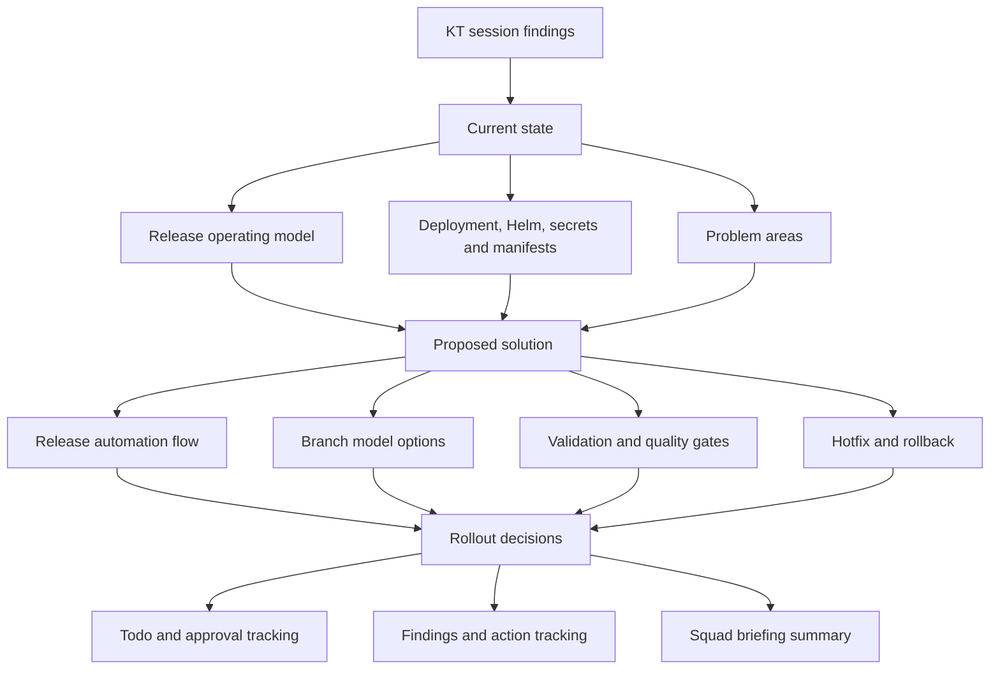

# CI/CD Deployment And Branching Strategy

This folder documents the current Cerberus CI/CD, release and deployment process based on the KT sessions.

The material is split into short pages, but it should be read as one process narrative:

1. Current process: how CI/CD, release branches, tags, Helm, manifests and deployment work today.
2. Problem areas: where the current process is manual, unclear, risky or inconsistent.
3. Recommendations: what should be automated, standardised or decided next.

## Quick Takeaway

The release and deployment challenge is broader than the branch model itself.

CI/CD needs to work with service branches, tags, Helm artefacts, manifests, configuration, feature flags, approvals, hotfixes, rollback, runbooks and ownership.

The KT sessions are current-state input for this documentation. They explain the release and deployment mechanisms that the proposed automation must work with.

The safest short-term direction appears to be:

```text
Stabilise and automate the current release process first.
Then decide whether to keep GitFlow, simplify it or move towards trunk-based development.
```

## Map At A Glance



## Start Here

- [Current release operating model](docs/current-release-operating-model.md) - current-state branching, release and deployment flow.
- [KT session findings](docs/kt-session-findings.md) - current deployment, secrets, manifest and validation knowledge from KT sessions.
- [Proposed release automation flow](docs/proposed-release-automation-flow.md) - target flow from the KT sessions.
- [Rollout decision proposals](docs/rollout-decision-proposals.md) - proposed answers for the remaining open decisions.
- [KT session todo list](docs/kt-session-todo-list.md) - actions inferred from the KT session notes.
- [CI/CD deployment findings and actions](docs/cicd-deployment-findings-and-actions.md) - problem areas and recommended follow-up actions.
- [Squad briefing summary](docs/squad-briefing-summary.md) - short update for squad leads.
- [Branching strategy options](docs/branching-options.md) - GitFlow-style, simplified release branches and trunk-based development options.

## Deep Dives

- [Automation and validation](docs/automation-and-validation.md)
- [Hotfix and rollback](docs/hotfix-and-rollback.md)
- [Release scope, ownership and approvals](docs/scope-ownership-approvals.md)

## Suggested Reading Path

For a quick overview of the current process and proposed changes:

1. Read this page.
2. Read [current release operating model](docs/current-release-operating-model.md).
3. Read [proposed release automation flow](docs/proposed-release-automation-flow.md).

For problem areas and recommendations:

1. Read [KT session findings](docs/kt-session-findings.md).
2. Read [CI/CD deployment findings and actions](docs/cicd-deployment-findings-and-actions.md).
3. Review [KT session todo list](docs/kt-session-todo-list.md).
4. Review [rollout decision proposals](docs/rollout-decision-proposals.md).

For process owners:

1. Read the [current release operating model](docs/current-release-operating-model.md).
2. Read [KT session findings](docs/kt-session-findings.md).
3. Review [automation and validation](docs/automation-and-validation.md).
4. Review [hotfix and rollback](docs/hotfix-and-rollback.md).
5. Review [release scope, ownership and approvals](docs/scope-ownership-approvals.md).
