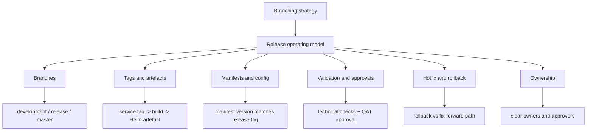

# Branching Strategy

This folder contains the working notes for the Cerberus branching, release and deployment discussion.

The material is split so readers can start here and only open the detailed pages they need.

## Quick Takeaway

The release challenge is broader than the branch model itself.

Branching needs to work with service tags, Helm artefacts, manifests, configuration, feature flags, approvals, hotfixes, rollback, runbooks and ownership.

The safest short-term direction appears to be:

```text
Stabilise and automate the current release process first.
Then decide whether to keep GitFlow, simplify it or move towards trunk-based development.
```

## Map At A Glance



## Start Here

- [Meeting agenda and actions](docs/meeting-agenda-and-actions.md) - use this to prepare for the next discussion.
- [Current release operating model](docs/current-release-operating-model.md) - current-state branching, release and deployment flow.
- [Branching strategy options](docs/branching-options.md) - GitFlow-style, simplified release branches and trunk-based development options.

## Deep Dives

- [Automation and validation](docs/automation-and-validation.md)
- [Hotfix and rollback](docs/hotfix-and-rollback.md)
- [Release scope, ownership and approvals](docs/scope-ownership-approvals.md)

## Suggested Reading Path

For a quick overview:

1. Read this page.
2. Read [meeting agenda and actions](docs/meeting-agenda-and-actions.md).

Before the meeting:

1. Read [meeting agenda and actions](docs/meeting-agenda-and-actions.md).
2. Review the [branching options](docs/branching-options.md).
3. Review [hotfix and rollback](docs/hotfix-and-rollback.md).

For process owners:

1. Read the [current release operating model](docs/current-release-operating-model.md).
2. Review [automation and validation](docs/automation-and-validation.md).
3. Review [hotfix and rollback](docs/hotfix-and-rollback.md).
4. Review [release scope, ownership and approvals](docs/scope-ownership-approvals.md).
