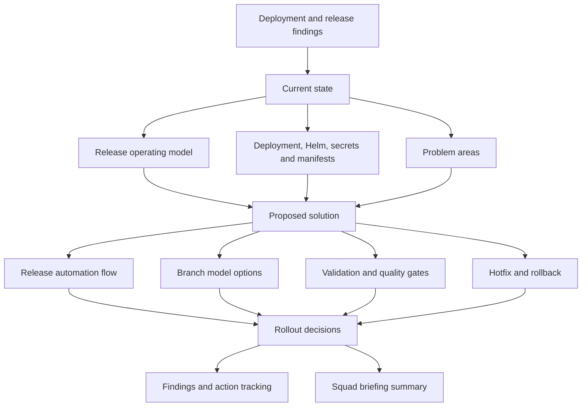

# CI/CD Deployment And Branching Strategy

This folder documents the current Cerberus CI/CD, release and deployment process.

The material is split into short pages, but it should be read as one process narrative:

1. Current process: how CI/CD, release branches, tags, Helm, manifests and deployment work today.
2. Problem areas: where the current process is manual, unclear, risky or inconsistent.
3. Recommendations: what should be automated, standardised or decided next.

## Quick Takeaway

The release and deployment challenge is broader than the branch model itself.

CI/CD needs to work with service branches, tags, Helm artefacts, manifests, configuration, feature flags, approvals, hotfixes, rollback, runbooks and ownership.

The safest short-term direction appears to be:

```text
Stabilise and automate the current release process first.
Then decide whether to keep GitFlow, simplify it or move towards trunk-based development.
```

## Map At A Glance



## Pages

| # | Page | Purpose |
| --- | --- | --- |
| 1 | [Current release operating model](docs/current-release-operating-model.md) | Current-state branching, release and deployment flow. |
| 2 | [Deployment and release findings](docs/deployment-and-release-findings.md) | Deployment, secrets, manifest and validation knowledge. |
| 3 | [Proposed release automation flow](docs/proposed-release-automation-flow.md) | Target automation flow. |
| 4 | [Branching strategy options](docs/branching-options.md) | GitFlow, simplified and trunk-based options. |
| 5 | [Automation and validation](docs/automation-and-validation.md) | Validation rules, reporting and quality gates. |
| 6 | [Hotfix and rollback](docs/hotfix-and-rollback.md) | Hotfix flow, rollback and reconciliation. |
| 7 | [Release scope, ownership and approvals](docs/scope-ownership-approvals.md) | Who owns what, approval points. |
| 8 | [Rollout decision proposals](docs/rollout-decision-proposals.md) | Proposed answers for open decisions. |
| 9 | [CI/CD deployment findings and actions](docs/cicd-deployment-findings-and-actions.md) | Problem areas and follow-up actions. |
| 10 | [Squad briefing summary](docs/squad-briefing-summary.md) | Short update for squad leads. |

## Suggested Reading Path

For a quick overview:

1. This page → [Current release operating model](docs/current-release-operating-model.md) → [Proposed release automation flow](docs/proposed-release-automation-flow.md).

For problem areas and recommendations:

2. [Deployment and release findings](docs/deployment-and-release-findings.md) → [CI/CD deployment findings and actions](docs/cicd-deployment-findings-and-actions.md) → [Rollout decision proposals](docs/rollout-decision-proposals.md).

For process owners:

3. [Automation and validation](docs/automation-and-validation.md) → [Hotfix and rollback](docs/hotfix-and-rollback.md) → [Release scope, ownership and approvals](docs/scope-ownership-approvals.md).
