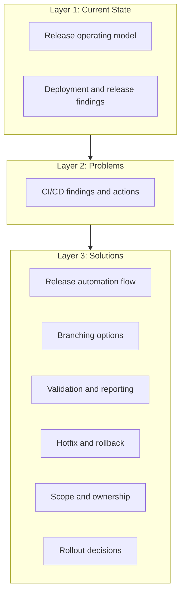

# CI/CD Deployment And Branching Strategy

This folder documents the current Cerberus CI/CD, release and deployment process: what exists today, what is broken, and what should change.

## Summary

```text
Do not change the branching model first.
First make the current release process visible, repeatable and auditable.
Then decide whether the branch model should be kept, simplified or replaced.
```

## Structure

The documentation is organised in three layers:

### Layer 1: Current State (What Exists Today)

| Page | What It Covers |
| --- | --- |
| [Current release operating model](docs/current-release-operating-model.md) | End-to-end release flow: branches → tags → artefacts → deploy → reconciliation. |
| [Deployment and release findings](docs/deployment-and-release-findings.md) | How Helm scripts, secrets, manifests, umbrella charts and validation scripts actually work. |

### Layer 2: Problems (What Is Broken Or Missing)

| Page | What It Covers |
| --- | --- |
| [CI/CD deployment findings and actions](docs/cicd-deployment-findings-and-actions.md) | Problem summary table, root causes, and recommended follow-up actions. |

Key problems at a glance:

| Problem | Impact |
| --- | --- |
| Release creation is manual-heavy | Days of effort per sprint, inconsistency, audit gaps. |
| Branch/tag timing rules unclear | Wrong artefacts, wrong manifests, unclear release state. |
| Release scope not explicit | Automation misses secrets, config, Liquibase or runbook changes. |
| Manifest validation too permissive | Wrong version or blocked work can reach production. |
| Chart deployment is manual | Every chart listed by hand; no changed-chart detection. |
| Hotfix/rollback not standardised | Drift between production, `main`, manifests and active releases. |
| No alerting for failed automation | Failed steps leave release state unclear. |
| Ownership not assigned | Nobody named for key decisions and approvals. |

### Layer 3: Proposed Solutions

| Page | What It Covers |
| --- | --- |
| [Proposed release automation flow](docs/proposed-release-automation-flow.md) | Target automation: auto release branches, auto chart updates, reporting, changed-chart deploy. |
| [Branching strategy options](docs/branching-options.md) | Three branch model options compared: GitFlow, simplified, trunk-based. |
| [Automation and validation](docs/automation-and-validation.md) | Validation rules, release reporting, commit metadata, merge strategy. |
| [Hotfix and rollback](docs/hotfix-and-rollback.md) | Production hotfix flow, release-phase hotfix, rollback process, Liquibase rollback. |
| [Release scope, ownership and approvals](docs/scope-ownership-approvals.md) | Repository scope, service ownership, approval matrix. |
| [Rollout decision proposals](docs/rollout-decision-proposals.md) | 14 proposed decisions ready for team approval. |
| [Squad briefing summary](docs/squad-briefing-summary.md) | Short update for squad leads: what changes, what to expect. |

## Suggested Reading Order

**Quick overview (10 min):**
1. This page.
2. [Current release operating model](docs/current-release-operating-model.md) — how it works today.
3. [CI/CD deployment findings and actions](docs/cicd-deployment-findings-and-actions.md) — what is broken.
4. [Proposed release automation flow](docs/proposed-release-automation-flow.md) — what the solution looks like.

**Full picture:**
5. [Deployment and release findings](docs/deployment-and-release-findings.md) — technical details.
6. [Branching strategy options](docs/branching-options.md) — branch model comparison.
7. [Rollout decision proposals](docs/rollout-decision-proposals.md) — decisions to approve.

**For approvers:**
8. [Hotfix and rollback](docs/hotfix-and-rollback.md)
9. [Release scope, ownership and approvals](docs/scope-ownership-approvals.md)
10. [Automation and validation](docs/automation-and-validation.md)

## Visual Overview


