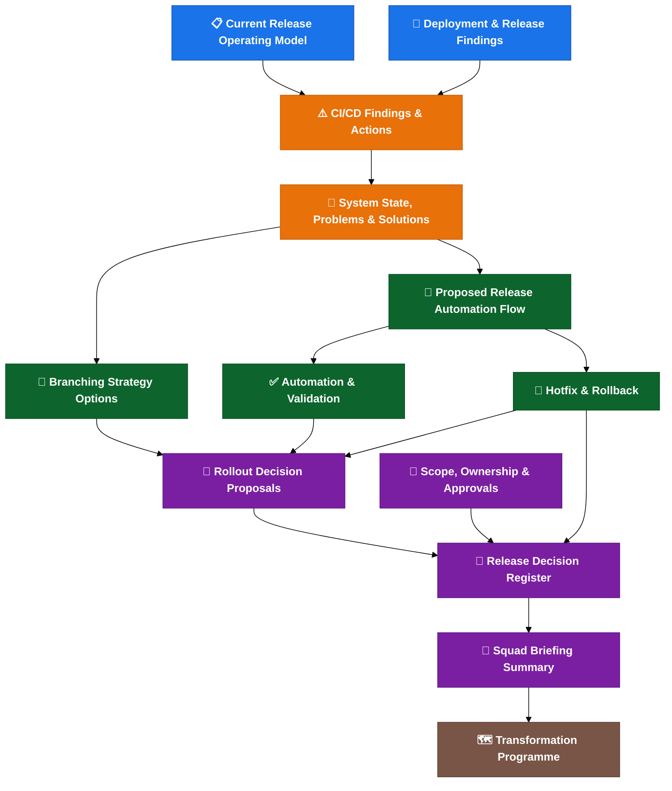

# Cerberus Release Engineering Assessment

**Current State, Problems, Risks And Improvement Roadmap**

This folder contains the assessment of the Cerberus CI/CD, release and deployment process: what exists today, what is broken, and what should change.

This is an assessment and proposal, not an approved operating model. Items marked "Proposed" or "Needs confirmation" require team sign-off before implementation.

## Summary

```text
Do not change the branching model first.
First make the current release process visible, repeatable and auditable.
Then decide whether the branch model should be kept, simplified or replaced.
```

## Structure

The documentation is organised as a decision-ready synthesis plus three supporting layers:

### Decision-Ready Synthesis

| Page | What It Covers |
| --- | --- |
| [System state, problems, solution options and risks](docs/system-state-problems-solutions.md) | Clear current-state summary, problem analysis, solution options, risks and experience-based recommendations. |
| [Release decision register](docs/release-decision-register.md) | Single register for open rollout, ownership, validation, hotfix and rollback decisions. |

### Layer 1: Current State (What Exists Today)

| Page | What It Covers |
| --- | --- |
| [Current release operating model](docs/current-release-operating-model.md) | End-to-end release flow: branches -> tags -> artefacts -> deploy -> reconciliation. |
| [Deployment and release findings](docs/deployment-and-release-findings.md) | How Helm scripts, secrets, manifests, umbrella charts and validation scripts actually work. |

### Layer 2: Problems (What Is Broken Or Missing)

| Page | What It Covers |
| --- | --- |
| [CI/CD deployment findings and actions](docs/cicd-deployment-findings-and-actions.md) | Problem summary table, root causes, and recommended follow-up actions. |

Key problems at a glance:

| Problem | Impact |
| --- | --- |
| Release creation is manual-heavy | Days of effort per sprint, inconsistency, audit gaps. |
| Branch/tag timing rules unclear | Wrong artefacts, wrong manifests, unclear release state. |
| Release scope not explicit | Automation misses secrets, config, Liquibase or runbook changes. |
| Manifest validation too permissive | Wrong version or blocked work can reach production. |
| Chart deployment is manual | Every chart listed by hand; no changed-chart detection. |
| Hotfix/rollback not standardised | Drift between production, `main`, manifests and active releases. |
| No alerting for failed automation | Failed steps leave release state unclear. |
| Ownership not assigned | Nobody named for key decisions and approvals. |

### Layer 3: Proposed Solutions

| Page | What It Covers |
| --- | --- |
| [Proposed release automation flow](docs/proposed-release-automation-flow.md) | Target automation: auto release branches, auto chart updates, reporting, changed-chart deploy. |
| [Branching strategy options](docs/branching-options.md) | Three branch model options compared: GitFlow, simplified, trunk-based. |
| [Automation and validation](docs/automation-and-validation.md) | Validation rules, release reporting, commit metadata, merge strategy. |
| [Hotfix and rollback](docs/hotfix-and-rollback.md) | Production hotfix flow, release-phase hotfix, rollback process, Liquibase rollback. |
| [Release scope, ownership and approvals](docs/scope-ownership-approvals.md) | Repository scope, service ownership, approval matrix. |
| [Rollout decision proposals](docs/rollout-decision-proposals.md) | Proposed decisions ready for team approval (summary view; 23 decisions tracked in the register). |
| [Release decision register](docs/release-decision-register.md) | Approval status, owner gaps, required evidence and closure order for open decisions. |
| [Transformation programme](docs/transformation-programme.md) | Root cause, risk assessment, maturity scorecard, target state architecture, unified control plane future. |
| [Transformation programme — delivery](docs/transformation-programme-delivery.md) | Roadmap, prioritisation, RACI, success metrics, cost/benefit, top 10 recommendations. |
| [Squad briefing summary](docs/squad-briefing-summary.md) | Short update for squad leads: what changes, what to expect. |

### Transformation Programme

| Page | What It Covers |
| --- | --- |
| [Transformation programme](docs/transformation-programme.md) | Executable transformation programme: strategy, roadmap (Phase 0–7), RACI, metrics, prioritisation, Go/No-Go criteria, target operating model, executive investment view and top 10 recommendations. |

### Reference

| Page | What It Covers |
| --- | --- |
| [Architecture review package](docs/architecture-review/index.md) | ARB/executive review outputs, criticality challenge, NFRs, roadmap, RACI, diagrams and final verdict. |
| [Release engineering best practices](docs/release-engineering-best-practices.md) | Supporting industry guidance for branching, validation, Helm, rollback, ownership and rollout. |
| [Platform engineering strategy](docs/platform-engineering-strategy.md) | Environment promotion model, deployment strategies, observability gates. |
| [Platform engineering strategy — advanced](docs/platform-engineering-strategy-advanced.md) | GitOps readiness, SBOM, supply chain security, unified control plane. |
| [Deployment knowledge graph — design](docs/deployment-knowledge-graph-design.md) | Domain model, entity relationships, graph schema. |
| [Deployment knowledge graph — implementation](docs/deployment-knowledge-graph-implementation.md) | Event architecture, ingestion, API, search, workflows. |
| [Deployment knowledge graph — operations](docs/deployment-knowledge-graph-operations.md) | Security, retention, integrations, technology options, roadmap. |
| [Deployment knowledge graph — business case](docs/deployment-knowledge-graph-business-case.md) | Strategic value, ROI, governance model, risks, NFRs, AI enablement, decision record. |
| [Detailed system analysis](docs/reference/system-state-problems-solutions-detailed.md) | Full current state detail. |
| [Detailed problems (P1–P12)](docs/reference/detailed-problems.md) | Full problem analysis with root cause and evidence. |
| [Detailed solutions (S1–S7)](docs/reference/detailed-solutions.md) | Full solution options with risks and experience notes. |
| [Detailed rollout decisions](docs/reference/rollout-decision-proposals-detailed.md) | Full rationale behind the short rollout decision proposal page. |
| [Enterprise Knowledge Graph proposal](docs/reference/enterprise-knowledge-graph-proposal.md) | ARB-ready enterprise architecture proposal: business case, data model, security, AI enablement, roadmap. |
| [Advanced architecture sections](docs/advanced-architecture-sections.md) | Cerberus architecture mapping, event-driven ingestion model, data trust model, engineering copilot, platform product framing. |

## Suggested Reading Order

1. This page.
2. [System state, problems, solution options and risks](docs/system-state-problems-solutions.md) - decision-ready synthesis.
3. [Current release operating model](docs/current-release-operating-model.md) - how it works today.
4. [CI/CD deployment findings and actions](docs/cicd-deployment-findings-and-actions.md) - what is broken.
5. [Proposed release automation flow](docs/proposed-release-automation-flow.md) - what the solution looks like.
6. [Deployment and release findings](docs/deployment-and-release-findings.md) - technical details.
7. [Automation and validation](docs/automation-and-validation.md) - validation, reporting, metadata and failure handling.
8. [Hotfix and rollback](docs/hotfix-and-rollback.md) - production recovery and reconciliation.
9. [Release scope, ownership and approvals](docs/scope-ownership-approvals.md) - scope, owners and approval points.
10. [Rollout decision proposals](docs/rollout-decision-proposals.md) - proposed decisions to approve or amend.
11. [Release decision register](docs/release-decision-register.md) - approval tracker and closure order.
12. [Branching strategy options](docs/branching-options.md) - branch model comparison after the operating model is understood.
13. [Transformation programme](docs/transformation-programme.md) - strategy, target state and future control plane.
14. [Transformation programme - delivery](docs/transformation-programme-delivery.md) - roadmap, RACI, metrics and investment view.
15. [Architecture review package](docs/architecture-review/index.md) - ARB/executive review, criticality challenge and final verdict.

## Visual Overview



**Colour key:**
🔵 Current state · 🟠 Problems · 🟢 Solutions · 🟣 Decisions · 🟤 Transformation
