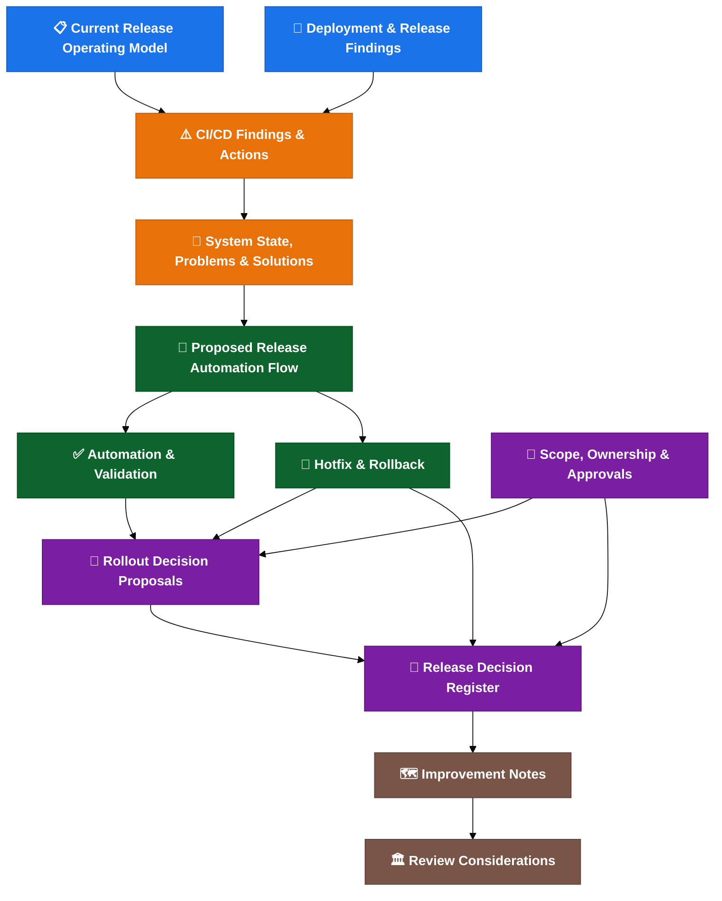

# Cerberus Release Process Understanding And Improvement Notes

| Field | Value |
| --- | --- |
| Owner | Benan Aktas |
| Status | In Review |
| Created | 2026-06-09 |
| Last updated | 2026-06-09 |
| Last reviewed | 2026-06-09 |
| Labels | kt-notes, ci-cd, release-engineering, cerberus |

---

## 1. Summary

This page summarises my current understanding of the Cerberus CI/CD, release and deployment process based on KT sessions, discussions and follow-up analysis. It captures what appears to exist today, which areas look manual or risky, and which improvement areas may be useful for team discussion.

The main finding is that the release challenge is broader than the branching model. Release state is fragmented across Git, tags, images, Helm charts, deployment-management, manifests, Jira, secrets, Liquibase and runbooks. Changing the branch model alone does not fix this.

The possible approach for discussion is:

1. Stabilise the release operating model (validation, ownership, automation, rollback).
2. Move release automation into Drone.
3. Cut over to `main = production` only when the above is proven.
4. Keep longer-term platform visibility ideas separate from the immediate release-process work.

Some assumptions may be incomplete and should be validated with Gareth, Achilles, release management, the platform team and squad leads before any rollout behaviour changes.

---

## 2. Context / Problem Statement

The current release process is manual-heavy and produces several operational risks:

- Release preparation takes days per sprint.
- Tag, artefact and manifest validation is not strict enough — wrong artefacts can reach production.
- Release scope is not explicit — secrets, config, Liquibase or runbook changes can be missed.
- Hotfix and rollback are not operationally standardised.
- Ownership and approval responsibilities are not fully named in the current notes.
- No alerting exists for failed automation steps.
- Environment readiness is not a formal gate.

These problems are documented in detail in the child page: CI/CD Findings and Actions.

---

## 3. Objectives

The objectives are to:

- Make the release process visible, repeatable, validated, owned and auditable.
- Reduce manual release preparation effort.
- Enforce strict tag/manifest validation.
- Document and test hotfix and rollback flows.
- Assign named owners for all release activities.
- Move release automation into Drone (centralised, auditable).
- Enable branch model simplification only after the above is stable.

---

## 4. Scope

### In Scope

- Current-state release operating model assessment.
- Problem identification (P1–P12).
- Release automation proposal (Drone pilot).
- Branching model options (GitFlow, simplified, trunk-based).
- Validation framework.
- Hotfix and rollback operating model.
- Ownership and approval model (RACI).
- Possible phased improvement path (Phase 0-5).
- Short future-topic note for platform visibility ideas that are not in current scope.

### Out of Scope

- Immediate trunk-based development adoption.
- Immediate Knowledge Graph or control-plane implementation.
- Production application performance optimisation.
- Rewriting existing services.

---

## 5. Approach

The approach is phased and incremental:

- **Phase 0** — Confirm rollout decisions, assign named owners.
- **Phase 1** — Quick wins: strict validation dry-run, environment readiness checklist, rollback documentation.
- **Phase 2** — Drone automation pilot: auto branch/tag/chart, release reporting, alerting.
- **Phase 3** — Branch cutover: `main = production`, branch protections.
- **Phase 4** — Scale: changed-chart deployment, shared dev, full RACI enforcement.
- **Phase 5+** — Separately evaluate feature flags, secrets operator, observability gates and dashboard feasibility if the release foundation is stable.

---

## 6. Proposal Overview Matrix

| Proposal | Value | Risk | Complexity | Effort | MoSCoW | Notes |
| --- | --- | --- | --- | --- | --- | --- |
| Strict tag/manifest validation | High | Low | Low | Low | Must | Script change only |
| Named ownership (RACI) | High | Low | Low | Low | Must | Management decision |
| Environment readiness gate | High | Low | Low | Low | Must | Checklist + pre-deploy check |
| Rollback documentation and testing | High | Medium | Medium | Medium | Must | Before next production incident |
| Drone release automation pilot | High | Medium | Medium | Medium | Must | Current pilot in progress |
| Release reporting dashboard | High | Medium | Medium | Medium | Should | After pilot green |
| Changed-chart deployment | High | Medium | Medium | Medium | Should | After detection validated |
| Alerting for failed automation | Medium | Low | Low | Low | Should | Slack/email notification |
| Branch cutover (main = production) | Medium | Medium | Medium | Medium | Should | After Phase 2 green |
| External Secrets Operator | Medium | Medium | Medium | Medium | Could | Medium-term |
| Runtime feature flags | Medium | Medium | High | High | Could | After automation stable |
| Read-only platform visibility | Medium | Medium | High | High | Could | Future evaluation only |
| ArgoCD / GitOps | Medium | High | High | High | Won't (now) | Defer unless separately reviewed |
| Trunk-based development | Medium | High | High | High | Won't (now) | Defer until flags mature |

---

## 7. Potential Success Measures

- Release preparation effort reduced from days to hours.
- Wrong tag / missing tag / manifest mismatch fails the pipeline (strict validation).
- Named owner assigned for every release activity.
- Hotfix and rollback flow documented and tested at least once.
- Drone automation pilot succeeds for configuration service.
- Release report auto-generated and matches actual release content.
- Environment readiness gated before deployment.
- Alerting fires on failed automation steps.

---

## 8. Child Pages

| Child Page | Purpose |
| --- | --- |
| CI/CD Findings and Actions | Problem summary, root causes, possible actions, prioritisation |
| Current Release Operating Model | End-to-end flow, Helm, tags, manifests, environments |
| Proposed Release Automation Flow | Possible automation, branch model, chart updates, reporting |
| Rollout Decision Proposals | 23 decisions with status and confirmation tracker |
| Hotfix and Rollback | Hotfix flow, rollback process, Liquibase strategy |
| Ownership and Approvals | RACI, ownership gap, environment readiness |
| Improvement Path And Maturity Observations | Root cause, maturity, possible roadmap, cost/benefit, top 10 improvement areas |
| Future Platform Topics | Long-term visibility ideas not in current scope |

---

## 9. Risks and Mitigations

| Risk | Impact | Mitigation | Owner |
| --- | --- | --- | --- |
| Pilot fails in Drone due to token/proxy differences | Delays rollout | Narrow pilot scope; test happy and failure paths | Gareth / Achilles |
| Ownership not assigned before expansion | Decisions delayed during incidents | Close Phase 0 decisions before Phase 2 | Release owner (TBC) |
| Metadata quality too poor for strict validation | Early failures on every release | Start with dry-run for one release first | Platform / DevOps |
| Rollback not tested before next incident | Extended incident duration | Document and test before production incident | Release owner + incident lead |
| Trunk-based adopted too early | Instability if feature flags immature | Keep GitFlow baseline; reassess after Phase 4 | Architecture |

---

## 10. DACI / Decision Areas

| Decision Area | Why DACI May Be Needed | Suggested Participants | Status |
| --- | --- | --- | --- |
| Branch cutover (`main = production`) | Affects all repos, all squads | Release owner, squad leads, platform | Proposed |
| Strict validation enforcement | May fail releases initially | Release owner, platform, QAT | Proposed |
| Rollback operating model | Production safety | Release owner, incident lead, platform | Proposed |
| Future platform visibility evaluation | Long-term investment | Architecture, platform, delivery | Future |

---

## 11. References

- Release decision register: see child page Rollout Decision Proposals.

---

## 12. Feedback

Feedback or questions? Contact the page owner or comment below.

---

## Related Pages

- [CI/CD Findings And Actions](01-cicd-findings-and-actions.md)
- [Current Release Operating Model](02-current-release-operating-model.md)
- [Proposed Release Automation Flow](03-proposed-release-automation-flow.md)
- [Rollout Decision Proposals](04-rollout-decision-proposals.md)
- [Hotfix And Rollback](05-hotfix-and-rollback.md)
- [Ownership And Approvals](06-ownership-and-approvals.md)
- [Improvement Path And Maturity Observations](07-transformation-programme.md)
- [Future Platform Topics](08-platform-and-knowledge-graph.md)
- [Page Coverage Index](09-page-coverage-index.md)

---

## Detailed Supporting Material

This section keeps the detailed supporting content for readers who need more than the summary above.

### Cerberus Release Process Understanding, Gaps And Improvement Ideas

**KT Notes, Current Understanding, Observations And Discussion Points**

This document captures my current understanding of the Cerberus CI/CD, release and deployment process based on KT sessions, discussions and follow-up analysis. It highlights areas that appear manual, unclear or risky, and proposes possible questions or improvement ideas for team discussion.

Some assumptions may be incomplete or wrong and should be validated with Gareth, Achilles, release management, the platform team and squad leads. This is not an approved operating model, a replacement for existing team decisions or a formal architecture proposal.

**Author positioning:** This is a working note from a developer currently onboarding into the Cerberus release process. It is intended to support discussion and shared understanding, not to override existing team decisions or established release management practices.

### Summary

```text
Avoid changing the branching model first.
First make the current release process visible, repeatable and auditable.
Then discuss whether the branch model should be kept, simplified or replaced.
```

### Structure

The notes are organised as a focused discussion pack plus appendix material. The main discussion pack stays on the Cerberus release-management problem: safer release flow, validation, ownership, hotfix/rollback and areas that may need confirmation.

#### Main Discussion Pack

| Page | What It Covers |
| --- | --- |
| [System state, problems, solution options and risks](07-transformation-programme.md) | Current-state summary, observed problems, possible solution options, risks and experience-based notes. |
| [Current release operating model](02-current-release-operating-model.md) | End-to-end release flow: branches -> tags -> artefacts -> deploy -> reconciliation. |
| [Deployment and release findings](01-cicd-findings-and-actions.md) | How Helm scripts, secrets, manifests, umbrella charts and validation scripts actually work. |
| [CI/CD deployment findings and actions](01-cicd-findings-and-actions.md) | Problem summary table, root causes, and recommended follow-up actions. |
| [Proposed release automation flow](03-proposed-release-automation-flow.md) | Target automation: auto release branches, auto chart updates, reporting, changed-chart deploy. |
| [Automation and validation](03-proposed-release-automation-flow.md) | Validation rules, release reporting, commit metadata, merge strategy. |
| [Hotfix and rollback](05-hotfix-and-rollback.md) | Production hotfix flow, release-phase hotfix, rollback process, Liquibase rollback. |
| [Release scope, ownership and approvals](06-ownership-and-approvals.md) | Repository scope, service ownership, approval matrix. |
| [Rollout decision proposals](04-rollout-decision-proposals.md) | Proposed discussion points for rollout behaviour. |
| [Release decision register](04-rollout-decision-proposals.md) | Open decisions, owner gaps, required evidence and possible closure order. |
| [Improvement notes and maturity observations](07-transformation-programme.md) | Root cause notes, risk observations, maturity scorecard and possible near-term target state. |
| [Possible improvement path and delivery notes](07-transformation-programme.md) | Indicative phases, prioritisation, RACI, metrics to baseline, cost/benefit and improvement areas. |
| [Platform engineering strategy](08-platform-and-knowledge-graph.md) | Environment promotion model, deployment strategies, observability gates. |
| [Potential architecture review notes](08-platform-and-knowledge-graph.md) | Optional later-stage review considerations, criticality challenge notes and open risks. |

Key problems at a glance:

| Problem | Impact |
| --- | --- |
| Release creation is manual-heavy | Days of effort per sprint, inconsistency, audit gaps. |
| Branch/tag timing rules unclear | Wrong artefacts, wrong manifests, unclear release state. |
| Release scope not explicit | Automation misses secrets, config, Liquibase or runbook changes. |
| Manifest validation too permissive | Wrong version or blocked work can reach production. |
| Chart deployment is manual | Every chart listed by hand; no changed-chart detection. |
| Hotfix/rollback not standardised | Drift between production, `main`, manifests and active releases. |
| No alerting for failed automation | Failed steps leave release state unclear. |
| Ownership not assigned | Nobody named for key decisions and approvals. |

#### Appendix And Reference Material

| Page | What It Covers |
| --- | --- |
| [Branching strategy options](02-current-release-operating-model.md) | Branch model comparison after the operating model is understood. |
| [Release engineering best practices](07-transformation-programme.md) | Supporting industry guidance for branching, validation, Helm, rollback, ownership and rollout. |
| [Squad briefing summary](02-current-release-operating-model.md) | Squad-facing communication material. |
| [Detailed system analysis](07-transformation-programme.md) | Full current state detail. |
| [Detailed problems (P1–P12)](07-transformation-programme.md) | Full problem analysis with root cause and evidence. |
| [Detailed solutions (S1–S7)](07-transformation-programme.md) | Full solution options with risks and experience notes. |
| [Detailed rollout decisions](04-rollout-decision-proposals.md) | Full rationale behind the short rollout decision proposal page. |
| [Platform engineering strategy — advanced](08-platform-and-knowledge-graph.md) | Future GitOps, SBOM, supply chain security and control-plane considerations. |
| [Deployment knowledge graph — design](08-platform-and-knowledge-graph.md) | Future option: domain model, entity relationships, graph schema. |
| [Deployment knowledge graph — implementation](08-platform-and-knowledge-graph.md) | Future option: event architecture, ingestion, API, search, workflows. |
| [Deployment knowledge graph — operations](08-platform-and-knowledge-graph.md) | Future option: security, retention, integrations, technology options, roadmap. |
| [Deployment knowledge graph — business case](08-platform-and-knowledge-graph.md) | Future option: strategic value, governance model, risks, NFRs and decision record. |
| [Advanced architecture sections](08-platform-and-knowledge-graph.md) | Future option: architecture mapping, event-driven ingestion, data trust and platform framing. |

### Suggested Reading Order

1. This page.
2. [System state, problems, solution options and risks](07-transformation-programme.md) - current understanding and discussion summary.
3. [Current release operating model](02-current-release-operating-model.md) - how it works today.
4. [CI/CD deployment findings and actions](01-cicd-findings-and-actions.md) - what is broken.
5. [Proposed release automation flow](03-proposed-release-automation-flow.md) - what the solution looks like.
6. [Deployment and release findings](01-cicd-findings-and-actions.md) - technical details.
7. [Automation and validation](03-proposed-release-automation-flow.md) - validation, reporting, metadata and failure handling.
8. [Hotfix and rollback](05-hotfix-and-rollback.md) - production recovery and reconciliation.
9. [Release scope, ownership and approvals](06-ownership-and-approvals.md) - scope, owners and approval points.
10. [Rollout decision proposals](04-rollout-decision-proposals.md) - proposed discussion points to confirm or amend.
11. [Release decision register](04-rollout-decision-proposals.md) - open decision tracker and possible closure order.
12. [Improvement notes and maturity observations](07-transformation-programme.md) - root cause, maturity and possible target release state.
13. [Possible improvement path and delivery notes](07-transformation-programme.md) - indicative phases, RACI, metrics and investment notes.
14. [Platform engineering strategy](08-platform-and-knowledge-graph.md) - promotion model, deployment strategy and observability gates.
15. [Potential architecture review notes](08-platform-and-knowledge-graph.md) - optional later-stage review considerations and open risks.

### Visual Overview



**Colour key:**
🔵 Current state · 🟠 Problems · 🟢 Solutions · 🟣 Decisions · 🟤 Review / improvement notes

### Related Pages

- [System State, Problems, Solution Options And Risks](07-transformation-programme.md)
- [Release Decision Register](04-rollout-decision-proposals.md)
- [Improvement Notes And Maturity Observations](07-transformation-programme.md)
- [Potential Architecture Review Notes](08-platform-and-knowledge-graph.md)
