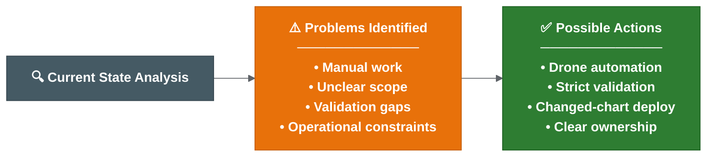

# CI/CD Findings and Actions

| Field | Value |
| --- | --- |
| Owner | Benan Aktas |
| Status | In Review |
| Created | 2026-06-09 |
| Last updated | 2026-06-09 |
| Labels | ci-cd, findings, release-engineering, cerberus, proposal |

---

## Summary

The release challenge is broader than the branching model. CI/CD and deployment depend on service tags, Helm artefacts, manifests, configuration, secrets, feature flags, environment access and ownership. This page identifies eight problem areas, proposes ten actions and prioritises them by effort and impact.

The approach is: stabilise the release operating model before changing the branching model.

---

## Problem Areas

| # | Area | Current Problem | Why It Matters |
|---|------|-----------------|----------------|
| P1 | Manual release work | Release creation, chart updates, tag handling and deployment triggers involve manual or locally run steps. | Increases release time, inconsistency and audit gaps. |
| P2 | Branch/tag timing | Release branches, temporary tags and full release tags need clearer rules. | Wrong timing creates wrong artefacts or unclear release state. |
| P3 | Release scope | "All services" and cross-repo scope are not explicit. | Automation may include too much, too little or miss secrets/config/Liquibase changes. |
| P4 | Manifest validation | Missing tags, wrong tags, invalid ticket status and `do not deploy` cases need strict policy. | Weak validation allows wrong versions into production. |
| P5 | Changed-chart deployment | Deploying all charts manually or listing names explicitly is inefficient. | Should default to changed charts with audited override. |
| P6 | Environment readiness | New environments need values files, setup entries and Drone secrets/tokens confirmed. | An environment can look available but fail deployment. |
| P7 | Hotfix and rollback | Hotfix source, back-merge and rollback reconciliation are not standardised. | Production fixes can drift from `main`, manifests and active releases. |
| P8 | Alerting and rerun | Failed automation alerting and safe rerun rules are not defined. | Failed steps leave release state unclear. |

---

## Proposed Actions

1. Keep the current-state flow as the baseline view.
2. Move local/manual release automation into Drone once pilot is green.
3. Define strict validation (wrong tag, missing tag, manifest/tag mismatch = fail).
4. Confirm repository scope for all change types.
5. Confirm changed-chart deployment behaviour and override path.
6. Document hotfix and rollback flows including reconciliation.
7. Define alerting and rerun rules for failed steps.
8. Confirm environment readiness criteria.
9. Use rollout decision proposals as the decision record until confirmed.
10. Document deployment parameters to remove tribal knowledge.

---

## Prioritisation

### Quick Wins (High Impact, Low Effort)

| Action | Rationale |
|--------|-----------|
| Pre-commit hook for ticket references | Prevents garbage commits in release history. |
| Strict validation: fail on missing/wrong tag | Script change only. Prevents wrong artefacts reaching production. |
| Document deployment parameters | Write-up only. Removes tribal knowledge dependency. |
| Changed-chart detection in release report | Reporting change. Shows what should deploy. |

### Medium Effort (High Impact)

| Action | Rationale |
|--------|-----------|
| Move release automation to Drone | Central, auditable, repeatable. Removes local-script dependency. |
| Auto release branch creation | Removes start-of-sprint manual work. |
| Auto Cerberus chart branch updates | Removes biggest manual time sink. |
| Alerting for failed steps | Makes failures visible. |

### High Effort (High Impact)

| Action | Rationale |
|--------|-----------|
| Full rollback runbook and testing | Requires cross-team agreement and testing time. |
| Environment parity documentation | Requires production access/knowledge few people have. |
| Ownership matrix sign-off | Requires management decisions and role assignment. |
| Feature flag runtime control | Requires new tooling or infrastructure. |

---

## Execution Order

| Order | Action | Indicative Timing |
|-------|--------|-------------------|
| 1 | Quick wins | This sprint / next sprint |
| 2 | Move automation to Drone | Current pilot |
| 3 | Auto release branch + chart updates | After pilot green |
| 4 | Alerting and strict validation | Alongside #3 |
| 5 | Rollback runbook | Before next production incident |
| 6 | Ownership sign-off | Before expanding beyond pilot squads |
| 7 | Feature flags and environment parity | Medium-term roadmap |

---

## Risks

| Risk | Likelihood | Impact | Mitigation |
|------|------------|--------|------------|
| Automation pilot fails due to token/proxy issues | Medium | High | Narrow pilot scope; test failure paths |
| Strict validation causes early release failures | Medium | Medium | Run dry-run for one release first |
| Ownership not assigned before expansion | High | Medium | Close Phase 0 decisions before Phase 2 |

---

## References

- Current release operating model: see 02 — Current Release Operating Model
- Proposed automation: see 03 — Proposed Release Automation Flow
- Rollout decisions: see 04 — Rollout Decision Proposals
- Ownership: see 06 — Ownership and Approvals

---

Feedback or questions? Contact the page owner or comment below.

---

## Related Pages

- [Main Assessment And Reading Order](00-parent-release-engineering-assessment.md)
- [Current Release Operating Model](02-current-release-operating-model.md)
- [Proposed Release Automation Flow](03-proposed-release-automation-flow.md)
- [Hotfix And Rollback](05-hotfix-and-rollback.md)
- [Page Coverage Index](09-page-coverage-index.md)

---

## Detailed Supporting Material

This section keeps the detailed supporting content for readers who need more than the summary above.

### CI/CD Deployment Findings And Actions

This page summarises the CI/CD and deployment findings.

Its purpose is to show:

1. How the current process works.
2. Which parts look manual, unclear, risky or inconsistent.
3. What may need to be standardised, automated or explicitly decided next.

### Analysis Frame

```text
The release challenge is broader than the branch model itself.

Branching is one part of the process, but CI/CD and deployment also depend on service tags, Helm artefacts, manifests, configuration and feature flags, runbooks, environment access, QAT approval, rollback and ownership.

The current process should be made visible, repeatable and auditable before the branching model is treated as the main fix.
```

### Process Areas Covered

- Release branch creation and merge strategy.
- Service tag creation and artefact generation.
- Image build, test, scan and Helm package upload.
- Cerberus chart and manifest updates.
- Deployment through service repo and MMA Helm scripts.
- Environment-specific values, secrets and runbooks.
- QAT approval and higher-environment promotion.
- Hotfix, rollback and post-release reconciliation.

### Problem Areas Identified

| Area | Current Problem | Why It Matters |
| --- | --- | --- |
| Manual release work | Release creation, chart updates, tag handling and deployment triggers still involve manual or locally run steps. | Manual work increases release time, inconsistency and audit gaps. |
| Branch/tag timing | Release branches, temporary tags and full release tags need clearer rules. | Wrong timing can create wrong artefacts, wrong manifests or unclear release state. |
| Release scope | "All services" and cross-repo release scope are not fully explicit. | Automation may include too much, too little or miss secrets/config/Liquibase/runbook changes. |
| Manifest validation | Missing tags, wrong tags, invalid ticket status and `do not deploy` cases need strict policy. | Weak validation can allow the wrong version or blocked work into a release. |
| Changed-chart deployment | Deploying all charts manually or listing chart names explicitly is inefficient. | The deployment should default to changed charts, with audited override. |
| Environment readiness | New dev/test environments need values files, setup entries and Drone secrets/tokens confirmed. | An environment can look available but fail deployment because setup is incomplete. |
| Hotfix and rollback | Hotfix source branch, back-merge and rollback reconciliation are not fully standardised. | Production fixes can drift from `main`/`development`, manifests and active release branches. |
| Alerting and rerun | Failed automation alerting and safe rerun rules are not fully defined. | A failed final Git/chart/reporting step can leave release state unclear. |

### Findings Flow



**Colour key:** Grey = current-state analysis · Orange = problems identified · Green = possible actions.

### Possible Actions

1. Keep the current-state flow in [current release operating model](02-current-release-operating-model.md) as the baseline view.
2. Use [deployment and release findings](01-cicd-findings-and-actions.md) as the detailed source for deployment scripts, secrets, manifests and tag validation.
3. Move local/manual release automation into Drone once the configuration-service pilot is green.
4. Define strict validation for wrong tags, missing tags, manifest/tag mismatch, invalid ticket status and `do not deploy` markers.
5. Confirm repository scope for service code, Helm charts, deployment management, secrets/config, Liquibase and runbooks.
6. Confirm changed-chart deployment behaviour and the override confirmation path.
7. Document hotfix and rollback flows including branch, manifest and release report reconciliation.
8. Define alerting and rerun rules for failed automation steps.
9. Confirm new environment readiness criteria before treating any dev/test environment as release-ready.
10. Use [rollout decision proposals](04-rollout-decision-proposals.md) as the decision record until owners confirm or amend them.

### Suggested Short-Term Focus

As stated in the [current understanding](07-transformation-programme.md): stabilise the release operating model before changing the branching model. The priority actions are in the Possible Actions list above.

### Prioritisation: Effort vs Impact

Not all problems are equally important. Prioritise by impact and effort:

#### Quick Wins (High Impact, Low Effort)

| Action | Why Quick Win |
| --- | --- |
| Pre-commit hook for ticket references | Already in progress. Prevents garbage commits entering release history. |
| Strict validation: fail on missing/wrong tag | Script change only. Prevents wrong artefacts reaching production. |
| Document deployment parameters | Write-up only. Removes tribal knowledge dependency. |
| Changed-chart detection in release report | Reporting change. Shows what should deploy without manual listing. |

#### High Impact, Medium Effort

| Action | Why Important |
| --- | --- |
| Move release automation to Drone | Central, auditable, repeatable. Removes local-script dependency. |
| Auto release branch creation | Removes start-of-sprint manual work entirely. |
| Auto Cerberus chart branch updates | Removes most manual chart editing - the biggest time sink. |
| Alerting for failed steps | Makes failures visible instead of silent. |

#### High Impact, High Effort

| Action | Why Harder |
| --- | --- |
| Full rollback runbook and testing | Requires cross-team agreement, environment access, testing time. |
| Environment parity documentation | Requires production access/knowledge that few people have. |
| Ownership matrix sign-off | Requires management decisions and role assignment. |
| Feature flag runtime control | Requires new tooling or infrastructure. |

#### Possible Execution Order

```text
1. Quick wins (this sprint / next sprint)
2. Move automation to Drone (current pilot)
3. Auto release branch + chart updates (immediately after pilot green)
4. Alerting and strict validation (alongside #3)
5. Rollback runbook (before next production incident)
6. Ownership sign-off (before expanding beyond pilot squads)
7. Feature flags and environment parity (medium-term roadmap)
```

### Related Pages

- [System State, Problems, Solution Options And Risks](07-transformation-programme.md)
- [Deployment And Release Findings](01-cicd-findings-and-actions.md)
- [Proposed Release Automation Flow](03-proposed-release-automation-flow.md)
- [Rollout Decision Proposals - Summary](04-rollout-decision-proposals.md)
- [Squad Briefing Summary](02-current-release-operating-model.md)

### Deployment And Release Findings

This page covers the current deployment, secrets, manifest and validation mechanisms that the proposed solution must either reuse, automate or replace.

Read this page together with:

- [Current release operating model](02-current-release-operating-model.md) for the current end-to-end flow.
- [Proposed release automation flow](03-proposed-release-automation-flow.md) for the target solution.
- [Rollout decision proposals](04-rollout-decision-proposals.md) for decisions that still need team sign-off.

### 1. Deployment Scripts And Helm Flow

The current deployment path focuses on the service repo and the MMA Helm repo.

Key points:

- Individual service chart Drone pipelines have existed around dev-environment Helm chart deployment.
- The MMA Helm repo contains the deployment scripts for Helm packaging, linting, templating, mass diff, uploading and deployment.
- The MMA Helm repo is different from the MMA Helm library repo, which contains Helm templates/library content.
- Future Drone pipeline deployment changes are likely to touch the MMA Helm repo and possibly service repo environment setup scripts.

Current Helm flow:


**Colour key:** Grey = branch/source trigger · Blue = automated Helm/package checks · Purple = release tag · Orange = manual promotion · Green = environment deployment.

Important details:

- Helm charts are deployed as packages, not directly from local repo files.
- Environment-specific values files are included at deploy time.
- Linting and templating validate Helm/YAML rendering, but Kubernetes may still reject something Helm accepted.
- Mass diff compares rendered templates against the target/default branch to show what changes will be made.
- Tagging kicks off upload/deploy-related pipeline steps.
- Deployment itself is manually promoted/triggered.
- Deployment parameters include target environment, deployment scope, release version and chart names.
- Deployment scope can distinguish live, historical or both.
- To deploy all charts today, chart names may need to be listed explicitly.

### 2. Environment And Release Responsibilities

Current split of responsibilities:

- Developers/squads handle lower/squad environments.
- Release management handles SIT and higher environments.
- QAT approval is required before progressing beyond SIT.
- Production-like environments include B.Val/pre-production/production.
- From a technical deployment point of view, environment differences are mainly in values files, but operational process and access differ.
- B.Val may contain more data than production.
- Runbook repositories may contain environment-specific actions that must be executed alongside release activity.

Important distinction:

```text
Deployment success does not prove functional readiness.
```

Deployment checks mainly show that Helm/pods/deployment worked. Functional validation is handled by development teams and QAT, using tools such as Playwright or Cypress where available.

### 3. Feature Flags And Activation

Deployment does not always mean activation.

Feature activation may depend on values files or feature flags. Development teams decide what needs to be enabled in each environment.

Implication:

```text
The release process must track both deployed version and activation/config state.
```

### 4. Rollback Current State

Current rollback status:

- Automatic rollback is not built into the deployment scripts.
- If deployment fails, the pipeline does not automatically rollback.
- Monitoring failure does not automatically trigger rollback.
- Helm rollback is technically possible through Helm history/rollback commands.
- Recent practical behaviour has leaned towards fix-forward.

Implication:

```text
Rollback needs a documented operational process, not just Helm capability.
```

### 5. New Environment Setup Considerations

For new dev/test environments, several setup points must be addressed:

- Environment lists or setup scripts may need updating.
- Values files for new environments need to exist and match naming expectations.
- Drone secrets/tokens may need to be added for new environments.
- There is uncertainty around whether kube/robot tokens come from ACU or existing Drone/namespace secrets.
- This needs confirmation before new environments can be treated as ready.

Open items:

- Confirm which repos/scripts must be updated for each new environment.
- Confirm who owns Drone secret/token creation.
- Confirm whether ACU provides the required robot/kube tokens.
- Confirm minimum required secrets per environment.

### 6. Secrets Management

Current direction for managing secrets:

- Secrets are being extracted into the Cerberus/deployment-management structure.
- Managed secrets scripts can extract and encrypt secrets for an environment.
- Secret values are base64 encoded and encrypted.
- Secret keys should remain consistent between environments; values differ by environment.
- Access requires Git maintainer or Git-crypt maintainer setup, including GPG keys.
- The managed secrets script supports rotation and restore.
- Lower-level helper scripts such as export/encrypt secrets exist, but the managed secrets script is the main entry point.
- MSK secrets may have a separate area.

Implication:

```text
Secrets/config changes should be part of release scope and release readiness checks.
```

### 7. Release Artefact Creation

Service artefact creation flow:

- A release branch may not have a tag until it is ready.
- Creating a tag kicks off a tag creation pipeline.
- For Spring Boot services, the pipeline builds the service and runs Maven install/tests.
- Trivy vulnerability scanning and Sonar code-quality scanning run before deployable artefact creation.
- Helm package, Helm dependency build and Helm artefact upload are part of releasable artefact creation.
- Slack notification may be sent once the service artefact is created.

### 8. Umbrella Charts

The deployment-management repository packages services into umbrella charts.

Key points:

- There are around two dozen umbrella charts.
- Some umbrella charts contain one service; others contain many services.
- Release chart version updates currently happen by updating chart YAML/service versions.
- Umbrella charts allow related services to be deployed together or in isolation.

This matters for changed-chart deployment because the automation needs to reason at chart level as well as service level.

### 9. Auto Manifest And Tag Jump Scripts

Supporting scripts that still matter for release metadata, manifest generation and validation decisions.

Auto manifest has two main stages:

1. Create the release Jira ticket.
2. Create the manifest.

Supporting details:

- Scripts use Python plus tools such as `yq` and `jq`.
- Local/workspace runs may need proxy configuration to access Jira.
- Drone runs may not need the same proxy setup.
- Release version and ticket number are key inputs.
- The script gets release tickets from Jira by release label.
- The GitLab tag field on tickets is used to determine service versions/tags.
- `NA` can be used for changes that do not require a tag/version update.
- DB Liquibase has special handling because one Liquibase update may affect multiple projects.
- The script updates chart versions, writes changelog entries, creates a branch, pushes changes and raises an MR.
- Helper scripts exist for branch creation, commits, pushes and MRs.

### 10. Tag Jump Checker

The tag jump checker may be less central in the proposed non-linear release branch model, but it explains an important release risk.

It was used when the team could not safely release only a selected ticket because other merged changes might be pulled in as well.

The script:

- Compares base and release versions.
- Checks Git commit logs for ticket numbers.
- Compares discovered tickets against release tickets/labels.
- Uses labels such as tag jump and full release.
- Checks ticket status and GitLab tag fields.
- Warns or fails for missing/incorrect tag metadata.
- Flags `do not deploy` cases.
- Has dry-run support.

Known caveats:

- It may be less relevant with the proposed branching structure because version/tag order is not always linear.
- Rollback comparisons can be awkward because the script tends to prefer the higher/current version.
- Incorrect ticket numbers in commits can produce false positives.
- Some validation may currently be looser than expected, such as incorrect tags or no tags found passing when they should fail.

Implication:

```text
The new release automation must explicitly define strict validation rules for ticket status, missing tags, incorrect tags and do-not-deploy markers.
```

### Follow-Up Items

1. Confirm which scripts/repos must be updated for new dev/test environments.
2. Confirm Drone secret/token ownership for new environments.
3. Confirm whether deployment parameter validation is strict enough.
4. Confirm whether auto manifest/tag validation should fail on wrong tag, missing tag or invalid ticket status.
5. Confirm how `NA` tag entries should be represented in release reports.
6. Confirm whether tag jump logic is retired, replaced or adapted for the new branching model.
7. Confirm secrets access/onboarding process for maintainers.

### Related Best Practices

Helm versioning, values-file structure, umbrella chart dependency handling, mass diff usage and secrets-management options are summarised in [release engineering best practices](07-transformation-programme.md).

### Related Pages

- [Current Release Operating Model](02-current-release-operating-model.md)
- [CI/CD Deployment Findings And Actions](01-cicd-findings-and-actions.md)
- [Automation And Validation](03-proposed-release-automation-flow.md)
- [Release Engineering Best Practices](07-transformation-programme.md)
