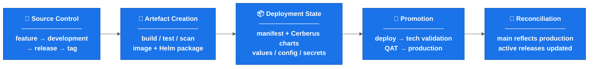
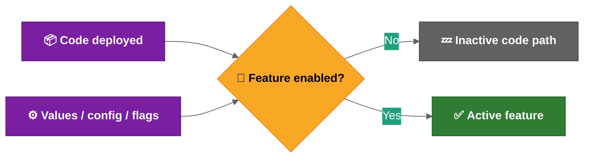
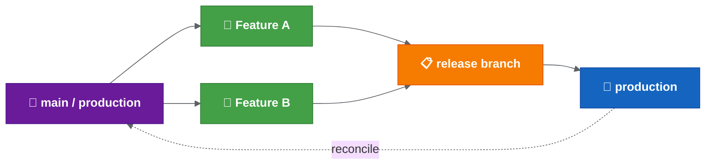
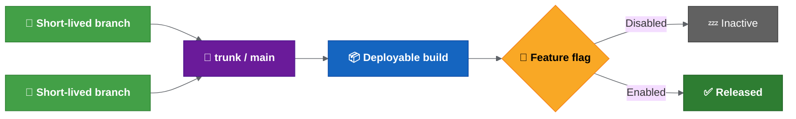

# Current Release Operating Model

| Field | Value |
| --- | --- |
| Owner | Benan Aktas |
| Status | In Review |
| Created | 2026-06-09 |
| Last updated | 2026-06-09 |
| Labels | release-model, current-state, cerberus, ci-cd |

---

## Summary

The current release process follows a GitFlow-style model. It is manual-heavy, with release preparation taking days per sprint. A possible improvement direction is to centralise repeatable release work through Drone, auto-update Cerberus charts and produce cross-referenced release reports.

This page captures the current state, not an agreed target model. The key principle is: changing the branch model alone does not make the release safe. Safety comes from tag, artefact, chart, manifest, config, validation and reconciliation all agreeing.

---

## Current Branching Model

```text
feature branch → development → release branch → master / production
```

| Element | Current Behaviour |
|---------|-------------------|
| Feature branches | Created for individual changes (ticket-based). |
| `development` | Ongoing work and candidate state for upcoming releases. |
| Release branches | Created from `development` at sprint boundary. |
| `master` | Intended to reflect production/live state. |
| Tags | Created on release branch to trigger artefact creation. |
| Reconciliation | Release branch merged back to `master` and `development` after release. |
| Hotfixes | Possible from production state; back-merge not fully standardised. |

**Important:** The possible target is not "rename `development` to `main`". The safer direction may be that "`main` represents the confirmed production state". `development` may contain unreleased work.

---

## End-to-End Flow (Compact)

| Phase | Activities |
|-------|------------|
| Source Control | Feature → development → release → tag |
| Artefact Creation | Build / test / scan → image + Helm package |
| Deployment State | Manifest + Cerberus charts + values / config / secrets |
| Promotion | Deploy → tech validation → QAT → production |
| Reconciliation | `main` reflects production; active releases updated |

---

## Deployment and Helm Summary

- Individual service charts have had Drone pipelines for dev-environment deployment.
- Current approach deploys through the service repo.
- MMA Helm repo contains scripts for packaging, linting, templating, diffing, uploading and deployment tasks.
- Helm charts deploy as packaged artefacts with environment-specific values files.
- Tag creation triggers packaging/upload; deployment is promoted or manually triggered.
- Chart names may still need explicit listing until changed-chart detection is reliable.

**Manual areas still needing confirmation:** Which server chart updates remain manual; which Drone pipeline changes are needed; how manual chart changes are reconciled with release reports.

---

## Tagging and Artefact Creation

Creating a tag on the release branch triggers:

1. Repository clone
2. Docker/test dependency setup
3. Artifactory login
4. Service build (Maven/tests for Spring Boot)
5. Vulnerability scanning (Trivy)
6. Code quality scanning (Sonar)
7. Helm package + dependency build + artefact upload

**Risk:** If the tag points to the wrong commit, the entire downstream process deploys the wrong artefact while appearing correct.

---

## Feature Flags and Activation

| Principle | Detail |
|-----------|--------|
| Code deployed ≠ feature enabled | Activation controlled by feature flags and environment-specific values. |
| Flag control | Some flags appear controlled through chart values/config. |
| Implication | If flags are baked into Helm values, enabling/disabling requires redeployment. |

---

## Testing and Validation

| Layer | What It Confirms |
|-------|------------------|
| Technical validation | Deployment completed; pods started; health checks passed. |
| Functional validation | Playwright/Cypress tests; QAT approval for SIT and above. |
| Key principle | Deployment success ≠ functional validation complete. |

---

## Environment and Operational Constraints

| Constraint | Detail |
|------------|--------|
| Release day | Thursday (standard). |
| Higher environments | May require PNR room/location access. |
| Tools pod | Some commands require tools pod access. |
| Secrets exposure | Screen sharing while viewing decoded secrets is a security risk; rotation required if exposed. |
| Lower vs higher | Lower environments deployed ad hoc; higher use server chart releases. |

---

## Confirmation Needed Before Branching Change

1. When release branches are cut.
2. When tags are created.
3. Which repositories are in scope.
4. Which steps are manual vs automated.
5. How hotfixes and rollback are handled.
6. How `main` is kept aligned with production.
7. Who owns release readiness, execution, validation and reconciliation.
8. How feature flag state is recorded in the release report.
9. Which environment readiness checks are mandatory.

---

## References

- Possible target flow: see 03 - Proposed Release Automation Flow
- Hotfix and rollback: see 05 — Hotfix and Rollback
- Decisions to confirm: see 04 — Rollout Decision Proposals

---

Feedback or questions? Contact the page owner or comment below.

---


## Detailed Source Material


This section preserves the detailed repository content used during the Confluence conversion. It is intentionally longer than the summary above so technical detail is not lost.


### Source: Current Release Operating Model

Source file: `docs/current-release-operating-model.md`

This page captures the current understanding of how branching, release and deployment fit together.

It is a current-state summary, not the final process definition. Keep this page short; use the linked detail pages for deeper implementation notes.

### Current Direction

The release process is still too manual-heavy. The target direction is to run the repeatable release work centrally through Drone, update Cerberus charts automatically and produce a release report that can be checked against JIRA.

Current status:

- Gareth/Achilles are testing the automation on the new configuration service.
- The scripts work locally; the remaining step is to run them through Drone.
- The automation is expected to generate service chart changes, versions, tags and release reports.
- Some manual server chart work may remain until the relevant Drone pipelines are updated.
- Lower environments are more ad hoc; higher-environment releases rely more heavily on server chart updates and release management.
- Changes may include service code, secrets, config, Liquibase/database changes and runbook work.
- The proposed target has `main` representing production/live state, with release branches auto-created at the start of each sprint/release.

For the proposed target flow, see proposed release automation flow (`docs/proposed-release-automation-flow.md`).

For Helm, manifest, secrets and validation detail, see deployment and release findings (`docs/deployment-and-release-findings.md`).

### Current Branching Model

The current approach is close to a GitFlow-style model:

```text
feature branch -> development -> release branch -> master / production
```

Current understanding:

- Feature or ticket branches are created for individual changes.
- Completed work is merged into `development`.
- `development` represents ongoing work and the candidate state for upcoming releases.
- Release branches are created from `development`.
- `master` is intended to reflect production/live state.
- Release branches are tagged to trigger releasable artefact creation.
- After release, the release branch should be reconciled back into `master` and `development`.
- Hotfixes should be possible from production state, but the exact back-merge and forward-merge process still needs confirmation.

Important transition note:

```text
The proposed target is not "rename development to main".
The target is "main represents the confirmed production state".
```

That distinction matters because `development` may contain work that has not reached production.

### End-To-End Flow

The release flow currently spans source control, artefact creation, deployment state, environment promotion and post-release reconciliation.

Compact current-state view:



**Colour key:** Blue = release lifecycle phase.

Why this matters:

```text
Changing the branch model alone does not make the release safe.
The release is only safe when tag, artefact, chart, manifest, config, validation and reconciliation all agree.
```

### Deployment And Helm Summary

The current deployment path focuses on the service repo and the MMA Helm repo.

Key points:

- Individual service charts have had their own Drone pipelines around dev-environment Helm chart deployment.
- The current approach appears to deploy through the service repo instead.
- The MMA Helm repo contains scripts for Helm packaging, linting, templating, diffing, uploading and deployment-related tasks.
- Helm charts are deployed as packaged artefacts with environment-specific values files.
- Tag creation runs packaging/upload steps; deployment itself is promoted or manually triggered.
- Deployment parameters include target environment, deployment scope, release version/tag and chart names.
- Chart names may still need to be listed explicitly until changed-chart detection is reliable.

Temporary manual areas still needing confirmation:

- Which server chart updates remain manual.
- Which Drone pipeline changes are needed before server chart work is automated.
- Who performs manual chart updates during rollout.
- How manual chart changes are reviewed and reconciled with release reports.
- How cross-ticket dependencies are handled when a manual chart edit is still required.

### Tagging And Artefact Creation

A release branch alone does not produce a releasable service artefact. A tag is created on the release branch when it is ready.

Creating a tag appears to trigger:

- repository clone,
- Docker/test dependency setup,
- Artifactory login,
- service build,
- Maven install/tests for Spring Boot services,
- vulnerability scanning such as Trivy,
- code quality scanning such as Sonar,
- Helm package, Helm dependency build and Helm artefact upload.

Compact tag flow:


**Colour key:** Green = tag, artefact, manifest and deployment-candidate flow step.

Risk:

```text
If the tag points to the wrong commit, the rest of the process can look correct while deploying the wrong artefact.
```

### Manifest, Ticket And Release Metadata

Existing scripts appear to analyse release content using tickets, tags and manifest versions.

Observed responsibilities:

- Compare start tag and end tag.
- Identify tickets included in a release.
- Add or update release labels.
- Update changelog entries.
- Check ticket status.
- Check whether the correct tag version has been entered.
- Compare update versions with current manifest versions.
- Detect incorrect tags, missing tags, blocked tickets or invalid ticket statuses.

Open policy:

```text
Wrong tag, missing tag, manifest/tag mismatch and do-not-deploy markers should fail fast unless an explicit release-owner override is recorded.
```

See automation and validation (`docs/automation-and-validation.md`).

### Configuration, Feature Flags And Activation

Deployment does not always mean activation.

Current understanding:

- A new feature or rule can be deployed without being active.
- Activation is controlled by feature flags and environment-specific values.
- Development teams decide which features need to be enabled in each environment.
- Some flag values appear to be controlled through chart values/config.

Operational implication:

```text
Code deployed != feature enabled
```



**Colour key:** Purple = deployed code/config state · Yellow = feature-flag decision · Grey = inactive path · Green = active feature.

If feature flags are baked into Helm values, enabling or disabling a feature may require redeployment. That means trunk-based development would move some complexity from branching into configuration and deployment.

### Testing, Validation And Approval

Deployment success and functional release confidence are different things.

Technical validation generally confirms:

- deployment completed,
- pods started successfully,
- health checks or monitoring passed.

Functional validation is separate:

- development teams may use Playwright or Cypress,
- QAT approval is required for SIT and above,
- a green deployment pipeline does not prove functional readiness.

Key principle:

```text
Deployment success != functional validation complete
```

### Environment And Operational Constraints

Environment differences are not fully documented yet.

Areas to confirm:

- data volume and data shape,
- configuration differences,
- feature flag defaults,
- secrets and credentials,
- external integrations,
- network/access constraints,
- operational permissions,
- required values files, Drone secrets and kube/robot tokens,
- whether lower environments are deployed ad hoc while higher environments use server chart releases.

Operational constraints also include:

- Thursday appears to be the regular release day.
- Some higher-environment actions may require PNR room/location access.
- Some commands may require tools pod access.
- Runbook steps may need to run alongside release activity.
- Screen sharing or recording while viewing decoded secrets is a security risk.
- If secrets are exposed, rotation may be required.

### Confirmation Needed

Before changing the branching model, confirm:

1. When release branches are cut.
2. When tags are created.
3. Which repositories are in scope.
4. Which steps are manual vs automated.
5. How hotfixes and rollback are handled.
6. How `master` / `main` is kept aligned with production.
7. Who owns release readiness, execution, validation and reconciliation.
8. How feature flag state is recorded in the release report.
9. Which environment readiness checks are mandatory before rollout.

### Related Detail

- Feature flag and environment management best practices are in release engineering best practices (`docs/release-engineering-best-practices.md`).
- Proposed automation is in proposed release automation flow (`docs/proposed-release-automation-flow.md`).
- Open rollout decisions are in rollout decision proposals (`docs/rollout-decision-proposals.md`).

### Related Pages

- Cerberus Release Process Understanding, Gaps And Improvement Ideas (`README.md`)
- System State, Problems, Solution Options And Risks (`docs/system-state-problems-solutions.md`)
- Deployment And Release Findings (`docs/deployment-and-release-findings.md`)
- Proposed Release Automation Flow (`docs/proposed-release-automation-flow.md`)
- Automation And Validation (`docs/automation-and-validation.md`)

### Source: Branching Strategy Options

Source file: `docs/branching-options.md`

This page compares the branching options discussed so far.

The key point: the branching model should be chosen based on what the release operating model can safely support.

Terminology note:

```text
In this documentation set:
- `master` refers to the current production baseline branch (existing state).
- `main` refers to the proposed production baseline branch (target state after cutover).
Where both are mentioned together, the context should make clear whether the current or target state is being discussed.
```

### Decision Lens

Before choosing a model, confirm whether the team has:

- Clear release scope across repositories and services.
- Reliable tag, artefact and manifest validation.
- A documented hotfix path.
- A documented rollback path.
- Clear service ownership and approvals.
- Strong enough test automation.
- Feature flags and configuration that can safely control incomplete work.

### Branch And Commit Hygiene To Confirm

Several branch hygiene points should be agreed before rollout.

Proposed branch naming examples:

| Branch Type | Purpose | Example |
| --- | --- | --- |
| `feature/*` | Individual ticket or feature work. | `feature/MMA-1234-login-validation` |
| `release/*` | Release candidate branch for a planned release. | `release/2026.06.1` |
| `hotfix/*` | Urgent fix from production state. | `hotfix/MMA-5678-prod-timeout` |
| `main` or `master` | Production/live baseline. | `main` |
| `development` | Integration branch, if retained. | `development` |

Proposed cleanup rule:

```text
Feature branches should be deleted after merge, once any required release report has been generated.
```

Proposed target model:

```text
main represents production/live.
release branches are auto-created from main at the start of each sprint/release.
feature and hotfix branches are created from the relevant release branch.
```

Transition note:

```text
Until the agreed cutover release, the current model remains active:
  feature branches -> development -> release branch -> master.
After cutover:
  feature branches -> release branch -> main.
Both models should not run simultaneously. The cutover date marks the switch.
```

For more detail, see proposed release automation flow (`docs/proposed-release-automation-flow.md`).

Proposed decision:

```text
Move to `main` as the production/live baseline after an agreed cutover release.
Keep `development` transitional only until the automation pilot and branch protections are ready.
```

For the full proposal, see rollout decision proposals (`docs/rollout-decision-proposals.md`).

### Multiple Active Release Branches

An important branch maintenance point: more than one release branch may exist at the same time.

If a feature starts from one release branch but is not ready for that release, it can continue alongside later releases. The team working on the feature should merge in the relevant release branches to detect conflicts before opening or updating the merge request.

Proposed rule:

```text
Forward-merge fixes from earlier active releases into later active release branches before release closure.
Feature owners keep long-running branches current by merging in the relevant active release branch before MR updates.
```

### Option 1: Continue With The Current GitFlow-Style Model

```text
feature branch -> development -> release branch -> master
```


**Colour key:** Green = feature branch · Blue = development branch · Orange = release branch · Purple = master/production · Red = hotfix branch.

Benefits:

- Keeps a familiar model.
- Separates active development from production.
- Allows release branch stabilisation.
- Supports production-based hotfixing if `master` is reliable.
- Provides a controlled release candidate branch.
- May be safer in the short term while automation and documentation improve.

Risks:

- More branches to manage.
- Requires disciplined reconciliation after release.
- Can create overhead across many services.
- Still depends on tag, manifest and configuration coordination.
- If reconciliation is missed, `master` may stop representing production accurately.

Best fit:

```text
Short-term baseline while the process is standardised and automated.
```

### Option 2: Reduce Reliance On `development`

Possible direction:

```text
feature branches -> release branches tracking live/main
```

Note: In this model, feature branches are created from `main` (not from the release branch). This differs from the proposed target model above, where feature branches are created from the release branch. Option 2 is presented as an alternative, not as the recommended direction.



**Colour key:** Purple = main/production · Green = feature branches · Orange = release branch · Blue = production deployment.

Benefits:

- Fewer long-lived branches.
- Closer alignment to production state.
- Potentially easier to reason about changes against live.
- May reduce branch management overhead if releases are frequent.

Risks:

- Less separation between active development and release preparation.
- Incomplete or risky work may be harder to isolate.
- Does not automatically solve manifest, config, feature flag or rollback complexity.
- Needs very clear release scope and ownership to avoid drift.

Best fit:

```text
Possible future simplification if release controls are already clear and reliable.
```

### Option 3: Move Towards Trunk-Based Development

Possible direction:

```text
short-lived branches -> trunk/main
release control -> feature flags/config
```



**Colour key:** Green = short-lived branches · Purple = trunk/main · Blue = deployable build · Yellow = feature-flag decision · Grey = inactive code path · Dark green = enabled release.

Benefits:

- Reduces long-running branches.
- Improves continuous integration.
- Reduces late merge conflict risk.
- Can support faster release cycles if operational controls are mature.

Risks:

- Requires strong runtime feature flag control.
- Requires configuration to be changeable without full redeployment, or with very low friction.
- Requires strong automated testing and monitoring.
- Instability may be harder to isolate if many changes are merged quickly.
- If feature flags are baked into charts or values files, the complexity may move into deployment/configuration.

Best fit:

```text
Longer-term target if release control can be separated from code integration.
```

### Trunk-Based Readiness Criteria

Before moving towards trunk-based development, confirm that:

- Runtime feature flags are available and reliable.
- Feature activation is independent of deployment.
- Configuration can be changed centrally or without full redeployment.
- Automated tests detect regressions quickly.
- Rollback or feature disablement is fast and well understood.
- Feature flag lifecycle is managed to avoid long-lived inactive code paths.
- Environment parity is well understood.
- Release ownership and approvals are clear.

### Suggested Short-Term Position

```text
Keep the current GitFlow-style model as the short-term baseline.
Improve automation, validation, hotfix handling, rollback handling and ownership.
Use those improvements to decide later whether to simplify the model or move towards trunk-based development.
```

### Practical Recommendation

Do not make the branching model carry all the process risk.

First standardise:

- Release branch timing.
- Tag timing.
- Manifest validation.
- Changed-service detection.
- Hotfix flow.
- Rollback flow.
- Post-release reconciliation.
- Ownership and approvals.

Then reassess whether the branch model is still the main constraint.

### Related Best Practices

Branching model selection, staged GitFlow-to-trunk transition guidance and common rollout mistakes are summarised in release engineering best practices (`docs/release-engineering-best-practices.md`).

### Related Pages

- Proposed Release Automation Flow (`docs/proposed-release-automation-flow.md`)
- Rollout Decision Proposals - Summary (`docs/rollout-decision-proposals.md`)
- Rollout Decision Proposals - Detailed Rationale (`docs/reference/rollout-decision-proposals-detailed.md`)
- Release Engineering Best Practices (`docs/release-engineering-best-practices.md`)

### Source: Squad Briefing Summary

Source file: `docs/squad-briefing-summary.md`

This is a short CI/CD and deployment summary for squad leads.

### What Is Changing

The team is working to reduce the current manual-heavy release process.

The target direction is to automate more of the release flow so that release branches, versions, tags, Cerberus chart changes and reporting can be generated through a repeatable pipeline.

The proposed model is:

- `development` does not become `main`. `main` is created from the confirmed production baseline. `development` is transitional and later retired.
- `main` represents production/live state.
- Release branches are automatically created at the start of each sprint/release.
- Feature and hotfix branches are created from the relevant release branch.
- Commits on those branches generate deployable candidate tags and update matching Cerberus chart branches.

The proposed decision set is captured in rollout decision proposals (`docs/rollout-decision-proposals.md`).

### Why It Matters

The current process takes a lot of manual effort each week. The automation should help:

- Reduce manual release work.
- Improve visibility of what changed.
- Cross-reference release content with JIRA.
- Check that the release contains what it is expected to contain.
- Make the process easier to audit and repeat.
- Deploy changed charts without manually listing every service.

### Current Status

- Gareth/Achilles are testing the automation on the new configuration service.
- The scripts work locally.
- The next implementation step is to run the automation and reporting in Drone.
- Rollout may be possible within the next release or two, subject to team confirmation.
- Some manual server chart work may remain until the relevant Drone pipelines are updated.
- Alerting for failed automation steps is not yet defined.
- Quality gates and human approval points still need to be confirmed.

Current working view:

- Keep human approval before higher-environment promotion and production.
- Deploy changed charts by default.
- Allow chart deployment exclusions only with release owner confirmation and an audit note.
- Keep ephemeral branch environments out of scope for now.
- Treat new dev/test environments as ready only after values files, setup script entries and Drone secrets/tokens are confirmed.

### What Squads Should Know

- Release branches may start being used soon.
- The active release branch may be deployed regularly to a shared dev environment for cross-team integration testing. The initial rollout phase will use a manual trigger only; automatic deployment to shared dev will come in later phases.
- Squad dev test environments remain separate.
- Feature branches are expected to be deleted after merge, once any required reporting has been generated.
- Merge commits into release branches need MMA/JIRA ticket references and meaningful messages because release branch history becomes the changelog.
- Long-running feature branches may need to merge in previous and next release branches to avoid missing hotfixes or conflicts.
- Squads should raise concerns about branch naming, ticket references, server chart handling, release reporting, shared dev deployment or quality gates before rollout.

### Input Needed From Squads

1. Are there services in your squad that need special handling during release?
2. Do your changes commonly include secrets, config or Liquibase/database updates?
3. Are there current manual release steps that automation might miss?
4. Are commit messages consistently linked to MMA/JIRA tickets?
5. Do any long-running branches need special handling across multiple releases?
6. Are there services that should not be auto-deployed even if their chart changed?
7. Do any squad-owned changes use `NA` tag entries, secrets/config or Liquibase exceptions?
8. Who should be the squad contact for rollout questions?

### How This Rollout Will Be Communicated

#### Feedback Loop

The rollout follows a "show, don't tell" approach:

```text
1. Pilot runs -> results shared with squads.
2. Squads review results -> raise concerns or questions.
3. Concerns addressed -> next phase starts.
4. Repeat until all squads are on the new process.
```

No squad will be switched to the new process without seeing it work first on a real release.

#### What Squads Should Do Now

| Action | When | Who |
| --- | --- | --- |
| Answer the input questions above | Before rollout review meeting | Squad lead or nominated rep |
| Ensure commit messages reference MMA tickets | Immediately (good practice regardless) | All developers |
| Review current manual release steps for your service | Before pilot completion | Squad lead |
| Identify long-running branches that span releases | Before first release branch auto-creation | Feature owners |
| Nominate a squad contact for rollout questions | Before Phase 2 expansion | Squad lead |

#### What Will NOT Change Immediately

- **Squad dev/test environments**: remain yours, deployed by you, no change.
- **Feature development workflow**: still branch -> develop -> MR -> review -> merge.
- **QAT approval**: still required for SIT and above.
- **Production release timing**: still Thursday (or as agreed).
- **Release owner approval**: still human, still required.

The automation handles the plumbing between your merge and the deployment. Your day-to-day development workflow stays the same.

### Related Pages

- Proposed Release Automation Flow (`docs/proposed-release-automation-flow.md`)
- Rollout Decision Proposals - Summary (`docs/rollout-decision-proposals.md`)
- Release Scope, Ownership And Approvals (`docs/scope-ownership-approvals.md`)
- Possible Improvement Path And Delivery Notes (`docs/transformation-programme-delivery.md`)

---


## Detailed Source Material


This section preserves the detailed repository content used during the Confluence conversion. It is intentionally longer than the summary above so technical detail is not lost.


### Source: Current Release Operating Model

Source file: `docs/current-release-operating-model.md`

This page captures the current understanding of how branching, release and deployment fit together.

It is a current-state summary, not the final process definition. Keep this page short; use the linked detail pages for deeper implementation notes.

### Current Direction

The release process is still too manual-heavy. The target direction is to run the repeatable release work centrally through Drone, update Cerberus charts automatically and produce a release report that can be checked against JIRA.

Current status:

- Gareth/Achilles are testing the automation on the new configuration service.
- The scripts work locally; the remaining step is to run them through Drone.
- The automation is expected to generate service chart changes, versions, tags and release reports.
- Some manual server chart work may remain until the relevant Drone pipelines are updated.
- Lower environments are more ad hoc; higher-environment releases rely more heavily on server chart updates and release management.
- Changes may include service code, secrets, config, Liquibase/database changes and runbook work.
- The proposed target has `main` representing production/live state, with release branches auto-created at the start of each sprint/release.

For the proposed target flow, see proposed release automation flow (`docs/proposed-release-automation-flow.md`).

For Helm, manifest, secrets and validation detail, see deployment and release findings (`docs/deployment-and-release-findings.md`).

### Current Branching Model

The current approach is close to a GitFlow-style model:

```text
feature branch -> development -> release branch -> master / production
```

Current understanding:

- Feature or ticket branches are created for individual changes.
- Completed work is merged into `development`.
- `development` represents ongoing work and the candidate state for upcoming releases.
- Release branches are created from `development`.
- `master` is intended to reflect production/live state.
- Release branches are tagged to trigger releasable artefact creation.
- After release, the release branch should be reconciled back into `master` and `development`.
- Hotfixes should be possible from production state, but the exact back-merge and forward-merge process still needs confirmation.

Important transition note:

```text
The proposed target is not "rename development to main".
The target is "main represents the confirmed production state".
```

That distinction matters because `development` may contain work that has not reached production.

### End-To-End Flow

The release flow currently spans source control, artefact creation, deployment state, environment promotion and post-release reconciliation.

Compact current-state view:


**Colour key:** Blue = release lifecycle phase.

Why this matters:

```text
Changing the branch model alone does not make the release safe.
The release is only safe when tag, artefact, chart, manifest, config, validation and reconciliation all agree.
```

### Deployment And Helm Summary

The current deployment path focuses on the service repo and the MMA Helm repo.

Key points:

- Individual service charts have had their own Drone pipelines around dev-environment Helm chart deployment.
- The current approach appears to deploy through the service repo instead.
- The MMA Helm repo contains scripts for Helm packaging, linting, templating, diffing, uploading and deployment-related tasks.
- Helm charts are deployed as packaged artefacts with environment-specific values files.
- Tag creation runs packaging/upload steps; deployment itself is promoted or manually triggered.
- Deployment parameters include target environment, deployment scope, release version/tag and chart names.
- Chart names may still need to be listed explicitly until changed-chart detection is reliable.

Temporary manual areas still needing confirmation:

- Which server chart updates remain manual.
- Which Drone pipeline changes are needed before server chart work is automated.
- Who performs manual chart updates during rollout.
- How manual chart changes are reviewed and reconciled with release reports.
- How cross-ticket dependencies are handled when a manual chart edit is still required.

### Tagging And Artefact Creation

A release branch alone does not produce a releasable service artefact. A tag is created on the release branch when it is ready.

Creating a tag appears to trigger:

- repository clone,
- Docker/test dependency setup,
- Artifactory login,
- service build,
- Maven install/tests for Spring Boot services,
- vulnerability scanning such as Trivy,
- code quality scanning such as Sonar,
- Helm package, Helm dependency build and Helm artefact upload.

Compact tag flow:


**Colour key:** Green = tag, artefact, manifest and deployment-candidate flow step.

Risk:

```text
If the tag points to the wrong commit, the rest of the process can look correct while deploying the wrong artefact.
```

### Manifest, Ticket And Release Metadata

Existing scripts appear to analyse release content using tickets, tags and manifest versions.

Observed responsibilities:

- Compare start tag and end tag.
- Identify tickets included in a release.
- Add or update release labels.
- Update changelog entries.
- Check ticket status.
- Check whether the correct tag version has been entered.
- Compare update versions with current manifest versions.
- Detect incorrect tags, missing tags, blocked tickets or invalid ticket statuses.

Open policy:

```text
Wrong tag, missing tag, manifest/tag mismatch and do-not-deploy markers should fail fast unless an explicit release-owner override is recorded.
```

See automation and validation (`docs/automation-and-validation.md`).

### Configuration, Feature Flags And Activation

Deployment does not always mean activation.

Current understanding:

- A new feature or rule can be deployed without being active.
- Activation is controlled by feature flags and environment-specific values.
- Development teams decide which features need to be enabled in each environment.
- Some flag values appear to be controlled through chart values/config.

Operational implication:

```text
Code deployed != feature enabled
```


**Colour key:** Purple = deployed code/config state · Yellow = feature-flag decision · Grey = inactive path · Green = active feature.

If feature flags are baked into Helm values, enabling or disabling a feature may require redeployment. That means trunk-based development would move some complexity from branching into configuration and deployment.

### Testing, Validation And Approval

Deployment success and functional release confidence are different things.

Technical validation generally confirms:

- deployment completed,
- pods started successfully,
- health checks or monitoring passed.

Functional validation is separate:

- development teams may use Playwright or Cypress,
- QAT approval is required for SIT and above,
- a green deployment pipeline does not prove functional readiness.

Key principle:

```text
Deployment success != functional validation complete
```

### Environment And Operational Constraints

Environment differences are not fully documented yet.

Areas to confirm:

- data volume and data shape,
- configuration differences,
- feature flag defaults,
- secrets and credentials,
- external integrations,
- network/access constraints,
- operational permissions,
- required values files, Drone secrets and kube/robot tokens,
- whether lower environments are deployed ad hoc while higher environments use server chart releases.

Operational constraints also include:

- Thursday appears to be the regular release day.
- Some higher-environment actions may require PNR room/location access.
- Some commands may require tools pod access.
- Runbook steps may need to run alongside release activity.
- Screen sharing or recording while viewing decoded secrets is a security risk.
- If secrets are exposed, rotation may be required.

### Confirmation Needed

Before changing the branching model, confirm:

1. When release branches are cut.
2. When tags are created.
3. Which repositories are in scope.
4. Which steps are manual vs automated.
5. How hotfixes and rollback are handled.
6. How `master` / `main` is kept aligned with production.
7. Who owns release readiness, execution, validation and reconciliation.
8. How feature flag state is recorded in the release report.
9. Which environment readiness checks are mandatory before rollout.

### Related Detail

- Feature flag and environment management best practices are in release engineering best practices (`docs/release-engineering-best-practices.md`).
- Proposed automation is in proposed release automation flow (`docs/proposed-release-automation-flow.md`).
- Open rollout decisions are in rollout decision proposals (`docs/rollout-decision-proposals.md`).

### Related Pages

- Cerberus Release Process Understanding, Gaps And Improvement Ideas (`README.md`)
- System State, Problems, Solution Options And Risks (`docs/system-state-problems-solutions.md`)
- Deployment And Release Findings (`docs/deployment-and-release-findings.md`)
- Proposed Release Automation Flow (`docs/proposed-release-automation-flow.md`)
- Automation And Validation (`docs/automation-and-validation.md`)

### Source: Branching Strategy Options

Source file: `docs/branching-options.md`

This page compares the branching options discussed so far.

The key point: the branching model should be chosen based on what the release operating model can safely support.

Terminology note:

```text
In this documentation set:
- `master` refers to the current production baseline branch (existing state).
- `main` refers to the proposed production baseline branch (target state after cutover).
Where both are mentioned together, the context should make clear whether the current or target state is being discussed.
```

### Decision Lens

Before choosing a model, confirm whether the team has:

- Clear release scope across repositories and services.
- Reliable tag, artefact and manifest validation.
- A documented hotfix path.
- A documented rollback path.
- Clear service ownership and approvals.
- Strong enough test automation.
- Feature flags and configuration that can safely control incomplete work.

### Branch And Commit Hygiene To Confirm

Several branch hygiene points should be agreed before rollout.

Proposed branch naming examples:

| Branch Type | Purpose | Example |
| --- | --- | --- |
| `feature/*` | Individual ticket or feature work. | `feature/MMA-1234-login-validation` |
| `release/*` | Release candidate branch for a planned release. | `release/2026.06.1` |
| `hotfix/*` | Urgent fix from production state. | `hotfix/MMA-5678-prod-timeout` |
| `main` or `master` | Production/live baseline. | `main` |
| `development` | Integration branch, if retained. | `development` |

Proposed cleanup rule:

```text
Feature branches should be deleted after merge, once any required release report has been generated.
```

Proposed target model:

```text
main represents production/live.
release branches are auto-created from main at the start of each sprint/release.
feature and hotfix branches are created from the relevant release branch.
```

Transition note:

```text
Until the agreed cutover release, the current model remains active:
  feature branches -> development -> release branch -> master.
After cutover:
  feature branches -> release branch -> main.
Both models should not run simultaneously. The cutover date marks the switch.
```

For more detail, see proposed release automation flow (`docs/proposed-release-automation-flow.md`).

Proposed decision:

```text
Move to `main` as the production/live baseline after an agreed cutover release.
Keep `development` transitional only until the automation pilot and branch protections are ready.
```

For the full proposal, see rollout decision proposals (`docs/rollout-decision-proposals.md`).

### Multiple Active Release Branches

An important branch maintenance point: more than one release branch may exist at the same time.

If a feature starts from one release branch but is not ready for that release, it can continue alongside later releases. The team working on the feature should merge in the relevant release branches to detect conflicts before opening or updating the merge request.

Proposed rule:

```text
Forward-merge fixes from earlier active releases into later active release branches before release closure.
Feature owners keep long-running branches current by merging in the relevant active release branch before MR updates.
```

### Option 1: Continue With The Current GitFlow-Style Model

```text
feature branch -> development -> release branch -> master
```


**Colour key:** Green = feature branch · Blue = development branch · Orange = release branch · Purple = master/production · Red = hotfix branch.

Benefits:

- Keeps a familiar model.
- Separates active development from production.
- Allows release branch stabilisation.
- Supports production-based hotfixing if `master` is reliable.
- Provides a controlled release candidate branch.
- May be safer in the short term while automation and documentation improve.

Risks:

- More branches to manage.
- Requires disciplined reconciliation after release.
- Can create overhead across many services.
- Still depends on tag, manifest and configuration coordination.
- If reconciliation is missed, `master` may stop representing production accurately.

Best fit:

```text
Short-term baseline while the process is standardised and automated.
```

### Option 2: Reduce Reliance On `development`

Possible direction:

```text
feature branches -> release branches tracking live/main
```

Note: In this model, feature branches are created from `main` (not from the release branch). This differs from the proposed target model above, where feature branches are created from the release branch. Option 2 is presented as an alternative, not as the recommended direction.


**Colour key:** Purple = main/production · Green = feature branches · Orange = release branch · Blue = production deployment.

Benefits:

- Fewer long-lived branches.
- Closer alignment to production state.
- Potentially easier to reason about changes against live.
- May reduce branch management overhead if releases are frequent.

Risks:

- Less separation between active development and release preparation.
- Incomplete or risky work may be harder to isolate.
- Does not automatically solve manifest, config, feature flag or rollback complexity.
- Needs very clear release scope and ownership to avoid drift.

Best fit:

```text
Possible future simplification if release controls are already clear and reliable.
```

### Option 3: Move Towards Trunk-Based Development

Possible direction:

```text
short-lived branches -> trunk/main
release control -> feature flags/config
```


**Colour key:** Green = short-lived branches · Purple = trunk/main · Blue = deployable build · Yellow = feature-flag decision · Grey = inactive code path · Dark green = enabled release.

Benefits:

- Reduces long-running branches.
- Improves continuous integration.
- Reduces late merge conflict risk.
- Can support faster release cycles if operational controls are mature.

Risks:

- Requires strong runtime feature flag control.
- Requires configuration to be changeable without full redeployment, or with very low friction.
- Requires strong automated testing and monitoring.
- Instability may be harder to isolate if many changes are merged quickly.
- If feature flags are baked into charts or values files, the complexity may move into deployment/configuration.

Best fit:

```text
Longer-term target if release control can be separated from code integration.
```

### Trunk-Based Readiness Criteria

Before moving towards trunk-based development, confirm that:

- Runtime feature flags are available and reliable.
- Feature activation is independent of deployment.
- Configuration can be changed centrally or without full redeployment.
- Automated tests detect regressions quickly.
- Rollback or feature disablement is fast and well understood.
- Feature flag lifecycle is managed to avoid long-lived inactive code paths.
- Environment parity is well understood.
- Release ownership and approvals are clear.

### Suggested Short-Term Position

```text
Keep the current GitFlow-style model as the short-term baseline.
Improve automation, validation, hotfix handling, rollback handling and ownership.
Use those improvements to decide later whether to simplify the model or move towards trunk-based development.
```

### Practical Recommendation

Do not make the branching model carry all the process risk.

First standardise:

- Release branch timing.
- Tag timing.
- Manifest validation.
- Changed-service detection.
- Hotfix flow.
- Rollback flow.
- Post-release reconciliation.
- Ownership and approvals.

Then reassess whether the branch model is still the main constraint.

### Related Best Practices

Branching model selection, staged GitFlow-to-trunk transition guidance and common rollout mistakes are summarised in release engineering best practices (`docs/release-engineering-best-practices.md`).

### Related Pages

- Proposed Release Automation Flow (`docs/proposed-release-automation-flow.md`)
- Rollout Decision Proposals - Summary (`docs/rollout-decision-proposals.md`)
- Rollout Decision Proposals - Detailed Rationale (`docs/reference/rollout-decision-proposals-detailed.md`)
- Release Engineering Best Practices (`docs/release-engineering-best-practices.md`)

### Source: Squad Briefing Summary

Source file: `docs/squad-briefing-summary.md`

This is a short CI/CD and deployment summary for squad leads.

### What Is Changing

The team is working to reduce the current manual-heavy release process.

The target direction is to automate more of the release flow so that release branches, versions, tags, Cerberus chart changes and reporting can be generated through a repeatable pipeline.

The proposed model is:

- `development` does not become `main`. `main` is created from the confirmed production baseline. `development` is transitional and later retired.
- `main` represents production/live state.
- Release branches are automatically created at the start of each sprint/release.
- Feature and hotfix branches are created from the relevant release branch.
- Commits on those branches generate deployable candidate tags and update matching Cerberus chart branches.

The proposed decision set is captured in rollout decision proposals (`docs/rollout-decision-proposals.md`).

### Why It Matters

The current process takes a lot of manual effort each week. The automation should help:

- Reduce manual release work.
- Improve visibility of what changed.
- Cross-reference release content with JIRA.
- Check that the release contains what it is expected to contain.
- Make the process easier to audit and repeat.
- Deploy changed charts without manually listing every service.

### Current Status

- Gareth/Achilles are testing the automation on the new configuration service.
- The scripts work locally.
- The next implementation step is to run the automation and reporting in Drone.
- Rollout may be possible within the next release or two, subject to team confirmation.
- Some manual server chart work may remain until the relevant Drone pipelines are updated.
- Alerting for failed automation steps is not yet defined.
- Quality gates and human approval points still need to be confirmed.

Current working view:

- Keep human approval before higher-environment promotion and production.
- Deploy changed charts by default.
- Allow chart deployment exclusions only with release owner confirmation and an audit note.
- Keep ephemeral branch environments out of scope for now.
- Treat new dev/test environments as ready only after values files, setup script entries and Drone secrets/tokens are confirmed.

### What Squads Should Know

- Release branches may start being used soon.
- The active release branch may be deployed regularly to a shared dev environment for cross-team integration testing. The initial rollout phase will use a manual trigger only; automatic deployment to shared dev will come in later phases.
- Squad dev test environments remain separate.
- Feature branches are expected to be deleted after merge, once any required reporting has been generated.
- Merge commits into release branches need MMA/JIRA ticket references and meaningful messages because release branch history becomes the changelog.
- Long-running feature branches may need to merge in previous and next release branches to avoid missing hotfixes or conflicts.
- Squads should raise concerns about branch naming, ticket references, server chart handling, release reporting, shared dev deployment or quality gates before rollout.

### Input Needed From Squads

1. Are there services in your squad that need special handling during release?
2. Do your changes commonly include secrets, config or Liquibase/database updates?
3. Are there current manual release steps that automation might miss?
4. Are commit messages consistently linked to MMA/JIRA tickets?
5. Do any long-running branches need special handling across multiple releases?
6. Are there services that should not be auto-deployed even if their chart changed?
7. Do any squad-owned changes use `NA` tag entries, secrets/config or Liquibase exceptions?
8. Who should be the squad contact for rollout questions?

### How This Rollout Will Be Communicated

#### Feedback Loop

The rollout follows a "show, don't tell" approach:

```text
1. Pilot runs -> results shared with squads.
2. Squads review results -> raise concerns or questions.
3. Concerns addressed -> next phase starts.
4. Repeat until all squads are on the new process.
```

No squad will be switched to the new process without seeing it work first on a real release.

#### What Squads Should Do Now

| Action | When | Who |
| --- | --- | --- |
| Answer the input questions above | Before rollout review meeting | Squad lead or nominated rep |
| Ensure commit messages reference MMA tickets | Immediately (good practice regardless) | All developers |
| Review current manual release steps for your service | Before pilot completion | Squad lead |
| Identify long-running branches that span releases | Before first release branch auto-creation | Feature owners |
| Nominate a squad contact for rollout questions | Before Phase 2 expansion | Squad lead |

#### What Will NOT Change Immediately

- **Squad dev/test environments**: remain yours, deployed by you, no change.
- **Feature development workflow**: still branch -> develop -> MR -> review -> merge.
- **QAT approval**: still required for SIT and above.
- **Production release timing**: still Thursday (or as agreed).
- **Release owner approval**: still human, still required.

The automation handles the plumbing between your merge and the deployment. Your day-to-day development workflow stays the same.

### Related Pages

- Proposed Release Automation Flow (`docs/proposed-release-automation-flow.md`)
- Rollout Decision Proposals - Summary (`docs/rollout-decision-proposals.md`)
- Release Scope, Ownership And Approvals (`docs/scope-ownership-approvals.md`)
- Possible Improvement Path And Delivery Notes (`docs/transformation-programme-delivery.md`)
