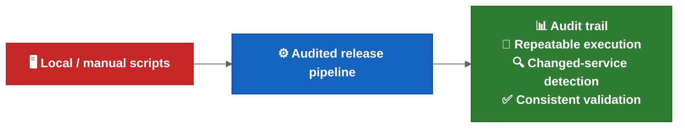
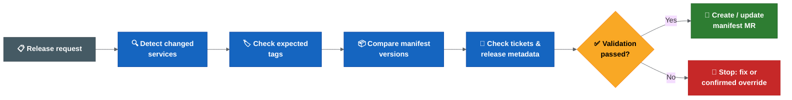

# Proposed Release Automation Flow

| Field | Value |
| --- | --- |
| Owner | Benan Aktas |
| Status | In Review |
| Created | 2026-06-09 |
| Last updated | 2026-06-09 |
| Labels | proposal, automation, release-engineering, cerberus, ci-cd |

---

## Summary

This page describes the proposed release automation flow. It replaces manual release preparation (currently taking days per sprint) with automated branch creation, tagging, chart updates, reporting and alerting — all running through Drone.

This remains a proposal until the team confirms rollout timing, branch naming, quality gates and ownership.

---

## Possible Branch Model

| Element | Possible Behaviour |
|---------|-------------------|
| `main` | Represents confirmed production/live state. Created from known production baseline. |
| `development` | Transitional. Retired after automation pilot and branch protections are ready. |
| Release branches | Auto-created from `main` at start of each sprint/release. |
| Feature/hotfix branches | Created from the relevant release branch. |
| Multiple active releases | Supported. Forward-merge from earlier to later releases. |
| Chained releases | A release branch may be based on another release branch if required. |

---

## Feature and Hotfix Branch Flow

| Step | Action |
|------|--------|
| 1 | Release branch exists (auto-created from `main`). |
| 2 | Feature/hotfix branch created from release branch. |
| 3 | Commit (builds from latest commit on branch). |
| 4 | Temporary tag generated (includes previous version + ticket reference). |
| 5 | Image/artefact built. |
| 6 | Cerberus chart branch auto-updated. |
| 7 | Branch name/ticket becomes deployment handle. |

**Key points:**
- Feature and hotfix branches are treated identically by automation.
- Temporary branch tag is stable per branch (not per commit).
- Chart branch update is automatic on successful build.

---

## Multi-Repo Change Aggregation

If multiple repositories use the same ticket/branch name, their changes feed into the same Cerberus chart branch. One ticket can collect:

- Service changes
- Secrets/config changes
- Liquibase/database changes
- Runbook changes
- Cross-service changes requiring joint testing

This removes most manual chart updates for multi-service changes.

---

## Release Branch Flow

| Step | Action |
|------|--------|
| 1 | `main` → auto-created release branch. |
| 2 | Feature/hotfix branches merged in. |
| 3 | Full release tag/version assigned on merge. |
| 4 | Cerberus chart branch updated automatically. |
| 5 | Auto-deploy to shared dev for integration testing. |
| 6 | Promote to SIT and above (human approval). |

**Key points:**
- Temporary branch tag replaced by full release version on merge to release branch.
- Shared dev is separate from squad dev/test environments.
- Ephemeral branch environments not currently assumed (ACP may not support them).

---

## Changed-Chart Deployment

| Rule | Detail |
|------|--------|
| Default | Deploy all changed charts in the release. |
| Override | Only release owners can exclude a chart; reason should be recorded. |
| Detection | Based on release report comparing two tags/versions. |

---

## CVE and Renovate Flow

CVE and Renovate updates follow the same automation pattern as normal changes:

| Item | Owner | SLA |
|------|-------|-----|
| CVE hotfix branch creation | Owning squad or release owner | Within 1 working day (critical) |
| CVE MR review and merge | Owning squad lead | Within 2 working days (critical); sprint boundary (others) |
| Renovate MR review | Owning squad | Within sprint, before release branch closure |
| Priority conflict resolution | Release owner | On demand |

---

## Merge Commit Expectations

| Rule | Rationale |
|------|-----------|
| Merge commit into release branch should include ticket number + meaningful message. | Release branch history becomes the changelog. |
| Squash-style pattern preferred. | Reduces noisy release branch history. |
| Feature branch commits should also follow ticket/message pattern. | Reports may be generated from long-running branches before merge. |

---

## Failure Handling

| Scenario | Behaviour |
|----------|-----------|
| Chart update runs after image + Helm built/uploaded | Sequenced for safety. |
| Connectivity failure (Git/services) | Step is rerunnable. |
| Push failed after local completion | Rerun pushes generated tags/build numbers/chart changes. |
| Production rollout | Slack/email notification before. |
| Higher-environment promotion | Human approval required. |

---

## Items Needing Confirmation

1. When exactly is `main` created from the production baseline?
2. Final branch naming convention?
3. Which release is the first rollout candidate?
4. Which repos get auto-created release branches?
5. Named release owner for forward-merge tracking?
6. Where are release reports published and retained?
7. Which channels receive automation failure alerts?

---

## References

- Current state: see 02 — Current Release Operating Model
- Decisions to confirm: see 04 — Rollout Decision Proposals
- Hotfix detail: see 05 — Hotfix and Rollback

---

Feedback or questions? Contact the page owner or comment below.

---

## Related Pages

- [CI/CD Findings And Actions](01-cicd-findings-and-actions.md)
- [Current Release Operating Model](02-current-release-operating-model.md)
- [Rollout Decision Proposals](04-rollout-decision-proposals.md)
- [Hotfix And Rollback](05-hotfix-and-rollback.md)
- [Ownership And Approvals](06-ownership-and-approvals.md)

---

## Detailed Supporting Material

This section keeps the detailed supporting content for readers who need more than the summary above.

### Proposed Release Automation Flow

This page summarises the proposed release automation flow.

It is still a proposal until the team confirms rollout timing, branch naming, quality gates and ownership.

For proposed answers to the open rollout decisions, see [rollout decision proposals](04-rollout-decision-proposals.md).

### Current Pain

The current process is manual-heavy:

- Lower environments are deployed more ad hoc.
- Higher-environment releases rely on server chart updates.
- A feature deployment can require a manual tag, manual Cerberus chart branch/update and manual deployment trigger.
- Release branches need repeated tags and chart image updates as fixes, CVEs and last-minute changes are added.
- End-of-sprint release preparation can take several days and consume developer/senior time.

### Possible Branch Model

The possible direction under discussion is:

- `development` does not become `main`. `main` is created from the confirmed production baseline. `development` is transitional and later retired.
- `main` should represent what is live/production.
- When something is deployed to production, it should be merged into `main`.
- At the start of each sprint/release, release branches are automatically created from `main` for every repository that needs one.
- Feature and hotfix branches are taken from the relevant release branch.
- Multiple release branches may exist at the same time.
- If releases need to be chained, the automation should allow a release branch to be based on another release branch instead of `main`.

Working assumption to confirm:

```text
Move to `main` as the production/live baseline after an agreed cutover release.
Keep `development` as transitional until the automation pilot and branch protections are ready.
```

### Feature And Hotfix Branch Flow


**Colour key:** Orange = release branch · Green = feature/hotfix branch · Grey = commit/action step · Purple = temporary tag · Blue = build · Teal = chart update · Dark green = deploy handle.

Important details:

- Feature and hotfix branches are treated similarly by the automation.
- Each commit should build from the latest commit on the branch.
- The temporary branch tag should be stable for the branch, rather than generating a large number of images for every commit.
- The tag is expected to include the previous application version and the MMA/JIRA ticket reference.
- When the image is built successfully, the corresponding Cerberus chart branch should be updated automatically.
- The branch name/ticket becomes the deployment handle for dev test or other environments.

### Multi-Repo Change Aggregation

If multiple repositories use the same ticket/branch name, their changes should feed into the same Cerberus chart branch.

This means one ticket can collect:

- Service changes.
- Secrets/config changes.
- Liquibase/database changes.
- Runbook changes.
- Changes across multiple services that need to be tested together.

This is intended to remove most manual chart updates for multi-service changes.

### Release Branch Flow

```mermaid
%%{init: {'theme': 'base', 'themeVariables': {'lineColor': '#5f6368'}}}%%

flowchart LR
  MAIN["🏁 main"]:::prod
  REL["📋 Auto-created\nrelease branch"]:::rel
  FEATURE["🌱 Feature / hotfix\nbranches"]:::feat
  MR["🔀 Merge into\nrelease branch"]:::merge
  RTAG["🏷️ Full release\ntag / version"]:::tag
  RCHART["📦 Update Cerberus\nchart branch"]:::chart
  DEV["🧪 Auto-deploy to\nshared dev"]:::deploy
  SIT["🚀 Promote to\nSIT and above"]:::promote

  MAIN --> REL --> FEATURE --> MR --> RTAG --> RCHART --> DEV --> SIT

  classDef prod fill:#6a1b9a,stroke:#4a148c,color:#fff,font-weight:bold
  classDef rel fill:#f57c00,stroke:#e65100,color:#fff,font-weight:bold
  classDef feat fill:#43a047,stroke:#2e7d32,color:#fff,font-weight:bold
  classDef merge fill:#455a64,stroke:#37474f,color:#fff,font-weight:bold
  classDef tag fill:#7b1fa2,stroke:#4a148c,color:#fff,font-weight:bold
  classDef chart fill:#00838f,stroke:#006064,color:#fff,font-weight:bold
  classDef deploy fill:#1565c0,stroke:#0d47a1,color:#fff,font-weight:bold
  classDef promote fill:#2e7d32,stroke:#1b5e20,color:#fff,font-weight:bold
```



**Colour key:** Purple = main/production · Orange = release branch · Green = feature/hotfix branches · Grey = merge step · Purple tag node = release tag/version · Teal = chart update · Blue = shared-dev deployment · Dark green = SIT+ promotion.

Important details:

- The release branch is what should be deployed to environments.
- Once a feature branch is merged into the release branch, the temporary branch tag is replaced by the full/incremented release version.
- The matching release branch on Cerberus charts should be updated automatically.
- The active release branch is intended to be deployed regularly, potentially automatically, to a shared dev environment for cross-team integration testing.
- Squad dev test environments remain separate from the shared dev environment.
- Ephemeral branch environments are not currently assumed, as ACP may not support them.

### Long-Running Or Delayed Features

A feature branch may start from one release branch but not be ready for that release.

In that case:

- The branch can continue to exist alongside later release branches.
- It does not have to be merged back into the source release branch.
- The team working on it should merge in the previous release and the next release as needed.
- The aim is to detect conflicts before opening or updating the merge request.

Proposed decision:

```text
Feature owners keep long-running branches current by merging in the relevant active release branch before MR updates.
Release owners track forward merges from earlier active releases into later active release branches.
```

### Release Reporting

The report should be generated from Cerberus chart changes between two tags or versions.

It should identify:

- Which charts changed.
- Which images changed on those charts.
- Which services changed.
- Which merged commits are included.
- Ticket number.
- Merge commit message.
- Team.
- Primary contact or assignee.
- Ticket status.

The report can be generated at any time by providing two tags. If no relevant changes exist between those tags, the report should be empty.

### Changed-Chart Deployment

The proposed deployment enhancement should:

- Detect which charts changed in the release.
- Deploy only the changed charts by default.
- Keep an override option to avoid a chart if there is a specific reason.
- Prefer deploying all updated charts in a release branch unless explicitly excluded.

Working assumption to confirm:

```text
Deploy all changed charts by default.
Only release owners can confirm exclusions, and the reason should be recorded in the release report or release notes.
```

### CVE And Renovate Flow

CVE and Renovate-style updates should follow the same pattern as normal team changes:

- CVE scanning should raise work against the release branch.
- CVE fixes should use a hotfix branch.
- Renovate MRs should target the active release branch.
- These MRs should look similar to team-raised MRs.
- Teams/release owners need to watch, review and merge them as part of release work.

#### Ownership And SLA

| Item | Owner | SLA |
| --- | --- | --- |
| CVE scanning tool output | Security/DevOps tooling (automated) | Continuous |
| CVE hotfix branch creation | Owning squad or release owner | Within 1 working day of critical CVE |
| CVE MR review and merge | Owning squad lead | Within 2 working days for critical, sprint boundary for others |
| Renovate MR review | Owning squad | Within sprint, before release branch closure |
| Priority conflict resolution | Release owner | On demand |

If a CVE fix conflicts with release timing, the release owner decides whether to include it in the current release or defer to the next.

### Failure Handling And Quality Gates

The automation is expected to run defensively:

- The chart update step should run after the image and Helm chart are successfully built/uploaded.
- Most automation is Git commands, Git diffs/tags/logs and JIRA/reporting calls.
- If connectivity to Git or related services fails, the step should be rerunnable.
- If local commands completed but push failed, rerunning should push the generated tags/build numbers/chart changes.

Proposed policy:

- Add Slack/email notification before production rollout of the automation.
- Treat image build, Helm chart upload, tag generation, chart update and report generation failures as fail-fast.
- Allow rerun of the final Git/chart/reporting step after transient failures when artefacts were built successfully.
- Keep human approval before higher-environment promotion and production.

### Merge Commit Expectations

The preferred approach is a squash-style pattern to reduce noisy release branch history.

The key requirement is:

```text
The merge commit into the release branch should include the ticket number and a meaningful message.
```

Reason:

```text
The release branch commit history becomes the changelog.
```

Individual feature branch commits should ideally also follow the ticket/message pattern, because reports may be generated from long-running feature branches before they are merged and deleted.

### Items Still Needing Confirmation

1. When exactly is `main` created from the confirmed production baseline, and when is `development` retired?
2. What is the final branch naming convention?
3. Which release is the first rollout candidate?
4. Which repos get auto-created release branches?
5. Who is the named release owner for forward-merge tracking?
6. Where are release reports published and retained?
7. Which Slack/email channels receive automation failure alerts?

### Related Best Practices

Tag/version guidance, multi-repo orchestration, validation gates and rollback considerations are summarised in [release engineering best practices](07-transformation-programme.md).

### Related Pages

- [Current Release Operating Model](02-current-release-operating-model.md)
- [Automation And Validation](03-proposed-release-automation-flow.md)
- [Hotfix And Rollback](05-hotfix-and-rollback.md)
- [Rollout Decision Proposals - Summary](04-rollout-decision-proposals.md)

### Automation And Validation

This page captures the automation work in progress and the validation rules that should be made explicit.

Open validation decisions are tracked in the [release decision register](04-rollout-decision-proposals.md), especially D08, D09, D13, D14, D15 and D22.

### Why Automation Matters

The safest short-term improvement appears to be moving manual or locally run release scripts into centrally executed pipelines.

This would improve:

- Auditability.
- Central ownership of the release flow.
- Visibility of what has been run.
- Repeatability.
- Detection of which services actually have changes.
- Consistency around tags, manifests and release metadata.



**Colour key:** Red = current local/manual execution · Blue = audited pipeline automation · Green = expected release-control benefits.

### Automation Work Mentioned

Existing scripts or automation steps appear to cover parts of the release process, including:

- Merging release branches into `master`.
- Cleaning up inactive release branches.
- Creating new release branches from `development`.
- Tagging release branches.
- Updating manifest merge requests with tags.
- Raising manifest merge requests in Cerberus deployment management.
- Comparing commits or services to identify what is in or out of a release branch.

Some of these steps currently require tweaking or are not fully automated yet.

### Current Automation Status

The current automation status is:

- Automation is being tested on the new configuration service.
- The scripts work locally.
- The remaining step is to get the automation and reporting running in Drone.
- The automation is expected to generate service chart changes, versions and tags.
- Release reports should help show what changed and what needs to be deployed.
- JIRA cross-reference is expected so the team can confirm that the release content matches the intended tickets.
- Changed-chart detection is being explored so the deployment logic can deploy only charts changed in the release.
- A Git pre-commit hook is in progress to reduce commits without MMA ticket references.
- Rollout may be possible within the next release or two, subject to confirmation.

For the end-to-end proposed flow, see [proposed release automation flow](03-proposed-release-automation-flow.md).

For detailed findings around current Helm scripts and auto manifest tooling, see [deployment and release findings](01-cicd-findings-and-actions.md).

### Intended Direction

The proposed direction is:

- Move local scripts into pipelines.
- Reduce manual service chart management.
- Automatically identify what is in or out of a branch/release.
- Automate start-of-sprint and end-of-sprint release tasks.
- Reduce release work to one or two standard pipeline runs where practical.
- Roll the improved process out iteratively after review and team confirmation.

### Proposed Drone Rollout Checklist

Before the automation is treated as ready, confirm:

1. The pipeline runs successfully in Drone for the new configuration service.
2. Generated service chart changes are correct.
3. Generated versions are correct.
4. Generated tags are correct.
5. The release report is produced by the pipeline.
6. The release report includes the expected JIRA/ticket cross-reference.
7. Changed-chart detection identifies the expected charts.
8. Changed-chart deployment has an audited override path.
9. The report is stored somewhere durable enough to survive feature branch deletion.
10. Remaining manual server chart work is documented.
11. Rollout communication has been sent to squads.

### Release Reporting

The release report should answer:

- Which charts changed?
- Which images changed?
- Which services changed?
- Which tickets are included?
- Which tags were generated or expected?
- Which service chart changes were generated?
- Which manifest changes are needed?
- Which items are ready to deploy?
- Which items are blocked or need manual review?
- Which team owns the change?
- Who the primary contact/assignee is.
- What the ticket status is at report generation time.

Suggested retention policy to confirm:

```text
Generate the report before feature branch cleanup.
Store the report as a pipeline artefact and/or in the release management location.
Keep the report long enough for release validation, audit and incident investigation.
```

### Commit Metadata

Reporting and JIRA cross-reference depend on consistent commit metadata.

Suggested rule to confirm:

```text
Every commit that is intended to appear in release reporting should reference the relevant MMA/JIRA ticket.
```

Examples:

```text
MMA-1234 Add customer eligibility validation
MMA-5678 Fix manifest version comparison
```

The pre-commit hook should prevent obvious missing ticket references, but it should not be the only control. Merge request validation or pipeline validation may still be needed.

### Merge Strategy

The preferred approach is a squash-style pattern to keep release branch history readable.

The important requirement is not the exact Git button by itself. The important requirement is that the merge commit into the release branch contains:

- Ticket number.
- Meaningful message.
- Enough context to act as changelog history.

Individual feature branch commits should ideally follow the same pattern because long-running feature branches may also be used for reporting before they are merged and deleted.

### Failure Handling And Alerting

The automation is expected to run after image build and Helm chart upload have succeeded.

If the final Git/chart/reporting step fails because of a transient system issue, it should be rerunnable. There is a known gap:

```text
There is not currently an alerting model for failed automation steps.
```

Suggested policy:

- Send Slack/email alert for failed automation steps before production rollout.
- Include repository, branch, release version, failed step, Drone job link and rerun guidance.
- Treat the final Git/chart/reporting step as safe to rerun after transient failure if image and Helm artefact creation already succeeded.
- Require manual intervention when rerun would conflict with a manual chart edit or unknown repository state.
- Keep human approval before higher-environment promotion and production.

For the full proposed policy, see [rollout decision proposals](04-rollout-decision-proposals.md).

### Tag And Artefact Validation

Tags are critical because they trigger releasable artefact creation.



**Colour key:** Grey = release request/start · Blue = validation checks · Yellow = pass/fail decision · Green = continue/update manifest · Red = stop, fix or confirmed override.

Validation should make sure:

- The expected tag exists.
- The tag points to the expected release branch/commit.
- The tag version matches the intended release version.
- The artefact was built from the expected source.
- Helm artefacts were created successfully.
- Vulnerability and code quality scans completed according to the agreed policy.

### Manifest Validation

Manifest updates must match the service tags and artefacts being released.

Validation should make sure:

- Manifest versions match the release tags.
- Missing tags fail fast.
- Incorrect tag versions fail fast.
- Manifest merge requests include the expected services only.
- Current manifest versions are compared with update versions.
- Invalid or blocked ticket statuses are handled according to agreed rules.
- `do not deploy` markers are surfaced clearly and stop release unless explicitly overridden.
- `NA` tag entries are represented clearly and do not silently hide release-impacting changes.
- DB Liquibase exceptions are handled explicitly because one Liquibase update may affect multiple projects.

### Ticket And Release Metadata Validation

Observed script responsibilities include:

- Compare start tag and end tag.
- Identify tickets included in a release.
- Add or update release-related labels.
- Update the changelog.
- Check ticket status.
- Check whether the correct tag version has been entered.
- Detect blocked, invalid or missing release metadata.
- Create a release ticket.
- Create a manifest update branch/MR.
- Update chart versions from Jira GitLab tag fields.
- Write auto-manifest changelog entries.

The team should decide which cases are warnings and which cases must fail the pipeline.

### Possible Strict Validation Policy

Use a strict policy for release integrity:

```text
Wrong tag -> fail.
Missing tag -> fail.
Manifest/tag mismatch -> fail.
Invalid ticket status -> fail or require explicit override.
Unknown service ownership -> fail or require explicit release-owner confirmation.
Do-not-deploy marker -> fail unless release owner explicitly confirms an override.
```

Overrides may still be necessary, but they should be visible, confirmed and audited.

Items that still need explicit confirmation before strict enforcement:

- Whether wrong tags, missing tags and manifest/tag mismatch fail the release or only warn during a dry run.
- Which Jira statuses are valid, blocked or invalid for release.
- How `NA` tag entries are represented and when they are allowed.
- Who can confirm a validation override.
- Where the override evidence is stored.
- Where release reports are retained and how long they are kept.

### Auto Manifest And Tag Jump Follow-Up

Auto manifest and tag jump tooling should be reassessed against the proposed non-linear release branch model.

Follow-up needed:

- Decide whether tag jump checking is retired, replaced or adapted for the new branching model.
- Confirm whether strict mode should fail on wrong tags, missing tags and invalid ticket status.
- Confirm how `NA` GitLab tag entries are handled in reports.
- Confirm whether release label/tag metadata still uses the same Jira fields.
- Confirm whether local/workspace runs still require proxy setup for Jira access.

### Open Questions

- Which scripts are already reliable enough to move into pipelines?
- Which scripts need refactoring before pipeline execution?
- Who owns the standard release pipeline?
- Which pipeline steps require approval gates?
- How will the automation detect services with actual changes?
- What information should be included in the audit trail?
- What should fail immediately vs require manual approval or confirmed override?

### Related Best Practices

Validation gates, idempotent pipeline design, immutable artefacts, release metrics and supply-chain security considerations are summarised in [release engineering best practices](07-transformation-programme.md).

### Related Pages

- [Proposed Release Automation Flow](03-proposed-release-automation-flow.md)
- [Deployment And Release Findings](01-cicd-findings-and-actions.md)
- [Rollout Decision Proposals - Summary](04-rollout-decision-proposals.md)
- [Release Decision Register](04-rollout-decision-proposals.md)
