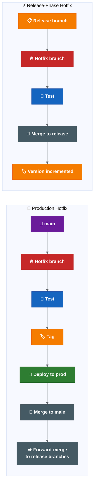
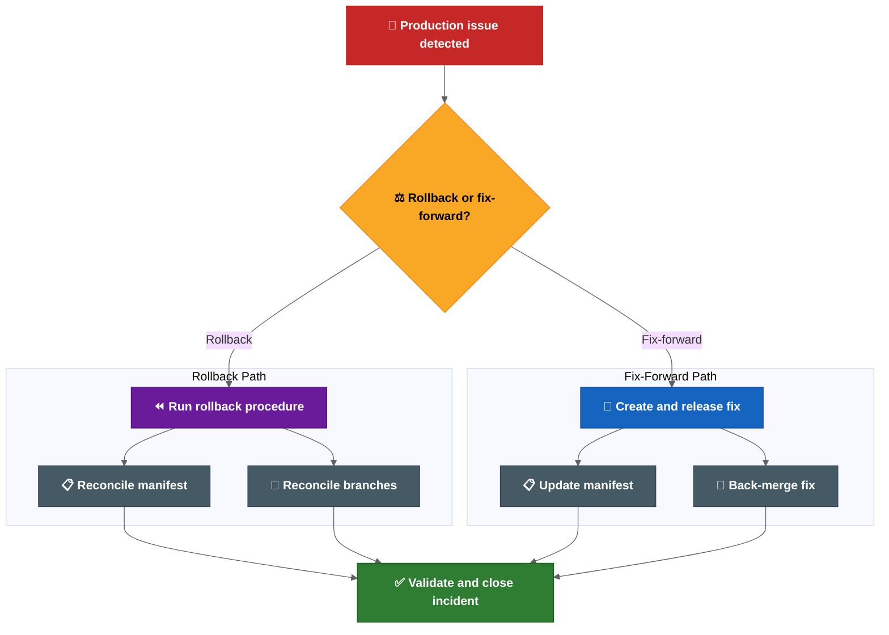

# Hotfix and Rollback

| Field | Value |
| --- | --- |
| Owner | Benan Aktas |
| Status | In Review |
| Created | 2026-06-09 |
| Last updated | 2026-06-09 |
| Labels | hotfix, rollback, production-safety, cerberus, proposal |

---

## Summary

Hotfix and rollback flows directly affect production safety. Two distinct hotfix scenarios exist (production critical and release-phase). Rollback is technically possible via Helm but is not operationally standardised — the practical response today is fix-forward.

This page defines both hotfix scenarios, proposes a minimum operating model, provides a rollback vs fix-forward decision guide and outlines Liquibase and branch reconciliation rules.

---

## Two Hotfix Scenarios

### Production Hotfix (Critical Live Issue)

```text
main / production state
  → hotfix branch (from main)
  → test and release hotfix
  → update production
  → merge hotfix back into main
  → forward-merge into any active release branches
```

### Release-Phase Hotfix (Issue During Release Preparation)

```text
active release branch
  → hotfix branch (from release branch)
  → test hotfix
  → merge back into release branch
  → release version incremented as normal
```

**Shared behaviour:** Both types are treated identically by automation. Commits generate deployable candidates and update the matching Cerberus chart branch. On merge, the release version/tag increments normally.

---

## Minimum Hotfix Operating Model To Confirm

| Step | Production Hotfix | Release-Phase Hotfix | Evidence |
|------|-------------------|----------------------|----------|
| Source branch | `main` (after cutover) or current production branch (before cutover). | Active release branch. | Release owner confirms. |
| Approver | Release owner + incident lead. | Release owner or delegate. | Approval record on MR. |
| Tag timing | After fix reviewed, tested and accepted. | After merge back into release branch. | Tag + pipeline link. |
| Manifest update | Update to hotfix tag before production deploy. | Update as part of normal release preparation. | Manifest MR. |
| Forward merge | Merge to `main` + assess all active release branches. | Assess later release branches before closure. | Forward-merge checklist. |
| Closure | Confirm production state, manifest, release record and Jira align. | Confirm release branch, manifest and report align. | Closure note. |

---

## Rollback vs Fix-Forward Decision Guide

| Situation | Default Decision | Rationale |
|-----------|------------------|-----------|
| Bad deployment with no DB/irreversible config change | Rollback | Environment can return to previous known-good release. |
| Defect fixable faster than rollback validation | Fix-forward | Lower operational risk if fix path is faster. |
| Liquibase change has no rollback block | Fix-forward | Database rollback may be unsafe or impossible. |
| Secret/config change is the failure cause | Case-by-case | May require config restore, rotation or both. |
| Security incident or exposed secret | Incident process first | Rotation and containment take priority. |
| Partial deployment across services/charts | Stop and assess | Need full state picture before deciding. |

Every rollback or fix-forward decision must record: decision owner, reason, affected services, DB/config/secrets impact, target version, validation result and reconciliation actions.

---

## What Exactly Rolls Back?

The rollback scope must be explicit:

| Item | Included in Rollback? |
|------|-----------------------|
| Service image | Yes |
| Helm chart | Yes |
| Values/config | Yes (if changed) |
| Manifest | Yes |
| Runbook changes | Case-by-case |
| Secrets/environment variables | Case-by-case |
| Database/data changes | Only if rollback block exists |

If any item is not rolled back, this must be documented explicitly.

---

## Liquibase Rollback Rules

| Scenario | Action |
|----------|--------|
| Schema change with rollback block | Execute Liquibase rollback as part of release rollback. |
| Schema change without rollback block | Fix-forward only. Document why rollback not possible. |
| Destructive data change (DROP, DELETE) | Cannot roll back. Fix-forward or restore from backup. |
| Additive-only change (ADD COLUMN, new table) | May not need rollback if application handles both states. |

**Proposed practice:** Every production Liquibase changeset should include a rollback block or documented justification for its absence.

Release readiness for Liquibase changes must confirm:
1. Rollback block exists, or justification documented.
2. Change tested in lower environment with same rollback path.
3. Team understands whether rollback or fix-forward is the plan.
4. Non-rollbackable changes flagged in release report.

---

## Branch and Manifest Reconciliation

After rollback, define:

| Question | Required Answer |
|----------|----------------|
| Does `main` still reflect production? | Must be updated to match actual production state. |
| Is the manifest reverted or updated? | Must point to the rollback version. |
| Does the failed release branch remain open? | Decision by release owner. |
| Is a fix-forward branch created? | If fix-forward chosen, yes. |
| Does `development` need a revert/fix? | Assess and merge as needed. |
| How do release notes reflect the rollback? | Rollback recorded in report/changelog. |

---

## Risks

| Risk | Likelihood | Impact | Mitigation |
|------|------------|--------|------------|
| Extended incident due to no tested rollback process | Medium | Critical | Document and test rollback before next production incident. |
| Hotfix drifts from `main` and active releases | Medium | High | Forward-merge checklist enforced on every hotfix. |
| Liquibase change without rollback block deployed | High | High | Require rollback block or explicit exemption in release readiness. |

---

## References

- Rollback decisions (D16, D17, D18): see 04 — Rollout Decision Proposals
- Ownership and approval: see 06 — Ownership and Approvals
- Automation handling: see 03 — Proposed Release Automation Flow

---

Feedback or questions? Contact the page owner or comment below.

---

## Related Pages

- [CI/CD Findings And Actions](01-cicd-findings-and-actions.md)
- [Proposed Release Automation Flow](03-proposed-release-automation-flow.md)
- [Rollout Decision Proposals](04-rollout-decision-proposals.md)
- [Ownership And Approvals](06-ownership-and-approvals.md)

---

## Detailed Supporting Material

This section keeps the detailed supporting content for readers who need more than the summary above.

### Hotfix And Rollback

This page captures the open hotfix and rollback questions.

Rollback and hotfix handling need to be clear because they affect the branching model, tag strategy, manifest updates and post-release reconciliation.

Open hotfix and rollback decisions are tracked in the [release decision register](04-rollout-decision-proposals.md), especially D16, D17 and D18.

### Hotfix Current Understanding

Hotfixes should be possible from the production state, but the detailed flow still needs to be clarified.

There appear to be two distinct hotfix scenarios that need support:

#### Production Hotfix (Critical Live Issue)

When a critical issue is found in production and no active release branch covers it:

```text
main / production state
  -> hotfix branch (from main)
  -> test and release hotfix
  -> update production
  -> merge hotfix back into main
  -> forward-merge hotfix into any active release branches
```

This is for urgent production fixes that cannot wait for the next release cycle.

#### Release-Phase Hotfix (Issue Found During Release Preparation)

When an issue is found during release preparation or testing:

```text
active release branch
  -> hotfix branch (from release branch)
  -> test hotfix
  -> merge back into release branch
  -> release version incremented as normal
```

This is for fixes discovered during SIT, QAT or pre-production validation.

#### Shared Behaviour

Both hotfix types share the following automation behaviour:

- Feature and hotfix branches are treated similarly by the automation.
- Commits on a hotfix branch should generate a deployable candidate and update the matching Cerberus chart branch.
- When merged into the target branch, the hotfix should increment the release version/tag like any other merged change.
- CVE and Renovate-style changes are expected to raise hotfix/MR work targeting the active release branch.



**Colour key:** Purple = production/main baseline · Red = hotfix branch · Blue = test step · Orange = tag/version or release branch · Green = production deployment · Grey = merge/reconciliation work.

### Hotfix Questions To Answer

- Who approves a hotfix merge?
- When is the hotfix tagged?
- How is the manifest updated?
- How is the hotfix forward-merged into active release branches?
- How do we prevent hotfix drift between production and `main`?
- How do CVE/Renovate hotfix branches get reviewed and prioritised during release work?
- What is the maximum acceptable time from hotfix decision to production deployment?

### Minimum Hotfix Operating Model To Confirm

Before production rollout, the team may want to confirm the following minimum model or replace it with a better one:

| Step | Production Hotfix Default | Release-Phase Hotfix Default | Approval / Evidence |
| --- | --- | --- | --- |
| Source branch | Known production baseline (`main` after cutover, current production branch before cutover). | Active release branch. | Release owner confirms source branch. |
| Approver | Release owner plus incident lead for critical production issues. | Release owner or delegated release approver. | Approval record linked to hotfix MR. |
| Tag timing | Tag after fix is reviewed, tested and accepted for production deployment. | Tag/version increment after merge back into release branch. | Tag and pipeline link. |
| Manifest update | Update manifest to the hotfix tag before production deploy. | Update release manifest as part of normal release preparation. | Manifest MR or deployment-management change. |
| Forward merge | Merge back to `main` and assess all active release branches. | Assess later active release branches before release closure. | Forward-merge checklist. |
| Closure | Confirm production state, manifest, release record and Jira are aligned. | Confirm release branch, manifest and report are aligned. | Release/hotfix closure note. |

### Rollback Current Understanding

Rollback appears to be technically possible through Helm, but it is not currently built into the automated deployment flow.

Current state:

```text
Rollback capability: technically possible through Helm
Automated rollback: not currently built into deployment flow
Operational rollback process: unclear / not fully standardised
Common practical response: fix-forward
```



**Colour key:** Red = production issue · Yellow = rollback/fix-forward decision · Purple = rollback path · Blue = fix-forward path · Grey = reconciliation actions · Green = validated closure.

### Rollback Questions To Answer

- Is rollback a standard operating path or mostly an exception?
- When do we rollback vs fix-forward?
- Who owns the rollback decision?
- Who executes the rollback?
- Is rollback tested regularly?
- How are rollback actions audited?
- How are branches and manifests reconciled after rollback?

### Rollback vs Fix-Forward Decision Guide

The decision should be made by the release owner and incident lead, with input from the affected squad and platform owner.

| Situation | Default Decision | Why |
| --- | --- | --- |
| Bad deployment with no database or irreversible config change | Rollback candidate | Environment can likely return to the previous known-good release. |
| Defect can be fixed faster than rollback can be validated | Fix-forward candidate | Lower operational risk if the fix path is faster and clear. |
| Liquibase/data change has no rollback block | Fix-forward candidate | Database rollback may be unsafe or impossible. |
| Secret/config change is the failure cause | Case-by-case | May require config restore, secret rotation or both. |
| Security incident or exposed secret | Incident process first | Rotation and containment may matter more than application rollback. |
| Failed release partially deployed across services/charts | Stop and assess | Need manifest, chart and environment state before deciding. |

Every rollback or fix-forward decision should record:

- decision owner,
- reason,
- affected services/charts,
- database/config/secrets impact,
- selected rollback or fix-forward target,
- validation result,
- branch, manifest, release report and Jira reconciliation actions.

### What Exactly Rolls Back?

The rollback process should say whether rollback includes:

- Service image.
- Helm chart.
- Values/config.
- Manifest.
- Runbook changes.
- Secrets or environment variables.
- Database or data changes, where relevant.

If some items are not rolled back, the process should say so explicitly.

### Database And Liquibase Rollback

Database changes require special consideration because they are often forward-only.

#### Current Understanding

- Liquibase is used for database schema and data changes.
- One Liquibase update may affect multiple projects.
- Liquibase changesets are typically applied once and tracked by checksum.
- There is no standard rollback block requirement documented.

#### Proposed Rollback Rules

| Scenario | Action |
| --- | --- |
| Schema change with rollback block | Execute Liquibase rollback as part of the release rollback. |
| Schema change without rollback block | Fix-forward is likely the only safe option. Document why rollback is not possible. |
| Destructive data change (DROP, DELETE) | Cannot be rolled back. Fix-forward or restore from backup. Incident process applies. |
| Additive-only change (ADD COLUMN, new table) | May not need rollback if application code handles both states. |

#### Suggested Practice

```text
Every production Liquibase changeset should include a rollback block or a documented justification for why rollback is not supported.
```

Release readiness for changes that include Liquibase should confirm:

1. Rollback block exists, or explicit documentation explains why not.
2. The change has been tested in a lower environment with the same rollback path.
3. The team understands whether fix-forward or rollback is the plan if the release fails.
4. If rollback is not possible, this is flagged in the release report.

### Branch And Manifest Reconciliation

Rollback is not only an environment action. It can create source-control and release-state questions.

The process should define:

- Whether `master` still reflects production after rollback.
- Whether the manifest is reverted or updated to the rollback version.
- Whether the failed release branch remains open.
- Whether a fix-forward branch is created.
- Whether `development` needs a revert, fix or follow-up merge.
- How the release notes/changelog reflect the rollback.

### Suggested Operating Principles

Useful principles to confirm:

- Hotfixes start from the known production baseline.
- `master` should stay aligned with production state.
- Hotfixes are back-merged into `development` and relevant active release branches.
- Rollback decisions are owned, documented and audited.
- Rollback instructions include code, chart, manifest, config and runbook impact.
- Fix-forward is allowed only when the risk is lower than rollback and the decision is explicit.

### Output Needed

The team should produce:

1. A documented hotfix flow.
2. A documented rollback flow.
3. A rollback vs fix-forward decision guide.
4. A branch reconciliation checklist.
5. A manifest reconciliation checklist.
6. Clear ownership for decision, execution and validation.

### Related Best Practices

Helm rollback limits, rollback runbook structure, hotfix time budgeting and Liquibase forward-only migration guidance are summarised in [release engineering best practices](07-transformation-programme.md).

### Related Pages

- [Automation And Validation](03-proposed-release-automation-flow.md)
- [Release Scope, Ownership And Approvals](06-ownership-and-approvals.md)
- [Rollout Decision Proposals - Summary](04-rollout-decision-proposals.md)
- [Release Engineering Best Practices](07-transformation-programme.md)
