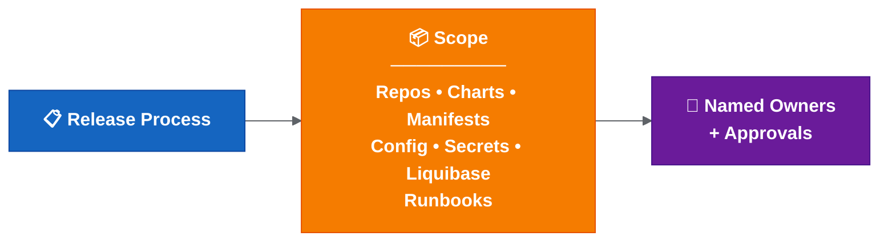
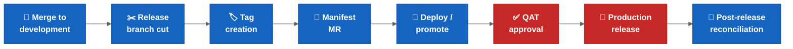

# Ownership and Approvals

| Field | Value |
| --- | --- |
| Owner | Benan Aktas |
| Status | In Review |
| Created | 2026-06-09 |
| Last updated | 2026-06-09 |
| Labels | ownership, raci, governance, cerberus, release-engineering |

---

## Summary

Automation cannot replace accountability. Without named owners, decisions are delayed and escalation is unclear. This page identifies ownership gaps, defines the repositories and change types needing classification, provides an ownership matrix template, outlines the environment readiness checklist and maps the approval points in the release lifecycle.

Open scope and ownership decisions are tracked under D20 and D21 in 04 — Rollout Decision Proposals.

---

## Ownership Gap Table

| Area | Accountable Owner Needed | Why |
|------|--------------------------|-----|
| Release readiness | Release owner | Confirms release can progress. |
| Manifest/tag validation | Release owner / platform owner | Prevents wrong artefacts. |
| Drone secrets/tokens | Platform owner | Prevents environment failures. |
| Hotfix decision | Release owner / incident lead | Avoids production drift. |
| Rollback decision | Release owner / incident lead | Ensures fast incident response. |
| Changed-chart exclusion | Release owner | Prevents hidden deployment gaps. |
| Environment readiness | Platform / environment owner | Confirms deployability. |
| Alert response | Named squad/platform owner | Ensures failed automation is handled. |

---

## Repositories to Classify

Confirm whether these are in scope for the same release process:

- Service repositories
- Helm chart repositories
- Cerberus deployment management repository
- Manifest repositories
- Secrets/config repositories
- Liquibase/database change repositories
- Runbook repositories
- Release metadata/changelog repositories

---

## Change Types to Track

| Change Type | Proposed Inclusion | Decision Needed | Notes |
|-------------|-------------------|-----------------|-------|
| Application/service code | In scope by default | Confirm repository list | — |
| Service chart changes | In scope when changed | Confirm automation/manual boundary | May remain partly manual until Drone updated. |
| Manifest updates | In scope by default | Confirm source of truth and approval point | Must match generated/expected tags. |
| Secrets/config | Per release decision | Confirm ownership and audit path | Careful handling required. |
| Liquibase/database | Per release decision | Confirm rollback/fix-forward plan | Sequencing and rollback consideration. |
| Runbook steps | Per release decision | Confirm execution owner | Manual or environment-specific operations. |

If an item is excluded from a release, the release owner must record the reason and approver.

---

## Environment Readiness Checklist

An environment existing in Kubernetes does not mean it is release-ready. Before treating a new environment as ready, confirm:

- [ ] Values files exist and match naming expectations.
- [ ] Environment name is supported by deployment scripts.
- [ ] Drone secrets/tokens are configured.
- [ ] Kube/robot token ownership is clear.
- [ ] Required secrets are present and encrypted correctly.
- [ ] Feature flag defaults are known and documented.
- [ ] External integrations are reachable.
- [ ] Required runbook steps are documented.
- [ ] Access and permissions are confirmed.
- [ ] Smoke test path is known and executable.

---

## Cross-Repository Ticket Grouping

The automation relies on consistent ticket and branch naming. Open items to confirm:

- Exact branch/ticket naming rule.
- Which repositories participate in cross-repo grouping.
- Handling when one ticket depends on another ticket/branch.
- Who can manually adjust chart entries for cross-ticket dependencies.
- Who owns secret/config updates spanning multiple repositories.

---

## Ownership Matrix

| Activity | Owner | Approver | Backup | Evidence |
|----------|-------|----------|--------|----------|
| Merge to `development` | Squad developer | Squad lead / peer | Another squad member | Merge request |
| Create release branch | Automation (TBC) | Release owner | TBC | Pipeline link |
| Create service tag | Automation / release management | Release owner | TBC | Tag + pipeline link |
| Update manifest | Automation (TBC) | Release owner | TBC | Manifest MR |
| Deploy to lower environment | Squad developer | Squad lead | Another squad member | Deployment job |
| Deploy to SIT and above | Release management | Release owner | TBC | Deployment job |
| QAT approval | QAT team | QAT lead | TBC | Approval record |
| Production release | Release management | Release owner | TBC | Release record |
| Hotfix | Squad developer (implements) | Release owner + incident lead | TBC | Hotfix MR/tag |
| Rollback | Platform/DevOps (executes) | Release owner + incident lead | TBC | Rollback record |
| Post-release reconciliation | Automation + release owner | Release owner | TBC | Merge records |

**Note:** Backup owners need confirmation with team leads. Pilot automation ownership sits with Gareth/Achilles; long-term owner TBC.

---

## Approval Points

| Point | Type | Approver |
|-------|------|----------|
| Merge to `development` | Process step | Squad lead / peer |
| Release branch cut | Automated | Release owner (oversight) |
| Tag creation | Automated | Release owner (oversight) |
| Manifest MR | Approval gate | Release owner |
| Promotion to SIT | Approval gate | Release owner |
| QAT approval | **Mandatory gate** | QAT lead |
| Production release | **Mandatory gate** | Release owner + QAT |
| Rollback/fix-forward decision | **Mandatory gate** | Release owner + incident lead |
| Post-release closure | Process step | Release owner |

The team should decide which points are mandatory and which can be automated.

---

## References

- Decision register (D20, D21): see 04 — Rollout Decision Proposals
- Hotfix approval flow: see 05 — Hotfix and Rollback
- RACI matrix detail: see 07 - Improvement Path And Maturity Observations

---

Feedback or questions? Contact the page owner or comment below.

---

## Related Pages

- [Current Release Operating Model](02-current-release-operating-model.md)
- [Proposed Release Automation Flow](03-proposed-release-automation-flow.md)
- [Rollout Decision Proposals](04-rollout-decision-proposals.md)
- [Hotfix And Rollback](05-hotfix-and-rollback.md)
- [Improvement Path And Maturity Observations](07-transformation-programme.md)

---

## Detailed Supporting Material

This section keeps the detailed supporting content for readers who need more than the summary above.

### Release Scope, Ownership And Approvals

This page captures the release scope, ownership and approval questions that should be clarified.

Open scope and ownership decisions are tracked in the [release decision register](04-rollout-decision-proposals.md), especially D20 and D21.

### Why Scope Matters

The phrase "all services" needs a clear definition.

Release risk is not limited to source branches. It may also include Helm charts, manifests, configuration, secrets, runbooks and deployment management repositories.

If scope is unclear, automation may process too much, too little or the wrong thing.

**Colour key:** Blue = release process · Orange = explicit release scope · Purple = named owners and approvals.

### Ownership Gap

Automation cannot replace accountability. If an automated step fails, someone still needs to decide whether to rerun, override, stop, roll back or fix forward. Without named owners, decisions are delayed and escalation is unclear.

| Area | Accountable Owner Needed | Why |
| --- | --- | --- |
| Release readiness | Release owner | Confirms release can progress. |
| Manifest/tag validation | Release owner / platform owner | Prevents wrong artefacts. |
| Drone secrets/tokens | Platform owner | Prevents environment failures. |
| Hotfix decision | Release owner / incident lead | Avoids production drift. |
| Rollback decision | Release owner / incident lead | Ensures fast incident response. |
| Changed-chart exclusion | Release owner | Prevents hidden deployment gaps. |
| Environment readiness | Platform / environment owner | Confirms deployability. |
| Alert response | Named squad/platform owner | Ensures failed automation is handled. |

### Repositories To Classify

Confirm whether these are in scope for the same release process:

- Service repositories.
- Helm chart repositories.
- Cerberus deployment management repository.
- Manifest repositories.
- Secrets/config repositories.
- Liquibase/database change repositories or scripts.
- Runbook repositories.
- Any release metadata or changelog repositories.

### Service Scope Questions

- What does "all services" mean in practice?
- Are release branches created for all services or only changed services?
- Can the automation detect services with actual changes?
- Are there services without clear squad ownership?
- Are shared libraries or shared charts included?
- Are environment-only changes included in the same release scope?
- Are secrets and Liquibase/database changes included in the same release readiness check?

### Change Types To Track

A production or feature change may involve more than application code.

Track whether each release includes:

| Change Type | Proposed Inclusion Status | Decision Needed | Notes |
| --- | --- | --- | --- |
| Application/service code | In scope by default | Confirm repository list | Service repository changes. |
| Service chart changes | In scope when changed | Confirm automation/manual boundary | May remain partly manual until Drone pipelines are updated. |
| Manifest updates | In scope by default | Confirm source of truth and approval point | Must match generated/expected tags. |
| Secrets/config changes | Needs decision per release | Confirm ownership and audit path | Needs careful handling and audit trail. |
| Liquibase/database changes | Needs decision per release | Confirm rollback/fix-forward plan | Needs release sequencing and rollback consideration. |
| Runbook steps | Needs decision per release | Confirm evidence and execution owner | Needed for manual or environment-specific operations. |

The release report should make these statuses visible for each release. If an item is excluded, the release owner should record the reason and approver.

### New Environment Readiness

Several setup points apply for new dev/test environments.

**An environment existing in Kubernetes does not mean it is release-ready.**

Before a new environment is treated as release-ready, confirm:

- [ ] Values files exist and match naming expectations.
- [ ] Environment name is supported by deployment scripts.
- [ ] Drone secrets/tokens are configured.
- [ ] Kube/robot token ownership is clear.
- [ ] Required secrets are present and encrypted correctly.
- [ ] Feature flag defaults are known and documented.
- [ ] External integrations are reachable.
- [ ] Required runbook steps are documented.
- [ ] Access and permissions are confirmed.
- [ ] Smoke test path is known and executable.

Known setup areas to verify:

- Required values files exist.
- Environment names are configured in the relevant setup/deploy scripts.
- Drone secrets/tokens exist for the environment.
- Kube/robot token ownership is clear.
- ACU responsibilities are clear where token/environment provisioning depends on them.
- Deployment scope behaviour is known for live, historical or both.
- Secret chart entries exist and use the expected encrypted format.

### Cross-Repository Ticket Grouping

The proposed automation relies heavily on consistent ticket and branch naming.

If multiple repositories use the same ticket/branch name, their changes should update the same Cerberus chart branch. This allows one feature ticket to group service, config, secret, Liquibase and runbook changes together for deployment/testing.

Open items:

- Confirm the exact branch/ticket naming rule.
- Confirm which repositories participate in cross-repo grouping.
- Confirm what happens when one ticket depends on another ticket/branch.
- Confirm who can manually adjust chart entries for cross-ticket dependencies.
- Confirm who owns secret/config updates when the change spans multiple repositories.

### Ownership Areas

Ownership should be explicit for:

- Merge approval into `development`.
- Release branch creation.
- Tag creation.
- Manifest update.
- Release readiness for each service.
- Deployment execution.
- QAT approval.
- Production release approval.
- Hotfix approval.
- Rollback decision and execution.
- Post-release validation.
- Branch and manifest reconciliation.

### Approval Points

Potential approval points:

- Merge to `development`.
- Release branch cut.
- Tag creation.
- Manifest merge request.
- Promotion to SIT.
- Promotion to higher environments.
- QAT approval.
- Production release.
- Rollback or fix-forward decision.
- Post-release closure.

The team should decide which approval points are mandatory and which can be automated.

**Colour key:** Blue = release process step · Red = mandatory approval gate.

### Ownership Matrix Template

| Activity | Owner | Approver | Backup | Evidence |
| --- | --- | --- | --- | --- |
| Merge to `development` | Squad developer | Squad lead / peer reviewer | Another squad member | Merge request |
| Create release branch | Automation (Gareth/Achilles during pilot) | Release owner | Backup owner to assign | Pipeline/job link |
| Create service tag | Automation or release management | Release owner | Backup owner to assign | Tag + pipeline link |
| Update manifest | Automation (Gareth/Achilles during pilot) | Release owner | Backup owner to assign | Manifest MR |
| Deploy to lower environment | Squad developer | Squad lead | Another squad member | Deployment job |
| Deploy to SIT and above | Release management | Release owner | Backup owner to assign | Deployment job |
| QAT approval | QAT team | QAT lead | Backup owner to assign | Approval record |
| Production release | Release management | Release owner | Backup owner to assign | Release record |
| Hotfix | Squad developer (implements fix) | Release owner (approves) + incident lead (decides urgency) | Backup owner to assign | Hotfix MR/tag |
| Rollback | Platform / DevOps (executes) | Release owner (approves) + incident lead (decides) | Backup owner to assign | Rollback record |
| Post-release reconciliation | Automation + release owner | Release owner | Backup owner to assign | Merge records |

Note: Backup owners still need to be confirmed with team leads before rollout expansion. Known automation ownership sits with Gareth/Achilles for the pilot phase only; the long-term owner should be recorded in the [release decision register](04-rollout-decision-proposals.md).

### Access And Operational Constraints

The release process should document operational constraints, including:

- Whether Thursday is the standard release day.
- Whether PNR room/location access is required for higher environments.
- Which commands require tools pod access.
- Which steps depend on environment variables or secrets.
- Which runbook steps must be executed alongside release.
- How secret exposure during screen sharing/recording is prevented.
- What happens if a secret is exposed and rotation is required.

### Output Needed

The team should produce:

1. A repository scope list.
2. A service scope list.
3. A service ownership list.
4. A release approval map.
5. A manual access/runbook checklist.
6. A post-release reconciliation owner and checklist.

### Related Best Practices

RACI, CODEOWNERS, branch protection, platform-vs-squad ownership and release-train guidance are summarised in [release engineering best practices](07-transformation-programme.md).

### Related Pages

- [Hotfix And Rollback](05-hotfix-and-rollback.md)
- [Rollout Decision Proposals - Summary](04-rollout-decision-proposals.md)
- [Release Decision Register](04-rollout-decision-proposals.md)
- [Possible Improvement Path And Delivery Notes](07-transformation-programme.md)

### Operating Model And RACI Notes

Status: Optional review note / working reference.

### Ownership Model

| Domain | Accountable Owner | Responsibilities | Backup Required |
| --- | --- | --- | --- |
| Release governance | Release owner | Release scope, approvals, go/no-go, closure. | Yes |
| Platform automation | Platform / DevOps owner | Drone pipeline, validation scripts, alerting, rerun safety. | Yes |
| Service delivery | Squad lead | Service changes, feature readiness, test evidence. | Yes |
| Architecture | Principal / enterprise architect | Architecture guardrails, review submissions if needed, ADRs. | Yes |
| Release evidence quality | Release owner / platform data steward | Release report quality, freshness, classification and retention. | Yes |
| Security | Security owner | RBAC, SoD, privileged access, classification, audit. | Yes |
| Operations | Operations / incident lead | Incident command, rollback/fix-forward decision process. | Yes |
| QAT | QAT lead | Functional approval and release validation evidence. | Yes |
| Change management | Change advisory owner | CAB alignment, emergency change process, evidence. | Yes |

### RACI Matrix

| Activity | Platform Team | Engineering Teams | Architects | Release Managers | Product Owners | Operations | Security |
| --- | --- | --- | --- | --- | --- | --- | --- |
| Release scope definition | C | R | C | A | C | I | I |
| Service ownership mapping | C | R/A | I | C | C | I | I |
| Branch strategy confirmation | C | C | A | C | I | I | I |
| Release branch automation | R/A | C | C | C | I | I | C |
| Tag/manifest validation | R | C | C | A | I | I | C |
| Environment readiness gate | R | C | C | A | I | C | C |
| Higher-environment promotion | R | C | I | A | I | C | C |
| Production release approval | C | C | C | A | C | C | C |
| Hotfix decision | R | R | C | A | C | C | C |
| Rollback/fix-forward decision | R | C | C | C | I | A | C |
| Post-release reconciliation | R | C | I | A | I | C | I |
| Release report retention | R | I | C | A | I | I | C |
| Formal architecture review submission if needed | C | I | A/R | C | C | C | C |

Legend: R = Responsible, A = Accountable, C = Consulted, I = Informed.

### Governance Controls

| Control | Requirement |
| --- | --- |
| Separation of duties | The same person should not unilaterally approve, deploy and close a production release. |
| Privileged access | Admin access to Drone, deployment-management and secrets must be approved, logged and reviewed. |
| Change advisory | Production deployment and emergency hotfixes should map to the agreed normal or emergency change process. |
| Override control | Validation overrides, chart exclusions and rollback exceptions require named approver and reason. |
| Evidence retention | Release report, approval, pipeline, deployment and reconciliation evidence must be retained for audit. |
| Incident command | Rollback/fix-forward decisions must be owned by incident lead with release owner consultation. |
| Security review | Any release automation expansion requires RBAC, audit logging and data classification review. |
| Quarterly review | RACI, owner list, access rights and release metrics should be reviewed quarterly. |

### Related Pages

- [Potential Architecture Review Notes](08-platform-and-knowledge-graph.md)
- [Potential Future Architecture Review Considerations](08-platform-and-knowledge-graph.md)
- [Additional Enterprise Concerns To Confirm](08-platform-and-knowledge-graph.md)
- [Potential Benefits And Roadmap Notes](08-platform-and-knowledge-graph.md)
