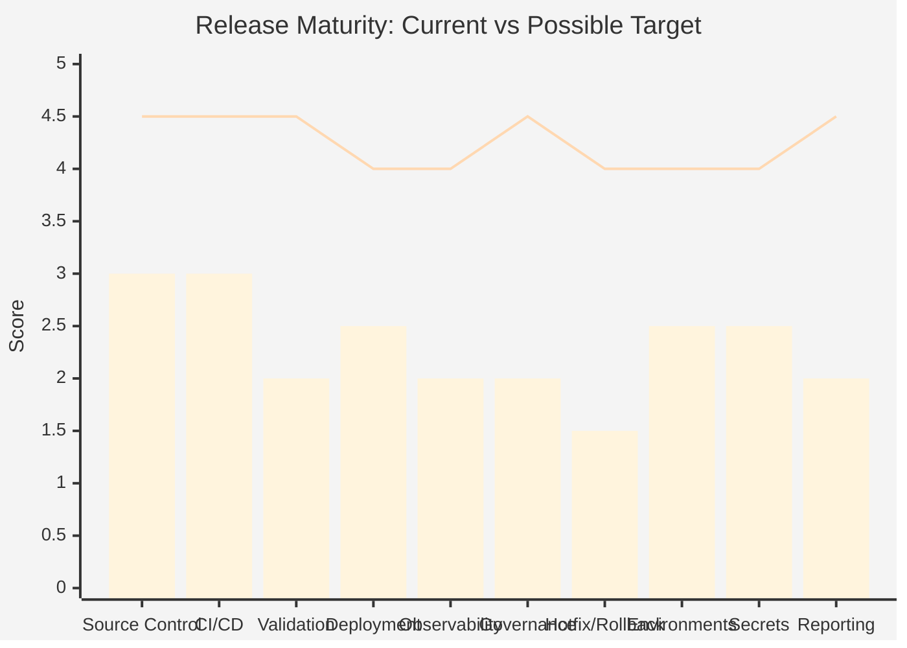
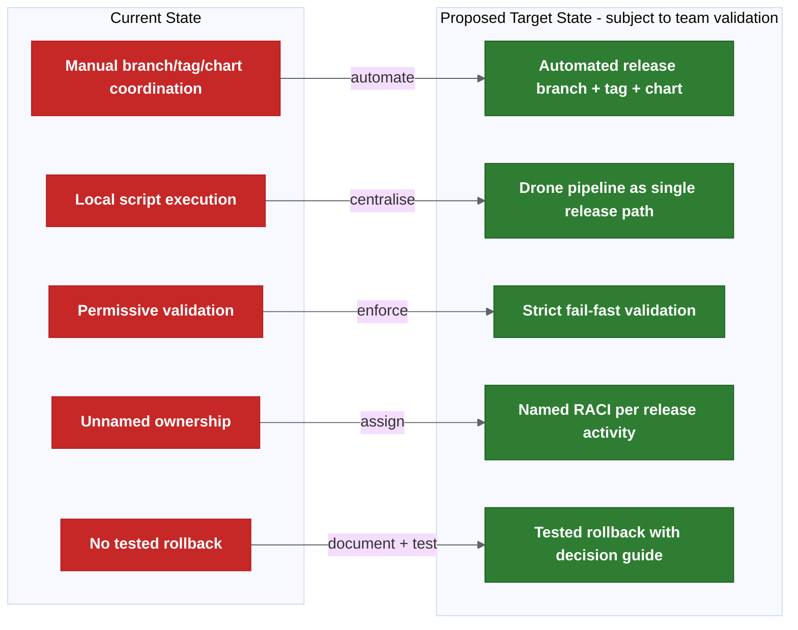
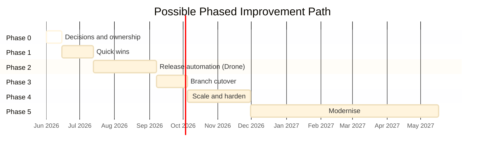

# Improvement Path And Maturity Observations

| Field | Value |
| --- | --- |
| Owner | Benan Aktas |
| Status | In Review |
| Created | 2026-06-09 |
| Last updated | 2026-06-09 |
| Labels | improvement-notes, roadmap, maturity, cerberus, release-engineering |

---

## Summary

The release process currently appears to score around 2.3/5 across ten maturity areas, based on the current notes. A possible target maturity is around 4.3/5, but this needs team validation and baseline measurement. This page captures root cause notes, risk observations, a maturity scorecard, working principles, a possible phased path, potential metrics and improvement areas for discussion.

The approach is: invest in release governance, environment standardisation and deployment automation rather than immediate branching model replacement.

---

## Root Cause Analysis

| Problem | Root Cause | Evidence |
|---------|-----------|----------|
| Failed/wrong release | Environment mismatch; tag/manifest validation not enforced. | Multiple tag versions for same release (e.g. 581–584). |
| Delayed release | Manual coordination across people, scripts and repos. | Preparation takes days per sprint. |
| Rollback uncertainty | No tested operational rollback; Liquibase may be forward-only. | Practical behaviour leans fix-forward. |
| Testing inconsistencies | Environment drift; lower envs ad hoc, higher envs use chart releases. | Pre-prod may contain more data than production. |
| Unclear release content | Release metadata spread across Jira, Git, manifests and scripts. | Tag jump checker sometimes passes incorrectly. |
| Ownership confusion | RACI not assigned; "release management" is a function, not a named person. | Ownership matrix has no confirmed backups. |

---

## Risk Assessment

| # | Risk | Likelihood | Impact | Priority | Mitigation |
|---|------|------------|--------|----------|------------|
| R1 | Production outage from wrong artefact | Medium | Critical | P1 | Strict tag/manifest validation; fail on mismatch. |
| R2 | Extended incident — no rollback process | Medium | Critical | P1 | Document and test rollback; define time budget. |
| R3 | Release delays from manual coordination | High | Medium | P2 | Automation pilot; Drone as agreed release path once proven. |
| R4 | Partial release (missing secrets/config/DB) | High | High | P1 | Explicit release scope checklist per release. |
| R5 | Audit failure from weak release trail | Medium | High | P2 | Pipeline-generated reports; immutable artefacts. |
| R6 | Environment failure at deploy time | Medium | Medium | P3 | Explicit environment readiness gate. |
| R7 | Escalation confusion during incident | High | Medium | P2 | Named owners per RACI. |
| R8 | Trunk-based instability | Low | High | P3 | Defer trunk-based until feature flags mature. |

---

## Maturity Observations

> **Note:** These scores and targets are working estimates only. They should not be treated as measured baselines until validated with release management and platform teams. Actual baseline measurement should begin in Phase 1.

| Area | Current | Possible Target | Gap Summary |
|------|---------|--------|-------------|
| Source control and branching | 3.0 | 4.5 | Reconciliation and automation incomplete. |
| CI/CD pipeline | 3.0 | 4.5 | Release steps still local/manual. |
| Release validation | 2.0 | 4.5 | Fail/warn policy not enforced. |
| Deployment automation | 2.5 | 4.0 | Manual chart updates and triggers remain. |
| Observability and monitoring | 2.0 | 4.0 | No release-correlated observability gates. |
| Release governance and ownership | 2.0 | 4.5 | Named owners and approval map unconfirmed. |
| Hotfix and rollback | 1.5 | 4.0 | No tested operational process. |
| Environment management | 2.5 | 4.0 | Readiness not gated. |
| Secrets and config management | 2.5 | 4.0 | Onboarding and rotation are heavy. |
| Release reporting and audit | 2.0 | 4.5 | Not pipeline-driven or mandatory. |

**Overall: 2.3 -> possible target 4.3**

---

## Working Improvement Principles

1. Stabilise the release operating model before changing branches.
2. Standardise release metadata (commit → production traceability).
3. Automate before reorganising — prove automation with current model first.
4. Improve visibility before restructuring (reports, dashboards, alerting).
5. Reduce manual steps where safe — each is a consistency risk.
6. Make ownership explicit — unnamed = unowned.
7. Test rollback before you need it.
8. Treat environment readiness as a gate, not an assumption.

---

## Possible Target Shape

| Current State | Possible Future Shape |
|---------------|--------------|
| Manual branch/tag/chart coordination | Automated release branch + tag + chart |
| Local script execution | Drone pipeline as agreed release path |
| Permissive validation | Strict fail-fast validation |
| Unnamed ownership | Named RACI per release activity |
| No tested rollback | Tested rollback with decision guide |

---

## Possible Phased Improvement Path

The timing below is indicative only. It should not be read as a committed delivery plan.

| Phase | Timeframe | Focus | Key Deliverables |
|-------|-----------|-------|------------------|
| 0 | Week 1–2 | Decisions and ownership | Confirm rollout decisions; assign named owners; publish exit criteria. |
| 1 | Month 1 | Quick wins | Pre-commit hook; strict validation dry-run; environment readiness checklist; rollback documentation. |
| 2 | Month 2–3 | Release automation | Drone pilot green; auto branch/tag/chart; release reporting; alerting. |
| 3 | Month 3–4 | Branch cutover | `main = production` cutover; branch protections; forward-merge rules active. |
| 4 | Month 4–6 | Scale and harden | Changed-chart deployment; shared dev auto-deploy; rerun safety; full RACI enforcement. |
| 5 | Month 6–12 | Modernise | Runtime feature flags; External Secrets Operator; SBOM generation; observability gates evaluation. |

---

## RACI Matrix

| Activity | Dev/Squad | Tech Lead | Architect | Platform/DevOps | Release Owner | QAT | Incident Lead |
|----------|-----------|-----------|-----------|-----------------|---------------|-----|---------------|
| Feature development | R | A | C | I | I | I | I |
| Merge to release branch | R | A | I | I | I | I | I |
| Release branch creation | I | I | I | R | A | I | I |
| Tag and artefact build | I | I | I | R | A | I | I |
| Manifest validation | I | C | C | R | A | I | I |
| Deploy to lower envs | R | A | I | C | I | I | I |
| Deploy to SIT+ | I | C | I | R | A | C | I |
| Functional validation | C | I | I | I | I | R/A | I |
| Production release | I | C | C | C | A | R | I |
| Hotfix decision | R | C | C | R | A | I | C |
| Rollback decision | I | C | C | R | A | I | R |
| Post-release reconciliation | I | I | I | R | A | I | I |

R = Responsible, A = Accountable, C = Consulted, I = Informed. Named individuals TBC.

---

## Potential Metrics To Baseline

The values below are estimates and need actual baseline measurement before becoming targets.

| Metric | Current Estimate | Possible Phase 2 Target | Possible Phase 4 Target |
|--------|----------------|----------------|----------------|
| Deployment frequency | Monthly | Fortnightly | Weekly |
| Lead time (commit → prod) | 10–15 days | 5–7 days | 2–3 days |
| Change failure rate | ~10–15% | < 5% | < 2% |
| MTTR | ~4–8h | < 2h | < 1h |
| Release prep effort | Days/sprint | < 1 day | < 2 hours |
| Manual steps per release | 10+ | < 5 | < 2 |

---

## Cost/Benefit Summary

| Improvement | Cost | Benefit | Payback |
|-------------|------|---------|---------|
| Strict validation (fail-fast) | Low | Prevents wrong artefacts reaching production. | Immediate |
| Named ownership (RACI) | Low | Faster decisions during incidents/releases. | Immediate |
| Rollback documentation | Low–Medium | Confidence for production incidents. | First incident avoided |
| Drone release automation | Medium | Days saved per sprint; consistent execution. | 2–3 releases |
| Release reporting dashboard | Medium | Visibility; audit trail. | Ongoing |
| Environment readiness gate | Low | Eliminates late release failures. | First prevented failure |
| External Secrets Operator | Medium | Simpler rotation; better audit. | 6 months |
| Trunk-based development | Very High | Uncertain until flags/validation mature. | Unknown |

---

## Top 10 Improvement Areas For Discussion

| # | Improvement | Phase |
|---|-------------|-------|
| 1 | Standardise release metadata (tags, manifests, Jira fields, commit format). | 0–1 |
| 2 | Establish release governance (named owners, approval map, RACI). | 0 |
| 3 | Enforce strict release validation (wrong/missing tag = fail). | 1 |
| 4 | Complete Drone release automation pilot. | 2 |
| 5 | Document and test rollback process. | 1 |
| 6 | Formalise environment readiness as a deployment gate. | 1 |
| 7 | Create release reporting dashboard. | 2 |
| 8 | Introduce release KPIs (DORA metrics + custom). | 2 |
| 9 | Strengthen audit trail (pipeline artefacts, immutable reports). | 2–3 |
| 10 | Re-evaluate branching strategy after maturity improvements. | 4+ |

---

## References

- Findings and actions: see 01 — CI/CD Findings and Actions
- Decisions: see 04 — Rollout Decision Proposals
- Ownership: see 06 — Ownership and Approvals
- Future platform topics: see 08 - Future Platform Topics

---

Feedback or questions? Contact the page owner or comment below.

---

## Related Pages

- [Main Assessment And Reading Order](00-parent-release-engineering-assessment.md)
- [Current Release Operating Model](02-current-release-operating-model.md)
- [Ownership And Approvals](06-ownership-and-approvals.md)
- [Future Platform Topics](08-platform-and-knowledge-graph.md)
- [Page Coverage Index](09-page-coverage-index.md)

---

## Detailed Supporting Material

This section keeps the detailed supporting content for readers who need more than the summary above.

### System State, Problems, Solution Options And Risks

This is a KT-based current-understanding summary of the CI/CD, branching, release and deployment notes.

It reflects my current understanding from KT sessions and follow-up analysis. Some assumptions may be incomplete and should be confirmed with Gareth, Achilles, release management, the platform team and squad leads before being treated as agreed process.

For the full detailed analysis, see [system state detailed analysis](07-transformation-programme.md).

### Current Understanding

#### Current Situation In One Paragraph

Cerberus currently operates a GitFlow-like branching model, but the real release state is not contained within Git alone. It is fragmented across branches, tags, Docker images, Helm artefacts, the Cerberus deployment-management repository, manifests, environment-specific values files, Jira ticket metadata, secrets (managed through Git-crypt and Drone), Liquibase database scripts and runbooks. A branch rename or branching model simplification does not address this fragmentation. The release process is manual-heavy, validation is not strict enough, ownership is not fully assigned and operational procedures (hotfix, rollback, environment readiness) are not standardised. The automation pilot (Gareth/Achilles on the configuration service) is a strong first step, but it covers only part of the problem.

#### Top Observations

| # | Observation | Impact | Possible Discussion Point | Confidence |
| --- | --- | --- | --- | --- |
| 1 | The issue appears broader than branching. | Changing the branch model alone would not fix the release process. | Stabilise the operating model before simplifying branches. | High |
| 2 | Release state appears fragmented across multiple systems. | No single view of what constitutes a release. | Map all release state areas; validate consistency through automation. | High |
| 3 | Release preparation appears manual-heavy. | Days of effort per sprint; inconsistency and audit gaps. | Move local scripts into Drone; automate branch/tag/chart creation where safe. | Medium |
| 4 | Tag, artefact and manifest validation may not be strict enough. | Wrong artefact or blocked work may reach production. | Consider fail-fast rules for wrong tag, missing tag and manifest/tag mismatch. | Medium |
| 5 | Release scope is not fully explicit. | Automation may miss secrets, config, Liquibase or runbook changes. | Confirm a release scope checklist per release. | Medium |
| 6 | Hotfix and rollback do not yet appear operationally standardised. | Production fixes may drift from main, manifests and active releases. | Confirm and test both hotfix and rollback flows. | Low / needs confirmation |
| 7 | Environment readiness does not appear to be a formal gate. | Deployment may fail due to incomplete setup. | Confirm readiness checks for values, secrets, tokens and access. | Low / needs confirmation |
| 8 | Ownership and approval responsibilities are not fully named in the notes. | Decisions may be delayed; escalation may be unclear. | Confirm named owners for key release activities. | Medium |
| 9 | Failed automation alerting and rerun rules appear incomplete. | A failed step can leave release state unclear and unresolved. | Confirm alerting channels, rerun safety rules and manual-intervention triggers. | Low / needs confirmation |
| 10 | Trunk-based development would likely be risky without stronger feature flags, validation and rollback maturity. | Premature simplification may create instability. | Keep the current baseline while release controls mature; reassess later. | Medium |

#### Main Message

> **Changing the branch model alone will not make releases safer.**
>
> The safer path is to make the current release state visible, repeatable, validated, owned and auditable first; then simplify the branch model after the automation proves what is actually being released.

#### Possible Later Direction

The immediate focus appears to be release operating model maturity: validation, ownership, automation and rollback. This is the focus of the current improvement discussion.

Beyond that, future platform capabilities should be treated as separate product decisions after the release foundation is proven.

This is a future maturity option, not part of the initial rollout. It should only be considered after release state visibility, strict validation, named ownership and tested rollback are stable. The feasibility and scope of such a platform would likely need separate platform strategy review and should be treated as a platform product decision.

### Release State Is Fragmented

The release process depends on multiple disconnected state areas. A problem in any one of them can invalidate the release.

| Release State Area | Current Location / Mechanism | Risk |
| --- | --- | --- |
| Source state | Git branches | Branch may not equal deployed state. |
| Release identity | Git tags / release versions | Wrong tag can create wrong artefact. |
| Build output | Docker images / Helm packages | Artefact may not match intended commit. |
| Deployment intent | Cerberus deployment-management / charts | Chart may not match release scope. |
| Environment config | Values files / feature flags | Deployed code may not be active. |
| Secrets | Git-crypt / managed secrets scripts / Drone secrets | Environment may not be ready. |
| Database changes | Liquibase | Rollback may be unsafe or impossible. |
| Release metadata | Jira labels / ticket fields | Release report may be incomplete. |
| Manual actions | Runbooks / release management | Audit trail may be weak. |
| Approval state | QAT / release owner decisions | Ownership may be unclear. |

**This is why a branch rename or branch-model change is not enough. Release safety depends on all of these states agreeing.**

### Business And Delivery Impact

| Problem | Delivery Impact | Operational Risk |
| --- | --- | --- |
| Manual release work | Release preparation takes days per sprint. | Human error and weak audit trail. |
| Weak validation | Wrong artefact may be released. | Production incident risk. |
| Unclear release scope | Config/secrets/DB changes may be missed. | Partial or broken release. |
| Weak rollback process | Recovery may be slow. | Longer incident duration. |
| Ownership gaps | Decisions are delayed. | Escalation confusion. |
| Environment readiness gaps | Late release failure. | Wasted release window. |
| Fragmented release state | Hard to prove what was deployed. | Audit and incident investigation risk. |

### Current Understanding Summary

```text
Avoid changing the branching model first.
First make the release process visible, repeatable, validated and owned.
Then discuss moving to the target main = production model through a controlled cutover.
```

The current problem is broader than branching. The release state is spread across branches, tags, images, Helm packages, Cerberus charts, manifests, values, secrets, Liquibase changes, JIRA metadata, QAT approval and post-release reconciliation.

The proposed direction appears sensible, but it should be treated as a phased operating-model discussion, not only a branch rename.

### Current System State

| Area | Current State | Confidence |
| --- | --- | --- |
| Branch model | GitFlow-like: feature -> `development` -> release branch -> `master` / production. | Medium |
| Target branch model | `main` represents production; release branches auto-created from `main`. | Proposed |
| Automation | Scripts work locally; Drone execution is the next step. | Medium |
| Pilot | Gareth/Achilles are testing on the new configuration service. | Medium |
| Artefact creation | Release tag triggers build, tests, scans and Helm artefact creation. | High |
| Deployment | Helm/package and Cerberus chart flow still has manual areas. | Medium |
| Release reporting | Expected to cross-reference JIRA, tags, services and chart changes. | Proposed |
| Validation | Existing scripts check some metadata, but strict fail/warn policy is not fully agreed. | Low/Medium |
| Hotfix/rollback | Concepts exist; operational runbook and reconciliation rules need confirmation. | Low/Medium |
| Environment readiness | Values, secrets, tokens and parity checks need clearer gates. | Low |
| Ownership | Templates exist; named owners and approvers are still incomplete. | Low |

### Main Problems

| # | Problem | Impact | Root Cause | Possible Action |
| --- | --- | --- | --- | --- |
| P1 | The issue can be misframed as "branching only". | A branch change may move risk rather than reduce it. | Release state is distributed across many systems. | Stabilise the operating model before changing the branch model. |
| P2 | Release work is too manual and locally executed. | Slow releases, inconsistent execution, weak audit trail. | Automation is not yet the normal central path. | Complete Drone pilot; make pipeline the agreed release path where the pilot proves safe. |
| P3 | Branch, tag and artefact timing rules are not strict enough. | Wrong artefacts or manifests can be produced. | Branch lifecycle and artefact lifecycle are different. | Enforce strict validation: wrong/missing tag = fail. |
| P4 | Release scope is unclear. | Secrets, config, Liquibase or runbook changes can be missed. | "All services" is not yet defined as a repo/change-type scope. | Define explicit release scope per repo and change type. |
| P5 | Manifest and ticket validation can be too permissive. | Blocked or wrong work can reach release. | Fail vs warning policy is still proposed. | Switch from warning to fail-fast after one dry-run release. |
| P6 | Changed-chart deployment is not yet a proven default. | Changed charts may be missed or unnecessary charts deployed. | Umbrella chart and service mapping need reliable detection. | Validate detection in pilot; deploy changed charts by default. |
| P7 | Hotfix and rollback are not operationally standardised. | Production can drift from branch, manifest and release records. | Rollback is treated as technical capability, not full process. | Document and test both flows before next production incident. |
| P8 | Environment readiness and parity are not explicit gates. | Release day failures can appear late. | Values, secrets, data, access and tokens are not centrally confirmed. | Consider formalising environment readiness as a deployment gate. |
| P9 | Secrets/config management will get harder at scale. | Onboarding, rotation and audit risk increase. | Git-crypt/GPG is workable but operationally heavy. | Evaluate External Secrets Operator for medium-term. |
| P10 | Trunk-based development is risky without stronger feature flags. | Incomplete work may need branch or config workarounds. | Feature flags appear deploy-time rather than dynamic runtime. | Keep current model; add runtime flags before reconsidering. |
| P11 | Ownership and approval gaps can break the rollout. | Failures, overrides and rollback decisions become slow. | RACI is not yet fully named. | Confirm named owners before expanding beyond pilot. |
| P12 | Alerting and rerun rules are incomplete. | Failed automation can leave state half-updated. | Failure modes are not yet production-readiness gates. | Define alerting channels and safe-rerun criteria. |

For detailed analysis of each problem, see the [detailed system analysis appendix](07-transformation-programme.md).

### Possible Improvement Path

#### 1. Stabilise The Current Operating Model

Keep the current GitFlow-style model temporarily while the release process is made explicit.

Possible near-term discussion points:

- Confirm or amend the rollout decisions.
- Define release scope across repos and change types.
- Decide fail vs warning validation rules.
- Name release, hotfix, rollback, environment and alert owners.
- Keep the current process visible until automation is proven.

Risk:

- This can look like "no branching progress" unless time-boxed.

Mitigation:

- Treat it as a one-sprint decision cleanup and publish the exit criteria.

#### 2. Move Release Automation Into Drone

Make Drone the central path for release branch, tag, chart update and report generation.

Possible next steps:

- Complete the configuration-service pilot.
- Test reruns and partial-failure recovery.
- Store release reports as pipeline artefacts or release records.
- Alert failures to the right squad/release channel.

Risk:

- Local scripts may fail in Drone because of token, proxy, secret or permission differences.

Mitigation:

- Keep pilot scope narrow and test both happy-path and failure-path cases.

#### 3. Add Strict Release Validation

Possible strict-validation default:

```text
Wrong tag -> fail
Missing tag -> fail
Manifest/tag mismatch -> fail
Do-not-deploy marker -> fail unless explicitly overridden
Invalid ticket status -> fail or release-owner override
Unknown ownership -> fail or release-owner override
```

Risk:

- Early rollout may fail often because metadata quality is inconsistent.

Mitigation:

- Start with dry-run/report-only for one release, then switch to enforced fail-fast.

#### 4. Consider Cutover To `main = Production`

Consider cutover only after the pilot and validation rules are green.

Safer cutover may be:

```text
Create or rename `main` from the confirmed production state.
Avoid renaming `development` to `main`.
```

Risk:

- `development` may contain work that has not reached production.

Mitigation:

- Freeze `development`, inventory open work and set branch protections before cutover.

#### 5. Scale Changed-Chart Deployment

The default could be to deploy all changed charts, with exclusions requiring release-owner confirmation and an audit note.

Risk:

- Detection can miss a chart, especially with umbrella charts or cross-repo changes.

Mitigation:

- Keep mass diff and human review mandatory in the first rollout phases.

#### 6. Make Hotfix And Rollback A Production Gate

Production release would likely need:

- hotfix flow,
- rollback vs fix-forward decision guide,
- manifest reconciliation checklist,
- branch reconciliation checklist,
- Liquibase rollback/fix-forward policy,
- named decision owner.

Risk:

- Rollback may be unsafe when DB/data changes are involved.

Mitigation:

- Require rollback blocks or explicit no-rollback justification for production Liquibase changes.

#### 7. Modernise Later, Not First

Runtime feature flags, external secret management and observability hardening are valuable future improvements.

They should come after the release pipeline, validation and ownership model are stable.

### Go / No-Go Criteria

#### Go For Automation Rollout

- Drone pilot succeeds for the configuration service.
- Generated tags, versions, chart changes and release report match expectations.
- Rerun is tested and safe.
- Failure alerting is defined.
- Manual chart edits are exception-only and audited.
- Release owner and backup are named.

#### No-Go For Automation Rollout

- Scripts only work locally.
- Pipeline failure can be silent.
- Rerun can create duplicate or conflicting state.
- Release report does not match actual chart/manifest state.
- Drone secrets/tokens are not owned.

#### Go For Branch Cutover

- Confirmed production state is known.
- `main` branch protection is ready.
- Automation targets the correct branch.
- Open work on `development` is inventoried.
- Hotfix and rollback reconciliation are confirmed.
- Strict validation has passed at least the pilot.

#### No-Go For Branch Cutover

- Production state cannot be tied to branch/tag/manifest.
- Drone pilot is not green.
- `development` contains unknown open work.
- Rollback reconciliation is unclear.
- Forward-merge ownership is missing.

### Suggested Next Steps

```text
Phase 0: confirm decisions and ownership.
Phase 1: quick wins and strict validation dry-run.
Phase 2: Drone pilot.
Phase 3: controlled `main = production` cutover.
Phase 4: expand changed-chart deployment and shared dev.
Phase 5: optimise feature flags, secrets and observability.
```

The strongest suggested direction is to avoid a big-bang branch change. A safer path may be to make the release state auditable first, then simplify the branch model once the automation can prove what is actually being released.

For root cause notes, maturity observations, possible phases, RACI and metrics to baseline, see [improvement notes and maturity observations](07-transformation-programme.md).


### One-Page Summary

#### Current State

Cerberus uses a GitFlow-like branching model with release branches, tags, Helm packaging and environment promotion. The release process is functional but manual-heavy, with fragmented state across branches, tags, images, charts, manifests, Jira, secrets and runbooks. Automation is being piloted on the configuration service by Gareth/Achilles.

#### Top 5 Risks

| # | Risk | Likelihood | Impact |
| --- | --- | --- | --- |
| 1 | Wrong artefact deployed due to weak tag/manifest validation. | Medium | High |
| 2 | Production incident with no standardised rollback procedure. | Medium | Critical |
| 3 | Release scope incomplete (missing secrets, config or DB changes). | High | High |
| 4 | Ownership gaps delay decisions during incidents. | High | Medium |
| 5 | Environment readiness failure blocks release at deploy time. | Medium | Medium |

#### Top 5 Improvement Areas For Discussion

| # | Improvement Area | Effort | Priority |
| --- | --- | --- | --- |
| 1 | Move release automation scripts into Drone (complete the pilot). | Medium | Immediate |
| 2 | Enforce strict tag/manifest validation (fail on mismatch). | Low | Immediate |
| 3 | Document and test hotfix and rollback flows. | Medium | Before next production incident |
| 4 | Assign named owners for all release activities. | Low | Before pilot expands |
| 5 | Formalise environment readiness as a pre-deployment gate. | Low | Before new environments are used |

#### Go / No-Go Criteria For Rollout Expansion

Before expanding the automation beyond the pilot:

- [ ] Configuration-service pilot completes successfully in Drone.
- [ ] Generated chart changes, versions and tags are correct.
- [ ] Release report is produced and matches expected content.
- [ ] Changed-chart detection identifies expected charts.
- [ ] Alerting for failed steps is in place.
- [ ] Rollback procedure is documented and tested.
- [ ] Named release owner and platform owner are assigned.
- [ ] At least one squad lead has reviewed and confirmed understanding.

#### Suggested Immediate Next Step

> **Validate the current-state assumptions with Gareth, Achilles, release management and one squad lead before asking the team to confirm or amend the rollout decisions.**

### Related Pages

- [Cerberus Release Process Understanding, Gaps And Improvement Ideas](00-parent-release-engineering-assessment.md)
- [Current Release Operating Model](02-current-release-operating-model.md)
- [CI/CD Deployment Findings And Actions](01-cicd-findings-and-actions.md)
- [Proposed Release Automation Flow](03-proposed-release-automation-flow.md)
- [System State, Problems, Solution Options And Risks - Detailed Analysis](07-transformation-programme.md)

### System State, Problems, Solution Options And Risks - Detailed Analysis

This page contains the detailed analysis behind the shorter current-understanding summary.

Use this page when you need the rationale, operational detail and experience-based notes. Use [system state, problems, solution options and risks](07-transformation-programme.md) for the short version.

### Purpose

This analysis answers four questions:

1. What is the current state of the CI/CD, branching, release and deployment system?
2. What are the main problems?
3. What solution options are available?
4. What risks does each solution introduce?

Related pages:

- [Current release operating model](02-current-release-operating-model.md)
- [Deployment and release findings](01-cicd-findings-and-actions.md)
- [CI/CD deployment findings and actions](01-cicd-findings-and-actions.md)
- [Proposed release automation flow](03-proposed-release-automation-flow.md)
- [Branching strategy options](02-current-release-operating-model.md)
- [Automation and validation](03-proposed-release-automation-flow.md)
- [Hotfix and rollback](05-hotfix-and-rollback.md)
- [Release scope, ownership and approvals](06-ownership-and-approvals.md)
- [Rollout decision proposals](04-rollout-decision-proposals.md)

### Detailed Current Understanding Summary

The main issue is not the branch model alone.

The bigger issue is that release state is distributed across several moving parts:

- source branches,
- release tags,
- images and Helm artefacts,
- Cerberus chart branches,
- manifests,
- values files,
- secrets and configuration,
- Liquibase/database changes,
- runbooks,
- JIRA metadata,
- QAT approvals,
- post-release reconciliation.

That means a branch model change cannot, by itself, make releases safe.

Suggested order:

```text
1. Make the current release process visible and auditable.
2. Move repeatable release work into Drone.
3. Enforce strict tag, manifest and ticket validation.
4. Name owners for release, hotfix, rollback, environment readiness and alerting.
5. Cut over to `main = production` only after the pilot is proven.
6. Consider trunk-based development later, after feature flags and rollback maturity improve.
```

### 1. Current System State

#### 1.1 Branching And Release Model

The current branching model is close to GitFlow:

```text
feature branch -> development -> release branch -> master / production
```

Current understanding:

- Feature or ticket branches are used for individual changes.
- Completed work is merged into `development`.
- Release branches are cut from `development`.
- `master` is expected to represent production/live state.
- Release branches are tagged to trigger releasable artefact creation.
- After release, the release branch should be reconciled back into `master` and `development`.

Target direction:

```text
main = production/live baseline
release branch = sprint/release candidate
feature/hotfix branch = created from the relevant release branch
production release = reconciled back into main
```

Important distinction:

```text
Do not rename `development` to `main`.
Create or rename `main` from the confirmed production state.
```

Experience-based note:

In release-process changes, teams often focus too early on "GitFlow vs trunk-based". The better first question is whether the team can prove exactly what is included in a release, who approved it, which artefact was deployed and how rollback would be handled.

#### 1.2 Artefacts, Tags And Deployment

A release branch alone does not produce a deployable artefact. The release tag is the bridge between source state and deployable state.

Tag creation appears to trigger:

- repository clone,
- build/test setup,
- Artifactory login,
- service build,
- Maven install/tests for Spring Boot services,
- vulnerability scanning such as Trivy,
- code quality scanning such as Sonar,
- Helm package, dependency build and artefact upload.

Deployment uses packaged Helm artefacts and environment-specific values files.

Key risk:

```text
If the tag points at the wrong commit, every later step can look correct while still deploying the wrong artefact.
```

Experience-based note:

"The branch is correct" is not enough. Production receives an image, chart, manifest, values, secrets and runbook combination. Release safety depends on that whole combination being consistent.

#### 1.3 Manifest, JIRA And Release Metadata

Existing scripts appear to support:

- release ticket creation,
- manifest creation,
- JIRA release-label lookup,
- GitLab tag-field lookup,
- changelog update,
- branch creation,
- commits,
- pushes,
- merge requests.

Open validation questions:

- Should a wrong tag fail or warn?
- Should a missing tag fail or warn?
- Does a `do not deploy` marker always stop release?
- How should `NA` tag entries appear in the release report?
- Can invalid ticket status be overridden?
- Is the tag jump checker retired, replaced or adapted?

Recommended position:

```text
Release-integrity issues should fail fast.
Exceptions should be explicit, approved and recorded.
```

#### 1.4 Environment Readiness

Lower environments are more ad hoc. SIT and above rely more heavily on release management and QAT approval.

Environment readiness should include:

- values files,
- environment setup script entries,
- Drone secrets/tokens,
- kube/robot token ownership,
- secret chart entries,
- deployment scope behaviour,
- data shape,
- external integrations,
- network access,
- operational permissions,
- runbook steps.

Experience-based note:

A namespace existing in Kubernetes does not mean the environment is release-ready. Release readiness includes secrets, tokens, values, data, access and operational runbooks.

#### 1.5 Secrets, Config, Feature Flags And Liquibase

Secrets:

- Managed secrets scripts and Git-crypt appear to be the current direction.
- Secret keys should remain consistent across environments.
- Secret values differ by environment.
- GPG/Git maintainer onboarding is required.
- Secret exposure during screen sharing or recording may require rotation.

Feature flags:

- Feature activation appears to be mostly deploy-time, through values/config.
- Runtime dynamic feature flags are not clearly documented.
- Enabling or disabling a feature may require redeployment.

Liquibase:

- Database changes are part of release scope.
- One Liquibase update may affect multiple projects.
- Rollback-block expectations are not fully defined.

Experience-based note:

Trunk-based development works best when deployment and release are separated. If flag changes require chart redeployment, the team has moved complexity from branches into deployment/configuration rather than removing it.

#### 1.6 Ownership And Approval

The ownership need is correctly identified, but several roles still need named owners:

- release owner,
- rollback decision owner,
- hotfix approver,
- Drone secret/token owner,
- service ownership list,
- environment readiness approver,
- post-release reconciliation owner,
- alert owner.

Experience-based note:

Automation is not an owner. When automation fails, someone must decide whether to rerun, override, stop release, roll back or fix forward.

For problems (P1-P12), see [detailed problems](07-transformation-programme.md).
For solutions (S1-S7) and experience notes, see [detailed solutions](07-transformation-programme.md).

### Related Pages

- [System State, Problems, Solution Options And Risks](07-transformation-programme.md)
- [Detailed Problem Analysis (P1–P12)](07-transformation-programme.md)
- [Detailed Solution Options And Experience Notes (S1–S7)](07-transformation-programme.md)
- [Cerberus Release Process Understanding, Gaps And Improvement Ideas](00-parent-release-engineering-assessment.md)

### Detailed Problem Analysis (P1–P12)

This page provides full analysis of each problem identified in the assessment.

For current state detail, see [system state detailed](07-transformation-programme.md).
For solutions, see [detailed solutions](07-transformation-programme.md).

### 2. Main Problems

#### P1 - The Problem Can Be Misframed As Branching Only

The documents started from branching strategy, but the real system spans tags, artefacts, manifests, charts, config, secrets, environments, QAT, rollback and ownership.

Impact:

- A branch change may move risk rather than reduce it.
- A simpler branch model may expose more ambiguity if validation and ownership are weak.

Root cause:

- Release state is not represented by one system.

Proposed action:

- Treat branching as one part of the release operating model.

#### P2 - Release Work Is Too Manual

The current process still includes local scripts and manual chart, tag or deployment steps.

Impact:

- Release preparation can take days.
- Execution varies by person.
- Audit trail is weak.
- Local environment differences affect outcomes.

Root cause:

- Automation exists, but it is not yet the mandatory central path.

Proposed action:

- Move repeatable release tasks into Drone and make pipeline output the audit source.

#### P3 - Branch, Tag And Artefact Timing Is Not Strict Enough

Branch lifecycle and artefact lifecycle are different.

Impact:

- Wrong commit can be tagged.
- Wrong image or chart can be produced.
- Manifest state can drift from branch state.

Root cause:

- Tag creation rules and validation gates are not fully formalised.

Proposed action:

- Enforce tag timing, tag ownership and tag-to-commit validation in the release pipeline.

#### P4 - Release Scope Is Not Explicit

"All services" needs a precise definition.

Scope may include:

- service repos,
- Helm chart repos,
- deployment-management,
- manifests,
- secrets/config,
- Liquibase/database changes,
- runbooks,
- shared libraries,
- changelog/release metadata.

Impact:

- Automation may include too much, too little or the wrong thing.
- Config, secret or database changes may be missed.

Proposed action:

- Create a repository and change-type scope list before scaling automation.

#### P5 - Manifest And Ticket Validation May Be Too Permissive

Validation exists, but fail/warn policy is not fully agreed.

Impact:

- Blocked tickets can enter release.
- Wrong service versions can be promoted.
- Release reports can become misleading.

Proposed action:

```text
Wrong tag -> fail
Missing tag -> fail
Manifest/tag mismatch -> fail
Do-not-deploy marker -> fail unless explicitly overridden
Invalid ticket status -> fail or release-owner override
```

#### P6 - Changed-Chart Deployment Needs Proof

Deploying only changed charts is the right direction, but detection must be trusted.

Impact:

- A changed chart can be missed.
- An unchanged chart can be deployed unnecessarily.
- Umbrella-chart blast radius can be misunderstood.

Proposed action:

- Use changed-chart deployment by default only after detection has been reviewed against real releases.
- Keep mass diff review mandatory early in rollout.

#### P7 - Hotfix And Rollback Are Not Fully Operationalised

Production hotfix and release-phase hotfix scenarios are identified, but the runbook needs approval.

Impact:

- Production fixes can drift from `main`, release branches and manifests.
- Rollback can leave source control and deployment-management inconsistent.
- Liquibase and config changes can make rollback unsafe.

Proposed action:

- Make hotfix and rollback runbooks production gates.

#### P8 - Environment Readiness Is Not A Gate

New environments need values, setup entries, Drone secrets/tokens and token ownership confirmed.

Impact:

- An environment can appear available but fail deployment.
- Pre-prod approval can create false confidence if parity is poor.

Proposed action:

- Create an environment readiness checklist and require it before rollout.

#### P9 - Secrets And Config Management Will Become Harder At Scale

Git-crypt and managed secrets scripts are workable, but operationally heavy.

Impact:

- Maintainer onboarding slows down.
- Rotation becomes harder.
- Secret exposure response is more expensive.

Proposed action:

- Keep the current approach short term.
- Evaluate External Secrets Operator, Sealed Secrets or a central secret manager after release automation stabilises.

#### P10 - Trunk-Based Development Is Risky Without Runtime Feature Flags

Feature flags appear closer to deploy-time values than dynamic runtime control.

Impact:

- Incomplete work may be harder to isolate.
- Turning a feature off may require redeployment.

Proposed action:

- Move toward trunk-based development only after feature flag, testing, monitoring and rollback maturity improve.

#### P11 - Ownership Gaps Can Break The Rollout

Templates exist, but named owners are incomplete.

Impact:

- Failures become slow to resolve.
- Overrides become unclear.
- Rollback decisions are delayed.

Proposed action:

- Use a RACI model with one accountable owner per critical activity.

#### P12 - Alerting And Rerun Rules Are Incomplete

Failed final Git/chart/reporting steps can leave partial state.

Impact:

- Artefacts may exist while chart updates or reports are missing.
- Manual edits may conflict with reruns.

Proposed action:

- Define alert content, alert channels, alert owners and safe rerun criteria before production rollout.

### Related Pages

- [System State, Problems, Solution Options And Risks](07-transformation-programme.md)
- [System State, Problems, Solution Options And Risks - Detailed Analysis](07-transformation-programme.md)
- [Detailed Solution Options And Experience Notes (S1–S7)](07-transformation-programme.md)
- [CI/CD Deployment Findings And Actions](01-cicd-findings-and-actions.md)

### Detailed Solution Options And Experience Notes (S1–S7)

This page provides full solution analysis with risks, mitigations and experience-based notes.

For current state, see [system state detailed](07-transformation-programme.md).
For problems, see [detailed problems](07-transformation-programme.md).

### 3. Solution Options And Risks

#### S1 - Keep The Current Branch Model Temporarily

What changes:

- The current GitFlow-style model remains short term.
- Decisions, validation, scope, hotfix, rollback and ownership are completed first.

Benefits:

- Lowest immediate process risk.
- Familiar workflow remains in place.
- Real process problems become visible before branch cutover.

Risks:

- Teams may feel the branching problem is not being addressed.
- Manual work continues in the short term.

Mitigation:

- Time-box this phase.
- Publish exit criteria.
- Deliver quick wins such as strict validation dry-run and deployment parameter documentation.

#### S2 - Move Release Automation Into Drone

What changes:

- Local scripts become centrally executed pipeline steps.
- Tags, chart updates and release reports are generated through Drone.

Benefits:

- Better auditability.
- Repeatable execution.
- Less local-machine dependency.
- Clearer failure visibility.

Risks:

- Drone may expose proxy, permission, token, secret or working-directory issues.
- Rerun may be unsafe if idempotency is not proven.

Mitigation:

- Keep pilot scope narrow.
- Test failure and rerun cases deliberately.
- Store output as release evidence.

#### S3 - Add Strict Validation

What changes:

- Release-integrity problems stop the pipeline unless explicitly overridden.

Benefits:

- Prevents wrong artefacts and blocked work from reaching production.
- Improves release report trust.
- Strengthens incident review.

Risks:

- Early rollout may fail often because metadata quality is inconsistent.
- False positives may frustrate squads.

Mitigation:

- Run in dry-run/report-only mode first.
- Track common failure reasons.
- Clean metadata before enforcing fail-fast.

#### S4 - Cut Over To `main = Production`

What changes:

- `main` starts from confirmed production state.
- Release branches are created from `main`.
- Production release is reconciled back into `main`.

Benefits:

- Clear production baseline.
- Less long-lived `development` drift.
- Better foundation for a streamlined release model.

Risks:

- Wrong production baseline could be selected.
- Open work on `development` could be mishandled.
- Automation may still point at old branch names.

Mitigation:

- Inventory open work.
- Freeze `development`.
- Test branch protections and pipeline targets before cutover.

#### S5 - Use Ticket-Based Multi-Repo Aggregation And Changed-Chart Deployment

What changes:

- Changes using the same ticket/branch name feed into the same Cerberus chart branch.
- Changed charts are deployed by default.

Benefits:

- Better multi-service release visibility.
- Less manual chart editing.
- Clearer release blast radius.

Risks:

- Naming inconsistencies break aggregation.
- Cross-ticket dependencies may require manual handling.
- Umbrella chart detection may be imperfect.

Mitigation:

- Enforce naming rules.
- Keep chart diff review mandatory.
- Require audited exclusions.

#### S6 - Make Hotfix And Rollback A Production Gate

What changes:

- Release cannot proceed without rollback/fix-forward guidance and reconciliation rules.

Benefits:

- Faster incident decision-making.
- Less production/source-control drift.
- Clearer database and config risk handling.

Risks:

- Rollback may be unsafe when database/data changes are involved.
- Runbook may stay theoretical if not tested.

Mitigation:

- Run rollback tabletop exercises.
- Require Liquibase rollback block or no-rollback justification.
- Define hotfix time budget.

#### S7 - Name Ownership And Approvals

What changes:

- Critical release activities get responsible and accountable owners.
- CODEOWNERS and branch protection can enforce approvals where possible.

Benefits:

- Faster decisions.
- Cleaner overrides.
- Better auditability.

Risks:

- Too many approval gates slow delivery.
- Owner naming may become political or vague.

Mitigation:

- Keep gates focused on release risk.
- Name backups.
- Define approval SLA.

#### S8 - Improve Feature Flag And Config Maturity Later

What changes:

- Deploy-time flags are documented and governed.
- Runtime flags are evaluated as a future improvement.

Benefits:

- Better separation of deployment and release.
- Safer future movement toward trunk-based development.

Risks:

- Feature flag debt can grow.
- Runtime flag platforms add operational dependency.

Mitigation:

- Add owner and expiry date to every flag.
- Include flag state in release reports.
- Review old flags regularly.

#### S9 - Modernise Secrets Management Later

What changes:

- Current managed secrets approach stays short term.
- Modern secrets platforms are evaluated after release automation stabilises.

Benefits:

- Better rotation and audit in the long term.
- Less GPG onboarding friction.

Risks:

- Migration can introduce path/name mismatches.
- New controllers or platforms add operational dependencies.

Mitigation:

- Pilot in non-production.
- Create a secret inventory.
- Avoid combining this migration with the first release-automation rollout.

### 4. Possible Roadmap

#### Phase 0 - Decisions And Baseline

Complete:

- rollout decision confirmation,
- repository scope list,
- service ownership list,
- hotfix/rollback owners,
- validation fail/warn policy.

Exit criterion:

```text
The team knows which steps are automated, which require approval and which are exceptions.
```

#### Phase 1 - Quick Wins

Complete:

- ticket reference validation,
- strict tag validation dry-run,
- deployment parameter documentation,
- changed-chart list in the release report,
- alert template.

Exit criterion:

```text
Release metadata errors become visible before they become production risk.
```

#### Phase 2 - Drone Pilot

Complete:

- configuration-service pilot in Drone,
- generated tag/version/chart validation,
- release report validation,
- rerun testing,
- pilot review with squads.

Exit criterion:

```text
One service has release plumbing that is central, auditable and rerunnable.
```

#### Phase 3 - Controlled Branch Cutover

Complete:

- create `main` from confirmed production state,
- freeze `development`,
- apply branch protections,
- auto-create release branches,
- require production-to-main reconciliation.

Exit criterion:

```text
`main` represents production and release branches are short-lived and automation-managed.
```

#### Phase 4 - Scale-Out

Complete:

- onboard more squads,
- make changed-chart deployment the default,
- audit chart exclusions,
- expand shared dev deployment,
- track release metrics.

Exit criterion:

```text
Manual release steps decrease and release report accuracy increases.
```

#### Phase 5 - Optimise

Complete:

- evaluate runtime feature flags,
- pilot modern secrets management,
- consider progressive delivery,
- retire tag jump checker after new validation is green for two releases.

Exit criterion:

```text
Release control can gradually move from branch management toward runtime configuration and progressive delivery.
```

### 5. Go / No-Go Criteria

#### Go For Branch Cutover

- Confirmed production state is known.
- `main` branch protection is ready.
- Automation targets the correct branch.
- Release branch naming is approved.
- Hotfix and rollback flow is approved.
- Release owner and backup owner are named.
- Strict validation has passed at least the pilot.
- Open work inventory is complete.
- `development` freeze plan is communicated.

#### No-Go For Branch Cutover

- Production state cannot be tied to branch/tag/manifest.
- Drone pilot is not green.
- Open work on `development` is unknown.
- Forward-merge owner is missing.
- Manifest/tag validation remains warning-only.
- Rollback reconciliation is unclear.

#### Go For Automation Rollout

- Pipeline logs and report are stored.
- Rerun rules are tested.
- Failure alerting is ready.
- Manual chart edit policy is written.
- Drone secrets/tokens are ready.
- Changed-chart report has passed human review.
- Squads have answered rollout input questions.

#### No-Go For Automation Rollout

- Scripts only work locally.
- Pipeline failures are silent.
- Rerun can create duplicate artefacts.
- Release report does not match actual chart/manifest state.
- Owners and approvals are unclear.

### 6. Critical Decisions

| No | Decision | Why It Matters |
| --- | --- | --- |
| 1 | When does `main` become the production baseline? | Foundation of the branch model. |
| 2 | When and from where are release branches created? | Scope and conflict control. |
| 3 | Do wrong/missing tags fail? | Release integrity. |
| 4 | Who can override `do not deploy`? | Governance and audit. |
| 5 | Who approves changed-chart exclusions? | Production blast radius. |
| 6 | Who decides rollback vs fix-forward? | Incident response speed. |
| 7 | What is the Liquibase rollback policy? | Database risk management. |
| 8 | Who owns Drone secrets/tokens? | Environment readiness. |
| 9 | Where are release reports stored? | Audit and incident review. |
| 10 | When is tag jump checker retired? | Old/new validation overlap. |

### 7. Suggested Next Steps

The documentation is moving in the right direction. The key remaining gap appears to be not more technical explanation, but turning proposed decisions into a confirmed operating model.

Suggested sequence:

```text
Do not change the branch model immediately.
Complete Drone pilot, strict validation, ownership and hotfix/rollback runbooks first.
After the pilot is trusted, cut over to `main = production`.
Move toward trunk-based development only after feature flags, testing, rollback and environment parity mature.
```

This path is not the fastest-looking option, but it reduces production release risk in the most controlled way.

### Related Pages

- [System State, Problems, Solution Options And Risks](07-transformation-programme.md)
- [Detailed Problem Analysis (P1–P12)](07-transformation-programme.md)
- [Rollout Decision Proposals - Detailed Rationale](04-rollout-decision-proposals.md)
- [Rollout Decision Proposals - Summary](04-rollout-decision-proposals.md)

### Improvement Notes And Maturity Observations

This page captures maturity observations, possible improvement principles and a possible target shape for discussion.

It is not a committed transformation mandate. It is a working note to help confirm what needs to improve, who may need to be involved and which assumptions still need validation.

### Root Cause Analysis

| Problem | Root Cause | Evidence |
| --- | --- | --- |
| Failed or wrong release | Environment mismatch; tag/manifest validation not enforced. | Multiple tag versions created for same release (e.g. 581, 582, 583, 584). |
| Delayed release | Manual coordination across people, scripts and repos. | Release preparation reported to take days per sprint. |
| Rollback uncertainty | No tested operational rollback process; Liquibase may be forward-only. | Recent practical behaviour leans towards fix-forward. |
| Testing inconsistencies | Environment drift; lower envs deployed ad hoc while higher envs use chart releases. | Pre-prod may contain more data than production. |
| Unclear release content | Release metadata spread across Jira, Git tags, manifests and scripts. | Tag jump checker sometimes passes when it should fail. |
| Ownership confusion | RACI not assigned; "release management" is a function, not a named person per release. | Ownership matrix still requires named backup owners and formal confirmation. |

### Risk Assessment

| # | Risk | Likelihood | Impact | Priority | Mitigation |
| --- | --- | --- | --- | --- | --- |
| R1 | Production outage from wrong artefact. | Medium | Critical | P1 | Strict tag/manifest validation; fail on mismatch. |
| R2 | Extended incident due to no rollback process. | Medium | Critical | P1 | Document and test rollback flow; define time budget. |
| R3 | Release delays from manual coordination. | High | Medium | P2 | Automation pilot; Drone as agreed release path once proven. |
| R4 | Partial release (missing secrets/config/DB). | High | High | P1 | Explicit release scope checklist per release. |
| R5 | Audit failure from weak release trail. | Medium | High | P2 | Pipeline-generated release reports; immutable artefacts. |
| R6 | Environment failure at deploy time. | Medium | Medium | P3 | Explicit environment readiness gate. |
| R7 | Escalation confusion during incident. | High | Medium | P2 | Named owners per RACI. |
| R8 | Trunk-based instability. | Low (if deferred) | High | P3 | Avoid adopting trunk-based until feature flags mature. |

### Current Release Maturity Observations

| Area | Current Score | Possible Target Score | Gap |
| --- | --- | --- | --- |
| Source control and branching | 3.0 / 5 | 4.5 / 5 | Branch model clear but reconciliation and automation incomplete. |
| CI/CD pipeline | 3.0 / 5 | 4.5 / 5 | Pipeline exists but release steps are local/manual. |
| Release validation | 2.0 / 5 | 4.5 / 5 | Scripts exist but fail/warn policy not enforced. |
| Deployment automation | 2.5 / 5 | 4.0 / 5 | Helm/Drone works but manual chart updates and triggers remain. |
| Observability and monitoring | 2.0 / 5 | 4.0 / 5 | Health checks exist; no release-correlated observability gates. |
| Release governance and ownership | 2.0 / 5 | 4.5 / 5 | Templates exist; named owners and approval map need confirmation. |
| Hotfix and rollback | 1.5 / 5 | 4.0 / 5 | Technical capability exists; no tested operational process. |
| Environment management | 2.5 / 5 | 4.0 / 5 | Environments exist but readiness is not gated. |
| Secrets and config management | 2.5 / 5 | 4.0 / 5 | Git-crypt works but onboarding and rotation are heavy. |
| Release reporting and audit | 2.0 / 5 | 4.5 / 5 | Scripts generate some metadata; not yet pipeline-driven or mandatory. |

**Overall: Current 2.3 / 5 -> Possible target 4.3 / 5**



### Working Improvement Principles

1. **Avoid changing the branching model first.** Stabilise the release operating model before simplifying branches.
2. **Standardise release metadata.** Every release should be traceable from commit to production through tags, manifests, reports and Jira.
3. **Automate before reorganising.** Prove the automation works with the current model before introducing a new one.
4. **Improve visibility before restructuring.** Release reports, dashboards and alerting can make problems visible so they can be fixed.
5. **Reduce manual release activities where safe.** Every manual step is a consistency risk and a scaling bottleneck.
6. **Make ownership explicit.** Unnamed responsibilities tend to become unowned responsibilities.
7. **Test rollback before you need it.** A rollback process that has never been tested is not a reliable rollback process.
8. **Treat environment readiness as a gate, not an assumption.** An existing namespace is not necessarily a ready environment.

### Possible Target Operating Shape

#### Current vs Target



**Colour key:** Red = current-state weakness · Green = possible target control.

#### Possible Target End State - Subject To Team Validation

```text
- main = production baseline (always).
- Release branches auto-created, short-lived (proposed: 1-2 sprint duration — needs confirmation).
- Feature/hotfix branches auto-generate deployable candidates.
- Cerberus charts auto-updated on merge.
- Changed-chart detection deploys only what changed.
- Release reports auto-generated with Jira cross-reference.
- Strict validation enforced (wrong tag = fail).
- Named owners for every release activity.
- Rollback tested and documented.
- Environment readiness gated.
- Alerting for all automation failures.
```

### Possible Future Topics - Not In Current Scope

After release metadata, strict validation, ownership, rollback and audit reporting are stable, the team may want to separately discuss:

- read-only release/deployment visibility across Git, Drone, Helm, deployment-management, Jira and Kubernetes,
- stronger observability links from release records to post-deploy health,
- longer-term platform dashboards for audit and incident investigation.

These topics are not part of the current KT-notes scope and would need separate ownership, evidence and review.

### Related Pages

- [Cerberus Release Process Understanding, Gaps And Improvement Ideas](00-parent-release-engineering-assessment.md)
- [System State, Problems, Solution Options And Risks](07-transformation-programme.md)
- [Possible Improvement Path And Delivery Notes](07-transformation-programme.md)
- [Release Decision Register](04-rollout-decision-proposals.md)
- [Platform Engineering Strategy](08-platform-and-knowledge-graph.md)

### Possible Improvement Path And Delivery Notes

This page contains an indicative improvement path, governance notes, possible metrics and discussion points for the release process.

For root cause notes, risk observations, maturity scorecard and possible target operating shape, see [improvement notes and maturity observations](07-transformation-programme.md).

### Possible Phased Improvement Path

The phases below are indicative only. Actual timing depends on team confirmation, named owners, pilot evidence and agreement on exit criteria. Phase 0 remains open until the rollout decisions are confirmed, named owners/backups are assigned and exit criteria are published. See the [release decision register](04-rollout-decision-proposals.md) for the live confirmation tracker.

| Phase | Timeframe | Focus | Key Deliverables |
| --- | --- | --- | --- |
| 0 | Indicative: Week 1-2 | Decisions and ownership | Confirm rollout decisions; assign named owners; publish exit criteria. Status: active / not yet closed. |
| 1 | Indicative: Month 1 | Quick wins | Pre-commit hook; strict validation dry-run; environment readiness checklist; rollback documentation. Starts after Phase 0 decisions are closed. |
| 2 | Month 2-3 | Release automation | Drone pilot green; auto branch/tag/chart; release reporting; alerting. |
| 3 | Month 3-4 | Branch cutover | Controlled `main = production` cutover; branch protections; forward-merge rules active. |
| 4 | Month 4-6 | Scale and harden | Changed-chart deployment default; shared dev auto-deploy; rerun safety; full RACI enforcement. |
| 5 | Month 6-12 | Modernise | Runtime feature flags; External Secrets Operator; SBOM generation; observability gates evaluation. |



### Prioritisation Matrix

| Improvement Area | Impact | Effort | Priority Quadrant |
| --- | --- | --- | --- |
| Strict tag/manifest validation | High | Low | **Do first** |
| Release metadata standardisation | High | Low | **Do first** |
| Named ownership (RACI) | High | Low | **Do first** |
| Rollback documentation and testing | High | Medium | **Do first** |
| Environment readiness gate | High | Low | **Do first** |
| Drone release automation pilot | High | Medium | **Do next** |
| Release reporting dashboard | High | Medium | **Do next** |
| Changed-chart detection and deployment | High | Medium | **Do next** |
| Alerting for failed automation | Medium | Low | **Do next** |
| Branch cutover (`main = production`) | Medium | Medium | **Plan** |
| External Secrets Operator | Medium | Medium | **Plan** |
| Runtime feature flags | Medium | High | **Defer** |
| SBOM generation | Low-Medium | Low | **Plan** |
| Trunk-based development | Medium | Very High | **Defer** |

### RACI Matrix

| Activity | Dev / Squad | Tech Lead | Architect | Platform / DevOps | Release Owner | QAT | Incident Lead |
| --- | --- | --- | --- | --- | --- | --- | --- |
| Feature development | R | A | C | I | I | I | I |
| Merge to release branch | R | A | I | I | I | I | I |
| Release branch creation | I | I | I | R | A | I | I |
| Tag and artefact build | I | I | I | R | A | I | I |
| Manifest validation | I | C | C | R | A | I | I |
| Deploy to lower environments | R | A | I | C | I | I | I |
| Deploy to SIT and above | I | C | I | R | A | C | I |
| Functional validation | C | I | I | I | I | R/A | I |
| Production release approval | I | C | C | C | A | R | I |
| Hotfix decision | R (implements) | C | C | R (executes) | A | I | C (decides urgency) |
| Rollback decision | I | C | C | R (executes) | A | I | R (decides) |
| Post-release reconciliation | I | I | I | R | A | I | I |
| Environment readiness | I | I | C | R/A | C | I | I |
| Alert response | R | A | I | R | C | I | C |
| Release reporting | I | I | C | R | A | I | I |
| Incident investigation | C | C | I | R | C | I | A |

Legend: R = Responsible, A = Accountable, C = Consulted, I = Informed.

Note: Named individuals still need to be assigned. This matrix defines roles, not people. Incident Lead is the designated on-call or incident manager during an active incident. Needs confirmation with team leads.

### Potential Metrics To Baseline

Current values are estimates based on available notes and would need actual baseline measurement before becoming targets.

| Metric | Current (Estimated) | Possible Phase 2 Target | Possible Phase 4 Target | Measurement Source |
| --- | --- | --- | --- | --- |
| Deployment frequency | Monthly (approx.) | Fortnightly | Weekly | Drone pipeline history |
| Lead time (commit to production) | 10-15 days (estimated) | 5-7 days | 2-3 days | Git + Drone timestamps |
| Change failure rate | Unknown (estimated 10-15%) | < 5% | < 2% | Incident records |
| Mean time to restore (MTTR) | Unknown (estimated 4-8h) | < 2h | < 1h | Incident records |
| Release preparation effort | Days per sprint | < 1 day | < 2 hours | Team time tracking |
| Manual steps per release | 10+ (estimated) | < 5 | < 2 (confirm + trigger) | Process audit |
| Release report accuracy | Partial / manual | Auto-generated, reviewed | Auto-generated, trusted | Pipeline artefacts |
| Rollback test frequency | Never tested | Tested once per quarter | Tested every release cycle | Runbook execution log |
| Environment readiness failures | Unknown | Tracked and gated | Zero (gated) | Pre-deployment checks |

Note: these are suggested metrics, not committed targets.

### Cost / Benefit Analysis

| Improvement | Estimated Cost | Expected Benefit | Payback |
| --- | --- | --- | --- |
| Strict validation (fail-fast) | Low (script/config change) | Prevents wrong artefacts reaching production. | Immediate |
| Named ownership (RACI) | Low (management decision) | Faster decisions during incidents and releases. | Immediate |
| Rollback documentation | Low-Medium (documentation + testing) | Confidence for production incidents. | First incident avoided |
| Drone release automation | Medium (pilot + rollout) | Days saved per sprint; consistent execution. | 2-3 releases |
| Release reporting dashboard | Medium (tooling + pipeline) | Visibility for all stakeholders; audit trail. | Ongoing |
| Environment readiness gate | Low (checklist + pre-deploy check) | Eliminates late release failures. | First prevented failure |
| Changed-chart deployment | Medium (detection logic + validation) | Faster deploys; no unnecessary chart pushes. | Ongoing |
| External Secrets Operator | Medium (infrastructure + migration) | Simpler rotation; better audit; easier onboarding. | 6 months |
| Trunk-based development | Very High (culture + tooling + flags) | Uncertain until feature flags and validation mature. | Unknown |

### Suggested Investment Focus

> **A useful investment focus may be release governance, environment standardisation and deployment automation rather than immediate branching model replacement.**

The highest-return investments are low-cost, high-impact changes (strict validation, ownership, environment readiness) combined with the medium-cost automation pilot already in progress. Branch model simplification and platform modernisation should follow only once the operating model is stable and measurable.

### Top 10 Improvement Areas For Discussion

| # | Improvement Area | Indicative Phase |
| --- | --- | --- |
| 1 | Standardise release metadata (tags, manifests, Jira fields, commit format). | 0-1 |
| 2 | Establish release governance (named owners, approval map, RACI). | 0 |
| 3 | Enforce strict release validation (wrong/missing tag = fail). | 1 |
| 4 | Complete Drone release automation pilot. | 2 |
| 5 | Document and test rollback process. | 1 |
| 6 | Formalise environment readiness as a deployment gate. | 1 |
| 7 | Create release reporting dashboard. | 2 |
| 8 | Introduce release KPIs (DORA metrics + custom). | 2 |
| 9 | Strengthen audit trail (pipeline artefacts, immutable reports). | 2-3 |
| 10 | Re-evaluate branching strategy after maturity improvements (Phase 4+). | 4+ |

**Long-term note:** Future platform capabilities should be treated as separate product decisions, not as part of the first automation rollout.

### Related Pages

- [Improvement Notes And Maturity Observations](07-transformation-programme.md)
- [Release Decision Register](04-rollout-decision-proposals.md)
- [Release Scope, Ownership And Approvals](06-ownership-and-approvals.md)
- [Potential Architecture Review Notes](08-platform-and-knowledge-graph.md)

### Release Engineering Best Practices

This page keeps industry/practice guidance out of the main operating-model pages.

Use it as supporting reference when deciding how far to take the Cerberus release automation, branching, validation, rollback, ownership and environment-management changes.

### Branching Model Selection

The branching model should match release cadence and operational maturity.

| Factor | GitFlow-style Better | Trunk-based Better |
| --- | --- | --- |
| Release cadence | Weekly / fortnightly / scheduled | Multiple times per day / on demand |
| Approval gates | QAT and release sign-off | Mostly automated gates |
| Feature flags | Deploy-time or limited | Runtime and reliable |
| Test automation | Partial | Strong regression coverage |
| Rollback confidence | Manual or untested | Fast and tested |
| Team ownership | Multiple squads, shared release | Small services, clear ownership |

Recommended Cerberus position:

```text
Stabilise the current GitFlow-style model first.
Then move to streamlined release branches with `main = production`.
Only move toward trunk-based development after feature flags, validation and rollback are mature.
```

### Release Automation

The proposed Cerberus flow aligns with GitOps principles:

```text
Git commit -> pipeline builds artefact -> deployment repo is updated -> environment deploys known state
```

Good release automation should:

- run centrally in Drone rather than on local machines,
- be idempotent and safe to rerun,
- build once and deploy the same artefact to higher environments,
- produce a release report,
- store logs and reports for audit,
- fail fast on release-integrity issues,
- alert the right owner when it fails.

Avoid:

- manual chart version edits as the default path,
- hidden Drone UI configuration that is not versioned,
- rebuilding artefacts for higher environments,
- continuing after wrong or missing tag validation.

### Validation Gates

Use a layered validation model:

| Gate | When | Purpose |
| --- | --- | --- |
| Pre-commit / MR | Before merge | Ticket reference, format, basic hygiene. |
| Branch pipeline | On push | Build, unit test, Helm lint/template, security checks. |
| Release pipeline | On merge/tag | Artefact creation, manifest/tag validation, report generation. |
| Promotion gate | Before SIT and above | Human approval plus report and diff review. |
| Production gate | Before production | QAT approval, rollback/fix-forward plan, final report check. |

Recommended strict rules:

```text
Wrong tag -> fail.
Missing tag -> fail.
Manifest/tag mismatch -> fail.
Do-not-deploy marker -> fail unless explicitly overridden.
Invalid ticket status -> fail or release-owner override.
```

Overrides should record approver, reason, timestamp, risk and follow-up action.

### Helm And Deployment

Treat chart versions and application versions separately:

```text
Chart version = version of chart packaging/templates.
App version = version of the application image inside the chart.
```

Recommended Helm practices:

- bump chart version when templates or deployment config change,
- keep base values safe for the lowest environment,
- keep environment override files focused on differences,
- keep secrets out of plain values files,
- run Helm lint/template in CI,
- store mass diff output with the release record,
- document which services are inside each umbrella chart.

Changed-chart deployment is a good default, but early rollout should keep human review because false negatives are risky.

### Environment And Feature Flags

Deployment does not always mean activation.

Feature flag maturity:

| Level | Description | Release Impact |
| --- | --- | --- |
| Build-time | Compile-time or static config | Least flexible. |
| Deploy-time | Helm values or environment config | Enables dark launch but needs redeploy to change. |
| Runtime static | Read at startup from config service | Better central control, restart may be needed. |
| Runtime dynamic | Change without redeploy | Best for kill-switches and progressive rollout. |

Cerberus appears closest to deploy-time flags today. That means trunk-based development would still carry release risk unless runtime flag control improves.

Feature flag rules:

- every incomplete feature must be behind a flag,
- each flag has an owner,
- each flag has a planned removal date,
- flag state per environment appears in the release report,
- critical features have a fast-disable path.

Environment readiness should confirm:

- values files,
- secrets,
- tokens,
- data shape,
- network rules,
- external integrations,
- permissions,
- runbook steps,
- feature flag defaults.

### Secrets Management

Git-crypt and managed secrets scripts are workable short-term controls, but they add operational cost as teams and environments grow.

| Option | Strength | Risk |
| --- | --- | --- |
| Git-crypt | Simple and version-controlled. | GPG onboarding and rotation overhead. |
| Sealed Secrets | Kubernetes-native encrypted secrets. | Requires controller per cluster. |
| External Secrets Operator | Syncs from a central secret store. | Adds infrastructure dependency. |
| Vault / AWS Secrets Manager | Strong audit and rotation model. | Larger platform migration. |

Recommended sequence:

```text
Short term: keep managed secrets scripts and Drone secrets stable.
Medium term: pilot External Secrets Operator or Sealed Secrets.
Long term: centralise secret storage and rotation.
```

Do not combine a major secret-management migration with the first release-automation rollout.

### Hotfix And Rollback

Helm rollback can revert Kubernetes manifests to a previous revision, but it does not automatically undo:

- database/data changes,
- external state,
- queue/cache side effects,
- third-party calls,
- dependent service behaviour.

Recommended rollback runbook:

1. Release owner approves rollback or fix-forward.
2. Notify squads and stakeholders.
3. Check database and Liquibase impact.
4. Roll back application/chart/config where safe.
5. Reconcile manifest and deployment-management state.
6. Run smoke tests.
7. Reconcile `main`, active release branches and release records.
8. Update incident and JIRA records.

Practical rule:

```text
If a production hotfix cannot be developed, tested and deployed within the agreed time budget,
reassess rollback instead of letting fix-forward drift indefinitely.
```

For Liquibase/database work, prefer expand/migrate/contract patterns so application rollback remains possible without database rollback.

### Ownership And Approvals

Use RACI for release activities:

```text
R = Responsible: does the work.
A = Accountable: owns the outcome.
C = Consulted: gives input.
I = Informed: notified.
```

The important rule is one accountable owner per critical activity.

Recommended ownership split:

- Platform owns Drone pipelines, Helm libraries, deployment tooling, environment provisioning and secrets infrastructure.
- Squads own service code, service config, feature flags, Liquibase migrations and functional testing.
- Release owner owns release timing, production approval, hotfix/rollback decision coordination and final reconciliation.

Use CODEOWNERS and branch protection to enforce approvals where possible.

### Rollout Strategy

Avoid big-bang process rollout.

Suggested phases:

```text
Phase 1: one service, one squad, one release cycle.
Phase 2: two or three squads.
Phase 3: all squads and services.
Phase 4: optimise with metrics and remove friction.
```

Measure:

- release preparation time,
- time from merge to deployable artefact,
- manual step count,
- release report accuracy,
- failed deployment recovery time,
- hotfix to production time.

If the pilot creates more risk than it removes, stop the pilot, revert affected services to the previous manual process, fix the root cause and restart from the last known-good phase.

### Related Pages

- [Branching Strategy Options](02-current-release-operating-model.md)
- [Automation And Validation](03-proposed-release-automation-flow.md)
- [Hotfix And Rollback](05-hotfix-and-rollback.md)
- [Platform Engineering Strategy](08-platform-and-knowledge-graph.md)
