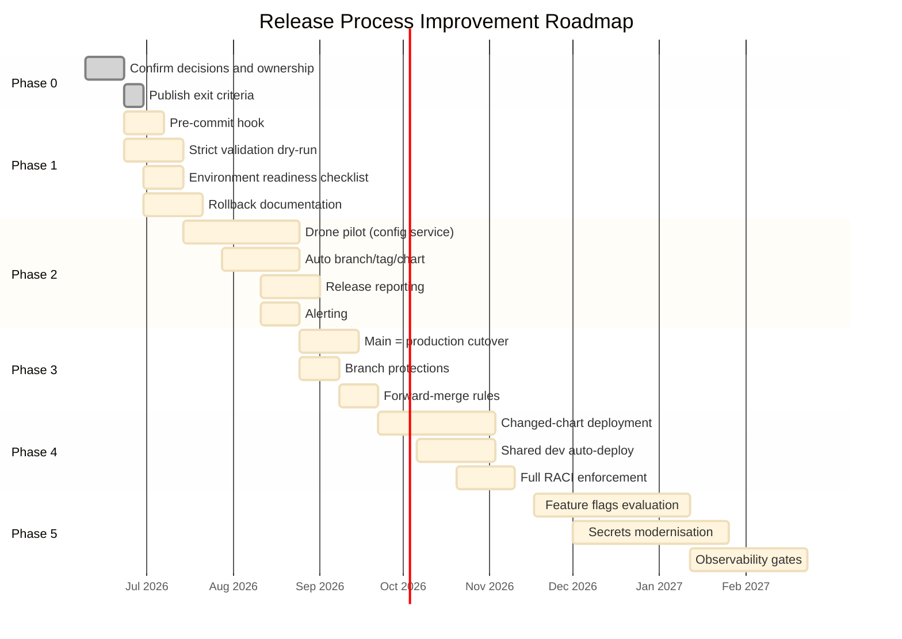

# Phased Improvement Roadmap

| Field | Value |
| --- | --- |
| Owner | Benan Aktas |
| Status | In Review |
| Created | 2026-06-09 |
| Labels | improvement-notes, roadmap, raci, cerberus, release-engineering |

---

## Summary

This page contains the detailed phased roadmap, Gantt-style timeline, RACI matrix, prioritisation matrix and go/no-go criteria for the Cerberus release process improvement programme.

---

## Possible Phased Improvement Path

The timing below is indicative only. It should not be read as a committed delivery plan.

| Phase | Timeframe | Focus | Key Deliverables |
|-------|-----------|-------|------------------|
| 0 | Week 1–2 | Decisions and ownership | Confirm rollout decisions; assign named owners; publish exit criteria. |
| 1 | Month 1 | Quick wins | Pre-commit hook; strict validation dry-run; environment readiness checklist; rollback documentation. |
| 2 | Month 2–3 | Release automation | Drone pilot green; auto branch/tag/chart; release reporting; alerting. |
| 3 | Month 3–4 | Branch cutover | `main = production` cutover; branch protections; forward-merge rules active. |
| 4 | Month 4–6 | Scale and harden | Changed-chart deployment; shared dev auto-deploy; rerun safety; full RACI enforcement. |
| 5 | Month 6–12 | Modernise | Runtime feature flags; External Secrets Operator; SBOM generation; observability gates evaluation. |

---

## Roadmap Gantt Diagram

---

## RACI Matrix

| Activity | Dev/Squad | Tech Lead | Architect | Platform/DevOps | Release Owner | QAT | Incident Lead |
|----------|-----------|-----------|-----------|-----------------|---------------|-----|---------------|
| Feature development | R | A | C | I | I | I | I |
| Merge to release branch | R | A | I | I | I | I | I |
| Release branch creation | I | I | I | R | A | I | I |
| Tag and artefact build | I | I | I | R | A | I | I |
| Manifest validation | I | C | C | R | A | I | I |
| Deploy to lower envs | R | A | I | C | I | I | I |
| Deploy to SIT+ | I | C | I | R | A | C | I |
| Functional validation | C | I | I | I | I | R/A | I |
| Production release | I | C | C | C | A | R | I |
| Hotfix decision | R | C | C | R | A | I | C |
| Rollback decision | I | C | C | R | A | I | R |
| Post-release reconciliation | I | I | I | R | A | I | I |

R = Responsible, A = Accountable, C = Consulted, I = Informed. Named individuals TBC.

---

## Prioritisation Matrix

| Improvement | Impact | Effort | Risk | Priority |
|-------------|--------|--------|------|----------|
| Strict tag/manifest validation | High | Low | Low | P1 — Immediate |
| Named ownership (RACI) | High | Low | Low | P1 — Immediate |
| Rollback documentation and testing | High | Medium | Medium | P1 — Before production incident |
| Drone release automation pilot | High | Medium | Medium | P1 — Current pilot |
| Environment readiness gate | High | Low | Low | P1 — Before new env rollout |
| Release reporting dashboard | High | Medium | Medium | P2 — After pilot green |
| Changed-chart deployment | High | Medium | Medium | P2 — After detection validated |
| Alerting for failed automation | Medium | Low | Low | P2 — Before production |
| Branch cutover (main = production) | Medium | Medium | Medium | P2 — After Phase 2 green |
| External Secrets Operator | Medium | Medium | Medium | P3 — Medium-term |
| Runtime feature flags | Medium | High | Medium | P3 — After automation stable |
| GitOps / ArgoCD | Medium | High | High | P4 — Future evaluation |
| Trunk-based development | Medium | High | High | P4 — Defer until flags mature |

---

## Go / No-Go Criteria

### Go For Automation Rollout

- Drone pilot succeeds for the configuration service.
- Generated tags, versions, chart changes and release report match expectations.
- Rerun is tested and safe.
- Failure alerting is defined.
- Manual chart edits are exception-only and audited.
- Release owner and backup are named.

### No-Go For Automation Rollout

- Scripts only work locally.
- Pipeline failure can be silent.
- Rerun can create duplicate or conflicting state.
- Release report does not match actual chart/manifest state.
- Drone secrets/tokens are not owned.

### Go For Branch Cutover

- Confirmed production state is known.
- `main` branch protection is ready.
- Automation targets the correct branch.
- Open work on `development` is inventoried.
- Hotfix and rollback reconciliation are confirmed.
- Strict validation has passed at least the pilot.

### No-Go For Branch Cutover

- Production state cannot be tied to branch/tag/manifest.
- Drone pilot is not green.
- `development` contains unknown open work.
- Rollback reconciliation is unclear.
- Forward-merge ownership is missing.

---

## Related Pages

- [Improvement Path And Maturity Observations — Parent](07-transformation-programme.md)
- [Maturity Scorecard And Metrics](07.1-maturity-scorecard-and-metrics.md)
- [Risk Register And Root Cause Analysis](07.2-risk-register-and-root-cause-analysis.md)
- [Rollout Decision Proposals](04-rollout-decision-proposals.md)

---

Feedback or questions? Contact the page owner or comment below.
