# Future Platform Topics - Detailed Reference

| Field | Value |
| --- | --- |
| Owner | Benan Aktas |
| Status | In Review |
| Created | 2026-06-09 |
| Last updated | 2026-06-09 |
| Labels | future-topics, platform-engineering, knowledge-graph, cerberus, release-engineering |

This page keeps the longer future-platform reference material that came out of the Confluence page set.

Important: this is not part of the current Phase 0-4 release-process improvement scope. The immediate priority remains release operating model maturity: visible release state, strict validation, named ownership, Drone automation, rollback readiness, environment readiness and audit evidence.

---

## Summary

After the release foundation is proven, the team may separately review platform-level capabilities such as environment promotion standardisation, observability-linked release reporting, GitOps readiness, read-only release visibility, knowledge graph / release intelligence and possible workflow consolidation.

These topics should not be treated as committed delivery scope or prerequisites for the current release-process work. They are retained here so the technical thinking is not lost, while keeping the immediate proposal focused.

---

## Environment Promotion Model

| Environment | Trigger | Gate | Approver |
| --- | --- | --- | --- |
| Squad dev/test | Developer push or manual trigger | Pipeline green | None / self-service |
| Shared dev | Merge to release branch | Pipeline green + chart update complete | Automated or release owner oversight |
| SIT | Release owner decision | Release report generated + changed charts identified | Release owner |
| Pre-prod / B.Val | QAT progression | SIT functional validation complete | QAT lead |
| Production | Release approval | QAT approved + rollback plan + final release report | Release owner + QAT |

Possible rules to review later:

- The same immutable artefact should move through environments.
- Environment-specific values, secrets and feature flags should be the only environment differences.
- Production promotion should not skip pre-prod except through an explicit emergency path.
- Every promotion should have a durable audit trail: who, when, version, gate, pipeline link and release record.

---

## Deployment Strategy Options

| Strategy | Rollback Speed | Infrastructure Cost | Complexity | Best For |
| --- | --- | --- | --- | --- |
| Rolling update | Minutes, usually manual | 1x | Low | Simple services, low-risk paths |
| Blue-green | Fast traffic switch | 2x during deployment | Medium | Stateless critical services |
| Canary / progressive delivery | Gradual traffic exposure | Variable | High | Services with strong telemetry and SLOs |

Current working view:

- Rolling update remains the current practical baseline.
- Blue-green can be evaluated later for selected critical services.
- Progressive delivery should be deferred until telemetry, ownership and rollback maturity are strong enough.

---

## Observability-Linked Release Validation

Today, deployment validation appears to rely mainly on deployment completion, pod startup and existing health checks. A future maturity step could link release records to observability signals.

| Metric | What It Measures | Example Threshold |
| --- | --- | --- |
| Error rate | Service errors after deploy | Less than agreed service threshold |
| Latency P95/P99 | User-facing performance change | Not worse than agreed baseline |
| Success rate | Request completion | Within SLO |
| Pod restarts | Post-deploy stability | No unexpected restart pattern |
| SLO burn rate | SLO budget consumption | No abnormal burn during bake period |
| Business signal | Domain-specific health | No release-correlated anomaly |

Possible adoption path:

1. Document key dashboards and metrics per service.
2. Add release-report links to relevant dashboards.
3. Add alert-only checks after deploy.
4. Consider pipeline gates only after metrics and ownership are proven.

---

## GitOps Readiness

GitOps / ArgoCD is not part of the current release-process rollout. It may be useful later, but production adoption would need a separate review.

| Readiness Area | Question To Answer |
| --- | --- |
| Source of truth | Is deployment-management truly the desired-state source? |
| Drift handling | How is cluster drift detected and reconciled? |
| Secrets | Are secrets handled without plain values in Git? |
| RBAC | Does access align with release ownership and separation of duties? |
| Audit | Are syncs, overrides and rollbacks traceable? |
| Recovery | Is Git revert a valid rollback path for the service type? |

Suggested sequence:

1. Treat deployment-management as the desired-state record.
2. Eliminate manual cluster changes where possible.
3. Evaluate ArgoCD/Flux in non-production only.
4. Review RBAC, audit, drift and rollback implications.
5. Consider production adoption only after a separate architecture and operations review.

---

## Unified Release Visibility Concept

A future platform could provide a read-only operational view over existing systems:

- Git branches, commits and tags.
- Drone builds and release automation runs.
- Helm packages and chart changes.
- Deployment-management manifests.
- Jira tickets, labels and release metadata.
- Kubernetes environment state.
- Release reports and approval evidence.
- Incident and rollback records.

The safest starting point would be read-only visibility. Any workflow, trigger or deployment-control capability would need separate review because it could create separation-of-duties and approval-bypass risks.

---

## Knowledge Graph / Release Intelligence

### What It Is

A knowledge graph could model relationships between releases, services, commits, tags, images, charts, environments, deployments, approvals, incidents and configuration changes.

It would not replace Git, Drone, Jira, Kubernetes, Helm or deployment-management. It would read metadata from those systems and help answer cross-system questions faster.

### Example Relationship Model

| Entity | Related Entities |
| --- | --- |
| Release | Jira tickets, tags, service versions, approvals, reports |
| Service version | Commit, image, Helm chart, deployment |
| Deployment | Environment, manifest, health signal |
| Incident | Release, service version, rollback/fix-forward action |
| Configuration change | Service, environment, release, rollback eligibility |

### Example Questions

| Question | Current Pain | Possible Future Value |
| --- | --- | --- |
| What was in release 5.14? | Manual correlation across Git, Jira and manifests. | One relationship query. |
| What changed before this incident? | Manual timeline reconstruction. | Release-to-deployment-to-health traversal. |
| Which services used this image/chart version? | Search across repos and environments. | Impact query. |
| Can this release be rolled back? | Manual DB/config/runbook review. | Rollback constraints visible in one view. |
| Who approved this deployment? | Search Jira, release notes and pipeline evidence. | Approval evidence linked to release record. |

### Key Principles

- Read-model only; no source system is replaced.
- No secrets or sensitive values stored.
- Every fact should link back to its source.
- Freshness and confidence should be visible.
- Incomplete metadata should be shown as incomplete, not presented as certainty.

---

## Platform Product Framing

If any future platform capability proceeds, it should be treated as an internal platform product rather than a one-off dashboard.

| Area | Needed Before Build |
| --- | --- |
| Product ownership | Named product/platform owner |
| Source ownership | Data owner for each source system |
| Support model | Support rota, SLA and escalation path |
| Security | Classification, RBAC and audit model |
| Operations | Monitoring, freshness checks, incident process |
| Delivery | Backlog, roadmap and adoption plan |
| Governance | Separate architecture/security review for write or trigger capability |

Without ownership, support and adoption planning, a future platform risks becoming another untrusted dashboard.

---

## Risks

| Risk | Impact | Mitigation |
| --- | --- | --- |
| Future platform scope distracts from release foundations | Current rollout becomes too large and slow. | Keep current scope limited to validation, ownership, automation and rollback. |
| Metadata quality is poor | Graph/dashboard gives false confidence. | Do not start until release metadata quality is measured and improved. |
| Read-only view becomes a control plane too early | Approval or separation-of-duties bypass. | Keep read-only first; review write/trigger capability separately. |
| Teams do not adopt the platform | Investment is wasted. | Start with incident investigation and audit use cases. |
| Sensitive metadata is exposed | Security or compliance risk. | Apply classification, RBAC and audit from the start. |
| Cost grows before value is proven | Platform becomes hard to justify. | Use phased evaluation and explicit success criteria. |

---

## Roadmap Positioning

| Phase | Capability | Status |
| --- | --- | --- |
| Phase 0-4 | Release-process foundation | Current focus |
| Phase 5+ | Observability-linked release reporting | Future evaluation |
| Phase 5+ | Read-only release visibility dashboard | Future evaluation |
| Phase 6+ | Knowledge graph / release intelligence proof of concept | Future evaluation |
| Phase 6+ | Non-production GitOps evaluation | Future evaluation |
| Future | Workflow/control-plane capability | Separate review required |

---

## Guardrails

- Keep these topics out of the current rollout decision set.
- Do not introduce production GitOps, progressive delivery, automatic rollback or central trigger control without separate architecture, security and operational review.
- Do not use future platform ideas to delay near-term fixes to validation, ownership, rollback and release reporting.
- Prefer read-only visibility before any write, trigger or workflow capability.

---

## References

- Immediate priorities: see 07 - Improvement Path And Maturity Observations.
- Current automation proposal: see 03 - Proposed Release Automation Flow.
- Source architecture detail, if needed later: [Future Platform Topics](08-platform-and-knowledge-graph.md), [Future Platform Topics](08-platform-and-knowledge-graph.md), [Future Platform Topics](08-platform-and-knowledge-graph.md).

---

Feedback or questions? Contact the page owner or comment below.

---

## Related Pages

- [Main Assessment And Reading Order](00-parent-release-engineering-assessment.md)
- [Proposed Release Automation Flow](03-proposed-release-automation-flow.md)
- [Improvement Path And Maturity Observations](07-transformation-programme.md)
- [Page Coverage Index](09-page-coverage-index.md)

---

## Detailed Supporting Material

This section keeps the detailed supporting content for readers who need more than the summary above.

### Platform Engineering Strategy

This page covers the platform-level capabilities that directly strengthen the release-management proposal: environment promotion, deployment strategy and observability gates.

### 1. Environment Promotion Model

#### Current State

The current promotion path is understood but not formally documented as a model:

```text
Squad dev/test → Shared dev → SIT → B.Val / Pre-prod → Production
```

Promotion today is largely manual: a person triggers deployment to the next environment after the previous one passes some form of validation.

#### Possible Promotion Model

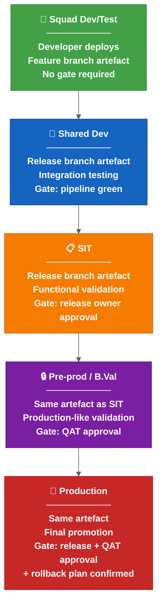

**Colour key:** Green = squad dev/test · Blue = shared dev · Orange = SIT · Purple = pre-prod / B.Val · Red = production.

#### Promotion Rules

| Rule | Description |
| --- | --- |
| Immutable artefact | The same container image and Helm package moves through all environments. Never rebuild for a higher environment. |
| Environment-specific config only | Values files, secrets and feature flags are the only things that change between environments. |
| Gate before promotion | Each promotion requires a defined gate to pass. No silent auto-promote to production. |
| Audit trail | Every promotion records: who, when, which version, which gate passed, link to pipeline. |
| No skipping | Cannot promote to production without passing through pre-prod. Exception: confirmed emergency hotfix with explicit release-owner sign-off. |

#### Promotion Gate Matrix

| Environment | Trigger | Gate | Approver |
| --- | --- | --- | --- |
| Squad dev/test | Developer push/trigger | Pipeline green | None (self-service) |
| Shared dev | Merge to release branch | Pipeline green + chart update complete | Automated |
| SIT | Release owner decision | Release report generated + changed charts identified | Release owner |
| Pre-prod / B.Val | QAT progression | SIT functional validation complete | QAT lead |
| Production | Release approval | QAT approved + rollback plan + release report final | Release owner + QAT |

---

### 2. Deployment Strategy

#### Current State

The current deployment approach appears to be a standard Kubernetes **rolling update**: pods are replaced in sequence, health checks confirm readiness, and Helm manages the upgrade.

This works but has limitations:
- If health checks pass but functional issues exist, the full rollout completes before the problem is detected.
- Rollback requires manual `helm rollback` or redeployment.
- There is no traffic-based validation before full rollout.

#### Deployment Strategy Options

```mermaid
%%{init: {'theme': 'base', 'themeVariables': {'lineColor': '#5f6368'}}}%%

flowchart TD
  subgraph CURRENT["Current: Rolling Update"]
    R1["Replace pods sequentially"]:::current
    R2["Health check gates"]:::current
    R3["Full rollout or manual rollback"]:::current
    R1 --> R2 --> R3
  end

  subgraph NEXT["Near-term: Blue-Green"]
    B1["Deploy new version alongside old"]:::next
    B2["Validate new version (no traffic)"]:::next
    B3["Switch traffic atomically"]:::next
    B4["Instant rollback: switch back"]:::next
    B1 --> B2 --> B3 --> B4
  end

  classDef current fill:#455a64,stroke:#37474f,color:#fff,font-weight:bold
  classDef next fill:#1565c0,stroke:#0d47a1,color:#fff,font-weight:bold
```

**Colour key:** Grey = current rolling-update model · Blue = near-term blue-green option.

#### Strategy Comparison

| Strategy | Rollback Speed | Infrastructure Cost | Complexity | Best For |
| --- | --- | --- | --- | --- |
| Rolling update | Minutes (manual) | 1x | Low | Simple services, low traffic |
| Blue-green | Instant (traffic switch) | 2x during deploy | Medium | Stateless services, critical path |

#### Possible Adoption Path

```text
Phase 1 (Now): Rolling update with documented manual rollback procedure.
Phase 2 (After automation stable): Blue-green for critical services (API gateway, core services).
```

---

### 3. Observability Gates

#### Current State

The current process checks:
- Pods started (health check).
- Deployment completed (Helm reports success).
- Basic monitoring may exist but is not integrated into the release pipeline.

There is no automated observability gate that validates release health against SLOs before or after promotion.

#### Possible Target: Observability-Driven Release Validation

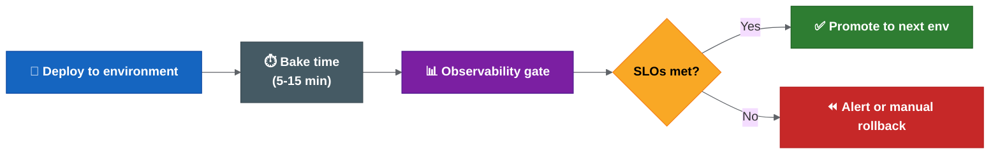

**Colour key:** Blue = deploy step · Grey = bake/wait period · Purple = observability gate · Yellow = SLO decision · Green = promote · Red = alert/manual rollback.

#### Observability Gate Metrics

| Metric | What It Measures | Threshold Example | Source |
| --- | --- | --- | --- |
| Error rate (5xx) | Service returning errors | < 0.1% over bake period | Prometheus / OpenTelemetry |
| Latency P99 | Slowest requests | < 500ms (or < 2x baseline) | Prometheus / Datadog |
| Success rate | Requests completing successfully | > 99.9% | Application metrics |
| Pod restarts | Stability after deploy | 0 restarts in bake period | Kubernetes metrics |
| SLO burn rate | Rate of SLO budget consumption | < 1x normal burn | SLO platform |
| Business metric | Domain-specific health | No anomaly detected | Custom metrics |

#### Implementation Options

| Approach | How It Works | Complexity |
| --- | --- | --- |
| Manual observability check | Human checks dashboards after deploy | Low (current state) |
| Pipeline metric query | Drone step queries Prometheus after deploy, fails if threshold breached | Medium |
| Keptn / Dynatrace | Full SLO-based quality gate evaluation | High |

#### Possible Adoption Path

```text
Phase 1 (Now): Document key metrics and dashboards per service. Establish SLO targets.
Phase 2 (After Drone automation): Add a pipeline step that queries error rate and latency after deploy. Alert on breach.
```

#### OpenTelemetry Integration

For services instrumented with OpenTelemetry:

```text
Traces → identify slow spans and error sources after deploy.
Metrics → feed observability gates (error rate, latency, throughput).
Logs → correlate errors with specific release version/commit.
```

The release report should include a link to the observability dashboard filtered by the deployed version, so reviewers can see the health state at a glance.

---

### Related Pages

- [Release Engineering Best Practices](07-transformation-programme.md)
- [Automation And Validation](03-proposed-release-automation-flow.md)
- [Improvement Notes And Maturity Observations](07-transformation-programme.md)

### Platform Engineering Strategy — Advanced

> **This section is not a blocker for the initial release automation rollout.** All items below are medium-term or long-term improvements.

See [platform engineering strategy](08-platform-and-knowledge-graph.md) for environment promotion, deployment strategies and observability gates.

### 4. GitOps Readiness

#### Current State

The current model is partially GitOps-aligned:
- Cerberus deployment-management repo holds chart versions and deployment state (Git as source of truth).
- Changes are applied via Drone pipelines (push-based).
- Deployment is triggered by manual promotion or pipeline step.

This is **push-based CI/CD**, not full GitOps. The key difference:

| Aspect | Push-Based (Current) | Pull-Based (GitOps) |
| --- | --- | --- |
| Who applies changes | Pipeline pushes to cluster | Controller in cluster pulls from Git |
| Drift detection | None (cluster may drift from Git) | Continuous (controller reconciles) |
| Rollback | Manual Helm rollback | Revert Git commit → controller syncs |
| Audit trail | Pipeline logs | Git history (complete, immutable) |
| Secret handling | Injected at deploy time | Sealed Secrets or External Secrets Operator |

#### GitOps Target Architecture

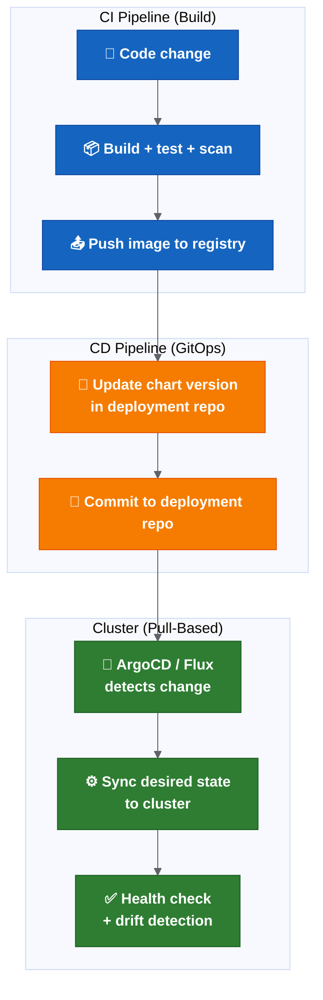

**Colour key:** Blue = CI build pipeline · Orange = deployment-repo update · Green = GitOps cluster reconciliation.

#### ArgoCD vs Flux Comparison

| Feature | ArgoCD | Flux |
| --- | --- | --- |
| UI | Rich web UI with app visualisation | Minimal (CLI + Grafana dashboards) |
| Multi-tenancy | Application projects with RBAC | Namespace-based tenancy |
| Helm support | Native (renders in-cluster) | Native (HelmRelease CRD) |
| Rollback | One-click in UI or CLI | Git revert → auto-sync |
| Notifications | Built-in (Slack, webhook, etc.) | Notification controller (separate) |
| Progressive delivery | Via Argo Rollouts (same ecosystem) | Via Flagger |
| Learning curve | Medium | Medium |
| Ecosystem fit | Better if also using Argo Workflows / Rollouts | Better if purely Git-centric |

#### Possible GitOps Adoption Path

```text
Phase 1 (Now): Treat the deployment-management repo as the GitOps source of truth.
              No manual changes to cluster state. All changes via Git.
              This is achievable without installing ArgoCD.

Phase 2 (Medium-term): Install ArgoCD in non-prod.
                        Configure it to sync from the deployment-management repo.
                        Validate drift detection and auto-sync behaviour.
                        Keep Drone for CI (build + test + push image).
                        Let ArgoCD handle CD (sync chart versions to cluster).

Phase 3 (Long-term): ArgoCD in production.
                      Remove Drone deployment steps (Drone only builds).
                      Add Argo Rollouts for progressive delivery.
                      Full GitOps: rollback = git revert.
```

#### Prerequisites Before GitOps Adoption

- Deployment-management repo would need to be the single source of truth, with no manual kubectl/helm overrides.
- Secrets would need to be handled without putting plain values in Git, for example Sealed Secrets or External Secrets Operator.
- Branch protection on deployment-management repo would need to prevent unauthorized changes.
- ArgoCD RBAC would need to align with release ownership model.
- Monitoring would need to detect sync failures and drift.

---

### 5. SBOM And Supply Chain Security

#### Current State

Current security posture:
- Trivy vulnerability scanning runs during artefact creation.
- Sonar code quality scanning runs.
- No SBOM generation observed.
- No artefact signing observed.
- No provenance attestation observed.

#### Why Supply Chain Security Matters

```text
A release is only trustworthy if you can prove:
1. What source code produced it (provenance).
2. What dependencies are inside it (SBOM).
3. That it was not tampered with after build (signing).
4. That known vulnerabilities were assessed (scanning).
```

The current process covers (4) but not (1), (2) or (3).

#### SLSA Framework Levels

SLSA (Supply-chain Levels for Software Artifacts) defines maturity levels:

| Level | Requirement | Current State |
| --- | --- | --- |
| SLSA 1 | Build process exists and produces provenance | Partial (Drone builds, no provenance doc) |
| SLSA 2 | Build service is hosted (not local), provenance is signed | Partial (Drone is hosted, no signing) |
| SLSA 3 | Build platform is hardened, provenance is non-forgeable | Not met |
| SLSA 4 | Two-party review, hermetic builds | Not met |

#### Possible Supply Chain Controls


**Colour key:** Blue = build step · Purple = supply-chain security controls · Green = deployment-time verification.

#### Tool Options

| Capability | Tool Options | Integration Point |
| --- | --- | --- |
| SBOM generation | Syft, Trivy, Docker Scout | Build pipeline (after image build) |
| Vulnerability scan | Trivy (already in use), Grype | Build pipeline + periodic rescan |
| Image signing | Cosign (Sigstore), Notation (OCI) | Build pipeline (after push to registry) |
| Signature verification | Cosign verify, Kyverno admission policy | Deployment time (admission controller) |
| Provenance attestation | SLSA GitHub/GitLab generators, in-toto | Build pipeline (metadata generation) |
| Dependency pinning | Renovate (already mentioned), Dependabot | Ongoing (MR-based updates) |

#### Possible Adoption Path

```text
Phase 1 (Quick win): Generate SBOM with Trivy during existing scan step. Store as pipeline artefact.
                      Cost: minimal (Trivy already runs, add --format spdx-json flag).

Phase 2 (Medium-term): Sign container images with Cosign after push to registry.
                        Store signatures in the same registry (OCI artefact).
                        Add Cosign verify step before deployment.

Phase 3 (Long-term): Add Kyverno or OPA Gatekeeper admission policy that rejects unsigned images.
                      Generate SLSA provenance attestation.
                      Periodic SBOM rescan for newly discovered CVEs in deployed images.
```

#### Quick Win: SBOM Generation

Adding SBOM generation to the existing pipeline requires one additional command:

```bash
## After image build and before push
trivy image --format spdx-json --output sbom.spdx.json myregistry/myservice:${TAG}
```

This produces a machine-readable inventory of every dependency in the image. It can be stored alongside the release report and used for:
- Post-release CVE triage (which services are affected by a new CVE?).
- Compliance and audit (what open-source licences are in production?).
- Incident response (does our production contain Log4Shell?).

---

### Maturity Roadmap Summary


**Colour key:** Green = now / foundation work · Blue = next maturity step · Purple = future option.

### 6. Unified Deployment Control Plane (Long-Term)

This is a long-term platform capability. It sits after release automation, validation, ownership, environment readiness and rollback maturity are stable.

A unified deployment and release control plane could become the single operational interface for releases — one place to view environment state, validate readiness, approve promotions, trigger deployments, track audit trails and support rollback decisions.

It should start read-only (dashboarding existing state) and later integrate with approval workflow, deployment triggers, rollback assistant, metrics and GitOps/progressive delivery if those are adopted.

Maturity sequence:

```text
Release automation
  → Release state visibility
  → Validation dashboard
  → Approval workflow
  → Controlled deployment trigger
  → Rollback assistant
  → GitOps / progressive delivery integration
```

This is a future option that would need separate platform strategy review. It is not part of the initial rollout. For the short scoped note, see [Possible Future Topics - Not In Current Scope](07-transformation-programme.md).

### Related Pages

- [Platform Engineering Strategy](08-platform-and-knowledge-graph.md)
- [Deployment Knowledge Graph — Operations And Technology](08-platform-and-knowledge-graph.md)
- [Advanced Architecture Sections](08-platform-and-knowledge-graph.md)
- [Summary Assessment And Open Risks](08-platform-and-knowledge-graph.md)

### Advanced Architecture Sections

> **Status:** Long-term future-state architecture. Not part of the initial release automation rollout (Phases 0–4). These sections describe capabilities for Phase 5+ evaluation only.

---

### Cerberus Current Architecture Mapping

This section explains how the proposed control plane and knowledge graph relate to the existing Cerberus ecosystem. The Knowledge Graph does not replace these systems. It correlates their metadata and exposes relationship intelligence across the estate.

#### Component Mapping

| Current Component | Current Role | Knowledge Graph / Control Plane Relationship |
| --- | --- | --- |
| GitLab | Source code, branches, tags, merge requests | Source of commit, tag and branch events. Graph ingests metadata (not code). |
| Jira | Work items, release labels, ticket status, approvals | Source of release scope, ticket metadata and approval records. |
| Drone CI/CD | Build, test, scan, deploy automation | Source of pipeline execution events, build artefact metadata. |
| Helm | Chart packaging, templating, deployment mechanism | Source of chart version and deployment execution metadata. |
| Cerberus deployment-management | Release intent, manifests, chart versions | Source of deployment intent and manifest state (canonical deployment truth). |
| Kubernetes | Runtime state, pods, deployments, namespaces | Source of actual deployed state and health signals. |
| Elasticsearch / OpenSearch | Log aggregation, search, operational data | Source of log-based health and error signals. |
| FDP internal processing | Data processing, rules evaluation | Source of processing completion events and data pipeline state. |
| Kafka | Event streaming, message bus | Ingestion transport layer — carries events from sources to graph. |
| Athena / analytical querying | Ad hoc analytical queries on data lake | Potential consumer of graph-derived metrics and audit data. |
| Liquibase | Database schema migrations | Source of migration execution events and rollback block metadata. |
| Secrets (Git-crypt / Drone) | Secret management and injection | Source of secret change metadata (never values). |
| Observability tools | Monitoring, alerting, SLO tracking | Source of health signals and post-deployment validation data. |
| Runbooks | Operational procedures | Source of operational context links (referenced, not ingested in full). |

#### Architecture Relationship Diagram

```mermaid
%%{init: {'theme': 'base', 'themeVariables': {'lineColor': '#5f6368'}}}%%

flowchart TD
  subgraph SOURCES["Existing Cerberus Systems (Sources of Truth)"]
    GL["GitLab"]:::source
    JR["Jira"]:::source
    DR["Drone CI/CD"]:::source
    HM["Helm"]:::source
    DM["Deployment\nManagement"]:::source
    K8["Kubernetes"]:::source
    KF["Kafka"]:::source
    EL["Elastic /\nOpenSearch"]:::source
    FDP["FDP"]:::source
    LQ["Liquibase"]:::source
    SEC["Secrets"]:::source
    OBS["Observability"]:::source
  end

  subgraph INTELLIGENCE["Future Intelligence Layer"]
    KG["Knowledge Graph\n(relationship intelligence)"]:::graph
    CP["Unified Control Plane\n(operational interface)"]:::platform
    API["GraphQL / REST APIs"]:::api
  end

  subgraph CONSUMERS["Consumers"]
    DASH["Release Dashboard"]:::consumer
    INC["Incident Investigation"]:::consumer
    AUDIT["Audit / Compliance"]:::consumer
  end

  GL & JR & DR & HM & DM & K8 --> KF
  KF --> KG
  EL & FDP & LQ & SEC & OBS --> KG
  KG --> API
  API --> CP
  CP --> DASH & INC & AUDIT

  classDef source fill:#1565c0,stroke:#0d47a1,color:#fff,font-weight:bold
  classDef graph fill:#00695c,stroke:#004d40,color:#fff,font-weight:bold
  classDef platform fill:#6a1b9a,stroke:#4a148c,color:#fff,font-weight:bold
  classDef api fill:#f57c00,stroke:#e65100,color:#fff,font-weight:bold
  classDef consumer fill:#2e7d32,stroke:#1b5e20,color:#fff,font-weight:bold
```

**Colour key:** Blue = existing source systems · Teal = Knowledge Graph read-model · Purple = control-plane/interface layer · Orange = API layer · Green = consuming dashboards and operational views.

#### Key Principle

> The Knowledge Graph is a read-model. It does not write back to source systems. It does not replace any existing tool. Its value is in connecting data that already exists but is currently siloed.

---

### Event-Driven Knowledge Graph Ingestion Model

The graph should be populated through a mixture of ingestion patterns:

- **Webhooks** — real-time events from GitLab, Jira, Drone
- **Pipeline-emitted events** — custom Drone steps publishing structured events
- **Kubernetes watch events** — deployment and pod state changes
- **Scheduled reconciliation jobs** — periodic full-state comparison against sources
- **Backfill jobs** — historical data import for initial population
- **Manual operational events** — rollback decisions, override approvals, manual deployments

#### Ingestion Flow

```text
Source system event
  → Event gateway
  → Kafka topic
  → Validation and enrichment
  → Entity resolver
  → Graph update
  → Search index update
  → Audit event stored
```

#### Ingestion Architecture

```mermaid
%%{init: {'theme': 'base', 'themeVariables': {'lineColor': '#5f6368'}}}%%

flowchart LR
  SRC["Source Systems\nGitLab / Jira / Drone\nK8s / Helm / FDP"]:::source
  GW["Event Gateway"]:::gateway
  KAFKA["Kafka Topics"]:::kafka
  VAL["Validation +\nEnrichment"]:::process
  RES["Entity Resolver"]:::process
  GRAPH["Knowledge Graph"]:::graph
  SEARCH["Search Index"]:::search
  AUDIT["Immutable\nAudit Store"]:::audit
  API["GraphQL /\nREST APIs"]:::api
  UI["Control Plane /\nDashboard"]:::ui

  SRC --> GW --> KAFKA --> VAL --> RES --> GRAPH
  RES --> SEARCH
  RES --> AUDIT
  GRAPH --> API --> UI
  SEARCH --> API

  classDef source fill:#1565c0,stroke:#0d47a1,color:#fff,font-weight:bold
  classDef gateway fill:#455a64,stroke:#37474f,color:#fff,font-weight:bold
  classDef kafka fill:#f57c00,stroke:#e65100,color:#fff,font-weight:bold
  classDef process fill:#7b1fa2,stroke:#4a148c,color:#fff,font-weight:bold
  classDef graph fill:#00695c,stroke:#004d40,color:#fff,font-weight:bold
  classDef search fill:#c62828,stroke:#b71c1c,color:#fff,font-weight:bold
  classDef audit fill:#455a64,stroke:#37474f,color:#fff,font-weight:bold
  classDef api fill:#f57c00,stroke:#e65100,color:#fff,font-weight:bold
  classDef ui fill:#2e7d32,stroke:#1b5e20,color:#fff,font-weight:bold
```

**Colour key:** Blue = source systems · Grey = gateway/audit plumbing · Orange = event/API transport · Purple = validation and entity resolution · Teal = Knowledge Graph · Red = search index · Green = dashboard/control-plane UI.

#### Event Types

| Event Type | Source | Example Payload | Graph Update |
| --- | --- | --- | --- |
| `commit.pushed` | GitLab webhook | Commit SHA, message, author, branch, ticket refs | Create/update Commit node, link to Repository and JiraTicket |
| `tag.created` | GitLab webhook | Tag name, commit SHA, branch | Create ServiceVersion node, link to Commit |
| `image.published` | Image registry webhook | Image name, tag, digest, built-at | Create Image node, link to ServiceVersion |
| `chart.published` | Helm registry event | Chart name, version, app version | Create HelmChart node, link to ServiceVersion |
| `manifest.updated` | deployment-management webhook | Chart versions changed, target environment | Update deployment intent, link chart versions to Release |
| `deployment.started` | Drone / K8s event | Service, version, environment, job ID | Create Deployment node (status: in-progress) |
| `deployment.succeeded` | K8s watch / Drone | Service, version, environment, pod status | Update Deployment status to succeeded |
| `deployment.failed` | K8s watch / Drone | Service, version, environment, error | Update Deployment status to failed, create alert |
| `ticket.updated` | Jira webhook | Ticket key, status, release label, GitLab tag field | Create/update JiraTicket node, link to Release |
| `approval.recorded` | Jira / workflow webhook | Approver, type, timestamp, release | Create Approval node, link to Release and Person |
| `incident.created` | Incident system webhook | Incident ID, severity, affected services | Create Incident node, link to Service and Deployment |
| `rollback.executed` | Drone / manual event | From version, to version, decided-by, environment | Create Rollback node, link Deployments |
| `liquibase.executed` | Pipeline event | Changeset ID, author, filename, rollback block | Create LiquibaseChangeset node, link to Commit |
| `secret.rotated` | Secrets management event | Secret name, environment, rotated-by (no value) | Create SecretChange node (metadata only) |
| `fdp.processing.completed` | FDP event / Kafka | Processing job ID, input/output, status, duration | Create FDPProcessingEvent node, link to Service |

#### Ingestion Quality Principles

| Principle | Description |
| --- | --- |
| **Idempotency** | Processing the same event twice must produce the same graph state. |
| **Replayability** | All raw events are retained in the immutable audit store. The graph can be rebuilt from scratch by replaying the event log. |
| **Ordering** | Events are partitioned by entity key (e.g., service name) to preserve causal ordering within an entity. Cross-entity ordering is eventually consistent. |
| **Deduplication** | Events carry a unique event ID. The entity resolver rejects duplicates. |
| **Schema versioning** | Events carry a schema version field. Processors handle multiple versions during migration. |
| **Event retention** | Raw events retained for minimum 2 years in cold storage. Hot events retained for 90 days. |
| **Failed event handling** | Failed events route to a dead-letter queue. Alerting fires if DLQ depth exceeds threshold. Manual review and resubmission supported. |
| **Dead-letter queues** | Per-topic DLQ with alerting. Operations team reviews and resubmits or discards with audit note. |
| **Reconciliation jobs** | Scheduled weekly per source system. Compares graph state against source, flags discrepancies, auto-corrects where safe. |

---

### Data Freshness And Trust Model

#### Freshness Expectations

| Source | Ingestion Method | Expected Freshness | Trust Level | Reconciliation Method |
| --- | --- | --- | --- | --- |
| GitLab | Webhook | < 60 seconds | High (authoritative for code) | Weekly branch/tag reconciliation |
| Jira | Webhook | < 60 seconds | High (authoritative for work items) | Weekly ticket status sweep |
| Drone | Webhook | < 60 seconds | High (authoritative for builds) | Daily pipeline completion check |
| Kubernetes | Watch API | < 30 seconds | High (authoritative for runtime) | Hourly state snapshot comparison |
| deployment-management | Webhook (Git) | < 5 minutes | High (authoritative for intent) | Daily manifest hash comparison |
| Helm registry | Webhook / poll | < 5 minutes | High (authoritative for charts) | Weekly chart version listing |
| Image registry | Webhook / poll | < 5 minutes | High (authoritative for images) | Weekly image digest listing |
| Liquibase | Pipeline event | On execution only | Medium (may miss manual runs) | Weekly DB schema comparison |
| Secrets metadata | Event / poll | < 15 minutes | Medium (metadata only) | Monthly secret inventory check |
| Observability | Alert webhook / poll | < 5 minutes | Medium (health signals lag) | Continuous (alert-driven) |
| FDP processing | Kafka event | < 5 minutes | Medium | Daily processing log reconciliation |

#### Node And Relationship Metadata

Every graph node and relationship should carry:

| Field | Purpose |
| --- | --- |
| `source_system` | Which system provided this data. |
| `source_identifier` | The ID in the source system (for cross-reference). |
| `source_timestamp` | When the source system recorded the change. |
| `ingestion_timestamp` | When the graph ingested the event. |
| `last_verified_timestamp` | When reconciliation last confirmed this data against the source. |
| `confidence_score` | How confident the graph is in this data (1.0 = recently verified, 0.5 = stale, 0.0 = unverified). |
| `reconciliation_status` | `verified` / `stale` / `conflict` / `unreconciled` |

#### Trust Principle

> A graph answer must be explainable. Users must be able to see where each fact came from, when it was last updated and whether it has been reconciled against the source system.

If a graph answer has low confidence or stale data, the UI must surface this clearly rather than presenting uncertain data as authoritative.

---

### Platform Product Framing

The Knowledge Graph and Control Plane should be treated as an internal platform product, not a one-off tool or project deliverable. Without ownership, support and adoption planning, the platform risks becoming another untrusted dashboard.

#### Product Decisions Required

| Product Area | Decision Needed |
| --- | --- |
| Product owner | Who has product authority over features, priorities and roadmap? |
| Platform engineering owner | Who operates, monitors and maintains the infrastructure? |
| Data ownership | Who is responsible for data accuracy per source system? |
| Support model | How are issues reported and resolved? SLA? |
| Onboarding model | How do new teams/services get added to the graph? |
| Funding model | Is this centrally funded or charged back to consuming teams? |
| Security review | Has the platform passed security architecture review? |
| ARB approval | Has the architecture pattern been approved? |
| Operational support | Who is on-call for graph platform issues? |
| Service catalogue integration | Is the graph registered as a platform service? |
| Adoption metrics | How is usage measured and reported? |

#### Sustainability Principle

> Without ownership, support and adoption planning, the platform risks becoming another untrusted dashboard that is built once and abandoned. Treat it as a product with a backlog, users, metrics and a funded team.

---

### Additional Risks

These risks apply to the Knowledge Graph and future control-plane capabilities:

| Risk | Why It Matters | Mitigation |
| --- | --- | --- |
| Graph becomes stale | Engineers lose trust; stale data is worse than no data. | Automated freshness scoring; reconciliation jobs; confidence indicators in UI. |
| Wrong relationships lead to wrong operational conclusions | Incorrect dependency or ownership links could misdirect incident response. | Reconciliation against source systems; human review for high-confidence relationships; flag unverified links. |
| Graph technology choice is challenged by ARB | Neo4j or selected product may not pass procurement or security review. | Present architecture pattern, not product choice. Validate pattern first; select product later. |
| Source systems have poor metadata quality | Graph quality depends on source quality. Garbage in, garbage out. | Complete metadata standardisation (Phase 0-1 transformation) before starting graph. |
| Teams do not adopt the platform | Investment wasted if engineers continue using existing manual methods. | Demonstrate value via incident response (highest pain); embed in existing workflows; avoid mandating adoption. |
| Security classification prevents broad visibility | Defence sector restrictions may limit who can see deployment topology. | Property-level RBAC; classification-aware query filtering; cleared personnel for admin roles. |
| Event ordering creates inconsistent state | Out-of-order events may create temporary graph inconsistencies. | Partition by entity key; use event timestamps; reconciliation corrects drift. |
| Manual actions are not captured | Decisions made outside automated systems (Slack, meetings) leave gaps. | Provide simple manual event submission; integrate with operational tooling where possible. |
| Cost grows before value is proven | Infrastructure and team costs accumulate during build phases. | Phased delivery with decision gates; Phase 1 time-boxed; clear success criteria before expanding. |

---

### Technology Decision Clarification

> **The decision at this stage is to validate the graph architecture pattern, not to approve a specific graph database product.**

The recommendation is to adopt a graph-based architecture for engineering intelligence. Neo4j is a candidate implementation option, alongside Amazon Neptune, JanusGraph and PostgreSQL-based alternatives (e.g., Apache AGE).

#### ADR Status

| Field | Value |
| --- | --- |
| Decision | Adopt a graph-based architecture pattern for engineering intelligence. |
| Status | **Proposed** |
| Decision type | Architecture direction |
| Technology selection | **Not yet approved** — product evaluation follows pattern validation. |
| Evaluation criteria | Query expressiveness, operational maturity, security model, managed options, cost, team skills. |
| Next step | Validate the architecture pattern through Phase 5 proof of concept before selecting a specific product. |

---

### Updated Roadmap Positioning

These capabilities map to later transformation phases only:

| Phase | Capability | Status |
| --- | --- | --- |
| Phase 5 (Month 6-12) | Read-only release intelligence dashboard feasibility | Future evaluation |
| Phase 5 (Month 6-12) | Event ingestion proof of concept | Future evaluation |
| Phase 6 (12+ months) | Knowledge Graph MVP evaluation | Future evaluation |
| Phase 6 (12+ months) | Graph architecture pattern validation | Future evaluation |
| Phase 6 (12+ months) | Source-system reconciliation model | Future evaluation |
| Phase 7 (Future) | Control Plane integration | Future option |
| Phase 7 (Future) | Rollback assistant | Future option |
| Phase 7 (Future) | Approval visibility | Future option |
| Phase 7 (Future) | Metrics and audit reporting through platform | Future option |

> **None of these items are part of Phase 0–4.** The immediate priority remains release operating model maturity.

---

### Summary Position

The immediate transformation remains release operating model maturity:

- Make release state visible, repeatable, validated, owned and auditable.
- Move release automation into Drone.
- Enforce strict validation.
- Assign named ownership.
- Document and test rollback.
- Cut over to `main = production` only when the above is proven.

The long-term platform vision is a unified deployment intelligence capability:

- The **Knowledge Graph** is the relationship intelligence layer.
- The **Control Plane** is the operational interface layer.

The suggested next step is not to build everything, but to validate the operating model, metadata quality and event sources first. The graph is only valuable if the underlying data is reliable, which is why the immediate release-process foundation should come first.

### Related Pages

- [Improvement Notes And Maturity Observations](07-transformation-programme.md)
- [Deployment Knowledge Graph — Implementation And Workflows](08-platform-and-knowledge-graph.md)
- [Architecture Diagrams](08-platform-and-knowledge-graph.md)
- [Criticality Challenge Notes](08-platform-and-knowledge-graph.md)

### Deployment Knowledge Graph

**Future-State Architecture for Cerberus Release Intelligence**

> **Status:** Long-term architectural proposal. Not part of the initial release automation rollout.
>
> **Relationship to Unified Control Plane:** The Knowledge Graph is a future data and intelligence layer. The related control-plane idea is now only a short note under [Possible Future Topics - Not In Current Scope](07-transformation-programme.md).

This document is split into four parts:
- Part 1: [Design and Domain Model](08-platform-and-knowledge-graph.md) (you are here)
- Part 2: [Implementation and Workflows](08-platform-and-knowledge-graph.md)
- Part 3: [Operations and Technology](08-platform-and-knowledge-graph.md)
- Part 4: [Strategic Value, Business Case and Governance](08-platform-and-knowledge-graph.md)

---

### Summary

The Cerberus release process produces rich operational data spread across Git, Drone, Helm, Kubernetes, Jira, deployment-management, secrets, Liquibase and observability tools. Today, answering a simple question like "what was deployed to production in release 5.14?" requires querying multiple systems manually.

A Deployment Knowledge Graph models the relationships between releases, services, commits, tags, images, charts, environments, deployments, approvals, incidents and configuration changes as a connected graph. It enables instant traversal of these relationships to answer operational, audit and incident questions without requiring humans to correlate data across tools.

This is not a replacement for existing systems. It is a read-model that ingests events from existing sources of truth, builds a connected graph of release and deployment state, and exposes query capabilities for operational, audit and intelligence use cases.

#### Key Differentiator From A Dashboard

A dashboard shows pre-defined views. A knowledge graph answers arbitrary questions about relationships. "Show me all services affected by Jira ticket MMA-1234 across all environments, including which Liquibase migrations ran and which approvals were recorded" is a graph traversal, not a dashboard panel.

---

### 2. Business Value

| Value Area | Description | Beneficiary |
| --- | --- | --- |
| Incident investigation speed | Instantly trace what changed in a failing environment. | Platform, on-call, incident leads |
| Release audit compliance | Prove exactly what was deployed, when, by whom, with what approval. | Compliance, release owners, audit |
| Rollback decision support | Know immediately what rollback targets exist and what constraints apply. | Release owners, incident leads |
| Release scope visibility | See all changes (code, config, secrets, DB) in one connected view. | Release owners, squad leads |
| DORA metrics derivation | Compute deployment frequency, lead time, failure rate, MTTR from graph edges. | Engineering leadership |
| Impact analysis | Before deploying, understand downstream dependencies and blast radius. | Architects, platform team |
| Ownership clarity | Every node has an owner; orphaned services/charts are immediately visible. | Platform governance |
| Environment drift detection | Compare intended state (deployment-management) vs actual state (Kubernetes). | Platform engineers |

---

### 3. Architecture Principles

1. **Read-model, not source of truth.** The graph is derived from existing sources. It never becomes the primary store for any domain.
2. **Event-driven ingestion.** Changes flow into the graph via events. No polling where avoidable.
3. **Eventually consistent.** The graph may lag seconds behind source systems. This is acceptable for operational queries; not for deployment control.
4. **Schema-flexible.** New entity types and relationships can be added without schema migrations.
5. **Query-first design.** The graph schema is shaped by the questions it must answer, not by the source system schemas.
6. **Immutable event history.** Raw ingested events are retained for replay, audit and recomputation.
7. **Least privilege.** The graph does not store raw secrets. It stores metadata about secret changes (what changed, when, by whom) without values.
8. **Incremental build.** Start with a subset of entities and relationships; expand as sources mature.

---

### 4. Domain Model

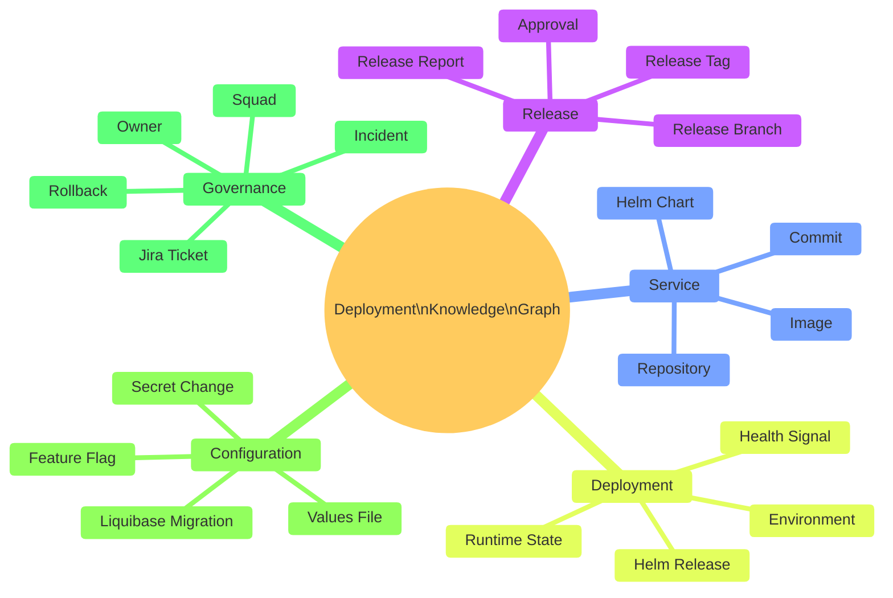

---

### 5. Entity Relationship Model

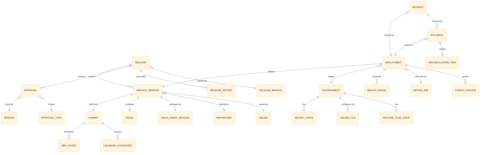

#### Core Entities

| Entity | Description | Source of Truth |
| --- | --- | --- |
| Release | A planned or completed release cycle. | Jira + deployment-management |
| Service Version | A specific tagged version of a service. | Git tag + image registry |
| Commit | A Git commit with ticket reference. | Git |
| Image | A built container image. | Image registry (Artifactory) |
| Helm Chart Version | A packaged Helm chart. | Helm registry |
| Deployment | An act of deploying a version to an environment. | Drone + Kubernetes |
| Environment | A target deployment environment. | Infrastructure/platform config |
| Approval | A recorded approval decision. | Jira / QAT workflow / future control plane |
| Jira Ticket | A work item with release metadata. | Jira |
| Liquibase Changeset | A database migration. | Liquibase changelog in Git |
| Incident | A production or environment issue. | Incident management system |
| Rollback | A decision to revert to a previous deployment. | Audit record |
| Config Change | A change to values, flags or secrets metadata. | Git + secrets management |

---

### 6. Knowledge Graph Design

#### Graph Schema (Property Graph Model)

```text
Nodes:
  (:Release {id, version, status, branch, createdAt})
  (:Service {name, repository, squad, owner})
  (:ServiceVersion {tag, commitSha, imageDigest, helmChartVersion})
  (:Commit {sha, message, author, timestamp, tickets[]})
  (:Image {registry, repository, tag, digest, builtAt, pipelineJob})
  (:HelmChart {name, version, appVersion, umbrella})
  (:Environment {name, cluster, namespace, tier})
  (:Deployment {id, timestamp, status, droneJob, helmRevision})
  (:Approval {type, givenBy, timestamp, evidence})
  (:JiraTicket {key, status, assignee, squad, releaseLabel, gitlabTag})
  (:LiquibaseChangeset {id, author, filename, executedAt, rollbackBlock})
  (:Incident {id, severity, detectedAt, resolvedAt, resolution})
  (:Rollback {id, fromVersion, toVersion, decidedBy, timestamp})
  (:ConfigChange {type, key, environment, changedBy, timestamp})
  (:FeatureFlag {name, environment, enabled, lastChanged})
  (:SecretChange {name, environment, rotatedAt, rotatedBy})
  (:Squad {name, lead, members[]})
  (:Person {name, role, squad})

Relationships:
  (:Release)-[:INCLUDES]->(:ServiceVersion)
  (:Release)-[:HAS_APPROVAL]->(:Approval)
  (:Release)-[:TARGETS]->(:Environment)
  (:ServiceVersion)-[:BUILT_FROM]->(:Commit)
  (:ServiceVersion)-[:PRODUCES]->(:Image)
  (:ServiceVersion)-[:PACKAGED_AS]->(:HelmChart)
  (:ServiceVersion)-[:OWNED_BY]->(:Squad)
  (:Commit)-[:REFERENCES]->(:JiraTicket)
  (:Commit)-[:INCLUDES_MIGRATION]->(:LiquibaseChangeset)
  (:Deployment)-[:DEPLOYS]->(:ServiceVersion)
  (:Deployment)-[:TO]->(:Environment)
  (:Deployment)-[:EXECUTED_BY]->(:DroneJob)
  (:Deployment)-[:APPLIES]->(:ConfigChange)
  (:Deployment)-[:HEALTH_STATUS]->(:HealthSignal)
  (:Incident)-[:CAUSED_BY]->(:Deployment)
  (:Incident)-[:AFFECTED]->(:Service)
  (:Rollback)-[:REVERTS]->(:Deployment)
  (:Rollback)-[:TO_VERSION]->(:ServiceVersion)
  (:Rollback)-[:DECIDED_BY]->(:Person)
```

#### Why A Graph Model

| Question | Relational Approach | Graph Approach |
| --- | --- | --- |
| "What was in release 5.14?" | 5+ JOIN queries across tables | Single traversal: Release → INCLUDES → ServiceVersion |
| "What deployed to production this week?" | Complex temporal JOIN | Traverse: Environment{prod} ← TO ← Deployment{this week} |
| "Which tickets are affected by incident X?" | Multi-hop JOIN through 4+ tables | Incident → CAUSED_BY → Deployment → DEPLOYS → ServiceVersion → BUILT_FROM → Commit → REFERENCES → Ticket |
| "What can I rollback to?" | Custom logic across tables | Traverse deployment history for Environment, filter by health status |
| "Which squads are impacted?" | JOIN through ownership tables | ServiceVersion → OWNED_BY → Squad |

---

### 7. Source-Of-Truth Strategy

| Data Domain | Source of Truth | Graph Role |
| --- | --- | --- |
| Code and branches | Git | Read (ingest commit/tag events) |
| Work items and release scope | Jira | Read (ingest ticket/label events) |
| Build and pipeline execution | Drone | Read (ingest job completion events) |
| Helm charts and packages | Helm registry | Read (ingest chart publish events) |
| Container images | Image registry (Artifactory) | Read (ingest image push events) |
| Deployment intent | Cerberus deployment-management | Read (ingest manifest/chart changes) |
| Actual runtime state | Kubernetes | Read (poll or watch deployments/pods) |
| Approvals | Jira / future control plane | Read (ingest approval events) |
| Secrets metadata | Secrets management | Read metadata only (never values) |
| Incidents | Incident management system | Read (ingest incident events) |
| Observability | Prometheus / OpenTelemetry / Datadog | Read (health signals, SLO status) |

**Rule:** The graph never writes back to source systems. It reads, correlates and serves queries.

---

### Related Pages

- [Deployment Knowledge Graph — Implementation And Workflows](08-platform-and-knowledge-graph.md)
- [Deployment Knowledge Graph — Operations And Technology](08-platform-and-knowledge-graph.md)
- [Deployment Knowledge Graph — Strategic Value, Business Case And Governance](08-platform-and-knowledge-graph.md)

### Deployment Knowledge Graph — Implementation And Workflows

> Part 2 of 3. See [Part 1: Design](08-platform-and-knowledge-graph.md) for context.

### 8. Event-Driven Architecture

```mermaid
%%{init: {'theme': 'base', 'themeVariables': {'lineColor': '#5f6368'}}}%%

flowchart LR
  subgraph SOURCES["Sources of Truth"]
    GIT["Git webhooks"]:::source
    DRONE["Drone webhooks"]:::source
    JIRA["Jira webhooks"]:::source
    K8S["K8s watch API"]:::source
    HELM["Helm registry events"]:::source
    IMG["Image registry events"]:::source
    OBS["Observability alerts"]:::source
  end

  subgraph INGESTION["Ingestion Layer"]
    BUS["Event Bus\n(Kafka / NATS / SQS)"]:::bus
    PROC["Event Processors\n(stateless workers)"]:::proc
  end

  subgraph STORAGE["Storage Layer"]
    RAW["Raw Event Store\n(immutable log)"]:::store
    GRAPH["Knowledge Graph\n(Neo4j / Neptune)"]:::graph
    SEARCH["Search Index\n(Elasticsearch)"]:::search
  end

  subgraph API["Query Layer"]
    GRAPHQL["GraphQL API"]:::api
    REST["REST API"]:::api
    UI["Dashboard / UI"]:::api
  end

  GIT & DRONE & JIRA & K8S & HELM & IMG & OBS --> BUS
  BUS --> PROC
  PROC --> RAW
  PROC --> GRAPH
  PROC --> SEARCH
  GRAPH & SEARCH --> GRAPHQL & REST
  GRAPHQL & REST --> UI

  classDef source fill:#1565c0,stroke:#0d47a1,color:#fff,font-weight:bold
  classDef bus fill:#f57c00,stroke:#e65100,color:#fff,font-weight:bold
  classDef proc fill:#455a64,stroke:#37474f,color:#fff,font-weight:bold
  classDef store fill:#6a1b9a,stroke:#4a148c,color:#fff,font-weight:bold
  classDef graph fill:#00695c,stroke:#004d40,color:#fff,font-weight:bold
  classDef search fill:#c62828,stroke:#b71c1c,color:#fff,font-weight:bold
  classDef api fill:#2e7d32,stroke:#1b5e20,color:#fff,font-weight:bold
```

**Colour key:** Blue = source systems · Orange = event bus · Grey = event processors · Purple = raw event store · Teal = Knowledge Graph · Red = search index · Green = query/UI layer.

#### Event Types

| Event | Source | Graph Action |
| --- | --- | --- |
| `commit.pushed` | Git webhook | Create/update Commit node, link to Repository |
| `tag.created` | Git webhook | Create ServiceVersion node, link to Commit |
| `image.pushed` | Registry webhook | Create Image node, link to ServiceVersion |
| `chart.published` | Helm registry | Create HelmChart node, link to ServiceVersion |
| `pipeline.completed` | Drone webhook | Create DroneJob node, link to ServiceVersion/Deployment |
| `deployment.started` | Drone/K8s | Create Deployment node, link to Environment + ServiceVersion |
| `deployment.succeeded` | K8s watch | Update Deployment status |
| `deployment.failed` | K8s watch / Drone | Update Deployment status, create alert |
| `ticket.updated` | Jira webhook | Create/update JiraTicket node, link to Release |
| `approval.given` | Jira/workflow webhook | Create Approval node, link to Release + Person |
| `manifest.updated` | Git webhook (deployment-mgmt) | Update deployment intent, link chart versions |
| `incident.created` | Incident system webhook | Create Incident node, link to Deployment + Environment |
| `rollback.executed` | Drone/manual event | Create Rollback node, link Deployments |
| `config.changed` | Git webhook (values) | Create ConfigChange node |
| `secret.rotated` | Secrets management event | Create SecretChange node (metadata only) |
| `migration.executed` | Liquibase / pipeline event | Create LiquibaseChangeset node |

---

### 9. Data Ingestion Architecture

#### Ingestion Patterns

| Pattern | When To Use | Example |
| --- | --- | --- |
| Webhook push | Source supports webhooks | Git, Drone, Jira, registry |
| Kubernetes watch | Real-time cluster state | Deployment/pod status changes |
| Periodic poll | Source has no event API | Legacy systems, Liquibase state |
| Pipeline-emitted event | Build/deploy pipeline step | Custom Drone step publishes event |
| Manual event | Operational action outside automation | Manual rollback, emergency override |

#### Idempotency

Every event processor must be idempotent. Replaying the same event must produce the same graph state. This enables:
- Safe retries after ingestion failures.
- Full graph rebuild from raw event store.
- Testing with production event streams.

#### Backfill Strategy

For historical data not available via webhooks:

1. Scan Git history for tags, commits and ticket references.
2. Scan Helm registry for published chart versions.
3. Scan image registry for existing images.
4. Scan Jira for release labels and ticket metadata.
5. Scan Kubernetes for current deployment state.
6. Scan deployment-management Git history for manifest changes.

---

### 10. API Architecture

#### GraphQL (Primary Query Interface)

```graphql
type Query {
  release(version: String!): Release
  releases(status: ReleaseStatus, after: DateTime): [Release]
  environment(name: String!): Environment
  service(name: String!): Service
  deployment(id: ID!): Deployment
  deploymentsTo(environment: String!, after: DateTime): [Deployment]
  incident(id: ID!): Incident
  search(query: String!, types: [EntityType]): SearchResult
  impactAnalysis(serviceVersion: ID!): ImpactReport
  rollbackCandidates(environment: String!, service: String!): [RollbackTarget]
  doraMetrics(squad: String, from: DateTime, to: DateTime): DORAMetrics
}

type Release {
  version: String!
  status: ReleaseStatus!
  branch: String
  services: [ServiceVersion!]!
  approvals: [Approval!]!
  deployments: [Deployment!]!
  tickets: [JiraTicket!]!
  report: ReleaseReport
  migrations: [LiquibaseChangeset!]!
  configChanges: [ConfigChange!]!
}

type Deployment {
  id: ID!
  serviceVersion: ServiceVersion!
  environment: Environment!
  timestamp: DateTime!
  status: DeploymentStatus!
  droneJob: DroneJob
  healthSignals: [HealthSignal!]!
  approval: Approval
  configChanges: [ConfigChange!]!
  incidents: [Incident!]!
}
```

#### REST (Simple Operations)

```text
GET  /api/v1/releases/{version}
GET  /api/v1/environments/{name}/current
GET  /api/v1/services/{name}/deployments
GET  /api/v1/incidents/{id}/trace
GET  /api/v1/rollback-candidates/{environment}/{service}
GET  /api/v1/metrics/dora?squad={squad}&from={date}&to={date}
POST /api/v1/events (webhook receiver)
```

---

### 11. Search And Query Capabilities

#### Natural Language Queries (Mapped To Graph Traversals)

| Question | Graph Query Pattern |
| --- | --- |
| "What is in release 5.14?" | `(r:Release {version:'5.14'})-[:INCLUDES]->(sv)` return all sv with linked tickets, images, charts |
| "What is deployed to production?" | `(e:Environment {name:'production'})<-[:TO]-(d:Deployment {status:'active'})` return current deployments |
| "What changed since last deployment to SIT?" | Compare two deployment snapshots by timestamp for environment |
| "Which squads are affected by incident INC-42?" | `(i:Incident {id:'INC-42'})-[:CAUSED_BY]->(d)-[:DEPLOYS]->(sv)-[:OWNED_BY]->(sq)` |
| "Can I rollback service-X in production?" | Find previous healthy deployment of service-X in production, check Liquibase constraints |
| "What is the lead time for squad Alpha?" | Compute median time from commit timestamp to production deployment timestamp for squad |
| "Which services have no owner?" | `(s:Service) WHERE NOT (s)-[:OWNED_BY]->()` |
| "What approvals are missing for release 5.15?" | `(r:Release {version:'5.15'})-[:REQUIRES_APPROVAL]->(a) WHERE a.status = 'pending'` |

#### Full-Text Search

Elasticsearch indexes:
- Commit messages
- Jira ticket summaries
- Release report content
- Incident descriptions
- Config change descriptions

Enables fuzzy search: "find all deployments related to login timeout fix".

---

### 12. Operational Use Cases

#### Release Planning

```mermaid
%%{init: {'theme': 'base', 'themeVariables': {'lineColor': '#5f6368'}}}%%

sequenceDiagram
    participant RO as Release Owner
    participant KG as Knowledge Graph
    participant JIRA as Jira
    participant DM as Deployment Mgmt

    RO->>KG: Show release 5.15 scope
    KG->>KG: Traverse Release -> ServiceVersions -> Tickets
    KG-->>RO: 12 services, 34 tickets, 3 migrations
    RO->>KG: Any missing tags or validation failures?
    KG->>KG: Check ServiceVersion -> Image -> HelmChart completeness
    KG-->>RO: Service-B missing image build; Service-D has do-not-deploy marker
    RO->>JIRA: Fix Service-B ticket status
    RO->>DM: Remove do-not-deploy marker with override approval
```

#### Deployment Monitoring

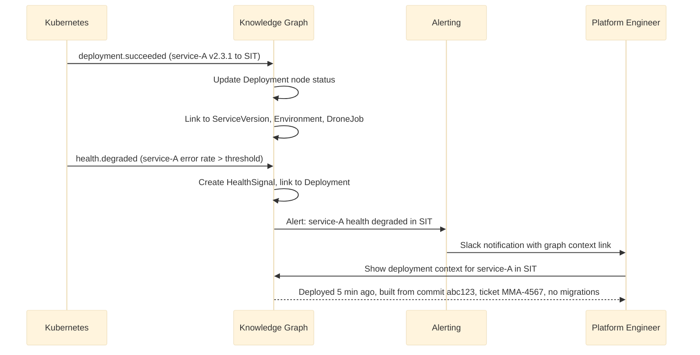

---

### 13. Incident Investigation Workflows

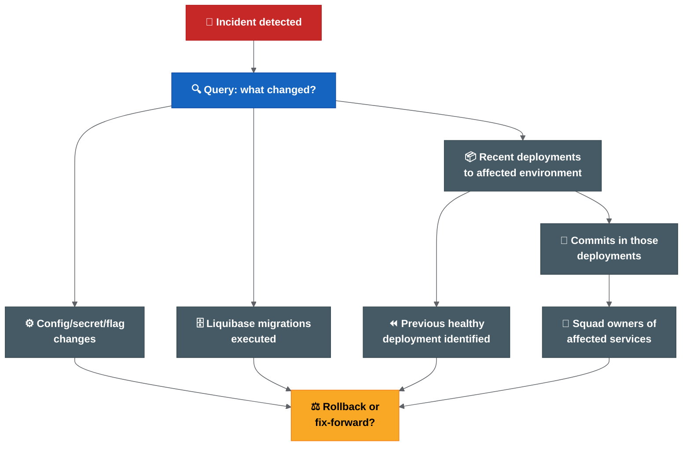

**Colour key:** Red = incident signal · Blue = investigation query · Grey = returned evidence · Yellow = rollback/fix-forward decision.

#### Investigation Query Sequence

1. **What is the current state?** → Environment → active Deployments → ServiceVersions
2. **What changed recently?** → Deployments in last 24h → Commits → Tickets
3. **Were there config changes?** → ConfigChanges linked to recent Deployments
4. **Were there DB migrations?** → LiquibaseChangesets linked to recent Commits
5. **Who owns the affected services?** → ServiceVersion → Squad → Lead
6. **What is the rollback target?** → Previous Deployment with healthy HealthSignal
7. **Is rollback safe?** → Check if LiquibaseChangeset has rollback block; check if secrets changed

---

### 14. Release Audit Workflows

#### Audit Query: "Prove what was in release 5.14"

```text
Graph traversal:
  Release{5.14}
    → INCLUDES → ServiceVersion[] (with tags, commit SHAs, image digests)
    → each ServiceVersion → BUILT_FROM → Commit (with author, timestamp)
    → each Commit → REFERENCES → JiraTicket[] (with status, assignee)
    → Release → HAS_APPROVAL → Approval[] (with approver, timestamp, type)
    → Release → DEPLOYED_TO → Deployment[] (with environment, timestamp, job)
    → each Deployment → APPLIES → ConfigChange[] (if any)
    → each Commit → INCLUDES_MIGRATION → LiquibaseChangeset[] (if any)

Output: Complete audit trail linking code → build → deploy → approve → validate.
```

#### Compliance Report Generation

The graph can generate compliance reports that answer:
- What code reached production?
- Who approved it?
- What tests ran?
- What scans passed?
- What config changed?
- What DB schema changed?
- Who deployed it?
- Was the deployment healthy?

---

### 15. Rollback Decision Support Workflows

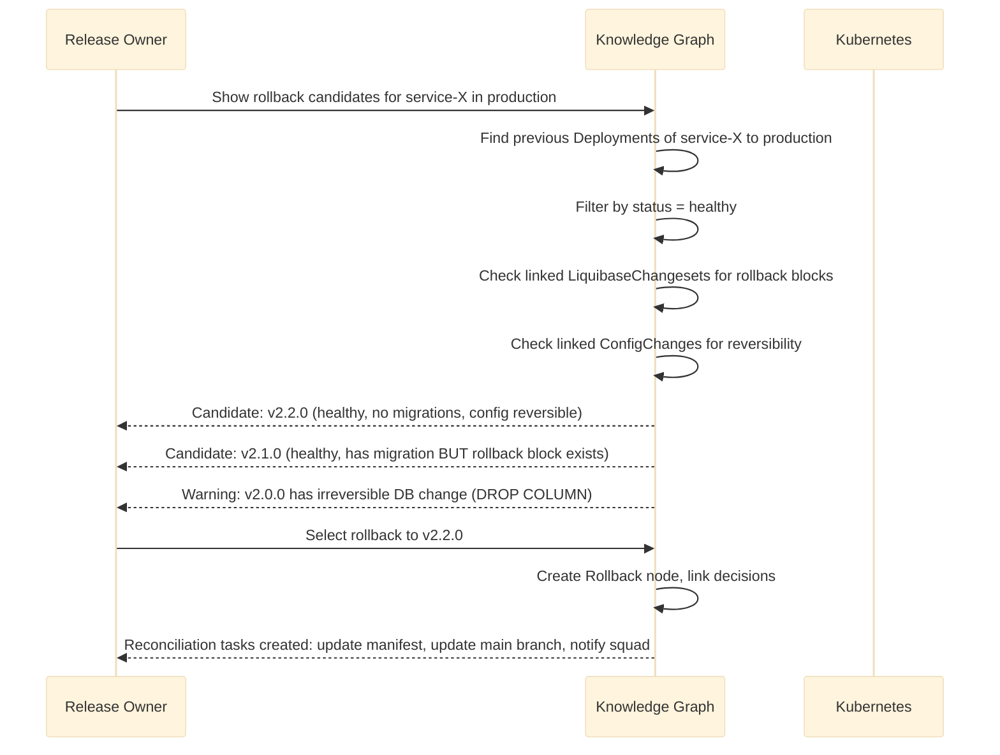

#### Rollback Safety Matrix (Graph-Derived)

| Check | Graph Query | Safe To Rollback? |
| --- | --- | --- |
| Previous healthy version exists | Previous Deployment with HealthSignal.status = healthy | Required |
| No irreversible DB migration between versions | LiquibaseChangesets between versions all have rollback blocks | Required |
| No dependent services upgraded | No other ServiceVersions that DEPENDS_ON the current version | Recommended |
| Config/secrets are reversible | ConfigChanges between versions are additive only | Recommended |
| Helm revision exists | HelmChart at target version is still in registry | Required |

---

### Related Pages

- [Deployment Knowledge Graph](08-platform-and-knowledge-graph.md)
- [Deployment Knowledge Graph — Operations And Technology](08-platform-and-knowledge-graph.md)
- [Advanced Architecture Sections](08-platform-and-knowledge-graph.md)
- [Architecture Diagrams](08-platform-and-knowledge-graph.md)

### Deployment Knowledge Graph — Operations And Technology

> Part 3 of 3. See [Part 1: Design](08-platform-and-knowledge-graph.md) for context.

### 16. Security And RBAC Model

#### Access Levels

| Role | Can View | Can Trigger | Can Override |
| --- | --- | --- | --- |
| Developer / Squad member | Own squad services, deployments, tickets | Nothing via graph | Nothing |
| Squad lead | Own squad + dependent services | Nothing via graph | Nothing |
| Release owner | All release scope, approvals, environment state | Deployment (via Drone) | Chart exclusion (with audit) |
| Platform engineer | All environments, infrastructure, pipeline state | Rerun failed jobs | Manual state correction (with audit) |
| QAT | Release scope, validation status, environment health | Nothing via graph | Nothing |
| Incident lead | All environments, deployment history, rollback targets | Rollback (via process) | Emergency override (with audit) |
| Audit / compliance | Read-only full history | Nothing | Nothing |

#### Data Sensitivity

| Data Type | Graph Storage | Access Control |
| --- | --- | --- |
| Commit messages | Full text | Team-visible |
| Jira ticket details | Summary + status (not comments) | Team-visible |
| Image digests | Full | Platform-visible |
| Secret values | **Never stored** | N/A |
| Secret change metadata | Name + timestamp + rotatedBy | Platform + release owner |
| Environment connection strings | **Never stored** | N/A |
| Approval records | Full | Audit-visible |
| Incident details | Summary + severity + resolution | Team-visible |

---

### 17. Data Retention And Compliance

| Data Category | Retention Period | Reason |
| --- | --- | --- |
| Active release data | Indefinite (while release is active or recent) | Operational |
| Deployment history | 2 years minimum | Audit trail, incident investigation |
| Approval records | 5 years minimum | Compliance, governance |
| Incident links | 3 years minimum | Post-incident review, trend analysis |
| Raw events | 1 year (hot) + 5 years (cold/archive) | Replay, recomputation, legal |
| DORA metrics | Indefinite (aggregated) | Trend reporting |
| Deleted/archived services | Retained with archived flag | Audit continuity |

#### GDPR / Data Protection

- Personal data (names in approvals, commit authors) should follow data retention policies.
- Graph should support pseudonymisation if required.
- Right-to-erasure may require replacing person nodes with anonymised identifiers after retention period.

---

### 18. Integration Points

#### Git Integration

| Event | Webhook | Data Extracted |
| --- | --- | --- |
| Push | `push` event | Commits, messages, authors, ticket references |
| Tag | `tag` event | ServiceVersion creation, release branch link |
| MR merge | `merge_request` event | Feature/hotfix merged into release branch |
| Branch creation | `branch` event | Release branch lifecycle |

#### Jira Integration

| Event | Webhook | Data Extracted |
| --- | --- | --- |
| Ticket updated | `jira:issue_updated` | Status change, GitLab tag field, release label |
| Release label added | Custom webhook / poll | Ticket included in release scope |
| Approval recorded | Workflow transition webhook | QAT or release owner approval |

#### Drone Integration

| Event | Webhook | Data Extracted |
| --- | --- | --- |
| Build started | `build` event | Pipeline execution start |
| Build completed | `build` event | Image built, tests passed, scans completed |
| Deployment triggered | `deploy` event (or promote) | Deployment to environment |
| Pipeline failed | `build` event | Failure with step information |

#### Helm Integration

| Event | Source | Data Extracted |
| --- | --- | --- |
| Chart published | Registry webhook / poll | Chart name, version, app version |
| Helm release installed/upgraded | Kubernetes watch or Drone event | Helm revision, values used |

#### Kubernetes Integration

| Event | Source | Data Extracted |
| --- | --- | --- |
| Deployment created/updated | K8s watch API | Image, replicas, status, namespace |
| Pod health change | K8s watch API | Ready/not-ready, restart count |
| HPA scaling | K8s watch API | Resource pressure signals |

#### Cerberus Deployment-Management Integration

| Event | Source | Data Extracted |
| --- | --- | --- |
| Chart version updated | Git webhook on deployment-management repo | Intended version per environment |
| Manifest MR created | GitLab MR webhook | Release candidate manifest state |
| Manifest MR merged | GitLab MR webhook | Deployment intent confirmed |

#### Observability Integration

| Event | Source | Data Extracted |
| --- | --- | --- |
| SLO breach | Prometheus alertmanager / Datadog webhook | Health degradation signal |
| Error rate spike | Custom alert rule | Post-deployment health signal |
| Latency anomaly | Custom alert rule | Performance regression signal |

#### Secret Management Integration

| Event | Source | Data Extracted |
| --- | --- | --- |
| Secret rotated | Secrets management event (metadata only) | Which secret, which environment, when, by whom |
| Secret access granted | GPG/git-crypt event | Who gained access to which environment secrets |

---

### 19. Recommended Technology Options

#### Graph Database

| Option | Strengths | Weaknesses | Fit |
| --- | --- | --- | --- |
| **Neo4j** | Mature, Cypher query language, rich tooling, strong community. | Operational overhead (self-hosted) or cost (Aura cloud). | Best for complex relationship queries and visualisation. |
| **Amazon Neptune** | Managed, scales well, supports both property graph and RDF. | Less mature query tooling, AWS lock-in. | Good if already AWS-native. |
| **PostgreSQL + Apache AGE** | Reuses existing Postgres skills, no new infrastructure. | Less performant for deep traversals, less mature graph tooling. | Good for start-small approach. |
| **Relational (PostgreSQL only)** | Simple, well-understood, existing team skills. | Deeply nested queries become expensive and hard to maintain. | Suitable for Phase 1 (simple joins) but limits future complex queries. |

#### Neo4j vs Relational Comparison

| Aspect | Neo4j (Graph) | PostgreSQL (Relational) |
| --- | --- | --- |
| Query: "What is in release X?" | Single Cypher traversal | 3-5 JOINs |
| Query: "Trace incident to root cause" | Variable-depth traversal (fast) | Recursive CTE (complex, slow at depth) |
| Query: "Find all services affected by commit" | Pattern match across relationships | Multi-table JOIN with ticket cross-reference |
| Schema changes | Add labels/relationships without migration | ALTER TABLE, migration scripts |
| Visualisation | Built-in graph browser | Requires custom UI |
| Team familiarity | New skill (Cypher) | Existing skill (SQL) |
| Infrastructure | New system to operate | Existing PostgreSQL available |
| Recommendation | **Best for Phase 3+ when complex queries justify cost** | **Best for Phase 1-2 as MVP with simpler queries** |

#### Event Bus

| Option | Strengths | Fit |
| --- | --- | --- |
| **Apache Kafka** | Durable, replayable, well-suited for event sourcing. | Best for high-volume, multi-consumer scenarios. |
| **NATS** | Lightweight, fast, easy to operate. | Good for lower volume or simpler setups. |
| **AWS SQS/SNS** | Managed, no operational overhead. | Good if AWS-native. |
| **Redis Streams** | Fast, simple, already common in stacks. | Good for MVP / start-small. |

#### Search

| Option | Fit |
| --- | --- |
| **Elasticsearch / OpenSearch** | Full-text search across commit messages, tickets, reports. |
| **PostgreSQL full-text** | Simpler but less capable for fuzzy/ranked search. |

#### UI / Dashboard

| Option | Fit |
| --- | --- |
| **Custom React/Next.js dashboard** | Full control, tailored to workflows. |
| **Backstage plugin** | Integrates with existing developer portal if adopted. |
| **Grafana (for metrics only)** | Good for DORA metrics visualisation, not for graph exploration. |

#### Backstage Integration Options

If Backstage is adopted as the internal developer portal:

1. **Backstage catalog entity provider:** Sync services, squads and ownership from the knowledge graph into the Backstage catalog.
2. **Backstage plugin for release view:** Custom plugin that queries the GraphQL API to show release scope, environment state and deployment history within Backstage.
3. **Backstage TechDocs integration:** Generate release reports from the graph and publish as TechDocs.
4. **Backstage scaffolder integration:** Use graph ownership data to pre-populate scaffolder templates for new services.

Backstage is a presentation layer option, not a replacement for the knowledge graph itself.

---

### 20. Incremental Implementation Roadmap

| Phase | Timeframe | Scope | Technology | Outcome |
| --- | --- | --- | --- | --- |
| 0 | After release automation is stable | Define schema, agree query requirements | Design only | Documented graph schema and priority queries |
| 1 | Month 9-12 | Core entities: Release, ServiceVersion, Deployment, Environment | PostgreSQL + simple relationships | Basic "what is deployed where?" query |

Note: Knowledge Graph Phase 1 (Month 9-12) overlaps with Transformation Phase 5 (modernise). The formal "unified control plane evaluation" in Transformation Phase 6 (12+ months) determines whether the KG grows into a full operational interface or remains a read-only intelligence layer. The KG can start as a read-only data project without waiting for the control plane decision.
| 2 | Month 12-15 | Add Jira tickets, commits, approvals | PostgreSQL + full-text search | "What is in release X?" with ticket cross-reference |
| 3 | Month 15-18 | Add Liquibase, config changes, health signals | Migrate to Neo4j if query complexity justifies | Incident investigation support |
| 4 | Month 18-24 | Add incident linking, rollback decision support | Neo4j + GraphQL API | Rollback safety assessment from graph |
| 5 | Month 24+ | DORA metrics derivation, full audit export, Backstage integration | Full platform | Complete deployment intelligence platform |

#### Build vs Buy Analysis

| Approach | Pros | Cons | Recommendation |
| --- | --- | --- | --- |
| **Build custom** | Exact fit for Cerberus toolchain; full control; no vendor lock-in. | Development effort; maintenance burden; requires graph/platform expertise. | Recommended for core graph and API. |
| **Buy platform (e.g. Cortex, OpsLevel, Humanitec)** | Fast start; managed; feature-rich. | May not fit Cerberus toolchain; vendor lock-in; cost; may not support Drone/GitLab/Cerberus specifics. | Evaluate for UI/dashboard layer only. |
| **Adopt Backstage + custom plugins** | Open-source; extensible; community support; developer portal benefits. | Still requires custom plugins for graph queries; not a graph database. | Recommended as UI layer on top of custom graph. |
| **Hybrid: Custom graph + Backstage UI + managed graph DB** | Best of both; focused effort on domain logic; managed infrastructure. | Integration complexity; multiple vendors. | Recommended target architecture. |

**Recommended approach:** Build the graph model and ingestion layer custom (it is domain-specific). Use managed infrastructure (Neo4j Aura or Amazon Neptune) to reduce operational burden. Use Backstage or custom UI for the presentation layer.

---

### Risks

| Risk | Impact | Mitigation |
| --- | --- | --- |
| Graph becomes stale or inaccurate | Teams lose trust and stop using it. | Automated data quality checks; reconciliation against live state. |
| Over-engineering before automation is stable | Delays the immediate release improvement work. | Do not start Phase 1 until Drone automation is green for multiple releases. |
| Schema becomes too rigid | New entity types or relationships are hard to add. | Use property graph model (inherently flexible); avoid over-normalisation. |
| Performance degrades with scale | Slow queries discourage use. | Index frequently-traversed relationships; paginate results; cache common queries. |
| Security: graph exposes sensitive deployment data | Unauthorised access to production topology. | RBAC from day one; never store secret values; audit all queries. |
| Team lacks graph database skills | Implementation quality suffers. | Start with PostgreSQL (Phase 1-2); train team; migrate to Neo4j when justified. |

---

### Anti-Patterns

| Anti-Pattern | Why It Fails | Correct Approach |
| --- | --- | --- |
| Making the graph a write-through deployment tool | Creates a second source of truth; bypasses existing controls. | Graph is read-only; triggers go through existing Drone/Helm pipelines. |
| Ingesting everything from day one | Overwhelming complexity; poor data quality early on. | Start with core entities; add progressively as sources mature. |
| Building the graph before release metadata is standardised | Garbage in, garbage out. | Complete validation and metadata standardisation (Phase 1-2 of transformation) first. |
| Replacing Jira/Git/Drone instead of reading from them | Massive scope; team resistance; fragmentation risk. | Graph reads from existing tools; never replaces them. |
| Custom UI before API is stable | UI becomes tightly coupled to unstable schema. | API-first; UI consumes stable GraphQL/REST endpoints. |
| Ignoring data retention | Legal/compliance risk; storage cost explosion. | Define retention policy before ingesting historical data. |

---

### Summary

The Deployment Knowledge Graph is the intelligence layer that sits above the Unified Deployment and Release Control Plane. While the control plane provides operational workflow (approve, deploy, rollback), the knowledge graph provides understanding (what happened, why, what is connected, what is the impact).

It should be built incrementally, starting only after the immediate release automation, validation and ownership work is stable. The recommended path is:

1. Stabilise release automation (current transformation Phase 0-4).
2. Define graph schema and priority queries (design phase).
3. Build MVP with PostgreSQL (simple relationships, core entities).
4. Migrate to Neo4j when query complexity justifies it.
5. Add incident, rollback and DORA intelligence progressively.
6. Consider Backstage integration for developer-facing UI.

> **This is a long-term architectural investment. It creates compounding value as more events are ingested and more relationships are traversed. But it only works if the underlying data (tags, manifests, tickets, approvals) is reliable — which is why the immediate transformation must come first.**

### Related Pages

- [Deployment Knowledge Graph](08-platform-and-knowledge-graph.md)
- [Deployment Knowledge Graph — Implementation And Workflows](08-platform-and-knowledge-graph.md)
- [Deployment Knowledge Graph — Strategic Value, Business Case And Governance](08-platform-and-knowledge-graph.md)
- [Criticality Challenge Review](08-platform-and-knowledge-graph.md)

### Deployment Knowledge Graph — Strategic Value, Business Case And Governance

> **Audience:** Directors, Enterprise Architects, Delivery Managers, Platform Leads.
>
> **Status:** Proposed. Not approved. Not funded. Future option subject to platform strategy approval.

This page provides the strategic justification, governance model and organisational benefits for the Deployment Knowledge Graph. It is intended for non-technical decision-makers who need to understand why this investment could be justified and what the expected return would be.

For technical architecture, see [design](08-platform-and-knowledge-graph.md), [implementation](08-platform-and-knowledge-graph.md) and [operations](08-platform-and-knowledge-graph.md).

---

### Summary

The Cerberus release process generates operational data across many disconnected systems: Git, Drone, Helm, Kubernetes, Jira, deployment-management, secrets, Liquibase and observability tools. No single system can answer "what was deployed, when, by whom, with what approval, and what happened after?"

Answering these questions today requires manual investigation across multiple tools, often under time pressure during incidents. This costs engineering hours, delays incident response and makes audit compliance difficult.

A Deployment Knowledge Graph would create a relationship intelligence layer that reads from existing systems and enables instant operational queries. It would not replace any existing tool. It would connect their data so that humans (and eventually machines) can reason about releases, deployments and incidents without manual correlation.

The expected benefits are faster incident response, reduced manual reporting effort, stronger audit compliance and better deployment decision support. The investment is incremental, starting read-only, and the platform should only be built after the immediate release automation and validation work is stable.

---

### Current Operational Challenges

#### Fragmented Release Visibility

Release state is distributed across branches, tags, images, Helm charts, Cerberus deployment-management manifests, Jira tickets, environment values, secrets and runbooks. No single view exists that shows what constitutes a given release.

#### Manual Investigation Effort

When an incident occurs, engineers must manually query Git logs, Drone jobs, Kubernetes state, Jira tickets and observability dashboards to understand what changed. This takes time that should be spent on resolution.

#### Delayed Incident Response

Without connected data, rollback decisions are slow. Engineers cannot instantly answer "what is the previous healthy version?" or "did a database migration run between these versions?" The time spent investigating extends incident duration.

#### Limited Deployment Intelligence

Leadership cannot easily answer portfolio-level questions: "How often do we deploy?", "What is our change failure rate?", "Which squads are deploying most frequently?", "Which services have the longest lead time?" These DORA metrics must be computed manually, if at all.

---

### Business Problems Being Addressed

| Problem | Current Impact | Potential Benefit |
| --- | --- | --- |
| Release visibility gaps | Release scope cannot be confirmed from a single system. | One query shows all services, tickets, images, charts and config in a release. |
| Slow incident investigation | Engineers spend 30-60 minutes correlating data across tools during incidents. | Graph traversal shows full change context in seconds. |
| Manual release reporting | Release reports are generated by scripts that must be run and reviewed manually. | Reports are derived from graph state on demand. |
| Environment drift | No automated comparison between intended state and actual deployed state. | Graph reconciles deployment-management intent against Kubernetes reality. |
| Deployment audit complexity | Proving what was deployed, by whom, with what approval requires cross-referencing multiple systems. | Single audit query returns full provenance chain. |
| Knowledge concentration | Only a few people can answer "what is deployed where?" from memory. | Anyone with graph access can answer operational questions self-service. |
| Rollback uncertainty | Rollback safety (Liquibase constraints, config dependencies) requires deep investigation. | Graph shows rollback candidates with known constraints instantly. |
| No deployment metrics | DORA metrics are not computed. Delivery performance is not measured. | Metrics are derived from graph edges automatically. |

---

### Expected Organisational Benefits

#### Engineering

| Benefit | Description |
| --- | --- |
| Faster root cause analysis | Trace from incident to deployment to commit to ticket in seconds. |
| Reduced deployment risk | Impact analysis shows blast radius before deploying. |
| Better release confidence | Validation dashboard shows readiness state before promotion. |
| Self-service operational answers | Engineers answer their own questions without escalating to specialists. |

#### Delivery

| Benefit | Description |
| --- | --- |
| Improved release reporting | Reports generated from live data, not manually compiled. |
| Reduced coordination effort | Release scope is visible without meetings or Slack threads. |
| Predictable release cadence | Metrics show whether releases are getting faster or slower. |
| Evidence-based planning | Lead time and failure rate data inform sprint planning. |

#### Operations

| Benefit | Description |
| --- | --- |
| Faster rollback decisions | Constraints visible immediately; decision support reduces MTTR. |
| Better operational awareness | Environment state and drift visible in one place. |
| Reduced on-call burden | Less manual investigation during incidents. |
| Proactive problem detection | Drift and validation failures surfaced before they cause incidents. |

#### Leadership

| Benefit | Description |
| --- | --- |
| Portfolio deployment visibility | See deployment frequency, lead time, failure rate across all squads. |
| Better governance | Approvals, overrides and decisions recorded and queryable. |
| Audit readiness | Complete provenance chain available on demand. |
| Investment clarity | Metrics show whether process improvements are delivering results. |

---

### Governance Model

#### Platform Ownership

| Capability | Proposed Owner | Responsibility |
| --- | --- | --- |
| Graph platform (infrastructure, API, ingestion) | Platform team | Build, operate, scale, secure. |
| Data sources (webhooks, event quality) | Source system owners | Ensure events are published reliably. |
| Release model (what constitutes a release) | Release management | Define release scope and lifecycle rules. |
| Access control (RBAC, data sensitivity) | Security team | Define and enforce access policies. |
| Data quality (accuracy, completeness, freshness) | Shared responsibility | Platform monitors; source owners fix. |
| Metrics and reporting (DORA, KPIs) | Engineering leadership | Define what to measure; consume outputs. |

#### Data Ownership Principles

> **The Knowledge Graph does not become the authoritative source of record for any domain.**

Source of truth remains with:

| Domain | Source Of Truth |
| --- | --- |
| Code history and branches | Git |
| Work items and release scope | Jira |
| Build and pipeline execution | Drone |
| Deployment intent and manifests | Cerberus deployment-management |
| Actual runtime state | Kubernetes |
| Helm chart packages | Helm registry |
| Container images | Image registry (Artifactory) |
| Approvals and QAT decisions | Jira / workflow system |
| Secrets | Git-crypt / Drone secrets / future secrets manager |
| Database migrations | Liquibase changelogs in Git |
| Observability and health | Prometheus / OpenTelemetry / Datadog |

The Knowledge Graph is a **relationship intelligence layer**. It:

- Reads from sources of truth.
- Correlates relationships between entities across sources.
- Serves operational, audit and analytical queries.
- Records its own decisions (rollback choices, override approvals) as events.
- Never overwrites or contradicts a source of truth.

This principle must be upheld absolutely. If the graph disagrees with a source system, the source system is correct and the graph must be re-synced.

---

### Risks And Constraints

| Risk | Description | Likelihood | Mitigation |
| --- | --- | --- | --- |
| Stale data | Graph lags behind source systems due to ingestion delay or failure. | Medium | Automated freshness checks; alerting on ingestion lag; reconciliation jobs. |
| Incomplete ingestion | Not all events reach the graph; partial view leads to wrong conclusions. | Medium | Event bus with at-least-once delivery; dead-letter queue; periodic backfill. |
| Incorrect relationships | Graph builds wrong links due to bad metadata (missing ticket refs, wrong tags). | High initially | Depend on release metadata standardisation (Phase 1 transformation) completing first. |
| Scaling challenges | Graph grows large as services and history accumulate. | Low-Medium | Index frequently-traversed relationships; archive old data; partition by time. |
| User adoption | Teams do not use the graph because existing habits are sufficient. | Medium | Start with incident investigation use case (highest pain point); embed in existing workflows. |
| Governance complexity | Unclear ownership leads to unmaintained platform. | Medium | Assign product owner before build starts; treat as internal product with backlog. |
| Over-engineering | Building too much before release automation is stable. | High if started too early | Gate: do not start until Drone automation is green for multiple releases. |
| Security exposure | Graph reveals production topology and deployment patterns. | Low-Medium | RBAC from day one; audit all queries; never store secret values. |

---

### Non-Functional Requirements

These should be defined before build starts and validated during each implementation phase.

| Requirement | Target | Rationale |
| --- | --- | --- |
| Availability | 99.9% during working hours | Operational queries are needed during incidents (which happen during working hours). |
| Query latency | < 2 seconds for standard operational queries | Engineers must get answers faster than manual investigation. |
| Data freshness | < 5 minutes from source event to graph update | Acceptable for operational queries; not for deployment control. |
| Auditability | Full query and access logging | Compliance requires knowing who queried what and when. |
| Security | Role-based access control; no raw secret storage | Sensitive deployment data requires access boundaries. |
| Scalability | Support 500+ services, 50+ environments, 2+ years of history | Enterprise environment with growth. |
| Recoverability | Full rebuild from raw event store within 4 hours | Graph can be regenerated from immutable event log. |
| Extensibility | New entity types and relationships without schema migration | Requirements will evolve; schema must flex. |

---

### Success Criteria

| Objective | Measure | Target |
| --- | --- | --- |
| Reduce incident investigation time | Time from incident detection to root cause identification. | < 10 minutes (from estimated 30-60 minutes). |
| Reduce manual release reporting effort | Hours spent per sprint on release report preparation. | < 1 hour (from estimated several hours). |
| Improve deployment visibility | "What is deployed where?" answerable from one system. | 100% of services and environments covered. |
| Improve rollback decision speed | Time from rollback decision to knowing available targets and constraints. | < 2 minutes (from estimated 15-30 minutes). |
| Audit query response | Time to produce a full release provenance chain. | < 30 seconds (from estimated hours of manual work). |
| DORA metrics availability | Automated computation of deployment frequency, lead time, CFR and MTTR. | Weekly automated reporting. |
| User adoption | Active users querying the graph per week. | > 50% of squad leads and platform engineers within 6 months of launch. |

---

### Cost / Benefit Summary

| Investment Area | Estimated Cost | Expected Benefit | Payback Period |
| --- | --- | --- | --- |
| Phase 1: Read-only dashboard (core entities) | Low-Medium | Basic "what is deployed where?" visibility. | Immediate operational value. |
| Phase 2: Validation dashboard | Medium | Release readiness visible without pipeline log inspection. | First prevented failed release. |
| Phase 3: Incident investigation support | Medium | Faster root cause analysis; reduced MTTR. | First major incident investigated faster. |
| Phase 4: Rollback decision support | Medium | Confidence in rollback; reduced incident duration. | First rollback executed in minutes instead of hours. |
| Phase 5: DORA metrics and audit | Low-Medium | Automated reporting; compliance readiness. | Ongoing (replaces manual reporting effort). |
| Phase 6: Full platform (approval workflow, triggers) | High | Complete operational control plane. | 12+ months (compounding value). |

**Note:** These are indicative estimates. Detailed costing requires architecture decisions (managed vs self-hosted, build vs buy, team allocation) that are not yet made.

---

### Decision Record

| Field | Value |
| --- | --- |
| Decision | Whether to invest in a Deployment Knowledge Graph as a long-term platform capability. |
| Status | **Proposed** |
| Approval | Pending — requires platform strategy, architecture and delivery leadership sign-off. |
| Implementation | Not approved — depends on release automation maturity (Phase 2-3 transformation). |
| Funding | Not approved — requires business case acceptance and budget allocation. |
| Target state | Future option — earliest feasible start is Month 9-12 of the transformation roadmap. |
| Prerequisites | Release automation stable in Drone; metadata standardisation complete; named platform owner assigned. |
| Alternatives considered | (1) Do nothing — continue manual investigation. (2) Buy a platform product. (3) Build custom. |
| Recommended approach | Hybrid: build custom graph and ingestion layer; use managed infrastructure; use Backstage or custom UI. |
| Review date | To be set after Phase 2 of the transformation is complete. |

### Related Pages

- [Deployment Knowledge Graph](08-platform-and-knowledge-graph.md)
- [Deployment Knowledge Graph — Operations And Technology](08-platform-and-knowledge-graph.md)
- [Potential Future Architecture Review Considerations](08-platform-and-knowledge-graph.md)

### Potential Architecture Review Notes

This section keeps optional later-stage review considerations for the Cerberus release-process notes.

These notes are not an ARB submission, approval request or final architecture position. They are included only to make possible governance, criticality and operating-model questions visible if the team later decides that a formal review is needed.

### Review Notes

| Area | File |
| --- | --- |
| Current understanding and quality observations | [executive-and-quality-review](08-platform-and-knowledge-graph.md) |
| Alignment and architecture considerations | [alignment-and-enterprise-architecture-review](08-platform-and-knowledge-graph.md) |
| Potential future architecture review considerations | [arb-package](08-platform-and-knowledge-graph.md) |
| Potential benefits and roadmap notes | [business-case-and-roadmap](08-platform-and-knowledge-graph.md) |
| Operating model and RACI notes | [operating-model-raci](06-ownership-and-approvals.md) |
| Architecture diagrams | [architecture-diagrams](08-platform-and-knowledge-graph.md) |
| Criticality challenge notes | [criticality-challenge-review](08-platform-and-knowledge-graph.md) |
| Additional enterprise concerns to confirm | [missing-enterprise-concerns](08-platform-and-knowledge-graph.md) |
| Summary assessment and open risks | [final-scorecard-and-verdict](08-platform-and-knowledge-graph.md) |

### Appendix Outputs

| Area | File |
| --- | --- |
| material list | [source-document-list](08-platform-and-knowledge-graph.md) |
| Review criteria and status map | [review-criteria](08-platform-and-knowledge-graph.md) |
| Recommendation inventory | [recommendation-inventory](08-platform-and-knowledge-graph.md) |

### Suggested Reading Order

1. [executive-and-quality-review](08-platform-and-knowledge-graph.md)
2. [alignment-and-enterprise-architecture-review](08-platform-and-knowledge-graph.md)
3. [arb-package](08-platform-and-knowledge-graph.md)
4. [business-case-and-roadmap](08-platform-and-knowledge-graph.md)
5. [operating-model-raci](06-ownership-and-approvals.md)
6. [criticality-challenge-review](08-platform-and-knowledge-graph.md)
7. [missing-enterprise-concerns](08-platform-and-knowledge-graph.md)
8. [final-scorecard-and-verdict](08-platform-and-knowledge-graph.md)

### Related Pages

- [Cerberus Release Process Understanding, Gaps And Improvement Ideas](00-parent-release-engineering-assessment.md)
- [Architecture Review material list](08-platform-and-knowledge-graph.md)
- [Architecture Review Criteria](08-platform-and-knowledge-graph.md)
- [Recommendation Inventory](08-platform-and-knowledge-graph.md)
- [Summary Assessment And Open Risks](08-platform-and-knowledge-graph.md)

### Architecture Alignment Considerations

Status: Optional review note / working reference.

### Architecture Alignment Notes

| Issue | Impact | Possible Discussion Point |
| --- | --- | --- |
| Improvement roadmap, platform strategy and Knowledge Graph roadmap use different phase language. | Readers may assume future capabilities are nearer than intended. | Normalize phases into Foundation, Controlled Automation, Scale, Intelligence Pilot, Platform Control if these notes stay in scope. |
| Control plane and Knowledge Graph are sometimes described together. | Responsibilities blur between data intelligence and operational action. | Define Knowledge Graph as read-model; Control Plane as interface/orchestration layer. |
| GitOps, progressive delivery and trunk-based development are listed as improvements but not always gated by criticality. | Commercial SaaS practices may be over-applied to border-security context. | Add critical-environment prerequisites and explicit defer status. |
| Release decision register tracks release decisions, but future architecture decisions may need their own confirmation trail. | Future platform decisions may be mixed with release-process decisions. | Keep ADRs for future platform capabilities separate if they proceed. |
| Business case benefits differ across documents. | Readers may challenge inconsistent KPI targets. | Keep one benefits table with baseline, target and measurement method. |
| Ownership is role-based in RACI but not named. | Operational handoff remains unresolved. | Add named owner capture step before rollout expansion. |
| Security and data classification are strong in Knowledge Graph proposal but less explicit in release automation. | Release metadata can also expose sensitive topology and operations. | Apply classification, RBAC and audit to release reports and dashboards. |

### Terminology Map

| Term | Working Definition | Should Not Mean |
| --- | --- | --- |
| Release operating model | The agreed process for branch, tag, artefact, manifest, approval, deploy and reconciliation. | A branch naming convention only. |
| Deployment Knowledge Graph | Read-model that correlates metadata from source systems. | Source of truth or deployment controller. |
| Unified Control Plane | User interface and workflow layer over agreed automation and source systems. | A bypass around Drone, Jira, approvals or change control. |
| Release Intelligence | Query and reporting capability over release/deployment relationships. | Automated operational decisioning. |
| GitOps | Pull-based reconciliation from Git source of truth. | Any deployment-management repo with pipeline deploys. |
| Progressive delivery | Controlled traffic or rollout management with telemetry. | Faster deployment by default. |

### Business Architecture Review

| Aspect | Current Maturity | Possible Target Maturity | Gaps | Discussion Points |
| --- | --- | --- | --- | --- |
| Capabilities | 2.5 / 5 | 4 / 5 | Release governance, audit reporting and rollback capability are incomplete. | Define capability map: release planning, validation, deployment, incident recovery, audit. |
| Value streams | 2 / 5 | 4 / 5 | Commit-to-production flow is fragmented. | Map value stream from Jira ticket to production evidence. |
| Ownership | 2 / 5 | 4.5 / 5 | Role-level RACI exists, named owners missing. | Assign named owner/backups and escalation. |
| Governance | 2.5 / 5 | 4.5 / 5 | Decision register exists but confirmations are open. | Define confirmation conditions and release governance cadence. |

### Application Architecture Review

| Aspect | Current Maturity | Possible Target Maturity | Gaps | Discussion Points |
| --- | --- | --- | --- | --- |
| Systems involved | 3 / 5 | 4 / 5 | Source systems are identified but integration ownership varies. | Maintain source system catalogue with owner and event/API contract. |
| Integration patterns | 2.5 / 5 | 4 / 5 | Webhooks, batch and pipeline events proposed but not prioritised. | Start with low-risk event ingestion from Git, Drone, Jira and deployment-management. |
| APIs | 2 / 5 | 4 / 5 | GraphQL/REST ideas exist but API NFRs and auth model need confirmation. | Define API contracts, RBAC, throttling and audit before build. |
| Events | 2 / 5 | 4 / 5 | Event schema, idempotency and replay need formal design. | Publish canonical event envelope and reconciliation strategy. |

### Data Architecture Review

| Aspect | Current Maturity | Possible Target Maturity | Gaps | Discussion Points |
| --- | --- | --- | --- | --- |
| Canonical model | 2.5 / 5 | 4 / 5 | Entities exist but release/control-plane canonical model needs versioning. | Confirm canonical entity and relationship model through architecture governance if this proceeds. |
| Lineage | 2 / 5 | 4.5 / 5 | Release provenance is manual. | Capture commit, build, artefact, manifest, approval and deploy lineage. |
| Data quality | 2 / 5 | 4 / 5 | Metadata may be incomplete or wrong. | Add completeness, freshness and correctness SLOs. |
| Retention | 2.5 / 5 | 4 / 5 | Retention targets vary. | Define retention by data class and audit need. |
| Classification | 2.5 / 5 | 4.5 / 5 | Release reports need classification discipline. | Classify topology, release, personnel and incident metadata. |

### Technology Architecture Review

| Aspect | Current Maturity | Possible Target Maturity | Gaps | Discussion Points |
| --- | --- | --- | --- | --- |
| Hosting | 2.5 / 5 | 4 / 5 | Future platforms need HA and operational model. | Define hosting pattern, environment separation and admin access. |
| Scalability | 2 / 5 | 4 / 5 | 5+ billion records/month assumption needs capacity model. | Add volume model before graph/control-plane build. |
| Resilience | 2 / 5 | 4.5 / 5 | DR and failover are under-specified. | Define RTO/RPO and rebuild-from-event-store targets. |
| Observability | 2.5 / 5 | 4 / 5 | Health metrics exist but not release-correlated. | Add release health dashboard and ingestion freshness alerts. |
| Security | 2.5 / 5 | 4.5 / 5 | Security controls need to be explicit for automation and release reporting. | Apply RBAC, SoD, audit and privileged access controls across release tooling. |

### Related Pages

- [Potential Architecture Review Notes](08-platform-and-knowledge-graph.md)
- [Architecture Review Criteria](08-platform-and-knowledge-graph.md)
- [Recommendation Inventory](08-platform-and-knowledge-graph.md)
- [Architecture Diagrams](08-platform-and-knowledge-graph.md)

### Possible Review Criteria

Status: Optional review note / working reference.

### Review Lens

If the notes are later taken into a formal review, these two lenses may be useful:

1. Formal review readiness: can the proposal be understood, governed, funded, delivered and operated safely?
2. Border-security criticality: would the recommendation remain safe in a mission-critical, national-security-adjacent platform with strict audit, high availability and low tolerance for deployment mistakes?

### Decision Standards

| Standard | Question |
| --- | --- |
| Operational safety | Does the recommendation reduce production risk, or simply move risk into automation? |
| Blast radius control | If it fails, how many services, releases, environments or teams could be affected? |
| Recoverability | Is there a tested recovery path, not just a theoretical rollback option? |
| Auditability | Can the team prove who changed what, when, why and with whose approval? |
| Human operability | Can release managers, incident leads and squads understand the process during an incident? |
| Security and classification | Does the proposal protect sensitive topology, deployment metadata, user identities and operational evidence? |
| Data quality | Are decisions based on complete, fresh and trustworthy metadata? |
| Governance | Are owners, approvers, backups and escalation paths named? |
| Incremental delivery | Can the change be piloted, measured and rolled back without a big-bang shift? |
| Enterprise fit | Does it align with architecture, security, change management and platform strategy? |

### Scoring Scale

| Score | Meaning |
| --- | --- |
| 1 | Not acceptable for critical environment. |
| 2 | Weak; significant controls required before use. |
| 3 | Plausible with modification and clear guardrails. |
| 4 | Strong, provided owners and evidence are in place. |
| 5 | Strong and ready for controlled rollout. |

### Status Map

| Area | Current Status | Review Position |
| --- | --- | --- |
| Release operating model | Proposed / needs confirmation | Treat as assessment, not approved policy. |
| Branch cutover to `main = production` | Needs confirmation | Defer until validation, ownership, rollback and production baseline evidence are proven. |
| Drone release automation | Pilot / proposed | Support controlled pilot; require manual approvals and rerun controls. |
| Strict validation | Needs confirmation | Strongly support; dry-run first, then fail-fast after evidence. |
| Changed-chart deployment | Needs confirmation | Support with audited exclusion and manifest comparison controls. |
| Hotfix and rollback | Needs confirmation | Needs confirmation and testing before production rollout. |
| Release scope and ownership | Needs owner / needs confirmation | Blocker for scale-out. |
| GitOps / ArgoCD | Medium/long-term option | Defer production adoption; evaluate non-prod only after source-of-truth discipline is proven. |
| Progressive delivery / auto-rollback | Future option | Defer automated production decisions; start with observability and manual gates. |

### Review Constraints

- Do not mark any proposal as approved without explicit owner or formal approval evidence.
- Use the Confluence pages for detailed traceability if a question needs deeper evidence.
- Do not recommend faster deployment at the expense of traceability.
- Do not recommend automation that bypasses human approval for high-impact environments.

### Related Pages

- [Potential Architecture Review Notes](08-platform-and-knowledge-graph.md)
- [Recommendation Inventory](08-platform-and-knowledge-graph.md)
- [Criticality Challenge Notes](08-platform-and-knowledge-graph.md)

### Improvement Area Inventory

Status: Optional review note / working reference.

This inventory lists major improvement areas that may need confirmation, challenge or deferral before any rollout expansion.

| ID | Improvement Area | Source Area | Current Status | Initial Review Position |
| --- | --- | --- | --- | --- |
| R01 | Stabilise release operating model before changing branch model. | Release assessment | Proposed | Strongly support. |
| R02 | Keep current GitFlow-style model temporarily. | Branching options | Proposed | Support as interim control. |
| R03 | Cut over to `main = production` after agreed release. | Rollout decisions | Needs confirmation | Modify: only after baseline evidence and rollback readiness. |
| R04 | Auto-create release branches from `main`. | Proposed automation | Needs confirmation | Support pilot with scope controls. |
| R05 | Create feature/hotfix branches from relevant release branch. | Proposed automation | Needs confirmation | Support with training and conflict rules. |
| R06 | Forward-merge fixes into later active releases. | Rollout decisions | Needs owner | Strongly support, but owner is blocker. |
| R07 | Move local release scripts into Drone. | CI/CD findings | Proposed / pilot | Support with idempotency and manual gates. |
| R08 | Make final Git/chart/reporting steps rerunnable. | Automation | Needs confirmation | Support with state locking and audit events. |
| R09 | Add alerts for failed automation. | Automation | Needs owner | Strongly support; production prerequisite. |
| R10 | Enforce strict tag, artefact and manifest validation. | Validation | Needs confirmation | Strongly support; dry-run before enforcement. |
| R11 | Fail on wrong tag, missing tag and manifest mismatch. | Validation | Needs confirmation | Strongly support with override workflow. |
| R12 | Validate Jira ticket status and release metadata. | Validation | Needs confirmation | Support after status taxonomy is confirmed. |
| R13 | Treat environment readiness as a gate. | Scope / platform | Needs confirmation | Strongly support. |
| R14 | Deploy changed charts by default. | Proposed automation | Needs confirmation | Modify: require dependency and exclusion controls. |
| R15 | Keep human approval before higher environment and production. | Rollout decisions | Needs confirmation | Strongly support. |
| R16 | Document and test hotfix flow. | Hotfix / rollback | Needs confirmation | Strongly support; production prerequisite. |
| R17 | Document rollback vs fix-forward guide. | Hotfix / rollback | Needs confirmation | Strongly support; rollback may be unrealistic for DB/data changes. |
| R18 | Require branch, manifest and Jira reconciliation after rollback. | Rollback | Needs confirmation | Strongly support. |
| R19 | Standardise release scope across code, config, secrets, Liquibase and runbooks. | Scope | Needs confirmation | Strongly support. |
| R20 | Assign named owners, approvers and backups. | Ownership | Needs owner | Strongly support; scale-out blocker. |
| R21 | Add release reporting with Jira cross-reference. | Reporting | Proposed | Support, but define retention and evidence ownership. |
| R22 | Add release metrics and DORA visibility. | Improvement notes | Proposed | Support after data model is reliable. |
| R23 | Add observability gates. | Platform strategy | Future / phased | Modify: alert-only first, then gated promotion. |
| R24 | Evaluate blue-green deployment for critical services. | Platform strategy | Future | Support selectively; requires service readiness. |
| R25 | Evaluate canary/progressive delivery. | Platform strategy | Future | Defer; high complexity in critical environment. |
| R26 | Generate SBOMs with existing tooling. | Platform advanced | Future / quick win | Strongly support. |
| R27 | Sign images and verify signatures. | Platform advanced | Medium-term | Support with rollout plan. |
| R28 | Adopt GitOps / ArgoCD. | Platform advanced | Future | Defer production adoption; non-prod pilot only. |
| R29 | Build Deployment Knowledge Graph. | Knowledge Graph | Proposed future option | Keep outside immediate discussion pack. |
| R30 | Build unified deployment control plane. | Future platform option | Long-term | Defer until release evidence and SoD are proven. |
| R31 | Allow control plane to trigger Drone jobs. | Control plane | Future decision | Defer until approval workflow and SoD are proven. |
| R32 | External Secrets Operator. | Future platform option | Future | Support after secret ownership and rotation model are agreed. |
| R33 | Runtime feature flags. | Future platform option | Future | Support as prerequisite for trunk-based maturity. |
| R34 | Reassess trunk-based development after maturity improvements. | Branching | Future | Support deferral. |

### Inventory Conclusion

The strongest immediate improvement areas appear to be release metadata standardisation, strict validation, ownership, environment readiness, hotfix/rollback process and controlled Drone automation. The most aggressive ideas are production GitOps, progressive delivery and unified control plane trigger capability. These should be deferred or limited to non-production pilots.

### Related Pages

- [Potential Architecture Review Notes](08-platform-and-knowledge-graph.md)
- [Possible Review Criteria](08-platform-and-knowledge-graph.md)
- [Criticality Challenge Review](08-platform-and-knowledge-graph.md)
- [Summary Assessment And Open Risks](08-platform-and-knowledge-graph.md)

### Architecture Review Material List

Status: Optional review note / working reference.

Review purpose: identify the document set that could support a later formal review or border-security criticality discussion.

### Review Scope Note

The review scope is based on the Confluence page set below. The main assessment page is the focused reader copy for release-management stabilisation. Appendix and future-vision topics remain available for traceability, but they are not part of the immediate discussion scope.

### Primary Architecture Package

These pages form the core package to review.

| Page / Topic | Role In Review | Review Focus |
| --- | --- | --- |
| [Main Assessment And Reading Order](00-parent-release-engineering-assessment.md) | Entry point and navigation | Reader clarity, structure, discussion path. |
| [Improvement Path And Maturity Observations](07-transformation-programme.md) | Current-understanding synthesis | Current-state framing, risks, discussion points, go/no-go logic. |
| [Current Release Operating Model](02-current-release-operating-model.md) | Current release model | Existing process accuracy, operational assumptions, branch/tag/deploy flow. |
| [CI/CD Findings And Actions](01-cicd-findings-and-actions.md) | Deployment findings | Helm, manifest, secrets, validation and environment constraints. |
| [CI/CD Findings And Actions](01-cicd-findings-and-actions.md) | CI/CD problem/action summary | Root causes, prioritisation, follow-up actions. |
| [Proposed Release Automation Flow](03-proposed-release-automation-flow.md) | Target release automation | Automation assumptions, changed-chart deployment, failure handling. |
| [Proposed Release Automation Flow](03-proposed-release-automation-flow.md) | Validation model | Strict validation, auditability, override rules, alerting. |
| [Hotfix And Rollback](05-hotfix-and-rollback.md) | Hotfix and rollback model | Rollback realism, fix-forward criteria, branch/manifest reconciliation. |
| [Ownership And Approvals](06-ownership-and-approvals.md) | Scope and ownership | Release scope, service ownership, approvals, backup owners. |
| [Rollout Decision Proposals](04-rollout-decision-proposals.md) | Decision summary | Proposed discussion points and confirmation status. |
| [Rollout Decision Proposals](04-rollout-decision-proposals.md) | Decision register | Active confirmation tracker, owners, required evidence. |

### Improvement And Operating Model Package

| Page / Topic | Role In Review | Review Focus |
| --- | --- | --- |
| [Improvement Path And Maturity Observations](07-transformation-programme.md) | Improvement notes and possible target shape | Maturity, near-term target-state realism, sequencing. |
| [Improvement Path And Maturity Observations](07-transformation-programme.md) | Delivery notes | Possible phases, RACI, metrics, cost/benefit, top improvement areas. |
| [Future Platform Topics](08-platform-and-knowledge-graph.md) | Platform strategy | Promotion model, deployment strategy, observability gates. |

### Appendix And Future Reference Package

| Page / Topic | Role In Review | Review Focus |
| --- | --- | --- |
| [Current Release Operating Model](02-current-release-operating-model.md) | Branching strategy options | Branch model alternatives after stabilisation. |
| [Current Release Operating Model](02-current-release-operating-model.md) | Squad-facing communication | Human factors, adoption readiness, clarity for engineering teams. |
| [Improvement Path And Maturity Observations](07-transformation-programme.md) | Supporting practice baseline | Whether best practices are suitable for Cerberus criticality. |
| [Future Platform Topics](08-platform-and-knowledge-graph.md) | Advanced platform strategy | GitOps, SBOM, supply chain security, control plane direction. |
| [Future Platform Topics](08-platform-and-knowledge-graph.md) | Future architecture sections | Control plane, event ingestion, data trust and platform product framing. |
| [Future Platform Topics](08-platform-and-knowledge-graph.md) | Knowledge graph design | Domain model, entity relationships, graph schema. |
| [Future Platform Topics](08-platform-and-knowledge-graph.md) | Implementation and workflows | Event ingestion, APIs, search, operational use cases. |
| [Future Platform Topics](08-platform-and-knowledge-graph.md) | Operations and technology | Security, retention, integrations, technology choices, roadmap. |
| [Future Platform Topics](08-platform-and-knowledge-graph.md) | Business case and governance | Strategic value, ROI, governance, NFRs and ADR. |

### Detailed Reference Package

Use these files to validate evidence, rationale and detailed assumptions.

| Page / Topic | Role In Review | Review Focus |
| --- | --- | --- |
| [Improvement Path And Maturity Observations](07-transformation-programme.md) | Detailed current-state analysis | Supporting evidence and assumptions. |
| [Improvement Path And Maturity Observations](07-transformation-programme.md) | Detailed problem analysis | P1-P12 problem detail, root cause and evidence. |
| [Improvement Path And Maturity Observations](07-transformation-programme.md) | Detailed solution analysis | S1-S7 solution options, risks and experience notes. |
| [Rollout Decision Proposals](04-rollout-decision-proposals.md) | Detailed rollout decision rationale | Decision logic, guardrails, operational consequences. |

### Explicitly Out Of Scope For These Notes

| File / Area | Reason |
| --- | --- |
| Git history and commit messages | Not part of the architecture package unless evidence is needed later. |
| Local editor/project metadata | Not relevant to ARB review. |
| Runtime implementation code | This repository is documentation-focused; no service code is present. |

### Coverage Check

The notes cover:

- Release-process understanding.
- Improvement notes.
- Platform engineering strategy for promotion, deployment and observability gates.
- Governance, ownership, NFR, business case and possible review-readiness material.

Knowledge Graph and unified control-plane material is appendix-only future vision and excluded from the immediate reader copy.

### Related Pages

- [Potential Architecture Review Notes](08-platform-and-knowledge-graph.md)
- [Possible Review Criteria](08-platform-and-knowledge-graph.md)
- [Cerberus Release Process Understanding, Gaps And Improvement Ideas](00-parent-release-engineering-assessment.md)

### Current Understanding And Architecture Quality Observations

Status: Optional review note / working reference.

### Current Understanding Summary

#### Current State

Cerberus release state is fragmented across Git branches, tags, Docker images, Helm artefacts, deployment-management manifests, Jira metadata, environment values, secrets, Liquibase changes, runbooks, Drone jobs and human approvals. The current process has useful automation and scripts, but release integrity still depends on manual coordination and incomplete validation.

#### Problems

- Release preparation is manual-heavy and difficult to audit.
- Branch, tag, artefact and manifest timing is not strict enough.
- Release scope is not explicit across code, charts, config, secrets, database changes and runbooks.
- Hotfix and rollback flows are not yet production-grade operating procedures.
- Ownership and backup owners are not sufficiently named.
- Future platform concepts are promising but too aggressive if treated as immediate delivery items.

#### Risks

The main risk is not the branch model itself. The main risk is releasing the wrong artefact, missing a dependency, deploying into an unready environment, being unable to prove what changed, or making a rollback decision without trustworthy release state. In a border-security context, these are high-impact operational and audit risks.

#### Improvement Areas For Discussion

1. Close release scope and ownership decisions before scaling automation.
2. Run strict validation in dry-run, then enforce fail-fast once evidence is proven.
3. Keep human approvals for higher environments and production.
4. Complete and test hotfix, rollback and fix-forward procedures.
5. Use Drone automation as a controlled release path, not as an approval bypass.
6. Defer branch simplification until release evidence, rollback and ownership are stable.
7. Treat future platform capabilities as separate decisions after release evidence is proven.

#### Expected Outcomes

- Lower risk of wrong artefacts reaching production.
- Faster and more reliable release preparation.
- Improved audit trail from commit to production.
- Clearer incident ownership and rollback decisions.
- Better readiness for later platform intelligence if separately reviewed.

#### Likely Investment Focus

Immediate investment would likely be primarily process, ownership and pipeline hardening: validation rules, release report retention, environment readiness checks, alerting, runbook testing and RACI closure. Larger platform investments should be sequenced after release metadata quality is proven.

#### Decisions To Confirm

The team may want to confirm the near-term controlled release-foundation scope, agree explicit guardrails, and defer high-complexity future-state capabilities until measurable readiness gates are met.

### Architecture Quality Findings

| Issue | Why It Matters | Business Impact | Concrete Improvement |
| --- | --- | --- | --- |
| Proposal mixes immediate controls with long-term platform ideas. | Readers may not know what is being discussed now. | Scope confusion and funding ambiguity. | Split near-term release foundation from future platform intelligence. |
| Ownership is still role-based, not named. | Automation failure still needs accountable humans. | Slow incident and release decisions. | Assign named owner, backup and escalation for each release activity. |
| Branch cutover is recommended before all prerequisites are proven. | A branch model change can hide unresolved process problems. | Production drift or release confusion. | Gate cutover on validation, rollback, scope, ownership and baseline evidence. |
| Rollback is described, but practical rollback may be impossible for data changes. | Liquibase and downstream state can make rollback unsafe. | Longer incident duration or data inconsistency. | Define rollback eligibility and fix-forward rules per release. |
| Changed-chart deployment needs dependency safety. | Changed chart detection may miss transitive or config-only dependencies. | Partial release or hidden deployment gap. | Add dependency analysis, exclusion confirmation and post-deploy reconciliation. |
| Future platform value depends on metadata quality. | Bad relationships create false confidence. | Wrong impact analysis during incidents. | Pilot only after ticket/tag/owner metadata accuracy is measured. |
| Future trigger capability creates separation-of-duties risk. | A central UI could bypass release controls. | Governance and audit failure. | Require confirmed approval workflow before any triggers. |
| NFRs are present in places but not unified across the package. | A formal review would need measurable targets. | Incomplete review evidence. | Keep one NFR table with availability, freshness, DR, retention and security targets. |
| Business case values are useful but not yet baselined. | Benefits may be challenged as speculative. | Funding challenge. | Add baseline measurement plan and confidence level for each KPI. |

### Reader Readability Assessment

| Audience | Can They Understand Quickly? | Assessment | Improvement |
| --- | --- | --- | --- |
| Senior leader in 5 minutes | Partially | README is clear, but future options and immediate asks can still blur together. | Lead with one-page current understanding and discussion points. |
| Architecture reviewer in 15 minutes | Partially | Strong material exists, but review boundaries are not obvious. | Keep ADR, NFRs, conditions and explicit defer list as optional review material. |
| Platform lead | Yes, with effort | Implementation implications are distributed across many files. | Add roadmap and ownership package. |
| Release manager | Partially | Operational flows are improving but still need approvals and runbooks. | Add hotfix/rollback evidence and decision guide. |
| Security / compliance | Partially | Security controls need to be explicit in release automation docs. | Add SoD, privileged access, audit and accreditation controls. |

### Improved Key Message

A safer near-term focus may be neither "change the branch model" nor "build a platform product". It may be to make release state trustworthy: explicit scope, named ownership, strict validation, audited approvals, tested rollback/fix-forward and controlled automation. Once that foundation is stable, future platform capabilities can be assessed separately.

### Related Pages

- [Potential Architecture Review Notes](08-platform-and-knowledge-graph.md)
- [Potential Future Architecture Review Considerations](08-platform-and-knowledge-graph.md)
- [Potential Benefits And Roadmap Notes](08-platform-and-knowledge-graph.md)
- [Summary Assessment And Open Risks](08-platform-and-knowledge-graph.md)

### Potential Future Architecture Review Considerations

Status: Optional review note / working reference.

### Possible ADR Topic: Controlled Release Foundation Before Future Platform Capabilities

#### Context

Cerberus release state appears fragmented across Git, Drone, Helm, deployment-management, Jira, Kubernetes, secrets, Liquibase, runbooks and human approvals. If the team later seeks formal review, the near-term discussion would likely focus on release automation, stricter validation, clearer ownership, better evidence and tested recovery.

#### Problem

The notes include both immediate release-control ideas and later platform-modernisation ideas. If these are treated as one approval scope, review risk increases. In a border-security context, automation must not create ungoverned deployment pathways or false confidence from incomplete release metadata.

#### Options Considered

| Option | Description | Strengths | Weaknesses |
| --- | --- | --- | --- |
| A | Treat all improvement ideas as one programme. | Fast alignment, ambitious target. | Too much blast radius; unclear approvals. |
| B | Discuss controlled release-foundation work first. | Reduces risk, strengthens audit and ownership. | Slower path to platform intelligence. |
| C | Start future platform modernisation immediately. | Builds future capability early. | Data quality, ownership and governance not ready. |
| D | Do nothing beyond current process. | Avoids change risk. | Leaves current release and audit risks unresolved. |

#### Suggested Position

Option B appears to be the safer discussion path: treat controlled release-foundation work separately from future platform modernisation, and gate later platform ideas on release metadata quality, ownership, security and operational evidence.

#### Trade-Offs

| Trade-Off | Decision |
| --- | --- |
| Speed vs safety | Prefer controlled evolution and operational safety. |
| Automation vs human control | Automate evidence and repeatable steps; retain human approval for high-impact environments. |
| Centralisation vs resilience | Centralise visibility first; defer centralised control. |
| Innovation vs audit | Permit pilots only with audit, RBAC and source-of-truth discipline. |

#### Consequences

- Release governance, validation, environment readiness and rollback become near-term priorities.
- Branch cutover is gated rather than assumed.
- Future platform capabilities are deferred until the release foundation has measurable evidence.

#### Risks

| Risk | Mitigation |
| --- | --- |
| Teams expect immediate tooling rather than governance work. | Publish indicative phases and confirmation gates. |
| Automation becomes a hidden approval bypass. | Enforce SoD, approval records and manual gates. |
| Future-state architecture loses momentum. | Keep pilots on roadmap with measurable entry criteria. |
| Benefits remain unproven. | Start baseline measurement in Phase 1. |

#### Potential Formal Review Questions

If this were reviewed formally, reviewers would likely want confirmation of:

1. Near-term release-foundation scope.
2. Explicit deferral of future platform trigger/action capabilities.
3. NFR and governance expectations below.
4. Conditions for moving from pilot to production rollout.

### Non-Functional Requirements

| Category | Target | Applies To | Evidence |
| --- | --- | --- | --- |
| Availability | Release automation evidence systems available during release windows. | Drone and release reports. | Availability dashboard and incident log. |
| Reliability | Release automation rerunnable for transient failures; no duplicate tags or chart updates. | Drone automation. | Idempotency tests and rerun records. |
| Security | RBAC, least privilege and no secret values in reports. | Release and reporting layers. | Access review and audit logs. |
| Auditability | Every approval, override, rerun, rollback and exclusion has a durable evidence link. | Release operating model. | Release record and report retention. |
| Performance | Standard release report generated within agreed release-window target. | Reporting. | Generation metrics. |
| Scalability | Support hundreds of services and multiple environments in release evidence and validation. | Release automation. | Capacity model and load test. |
| Data freshness | Release report data current at generation time. | Reporting. | Freshness metrics and alerts. |
| Data retention | Release evidence retained according to audit policy; minimum retention to be confirmed before rollout. | Reports, approvals, graph events. | Retention policy and purge logs. |
| Disaster recovery | Release evidence recoverable. Target RTO/RPO to be confirmed. | Reports. | DR test. |
| Compliance | Classification, SoD, privileged access, data sovereignty and change advisory alignment documented. | Whole package. | Security/architecture sign-off. |

### Possible Formal Review Conditions

| Condition | Required Before |
| --- | --- |
| Named release owner, platform owner, data owner and backups. | Rollout expansion. |
| Strict validation dry-run evidence. | Fail-fast enforcement. |
| Hotfix and rollback test completed. | Production rollout. |
| Environment readiness gate implemented. | New environment rollout. |
| Release report retention confirmed. | Drone rollout expansion. |
| Release metadata quality baseline measured. | Rollout expansion. |
| RBAC, audit and SoD confirmed. | Release automation expansion. |

### Related Pages

- [Potential Architecture Review Notes](08-platform-and-knowledge-graph.md)
- [Current Understanding And Architecture Quality Observations](08-platform-and-knowledge-graph.md)
- [Potential Benefits And Roadmap Notes](08-platform-and-knowledge-graph.md)
- [Summary Assessment And Open Risks](08-platform-and-knowledge-graph.md)

### Potential Benefits And Roadmap Notes

Status: Optional review note / working reference.

### Potential Benefits To Validate

The values below are working assumptions and would need baseline measurement before being used as committed targets.

| Benefit | Current State | Possible Target State | KPI | Measurement Method |
| --- | --- | --- | --- | --- |
| Reduce release preparation effort | Days per sprint estimated. | Less than 1 day by Phase 2, less than 2 hours by Phase 4. | Release prep hours. | Time log plus release calendar. |
| Reduce wrong artefact risk | Tag and manifest validation not fully enforced. | Fail-fast validation with confirmed override process. | Validation failures caught before deploy. | Pipeline validation logs. |
| Improve incident investigation time | 30-60 minutes manual correlation estimated. | Less than 15 minutes for release-context evidence. | MTTI. | Incident timeline review. |
| Improve rollback decision speed | 15-30 minutes estimated to identify constraints. | Less than 5 minutes to identify rollback/fix-forward constraints. | Time to rollback decision. | Incident command log. |
| Improve audit readiness | Evidence spread across tools. | One release record links commit, tag, image, chart, manifest, approval and deploy. | Audit evidence retrieval time. | Audit drill. |
| Improve release metric visibility | Unknown or manual. | Weekly automated reporting after data maturity. | Deployment frequency, lead time, CFR, MTTR. | Git, Drone, incident records. |
| Reduce environment readiness failures | Unknown and not formally gated. | Zero deployments to unready environments. | Failed readiness checks. | Pre-deploy gate logs. |
| Reduce ownership escalation time | Owners not fully named. | Owner and backup visible for every release activity. | Time to identify owner. | Incident/release records. |

### KPI Baseline Plan

| KPI | Baseline Collection Window | Confidence |
| --- | --- | --- |
| Release prep hours | First 2 releases after review. | Medium, based on team reporting. |
| Validation failures | First 2 dry-run validation cycles. | High, pipeline data. |
| Incident investigation time | Next 3 incidents or incident drills. | Medium, sample size may be small. |
| Rollback decision time | Quarterly rollback drill. | Medium. |
| Audit evidence retrieval time | One audit simulation per release. | High. |
| Deployment frequency and lead time | 4 sprints of Git/Drone timestamps. | High. |

### Roadmap Review

| Phase | Current Plan Assessment | Hidden Risk | Discussion Point |
| --- | --- | --- | --- |
| Phase 0 | Useful focus on decisions and ownership. | May remain open if no accountable sponsor. | Add exit criteria and named decision forum. |
| Phase 1 | Good quick wins. | Strict validation may block releases unexpectedly. | Run dry-run first and publish failure taxonomy. |
| Phase 2 | Drone automation pilot is appropriate. | Automation may encode bad assumptions. | Pilot on limited repositories with manual approval. |
| Phase 3 | Branch cutover may be premature. | `main = production` can create confusion if production baseline is not proven. | Gate on rollback, validation, owner and open-work inventory. |
| Phase 4 | Scale-out is valuable. | Changed-chart deployment may miss dependencies. | Add dependency validation and override governance. |
| Phase 5 | Modernisation is sensible. | Feature flags and secrets work may expand scope. | Treat as separate platform epics. |

### Possible Roadmap

The phases are indicative only and should not be read as a committed delivery plan.

| Phase | Objective | Deliverables | Possible Success Criteria | Possible Exit Criteria |
| --- | --- | --- | --- | --- |
| 0 | Close governance foundation. | Decision register, named owners, release scope, approval map. | All P0 decisions assigned with owner and due date. | D20, D21, D13-D18 owner/approver identified. |
| 1 | Prove validation and evidence. | Dry-run strict validation, environment readiness checklist, release report retention. | Dry-run catches issues without blocking release. | Failure taxonomy and override process confirmed. |
| 2 | Pilot controlled Drone automation. | Auto branch/tag/chart/report for limited repositories. | Successful pilot for 2 releases with no manual correction. | Rerun and alert process tested. |
| 3 | Production readiness controls. | Hotfix and rollback drill, incident command model, audit drill. | Rollback/fix-forward decision executed in drill. | Production rollout go/no-go confirmed. |
| 4 | Scale release automation. | Changed-chart deployment with dependency checks, full RACI, reporting dashboard. | Reduced prep effort and no unconfirmed exclusions. | Release KPIs measured for 2 cycles. |
| 5 | Platform hardening. | Observability gates, SBOM/signing assessment, release metric reporting. | Demonstrated value without production blast radius. | Separate review for each production adoption. |

### Related Pages

- [Potential Architecture Review Notes](08-platform-and-knowledge-graph.md)
- [Potential Future Architecture Review Considerations](08-platform-and-knowledge-graph.md)
- [Operating Model And RACI Notes](06-ownership-and-approvals.md)
- [Summary Assessment And Open Risks](08-platform-and-knowledge-graph.md)

### Architecture Diagrams

Status: Optional review note / working reference.

### Current State: Systems And Dependencies

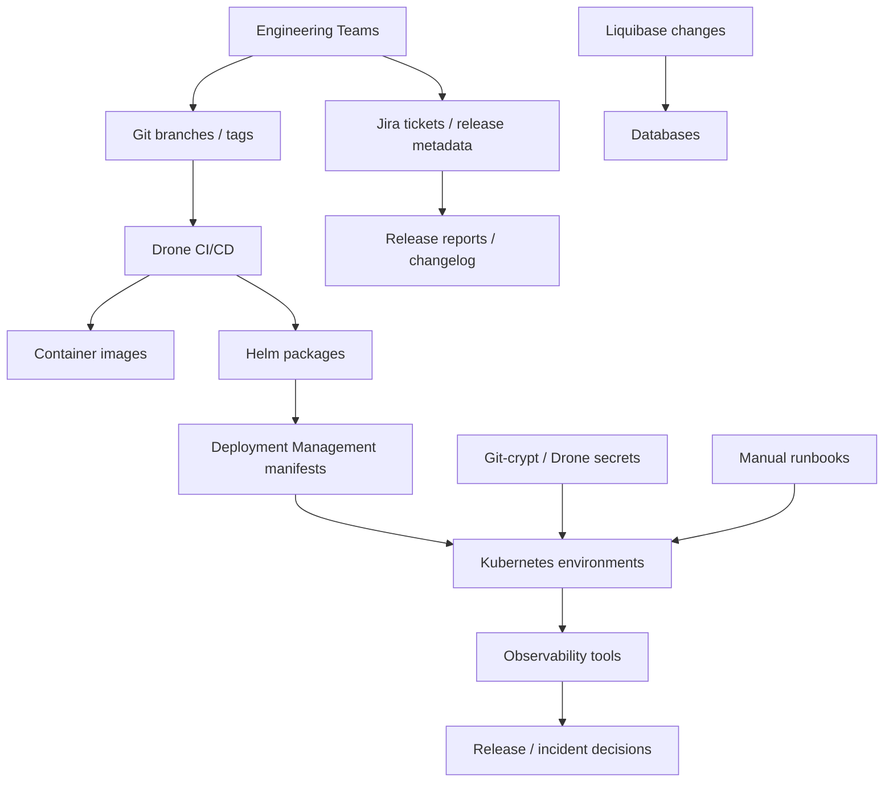

### Release Intelligence Architecture

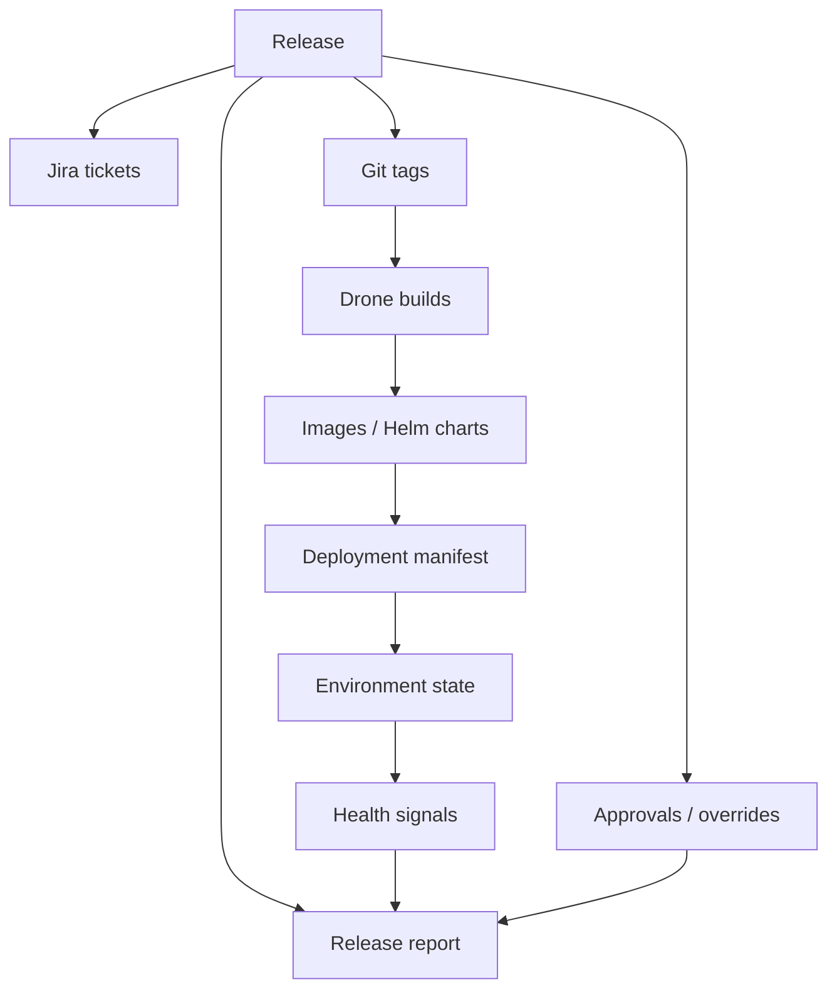

### Related Pages

- [Potential Architecture Review Notes](08-platform-and-knowledge-graph.md)
- [Architecture Alignment Considerations](08-platform-and-knowledge-graph.md)
- [Criticality Challenge Notes](08-platform-and-knowledge-graph.md)

### Criticality Challenge Notes

Status: Optional review note / working reference.

### Suitability Assessment

| Improvement Area | Suitable | Needs Modification | Not Recommended | Reason |
| --- | --- | --- | --- | --- |
| Stabilise release operating model first | Yes | No | No | Reduces systemic risk before structural change. |
| Branch strategy simplification | No | Yes | No | Good later, unsafe before validation and rollback are proven. |
| Release branch automation | Yes | Yes | No | Pilot only; scope and rerun controls required. |
| Drone migration for release scripts | Yes | Yes | No | Improves auditability but must not bypass approvals. |
| Strict validation framework | Yes | Yes | No | Strong control; dry-run first to avoid surprise release blocks. |
| Changed-chart deployment | No | Yes | No | Needs dependency analysis and audited exclusions. |
| Release reporting | Yes | Yes | No | Needs retention, classification and evidence ownership. |
| Release ownership model | Yes | Yes | No | Role model exists; named people/backups still required. |
| Event-driven architecture | Yes | Yes | No | Useful, but needs replay, DLQ and reconciliation controls. |
| Rollback recommendations | Yes | Yes | No | Needs a distinction between rollback, fix-forward and data constraints. |
| Environment promotion model | Yes | Yes | No | Strong if approvals and readiness gates are explicit. |
| Progressive delivery | No | Yes | No | Defer broad use; service-by-service evaluation. |
| GitOps | No | Yes | No | Non-prod evaluation only until source-of-truth discipline is proven. |
| Approval workflow automation | No | Yes | No | Automate evidence, not authority, until SoD is proven. |

### Scale And Criticality Scores

Scores: 1 poor, 5 excellent.

| Improvement Area | Operational Safety | Blast Radius | Recovery Complexity | Human Factors | Auditability | Security Impact | Platform Complexity |
| --- | --- | --- | --- | --- | --- | --- | --- |
| Strict validation | 5 | 4 | 4 | 4 | 5 | 4 | 3 |
| Named ownership | 5 | 5 | 5 | 5 | 5 | 4 | 4 |
| Drone automation pilot | 4 | 3 | 3 | 3 | 4 | 3 | 3 |
| Branch cutover | 3 | 2 | 3 | 3 | 4 | 3 | 3 |
| Changed-chart deployment | 3 | 2 | 2 | 3 | 4 | 3 | 3 |
| Hotfix/rollback process | 5 | 4 | 3 | 4 | 5 | 4 | 3 |
| Production GitOps | 2 | 2 | 2 | 3 | 4 | 3 | 2 |
| Progressive delivery auto-rollback | 2 | 2 | 2 | 2 | 4 | 3 | 2 |

### Automation Assumption Challenge

| Assumption | Why It May Be Valid | Why It May Be Dangerous | Required Safeguards |
| --- | --- | --- | --- |
| More automation is always better. | Removes manual inconsistency. | Automates mistakes at scale. | Pilot, dry-run, approval gates, kill switch. |
| Fewer approvals are better. | Reduces waiting and handoffs. | Removes human accountability in high-impact releases. | Keep production approval, SoD and emergency process. |
| Faster deployment is better. | Shorter lead time and less batching. | Can reduce review time and amplify blast radius. | Risk-based gates, scope controls, rollback drill. |
| GitOps is always better. | Improves drift detection and audit. | Introduces new controllers and operational model. | Non-prod pilot, RBAC, drift alerts, manual sync policy. |
| Progressive delivery is always better. | Can limit traffic exposure. | Requires high-quality telemetry and service architecture readiness. | Service eligibility, SLOs, manual review before auto-rollback. |
| Centralisation is better. | Reduces tool switching and improves visibility. | Creates attractive target and potential single point of control. | Read-only first, least privilege, audit, no bypass. |

### Rollback Assumption Challenge

| Area | Challenge | Recommendation |
| --- | --- | --- |
| Data consistency | Application rollback can conflict with schema/data state. | Record rollback eligibility per release. |
| Liquibase | Changesets may be forward-only or destructive. | Require rollback block or documented fix-forward plan. |
| Cross-system dependencies | One service rollback can break downstream compatibility. | Maintain dependency map and compatibility checks. |
| Partial rollback | Mixed versions may be worse than failed release. | Define service grouping and rollback units. |
| Event replay | Kafka/event consumers may process incompatible events. | Include event schema compatibility and replay plan. |
| Downstream systems | External consumers may observe already-emitted effects. | Treat rollback as operational decision, not pure technical reversal. |

### Related Pages

- [Potential Architecture Review Notes](08-platform-and-knowledge-graph.md)
- [Recommendation Inventory](08-platform-and-knowledge-graph.md)
- [Additional Enterprise Concerns To Confirm](08-platform-and-knowledge-graph.md)
- [Summary Assessment And Open Risks](08-platform-and-knowledge-graph.md)

### Additional Enterprise Concerns To Confirm

Status: Optional review note / working reference.

### Disaster Recovery And Operational Resilience

| Concern | Gap | Possible Discussion Point |
| --- | --- | --- |
| Release evidence recovery | Evidence retention and recovery target not fully specified. | Define RTO/RPO for release reports, approval evidence and generated artefacts. |
| Release evidence recovery | Generated reports, approvals and pipeline evidence need recovery targets. | Consider a restore test for release evidence before production rollout. |
| Automation outage | Release automation could become operational dependency. | Keep manual break-glass path documented and confirmed. |
| Automation failure | Rerun guidance exists but needs incident-level playbook. | Add automation failure runbook with stop/continue criteria. |

### Multi-Region And Capacity Planning

| Concern | Gap | Possible Discussion Point |
| --- | --- | --- |
| Multi-region | Not enough discussion of deployment topology and regional resilience. | Document whether Cerberus requires active/active, active/passive or single-region controls. |
| Release evidence volume | Report, pipeline and audit evidence retention volume is not yet modelled. | Create volume model: releases/month, artefacts, retention window and audit exports. |
| Cost control | Storage and compute costs for retained release evidence could grow. | Add storage tiering, retention windows and cost guardrails. |

### Data Sovereignty, Security Accreditation And Compliance

| Concern | Gap | Possible Discussion Point |
| --- | --- | --- |
| Data sovereignty | Release evidence hosting location not specified. | Confirm UK hosting, approved regions and cross-border restrictions. |
| Security accreditation | Review notes mention classification but not full accreditation path. | Define security accreditation and threat modelling steps if the scope proceeds. |
| Sensitive topology | Release metadata can expose platform topology and operational patterns. | Classify topology, deployment and incident metadata. |
| Personnel data | Deployer names, ownership and audit logs may contain personal data. | Define lawful basis, retention and subject access handling. |
| Privileged access | Admin access model needs stronger controls. | Add privileged access workflow, break-glass and quarterly review. |

### Incident Command, Change Advisory And Ownership At Scale

| Concern | Gap | Possible Discussion Point |
| --- | --- | --- |
| Incident command | Rollback/fix-forward decision owner exists conceptually but not operationally. | Define incident roles, decision authority and communication channels. |
| Change advisory | CAB/emergency change relationship not explicit. | Map normal release, emergency hotfix and rollback to change processes. |
| Service ownership at scale | Ownership map needs to remain current across hundreds of services. | Add owner attestation cadence and stale-owner alerts. |
| Separation of duties | Automation expansion could blur approver/operator roles. | Enforce SoD in workflow and audit. |
| Operational training | New automation and reports may confuse teams without rehearsal. | Run release simulation and rollback drills before production rollout. |

### Related Pages

- [Potential Architecture Review Notes](08-platform-and-knowledge-graph.md)
- [Criticality Challenge Notes](08-platform-and-knowledge-graph.md)
- [Operating Model And RACI Notes](06-ownership-and-approvals.md)
- [Potential Future Architecture Review Considerations](08-platform-and-knowledge-graph.md)

### Summary Assessment And Open Risks

Status: Optional review note / working reference.

### Working Architecture Scorecard

| Area | Score | Rationale |
| --- | --- | --- |
| Architecture Quality | 7 / 10 | Strong diagnosis and possible target shape, but immediate vs future scope needs stronger gating. |
| Technical Feasibility | 7 / 10 | Release validation and Drone automation are feasible; automation expansion needs capacity and security design. |
| Business Value | 8 / 10 | Clear benefits around release safety, audit and incident response. |
| Governance | 6 / 10 | Decision register and RACI exist, but named owners and formal confirmations are missing. |
| Operational Readiness | 5 / 10 | Hotfix, rollback, DR, incident command and runbooks still need testing. |
| Reader Readiness | 7 / 10 | Good material exists; one-page framing is clearer. |
| Formal Review Readiness | 6 / 10 | Near-term scope may be discussable; full future platform scope would need separate evidence and ownership. |

### Top 10 Strengths

1. Correctly identifies that branching is not the root problem.
2. Emphasises release state visibility, repeatability and auditability.
3. Strong decision register and proposed confirmation flow.
4. Practical near-term validation and Drone automation focus.
5. Recognises hotfix and rollback as production gates.
6. Treats release reports as auditable evidence, not informal notes.
7. Future architecture ideas are clearly separated from immediate release controls.
8. Includes business case and operational benefits.
9. Acknowledges maturity phasing and future options.
10. Good foundation for team discussion and possible later review.

### Top 10 Risks

1. Future-state ideas may be mistaken for immediate implementation scope.
2. Named owners and backups are still missing.
3. Branch cutover could happen before operational readiness.
4. Rollback may be unrealistic for database/data/event changes.
5. Changed-chart deployment could miss hidden dependencies.
6. Poor metadata could produce wrong release conclusions.
7. Control plane trigger capability could bypass separation of duties.
8. Automation recommendations could create unsafe reliance without human approval.
9. DR, accreditation and capacity planning need stronger treatment.
10. Business benefits need baseline measurement.

### Top 10 Improvement Areas

1. Confirm near-term foundation scope separately from future platform scope.
2. Assign named owners and backups.
3. Add strict validation dry-run and failure taxonomy.
4. Run rollback and fix-forward drills.
5. Add incident command and emergency change model.
6. Add NFR and DR targets with evidence.
7. Add capacity model for graph/control-plane assumptions.
8. Add security classification and RBAC model across all release metadata.
9. Define prohibited automation behaviours.
10. Keep formal review conditions and deferred items explicit.

### Formal Review Considerations

If this were reviewed formally, the near-term release-foundation items would likely be more suitable for discussion than the future-state platform items. Formal approval would require named owners, evidence, clear guardrails and team agreement.

Reasoning:

The documentation has a strong understanding of the release engineering problem and the proposed near-term controls appear directionally sensible. However, under border-security criticality, ownership, rollback testing, DR, capacity, accreditation and separation-of-duties controls would likely need confirmation before the material could be treated as an agreed operating model.

### Border-Security Reality Check

| Category | Strongly Support | Modify | Defer |
| --- | --- | --- | --- |
| Release safety | Strict validation, release scope, named ownership, environment gates. | Changed-chart deployment with dependency controls. | Branch simplification until readiness proven. |
| Automation | Drone pilot, rerun safety, alerting. | Automation only with human gates. | Fully automated production promotion. |
| Recovery | Hotfix and rollback runbooks, fix-forward guide. | Rollback eligibility by release. | Automatic rollback for complex stateful services. |
| Intelligence | Release reports and audit evidence. | Release-context dashboards after evidence quality is proven. | Automated release decisions. |
| Platform control | Existing Drone/deployment-management controls. | Controlled workflow after SoD confirmation. | Central trigger control until separate formal review. |
| Modernisation | SBOM, image signing, observability dashboards. | Tooling pilots in non-prod. | Production GitOps/progressive delivery at scale. |

### Summary Position

If Cerberus genuinely processes 5+ billion records per month and supports UK border-security operations:

- Strongly support: release validation, ownership, environment readiness, hotfix/rollback testing, audit evidence, SBOM generation and controlled Drone automation.
- Modify: branch cutover, changed-chart deployment, GitOps and progressive delivery so they are gated, piloted and evidence-based.
- Defer until much later: central trigger control, production-wide GitOps, auto-rollback and progressive delivery.

Given the criticality and scale of the platform, any change should prefer controlled evolution, auditability and operational safety over rapid restructuring. The immediate discussion should stay on release safety and auditability, with future intelligence capabilities considered only after the foundation proves itself.

### Related Pages

- [Potential Architecture Review Notes](08-platform-and-knowledge-graph.md)
- [Current Understanding And Architecture Quality Observations](08-platform-and-knowledge-graph.md)
- [Criticality Challenge Review](08-platform-and-knowledge-graph.md)
- [Potential Future Architecture Review Considerations](08-platform-and-knowledge-graph.md)
