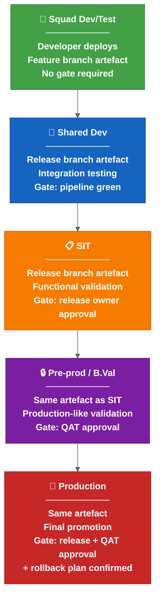

# Environment Promotion And Deployment Strategy

| Field | Value |
| --- | --- |
| Owner | Benan Aktas |
| Status | In Review |
| Created | 2026-06-09 |
| Labels | future-topics, platform-engineering, environment-promotion, deployment-strategy |

> This is a future evaluation topic (Phase 5+). It should not block Phase 0–4 release-process improvements.

---

## Summary

This page details the environment promotion model and deployment strategy options for Cerberus. It covers the current promotion path, possible promotion rules, gate definitions and deployment strategy comparisons (rolling update, blue-green, canary).

---

## 1. Environment Promotion Model

### Current State

The current promotion path is understood but not formally documented as a model:

```text
Squad dev/test → Shared dev → SIT → B.Val / Pre-prod → Production
```

Promotion today is largely manual: a person triggers deployment to the next environment after the previous one passes some form of validation.

### Possible Promotion Model



**Colour key:** Green = squad dev/test · Blue = shared dev · Orange = SIT · Purple = pre-prod / B.Val · Red = production.

### Promotion Rules

| Rule | Description |
| --- | --- |
| Immutable artefact | The same container image and Helm package moves through all environments. Never rebuild for a higher environment. |
| Environment-specific config only | Values files, secrets and feature flags are the only things that change between environments. |
| Gate before promotion | Each promotion requires a defined gate to pass. No silent auto-promote to production. |
| Audit trail | Every promotion records: who, when, which version, which gate passed, link to pipeline. |
| No skipping | Cannot promote to production without passing through pre-prod. Exception: confirmed emergency hotfix with explicit release-owner sign-off. |

### Promotion Gate Matrix

| Environment | Trigger | Gate | Approver |
| --- | --- | --- | --- |
| Squad dev/test | Developer push/trigger | Pipeline green | None (self-service) |
| Shared dev | Merge to release branch | Pipeline green + chart update complete | Automated |
| SIT | Release owner decision | Release report generated + changed charts identified | Release owner |
| Pre-prod / B.Val | QAT progression | SIT functional validation complete | QAT lead |
| Production | Release approval | QAT approved + rollback plan + release report final | Release owner + QAT |

---

## 2. Deployment Strategy

### Current State

The current deployment approach appears to be a standard Kubernetes **rolling update**: pods are replaced in sequence, health checks confirm readiness, and Helm manages the upgrade.

This works but has limitations:
- If health checks pass but functional issues exist, the full rollout completes before the problem is detected.
- Rollback requires manual `helm rollback` or redeployment.
- There is no traffic-based validation before full rollout.

### Deployment Strategy Options

```mermaid
%%{init: {'theme': 'base', 'themeVariables': {'lineColor': '#5f6368'}}}%%

flowchart TD
  subgraph CURRENT["Current: Rolling Update"]
    R1["Replace pods sequentially"]:::current
    R2["Health check gates"]:::current
    R3["Full rollout or manual rollback"]:::current
    R1 --> R2 --> R3
  end

  subgraph NEXT["Near-term: Blue-Green"]
    B1["Deploy new version alongside old"]:::next
    B2["Validate new version (no traffic)"]:::next
    B3["Switch traffic atomically"]:::next
    B4["Instant rollback: switch back"]:::next
    B1 --> B2 --> B3 --> B4
  end

  classDef current fill:#455a64,stroke:#37474f,color:#fff,font-weight:bold
  classDef next fill:#1565c0,stroke:#0d47a1,color:#fff,font-weight:bold
```



**Colour key:** Grey = current rolling-update model · Blue = near-term blue-green option.

### Strategy Comparison

| Strategy | Rollback Speed | Infrastructure Cost | Complexity | Best For |
| --- | --- | --- | --- | --- |
| Rolling update | Minutes (manual) | 1x | Low | Simple services, low traffic |
| Blue-green | Instant (traffic switch) | 2x during deploy | Medium | Stateless services, critical path |

### Possible Adoption Path

```text
Phase 1 (Now): Rolling update with documented manual rollback procedure.
Phase 2 (After automation stable): Blue-green for critical services (API gateway, core services).
```

---

## Related Pages

- [Future Platform Topics — Parent](08-platform-and-knowledge-graph.md)
- [Observability, SBOM And Supply Chain Security](08.2-observability-sbom-and-supply-chain-security.md)
- [GitOps Readiness](08.3-gitops-readiness.md)
- [Proposed Release Automation Flow](03-proposed-release-automation-flow.md)

---

Feedback or questions? Contact the page owner or comment below.
