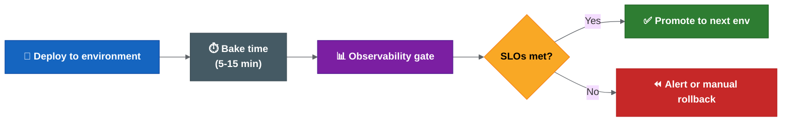

# Observability, SBOM And Supply Chain Security

| Field | Value |
| --- | --- |
| Owner | Benan Aktas |
| Status | In Review |
| Created | 2026-06-09 |
| Labels | future-topics, platform-engineering, observability, sbom, supply-chain-security |

> This is a future evaluation topic (Phase 5+). It should not block Phase 0–4 release-process improvements.

---

## Summary

This page covers observability gates for release validation and SBOM/supply-chain security controls. It includes metric definitions, implementation options, SLSA framework levels, possible tooling and a maturity roadmap summary.

---

## 3. Observability Gates

### Current State

The current process checks:
- Pods started (health check).
- Deployment completed (Helm reports success).
- Basic monitoring may exist but is not integrated into the release pipeline.

There is no automated observability gate that validates release health against SLOs before or after promotion.

### Possible Target: Observability-Driven Release Validation



**Colour key:** Blue = deploy step · Grey = bake/wait period · Purple = observability gate · Yellow = SLO decision · Green = promote · Red = alert/manual rollback.

### Observability Gate Metrics

| Metric | What It Measures | Threshold Example | Source |
| --- | --- | --- | --- |
| Error rate (5xx) | Service returning errors | < 0.1% over bake period | Prometheus / OpenTelemetry |
| Latency P99 | Slowest requests | < 500ms (or < 2x baseline) | Prometheus / Datadog |
| Success rate | Requests completing successfully | > 99.9% | Application metrics |
| Pod restarts | Stability after deploy | 0 restarts in bake period | Kubernetes metrics |
| SLO burn rate | Rate of SLO budget consumption | < 1x normal burn | SLO platform |
| Business metric | Domain-specific health | No anomaly detected | Custom metrics |

### Implementation Options

| Approach | How It Works | Complexity |
| --- | --- | --- |
| Manual observability check | Human checks dashboards after deploy | Low (current state) |
| Pipeline metric query | Drone step queries Prometheus after deploy, fails if threshold breached | Medium |
| Keptn / Dynatrace | Full SLO-based quality gate evaluation | High |

### Possible Adoption Path

```text
Phase 1 (Now): Document key metrics and dashboards per service. Establish SLO targets.
Phase 2 (After Drone automation): Add a pipeline step that queries error rate and latency after deploy. Alert on breach.
```

### OpenTelemetry Integration

For services instrumented with OpenTelemetry:

```text
Traces → identify slow spans and error sources after deploy.
Metrics → feed observability gates (error rate, latency, throughput).
Logs → correlate errors with specific release version/commit.
```

The release report should include a link to the observability dashboard filtered by the deployed version, so reviewers can see the health state at a glance.

---

## 5. SBOM And Supply Chain Security

### Current State

Current security posture:
- Trivy vulnerability scanning runs during artefact creation.
- Sonar code quality scanning runs.
- No SBOM generation observed.
- No artefact signing observed.
- No provenance attestation observed.

### Why Supply Chain Security Matters

```text
A release is only trustworthy if you can prove:
1. What source code produced it (provenance).
2. What dependencies are inside it (SBOM).
3. That it was not tampered with after build (signing).
4. That known vulnerabilities were assessed (scanning).
```

The current process covers (4) but not (1), (2) or (3).

### SLSA Framework Levels

SLSA (Supply-chain Levels for Software Artifacts) defines maturity levels:

| Level | Requirement | Current State |
| --- | --- | --- |
| SLSA 1 | Build process exists and produces provenance | Partial (Drone builds, no provenance doc) |
| SLSA 2 | Build service is hosted (not local), provenance is signed | Partial (Drone is hosted, no signing) |
| SLSA 3 | Build platform is hardened, provenance is non-forgeable | Not met |
| SLSA 4 | Two-party review, hermetic builds | Not met |

### Possible Supply Chain Controls


**Colour key:** Blue = build step · Purple = supply-chain security controls · Green = deployment-time verification.

### Tool Options

| Capability | Tool Options | Integration Point |
| --- | --- | --- |
| SBOM generation | Syft, Trivy, Docker Scout | Build pipeline (after image build) |
| Vulnerability scan | Trivy (already in use), Grype | Build pipeline + periodic rescan |
| Image signing | Cosign (Sigstore), Notation (OCI) | Build pipeline (after push to registry) |
| Signature verification | Cosign verify, Kyverno admission policy | Deployment time (admission controller) |
| Provenance attestation | SLSA GitHub/GitLab generators, in-toto | Build pipeline (metadata generation) |
| Dependency pinning | Renovate (already mentioned), Dependabot | Ongoing (MR-based updates) |

### Possible Adoption Path

```text
Phase 1 (Quick win): Generate SBOM with Trivy during existing scan step. Store as pipeline artefact.
                      Cost: minimal (Trivy already runs, add --format spdx-json flag).

Phase 2 (Medium-term): Sign container images with Cosign after push to registry.
                        Store signatures in the same registry (OCI artefact).
                        Add Cosign verify step before deployment.

Phase 3 (Long-term): Add Kyverno or OPA Gatekeeper admission policy that rejects unsigned images.
                      Generate SLSA provenance attestation.
                      Periodic SBOM rescan for newly discovered CVEs in deployed images.
```

### Quick Win: SBOM Generation

Adding SBOM generation to the existing pipeline requires one additional command:

```bash
## After image build and before push
trivy image --format spdx-json --output sbom.spdx.json myregistry/myservice:${TAG}
```

This produces a machine-readable inventory of every dependency in the image. It can be stored alongside the release report and used for:
- Post-release CVE triage (which services are affected by a new CVE?).
- Compliance and audit (what open-source licences are in production?).
- Incident response (does our production contain Log4Shell?).

---

## Maturity Roadmap Summary


**Colour key:** Green = now / foundation work · Blue = next maturity step · Purple = future option.

---

## Related Pages

- [Future Platform Topics — Parent](08-platform-and-knowledge-graph.md)
- [Environment Promotion And Deployment Strategy](08.1-environment-promotion-and-deployment-strategy.md)
- [GitOps Readiness](08.3-gitops-readiness.md)
- [Proposed Release Automation Flow](03-proposed-release-automation-flow.md)

---

Feedback or questions? Contact the page owner or comment below.
