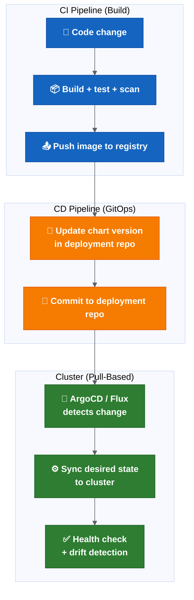

# GitOps Readiness

| Field | Value |
| --- | --- |
| Owner | Benan Aktas |
| Status | In Review |
| Created | 2026-06-09 |
| Labels | future-topics, platform-engineering, gitops, argocd |

> This is a future evaluation topic (Phase 5+). It should not block Phase 0–4 release-process improvements.

---

## Summary

This page assesses GitOps readiness for the Cerberus platform. It compares push-based (current) and pull-based (GitOps) deployment models, evaluates ArgoCD vs Flux, defines prerequisites and outlines a possible adoption path.

---

## 4. GitOps Readiness

### Current State

The current model is partially GitOps-aligned:
- Cerberus deployment-management repo holds chart versions and deployment state (Git as source of truth).
- Changes are applied via Drone pipelines (push-based).
- Deployment is triggered by manual promotion or pipeline step.

This is **push-based CI/CD**, not full GitOps. The key difference:

| Aspect | Push-Based (Current) | Pull-Based (GitOps) |
| --- | --- | --- |
| Who applies changes | Pipeline pushes to cluster | Controller in cluster pulls from Git |
| Drift detection | None (cluster may drift from Git) | Continuous (controller reconciles) |
| Rollback | Manual Helm rollback | Revert Git commit → controller syncs |
| Audit trail | Pipeline logs | Git history (complete, immutable) |
| Secret handling | Injected at deploy time | Sealed Secrets or External Secrets Operator |

### GitOps Target Architecture



**Colour key:** Blue = CI build pipeline · Orange = deployment-repo update · Green = GitOps cluster reconciliation.

### ArgoCD vs Flux Comparison

| Feature | ArgoCD | Flux |
| --- | --- | --- |
| UI | Rich web UI with app visualisation | Minimal (CLI + Grafana dashboards) |
| Multi-tenancy | Application projects with RBAC | Namespace-based tenancy |
| Helm support | Native (renders in-cluster) | Native (HelmRelease CRD) |
| Rollback | One-click in UI or CLI | Git revert → auto-sync |
| Notifications | Built-in (Slack, webhook, etc.) | Notification controller (separate) |
| Progressive delivery | Via Argo Rollouts (same ecosystem) | Via Flagger |
| Learning curve | Medium | Medium |
| Ecosystem fit | Better if also using Argo Workflows / Rollouts | Better if purely Git-centric |

### Possible GitOps Adoption Path

```text
Phase 1 (Now): Treat the deployment-management repo as the GitOps source of truth.
              No manual changes to cluster state. All changes via Git.
              This is achievable without installing ArgoCD.

Phase 2 (Medium-term): Install ArgoCD in non-prod.
                        Configure it to sync from the deployment-management repo.
                        Validate drift detection and auto-sync behaviour.
                        Keep Drone for CI (build + test + push image).
                        Let ArgoCD handle CD (sync chart versions to cluster).

Phase 3 (Long-term): ArgoCD in production.
                      Remove Drone deployment steps (Drone only builds).
                      Add Argo Rollouts for progressive delivery.
                      Full GitOps: rollback = git revert.
```

### Prerequisites Before GitOps Adoption

- Deployment-management repo would need to be the single source of truth, with no manual kubectl/helm overrides.
- Secrets would need to be handled without putting plain values in Git, for example Sealed Secrets or External Secrets Operator.
- Branch protection on deployment-management repo would need to prevent unauthorized changes.
- ArgoCD RBAC would need to align with release ownership model.
- Monitoring would need to detect sync failures and drift.

---

## Related Pages

- [Future Platform Topics — Parent](08-platform-and-knowledge-graph.md)
- [Environment Promotion And Deployment Strategy](08.1-environment-promotion-and-deployment-strategy.md)
- [Observability, SBOM And Supply Chain Security](08.2-observability-sbom-and-supply-chain-security.md)
- [Unified Control Plane Future Concept](08.5-unified-control-plane-future-concept.md)

---

Feedback or questions? Contact the page owner or comment below.
