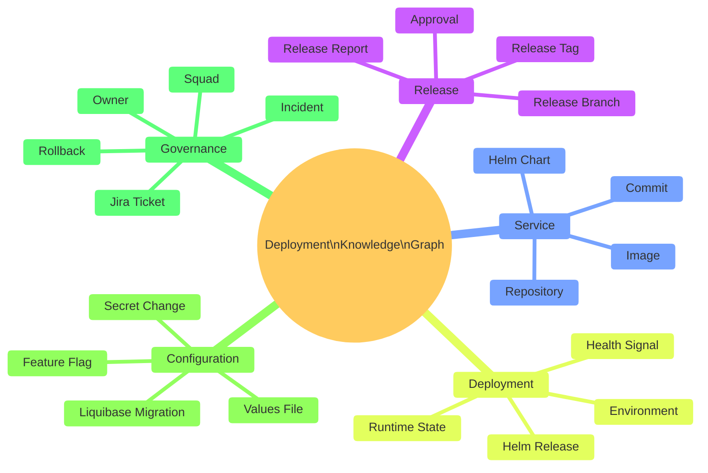
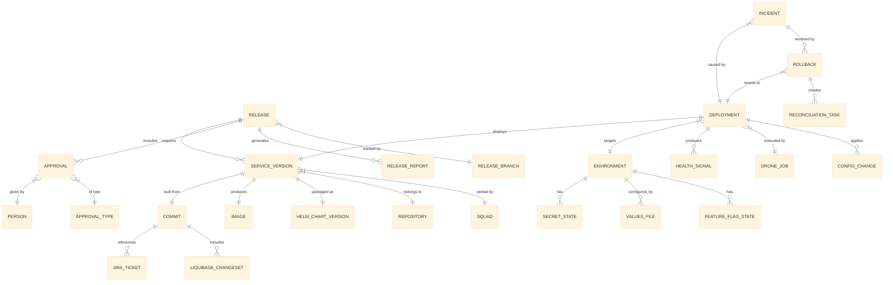

# Knowledge Graph And Release Intelligence

| Field | Value |
| --- | --- |
| Owner | Benan Aktas |
| Status | In Review |
| Created | 2026-06-09 |
| Labels | future-topics, knowledge-graph, release-intelligence, cerberus |

> This is a future evaluation topic (Phase 5+). It should not block Phase 0–4 release-process improvements.

---

## Summary

A Deployment Knowledge Graph could model relationships between releases, services, commits, tags, images, charts, environments, deployments, approvals, incidents and configuration changes as a connected graph. It would not replace existing systems — it would read metadata from those systems and help answer cross-system questions faster.

This document covers the design, domain model, implementation, operations, technology options and business case for this future capability.

---

## What It Is

A knowledge graph could model relationships between releases, services, commits, tags, images, charts, environments, deployments, approvals, incidents and configuration changes.

It would not replace Git, Drone, Jira, Kubernetes, Helm or deployment-management. It would read metadata from those systems and help answer cross-system questions faster.

### Key Differentiator From A Dashboard

A dashboard shows pre-defined views. A knowledge graph answers arbitrary questions about relationships. "Show me all services affected by Jira ticket MMA-1234 across all environments, including which Liquibase migrations ran and which approvals were recorded" is a graph traversal, not a dashboard panel.

---

## Business Value

| Value Area | Description | Beneficiary |
| --- | --- | --- |
| Incident investigation speed | Instantly trace what changed in a failing environment. | Platform, on-call, incident leads |
| Release audit compliance | Prove exactly what was deployed, when, by whom, with what approval. | Compliance, release owners, audit |
| Rollback decision support | Know immediately what rollback targets exist and what constraints apply. | Release owners, incident leads |
| Release scope visibility | See all changes (code, config, secrets, DB) in one connected view. | Release owners, squad leads |
| DORA metrics derivation | Compute deployment frequency, lead time, failure rate, MTTR from graph edges. | Engineering leadership |
| Impact analysis | Before deploying, understand downstream dependencies and blast radius. | Architects, platform team |
| Ownership clarity | Every node has an owner; orphaned services/charts are immediately visible. | Platform governance |
| Environment drift detection | Compare intended state (deployment-management) vs actual state (Kubernetes). | Platform engineers |

---

## Architecture Principles

1. **Read-model, not source of truth.** The graph is derived from existing sources. It never becomes the primary store for any domain.
2. **Event-driven ingestion.** Changes flow into the graph via events. No polling where avoidable.
3. **Eventually consistent.** The graph may lag seconds behind source systems. This is acceptable for operational queries; not for deployment control.
4. **Schema-flexible.** New entity types and relationships can be added without schema migrations.
5. **Query-first design.** The graph schema is shaped by the questions it must answer, not by the source system schemas.
6. **Immutable event history.** Raw ingested events are retained for replay, audit and recomputation.
7. **Least privilege.** The graph does not store raw secrets. It stores metadata about secret changes (what changed, when, by whom) without values.
8. **Incremental build.** Start with a subset of entities and relationships; expand as sources mature.

---

## Domain Model



---

## Entity Relationship Model



### Core Entities

| Entity | Description | Source of Truth |
| --- | --- | --- |
| Release | A planned or completed release cycle. | Jira + deployment-management |
| Service Version | A specific tagged version of a service. | Git tag + image registry |
| Commit | A Git commit with ticket reference. | Git |
| Image | A built container image. | Image registry (Artifactory) |
| Helm Chart Version | A packaged Helm chart. | Helm registry |
| Deployment | An act of deploying a version to an environment. | Drone + Kubernetes |
| Environment | A target deployment environment. | Infrastructure/platform config |
| Approval | A recorded approval decision. | Jira / QAT workflow / future control plane |
| Jira Ticket | A work item with release metadata. | Jira |
| Liquibase Changeset | A database migration. | Liquibase changelog in Git |
| Incident | A production or environment issue. | Incident management system |
| Rollback | A decision to revert to a previous deployment. | Audit record |
| Config Change | A change to values, flags or secrets metadata. | Git + secrets management |

---

## Event-Driven Ingestion Model

The graph should be populated through a mixture of ingestion patterns:

- **Webhooks** — real-time events from GitLab, Jira, Drone
- **Pipeline-emitted events** — custom Drone steps publishing structured events
- **Kubernetes watch events** — deployment and pod state changes
- **Scheduled reconciliation jobs** — periodic full-state comparison against sources
- **Backfill jobs** — historical data import for initial population
- **Manual operational events** — rollback decisions, override approvals, manual deployments

### Ingestion Flow

```text
Source system event
  → Event gateway
  → Kafka topic
  → Validation and enrichment
  → Entity resolver
  → Graph update
  → Search index update
  → Audit event stored
```

### Event Types

| Event Type | Source | Example Payload | Graph Update |
| --- | --- | --- | --- |
| `commit.pushed` | GitLab webhook | Commit SHA, message, author, branch, ticket refs | Create/update Commit node, link to Repository and JiraTicket |
| `tag.created` | GitLab webhook | Tag name, commit SHA, branch | Create ServiceVersion node, link to Commit |
| `image.published` | Image registry webhook | Image name, tag, digest, built-at | Create Image node, link to ServiceVersion |
| `chart.published` | Helm registry event | Chart name, version, app version | Create HelmChart node, link to ServiceVersion |
| `manifest.updated` | deployment-management webhook | Chart versions changed, target environment | Update deployment intent, link chart versions to Release |
| `deployment.started` | Drone / K8s event | Service, version, environment, job ID | Create Deployment node (status: in-progress) |
| `deployment.succeeded` | K8s watch / Drone | Service, version, environment, pod status | Update Deployment status to succeeded |
| `deployment.failed` | K8s watch / Drone | Service, version, environment, error | Update Deployment status to failed, create alert |
| `ticket.updated` | Jira webhook | Ticket key, status, release label, GitLab tag field | Create/update JiraTicket node, link to Release |
| `approval.recorded` | Jira / workflow webhook | Approver, type, timestamp, release | Create Approval node, link to Release and Person |
| `incident.created` | Incident system webhook | Incident ID, severity, affected services | Create Incident node, link to Service and Deployment |
| `rollback.executed` | Drone / manual event | From version, to version, decided-by, environment | Create Rollback node, link Deployments |
| `liquibase.executed` | Pipeline event | Changeset ID, author, filename, rollback block | Create LiquibaseChangeset node, link to Commit |
| `secret.rotated` | Secrets management event | Secret name, environment, rotated-by (no value) | Create SecretChange node (metadata only) |

### Ingestion Quality Principles

| Principle | Description |
| --- | --- |
| **Idempotency** | Processing the same event twice must produce the same graph state. |
| **Replayability** | All raw events are retained in the immutable audit store. The graph can be rebuilt from scratch by replaying the event log. |
| **Ordering** | Events are partitioned by entity key (e.g., service name) to preserve causal ordering within an entity. Cross-entity ordering is eventually consistent. |
| **Deduplication** | Events carry a unique event ID. The entity resolver rejects duplicates. |
| **Schema versioning** | Events carry a schema version field. Processors handle multiple versions during migration. |
| **Event retention** | Raw events retained for minimum 2 years in cold storage. Hot events retained for 90 days. |
| **Failed event handling** | Failed events route to a dead-letter queue. Alerting fires if DLQ depth exceeds threshold. Manual review and resubmission supported. |
| **Reconciliation jobs** | Scheduled weekly per source system. Compares graph state against source, flags discrepancies, auto-corrects where safe. |

---

## Data Freshness And Trust Model

### Freshness Expectations

| Source | Ingestion Method | Expected Freshness | Trust Level | Reconciliation Method |
| --- | --- | --- | --- | --- |
| GitLab | Webhook | < 60 seconds | High (authoritative for code) | Weekly branch/tag reconciliation |
| Jira | Webhook | < 60 seconds | High (authoritative for work items) | Weekly ticket status sweep |
| Drone | Webhook | < 60 seconds | High (authoritative for builds) | Daily pipeline completion check |
| Kubernetes | Watch API | < 30 seconds | High (authoritative for runtime) | Hourly state snapshot comparison |
| deployment-management | Webhook (Git) | < 5 minutes | High (authoritative for intent) | Daily manifest hash comparison |
| Helm registry | Webhook / poll | < 5 minutes | High (authoritative for charts) | Weekly chart version listing |
| Image registry | Webhook / poll | < 5 minutes | High (authoritative for images) | Weekly image digest listing |
| Liquibase | Pipeline event | On execution only | Medium (may miss manual runs) | Weekly DB schema comparison |
| Secrets metadata | Event / poll | < 15 minutes | Medium (metadata only) | Monthly secret inventory check |
| Observability | Alert webhook / poll | < 5 minutes | Medium (health signals lag) | Continuous (alert-driven) |

### Trust Principle

> A graph answer must be explainable. Users must be able to see where each fact came from, when it was last updated and whether it has been reconciled against the source system.

---

## Source-Of-Truth Strategy

| Data Domain | Source of Truth | Graph Role |
| --- | --- | --- |
| Code and branches | Git | Read (ingest commit/tag events) |
| Work items and release scope | Jira | Read (ingest ticket/label events) |
| Build and pipeline execution | Drone | Read (ingest job completion events) |
| Helm charts and packages | Helm registry | Read (ingest chart publish events) |
| Container images | Image registry (Artifactory) | Read (ingest image push events) |
| Deployment intent | Cerberus deployment-management | Read (ingest manifest/chart changes) |
| Actual runtime state | Kubernetes | Read (poll or watch deployments/pods) |
| Approvals | Jira / future control plane | Read (ingest approval events) |
| Secrets metadata | Secrets management | Read metadata only (never values) |
| Incidents | Incident management system | Read (ingest incident events) |

> The Knowledge Graph does not become the authoritative source of record for any domain. If the graph disagrees with a source system, the source system is correct and the graph must be re-synced.

---

## Technology Options

### Graph Database

| Option | Strengths | Weaknesses | Fit |
| --- | --- | --- | --- |
| **Neo4j** | Mature, Cypher query language, rich tooling, strong community. | Operational overhead (self-hosted) or cost (Aura cloud). | Best for complex relationship queries and visualisation. |
| **Amazon Neptune** | Managed, scales well, supports both property graph and RDF. | Less mature query tooling, AWS lock-in. | Good if already AWS-native. |
| **PostgreSQL + Apache AGE** | Reuses existing Postgres skills, no new infrastructure. | Less performant for deep traversals, less mature graph tooling. | Good for start-small approach. |
| **Relational (PostgreSQL only)** | Simple, well-understood, existing team skills. | Deeply nested queries become expensive and hard to maintain. | Suitable for Phase 1 (simple joins) but limits future complex queries. |

### ADR Status

| Field | Value |
| --- | --- |
| Decision | Adopt a graph-based architecture pattern for engineering intelligence. |
| Status | **Proposed** |
| Decision type | Architecture direction |
| Technology selection | **Not yet approved** — product evaluation follows pattern validation. |
| Next step | Validate the architecture pattern through Phase 5 proof of concept before selecting a specific product. |

---

## Implementation Roadmap

| Phase | Timeframe | Scope | Technology | Outcome |
| --- | --- | --- | --- | --- |
| 0 | After release automation is stable | Define schema, agree query requirements | Design only | Documented graph schema and priority queries |
| 1 | Month 9-12 | Core entities: Release, ServiceVersion, Deployment, Environment | PostgreSQL + simple relationships | Basic "what is deployed where?" query |
| 2 | Month 12-15 | Add Jira tickets, commits, approvals | PostgreSQL + full-text search | "What is in release X?" with ticket cross-reference |
| 3 | Month 15-18 | Add Liquibase, config changes, health signals | Migrate to Neo4j if query complexity justifies | Incident investigation support |
| 4 | Month 18-24 | Add incident linking, rollback decision support | Neo4j + GraphQL API | Rollback safety assessment from graph |
| 5 | Month 24+ | DORA metrics derivation, full audit export, Backstage integration | Full platform | Complete deployment intelligence platform |

---

## Security And RBAC Model

| Role | Can View | Can Trigger | Can Override |
| --- | --- | --- | --- |
| Developer / Squad member | Own squad services, deployments, tickets | Nothing via graph | Nothing |
| Squad lead | Own squad + dependent services | Nothing via graph | Nothing |
| Release owner | All release scope, approvals, environment state | Deployment (via Drone) | Chart exclusion (with audit) |
| Platform engineer | All environments, infrastructure, pipeline state | Rerun failed jobs | Manual state correction (with audit) |
| QAT | Release scope, validation status, environment health | Nothing via graph | Nothing |
| Incident lead | All environments, deployment history, rollback targets | Rollback (via process) | Emergency override (with audit) |
| Audit / compliance | Read-only full history | Nothing | Nothing |

---

## Risks

| Risk | Impact | Mitigation |
| --- | --- | --- |
| Graph becomes stale or inaccurate | Teams lose trust and stop using it. | Automated data quality checks; reconciliation against live state. |
| Over-engineering before automation is stable | Delays the immediate release improvement work. | Do not start Phase 1 until Drone automation is green for multiple releases. |
| Schema becomes too rigid | New entity types or relationships are hard to add. | Use property graph model (inherently flexible); avoid over-normalisation. |
| Performance degrades with scale | Slow queries discourage use. | Index frequently-traversed relationships; paginate results; cache common queries. |
| Security: graph exposes sensitive deployment data | Unauthorised access to production topology. | RBAC from day one; never store secret values; audit all queries. |
| Team lacks graph database skills | Implementation quality suffers. | Start with PostgreSQL (Phase 1-2); train team; migrate to Neo4j when justified. |

---

## Decision Record

| Field | Value |
| --- | --- |
| Decision | Whether to invest in a Deployment Knowledge Graph as a long-term platform capability. |
| Status | **Proposed** |
| Approval | Pending — requires platform strategy, architecture and delivery leadership sign-off. |
| Implementation | Not approved — depends on release automation maturity (Phase 2-3 transformation). |
| Funding | Not approved — requires business case acceptance and budget allocation. |
| Target state | Future option — earliest feasible start is Month 9-12 of the transformation roadmap. |
| Prerequisites | Release automation stable in Drone; metadata standardisation complete; named platform owner assigned. |

---

## Related Pages

- [Future Platform Topics — Parent](08-platform-and-knowledge-graph.md)
- [Unified Control Plane Future Concept](08.5-unified-control-plane-future-concept.md)
- [Improvement Path And Maturity Observations](07-transformation-programme.md)
- [Proposed Release Automation Flow](03-proposed-release-automation-flow.md)

---

Feedback or questions? Contact the page owner or comment below.
