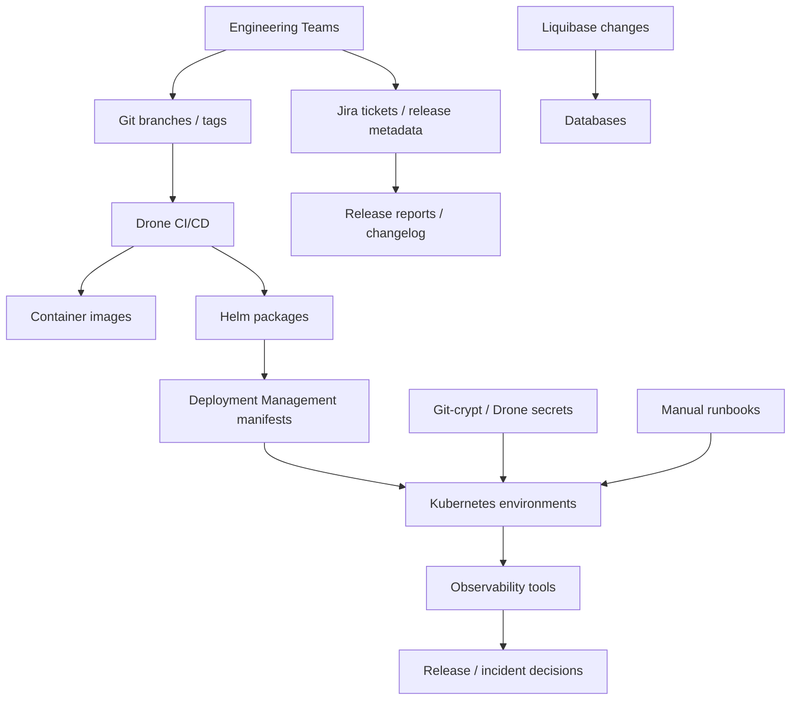
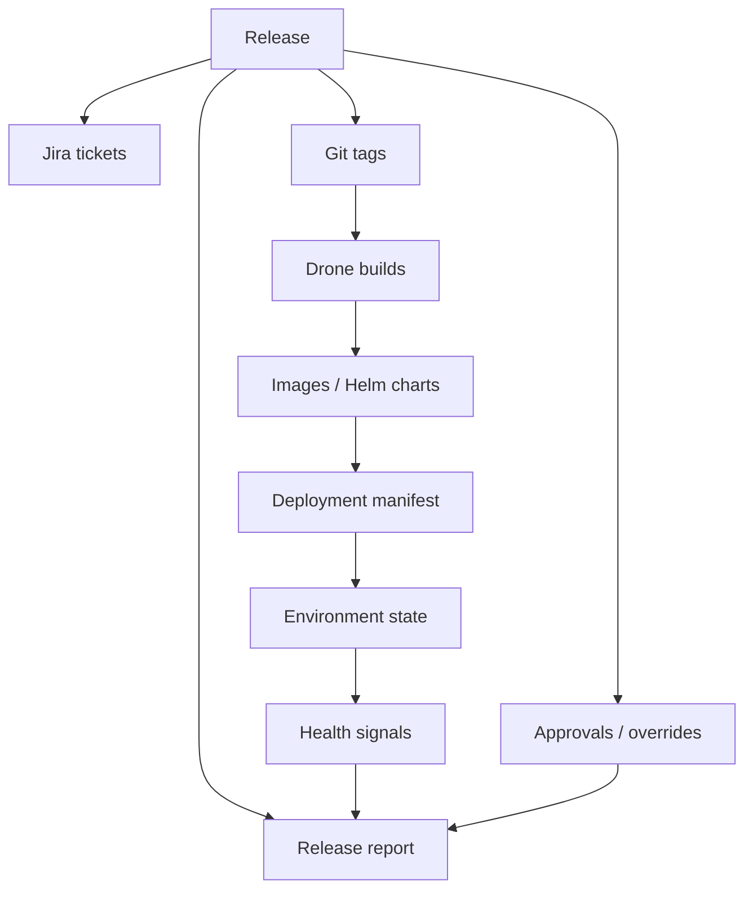

# Unified Control Plane And Architecture Review Notes

| Field | Value |
| --- | --- |
| Owner | Benan Aktas |
| Status | In Review |
| Created | 2026-06-09 |
| Labels | future-topics, platform-engineering, control-plane, architecture-review |

> This is a future evaluation topic (Phase 5+). It should not block Phase 0–4 release-process improvements.

---

## Summary

This page consolidates the Unified Deployment Control Plane concept, Cerberus architecture mapping, Engineering Copilot ideas, platform product framing, technology decision clarification, advanced architecture sections and architecture review/assessment material. All content is future evaluation only.

---

## 6. Unified Deployment Control Plane (Long-Term)

This is a long-term platform capability. It sits after release automation, validation, ownership, environment readiness and rollback maturity are stable.

A unified deployment and release control plane could become the single operational interface for releases — one place to view environment state, validate readiness, approve promotions, trigger deployments, track audit trails and support rollback decisions.

It should start read-only (dashboarding existing state) and later integrate with approval workflow, deployment triggers, rollback assistant, metrics and GitOps/progressive delivery if those are adopted.

Maturity sequence:

```text
Release automation
  → Release state visibility
  → Validation dashboard
  → Approval workflow
  → Controlled deployment trigger
  → Rollback assistant
  → GitOps / progressive delivery integration
```

This is a future option that would need separate platform strategy review. It is not part of the initial rollout.

---

## Cerberus Current Architecture Mapping

This section explains how the proposed control plane and knowledge graph relate to the existing Cerberus ecosystem. The Knowledge Graph does not replace these systems. It correlates their metadata and exposes relationship intelligence across the estate.

### Component Mapping

| Current Component | Current Role | Knowledge Graph / Control Plane Relationship |
| --- | --- | --- |
| GitLab | Source code, branches, tags, merge requests | Source of commit, tag and branch events. Graph ingests metadata (not code). |
| Jira | Work items, release labels, ticket status, approvals | Source of release scope, ticket metadata and approval records. |
| Drone CI/CD | Build, test, scan, deploy automation | Source of pipeline execution events, build artefact metadata. |
| Helm | Chart packaging, templating, deployment mechanism | Source of chart version and deployment execution metadata. |
| Cerberus deployment-management | Release intent, manifests, chart versions | Source of deployment intent and manifest state (canonical deployment truth). |
| Kubernetes | Runtime state, pods, deployments, namespaces | Source of actual deployed state and health signals. |
| Elasticsearch / OpenSearch | Log aggregation, search, operational data | Source of log-based health and error signals. |
| FDP internal processing | Data processing, rules evaluation | Source of processing completion events and data pipeline state. |
| Kafka | Event streaming, message bus | Ingestion transport layer — carries events from sources to graph. |
| Liquibase | Database schema migrations | Source of migration execution events and rollback block metadata. |
| Secrets (Git-crypt / Drone) | Secret management and injection | Source of secret change metadata (never values). |
| Observability tools | Monitoring, alerting, SLO tracking | Source of health signals and post-deployment validation data. |

### Architecture Relationship Diagram

```mermaid
%%{init: {'theme': 'base', 'themeVariables': {'lineColor': '#5f6368'}}}%%

flowchart TD
  subgraph SOURCES["Existing Cerberus Systems (Sources of Truth)"]
    GL["GitLab"]:::source
    JR["Jira"]:::source
    DR["Drone CI/CD"]:::source
    HM["Helm"]:::source
    DM["Deployment\nManagement"]:::source
    K8["Kubernetes"]:::source
    KF["Kafka"]:::source
    EL["Elastic /\nOpenSearch"]:::source
    LQ["Liquibase"]:::source
    SEC["Secrets"]:::source
    OBS["Observability"]:::source
  end

  subgraph INTELLIGENCE["Future Intelligence Layer"]
    KG["Knowledge Graph\n(relationship intelligence)"]:::graph
    CP["Unified Control Plane\n(operational interface)"]:::platform
    API["GraphQL / REST APIs"]:::api
  end

  subgraph CONSUMERS["Consumers"]
    DASH["Release Dashboard"]:::consumer
    INC["Incident Investigation"]:::consumer
    AUDIT["Audit / Compliance"]:::consumer
  end

  GL & JR & DR & HM & DM & K8 --> KF
  KF --> KG
  EL & LQ & SEC & OBS --> KG
  KG --> API
  API --> CP
  CP --> DASH & INC & AUDIT

  classDef source fill:#1565c0,stroke:#0d47a1,color:#fff,font-weight:bold
  classDef graph fill:#00695c,stroke:#004d40,color:#fff,font-weight:bold
  classDef platform fill:#6a1b9a,stroke:#4a148c,color:#fff,font-weight:bold
  classDef api fill:#f57c00,stroke:#e65100,color:#fff,font-weight:bold
  classDef consumer fill:#2e7d32,stroke:#1b5e20,color:#fff,font-weight:bold
```

**Colour key:** Blue = existing source systems · Teal = Knowledge Graph read-model · Purple = control-plane/interface layer · Orange = API layer · Green = consuming dashboards and operational views.

---

## Engineering Copilot

A future engineering copilot could use the Knowledge Graph as its context layer. This is conceptual only and not currently proposed for implementation.

Possible capabilities:
- "What changed in production since yesterday?" → graph traversal.
- "Is it safe to rollback service-X?" → constraint check via graph.
- "Which squads are affected by incident INC-42?" → ownership traversal.
- "What is blocking release 5.15?" → validation status query.

This depends on the Knowledge Graph being reliable and well-populated, which itself depends on the release foundation being stable.

---

## Platform Product Framing

The Knowledge Graph and Control Plane should be treated as an internal platform product, not a one-off tool or project deliverable.

### Product Decisions Required

| Product Area | Decision Needed |
| --- | --- |
| Product owner | Who has product authority over features, priorities and roadmap? |
| Platform engineering owner | Who operates, monitors and maintains the infrastructure? |
| Data ownership | Who is responsible for data accuracy per source system? |
| Support model | How are issues reported and resolved? SLA? |
| Onboarding model | How do new teams/services get added to the graph? |
| Funding model | Is this centrally funded or charged back to consuming teams? |
| Security review | Has the platform passed security architecture review? |
| ARB approval | Has the architecture pattern been approved? |
| Operational support | Who is on-call for graph platform issues? |
| Adoption metrics | How is usage measured and reported? |

### Sustainability Principle

> Without ownership, support and adoption planning, the platform risks becoming another untrusted dashboard that is built once and abandoned. Treat it as a product with a backlog, users, metrics and a funded team.

---

## Technology Decision Clarification

> **The decision at this stage is to validate the graph architecture pattern, not to approve a specific graph database product.**

The recommendation is to adopt a graph-based architecture for engineering intelligence. Neo4j is a candidate implementation option, alongside Amazon Neptune, JanusGraph and PostgreSQL-based alternatives (e.g., Apache AGE).

---

## Advanced Architecture Sections

> **Status:** Long-term future-state architecture. Not part of the initial release automation rollout (Phases 0–4). These sections describe capabilities for Phase 5+ evaluation only.

### Architecture Quality Findings

| Issue | Why It Matters | Business Impact | Concrete Improvement |
| --- | --- | --- | --- |
| Proposal mixes immediate controls with long-term platform ideas. | Readers may not know what is being discussed now. | Scope confusion and funding ambiguity. | Split near-term release foundation from future platform intelligence. |
| Ownership is still role-based, not named. | Automation failure still needs accountable humans. | Slow incident and release decisions. | Assign named owner, backup and escalation for each release activity. |
| Branch cutover is recommended before all prerequisites are proven. | A branch model change can hide unresolved process problems. | Production drift or release confusion. | Gate cutover on validation, rollback, scope, ownership and baseline evidence. |
| Rollback is described, but practical rollback may be impossible for data changes. | Liquibase and downstream state can make rollback unsafe. | Longer incident duration or data inconsistency. | Define rollback eligibility and fix-forward rules per release. |
| Changed-chart deployment needs dependency safety. | Changed chart detection may miss transitive or config-only dependencies. | Partial release or hidden deployment gap. | Add dependency analysis, exclusion confirmation and post-deploy reconciliation. |
| Future platform value depends on metadata quality. | Bad relationships create false confidence. | Wrong impact analysis during incidents. | Pilot only after ticket/tag/owner metadata accuracy is measured. |
| Future trigger capability creates separation-of-duties risk. | A central UI could bypass release controls. | Governance and audit failure. | Require confirmed approval workflow before any triggers. |

### Criticality Challenge Notes

| Improvement Area | Suitable | Needs Modification | Not Recommended | Reason |
| --- | --- | --- | --- | --- |
| Stabilise release operating model first | Yes | No | No | Reduces systemic risk before structural change. |
| Branch strategy simplification | No | Yes | No | Good later, unsafe before validation and rollback are proven. |
| Release branch automation | Yes | Yes | No | Pilot only; scope and rerun controls required. |
| Drone migration for release scripts | Yes | Yes | No | Improves auditability but must not bypass approvals. |
| Strict validation framework | Yes | Yes | No | Strong control; dry-run first to avoid surprise release blocks. |
| Changed-chart deployment | No | Yes | No | Needs dependency analysis and audited exclusions. |
| Production GitOps | No | Yes | No | Non-prod evaluation only until source-of-truth discipline is proven. |
| Progressive delivery | No | Yes | No | Defer broad use; service-by-service evaluation. |
| Approval workflow automation | No | Yes | No | Automate evidence, not authority, until SoD is proven. |

### Working Architecture Scorecard

| Area | Score | Rationale |
| --- | --- | --- |
| Architecture Quality | 7 / 10 | Strong diagnosis and possible target shape, but immediate vs future scope needs stronger gating. |
| Technical Feasibility | 7 / 10 | Release validation and Drone automation are feasible; automation expansion needs capacity and security design. |
| Business Value | 8 / 10 | Clear benefits around release safety, audit and incident response. |
| Governance | 6 / 10 | Decision register and RACI exist, but named owners and formal confirmations are missing. |
| Operational Readiness | 5 / 10 | Hotfix, rollback, DR, incident command and runbooks still need testing. |

---

## Improvement Area Inventory

| ID | Improvement Area | Current Status | Initial Review Position |
| --- | --- | --- | --- |
| R01 | Stabilise release operating model before changing branch model. | Proposed | Strongly support. |
| R02 | Keep current GitFlow-style model temporarily. | Proposed | Support as interim control. |
| R03 | Cut over to `main = production` after agreed release. | Needs confirmation | Modify: only after baseline evidence and rollback readiness. |
| R07 | Move local release scripts into Drone. | Proposed / pilot | Support with idempotency and manual gates. |
| R10 | Enforce strict tag, artefact and manifest validation. | Needs confirmation | Strongly support; dry-run before enforcement. |
| R14 | Deploy changed charts by default. | Needs confirmation | Modify: require dependency and exclusion controls. |
| R20 | Assign named owners, approvers and backups. | Needs owner | Strongly support; scale-out blocker. |
| R28 | Adopt GitOps / ArgoCD. | Future | Defer production adoption; non-prod pilot only. |
| R29 | Build Deployment Knowledge Graph. | Proposed future option | Keep outside immediate discussion pack. |
| R30 | Build unified deployment control plane. | Long-term | Defer until release evidence and SoD are proven. |

---

## Architecture Diagrams

### Current State: Systems And Dependencies



### Release Intelligence Architecture



---

## Related Pages

- [Future Platform Topics — Parent](08-platform-and-knowledge-graph.md)
- [Knowledge Graph And Release Intelligence](08.4-knowledge-graph-release-intelligence.md)
- [GitOps Readiness](08.3-gitops-readiness.md)
- [Improvement Path And Maturity Observations](07-transformation-programme.md)
- [Ownership And Approvals](06-ownership-and-approvals.md)

---

Feedback or questions? Contact the page owner or comment below.
