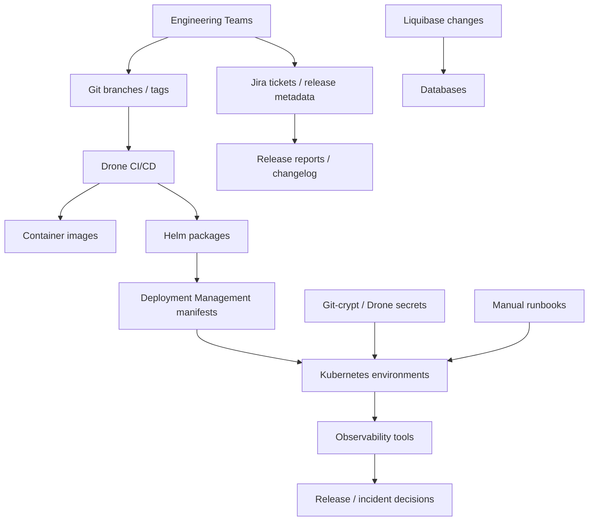
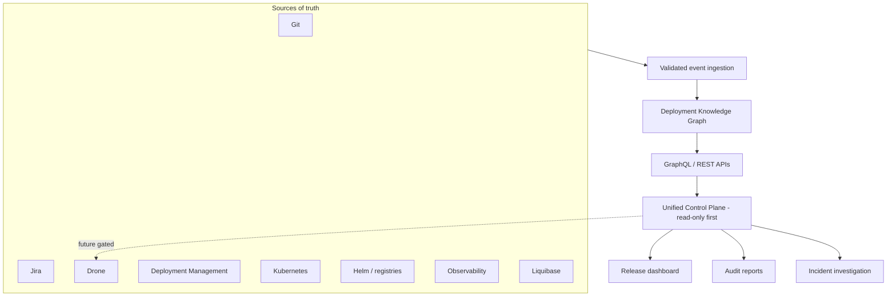
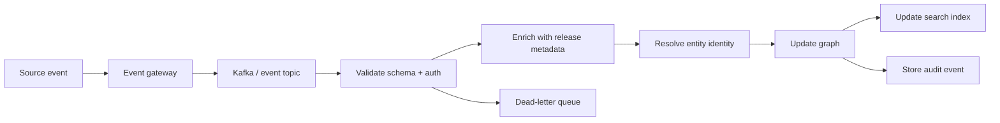
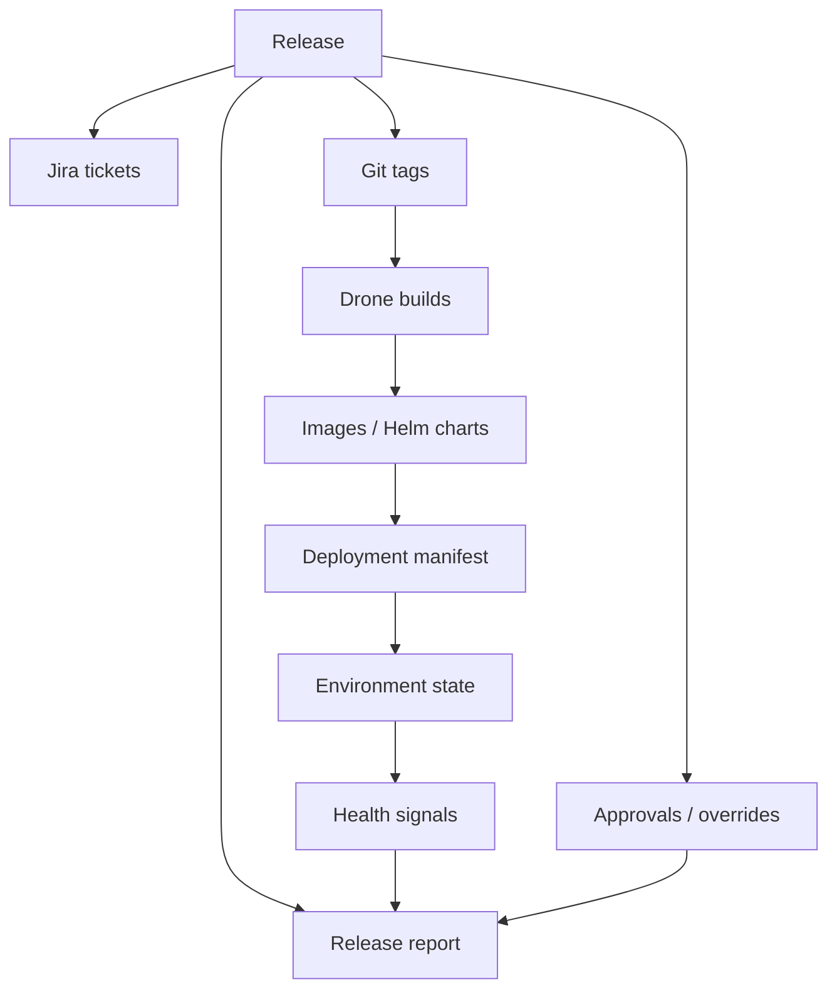
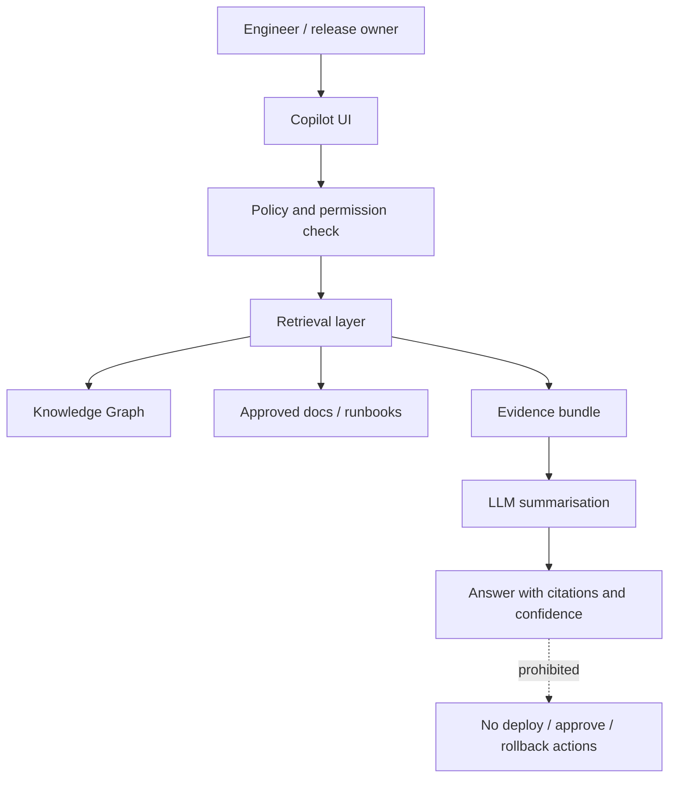
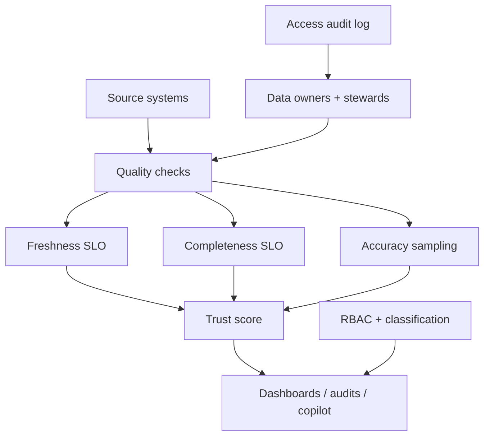

# Architecture Diagrams

Status: Completed architecture review output.

## Current State: Systems And Dependencies

## Future State: Knowledge Graph And Control Plane

## Event Ingestion Model

## Release Intelligence Architecture

## Engineering Copilot Architecture

## Data Trust And Governance Model

## Related Pages

- [Architecture Review Package](index.md)
- [Architecture Alignment And Enterprise Architecture Review](alignment-and-enterprise-architecture-review.md)
- [Criticality Challenge Review](criticality-challenge-review.md)
- [Advanced Architecture Sections](../advanced-architecture-sections.md)
