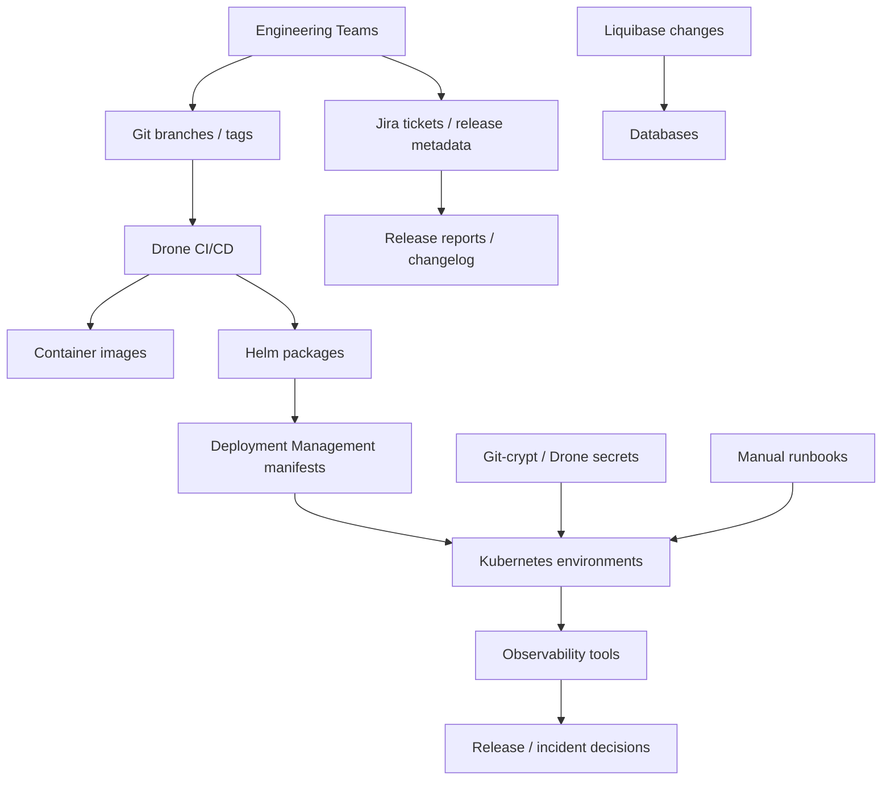
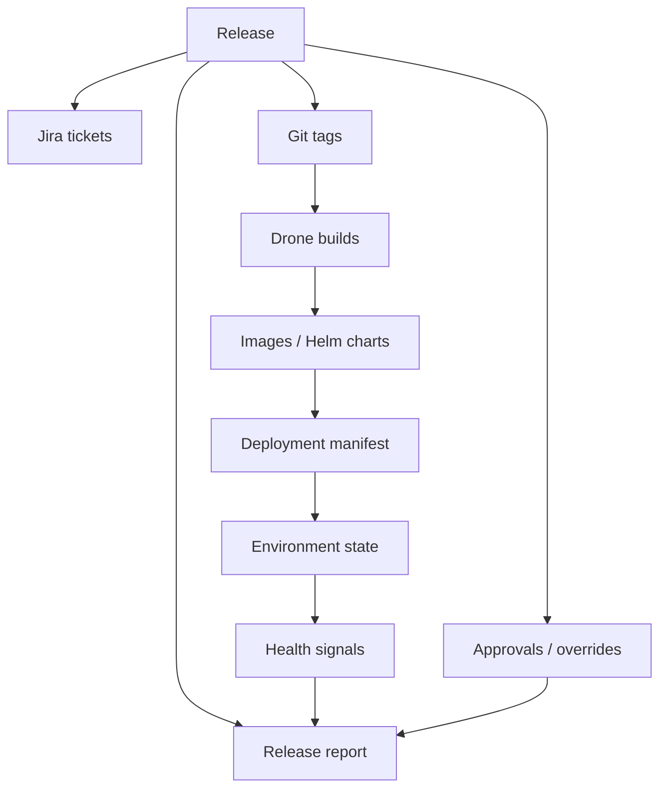

# Architecture Diagrams

Status: Optional review note / working reference.

## Current State: Systems And Dependencies

## Release Intelligence Architecture

## Related Pages

- [Potential Architecture Review Notes](index.md)
- [Architecture Alignment Considerations](alignment-and-enterprise-architecture-review.md)
- [Criticality Challenge Notes](criticality-challenge-review.md)
