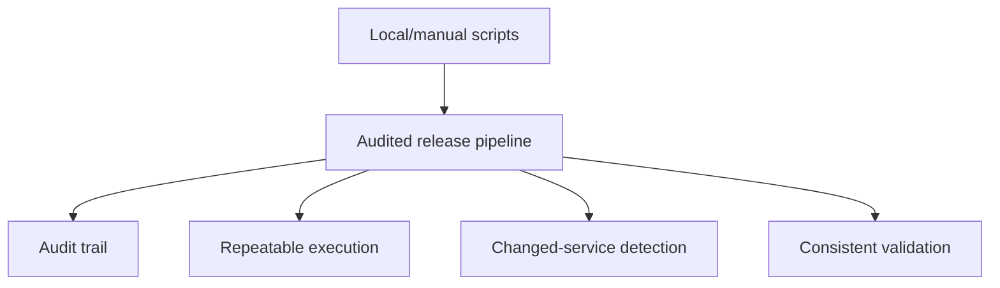
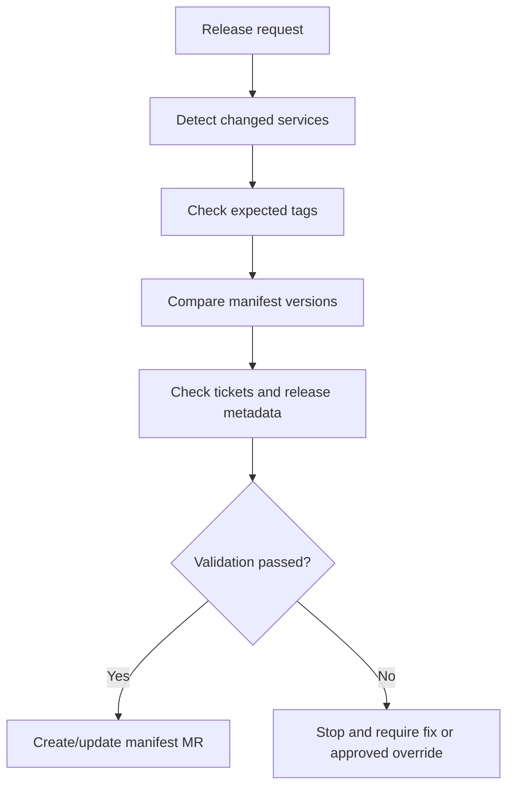

# Automation And Validation

This page captures the automation work in progress and the validation rules that should be made explicit.

## Why Automation Matters

The safest short-term improvement appears to be moving manual or locally run release scripts into centrally executed pipelines.

This would improve:

- Auditability.
- Central ownership of the release flow.
- Visibility of what has been run.
- Repeatability.
- Detection of which services actually have changes.
- Consistency around tags, manifests and release metadata.



## Automation Work Mentioned

Existing scripts or automation steps appear to cover parts of the release process, including:

- Merging release branches into `master`.
- Cleaning up inactive release branches.
- Creating new release branches from `development`.
- Tagging release branches.
- Updating manifest merge requests with tags.
- Raising manifest merge requests in Cerberus deployment management.
- Comparing commits or services to identify what is in or out of a release branch.

Some of these steps currently require tweaking or are not fully automated yet.

## KT Automation Status

The KT sessions suggest the current automation status is:

- Automation is being tested on the new configuration service.
- The scripts work locally.
- The remaining step is to get the automation and reporting running in Drone.
- The automation is expected to generate service chart changes, versions and tags.
- Release reports should help show what changed and what needs to be deployed.
- JIRA cross-reference is expected so the team can confirm that the release content matches the intended tickets.
- Changed-chart detection is being explored so the deployment logic can deploy only charts changed in the release.
- A Git pre-commit hook is being considered or worked on to reduce commits without MMA ticket references.
- Rollout may be possible within the next release or two, subject to confirmation.

For the end-to-end proposed flow, see [proposed release automation flow](proposed-release-automation-flow.md).

For detailed KT findings around current Helm scripts and auto manifest tooling, see [KT session findings](kt-session-findings.md).

## Intended Direction

The proposed direction is:

- Move local scripts into pipelines.
- Reduce manual service chart management.
- Automatically identify what is in or out of a branch/release.
- Automate start-of-sprint and end-of-sprint release tasks.
- Reduce release work to one or two standard pipeline runs where practical.
- Roll the improved process out iteratively after review and sign-off.

## Proposed Drone Rollout Checklist

Before the automation is treated as ready, confirm:

1. The pipeline runs successfully in Drone for the new configuration service.
2. Generated service chart changes are correct.
3. Generated versions are correct.
4. Generated tags are correct.
5. The release report is produced by the pipeline.
6. The release report includes the expected JIRA/ticket cross-reference.
7. Changed-chart detection identifies the expected charts.
8. Changed-chart deployment has an audited override path.
9. The report is stored somewhere durable enough to survive feature branch deletion.
10. Remaining manual server chart work is documented.
11. Rollout communication has been sent to squads.

## Release Reporting

The release report should answer:

- Which charts changed?
- Which images changed?
- Which services changed?
- Which tickets are included?
- Which tags were generated or expected?
- Which service chart changes were generated?
- Which manifest changes are needed?
- Which items are ready to deploy?
- Which items are blocked or need manual review?
- Which team owns the change?
- Who the primary contact/assignee is.
- What the ticket status is at report generation time.

Suggested retention policy to confirm:

```text
Generate the report before feature branch cleanup.
Store the report as a pipeline artefact and/or in the release management location.
Keep the report long enough for release validation, audit and incident investigation.
```

## Commit Metadata

Reporting and JIRA cross-reference depend on consistent commit metadata.

Suggested rule to confirm:

```text
Every commit that is intended to appear in release reporting should reference the relevant MMA/JIRA ticket.
```

Examples:

```text
MMA-1234 Add customer eligibility validation
MMA-5678 Fix manifest version comparison
```

The pre-commit hook should prevent obvious missing ticket references, but it should not be the only control. Merge request validation or pipeline validation may still be needed.

## Merge Strategy

The KT sessions leaned towards a squash-style pattern to keep release branch history readable.

The important requirement is not the exact Git button by itself. The important requirement is that the merge commit into the release branch contains:

- Ticket number.
- Meaningful message.
- Enough context to act as changelog history.

Individual feature branch commits should ideally follow the same pattern because long-running feature branches may also be used for reporting before they are merged and deleted.

## Failure Handling And Alerting

The automation is expected to run after image build and Helm chart upload have succeeded.

If the final Git/chart/reporting step fails because of a transient system issue, it should be rerunnable. The KT session also identified a gap:

```text
There is not currently an alerting model for failed automation steps.
```

Recommended policy:

- Send Slack/email alert for failed automation steps before production rollout.
- Include repository, branch, release version, failed step, Drone job link and rerun guidance.
- Treat the final Git/chart/reporting step as safe to rerun after transient failure if image and Helm artefact creation already succeeded.
- Require manual intervention when rerun would conflict with a manual chart edit or unknown repository state.
- Keep human approval before higher-environment promotion and production.

For the full proposed policy, see [rollout decision proposals](rollout-decision-proposals.md).

## Tag And Artefact Validation

Tags are critical because they trigger releasable artefact creation.



Validation should make sure:

- The expected tag exists.
- The tag points to the expected release branch/commit.
- The tag version matches the intended release version.
- The artefact was built from the expected source.
- Helm artefacts were created successfully.
- Vulnerability and code quality scans completed according to the agreed policy.

## Manifest Validation

Manifest updates must match the service tags and artefacts being released.

Validation should make sure:

- Manifest versions match the release tags.
- Missing tags fail fast.
- Incorrect tag versions fail fast.
- Manifest merge requests include the expected services only.
- Current manifest versions are compared with update versions.
- Invalid or blocked ticket statuses are handled according to agreed rules.
- `do not deploy` markers are surfaced clearly and stop release unless explicitly overridden.
- `NA` tag entries are represented clearly and do not silently hide release-impacting changes.
- DB Liquibase exceptions are handled explicitly because one Liquibase update may affect multiple projects.

## Ticket And Release Metadata Validation

Observed script responsibilities include:

- Compare start tag and end tag.
- Identify tickets included in a release.
- Add or update release-related labels.
- Update the changelog.
- Check ticket status.
- Check whether the correct tag version has been entered.
- Detect blocked, invalid or missing release metadata.
- Create a release ticket.
- Create a manifest update branch/MR.
- Update chart versions from Jira GitLab tag fields.
- Write auto-manifest changelog entries.

The team should decide which cases are warnings and which cases must fail the pipeline.

## Recommended Validation Policy

Use a strict policy for release integrity:

```text
Wrong tag -> fail.
Missing tag -> fail.
Manifest/tag mismatch -> fail.
Invalid ticket status -> fail or require explicit override.
Unknown service ownership -> fail or require explicit release-owner approval.
Do-not-deploy marker -> fail unless release owner explicitly approves an override.
```

Overrides may still be necessary, but they should be visible, approved and audited.

## Auto Manifest And Tag Jump Follow-Up

The KT sessions described auto manifest and tag jump tooling that must be reassessed against the proposed non-linear release branch model.

Follow-up needed:

- Decide whether tag jump checking is retired, replaced or adapted for the new branching model.
- Confirm whether strict mode should fail on wrong tags, missing tags and invalid ticket status.
- Confirm how `NA` GitLab tag entries are handled in reports.
- Confirm whether release label/tag metadata still uses the same Jira fields.
- Confirm whether local/workspace runs still require proxy setup for Jira access.

## Open Questions

- Which scripts are already reliable enough to move into pipelines?
- Which scripts need refactoring before pipeline execution?
- Who owns the standard release pipeline?
- Which pipeline steps require approval gates?
- How will the automation detect services with actual changes?
- What information should be included in the audit trail?
- What should fail immediately vs require manual approval?
