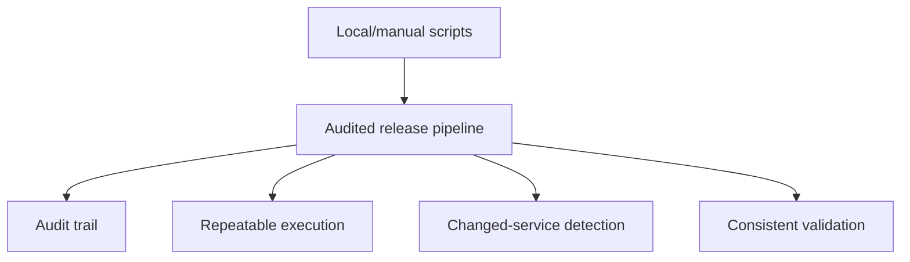
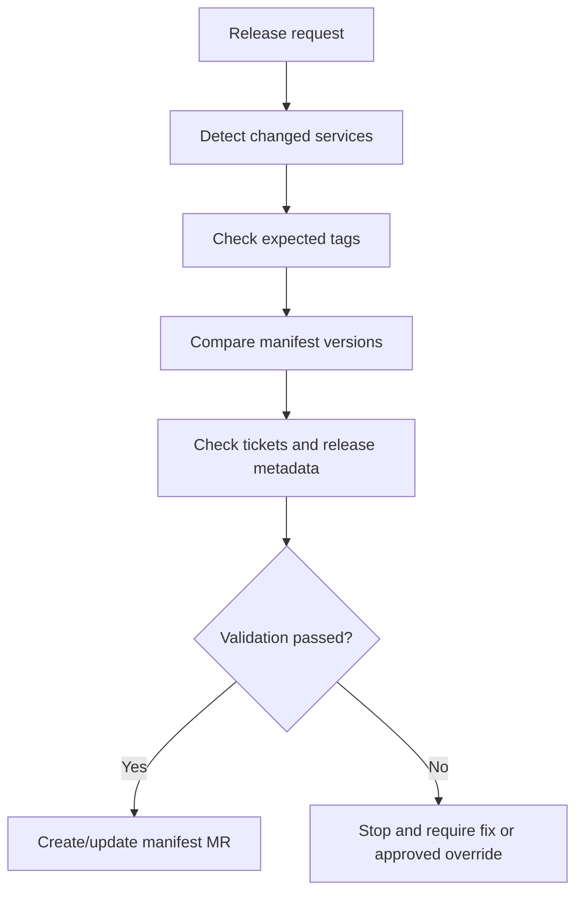

# Automation And Validation

This page captures the automation work in progress and the validation rules that should be made explicit.

## Why Automation Matters

The safest short-term improvement appears to be moving manual or locally run release scripts into centrally executed pipelines.

This would improve:

- Auditability.
- Central ownership of the release flow.
- Visibility of what has been run.
- Repeatability.
- Detection of which services actually have changes.
- Consistency around tags, manifests and release metadata.



## Automation Work Mentioned

Existing scripts or automation steps appear to cover parts of the release process, including:

- Merging release branches into `master`.
- Cleaning up old release branches.
- Creating new release branches from `development`.
- Tagging release branches.
- Updating manifest merge requests with tags.
- Raising manifest merge requests in Cerberus deployment management.
- Comparing commits or services to identify what is in or out of a release branch.

Some of these steps currently require tweaking or are not fully automated yet.

## Intended Direction

The proposed direction is:

- Move local scripts into pipelines.
- Reduce manual service chart management.
- Automatically identify what is in or out of a branch/release.
- Automate start-of-sprint and end-of-sprint release tasks.
- Reduce release work to one or two standard pipeline runs where practical.
- Roll the improved process out iteratively after review and sign-off.

## Tag And Artefact Validation

Tags are critical because they trigger releasable artefact creation.



Validation should make sure:

- The expected tag exists.
- The tag points to the expected release branch/commit.
- The tag version matches the intended release version.
- The artefact was built from the expected source.
- Helm artefacts were created successfully.
- Vulnerability and code quality scans completed according to the agreed policy.

## Manifest Validation

Manifest updates must match the service tags and artefacts being released.

Validation should make sure:

- Manifest versions match the release tags.
- Missing tags fail fast.
- Incorrect tag versions fail fast.
- Manifest merge requests include the expected services only.
- Current manifest versions are compared with update versions.
- Invalid or blocked ticket statuses are handled according to agreed rules.

## Ticket And Release Metadata Validation

Observed script responsibilities include:

- Compare start tag and end tag.
- Identify tickets included in a release.
- Add or update release-related labels.
- Update the changelog.
- Check ticket status.
- Check whether the correct tag version has been entered.
- Detect blocked, invalid or missing release metadata.

The team should decide which cases are warnings and which cases must fail the pipeline.

## Recommended Validation Policy

Use a strict policy for release integrity:

```text
Wrong tag -> fail.
Missing tag -> fail.
Manifest/tag mismatch -> fail.
Invalid ticket status -> fail or require explicit override.
Unknown service ownership -> fail or require explicit release-owner approval.
```

Overrides may still be necessary, but they should be visible, approved and audited.

## Open Questions

- Which scripts are already reliable enough to move into pipelines?
- Which scripts need refactoring before pipeline execution?
- Who owns the standard release pipeline?
- Which pipeline steps require approval gates?
- How will the automation detect services with actual changes?
- What information should be included in the audit trail?
- What should fail immediately vs require manual approval?
