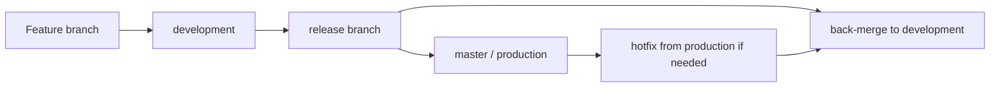
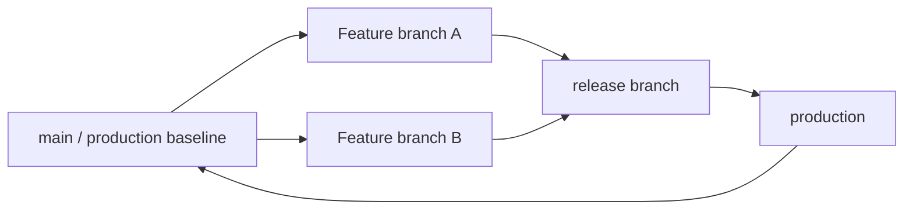
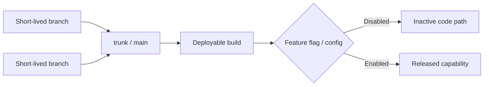

# Branching Strategy Options

This page compares the branching options discussed so far.

The key point: the branching model should be chosen based on what the release operating model can safely support.

## Decision Lens

Before choosing a model, confirm whether the team has:

- Clear release scope across repositories and services.
- Reliable tag, artefact and manifest validation.
- A documented hotfix path.
- A documented rollback path.
- Clear service ownership and approvals.
- Strong enough test automation.
- Feature flags and configuration that can safely control incomplete work.

## Branch And Commit Hygiene To Confirm

The KT sessions raised several branch hygiene points that should be agreed before rollout.

Proposed branch naming examples:

| Branch Type | Purpose | Example |
| --- | --- | --- |
| `feature/*` | Individual ticket or feature work. | `feature/MMA-1234-login-validation` |
| `release/*` | Release candidate branch for a planned release. | `release/2026.06.1` |
| `hotfix/*` | Urgent fix from production state. | `hotfix/MMA-5678-prod-timeout` |
| `main` or `master` | Production/live baseline. | `main` |
| `development` | Integration branch, if retained. | `development` |

Proposed cleanup rule:

```text
Feature branches should be deleted after merge, once any required release report has been generated.
```

Proposed target model from the KT sessions:

```text
main represents production/live.
release branches are auto-created from main at the start of each sprint/release.
feature and hotfix branches are created from the relevant release branch.
```

For more detail, see [proposed release automation flow](proposed-release-automation-flow.md).

Proposed decision:

```text
Move to `main` as the production/live baseline after an agreed cutover release.
Keep `development` transitional only until the automation pilot and branch protections are ready.
```

For the full proposal, see [rollout decision proposals](rollout-decision-proposals.md).

## Multiple Active Release Branches

The KT session raised an important branch maintenance point: more than one release branch may exist at the same time.

If a feature starts from one release branch but is not ready for that release, it can continue alongside later releases. The team working on the feature should merge in the relevant release branches to detect conflicts before opening or updating the merge request.

Proposed rule:

```text
Forward-merge fixes from earlier active releases into later active release branches before release closure.
Feature owners keep long-running branches current by merging in the relevant active release branch before MR updates.
```

## Option 1: Continue With The Current GitFlow-Style Model

```text
feature branch -> development -> release branch -> master
```



Benefits:

- Keeps a familiar model.
- Separates active development from production.
- Allows release branch stabilisation.
- Supports production-based hotfixing if `master` is reliable.
- Provides a controlled release candidate branch.
- May be safer in the short term while automation and documentation improve.

Risks:

- More branches to manage.
- Requires disciplined reconciliation after release.
- Can create overhead across many services.
- Still depends on tag, manifest and configuration coordination.
- If reconciliation is missed, `master` may stop representing production accurately.

Best fit:

```text
Short-term baseline while the process is standardised and automated.
```

## Option 2: Reduce Reliance On `development`

Possible direction:

```text
feature branches -> release branches tracking live/main
```



Benefits:

- Fewer long-lived branches.
- Closer alignment to production state.
- Potentially easier to reason about changes against live.
- May reduce branch management overhead if releases are frequent.

Risks:

- Less separation between active development and release preparation.
- Incomplete or risky work may be harder to isolate.
- Does not automatically solve manifest, config, feature flag or rollback complexity.
- Needs very clear release scope and ownership to avoid drift.

Best fit:

```text
Possible future simplification if release controls are already clear and reliable.
```

## Option 3: Move Towards Trunk-Based Development

Possible direction:

```text
short-lived branches -> trunk/main
release control -> feature flags/config
```



Benefits:

- Reduces long-running branches.
- Improves continuous integration.
- Reduces late merge conflict risk.
- Can support faster release cycles if operational controls are mature.

Risks:

- Requires strong runtime feature flag control.
- Requires configuration to be changeable without full redeployment, or with very low friction.
- Requires strong automated testing and monitoring.
- Instability may be harder to isolate if many changes are merged quickly.
- If feature flags are baked into charts or values files, the complexity may move into deployment/configuration.

Best fit:

```text
Longer-term target if release control can be separated from code integration.
```

## Trunk-Based Readiness Criteria

Before moving towards trunk-based development, confirm that:

- Runtime feature flags are available and reliable.
- Feature activation is independent of deployment.
- Configuration can be changed centrally or without full redeployment.
- Automated tests detect regressions quickly.
- Rollback or feature disablement is fast and well understood.
- Feature flag lifecycle is managed to avoid long-lived inactive code paths.
- Environment parity is well understood.
- Release ownership and approvals are clear.

## Suggested Short-Term Position

```text
Keep the current GitFlow-style model as the short-term baseline.
Improve automation, validation, hotfix handling, rollback handling and ownership.
Use those improvements to decide later whether to simplify the model or move towards trunk-based development.
```

## Practical Recommendation

Do not make the branching model carry all the process risk.

First standardise:

- Release branch timing.
- Tag timing.
- Manifest validation.
- Changed-service detection.
- Hotfix flow.
- Rollback flow.
- Post-release reconciliation.
- Ownership and approvals.

Then reassess whether the branch model is still the main constraint.
