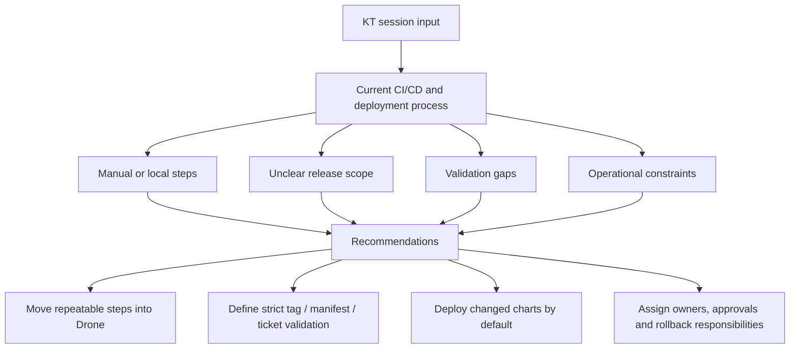

# CI/CD Deployment Findings And Actions

This page summarises the CI/CD and deployment findings from the KT sessions.

Its purpose is to show:

1. How the current process works.
2. Which parts look manual, unclear, risky or inconsistent.
3. What should be standardised, automated or explicitly decided next.

## Analysis Frame

```text
The release challenge is broader than the branch model itself.

Branching is one part of the process, but CI/CD and deployment also depend on service tags, Helm artefacts, manifests, configuration and feature flags, runbooks, environment access, QAT approval, rollback and ownership.

The current process should be made visible, repeatable and auditable before the branching model is treated as the main fix.
```

## Process Areas Covered

- Release branch creation and merge strategy.
- Service tag creation and artefact generation.
- Image build, test, scan and Helm package upload.
- Cerberus chart and manifest updates.
- Deployment through service repo and MMA Helm scripts.
- Environment-specific values, secrets and runbooks.
- QAT approval and higher-environment promotion.
- Hotfix, rollback and post-release reconciliation.

## Problem Areas Identified

| Area | Current Problem | Why It Matters |
| --- | --- | --- |
| Manual release work | Release creation, chart updates, tag handling and deployment triggers still involve manual or locally run steps. | Manual work increases release time, inconsistency and audit gaps. |
| Branch/tag timing | Release branches, temporary tags and full release tags need clearer rules. | Wrong timing can create wrong artefacts, wrong manifests or unclear release state. |
| Release scope | "All services" and cross-repo release scope are not fully explicit. | Automation may include too much, too little or miss secrets/config/Liquibase/runbook changes. |
| Manifest validation | Missing tags, wrong tags, invalid ticket status and `do not deploy` cases need strict policy. | Weak validation can allow the wrong version or blocked work into a release. |
| Changed-chart deployment | Deploying all charts manually or listing chart names explicitly is inefficient. | The deployment should default to changed charts, with audited override. |
| Environment readiness | New dev/test environments need values files, setup entries and Drone secrets/tokens confirmed. | An environment can look available but fail deployment because setup is incomplete. |
| Hotfix and rollback | Hotfix source branch, back-merge and rollback reconciliation are not fully standardised. | Production fixes can drift from `main`/`development`, manifests and active release branches. |
| Alerting and rerun | Failed automation alerting and safe rerun rules are not fully defined. | A failed final Git/chart/reporting step can leave release state unclear. |

## Findings Flow



## Recommended Actions

1. Keep the current-state flow in [current release operating model](current-release-operating-model.md) as the baseline view.
2. Use [KT session findings](kt-session-findings.md) as the detailed source for deployment scripts, secrets, manifests and tag validation.
3. Move local/manual release automation into Drone once the configuration-service pilot is green.
4. Define strict validation for wrong tags, missing tags, manifest/tag mismatch, invalid ticket status and `do not deploy` markers.
5. Confirm repository scope for service code, Helm charts, deployment management, secrets/config, Liquibase and runbooks.
6. Confirm changed-chart deployment behaviour and the override approval path.
7. Document hotfix and rollback flows including branch, manifest and release report reconciliation.
8. Define alerting and rerun rules for failed automation steps.
9. Confirm new environment readiness criteria before treating any dev/test environment as release-ready.
10. Use [rollout decision proposals](rollout-decision-proposals.md) as the decision record until owners approve or amend them.

## Short-Term Recommendation

```text
Do not change the branching model first.

First make the current CI/CD and deployment process visible, repeatable and auditable:
- release flow
- release scope
- branch/tag timing
- tag and manifest validation
- hotfix flow
- rollback flow
- ownership and approvals

Then decide whether the branching model should be kept, simplified or replaced.
```
