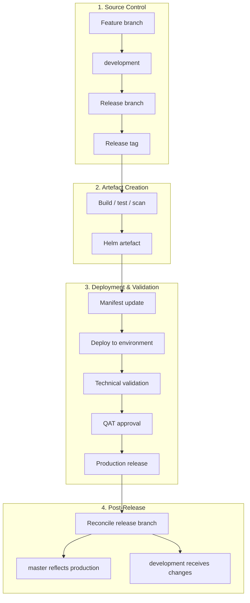
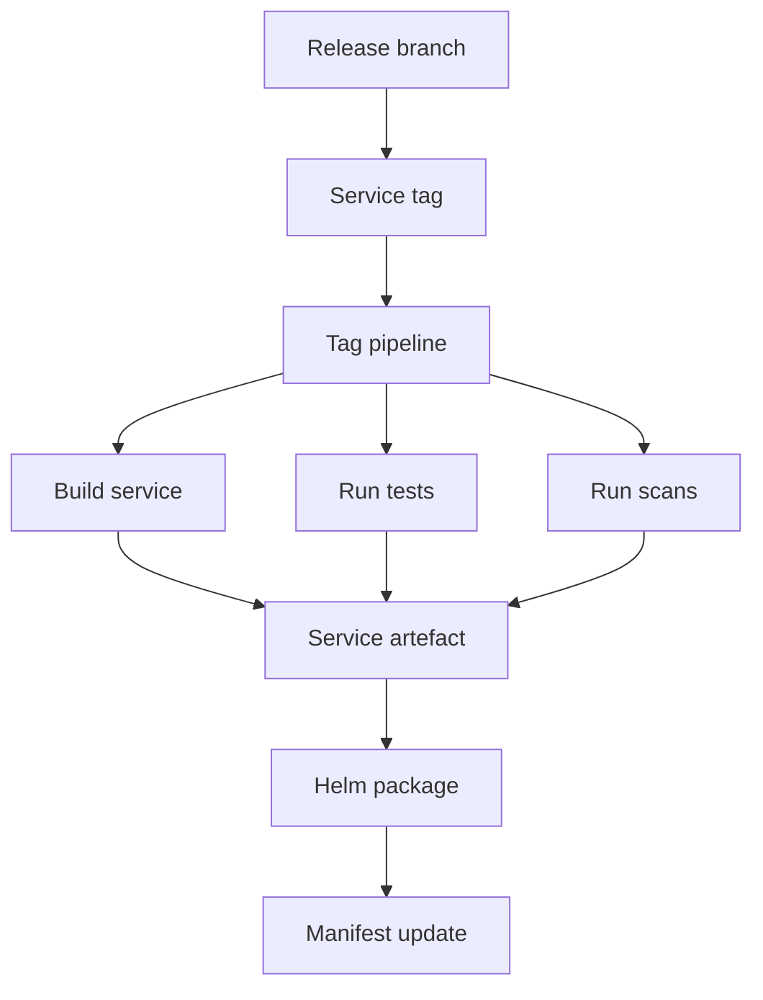
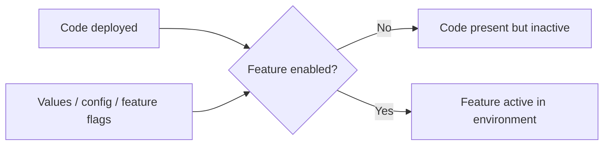
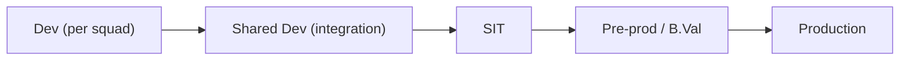

# Current Release Operating Model

This page captures the current understanding of how branching, release and deployment fit together.

It is a current-state summary, not a final process definition.

## Current Direction

The release process is currently too manual-heavy, especially around creating releases and artefacts. The target direction is to automate the release flow so it can be triggered centrally, update Cerberus charts and produce reporting.

- The automation should cross-reference JIRA so the team can check that the release contains what it is expected to contain.
- Gareth/Achilles are testing the automation on the new configuration service.
- The scripts currently work locally; the remaining implementation step is to run them through Drone.
- The automation is expected to generate service chart changes, versions, tags and release reports.
- The team may be able to start using release branches within the next release or two, subject to confirmation.
- Some manual server chart work may remain until the relevant Drone pipelines are updated.
- Lower environments are currently more ad hoc, while higher-environment releases rely on server chart updates.
- Changes may include application code, secrets and Liquibase/database changes, not only service code.
- The proposed target model has `main` representing production/live state, with release branches auto-created at the start of each sprint/release.
- Feature and hotfix branches are expected to update matching Cerberus chart branches automatically.
- A shared dev environment is expected to receive the active release branch for cross-team integration testing.

For the detailed proposed flow, see [proposed release automation flow](proposed-release-automation-flow.md).

For detailed findings around Helm scripts, secrets and auto manifest tooling, see [deployment and release findings](deployment-and-release-findings.md).

## Current Branching Model

The current approach appears to be close to a GitFlow-style model:

```text
feature branch -> development -> release branch -> master / production
```

Current understanding:

- Feature or ticket branches are created for individual changes.
- Completed work is merged into `development`.
- `development` represents ongoing work and the candidate state for upcoming releases.
- Release branches are created from `development`.
- `master` is intended to reflect production/live state.
- Release branches are tagged to trigger releasable artefact creation.
- After a release, the release branch should be reconciled back into `master` and `development`.
- Hotfixes should be possible from production state, but the exact hotfix and back-merge process needs to be documented.

The historical context: using `main/master` and release tags only contributed to long release gaps, fix-forward pressure and defect accumulation. The `development` branch was introduced to separate active development from production state.

The proposed target direction is for `development` to effectively become `main`, with `main` representing production/live state. That needs explicit confirmation before this document treats it as the agreed model.

## End-To-End Flow

The current flow appears to be:

```text
Feature branch
  -> merge to development
  -> create release branch
  -> create service tag
  -> build and test service
  -> security and quality scans
  -> Helm package / dependency build / artefact upload
  -> manifest update
  -> deployment through service repo / Helm scripts
  -> technical validation
  -> QAT approval
  -> higher environment promotion
  -> production release
  -> post-release reconciliation
```

Current-state visual:



The exact flow may vary by service and environment. That is why the process should be mapped end to end before changing the branching model.

## Deployment Repository And Helm Scripts

The current deployment focus is on the service repo and the MMA Helm repo.

Key points:

- Individual service charts have had their own Drone pipelines around dev-environment Helm chart deployment.
- The current approach appears to deploy through the service repo instead.
- The MMA Helm repo contains deployment scripts used for Helm packaging, linting, templating, diffing, uploading and deployment-related tasks.
- The MMA Helm repo is separate from the MMA Helm library repo.
- Helm charts are deployed as packaged artefacts with environment-specific values files.
- Tag creation runs packaging/upload steps; deployment itself is promoted or manually triggered.
- If future changes are needed in the Drone pipeline for Helm deployment, the MMA Helm repo is likely where those changes would be added.

Deployment script stages mentioned:

- Helm packaging.
- Helm linting.
- Helm templating.
- Mass diff.
- Uploading.
- Deployment.

Deployment parameters:

- Target environment.
- Deployment scope, such as live, historical or both.
- Release version/tag.
- Chart names to deploy.

Temporary manual work still to document:

- Which server chart updates remain manual.
- Which environments still require manual chart handling.
- Which Drone pipeline changes are needed before server chart work is automated.
- Who performs manual server chart updates while automation is being rolled out.
- How manual chart changes are reviewed and reconciled with generated release reports.
- How exceptions are handled when one feature depends on another ticket/branch and a manual chart edit is still required.

## Tagging And Artefact Creation

A release branch alone is not enough to produce a releasable service artefact. A tag is created on the release branch when it is ready to go.

Creating a tag appears to trigger a tag creation pipeline that performs activities such as:

- Clone the Git repository.
- Set up Docker/test dependencies.
- Log into Artifactory.
- Build the service.
- Run Maven clean install and tests for Spring Boot services.
- Run vulnerability scanning, for example Trivy.
- Run code quality scanning, for example Sonar.
- Produce Helm artefacts through Helm package, Helm dependency build and Helm artefact upload.

This makes tag timing and correctness critical. The tag is the bridge between source control and releasable artefact creation.



## Manifest, Ticket And Release Metadata

There are scripts that appear to analyse release content based on tickets, tags and manifest versions.

Observed responsibilities:

- Compare start tag and end tag.
- Identify tickets included in a release.
- Add or update release-related labels.
- Update the changelog.
- Check ticket status.
- Check whether the correct tag version has been entered.
- Compare update versions with current manifest versions.
- Detect incorrect tag versions, missing tags, blocked tickets or invalid ticket statuses.

Some validation appears to be present, but parts of the process may currently be more permissive than expected. The validation rules should be made explicit and enforced consistently.

See [automation and validation](automation-and-validation.md).

## Configuration And Feature Flags

Feature flags are an important part of the current release model.

Current understanding:

- A new feature or rule can be deployed without necessarily being active.
- Activation is controlled by feature flags and environment-specific values.
- Development teams decide which features need to be enabled in which environments.
- Some flag values appear to be controlled through value files or chart configuration.

This creates an important distinction:

```text
Code deployed does not always mean feature enabled.
```



If feature flags are baked into Helm charts or values files, and changing a flag requires redeployment, trunk-based development may move complexity from branching into configuration and deployment rather than removing it.

## Testing, Validation And Approval

Deployment success and functional release confidence are different things.

Technical validation generally confirms that:

- The deployment completed.
- Pods started successfully.
- Basic monitoring or health checks passed.

Functional validation is handled separately by development teams and QAT:

- Development teams may use Playwright or Cypress for automated functional testing.
- For SIT and above, QAT approval is required before progressing further.
- A green deployment pipeline does not necessarily prove that the release is functionally safe.

This distinction should be explicit:

```text
Deployment success != Functional validation complete
```

## Environment Parity

There was uncertainty around the differences between pre-production/B.Val and production.

Current understanding:

- In theory, pre-production should be as close to production as possible.
- Some people have limited or no direct production deployment experience.
- Production access is restricted.
- B.Val/pre-production may contain more data than production in some cases.
- The exact environment differences are not clearly documented.

Areas to document:

- Data volume and data shape.
- Configuration differences.
- Feature flag defaults.
- Secrets and credentials.
- External integrations.
- Network/access constraints.
- Operational permissions.
- Whether lower environments are deployed ad hoc while higher environments use server chart releases.
- Which environment-specific values files, Drone secrets and tokens are required for each environment.

## Manual Steps And Operational Constraints

The release process includes manual and operational constraints beyond source control and pipelines.

Observed points:

- Thursday appears to be the regular release day.
- Some production or higher-environment actions may require PNR room/location access.
- Tools pods may contain environment variables or secrets required for certain commands.
- Some runbook steps may need to be executed alongside releases.
- There is a runbook repository used for environment-specific release activities.
- Screen sharing or recording while viewing decoded secrets is a security risk.
- If secrets are exposed in a recording, secret rotation may be required.
- Secrets/config may be managed through encrypted chart entries and managed secrets scripts.
- Secret keys should be consistent across environments, while values differ by environment.

These operational requirements should be documented as part of the release process, not left as informal knowledge.

## Confirmation Needed

The process should be confirmed around:

- When release branches are cut.
- When tags are created.
- Which repositories are included.
- Which steps are manual vs automated.
- How hotfixes and rollback are handled.
- How `master` is kept aligned with production.
- Who owns release readiness, execution, validation and reconciliation.

## Industry Best Practices For Feature Flags And Environment Management

### Feature Flag Maturity Model

Feature flags range from simple to sophisticated:

| Level | Description | Example |
| --- | --- | --- |
| 1. Build-time flags | Compile-time constants or config at deploy | `application.yml: feature.x.enabled: true` |
| 2. Deploy-time flags | Values files per environment | Helm values: `features.newRule: false` |
| 3. Runtime flags (static) | Flag service checked at startup | Config read from external source at boot |
| 4. Runtime flags (dynamic) | Flag changes without redeploy | LaunchDarkly, Unleash, Flagsmith, or custom |

Cerberus appears to be at Level 2 (deploy-time flags via values files). This means:
- Enabling a feature requires a chart/values change + redeployment.
- "Dark launching" (deploy but keep disabled) works, but enabling requires operational action.
- Quick disable in production requires re-deploy with the flag turned off.

Moving to Level 3–4 enables:
- Instant feature kill-switch without redeployment.
- Gradual rollout (enable for 10% of users, then 50%, then 100%).
- A/B testing without branch complexity.
- Decoupling deployment from release entirely.

### Recommended Feature Flag Rules

```text
1. Every incomplete feature merged to a release branch MUST be behind a flag.
2. Flags must have an owner and a planned removal date.
3. Flags older than 2 releases should be reviewed — either enable permanently or remove.
4. Flag state per environment must be documented in the release report.
5. Critical flags (kill-switches for new features) should have a fast-disable path that does not require full release.
```

### Environment Promotion Pattern

A clean environment promotion model:



Each promotion should:
- Use the **same artefact** (never rebuild for a higher environment).
- Apply **environment-specific config only** (values files, secrets, feature flags).
- Pass **defined quality gates** before proceeding.
- Be **auditable** (who promoted, when, which version, what changed).

### Environment Parity Checklist

To reduce "works in dev, fails in prod" issues:

| Aspect | Dev | Pre-prod | Production | Notes |
| --- | --- | --- | --- | --- |
| Container images | Same | Same | Same | Immutable artefact |
| Helm chart version | Same | Same | Same | Packaged artefact |
| Values/config | Environment-specific | Close to prod | Production | Minimise differences |
| Data shape | Synthetic/subset | Representative | Real | Pre-prod data should exercise edge cases |
| External integrations | Mocked/stubbed | Real (sandboxed) | Real | Know which integrations are different |
| Network/access | Open | Restricted | Restricted | Pre-prod should match prod restrictions |
| Resource limits | Relaxed | Match prod | Production | Catch resource issues before prod |
| Feature flags | All enabled (testing) | Match prod defaults | Controlled | Document differences |

The fewer differences between pre-prod and production, the more confident the team can be that pre-prod validation means production will work.

---

← [README](../README.md) | → [Deployment and release findings](deployment-and-release-findings.md)
