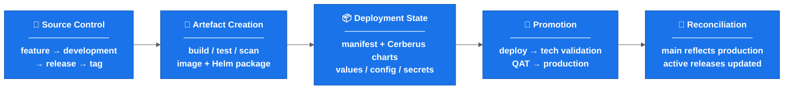
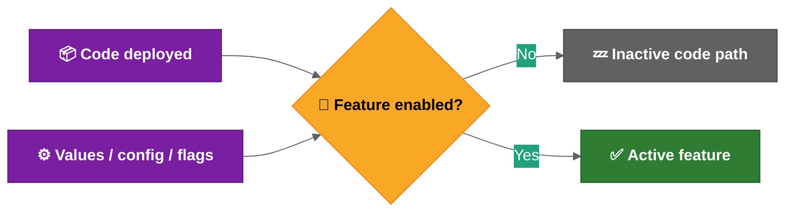

# Current Release Operating Model

This page captures the current understanding of how branching, release and deployment fit together.

It is a current-state summary, not the final process definition. Keep this page short; use the linked detail pages for deeper implementation notes.

## Current Direction

The release process is still too manual-heavy. The target direction is to run the repeatable release work centrally through Drone, update Cerberus charts automatically and produce a release report that can be checked against JIRA.

Current status:

- Gareth/Achilles are testing the automation on the new configuration service.
- The scripts work locally; the remaining step is to run them through Drone.
- The automation is expected to generate service chart changes, versions, tags and release reports.
- Some manual server chart work may remain until the relevant Drone pipelines are updated.
- Lower environments are more ad hoc; higher-environment releases rely more heavily on server chart updates and release management.
- Changes may include service code, secrets, config, Liquibase/database changes and runbook work.
- The proposed target has `main` representing production/live state, with release branches auto-created at the start of each sprint/release.

For the proposed target flow, see [proposed release automation flow](proposed-release-automation-flow.md).

For Helm, manifest, secrets and validation detail, see [deployment and release findings](deployment-and-release-findings.md).

## Current Branching Model

The current approach is close to a GitFlow-style model:

```text
feature branch -> development -> release branch -> master / production
```

Current understanding:

- Feature or ticket branches are created for individual changes.
- Completed work is merged into `development`.
- `development` represents ongoing work and the candidate state for upcoming releases.
- Release branches are created from `development`.
- `master` is intended to reflect production/live state.
- Release branches are tagged to trigger releasable artefact creation.
- After release, the release branch should be reconciled back into `master` and `development`.
- Hotfixes should be possible from production state, but the exact back-merge and forward-merge process still needs confirmation.

Important transition note:

```text
The proposed target is not "rename development to main".
The target is "main represents the confirmed production state".
```

That distinction matters because `development` may contain work that has not reached production.

## End-To-End Flow

The release flow currently spans source control, artefact creation, deployment state, environment promotion and post-release reconciliation.

Compact current-state view:



Why this matters:

```text
Changing the branch model alone does not make the release safe.
The release is only safe when tag, artefact, chart, manifest, config, validation and reconciliation all agree.
```

## Deployment And Helm Summary

The current deployment path focuses on the service repo and the MMA Helm repo.

Key points:

- Individual service charts have had their own Drone pipelines around dev-environment Helm chart deployment.
- The current approach appears to deploy through the service repo instead.
- The MMA Helm repo contains scripts for Helm packaging, linting, templating, diffing, uploading and deployment-related tasks.
- Helm charts are deployed as packaged artefacts with environment-specific values files.
- Tag creation runs packaging/upload steps; deployment itself is promoted or manually triggered.
- Deployment parameters include target environment, deployment scope, release version/tag and chart names.
- Chart names may still need to be listed explicitly until changed-chart detection is reliable.

Temporary manual areas still needing confirmation:

- Which server chart updates remain manual.
- Which Drone pipeline changes are needed before server chart work is automated.
- Who performs manual chart updates during rollout.
- How manual chart changes are reviewed and reconciled with release reports.
- How cross-ticket dependencies are handled when a manual chart edit is still required.

## Tagging And Artefact Creation

A release branch alone does not produce a releasable service artefact. A tag is created on the release branch when it is ready.

Creating a tag appears to trigger:

- repository clone,
- Docker/test dependency setup,
- Artifactory login,
- service build,
- Maven install/tests for Spring Boot services,
- vulnerability scanning such as Trivy,
- code quality scanning such as Sonar,
- Helm package, Helm dependency build and Helm artefact upload.

Compact tag flow:


Risk:

```text
If the tag points to the wrong commit, the rest of the process can look correct while deploying the wrong artefact.
```

## Manifest, Ticket And Release Metadata

Existing scripts appear to analyse release content using tickets, tags and manifest versions.

Observed responsibilities:

- Compare start tag and end tag.
- Identify tickets included in a release.
- Add or update release labels.
- Update changelog entries.
- Check ticket status.
- Check whether the correct tag version has been entered.
- Compare update versions with current manifest versions.
- Detect incorrect tags, missing tags, blocked tickets or invalid ticket statuses.

Open policy:

```text
Wrong tag, missing tag, manifest/tag mismatch and do-not-deploy markers should fail fast unless an explicit release-owner override is recorded.
```

See [automation and validation](automation-and-validation.md).

## Configuration, Feature Flags And Activation

Deployment does not always mean activation.

Current understanding:

- A new feature or rule can be deployed without being active.
- Activation is controlled by feature flags and environment-specific values.
- Development teams decide which features need to be enabled in each environment.
- Some flag values appear to be controlled through chart values/config.

Operational implication:

```text
Code deployed != feature enabled
```



If feature flags are baked into Helm values, enabling or disabling a feature may require redeployment. That means trunk-based development would move some complexity from branching into configuration and deployment.

## Testing, Validation And Approval

Deployment success and functional release confidence are different things.

Technical validation generally confirms:

- deployment completed,
- pods started successfully,
- health checks or monitoring passed.

Functional validation is separate:

- development teams may use Playwright or Cypress,
- QAT approval is required for SIT and above,
- a green deployment pipeline does not prove functional readiness.

Key principle:

```text
Deployment success != functional validation complete
```

## Environment And Operational Constraints

Environment differences are not fully documented yet.

Areas to confirm:

- data volume and data shape,
- configuration differences,
- feature flag defaults,
- secrets and credentials,
- external integrations,
- network/access constraints,
- operational permissions,
- required values files, Drone secrets and kube/robot tokens,
- whether lower environments are deployed ad hoc while higher environments use server chart releases.

Operational constraints also include:

- Thursday appears to be the regular release day.
- Some higher-environment actions may require PNR room/location access.
- Some commands may require tools pod access.
- Runbook steps may need to run alongside release activity.
- Screen sharing or recording while viewing decoded secrets is a security risk.
- If secrets are exposed, rotation may be required.

## Confirmation Needed

Before changing the branching model, confirm:

1. When release branches are cut.
2. When tags are created.
3. Which repositories are in scope.
4. Which steps are manual vs automated.
5. How hotfixes and rollback are handled.
6. How `master` / `main` is kept aligned with production.
7. Who owns release readiness, execution, validation and reconciliation.
8. How feature flag state is recorded in the release report.
9. Which environment readiness checks are mandatory before rollout.

## Related Detail

- Feature flag and environment management best practices are in [release engineering best practices](release-engineering-best-practices.md).
- Proposed automation is in [proposed release automation flow](proposed-release-automation-flow.md).
- Open rollout decisions are in [rollout decision proposals](rollout-decision-proposals.md).

---

<- [README](../README.md) | -> [Deployment and release findings](deployment-and-release-findings.md)
