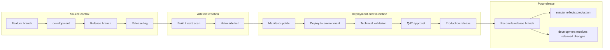
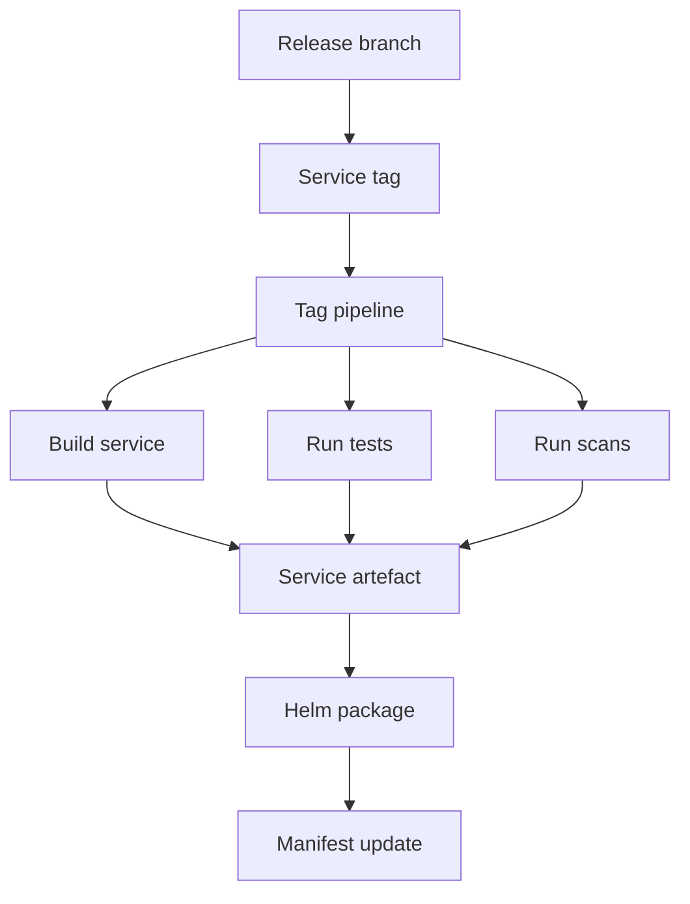
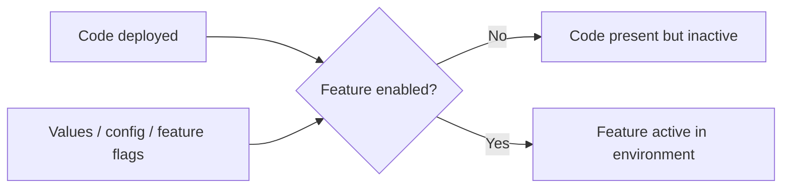

# Current Release Operating Model

This page captures the current understanding of how branching, release and deployment fit together.

It is a current-state summary, not a final process definition.

## Current Branching Model

The current approach appears to be close to a GitFlow-style model:

```text
feature branch -> development -> release branch -> master / production
```

Current understanding:

- Feature or ticket branches are created for individual changes.
- Completed work is merged into `development`.
- `development` represents ongoing work and the candidate state for upcoming releases.
- Release branches are created from `development`.
- `master` is intended to reflect production/live state.
- Release branches are tagged to trigger releasable artefact creation.
- After a release, the release branch should be reconciled back into `master` and `development`.
- Hotfixes should be possible from production state, but the exact hotfix and back-merge process needs to be documented.

The previous approach was closer to using `main/master` and release tags only. That reportedly contributed to long release gaps, fix-forward pressure and defect accumulation. The `development` branch was introduced to separate active development from production state.

## End-To-End Flow

The current flow appears to be:

```text
Feature branch
  -> merge to development
  -> create release branch
  -> create service tag
  -> build and test service
  -> security and quality scans
  -> Helm package / dependency build / artefact upload
  -> manifest update
  -> deployment through service repo / Helm scripts
  -> technical validation
  -> QAT approval
  -> higher environment promotion
  -> production release
  -> post-release reconciliation
```

Visual version:



The exact flow may vary by service and environment. That is why the process should be mapped end to end before changing the branching model.

## Deployment Repository And Helm Scripts

The deployment KT sessions suggest the current deployment focus is on the service repo and the MMA Helm repo.

Key points:

- Historically, individual service charts had their own Drone pipelines.
- That was part of the previous way of working, where the dev environment deployed individual services as Helm charts.
- The current approach appears to deploy through the service repo instead.
- The MMA Helm repo contains deployment scripts used for Helm packaging, linting, templating, diffing, uploading and deployment-related tasks.
- If future changes are needed in the Drone pipeline for Helm deployment, the MMA Helm repo is likely where those changes would be added.

Deployment script stages mentioned:

- Helm packaging.
- Helm linting.
- Helm templating.
- Mass diff.
- Uploading.
- Deployment.

## Tagging And Artefact Creation

A release branch alone is not enough to produce a releasable service artefact. A tag is created on the release branch when it is ready to go.

Creating a tag appears to trigger a tag creation pipeline that performs activities such as:

- Clone the Git repository.
- Set up Docker/test dependencies.
- Log into Artifactory.
- Build the service.
- Run Maven clean install and tests for Spring Boot services.
- Run vulnerability scanning, for example Trivy.
- Run code quality scanning, for example Sonar.
- Produce Helm artefacts through Helm package, Helm dependency build and Helm artefact upload.

This makes tag timing and correctness critical. The tag is the bridge between source control and releasable artefact creation.



## Manifest, Ticket And Release Metadata

There are scripts that appear to analyse release content based on tickets, tags and manifest versions.

Observed responsibilities:

- Compare start tag and end tag.
- Identify tickets included in a release.
- Add or update release-related labels.
- Update the changelog.
- Check ticket status.
- Check whether the correct tag version has been entered.
- Compare update versions with current manifest versions.
- Detect incorrect tag versions, missing tags, blocked tickets or invalid ticket statuses.

Some validation appears to be present, but parts of the process may currently be more permissive than expected. The validation rules should be made explicit and enforced consistently.

See [automation and validation](automation-and-validation.md).

## Configuration And Feature Flags

Feature flags are an important part of the current release model.

Current understanding:

- A new feature or rule can be deployed without necessarily being active.
- Activation is controlled by feature flags and environment-specific values.
- Development teams decide which features need to be enabled in which environments.
- Some flag values appear to be controlled through value files or chart configuration.

This creates an important distinction:

```text
Code deployed does not always mean feature enabled.
```



If feature flags are baked into Helm charts or values files, and changing a flag requires redeployment, trunk-based development may move complexity from branching into configuration and deployment rather than removing it.

## Testing, Validation And Approval

Deployment success and functional release confidence are different things.

Technical validation generally confirms that:

- The deployment completed.
- Pods started successfully.
- Basic monitoring or health checks passed.

Functional validation is handled separately by development teams and QAT:

- Development teams may use Playwright or Cypress for automated functional testing.
- For SIT and above, QAT approval is required before progressing further.
- A green deployment pipeline does not necessarily prove that the release is functionally safe.

This distinction should be explicit:

```text
Deployment success != Functional validation complete
```

## Environment Parity

There was uncertainty around the differences between pre-production/B.Val and production.

Current understanding:

- In theory, pre-production should be as close to production as possible.
- Some people have limited or no direct production deployment experience.
- Production access is restricted.
- B.Val/pre-production may contain more data than production in some cases.
- The exact environment differences are not clearly documented from the discussion.

Areas to document:

- Data volume and data shape.
- Configuration differences.
- Feature flag defaults.
- Secrets and credentials.
- External integrations.
- Network/access constraints.
- Operational permissions.

## Manual Steps And Operational Constraints

The release process includes manual and operational constraints beyond source control and pipelines.

Observed points:

- Thursday appears to be the regular release day.
- Some production or higher-environment actions may require PNR room/location access.
- Tools pods may contain environment variables or secrets required for certain commands.
- Some runbook steps may need to be executed alongside releases.
- There is a runbook repository used for environment-specific release activities.
- Screen sharing or recording while viewing decoded secrets is a security risk.
- If secrets are exposed in a recording, secret rotation may be required.

These operational requirements should be documented as part of the release process, not left as informal knowledge.

## Confirmation Needed

The process should be confirmed around:

- When release branches are cut.
- When tags are created.
- Which repositories are included.
- Which steps are manual vs automated.
- How hotfixes and rollback are handled.
- How `master` is kept aligned with production.
- Who owns release readiness, execution, validation and reconciliation.
