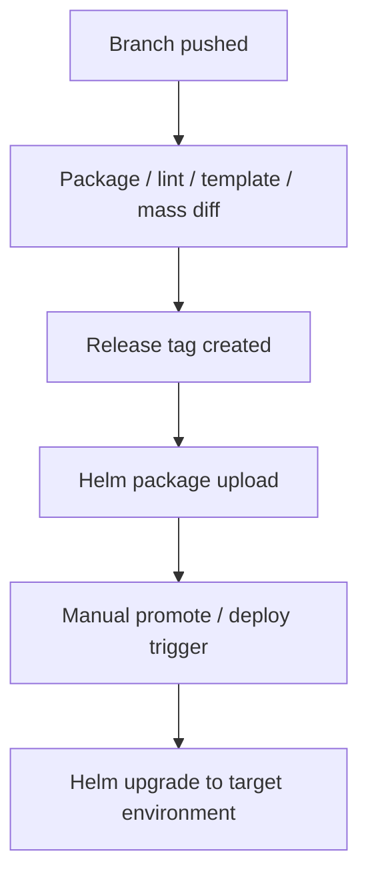

# Deployment And Release Findings

This page covers the current deployment, secrets, manifest and validation mechanisms that the proposed solution must either reuse, automate or replace.

Read this page together with:

- [Current release operating model](current-release-operating-model.md) for the current end-to-end flow.
- [Proposed release automation flow](proposed-release-automation-flow.md) for the target solution.
- [Rollout decision proposals](rollout-decision-proposals.md) for decisions that still need team sign-off.

## 1. Deployment Scripts And Helm Flow

The current deployment path focuses on the service repo and the MMA Helm repo.

Key points:

- Individual service chart Drone pipelines have existed around dev-environment Helm chart deployment.
- The MMA Helm repo contains the deployment scripts for Helm packaging, linting, templating, mass diff, uploading and deployment.
- The MMA Helm repo is different from the MMA Helm library repo, which contains Helm templates/library content.
- Future Drone pipeline deployment changes are likely to touch the MMA Helm repo and possibly service repo environment setup scripts.

Current Helm flow:



Important details:

- Helm charts are deployed as packages, not directly from local repo files.
- Environment-specific values files are included at deploy time.
- Linting and templating validate Helm/YAML rendering, but Kubernetes may still reject something Helm accepted.
- Mass diff compares rendered templates against the target/default branch to show what changes will be made.
- Tagging kicks off upload/deploy-related pipeline steps.
- Deployment itself is manually promoted/triggered.
- Deployment parameters include target environment, deployment scope, release version and chart names.
- Deployment scope can distinguish live, historical or both.
- To deploy all charts today, chart names may need to be listed explicitly.

## 2. Environment And Release Responsibilities

Current split of responsibilities:

- Developers/squads handle lower/squad environments.
- Release management handles SIT and higher environments.
- QAT approval is required before progressing beyond SIT.
- Production-like environments include B.Val/pre-production/production.
- From a technical deployment point of view, environment differences are mainly in values files, but operational process and access differ.
- B.Val may contain more data than production.
- Runbook repositories may contain environment-specific actions that must be executed alongside release activity.

Important distinction:

```text
Deployment success does not prove functional readiness.
```

Deployment checks mainly show that Helm/pods/deployment worked. Functional validation is handled by development teams and QAT, using tools such as Playwright or Cypress where available.

## 3. Feature Flags And Activation

Deployment does not always mean activation.

Feature activation may depend on values files or feature flags. Development teams decide what needs to be enabled in each environment.

Implication:

```text
The release process must track both deployed version and activation/config state.
```

## 4. Rollback Current State

Current rollback status:

- Automatic rollback is not built into the deployment scripts.
- If deployment fails, the pipeline does not automatically rollback.
- Monitoring failure does not automatically trigger rollback.
- Helm rollback is technically possible through Helm history/rollback commands.
- Recent practical behaviour has leaned towards fix-forward.

Implication:

```text
Rollback needs a documented operational process, not just Helm capability.
```

## 5. New Environment Setup Considerations

For new dev/test environments, several setup points must be addressed:

- Environment lists or setup scripts may need updating.
- Values files for new environments need to exist and match naming expectations.
- Drone secrets/tokens may need to be added for new environments.
- There is uncertainty around whether kube/robot tokens come from ACU or existing Drone/namespace secrets.
- This needs confirmation before new environments can be treated as ready.

Open items:

- Confirm which repos/scripts must be updated for each new environment.
- Confirm who owns Drone secret/token creation.
- Confirm whether ACU provides the required robot/kube tokens.
- Confirm minimum required secrets per environment.

## 6. Secrets Management

Current direction for managing secrets:

- Secrets are being extracted into the Cerberus/deployment-management structure.
- Managed secrets scripts can extract and encrypt secrets for an environment.
- Secret values are base64 encoded and encrypted.
- Secret keys should remain consistent between environments; values differ by environment.
- Access requires Git maintainer or Git-crypt maintainer setup, including GPG keys.
- The managed secrets script supports rotation and restore.
- Lower-level helper scripts such as export/encrypt secrets exist, but the managed secrets script is the main entry point.
- MSK secrets may have a separate area.

Implication:

```text
Secrets/config changes should be part of release scope and release readiness checks.
```

## 7. Release Artefact Creation

Service artefact creation flow:

- A release branch may not have a tag until it is ready.
- Creating a tag kicks off a tag creation pipeline.
- For Spring Boot services, the pipeline builds the service and runs Maven install/tests.
- Trivy vulnerability scanning and Sonar code-quality scanning run before deployable artefact creation.
- Helm package, Helm dependency build and Helm artefact upload are part of releasable artefact creation.
- Slack notification may be sent once the service artefact is created.

## 8. Umbrella Charts

The deployment-management repository packages services into umbrella charts.

Key points:

- There are around two dozen umbrella charts.
- Some umbrella charts contain one service; others contain many services.
- Release chart version updates currently happen by updating chart YAML/service versions.
- Umbrella charts allow related services to be deployed together or in isolation.

This matters for changed-chart deployment because the automation needs to reason at chart level as well as service level.

## 9. Auto Manifest And Tag Jump Scripts

Supporting scripts that still matter for release metadata, manifest generation and validation decisions.

Auto manifest has two main stages:

1. Create the release Jira ticket.
2. Create the manifest.

Supporting details:

- Scripts use Python plus tools such as `yq` and `jq`.
- Local/workspace runs may need proxy configuration to access Jira.
- Drone runs may not need the same proxy setup.
- Release version and ticket number are key inputs.
- The script gets release tickets from Jira by release label.
- The GitLab tag field on tickets is used to determine service versions/tags.
- `NA` can be used for changes that do not require a tag/version update.
- DB Liquibase has special handling because one Liquibase update may affect multiple projects.
- The script updates chart versions, writes changelog entries, creates a branch, pushes changes and raises an MR.
- Helper scripts exist for branch creation, commits, pushes and MRs.

## 10. Tag Jump Checker

The tag jump checker may be less central in the proposed non-linear release branch model, but it explains an important release risk.

It was used when the team could not safely release only a selected ticket because other merged changes might be pulled in as well.

The script:

- Compares base and release versions.
- Checks Git commit logs for ticket numbers.
- Compares discovered tickets against release tickets/labels.
- Uses labels such as tag jump and full release.
- Checks ticket status and GitLab tag fields.
- Warns or fails for missing/incorrect tag metadata.
- Flags `do not deploy` cases.
- Has dry-run support.

Known caveats:

- It may be less relevant with the proposed branching structure because version/tag order is not always linear.
- Rollback comparisons can be awkward because the script tends to prefer the higher/current version.
- Incorrect ticket numbers in commits can produce false positives.
- Some validation may currently be looser than expected, such as incorrect tags or no tags found passing when they should fail.

Implication:

```text
The new release automation must explicitly define strict validation rules for ticket status, missing tags, incorrect tags and do-not-deploy markers.
```

## Follow-Up Items

1. Confirm which scripts/repos must be updated for new dev/test environments.
2. Confirm Drone secret/token ownership for new environments.
3. Confirm whether deployment parameter validation is strict enough.
4. Confirm whether auto manifest/tag validation should fail on wrong tag, missing tag or invalid ticket status.
5. Confirm how `NA` tag entries should be represented in release reports.
6. Confirm whether tag jump logic is retired, replaced or adapted for the new branching model.
7. Confirm secrets access/onboarding process for maintainers.

## Industry Best Practices For Helm And Deployment

### Helm Chart Versioning

Treat Helm chart versions with the same discipline as application versions:

```text
Chart version: version of the chart packaging/templates.
App version: version of the application image inside the chart.
These are independent and should be tracked separately.
```

When the chart templates change (new env var, new sidecar, resource limits), bump the chart version even if the app version stays the same. This makes debugging deployment differences possible.

### Values File Organisation

For multi-environment deployments, a clean values file structure reduces errors:

```text
charts/
  myservice/
    values.yaml              ← defaults (dev-safe)
    values-dev.yaml          ← dev overrides
    values-sit.yaml          ← SIT overrides
    values-preprod.yaml      ← pre-prod overrides
    values-prod.yaml         ← production overrides
```

Principles:
- **Base values should be safe for the lowest environment.** If someone deploys without specifying an environment file, it should hit dev, not production.
- **Override files should only contain differences.** Do not duplicate the entire base file — only override what changes per environment.
- **Secrets should never be in values files.** Use sealed-secrets, external-secrets-operator or Drone secrets injection instead.

### Secrets Management: Modern Approaches

The current approach (Git-crypt, managed secrets scripts) works but has scaling limitations. Industry alternatives:

| Approach | How It Works | Pros | Cons |
| --- | --- | --- | --- |
| Git-crypt (current) | Encrypt secrets in Git with GPG keys | Simple, version-controlled | Key management overhead, onboarding friction |
| Sealed Secrets | Encrypt secrets client-side; only the cluster can decrypt | Kubernetes-native, safe to commit | Requires sealed-secrets controller per cluster |
| External Secrets Operator | Sync secrets from AWS Secrets Manager / Vault / etc. | Central secret store, rotation built-in | Extra infrastructure dependency |
| Drone secrets | Secrets stored in Drone CI, injected at pipeline time | Simple for CI/CD use | Not available at runtime in pods |

Recommended direction for Cerberus:
- Short term: Continue with managed secrets scripts + Drone secrets.
- Medium term: Evaluate External Secrets Operator to centralise secret management and simplify rotation.
- Long term: Integrate with a secrets manager (HashiCorp Vault, AWS Secrets Manager) for rotation, audit and access control.

### Dependency Management In Umbrella Charts

With ~24 umbrella charts, dependency management is critical:

```text
Chart.yaml:
  dependencies:
    - name: service-a
      version: "~1.2.0"    ← allow patch updates
      repository: "https://..."
```

Recommendations:
- Pin dependency versions to at least minor (`~1.2.0` allows `1.2.x`). Never use `*` or open ranges.
- Run `helm dependency update` in CI — do not commit the `charts/` folder with vendored dependencies unless required for air-gapped deployment.
- Use a dependency update bot (Renovate) to raise MRs when subchart versions change.
- Document which services are in which umbrella chart — a mapping table helps identify blast radius.

### Mass Diff As A Safety Net

The mass diff step (comparing rendered templates against the target branch) is an excellent safety pattern. To maximise its value:

- Make diff output mandatory reading for release approval. If the approver has not looked at the diff, the approval is incomplete.
- Flag unexpected changes (e.g., resource limits changed in production when only an env var was expected to change).
- Consider storing diff output as a pipeline artefact alongside the release report.
- If the diff shows zero changes for a chart, that chart should not be deployed — reinforce the changed-chart-only deployment default.

---

← [Current release operating model](current-release-operating-model.md) | → [Proposed release automation flow](proposed-release-automation-flow.md)
