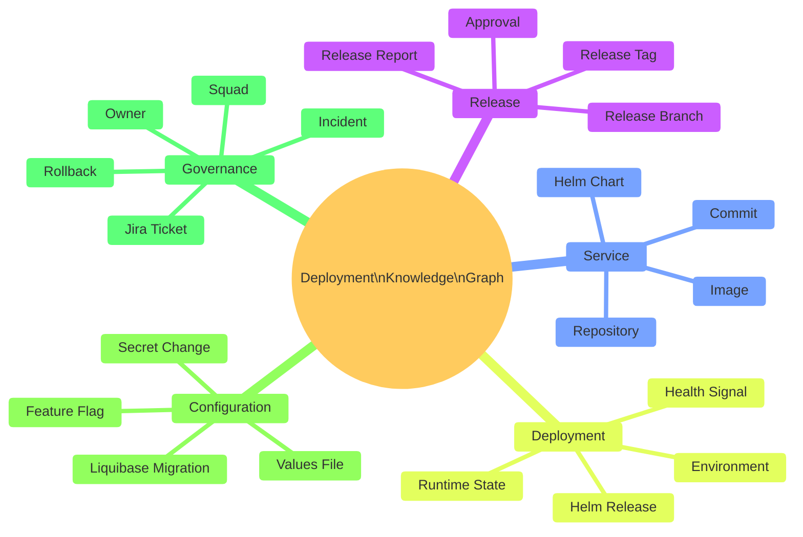
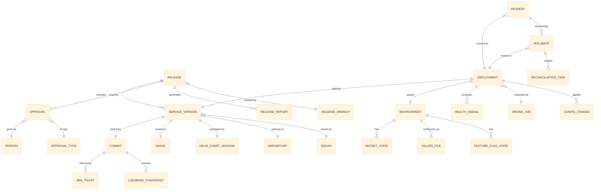

# Deployment Knowledge Graph

**Future-State Architecture for Cerberus Release Intelligence**

> **Status:** Long-term architectural proposal. Not part of the initial release automation rollout.
>
> **Relationship to Unified Control Plane:** The Knowledge Graph is the data and intelligence layer. The [Unified Deployment and Release Control Plane](transformation-programme.md#future-state-unified-deployment-and-release-control-plane) is the operational interface layer. Together they form the long-term unified platform.

This document is split into four parts:
- Part 1: [Design and Domain Model](deployment-knowledge-graph-design.md) (you are here)
- Part 2: [Implementation and Workflows](deployment-knowledge-graph-implementation.md)
- Part 3: [Operations and Technology](deployment-knowledge-graph-operations.md)
- Part 4: [Strategic Value, Business Case and Governance](deployment-knowledge-graph-business-case.md)

---

## 1. Executive Summary

The Cerberus release process produces rich operational data spread across Git, Drone, Helm, Kubernetes, Jira, deployment-management, secrets, Liquibase and observability tools. Today, answering a simple question like "what was deployed to production in release 5.14?" requires querying multiple systems manually.

A Deployment Knowledge Graph models the relationships between releases, services, commits, tags, images, charts, environments, deployments, approvals, incidents and configuration changes as a connected graph. It enables instant traversal of these relationships to answer operational, audit and incident questions without requiring humans to correlate data across tools.

This is not a replacement for existing systems. It is a read-model that ingests events from existing sources of truth, builds a connected graph of release and deployment state, and exposes query capabilities for operational, audit and intelligence use cases.

### Key Differentiator From A Dashboard

A dashboard shows pre-defined views. A knowledge graph answers arbitrary questions about relationships. "Show me all services affected by Jira ticket MMA-1234 across all environments, including which Liquibase migrations ran and which approvals were recorded" is a graph traversal, not a dashboard panel.

---

## 2. Business Value

| Value Area | Description | Beneficiary |
| --- | --- | --- |
| Incident investigation speed | Instantly trace what changed in a failing environment. | Platform, on-call, incident leads |
| Release audit compliance | Prove exactly what was deployed, when, by whom, with what approval. | Compliance, release owners, audit |
| Rollback decision support | Know immediately what rollback targets exist and what constraints apply. | Release owners, incident leads |
| Release scope visibility | See all changes (code, config, secrets, DB) in one connected view. | Release owners, squad leads |
| DORA metrics derivation | Compute deployment frequency, lead time, failure rate, MTTR from graph edges. | Engineering leadership |
| Impact analysis | Before deploying, understand downstream dependencies and blast radius. | Architects, platform team |
| Ownership clarity | Every node has an owner; orphaned services/charts are immediately visible. | Platform governance |
| Environment drift detection | Compare intended state (deployment-management) vs actual state (Kubernetes). | Platform engineers |

---

## 3. Architecture Principles

1. **Read-model, not source of truth.** The graph is derived from existing sources. It never becomes the primary store for any domain.
2. **Event-driven ingestion.** Changes flow into the graph via events. No polling where avoidable.
3. **Eventually consistent.** The graph may lag seconds behind source systems. This is acceptable for operational queries; not for deployment control.
4. **Schema-flexible.** New entity types and relationships can be added without schema migrations.
5. **Query-first design.** The graph schema is shaped by the questions it must answer, not by the source system schemas.
6. **Immutable event history.** Raw ingested events are retained for replay, audit and recomputation.
7. **Least privilege.** The graph does not store raw secrets. It stores metadata about secret changes (what changed, when, by whom) without values.
8. **Incremental build.** Start with a subset of entities and relationships; expand as sources mature.

---

## 4. Domain Model



---

## 5. Entity Relationship Model



### Core Entities

| Entity | Description | Source of Truth |
| --- | --- | --- |
| Release | A planned or completed release cycle. | Jira + deployment-management |
| Service Version | A specific tagged version of a service. | Git tag + image registry |
| Commit | A Git commit with ticket reference. | Git |
| Image | A built container image. | Image registry (Artifactory) |
| Helm Chart Version | A packaged Helm chart. | Helm registry |
| Deployment | An act of deploying a version to an environment. | Drone + Kubernetes |
| Environment | A target deployment environment. | Infrastructure/platform config |
| Approval | A recorded approval decision. | Jira / QAT workflow / future control plane |
| Jira Ticket | A work item with release metadata. | Jira |
| Liquibase Changeset | A database migration. | Liquibase changelog in Git |
| Incident | A production or environment issue. | Incident management system |
| Rollback | A decision to revert to a previous deployment. | Audit record |
| Config Change | A change to values, flags or secrets metadata. | Git + secrets management |

---

## 6. Knowledge Graph Design

### Graph Schema (Property Graph Model)

```text
Nodes:
  (:Release {id, version, status, branch, createdAt})
  (:Service {name, repository, squad, owner})
  (:ServiceVersion {tag, commitSha, imageDigest, helmChartVersion})
  (:Commit {sha, message, author, timestamp, tickets[]})
  (:Image {registry, repository, tag, digest, builtAt, pipelineJob})
  (:HelmChart {name, version, appVersion, umbrella})
  (:Environment {name, cluster, namespace, tier})
  (:Deployment {id, timestamp, status, droneJob, helmRevision})
  (:Approval {type, givenBy, timestamp, evidence})
  (:JiraTicket {key, status, assignee, squad, releaseLabel, gitlabTag})
  (:LiquibaseChangeset {id, author, filename, executedAt, rollbackBlock})
  (:Incident {id, severity, detectedAt, resolvedAt, resolution})
  (:Rollback {id, fromVersion, toVersion, decidedBy, timestamp})
  (:ConfigChange {type, key, environment, changedBy, timestamp})
  (:FeatureFlag {name, environment, enabled, lastChanged})
  (:SecretChange {name, environment, rotatedAt, rotatedBy})
  (:Squad {name, lead, members[]})
  (:Person {name, role, squad})

Relationships:
  (:Release)-[:INCLUDES]->(:ServiceVersion)
  (:Release)-[:HAS_APPROVAL]->(:Approval)
  (:Release)-[:TARGETS]->(:Environment)
  (:ServiceVersion)-[:BUILT_FROM]->(:Commit)
  (:ServiceVersion)-[:PRODUCES]->(:Image)
  (:ServiceVersion)-[:PACKAGED_AS]->(:HelmChart)
  (:ServiceVersion)-[:OWNED_BY]->(:Squad)
  (:Commit)-[:REFERENCES]->(:JiraTicket)
  (:Commit)-[:INCLUDES_MIGRATION]->(:LiquibaseChangeset)
  (:Deployment)-[:DEPLOYS]->(:ServiceVersion)
  (:Deployment)-[:TO]->(:Environment)
  (:Deployment)-[:EXECUTED_BY]->(:DroneJob)
  (:Deployment)-[:APPLIES]->(:ConfigChange)
  (:Deployment)-[:HEALTH_STATUS]->(:HealthSignal)
  (:Incident)-[:CAUSED_BY]->(:Deployment)
  (:Incident)-[:AFFECTED]->(:Service)
  (:Rollback)-[:REVERTS]->(:Deployment)
  (:Rollback)-[:TO_VERSION]->(:ServiceVersion)
  (:Rollback)-[:DECIDED_BY]->(:Person)
```

### Why A Graph Model

| Question | Relational Approach | Graph Approach |
| --- | --- | --- |
| "What was in release 5.14?" | 5+ JOIN queries across tables | Single traversal: Release → INCLUDES → ServiceVersion |
| "What deployed to production this week?" | Complex temporal JOIN | Traverse: Environment{prod} ← TO ← Deployment{this week} |
| "Which tickets are affected by incident X?" | Multi-hop JOIN through 4+ tables | Incident → CAUSED_BY → Deployment → DEPLOYS → ServiceVersion → BUILT_FROM → Commit → REFERENCES → Ticket |
| "What can I rollback to?" | Custom logic across tables | Traverse deployment history for Environment, filter by health status |
| "Which squads are impacted?" | JOIN through ownership tables | ServiceVersion → OWNED_BY → Squad |

---

## 7. Source-Of-Truth Strategy

| Data Domain | Source of Truth | Graph Role |
| --- | --- | --- |
| Code and branches | Git | Read (ingest commit/tag events) |
| Work items and release scope | Jira | Read (ingest ticket/label events) |
| Build and pipeline execution | Drone | Read (ingest job completion events) |
| Helm charts and packages | Helm registry | Read (ingest chart publish events) |
| Container images | Image registry (Artifactory) | Read (ingest image push events) |
| Deployment intent | Cerberus deployment-management | Read (ingest manifest/chart changes) |
| Actual runtime state | Kubernetes | Read (poll or watch deployments/pods) |
| Approvals | Jira / future control plane | Read (ingest approval events) |
| Secrets metadata | Secrets management | Read metadata only (never values) |
| Incidents | Incident management system | Read (ingest incident events) |
| Observability | Prometheus / OpenTelemetry / Datadog | Read (health signals, SLO status) |

**Rule:** The graph never writes back to source systems. It reads, correlates and serves queries.

---

---

→ [Part 2: Implementation and Workflows](deployment-knowledge-graph-implementation.md)
