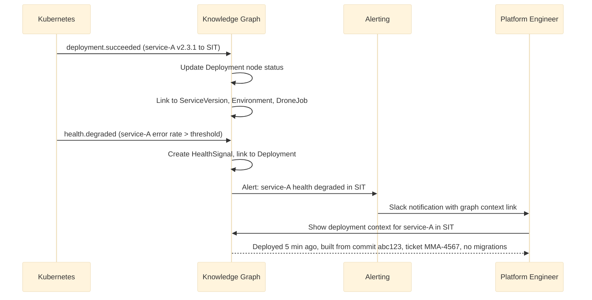
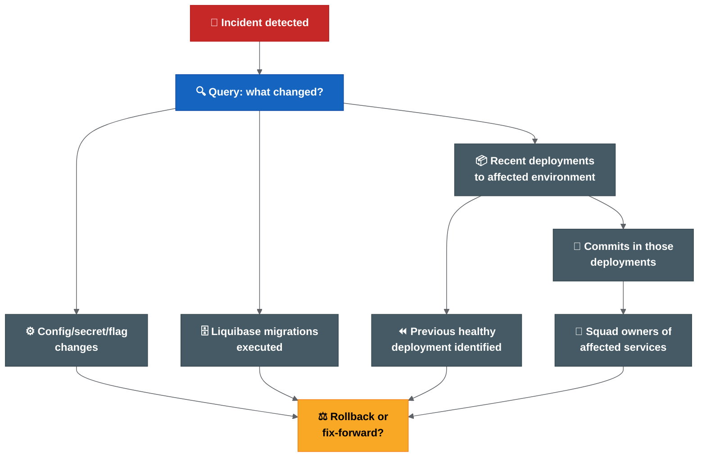
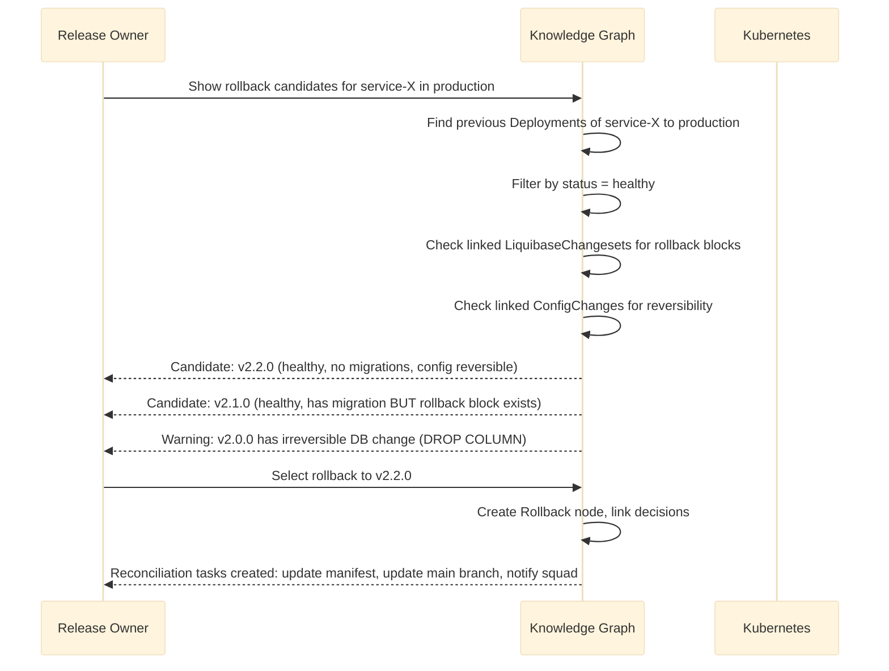

# Deployment Knowledge Graph — Implementation And Workflows

> Part 2 of 3. See [Part 1: Design](deployment-knowledge-graph-design.md) for context.

## 8. Event-Driven Architecture

```mermaid
%%{init: {'theme': 'base', 'themeVariables': {'lineColor': '#5f6368'}}}%%

flowchart LR
  subgraph SOURCES["Sources of Truth"]
    GIT["Git webhooks"]:::source
    DRONE["Drone webhooks"]:::source
    JIRA["Jira webhooks"]:::source
    K8S["K8s watch API"]:::source
    HELM["Helm registry events"]:::source
    IMG["Image registry events"]:::source
    OBS["Observability alerts"]:::source
  end

  subgraph INGESTION["Ingestion Layer"]
    BUS["Event Bus\n(Kafka / NATS / SQS)"]:::bus
    PROC["Event Processors\n(stateless workers)"]:::proc
  end

  subgraph STORAGE["Storage Layer"]
    RAW["Raw Event Store\n(immutable log)"]:::store
    GRAPH["Knowledge Graph\n(Neo4j / Neptune)"]:::graph
    SEARCH["Search Index\n(Elasticsearch)"]:::search
  end

  subgraph API["Query Layer"]
    GRAPHQL["GraphQL API"]:::api
    REST["REST API"]:::api
    UI["Dashboard / UI"]:::api
  end

  GIT & DRONE & JIRA & K8S & HELM & IMG & OBS --> BUS
  BUS --> PROC
  PROC --> RAW
  PROC --> GRAPH
  PROC --> SEARCH
  GRAPH & SEARCH --> GRAPHQL & REST
  GRAPHQL & REST --> UI

  classDef source fill:#1565c0,stroke:#0d47a1,color:#fff,font-weight:bold
  classDef bus fill:#f57c00,stroke:#e65100,color:#fff,font-weight:bold
  classDef proc fill:#455a64,stroke:#37474f,color:#fff,font-weight:bold
  classDef store fill:#6a1b9a,stroke:#4a148c,color:#fff,font-weight:bold
  classDef graph fill:#00695c,stroke:#004d40,color:#fff,font-weight:bold
  classDef search fill:#c62828,stroke:#b71c1c,color:#fff,font-weight:bold
  classDef api fill:#2e7d32,stroke:#1b5e20,color:#fff,font-weight:bold
```

### Event Types

| Event | Source | Graph Action |
| --- | --- | --- |
| `commit.pushed` | Git webhook | Create/update Commit node, link to Repository |
| `tag.created` | Git webhook | Create ServiceVersion node, link to Commit |
| `image.pushed` | Registry webhook | Create Image node, link to ServiceVersion |
| `chart.published` | Helm registry | Create HelmChart node, link to ServiceVersion |
| `pipeline.completed` | Drone webhook | Create DroneJob node, link to ServiceVersion/Deployment |
| `deployment.started` | Drone/K8s | Create Deployment node, link to Environment + ServiceVersion |
| `deployment.succeeded` | K8s watch | Update Deployment status |
| `deployment.failed` | K8s watch / Drone | Update Deployment status, create alert |
| `ticket.updated` | Jira webhook | Create/update JiraTicket node, link to Release |
| `approval.given` | Jira/workflow webhook | Create Approval node, link to Release + Person |
| `manifest.updated` | Git webhook (deployment-mgmt) | Update deployment intent, link chart versions |
| `incident.created` | Incident system webhook | Create Incident node, link to Deployment + Environment |
| `rollback.executed` | Drone/manual event | Create Rollback node, link Deployments |
| `config.changed` | Git webhook (values) | Create ConfigChange node |
| `secret.rotated` | Secrets management event | Create SecretChange node (metadata only) |
| `migration.executed` | Liquibase / pipeline event | Create LiquibaseChangeset node |

---

## 9. Data Ingestion Architecture

### Ingestion Patterns

| Pattern | When To Use | Example |
| --- | --- | --- |
| Webhook push | Source supports webhooks | Git, Drone, Jira, registry |
| Kubernetes watch | Real-time cluster state | Deployment/pod status changes |
| Periodic poll | Source has no event API | Legacy systems, Liquibase state |
| Pipeline-emitted event | Build/deploy pipeline step | Custom Drone step publishes event |
| Manual event | Operational action outside automation | Manual rollback, emergency override |

### Idempotency

Every event processor must be idempotent. Replaying the same event must produce the same graph state. This enables:
- Safe retries after ingestion failures.
- Full graph rebuild from raw event store.
- Testing with production event streams.

### Backfill Strategy

For historical data not available via webhooks:

1. Scan Git history for tags, commits and ticket references.
2. Scan Helm registry for published chart versions.
3. Scan image registry for existing images.
4. Scan Jira for release labels and ticket metadata.
5. Scan Kubernetes for current deployment state.
6. Scan deployment-management Git history for manifest changes.

---

## 10. API Architecture

### GraphQL (Primary Query Interface)

```graphql
type Query {
  release(version: String!): Release
  releases(status: ReleaseStatus, after: DateTime): [Release]
  environment(name: String!): Environment
  service(name: String!): Service
  deployment(id: ID!): Deployment
  deploymentsTo(environment: String!, after: DateTime): [Deployment]
  incident(id: ID!): Incident
  search(query: String!, types: [EntityType]): SearchResult
  impactAnalysis(serviceVersion: ID!): ImpactReport
  rollbackCandidates(environment: String!, service: String!): [RollbackTarget]
  doraMetrics(squad: String, from: DateTime, to: DateTime): DORAMetrics
}

type Release {
  version: String!
  status: ReleaseStatus!
  branch: String
  services: [ServiceVersion!]!
  approvals: [Approval!]!
  deployments: [Deployment!]!
  tickets: [JiraTicket!]!
  report: ReleaseReport
  migrations: [LiquibaseChangeset!]!
  configChanges: [ConfigChange!]!
}

type Deployment {
  id: ID!
  serviceVersion: ServiceVersion!
  environment: Environment!
  timestamp: DateTime!
  status: DeploymentStatus!
  droneJob: DroneJob
  healthSignals: [HealthSignal!]!
  approval: Approval
  configChanges: [ConfigChange!]!
  incidents: [Incident!]!
}
```

### REST (Simple Operations)

```text
GET  /api/v1/releases/{version}
GET  /api/v1/environments/{name}/current
GET  /api/v1/services/{name}/deployments
GET  /api/v1/incidents/{id}/trace
GET  /api/v1/rollback-candidates/{environment}/{service}
GET  /api/v1/metrics/dora?squad={squad}&from={date}&to={date}
POST /api/v1/events (webhook receiver)
```

---

## 11. Search And Query Capabilities

### Natural Language Queries (Mapped To Graph Traversals)

| Question | Graph Query Pattern |
| --- | --- |
| "What is in release 5.14?" | `(r:Release {version:'5.14'})-[:INCLUDES]->(sv)` return all sv with linked tickets, images, charts |
| "What is deployed to production?" | `(e:Environment {name:'production'})<-[:TO]-(d:Deployment {status:'active'})` return current deployments |
| "What changed since last deployment to SIT?" | Compare two deployment snapshots by timestamp for environment |
| "Which squads are affected by incident INC-42?" | `(i:Incident {id:'INC-42'})-[:CAUSED_BY]->(d)-[:DEPLOYS]->(sv)-[:OWNED_BY]->(sq)` |
| "Can I rollback service-X in production?" | Find previous healthy deployment of service-X in production, check Liquibase constraints |
| "What is the lead time for squad Alpha?" | Compute median time from commit timestamp to production deployment timestamp for squad |
| "Which services have no owner?" | `(s:Service) WHERE NOT (s)-[:OWNED_BY]->()` |
| "What approvals are missing for release 5.15?" | `(r:Release {version:'5.15'})-[:REQUIRES_APPROVAL]->(a) WHERE a.status = 'pending'` |

### Full-Text Search

Elasticsearch indexes:
- Commit messages
- Jira ticket summaries
- Release report content
- Incident descriptions
- Config change descriptions

Enables fuzzy search: "find all deployments related to login timeout fix".

---

## 12. Operational Use Cases

### Release Planning

```mermaid
%%{init: {'theme': 'base', 'themeVariables': {'lineColor': '#5f6368'}}}%%

sequenceDiagram
    participant RO as Release Owner
    participant KG as Knowledge Graph
    participant JIRA as Jira
    participant DM as Deployment Mgmt

    RO->>KG: Show release 5.15 scope
    KG->>KG: Traverse Release -> ServiceVersions -> Tickets
    KG-->>RO: 12 services, 34 tickets, 3 migrations
    RO->>KG: Any missing tags or validation failures?
    KG->>KG: Check ServiceVersion -> Image -> HelmChart completeness
    KG-->>RO: Service-B missing image build; Service-D has do-not-deploy marker
    RO->>JIRA: Fix Service-B ticket status
    RO->>DM: Remove do-not-deploy marker with override approval
```

### Deployment Monitoring



---

## 13. Incident Investigation Workflows



### Investigation Query Sequence

1. **What is the current state?** → Environment → active Deployments → ServiceVersions
2. **What changed recently?** → Deployments in last 24h → Commits → Tickets
3. **Were there config changes?** → ConfigChanges linked to recent Deployments
4. **Were there DB migrations?** → LiquibaseChangesets linked to recent Commits
5. **Who owns the affected services?** → ServiceVersion → Squad → Lead
6. **What is the rollback target?** → Previous Deployment with healthy HealthSignal
7. **Is rollback safe?** → Check if LiquibaseChangeset has rollback block; check if secrets changed

---

## 14. Release Audit Workflows

### Audit Query: "Prove what was in release 5.14"

```text
Graph traversal:
  Release{5.14}
    → INCLUDES → ServiceVersion[] (with tags, commit SHAs, image digests)
    → each ServiceVersion → BUILT_FROM → Commit (with author, timestamp)
    → each Commit → REFERENCES → JiraTicket[] (with status, assignee)
    → Release → HAS_APPROVAL → Approval[] (with approver, timestamp, type)
    → Release → DEPLOYED_TO → Deployment[] (with environment, timestamp, job)
    → each Deployment → APPLIES → ConfigChange[] (if any)
    → each Commit → INCLUDES_MIGRATION → LiquibaseChangeset[] (if any)

Output: Complete audit trail linking code → build → deploy → approve → validate.
```

### Compliance Report Generation

The graph can generate compliance reports that answer:
- What code reached production?
- Who approved it?
- What tests ran?
- What scans passed?
- What config changed?
- What DB schema changed?
- Who deployed it?
- Was the deployment healthy?

---

## 15. Rollback Decision Support Workflows



### Rollback Safety Matrix (Graph-Derived)

| Check | Graph Query | Safe To Rollback? |
| --- | --- | --- |
| Previous healthy version exists | Previous Deployment with HealthSignal.status = healthy | Required |
| No irreversible DB migration between versions | LiquibaseChangesets between versions all have rollback blocks | Required |
| No dependent services upgraded | No other ServiceVersions that DEPENDS_ON the current version | Recommended |
| Config/secrets are reversible | ConfigChanges between versions are additive only | Recommended |
| Helm revision exists | HelmChart at target version is still in registry | Required |

---

## Related Pages

- [Deployment Knowledge Graph](deployment-knowledge-graph-design.md)
- [Deployment Knowledge Graph — Operations And Technology](deployment-knowledge-graph-operations.md)
- [Advanced Architecture Sections](advanced-architecture-sections.md)
- [Architecture Diagrams](architecture-review/architecture-diagrams.md)
