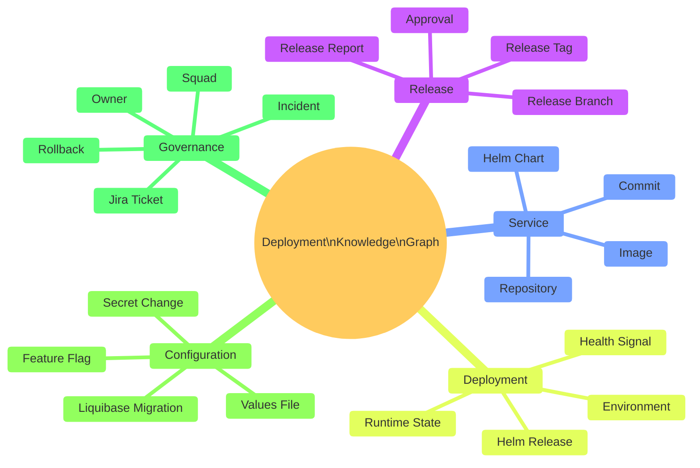
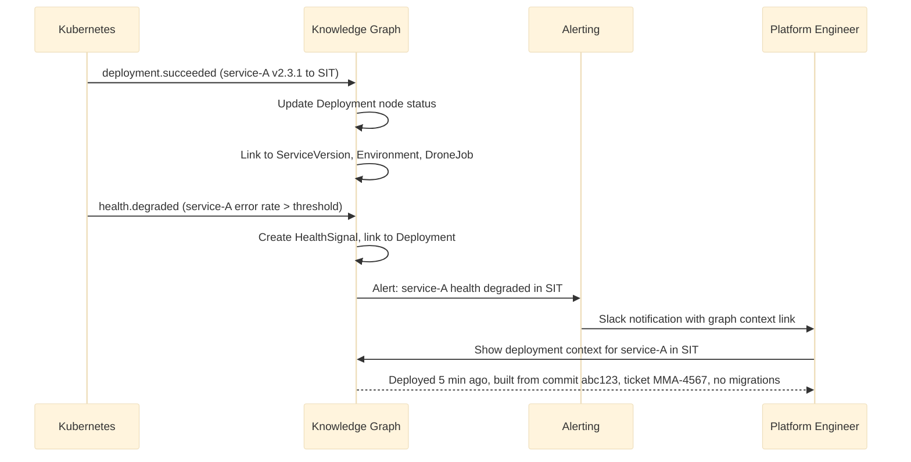
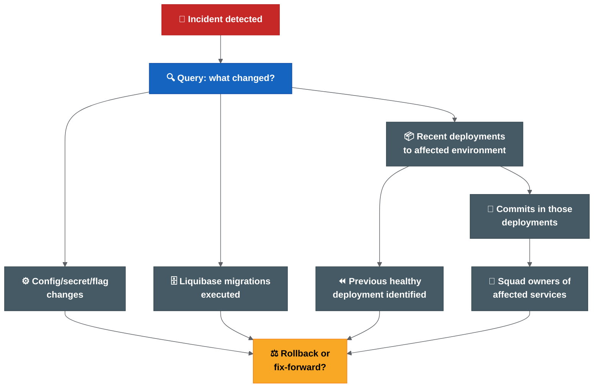
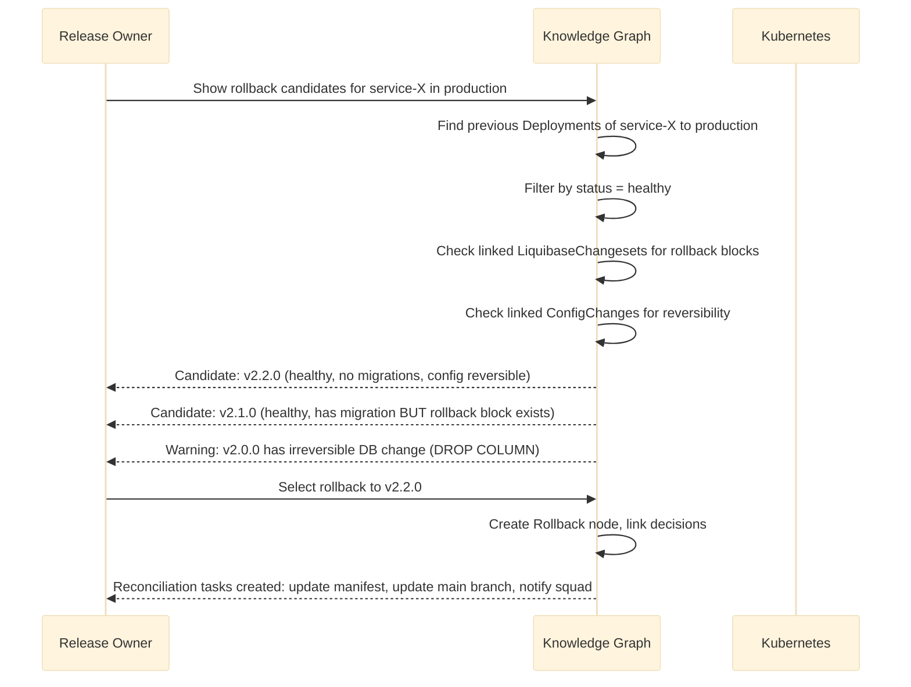

# Deployment Knowledge Graph

**Future-State Architecture for Cerberus Release Intelligence**

> **Status:** Long-term architectural proposal. Not part of the initial release automation rollout. This extends the Unified Deployment and Release Control Plane described in the Transformation Programme.

---

## 1. Executive Summary

The Cerberus release process produces rich operational data spread across Git, Drone, Helm, Kubernetes, Jira, deployment-management, secrets, Liquibase and observability tools. Today, answering a simple question like "what was deployed to production in release 5.14?" requires querying multiple systems manually.

A Deployment Knowledge Graph models the relationships between releases, services, commits, tags, images, charts, environments, deployments, approvals, incidents and configuration changes as a connected graph. It enables instant traversal of these relationships to answer operational, audit and incident questions without requiring humans to correlate data across tools.

This is not a replacement for existing systems. It is a read-model that ingests events from existing sources of truth, builds a connected graph of release and deployment state, and exposes query capabilities for operational, audit and intelligence use cases.

### Key Differentiator From A Dashboard

A dashboard shows pre-defined views. A knowledge graph answers arbitrary questions about relationships. "Show me all services affected by Jira ticket MMA-1234 across all environments, including which Liquibase migrations ran and which approvals were recorded" is a graph traversal, not a dashboard panel.

---

## 2. Business Value

| Value Area | Description | Beneficiary |
| --- | --- | --- |
| Incident investigation speed | Instantly trace what changed in a failing environment. | Platform, on-call, incident leads |
| Release audit compliance | Prove exactly what was deployed, when, by whom, with what approval. | Compliance, release owners, audit |
| Rollback decision support | Know immediately what rollback targets exist and what constraints apply. | Release owners, incident leads |
| Release scope visibility | See all changes (code, config, secrets, DB) in one connected view. | Release owners, squad leads |
| DORA metrics derivation | Compute deployment frequency, lead time, failure rate, MTTR from graph edges. | Engineering leadership |
| Impact analysis | Before deploying, understand downstream dependencies and blast radius. | Architects, platform team |
| Ownership clarity | Every node has an owner; orphaned services/charts are immediately visible. | Platform governance |
| Environment drift detection | Compare intended state (deployment-management) vs actual state (Kubernetes). | Platform engineers |

---

## 3. Architecture Principles

1. **Read-model, not source of truth.** The graph is derived from existing sources. It never becomes the primary store for any domain.
2. **Event-driven ingestion.** Changes flow into the graph via events. No polling where avoidable.
3. **Eventually consistent.** The graph may lag seconds behind source systems. This is acceptable for operational queries; not for deployment control.
4. **Schema-flexible.** New entity types and relationships can be added without schema migrations.
5. **Query-first design.** The graph schema is shaped by the questions it must answer, not by the source system schemas.
6. **Immutable event history.** Raw ingested events are retained for replay, audit and recomputation.
7. **Least privilege.** The graph does not store raw secrets. It stores metadata about secret changes (what changed, when, by whom) without values.
8. **Incremental build.** Start with a subset of entities and relationships; expand as sources mature.

---

## 4. Domain Model



---

## 5. Entity Relationship Model

```mermaid
%%{init: {'theme': 'base', 'themeVariables': {'lineColor': '#5f6368'}}}%%

erDiagram
    RELEASE ||--o{ SERVICE_VERSION : includes
    RELEASE ||--o{ APPROVAL : requires
    RELEASE ||--o{ RELEASE_REPORT : generates
    RELEASE }|--|| RELEASE_BRANCH : "tracked by"

    SERVICE_VERSION ||--|| COMMIT : "built from"
    SERVICE_VERSION ||--|| IMAGE : produces
    SERVICE_VERSION ||--|| HELM_CHART_VERSION : "packaged as"
    SERVICE_VERSION }|--|| REPOSITORY : "belongs to"
    SERVICE_VERSION }|--|| SQUAD : "owned by"

    COMMIT ||--o{ JIRA_TICKET : references
    COMMIT ||--o{ LIQUIBASE_CHANGESET : includes

    DEPLOYMENT ||--|| SERVICE_VERSION : deploys
    DEPLOYMENT }|--|| ENVIRONMENT : "targets"
    DEPLOYMENT ||--o{ HEALTH_SIGNAL : produces
    DEPLOYMENT }|--|| DRONE_JOB : "executed by"
    DEPLOYMENT ||--o{ CONFIG_CHANGE : applies

    ENVIRONMENT ||--o{ SECRET_STATE : has
    ENVIRONMENT ||--o{ VALUES_FILE : configured_by
    ENVIRONMENT ||--o{ FEATURE_FLAG_STATE : has

    INCIDENT }|--|| DEPLOYMENT : "caused by"
    INCIDENT ||--o{ ROLLBACK : "resolved by"

    ROLLBACK }|--|| DEPLOYMENT : "reverts to"
    ROLLBACK ||--o{ RECONCILIATION_TASK : creates

    APPROVAL }|--|| PERSON : "given by"
    APPROVAL }|--|| APPROVAL_TYPE : "of type"
```



### Core Entities

| Entity | Description | Source of Truth |
| --- | --- | --- |
| Release | A planned or completed release cycle. | Jira + deployment-management |
| Service Version | A specific tagged version of a service. | Git tag + image registry |
| Commit | A Git commit with ticket reference. | Git |
| Image | A built container image. | Image registry (Artifactory) |
| Helm Chart Version | A packaged Helm chart. | Helm registry |
| Deployment | An act of deploying a version to an environment. | Drone + Kubernetes |
| Environment | A target deployment environment. | Infrastructure/platform config |
| Approval | A recorded approval decision. | Jira / QAT workflow / future control plane |
| Jira Ticket | A work item with release metadata. | Jira |
| Liquibase Changeset | A database migration. | Liquibase changelog in Git |
| Incident | A production or environment issue. | Incident management system |
| Rollback | A decision to revert to a previous deployment. | Audit record |
| Config Change | A change to values, flags or secrets metadata. | Git + secrets management |

---

## 6. Knowledge Graph Design

### Graph Schema (Property Graph Model)

```text
Nodes:
  (:Release {id, version, status, branch, createdAt})
  (:Service {name, repository, squad, owner})
  (:ServiceVersion {tag, commitSha, imageDigest, helmChartVersion})
  (:Commit {sha, message, author, timestamp, tickets[]})
  (:Image {registry, repository, tag, digest, builtAt, pipelineJob})
  (:HelmChart {name, version, appVersion, umbrella})
  (:Environment {name, cluster, namespace, tier})
  (:Deployment {id, timestamp, status, droneJob, helmRevision})
  (:Approval {type, givenBy, timestamp, evidence})
  (:JiraTicket {key, status, assignee, squad, releaseLabel, gitlabTag})
  (:LiquibaseChangeset {id, author, filename, executedAt, rollbackBlock})
  (:Incident {id, severity, detectedAt, resolvedAt, resolution})
  (:Rollback {id, fromVersion, toVersion, decidedBy, timestamp})
  (:ConfigChange {type, key, environment, changedBy, timestamp})
  (:FeatureFlag {name, environment, enabled, lastChanged})
  (:SecretChange {name, environment, rotatedAt, rotatedBy})
  (:Squad {name, lead, members[]})
  (:Person {name, role, squad})

Relationships:
  (:Release)-[:INCLUDES]->(:ServiceVersion)
  (:Release)-[:HAS_APPROVAL]->(:Approval)
  (:Release)-[:TARGETS]->(:Environment)
  (:ServiceVersion)-[:BUILT_FROM]->(:Commit)
  (:ServiceVersion)-[:PRODUCES]->(:Image)
  (:ServiceVersion)-[:PACKAGED_AS]->(:HelmChart)
  (:ServiceVersion)-[:OWNED_BY]->(:Squad)
  (:Commit)-[:REFERENCES]->(:JiraTicket)
  (:Commit)-[:INCLUDES_MIGRATION]->(:LiquibaseChangeset)
  (:Deployment)-[:DEPLOYS]->(:ServiceVersion)
  (:Deployment)-[:TO]->(:Environment)
  (:Deployment)-[:EXECUTED_BY]->(:DroneJob)
  (:Deployment)-[:APPLIES]->(:ConfigChange)
  (:Deployment)-[:HEALTH_STATUS]->(:HealthSignal)
  (:Incident)-[:CAUSED_BY]->(:Deployment)
  (:Incident)-[:AFFECTED]->(:Service)
  (:Rollback)-[:REVERTS]->(:Deployment)
  (:Rollback)-[:TO_VERSION]->(:ServiceVersion)
  (:Rollback)-[:DECIDED_BY]->(:Person)
```

### Why A Graph Model

| Question | Relational Approach | Graph Approach |
| --- | --- | --- |
| "What was in release 5.14?" | 5+ JOIN queries across tables | Single traversal: Release → INCLUDES → ServiceVersion |
| "What deployed to production this week?" | Complex temporal JOIN | Traverse: Environment{prod} ← TO ← Deployment{this week} |
| "Which tickets are affected by incident X?" | Multi-hop JOIN through 4+ tables | Incident → CAUSED_BY → Deployment → DEPLOYS → ServiceVersion → BUILT_FROM → Commit → REFERENCES → Ticket |
| "What can I rollback to?" | Custom logic across tables | Traverse deployment history for Environment, filter by health status |
| "Which squads are impacted?" | JOIN through ownership tables | ServiceVersion → OWNED_BY → Squad |

---

## 7. Source-Of-Truth Strategy

| Data Domain | Source of Truth | Graph Role |
| --- | --- | --- |
| Code and branches | Git | Read (ingest commit/tag events) |
| Work items and release scope | Jira | Read (ingest ticket/label events) |
| Build and pipeline execution | Drone | Read (ingest job completion events) |
| Helm charts and packages | Helm registry | Read (ingest chart publish events) |
| Container images | Image registry (Artifactory) | Read (ingest image push events) |
| Deployment intent | Cerberus deployment-management | Read (ingest manifest/chart changes) |
| Actual runtime state | Kubernetes | Read (poll or watch deployments/pods) |
| Approvals | Jira / future control plane | Read (ingest approval events) |
| Secrets metadata | Secrets management | Read metadata only (never values) |
| Incidents | Incident management system | Read (ingest incident events) |
| Observability | Prometheus / OpenTelemetry / Datadog | Read (health signals, SLO status) |

**Rule:** The graph never writes back to source systems. It reads, correlates and serves queries.

---

## 8. Event-Driven Architecture

```mermaid
%%{init: {'theme': 'base', 'themeVariables': {'lineColor': '#5f6368'}}}%%

flowchart LR
  subgraph SOURCES["Sources of Truth"]
    GIT["Git webhooks"]:::source
    DRONE["Drone webhooks"]:::source
    JIRA["Jira webhooks"]:::source
    K8S["K8s watch API"]:::source
    HELM["Helm registry events"]:::source
    IMG["Image registry events"]:::source
    OBS["Observability alerts"]:::source
  end

  subgraph INGESTION["Ingestion Layer"]
    BUS["Event Bus\n(Kafka / NATS / SQS)"]:::bus
    PROC["Event Processors\n(stateless workers)"]:::proc
  end

  subgraph STORAGE["Storage Layer"]
    RAW["Raw Event Store\n(immutable log)"]:::store
    GRAPH["Knowledge Graph\n(Neo4j / Neptune)"]:::graph
    SEARCH["Search Index\n(Elasticsearch)"]:::search
  end

  subgraph API["Query Layer"]
    GRAPHQL["GraphQL API"]:::api
    REST["REST API"]:::api
    UI["Dashboard / UI"]:::api
  end

  GIT & DRONE & JIRA & K8S & HELM & IMG & OBS --> BUS
  BUS --> PROC
  PROC --> RAW
  PROC --> GRAPH
  PROC --> SEARCH
  GRAPH & SEARCH --> GRAPHQL & REST
  GRAPHQL & REST --> UI

  classDef source fill:#1565c0,stroke:#0d47a1,color:#fff,font-weight:bold
  classDef bus fill:#f57c00,stroke:#e65100,color:#fff,font-weight:bold
  classDef proc fill:#455a64,stroke:#37474f,color:#fff,font-weight:bold
  classDef store fill:#6a1b9a,stroke:#4a148c,color:#fff,font-weight:bold
  classDef graph fill:#00695c,stroke:#004d40,color:#fff,font-weight:bold
  classDef search fill:#c62828,stroke:#b71c1c,color:#fff,font-weight:bold
  classDef api fill:#2e7d32,stroke:#1b5e20,color:#fff,font-weight:bold
```

### Event Types

| Event | Source | Graph Action |
| --- | --- | --- |
| `commit.pushed` | Git webhook | Create/update Commit node, link to Repository |
| `tag.created` | Git webhook | Create ServiceVersion node, link to Commit |
| `image.pushed` | Registry webhook | Create Image node, link to ServiceVersion |
| `chart.published` | Helm registry | Create HelmChart node, link to ServiceVersion |
| `pipeline.completed` | Drone webhook | Create DroneJob node, link to ServiceVersion/Deployment |
| `deployment.started` | Drone/K8s | Create Deployment node, link to Environment + ServiceVersion |
| `deployment.succeeded` | K8s watch | Update Deployment status |
| `deployment.failed` | K8s watch / Drone | Update Deployment status, create alert |
| `ticket.updated` | Jira webhook | Create/update JiraTicket node, link to Release |
| `approval.given` | Jira/workflow webhook | Create Approval node, link to Release + Person |
| `manifest.updated` | Git webhook (deployment-mgmt) | Update deployment intent, link chart versions |
| `incident.created` | Incident system webhook | Create Incident node, link to Deployment + Environment |
| `rollback.executed` | Drone/manual event | Create Rollback node, link Deployments |
| `config.changed` | Git webhook (values) | Create ConfigChange node |
| `secret.rotated` | Secrets management event | Create SecretChange node (metadata only) |
| `migration.executed` | Liquibase / pipeline event | Create LiquibaseChangeset node |

---

## 9. Data Ingestion Architecture

### Ingestion Patterns

| Pattern | When To Use | Example |
| --- | --- | --- |
| Webhook push | Source supports webhooks | Git, Drone, Jira, registry |
| Kubernetes watch | Real-time cluster state | Deployment/pod status changes |
| Periodic poll | Source has no event API | Legacy systems, Liquibase state |
| Pipeline-emitted event | Build/deploy pipeline step | Custom Drone step publishes event |
| Manual event | Operational action outside automation | Manual rollback, emergency override |

### Idempotency

Every event processor must be idempotent. Replaying the same event must produce the same graph state. This enables:
- Safe retries after ingestion failures.
- Full graph rebuild from raw event store.
- Testing with production event streams.

### Backfill Strategy

For historical data not available via webhooks:

1. Scan Git history for tags, commits and ticket references.
2. Scan Helm registry for published chart versions.
3. Scan image registry for existing images.
4. Scan Jira for release labels and ticket metadata.
5. Scan Kubernetes for current deployment state.
6. Scan deployment-management Git history for manifest changes.

---

## 10. API Architecture

### GraphQL (Primary Query Interface)

```graphql
type Query {
  release(version: String!): Release
  releases(status: ReleaseStatus, after: DateTime): [Release]
  environment(name: String!): Environment
  service(name: String!): Service
  deployment(id: ID!): Deployment
  deploymentsTo(environment: String!, after: DateTime): [Deployment]
  incident(id: ID!): Incident
  search(query: String!, types: [EntityType]): SearchResult
  impactAnalysis(serviceVersion: ID!): ImpactReport
  rollbackCandidates(environment: String!, service: String!): [RollbackTarget]
  doraMetrics(squad: String, from: DateTime, to: DateTime): DORAMetrics
}

type Release {
  version: String!
  status: ReleaseStatus!
  branch: String
  services: [ServiceVersion!]!
  approvals: [Approval!]!
  deployments: [Deployment!]!
  tickets: [JiraTicket!]!
  report: ReleaseReport
  migrations: [LiquibaseChangeset!]!
  configChanges: [ConfigChange!]!
}

type Deployment {
  id: ID!
  serviceVersion: ServiceVersion!
  environment: Environment!
  timestamp: DateTime!
  status: DeploymentStatus!
  droneJob: DroneJob
  healthSignals: [HealthSignal!]!
  approval: Approval
  configChanges: [ConfigChange!]!
  incidents: [Incident!]!
}
```

### REST (Simple Operations)

```text
GET  /api/v1/releases/{version}
GET  /api/v1/environments/{name}/current
GET  /api/v1/services/{name}/deployments
GET  /api/v1/incidents/{id}/trace
GET  /api/v1/rollback-candidates/{environment}/{service}
GET  /api/v1/metrics/dora?squad={squad}&from={date}&to={date}
POST /api/v1/events (webhook receiver)
```

---

## 11. Search And Query Capabilities

### Natural Language Queries (Mapped To Graph Traversals)

| Question | Graph Query Pattern |
| --- | --- |
| "What is in release 5.14?" | `(r:Release {version:'5.14'})-[:INCLUDES]->(sv)` return all sv with linked tickets, images, charts |
| "What is deployed to production?" | `(e:Environment {name:'production'})<-[:TO]-(d:Deployment {status:'active'})` return current deployments |
| "What changed since last deployment to SIT?" | Compare two deployment snapshots by timestamp for environment |
| "Which squads are affected by incident INC-42?" | `(i:Incident {id:'INC-42'})-[:CAUSED_BY]->(d)-[:DEPLOYS]->(sv)-[:OWNED_BY]->(sq)` |
| "Can I rollback service-X in production?" | Find previous healthy deployment of service-X in production, check Liquibase constraints |
| "What is the lead time for squad Alpha?" | Compute median time from commit timestamp to production deployment timestamp for squad |
| "Which services have no owner?" | `(s:Service) WHERE NOT (s)-[:OWNED_BY]->()` |
| "What approvals are missing for release 5.15?" | `(r:Release {version:'5.15'})-[:REQUIRES_APPROVAL]->(a) WHERE a.status = 'pending'` |

### Full-Text Search

Elasticsearch indexes:
- Commit messages
- Jira ticket summaries
- Release report content
- Incident descriptions
- Config change descriptions

Enables fuzzy search: "find all deployments related to login timeout fix".

---

## 12. Operational Use Cases

### Release Planning

```mermaid
%%{init: {'theme': 'base', 'themeVariables': {'lineColor': '#5f6368'}}}%%

sequenceDiagram
    participant RO as Release Owner
    participant KG as Knowledge Graph
    participant JIRA as Jira
    participant DM as Deployment Mgmt

    RO->>KG: Show release 5.15 scope
    KG->>KG: Traverse Release -> ServiceVersions -> Tickets
    KG-->>RO: 12 services, 34 tickets, 3 migrations
    RO->>KG: Any missing tags or validation failures?
    KG->>KG: Check ServiceVersion -> Image -> HelmChart completeness
    KG-->>RO: Service-B missing image build; Service-D has do-not-deploy marker
    RO->>JIRA: Fix Service-B ticket status
    RO->>DM: Remove do-not-deploy marker with override approval
```

### Deployment Monitoring



---

## 13. Incident Investigation Workflows



### Investigation Query Sequence

1. **What is the current state?** → Environment → active Deployments → ServiceVersions
2. **What changed recently?** → Deployments in last 24h → Commits → Tickets
3. **Were there config changes?** → ConfigChanges linked to recent Deployments
4. **Were there DB migrations?** → LiquibaseChangesets linked to recent Commits
5. **Who owns the affected services?** → ServiceVersion → Squad → Lead
6. **What is the rollback target?** → Previous Deployment with healthy HealthSignal
7. **Is rollback safe?** → Check if LiquibaseChangeset has rollback block; check if secrets changed

---

## 14. Release Audit Workflows

### Audit Query: "Prove what was in release 5.14"

```text
Graph traversal:
  Release{5.14}
    → INCLUDES → ServiceVersion[] (with tags, commit SHAs, image digests)
    → each ServiceVersion → BUILT_FROM → Commit (with author, timestamp)
    → each Commit → REFERENCES → JiraTicket[] (with status, assignee)
    → Release → HAS_APPROVAL → Approval[] (with approver, timestamp, type)
    → Release → DEPLOYED_TO → Deployment[] (with environment, timestamp, job)
    → each Deployment → APPLIES → ConfigChange[] (if any)
    → each Commit → INCLUDES_MIGRATION → LiquibaseChangeset[] (if any)

Output: Complete audit trail linking code → build → deploy → approve → validate.
```

### Compliance Report Generation

The graph can generate compliance reports that answer:
- What code reached production?
- Who approved it?
- What tests ran?
- What scans passed?
- What config changed?
- What DB schema changed?
- Who deployed it?
- Was the deployment healthy?

---

## 15. Rollback Decision Support Workflows



### Rollback Safety Matrix (Graph-Derived)

| Check | Graph Query | Safe To Rollback? |
| --- | --- | --- |
| Previous healthy version exists | Previous Deployment with HealthSignal.status = healthy | Required |
| No irreversible DB migration between versions | LiquibaseChangesets between versions all have rollback blocks | Required |
| No dependent services upgraded | No other ServiceVersions that DEPENDS_ON the current version | Recommended |
| Config/secrets are reversible | ConfigChanges between versions are additive only | Recommended |
| Helm revision exists | HelmChart at target version is still in registry | Required |

---

## 16. Security And RBAC Model

### Access Levels

| Role | Can View | Can Trigger | Can Override |
| --- | --- | --- | --- |
| Developer / Squad member | Own squad services, deployments, tickets | Nothing via graph | Nothing |
| Squad lead | Own squad + dependent services | Nothing via graph | Nothing |
| Release owner | All release scope, approvals, environment state | Deployment (via Drone) | Chart exclusion (with audit) |
| Platform engineer | All environments, infrastructure, pipeline state | Rerun failed jobs | Manual state correction (with audit) |
| QAT | Release scope, validation status, environment health | Nothing via graph | Nothing |
| Incident lead | All environments, deployment history, rollback targets | Rollback (via process) | Emergency override (with audit) |
| Audit / compliance | Read-only full history | Nothing | Nothing |

### Data Sensitivity

| Data Type | Graph Storage | Access Control |
| --- | --- | --- |
| Commit messages | Full text | Team-visible |
| Jira ticket details | Summary + status (not comments) | Team-visible |
| Image digests | Full | Platform-visible |
| Secret values | **Never stored** | N/A |
| Secret change metadata | Name + timestamp + rotatedBy | Platform + release owner |
| Environment connection strings | **Never stored** | N/A |
| Approval records | Full | Audit-visible |
| Incident details | Summary + severity + resolution | Team-visible |

---

## 17. Data Retention And Compliance

| Data Category | Retention Period | Reason |
| --- | --- | --- |
| Active release data | Indefinite (while release is active or recent) | Operational |
| Deployment history | 2 years minimum | Audit trail, incident investigation |
| Approval records | 5 years minimum | Compliance, governance |
| Incident links | 3 years minimum | Post-incident review, trend analysis |
| Raw events | 1 year (hot) + 5 years (cold/archive) | Replay, recomputation, legal |
| DORA metrics | Indefinite (aggregated) | Trend reporting |
| Deleted/archived services | Retained with archived flag | Audit continuity |

### GDPR / Data Protection

- Personal data (names in approvals, commit authors) should follow data retention policies.
- Graph should support pseudonymisation if required.
- Right-to-erasure may require replacing person nodes with anonymised identifiers after retention period.

---

## 18. Integration Points

### Git Integration

| Event | Webhook | Data Extracted |
| --- | --- | --- |
| Push | `push` event | Commits, messages, authors, ticket references |
| Tag | `tag` event | ServiceVersion creation, release branch link |
| MR merge | `merge_request` event | Feature/hotfix merged into release branch |
| Branch creation | `branch` event | Release branch lifecycle |

### Jira Integration

| Event | Webhook | Data Extracted |
| --- | --- | --- |
| Ticket updated | `jira:issue_updated` | Status change, GitLab tag field, release label |
| Release label added | Custom webhook / poll | Ticket included in release scope |
| Approval recorded | Workflow transition webhook | QAT or release owner approval |

### Drone Integration

| Event | Webhook | Data Extracted |
| --- | --- | --- |
| Build started | `build` event | Pipeline execution start |
| Build completed | `build` event | Image built, tests passed, scans completed |
| Deployment triggered | `deploy` event (or promote) | Deployment to environment |
| Pipeline failed | `build` event | Failure with step information |

### Helm Integration

| Event | Source | Data Extracted |
| --- | --- | --- |
| Chart published | Registry webhook / poll | Chart name, version, app version |
| Helm release installed/upgraded | Kubernetes watch or Drone event | Helm revision, values used |

### Kubernetes Integration

| Event | Source | Data Extracted |
| --- | --- | --- |
| Deployment created/updated | K8s watch API | Image, replicas, status, namespace |
| Pod health change | K8s watch API | Ready/not-ready, restart count |
| HPA scaling | K8s watch API | Resource pressure signals |

### Cerberus Deployment-Management Integration

| Event | Source | Data Extracted |
| --- | --- | --- |
| Chart version updated | Git webhook on deployment-management repo | Intended version per environment |
| Manifest MR created | GitLab MR webhook | Release candidate manifest state |
| Manifest MR merged | GitLab MR webhook | Deployment intent confirmed |

### Observability Integration

| Event | Source | Data Extracted |
| --- | --- | --- |
| SLO breach | Prometheus alertmanager / Datadog webhook | Health degradation signal |
| Error rate spike | Custom alert rule | Post-deployment health signal |
| Latency anomaly | Custom alert rule | Performance regression signal |

### Secret Management Integration

| Event | Source | Data Extracted |
| --- | --- | --- |
| Secret rotated | Secrets management event (metadata only) | Which secret, which environment, when, by whom |
| Secret access granted | GPG/git-crypt event | Who gained access to which environment secrets |

---

## 19. Recommended Technology Options

### Graph Database

| Option | Strengths | Weaknesses | Fit |
| --- | --- | --- | --- |
| **Neo4j** | Mature, Cypher query language, rich tooling, strong community. | Operational overhead (self-hosted) or cost (Aura cloud). | Best for complex relationship queries and visualisation. |
| **Amazon Neptune** | Managed, scales well, supports both property graph and RDF. | Less mature query tooling, AWS lock-in. | Good if already AWS-native. |
| **PostgreSQL + Apache AGE** | Reuses existing Postgres skills, no new infrastructure. | Less performant for deep traversals, less mature graph tooling. | Good for start-small approach. |
| **Relational (PostgreSQL only)** | Simple, well-understood, existing team skills. | Deeply nested queries become expensive and hard to maintain. | Suitable for Phase 1 (simple joins) but limits future complex queries. |

### Neo4j vs Relational Comparison

| Aspect | Neo4j (Graph) | PostgreSQL (Relational) |
| --- | --- | --- |
| Query: "What is in release X?" | Single Cypher traversal | 3-5 JOINs |
| Query: "Trace incident to root cause" | Variable-depth traversal (fast) | Recursive CTE (complex, slow at depth) |
| Query: "Find all services affected by commit" | Pattern match across relationships | Multi-table JOIN with ticket cross-reference |
| Schema changes | Add labels/relationships without migration | ALTER TABLE, migration scripts |
| Visualisation | Built-in graph browser | Requires custom UI |
| Team familiarity | New skill (Cypher) | Existing skill (SQL) |
| Infrastructure | New system to operate | Existing PostgreSQL available |
| Recommendation | **Best for Phase 3+ when complex queries justify cost** | **Best for Phase 1-2 as MVP with simpler queries** |

### Event Bus

| Option | Strengths | Fit |
| --- | --- | --- |
| **Apache Kafka** | Durable, replayable, well-suited for event sourcing. | Best for high-volume, multi-consumer scenarios. |
| **NATS** | Lightweight, fast, easy to operate. | Good for lower volume or simpler setups. |
| **AWS SQS/SNS** | Managed, no operational overhead. | Good if AWS-native. |
| **Redis Streams** | Fast, simple, already common in stacks. | Good for MVP / start-small. |

### Search

| Option | Fit |
| --- | --- |
| **Elasticsearch / OpenSearch** | Full-text search across commit messages, tickets, reports. |
| **PostgreSQL full-text** | Simpler but less capable for fuzzy/ranked search. |

### UI / Dashboard

| Option | Fit |
| --- | --- |
| **Custom React/Next.js dashboard** | Full control, tailored to workflows. |
| **Backstage plugin** | Integrates with existing developer portal if adopted. |
| **Grafana (for metrics only)** | Good for DORA metrics visualisation, not for graph exploration. |

### Backstage Integration Options

If Backstage is adopted as the internal developer portal:

1. **Backstage catalog entity provider:** Sync services, squads and ownership from the knowledge graph into the Backstage catalog.
2. **Backstage plugin for release view:** Custom plugin that queries the GraphQL API to show release scope, environment state and deployment history within Backstage.
3. **Backstage TechDocs integration:** Generate release reports from the graph and publish as TechDocs.
4. **Backstage scaffolder integration:** Use graph ownership data to pre-populate scaffolder templates for new services.

Backstage is a presentation layer option, not a replacement for the knowledge graph itself.

---

## 20. Incremental Implementation Roadmap

| Phase | Timeframe | Scope | Technology | Outcome |
| --- | --- | --- | --- | --- |
| 0 | After release automation is stable | Define schema, agree query requirements | Design only | Documented graph schema and priority queries |
| 1 | Month 9-12 | Core entities: Release, ServiceVersion, Deployment, Environment | PostgreSQL + simple relationships | Basic "what is deployed where?" query |
| 2 | Month 12-15 | Add Jira tickets, commits, approvals | PostgreSQL + full-text search | "What is in release X?" with ticket cross-reference |
| 3 | Month 15-18 | Add Liquibase, config changes, health signals | Migrate to Neo4j if query complexity justifies | Incident investigation support |
| 4 | Month 18-24 | Add incident linking, rollback decision support | Neo4j + GraphQL API | Rollback safety assessment from graph |
| 5 | Month 24+ | DORA metrics derivation, full audit export, Backstage integration | Full platform | Complete deployment intelligence platform |

### Build vs Buy Analysis

| Approach | Pros | Cons | Recommendation |
| --- | --- | --- | --- |
| **Build custom** | Exact fit for Cerberus toolchain; full control; no vendor lock-in. | Development effort; maintenance burden; requires graph/platform expertise. | Recommended for core graph and API. |
| **Buy platform (e.g. Cortex, OpsLevel, Humanitec)** | Fast start; managed; feature-rich. | May not fit Cerberus toolchain; vendor lock-in; cost; may not support Drone/GitLab/Cerberus specifics. | Evaluate for UI/dashboard layer only. |
| **Adopt Backstage + custom plugins** | Open-source; extensible; community support; developer portal benefits. | Still requires custom plugins for graph queries; not a graph database. | Recommended as UI layer on top of custom graph. |
| **Hybrid: Custom graph + Backstage UI + managed graph DB** | Best of both; focused effort on domain logic; managed infrastructure. | Integration complexity; multiple vendors. | Recommended target architecture. |

**Recommended approach:** Build the graph model and ingestion layer custom (it is domain-specific). Use managed infrastructure (Neo4j Aura or Amazon Neptune) to reduce operational burden. Use Backstage or custom UI for the presentation layer.

---

## Risks

| Risk | Impact | Mitigation |
| --- | --- | --- |
| Graph becomes stale or inaccurate | Teams lose trust and stop using it. | Automated data quality checks; reconciliation against live state. |
| Over-engineering before automation is stable | Delays the immediate release improvement work. | Do not start Phase 1 until Drone automation is green for multiple releases. |
| Schema becomes too rigid | New entity types or relationships are hard to add. | Use property graph model (inherently flexible); avoid over-normalisation. |
| Performance degrades with scale | Slow queries discourage use. | Index frequently-traversed relationships; paginate results; cache common queries. |
| Security: graph exposes sensitive deployment data | Unauthorised access to production topology. | RBAC from day one; never store secret values; audit all queries. |
| Team lacks graph database skills | Implementation quality suffers. | Start with PostgreSQL (Phase 1-2); train team; migrate to Neo4j when justified. |

---

## Anti-Patterns

| Anti-Pattern | Why It Fails | Correct Approach |
| --- | --- | --- |
| Making the graph a write-through deployment tool | Creates a second source of truth; bypasses existing controls. | Graph is read-only; triggers go through existing Drone/Helm pipelines. |
| Ingesting everything from day one | Overwhelming complexity; poor data quality early on. | Start with core entities; add progressively as sources mature. |
| Building the graph before release metadata is standardised | Garbage in, garbage out. | Complete validation and metadata standardisation (Phase 1-2 of transformation) first. |
| Replacing Jira/Git/Drone instead of reading from them | Massive scope; team resistance; fragmentation risk. | Graph reads from existing tools; never replaces them. |
| Custom UI before API is stable | UI becomes tightly coupled to unstable schema. | API-first; UI consumes stable GraphQL/REST endpoints. |
| Ignoring data retention | Legal/compliance risk; storage cost explosion. | Define retention policy before ingesting historical data. |

---

## Summary

The Deployment Knowledge Graph is the intelligence layer that sits above the Unified Deployment and Release Control Plane. While the control plane provides operational workflow (approve, deploy, rollback), the knowledge graph provides understanding (what happened, why, what is connected, what is the impact).

It should be built incrementally, starting only after the immediate release automation, validation and ownership work is stable. The recommended path is:

1. Stabilise release automation (current transformation Phase 0-4).
2. Define graph schema and priority queries (design phase).
3. Build MVP with PostgreSQL (simple relationships, core entities).
4. Migrate to Neo4j when query complexity justifies it.
5. Add incident, rollback and DORA intelligence progressively.
6. Consider Backstage integration for developer-facing UI.

> **This is a long-term architectural investment. It creates compounding value as more events are ingested and more relationships are traversed. But it only works if the underlying data (tags, manifests, tickets, approvals) is reliable — which is why the immediate transformation must come first.**

---

← [Platform engineering strategy](platform-engineering-strategy.md) | → [README](../README.md)
