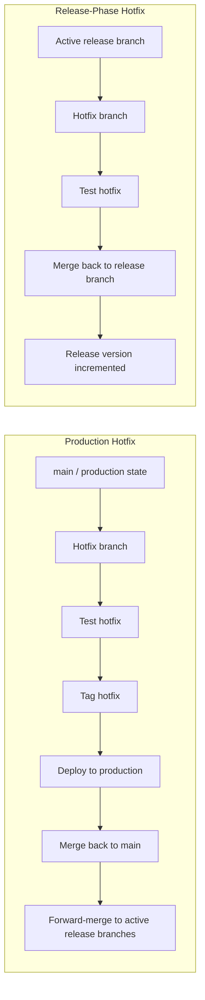
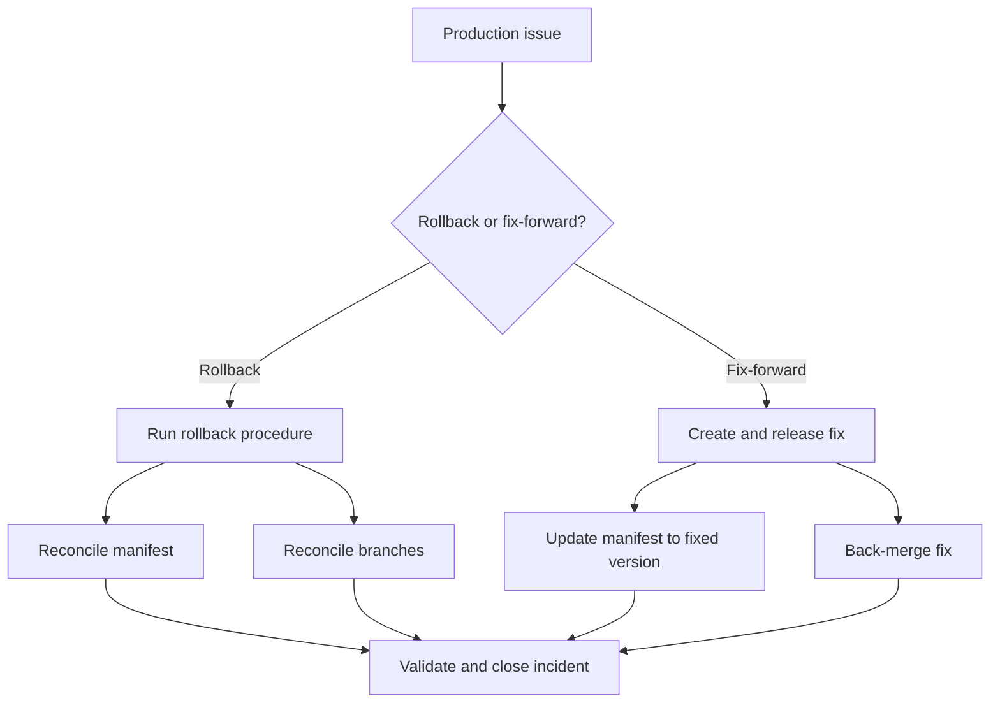

# Hotfix And Rollback

This page captures the open hotfix and rollback questions.

Rollback and hotfix handling need to be clear because they affect the branching model, tag strategy, manifest updates and post-release reconciliation.

## Hotfix Current Understanding

Hotfixes should be possible from the production state, but the detailed flow still needs to be clarified.

There are two distinct hotfix scenarios that must be supported:

### Production Hotfix (Critical Live Issue)

When a critical issue is found in production and no active release branch covers it:

```text
main / production state
  -> hotfix branch (from main)
  -> test and release hotfix
  -> update production
  -> merge hotfix back into main
  -> forward-merge hotfix into any active release branches
```

This is for urgent production fixes that cannot wait for the next release cycle.

### Release-Phase Hotfix (Issue Found During Release Preparation)

When an issue is found during release preparation or testing:

```text
active release branch
  -> hotfix branch (from release branch)
  -> test hotfix
  -> merge back into release branch
  -> release version incremented as normal
```

This is for fixes discovered during SIT, QAT or pre-production validation.

### Shared Behaviour

Both hotfix types share the following automation behaviour:

- Feature and hotfix branches are treated similarly by the automation.
- Commits on a hotfix branch should generate a deployable candidate and update the matching Cerberus chart branch.
- When merged into the target branch, the hotfix should increment the release version/tag like any other merged change.
- CVE and Renovate-style changes are expected to raise hotfix/MR work targeting the active release branch.



## Hotfix Questions To Answer

- Who approves a hotfix merge?
- When is the hotfix tagged?
- How is the manifest updated?
- How is the hotfix forward-merged into active release branches?
- How do we prevent hotfix drift between production and `main`?
- How do CVE/Renovate hotfix branches get reviewed and prioritised during release work?
- What is the maximum acceptable time from hotfix decision to production deployment?

## Rollback Current Understanding

Rollback appears to be technically possible through Helm, but it is not currently built into the automated deployment flow.

Current state:

```text
Rollback capability: technically possible through Helm
Automated rollback: not currently built into deployment flow
Operational rollback process: unclear / not fully standardised
Common practical response: fix-forward
```



## Rollback Questions To Answer

- Is rollback a standard operating path or mostly an exception?
- When do we rollback vs fix-forward?
- Who owns the rollback decision?
- Who executes the rollback?
- Is rollback tested regularly?
- How are rollback actions audited?
- How are branches and manifests reconciled after rollback?

## What Exactly Rolls Back?

The rollback process should say whether rollback includes:

- Service image.
- Helm chart.
- Values/config.
- Manifest.
- Runbook changes.
- Secrets or environment variables.
- Database or data changes, where relevant.

If some items are not rolled back, the process should say so explicitly.

## Database And Liquibase Rollback

Database changes require special consideration because they are often forward-only.

### Current Understanding

- Liquibase is used for database schema and data changes.
- One Liquibase update may affect multiple projects.
- Liquibase changesets are typically applied once and tracked by checksum.
- There is no standard rollback block requirement documented.

### Proposed Rollback Rules

| Scenario | Action |
| --- | --- |
| Schema change with rollback block | Execute Liquibase rollback as part of the release rollback. |
| Schema change without rollback block | Fix-forward is likely the only safe option. Document why rollback is not possible. |
| Destructive data change (DROP, DELETE) | Cannot be rolled back. Fix-forward or restore from backup. Incident process applies. |
| Additive-only change (ADD COLUMN, new table) | May not need rollback if application code handles both states. |

### Recommended Practice

```text
Every production Liquibase changeset should include a rollback block or a documented justification for why rollback is not supported.
```

Release readiness for changes that include Liquibase should confirm:

1. Rollback block exists, or explicit documentation explains why not.
2. The change has been tested in a lower environment with the same rollback path.
3. The team understands whether fix-forward or rollback is the plan if the release fails.
4. If rollback is not possible, this is flagged in the release report.

## Branch And Manifest Reconciliation

Rollback is not only an environment action. It can create source-control and release-state questions.

The process should define:

- Whether `master` still reflects production after rollback.
- Whether the manifest is reverted or updated to the rollback version.
- Whether the failed release branch remains open.
- Whether a fix-forward branch is created.
- Whether `development` needs a revert, fix or follow-up merge.
- How the release notes/changelog reflect the rollback.

## Suggested Operating Principles

Useful principles to confirm:

- Hotfixes start from the known production baseline.
- `master` must stay aligned with production state.
- Hotfixes are back-merged into `development` and relevant active release branches.
- Rollback decisions are owned, documented and audited.
- Rollback instructions include code, chart, manifest, config and runbook impact.
- Fix-forward is allowed only when the risk is lower than rollback and the decision is explicit.

## Output Needed

The team should produce:

1. A documented hotfix flow.
2. A documented rollback flow.
3. A rollback vs fix-forward decision guide.
4. A branch reconciliation checklist.
5. A manifest reconciliation checklist.
6. Clear ownership for decision, execution and validation.

---

← [Automation and validation](automation-and-validation.md) | → [Release scope, ownership and approvals](scope-ownership-approvals.md)
