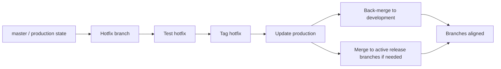
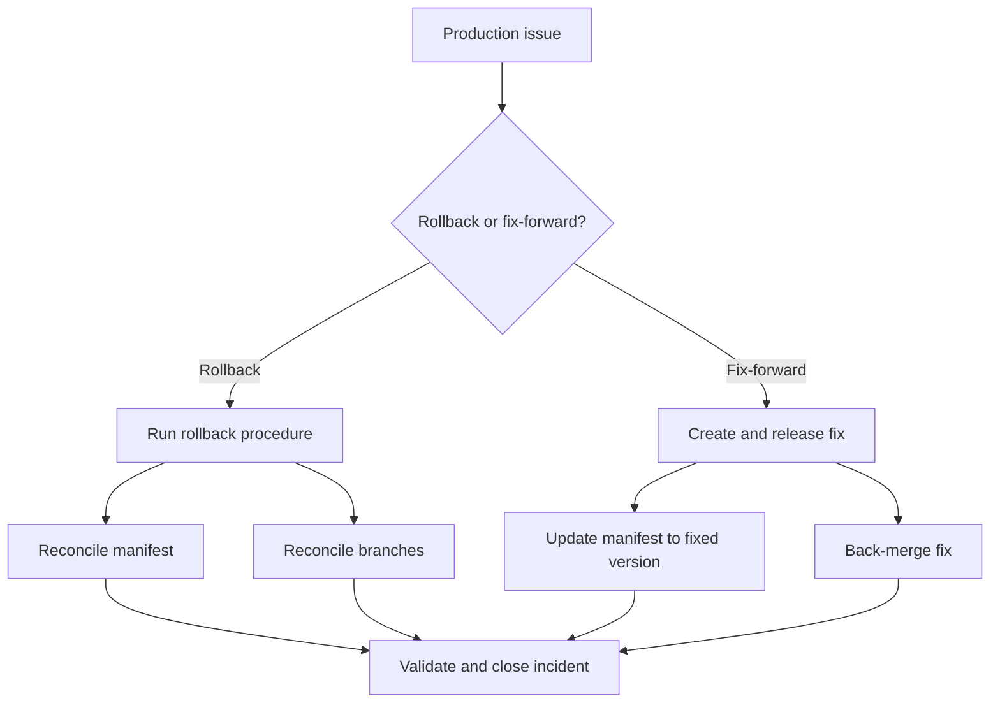

# Hotfix And Rollback

This page captures the open hotfix and rollback questions.

Rollback and hotfix handling need to be clear because they affect the branching model, tag strategy, manifest updates and post-release reconciliation.

## Hotfix Current Understanding

Hotfixes should be possible from the production state, but the detailed flow still needs to be clarified.

Current baseline expectation to confirm:

```text
production state / master
  -> hotfix branch
  -> test and release hotfix
  -> update production
  -> merge hotfix back into development
  -> merge hotfix into any active release branches if needed
```

The KT sessions described a more release-branch-centred automation flow:

- Feature and hotfix branches are treated similarly.
- Hotfix branches can be created from the active release branch.
- Commits on a hotfix branch should generate a deployable candidate and update the matching Cerberus chart branch.
- When merged into the release branch, the hotfix should increment the release version/tag like any other merged change.
- CVE and Renovate-style changes are expected to raise hotfix/MR work targeting the active release branch.



## Hotfix Questions To Answer

- Should hotfixes always be made from `master`?
- In the proposed model, should release-phase hotfixes target the active release branch instead?
- Who approves a hotfix merge?
- Does a hotfix create a release branch or a hotfix branch?
- When is the hotfix tagged?
- How is the manifest updated?
- How is the hotfix merged back into `development`?
- How is the hotfix merged into any active release branches?
- How do we prevent hotfix drift between production and development?
- How do CVE/Renovate hotfix branches get reviewed and prioritised during release work?

## Rollback Current Understanding

Rollback appears to be technically possible through Helm, but it is not currently built into the automated deployment flow.

Current state:

```text
Rollback capability: technically possible through Helm
Automated rollback: not currently built into deployment flow
Operational rollback process: unclear / not fully standardised
Common practical response: fix-forward
```



## Rollback Questions To Answer

- Is rollback a standard operating path or mostly an exception?
- When do we rollback vs fix-forward?
- Who owns the rollback decision?
- Who executes the rollback?
- Is rollback tested regularly?
- How are rollback actions audited?
- How are branches and manifests reconciled after rollback?

## What Exactly Rolls Back?

The rollback process should say whether rollback includes:

- Service image.
- Helm chart.
- Values/config.
- Manifest.
- Runbook changes.
- Secrets or environment variables.
- Database or data changes, where relevant.

If some items are not rolled back, the process should say so explicitly.

## Branch And Manifest Reconciliation

Rollback is not only an environment action. It can create source-control and release-state questions.

The process should define:

- Whether `master` still reflects production after rollback.
- Whether the manifest is reverted or updated to the rollback version.
- Whether the failed release branch remains open.
- Whether a fix-forward branch is created.
- Whether `development` needs a revert, fix or follow-up merge.
- How the release notes/changelog reflect the rollback.

## Suggested Operating Principles

Useful principles to confirm:

- Hotfixes start from the known production baseline.
- `master` must stay aligned with production state.
- Hotfixes are back-merged into `development` and relevant active release branches.
- Rollback decisions are owned, documented and audited.
- Rollback instructions include code, chart, manifest, config and runbook impact.
- Fix-forward is allowed only when the risk is lower than rollback and the decision is explicit.

## Output Needed

The team should produce:

1. A documented hotfix flow.
2. A documented rollback flow.
3. A rollback vs fix-forward decision guide.
4. A branch reconciliation checklist.
5. A manifest reconciliation checklist.
6. Clear ownership for decision, execution and validation.
