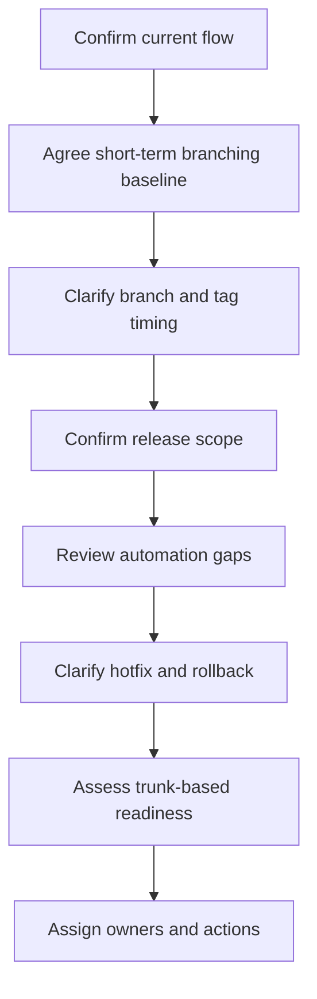

# Meeting Agenda And Actions

This page can be used to structure the next branching strategy discussion.

## Suggested Framing

Use this framing to keep the discussion focused:

```text
The release challenge is broader than the branch model itself.
Branching is one part of the process, but the release flow also depends on service tags, Helm artefacts, manifests, configuration and feature flags, runbooks, environment access, QAT approval, rollback and ownership.

Before deciding whether to stay with GitFlow, simplify release branches or move towards trunk-based development, we should confirm the current release flow end to end and identify which parts need to be standardised or automated.
```

## Suggested Agenda

1. Confirm the current end-to-end release flow.
2. Confirm the short-term branching baseline.
3. Clarify release branch timing and tag timing.
4. Confirm release scope across services and repositories.
5. Review automation gaps and Gareth's automation work.
6. Clarify rollback and hotfix handling.
7. Assess trunk-based development readiness.
8. Agree documentation and follow-up actions.

Use [rollout decision proposals](rollout-decision-proposals.md) as the approval checklist for the latest KT follow-up.



## Discussion Questions

### 1. Current Flow

- Where is the release branch cut?
- When is the service tag created?
- Which pipeline creates the releasable artefact?
- How is the manifest updated?
- Which approvals are required before deployment?
- What happens after production release?

### 2. Release Scope

- Which repositories are included in a release?
- Are service repos, Helm repos, deployment management, secrets/config and runbooks all in scope?
- What does "all services" mean in practice?
- Should automation process all services or only changed services?

### 3. Automation

- Which steps are currently manual?
- Which steps will Gareth's automation cover?
- Will the automation only process services with actual changes?
- Where will audit trail and approval gates sit?
- What should fail automatically?

### 4. Hotfix And Rollback

- What is the standard rollback path today?
- When do we rollback vs fix-forward?
- How are rollback changes reflected in manifests and branches?
- How are hotfixes back-merged into `development` and release branches?
- Who owns decision, execution and validation?

### 5. Trunk-Based Readiness

- Are feature flags runtime-changeable?
- Are feature flags currently stored in chart/value files?
- Can config changes be made without redeployment?
- Is test coverage sufficient for frequent trunk integration?
- Is rollback or disablement fast enough?

## Proposed Meeting Outcomes

Useful outcomes would be:

1. A confirmed current-state branching/release flow.
2. Agreement on the short-term branching baseline.
3. Agreement on release branch and tag timing.
4. A clear list of repositories/services in release scope.
5. A clear view of automation improvements in progress.
6. An action to document the hotfix process.
7. An action to document the rollback process.
8. An action to define tag/manifest validation rules.
9. A decision on whether trunk-based development is near-term or longer-term.
10. Clear ownership for follow-up actions.

## Proposed Next Actions

1. Create a current-state release flow diagram.
2. Create a repository and service scope list.
3. Create an automation gap list.
4. Document the hotfix process.
5. Document the rollback process.
6. Document tag, artefact and manifest validation rules.
7. Document environment differences between B.Val/pre-production and production.
8. Create a service ownership and approval matrix.
9. Assess feature flag and configuration readiness for trunk-based development.
10. Align on short-term improvements versus longer-term branching strategy changes.

## Short-Term Recommendation

```text
Do not change the branching model first.

First make the current process visible, repeatable and auditable:
- release flow
- release scope
- branch/tag timing
- tag and manifest validation
- hotfix flow
- rollback flow
- ownership and approvals

Then decide whether the branching model should be kept, simplified or replaced.
```
