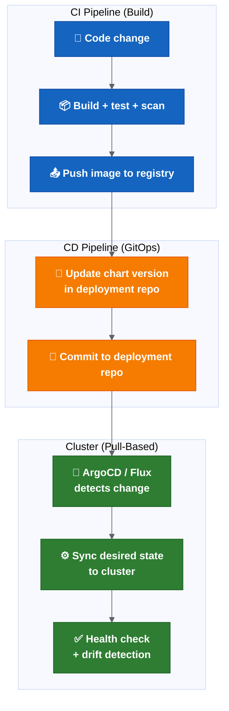

# Platform Engineering Strategy — Advanced

> **This section is not a blocker for the initial release automation rollout.** All items below are medium-term or long-term improvements.

See [platform engineering strategy](platform-engineering-strategy.md) for environment promotion, deployment strategies and observability gates.

## 4. GitOps Readiness

### Current State

The current model is partially GitOps-aligned:
- Cerberus deployment-management repo holds chart versions and deployment state (Git as source of truth).
- Changes are applied via Drone pipelines (push-based).
- Deployment is triggered by manual promotion or pipeline step.

This is **push-based CI/CD**, not full GitOps. The key difference:

| Aspect | Push-Based (Current) | Pull-Based (GitOps) |
| --- | --- | --- |
| Who applies changes | Pipeline pushes to cluster | Controller in cluster pulls from Git |
| Drift detection | None (cluster may drift from Git) | Continuous (controller reconciles) |
| Rollback | Manual Helm rollback | Revert Git commit → controller syncs |
| Audit trail | Pipeline logs | Git history (complete, immutable) |
| Secret handling | Injected at deploy time | Sealed Secrets or External Secrets Operator |

### GitOps Target Architecture



### ArgoCD vs Flux Comparison

| Feature | ArgoCD | Flux |
| --- | --- | --- |
| UI | Rich web UI with app visualisation | Minimal (CLI + Grafana dashboards) |
| Multi-tenancy | Application projects with RBAC | Namespace-based tenancy |
| Helm support | Native (renders in-cluster) | Native (HelmRelease CRD) |
| Rollback | One-click in UI or CLI | Git revert → auto-sync |
| Notifications | Built-in (Slack, webhook, etc.) | Notification controller (separate) |
| Progressive delivery | Via Argo Rollouts (same ecosystem) | Via Flagger |
| Learning curve | Medium | Medium |
| Ecosystem fit | Better if also using Argo Workflows / Rollouts | Better if purely Git-centric |

### Recommended GitOps Adoption Path

```text
Phase 1 (Now): Treat the deployment-management repo as the GitOps source of truth.
              No manual changes to cluster state. All changes via Git.
              This is achievable without installing ArgoCD.

Phase 2 (Medium-term): Install ArgoCD in non-prod.
                        Configure it to sync from the deployment-management repo.
                        Validate drift detection and auto-sync behaviour.
                        Keep Drone for CI (build + test + push image).
                        Let ArgoCD handle CD (sync chart versions to cluster).

Phase 3 (Long-term): ArgoCD in production.
                      Remove Drone deployment steps (Drone only builds).
                      Add Argo Rollouts for progressive delivery.
                      Full GitOps: rollback = git revert.
```

### Prerequisites Before GitOps Adoption

- Deployment-management repo must be the single source of truth (no manual kubectl/helm overrides).
- Secrets must be handled without putting plain values in Git (Sealed Secrets or External Secrets Operator).
- Branch protection on deployment-management repo must prevent unauthorized changes.
- ArgoCD RBAC must align with release ownership model.
- Monitoring must detect sync failures and drift.

---

## 5. SBOM And Supply Chain Security

### Current State

Current security posture:
- Trivy vulnerability scanning runs during artefact creation.
- Sonar code quality scanning runs.
- No SBOM generation observed.
- No artefact signing observed.
- No provenance attestation observed.

### Why Supply Chain Security Matters

```text
A release is only trustworthy if you can prove:
1. What source code produced it (provenance).
2. What dependencies are inside it (SBOM).
3. That it was not tampered with after build (signing).
4. That known vulnerabilities were assessed (scanning).
```

The current process covers (4) but not (1), (2) or (3).

### SLSA Framework Levels

SLSA (Supply-chain Levels for Software Artifacts) defines maturity levels:

| Level | Requirement | Current State |
| --- | --- | --- |
| SLSA 1 | Build process exists and produces provenance | Partial (Drone builds, no provenance doc) |
| SLSA 2 | Build service is hosted (not local), provenance is signed | Partial (Drone is hosted, no signing) |
| SLSA 3 | Build platform is hardened, provenance is non-forgeable | Not met |
| SLSA 4 | Two-party review, hermetic builds | Not met |

### Recommended Supply Chain Controls


### Tool Recommendations

| Capability | Tool Options | Integration Point |
| --- | --- | --- |
| SBOM generation | Syft, Trivy, Docker Scout | Build pipeline (after image build) |
| Vulnerability scan | Trivy (already in use), Grype | Build pipeline + periodic rescan |
| Image signing | Cosign (Sigstore), Notation (OCI) | Build pipeline (after push to registry) |
| Signature verification | Cosign verify, Kyverno admission policy | Deployment time (admission controller) |
| Provenance attestation | SLSA GitHub/GitLab generators, in-toto | Build pipeline (metadata generation) |
| Dependency pinning | Renovate (already mentioned), Dependabot | Ongoing (MR-based updates) |

### Recommended Adoption Path

```text
Phase 1 (Quick win): Generate SBOM with Trivy during existing scan step. Store as pipeline artefact.
                      Cost: minimal (Trivy already runs, add --format spdx-json flag).

Phase 2 (Medium-term): Sign container images with Cosign after push to registry.
                        Store signatures in the same registry (OCI artefact).
                        Add Cosign verify step before deployment.

Phase 3 (Long-term): Add Kyverno or OPA Gatekeeper admission policy that rejects unsigned images.
                      Generate SLSA provenance attestation.
                      Periodic SBOM rescan for newly discovered CVEs in deployed images.
```

### Quick Win: SBOM Generation

Adding SBOM generation to the existing pipeline requires one additional command:

```bash
# After image build and before push
trivy image --format spdx-json --output sbom.spdx.json myregistry/myservice:${TAG}
```

This produces a machine-readable inventory of every dependency in the image. It can be stored alongside the release report and used for:
- Post-release CVE triage (which services are affected by a new CVE?).
- Compliance and audit (what open-source licences are in production?).
- Incident response (does our production contain Log4Shell?).

---

## Maturity Roadmap Summary

```mermaid
%%{init: {'theme': 'base', 'themeVariables': {'lineColor': '#5f6368'}}}%%

flowchart LR
  subgraph NOW["Now (Phase 1)"]
    N1["✅ Release automation in Drone"]:::now
    N2["✅ Strict tag/manifest validation"]:::now
    N3["✅ Document promotion model"]:::now
    N4["✅ SBOM generation (Trivy flag)"]:::now
  end

  subgraph NEXT["Next (Phase 2)"]
    X1["🔜 Blue-green for critical services"]:::next
    X2["🔜 Pipeline observability query"]:::next
    X3["🔜 Image signing (Cosign)"]:::next
    X4["🔜 ArgoCD in non-prod"]:::next
  end

  subgraph FUTURE["Future (Phase 3)"]
    F1["🎯 Canary / Argo Rollouts"]:::future
    F2["🎯 SLO-based auto-promotion"]:::future
    F3["🎯 Admission policy (reject unsigned)"]:::future
    F4["🎯 ArgoCD in production"]:::future
  end

  NOW --> NEXT --> FUTURE

  classDef now fill:#2e7d32,stroke:#1b5e20,color:#fff,font-weight:bold
  classDef next fill:#1565c0,stroke:#0d47a1,color:#fff,font-weight:bold
  classDef future fill:#7b1fa2,stroke:#4a148c,color:#fff,font-weight:bold
```



## 6. Unified Deployment Control Plane (Long-Term)

This is a long-term platform capability. It sits after release automation, validation, ownership, environment readiness and rollback maturity are stable.

A unified deployment and release control plane could become the single operational interface for releases — one place to view environment state, validate readiness, approve promotions, trigger deployments, track audit trails and support rollback decisions.

It should start read-only (dashboarding existing state) and later integrate with approval workflow, deployment triggers, rollback assistant, metrics and GitOps/progressive delivery if those are adopted.

Maturity sequence:

```text
Release automation
  → Release state visibility
  → Validation dashboard
  → Approval workflow
  → Controlled deployment trigger
  → Rollback assistant
  → GitOps / progressive delivery integration
```

This is a future option, subject to platform strategy approval. It is not part of the initial rollout. For the full description, see [Transformation Programme — Future State: Unified Deployment And Release Control Plane](transformation-programme.md#future-state-unified-deployment-and-release-control-plane).

## Related Pages

- [Platform Engineering Strategy](platform-engineering-strategy.md)
- [Deployment Knowledge Graph — Operations And Technology](deployment-knowledge-graph-operations.md)
- [Advanced Architecture Sections](advanced-architecture-sections.md)
- [Final Scorecard And Verdict](architecture-review/final-scorecard-and-verdict.md)
