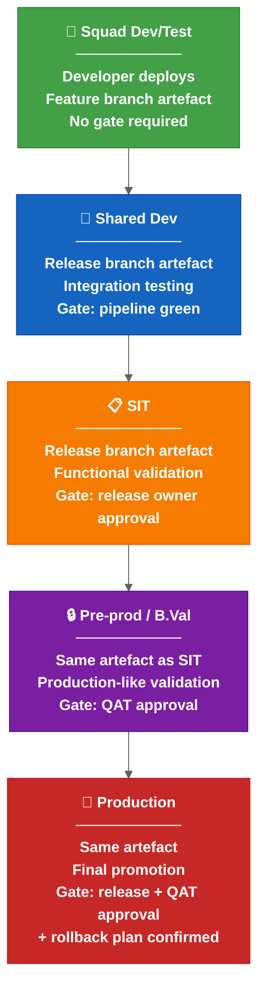
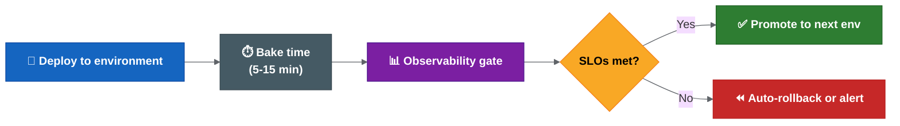

# Platform Engineering Strategy

> **This section is not a blocker for the initial release automation rollout.** It describes the maturity roadmap after the immediate release operating model is stabilised. All items below (SBOM, ArgoCD, Argo Rollouts, canary deployment, observability gates, supply chain security) are **medium-term or long-term improvements**, not immediate required changes.

This page covers the platform-level capabilities that strengthen the release process beyond branching and CI/CD pipelines: environment promotion, deployment strategies, observability gates, GitOps readiness and supply chain security.

These are not immediate blockers for the release automation rollout, but they represent the maturity path that moves the team from "release automation works" to "releases are safe, observable and verifiable by design."

## 1. Environment Promotion Model

### Current State

The current promotion path is understood but not formally documented as a model:

```text
Squad dev/test → Shared dev → SIT → B.Val / Pre-prod → Production
```

Promotion today is largely manual: a person triggers deployment to the next environment after the previous one passes some form of validation.

### Target Promotion Model



### Promotion Rules

| Rule | Description |
| --- | --- |
| Immutable artefact | The same container image and Helm package moves through all environments. Never rebuild for a higher environment. |
| Environment-specific config only | Values files, secrets and feature flags are the only things that change between environments. |
| Gate before promotion | Each promotion requires a defined gate to pass. No silent auto-promote to production. |
| Audit trail | Every promotion records: who, when, which version, which gate passed, link to pipeline. |
| No skipping | Cannot promote to production without passing through pre-prod. Exception: approved emergency hotfix with explicit release-owner sign-off. |

### Promotion Gate Matrix

| Environment | Trigger | Gate | Approver |
| --- | --- | --- | --- |
| Squad dev/test | Developer push/trigger | Pipeline green | None (self-service) |
| Shared dev | Merge to release branch | Pipeline green + chart update complete | Automated |
| SIT | Release owner decision | Release report generated + changed charts identified | Release owner |
| Pre-prod / B.Val | QAT progression | SIT functional validation complete | QAT lead |
| Production | Release approval | QAT approved + rollback plan + release report final | Release owner + QAT |

---

## 2. Deployment Strategy

### Current State

The current deployment approach appears to be a standard Kubernetes **rolling update**: pods are replaced in sequence, health checks confirm readiness, and Helm manages the upgrade.

This works but has limitations:
- If health checks pass but functional issues exist, the full rollout completes before the problem is detected.
- Rollback requires manual `helm rollback` or redeployment.
- There is no traffic-based validation before full rollout.

### Deployment Strategy Options

```mermaid
%%{init: {'theme': 'base', 'themeVariables': {'lineColor': '#5f6368'}}}%%

flowchart TD
  subgraph CURRENT["Current: Rolling Update"]
    R1["Replace pods sequentially"]:::current
    R2["Health check gates"]:::current
    R3["Full rollout or manual rollback"]:::current
    R1 --> R2 --> R3
  end

  subgraph NEXT["Near-term: Blue-Green"]
    B1["Deploy new version alongside old"]:::next
    B2["Validate new version (no traffic)"]:::next
    B3["Switch traffic atomically"]:::next
    B4["Instant rollback: switch back"]:::next
    B1 --> B2 --> B3 --> B4
  end

  subgraph FUTURE["Future: Canary / Progressive"]
    C1["Deploy to small subset (5-10%)"]:::future
    C2["Monitor SLOs and error rates"]:::future
    C3["Auto-promote or auto-rollback"]:::future
    C4["Full rollout when healthy"]:::future
    C1 --> C2 --> C3 --> C4
  end

  classDef current fill:#455a64,stroke:#37474f,color:#fff,font-weight:bold
  classDef next fill:#1565c0,stroke:#0d47a1,color:#fff,font-weight:bold
  classDef future fill:#2e7d32,stroke:#1b5e20,color:#fff,font-weight:bold
```



### Strategy Comparison

| Strategy | Rollback Speed | Infrastructure Cost | Complexity | Best For |
| --- | --- | --- | --- | --- |
| Rolling update | Minutes (manual) | 1x | Low | Simple services, low traffic |
| Blue-green | Instant (traffic switch) | 2x during deploy | Medium | Stateless services, critical path |
| Canary | Instant (remove canary) | 1.1x | High | High-traffic services, gradual confidence |
| Progressive (Argo Rollouts) | Automatic | 1.1x | High | Mature teams with observability |

### Recommended Adoption Path

```text
Phase 1 (Now): Rolling update with documented manual rollback procedure.
Phase 2 (After automation stable): Blue-green for critical services (API gateway, core services).
Phase 3 (After observability gates): Canary / progressive delivery via Argo Rollouts or Flagger.
```

### Argo Rollouts Integration (Future)

If the team adopts Argo Rollouts, the deployment definition moves from standard `Deployment` to a `Rollout` resource:

```yaml
apiVersion: argoproj.io/v1alpha1
kind: Rollout
metadata:
  name: my-service
spec:
  strategy:
    canary:
      steps:
        - setWeight: 10
        - pause: {duration: 5m}
        - analysis:
            templates:
              - templateName: success-rate
        - setWeight: 50
        - pause: {duration: 5m}
        - setWeight: 100
```

This requires:
- Argo Rollouts controller installed in the cluster.
- Analysis templates defined (connected to Prometheus/Datadog/etc.).
- Ingress or service mesh for traffic splitting.
- Helm charts updated to use Rollout instead of Deployment.

---

## 3. Observability Gates

### Current State

The current process checks:
- Pods started (health check).
- Deployment completed (Helm reports success).
- Basic monitoring may exist but is not integrated into the release pipeline.

There is no automated observability gate that validates release health against SLOs before or after promotion.

### Target: Observability-Driven Release Validation



### Observability Gate Metrics

| Metric | What It Measures | Threshold Example | Source |
| --- | --- | --- | --- |
| Error rate (5xx) | Service returning errors | < 0.1% over bake period | Prometheus / OpenTelemetry |
| Latency P99 | Slowest requests | < 500ms (or < 2x baseline) | Prometheus / Datadog |
| Success rate | Requests completing successfully | > 99.9% | Application metrics |
| Pod restarts | Stability after deploy | 0 restarts in bake period | Kubernetes metrics |
| SLO burn rate | Rate of SLO budget consumption | < 1x normal burn | SLO platform |
| Business metric | Domain-specific health | No anomaly detected | Custom metrics |

### Implementation Options

| Approach | How It Works | Complexity |
| --- | --- | --- |
| Manual observability check | Human checks dashboards after deploy | Low (current state) |
| Pipeline metric query | Drone step queries Prometheus after deploy, fails if threshold breached | Medium |
| Argo Rollouts analysis | Analysis template auto-queries metrics during canary | High |
| Keptn / Dynatrace | Full SLO-based quality gate evaluation | High |

### Recommended Adoption Path

```text
Phase 1 (Now): Document key metrics and dashboards per service. Establish SLO targets.
Phase 2 (After Drone automation): Add a pipeline step that queries error rate and latency after deploy. Alert on breach.
Phase 3 (After Argo Rollouts): Connect analysis templates to Prometheus for automated canary validation.
```

### OpenTelemetry Integration

For services instrumented with OpenTelemetry:

```text
Traces → identify slow spans and error sources after deploy.
Metrics → feed observability gates (error rate, latency, throughput).
Logs → correlate errors with specific release version/commit.
```

The release report should include a link to the observability dashboard filtered by the deployed version, so reviewers can see the health state at a glance.

---

For GitOps, supply chain security and the unified control plane, see [platform engineering strategy — advanced](platform-engineering-strategy-advanced.md).

---

← [Release engineering best practices](release-engineering-best-practices.md) | → [Platform engineering strategy — advanced](platform-engineering-strategy-advanced.md)
