# Proposed Release Automation Flow

This page summarises the proposed release automation flow.

It is still a proposal until the team confirms rollout timing, branch naming, quality gates and ownership.

For proposed answers to the open rollout decisions, see [rollout decision proposals](rollout-decision-proposals.md).

## Current Pain

The current process is manual-heavy:

- Lower environments are deployed more ad hoc.
- Higher-environment releases rely on server chart updates.
- A feature deployment can require a manual tag, manual Cerberus chart branch/update and manual deployment trigger.
- Release branches need repeated tags and chart image updates as fixes, CVEs and last-minute changes are added.
- End-of-sprint release preparation can take several days and consume developer/senior time.

## Target Branch Model

The target direction is:

- `development` does not become `main`. `main` is created from the confirmed production baseline. `development` is transitional and later retired.
- `main` should represent what is live/production.
- When something is deployed to production, it should be merged into `main`.
- At the start of each sprint/release, release branches are automatically created from `main` for every repository that needs one.
- Feature and hotfix branches are taken from the relevant release branch.
- Multiple release branches may exist at the same time.
- If releases need to be chained, the automation should allow a release branch to be based on another release branch instead of `main`.

Proposed decision:

```text
Move to `main` as the production/live baseline after an agreed cutover release.
Keep `development` as transitional until the automation pilot and branch protections are ready.
```

## Feature And Hotfix Branch Flow


Important details:

- Feature and hotfix branches are treated similarly by the automation.
- Each commit should build from the latest commit on the branch.
- The temporary branch tag should be stable for the branch, rather than generating a large number of images for every commit.
- The tag is expected to include the previous application version and the MMA/JIRA ticket reference.
- When the image is built successfully, the corresponding Cerberus chart branch should be updated automatically.
- The branch name/ticket becomes the deployment handle for dev test or other environments.

## Multi-Repo Change Aggregation

If multiple repositories use the same ticket/branch name, their changes should feed into the same Cerberus chart branch.

This means one ticket can collect:

- Service changes.
- Secrets/config changes.
- Liquibase/database changes.
- Runbook changes.
- Changes across multiple services that need to be tested together.

This is intended to remove most manual chart updates for multi-service changes.

## Release Branch Flow

```mermaid
%%{init: {'theme': 'base', 'themeVariables': {'lineColor': '#5f6368'}}}%%

flowchart LR
  MAIN["🏁 main"]:::prod
  REL["📋 Auto-created\nrelease branch"]:::rel
  FEATURE["🌱 Feature / hotfix\nbranches"]:::feat
  MR["🔀 Merge into\nrelease branch"]:::merge
  RTAG["🏷️ Full release\ntag / version"]:::tag
  RCHART["📦 Update Cerberus\nchart branch"]:::chart
  DEV["🧪 Auto-deploy to\nshared dev"]:::deploy
  SIT["🚀 Promote to\nSIT and above"]:::promote

  MAIN --> REL --> FEATURE --> MR --> RTAG --> RCHART --> DEV --> SIT

  classDef prod fill:#6a1b9a,stroke:#4a148c,color:#fff,font-weight:bold
  classDef rel fill:#f57c00,stroke:#e65100,color:#fff,font-weight:bold
  classDef feat fill:#43a047,stroke:#2e7d32,color:#fff,font-weight:bold
  classDef merge fill:#455a64,stroke:#37474f,color:#fff,font-weight:bold
  classDef tag fill:#7b1fa2,stroke:#4a148c,color:#fff,font-weight:bold
  classDef chart fill:#00838f,stroke:#006064,color:#fff,font-weight:bold
  classDef deploy fill:#1565c0,stroke:#0d47a1,color:#fff,font-weight:bold
  classDef promote fill:#2e7d32,stroke:#1b5e20,color:#fff,font-weight:bold
```



Important details:

- The release branch is what should be deployed to environments.
- Once a feature branch is merged into the release branch, the temporary branch tag is replaced by the full/incremented release version.
- The matching release branch on Cerberus charts should be updated automatically.
- The active release branch is intended to be deployed regularly, potentially automatically, to a shared dev environment for cross-team integration testing.
- Squad dev test environments remain separate from the shared dev environment.
- Ephemeral branch environments are not currently assumed, as ACP may not support them.

## Long-Running Or Delayed Features

A feature branch may start from one release branch but not be ready for that release.

In that case:

- The branch can continue to exist alongside later release branches.
- It does not have to be merged back into the source release branch.
- The team working on it should merge in the previous release and the next release as needed.
- The aim is to detect conflicts before opening or updating the merge request.

Proposed decision:

```text
Feature owners keep long-running branches current by merging in the relevant active release branch before MR updates.
Release owners track forward merges from earlier active releases into later active release branches.
```

## Release Reporting

The report should be generated from Cerberus chart changes between two tags or versions.

It should identify:

- Which charts changed.
- Which images changed on those charts.
- Which services changed.
- Which merged commits are included.
- Ticket number.
- Merge commit message.
- Team.
- Primary contact or assignee.
- Ticket status.

The report can be generated at any time by providing two tags. If no relevant changes exist between those tags, the report should be empty.

## Changed-Chart Deployment

The proposed deployment enhancement should:

- Detect which charts changed in the release.
- Deploy only the changed charts by default.
- Keep an override option to avoid a chart if there is a specific reason.
- Prefer deploying all updated charts in a release branch unless explicitly excluded.

Proposed decision:

```text
Deploy all changed charts by default.
Only release owners can approve exclusions, and the reason must be recorded in the release report or release notes.
```

## CVE And Renovate Flow

CVE and Renovate-style updates should follow the same pattern as normal team changes:

- CVE scanning should raise work against the release branch.
- CVE fixes should use a hotfix branch.
- Renovate MRs should target the active release branch.
- These MRs should look similar to team-raised MRs.
- Teams/release owners must watch, review and merge them as part of release work.

### Ownership And SLA

| Item | Owner | SLA |
| --- | --- | --- |
| CVE scanning tool output | Security/DevOps tooling (automated) | Continuous |
| CVE hotfix branch creation | Owning squad or release owner | Within 1 working day of critical CVE |
| CVE MR review and merge | Owning squad lead | Within 2 working days for critical, sprint boundary for others |
| Renovate MR review | Owning squad | Within sprint, before release branch closure |
| Priority conflict resolution | Release owner | On demand |

If a CVE fix conflicts with release timing, the release owner decides whether to include it in the current release or defer to the next.

## Failure Handling And Quality Gates

The automation is expected to run defensively:

- The chart update step should run after the image and Helm chart are successfully built/uploaded.
- Most automation is Git commands, Git diffs/tags/logs and JIRA/reporting calls.
- If connectivity to Git or related services fails, the step should be rerunnable.
- If local commands completed but push failed, rerunning should push the generated tags/build numbers/chart changes.

Proposed policy:

- Add Slack/email notification before production rollout of the automation.
- Treat image build, Helm chart upload, tag generation, chart update and report generation failures as fail-fast.
- Allow rerun of the final Git/chart/reporting step after transient failures when artefacts were built successfully.
- Keep human approval before higher-environment promotion and production.

## Merge Commit Expectations

The preferred approach is a squash-style pattern to reduce noisy release branch history.

The key requirement is:

```text
The merge commit into the release branch must include the ticket number and a meaningful message.
```

Reason:

```text
The release branch commit history becomes the changelog.
```

Individual feature branch commits should ideally also follow the ticket/message pattern, because reports may be generated from long-running feature branches before they are merged and deleted.

## Items Still Needing Formal Approval

1. When exactly is `main` created from the confirmed production baseline, and when is `development` retired?
2. What is the final branch naming convention?
3. Which release is the first rollout candidate?
4. Which repos get auto-created release branches?
5. Who is the named release owner for forward-merge tracking?
6. Where are release reports published and retained?
7. Which Slack/email channels receive automation failure alerts?

## Related Best Practices

Tag/version guidance, multi-repo orchestration, validation gates and rollback considerations are summarised in [release engineering best practices](release-engineering-best-practices.md).

## Related Pages

- [Current Release Operating Model](current-release-operating-model.md)
- [Automation And Validation](automation-and-validation.md)
- [Hotfix And Rollback](hotfix-and-rollback.md)
- [Rollout Decision Proposals - Summary](rollout-decision-proposals.md)
