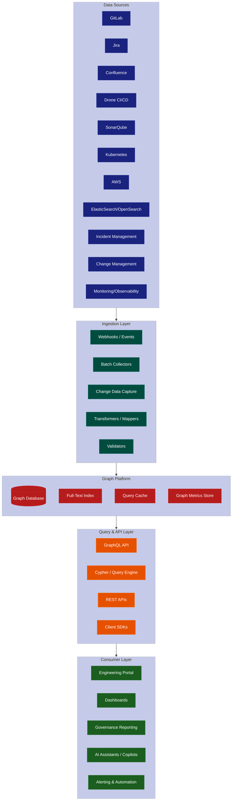
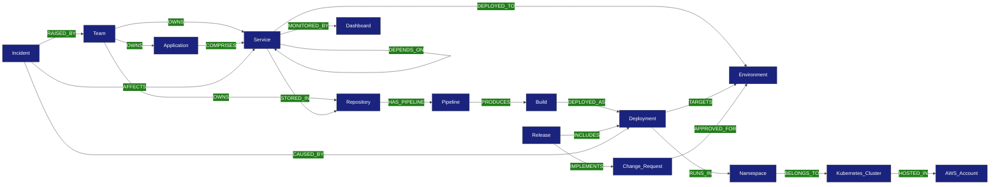
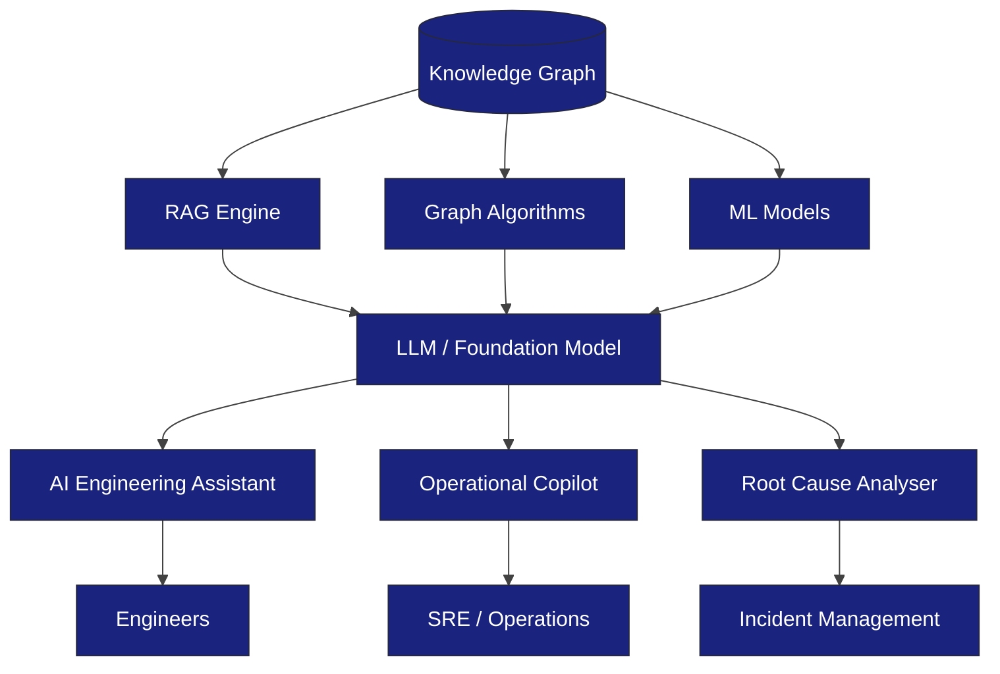
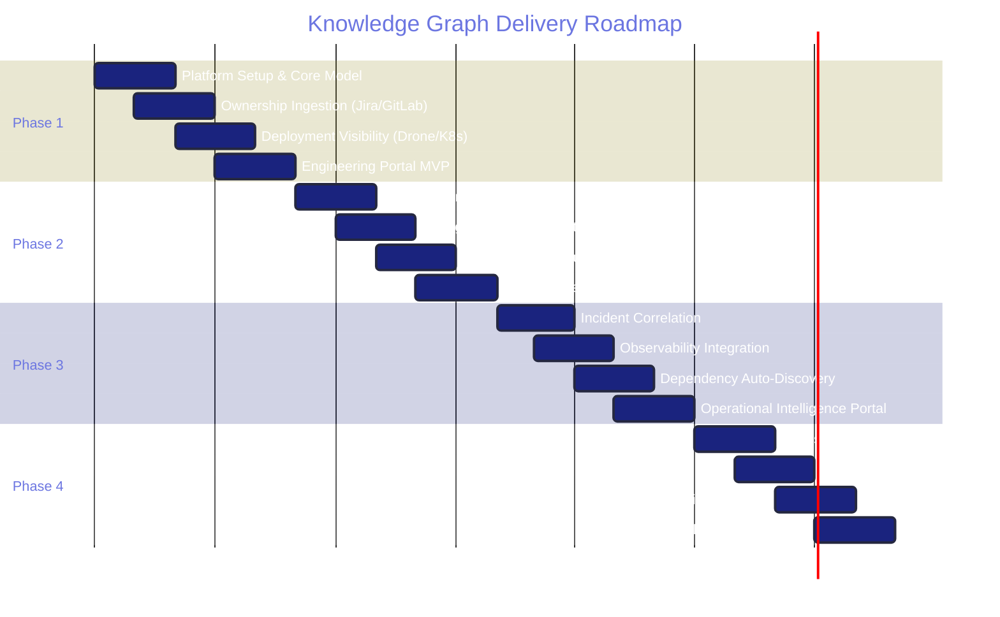

# Enterprise Knowledge Graph Architecture Proposal

| Field | Detail |
|-------|--------|
| **Document Status** | PROPOSED — subject to Architecture Review Board approval |
| **Classification** | OFFICIAL — SENSITIVE |
| **Version** | 1.0 DRAFT |
| **Author Role** | Principal Enterprise Architect |
| **Target Audience** | Chief Architect, Enterprise Architects, Platform Architects, Technical Leads, Senior Engineering Managers, Data Architects |
| **Date** | 2025 |
| **Review Forum** | Architecture Review Board (ARB) |

---

## 1. Executive Summary

The engineering organisation currently operates a rich but fragmented data landscape. Critical information regarding deployments, releases, service ownership, incidents, and infrastructure state is distributed across multiple tooling systems — GitLab, Jira, Confluence, Drone CI/CD, SonarQube, Kubernetes, AWS, ElasticSearch, and operational monitoring platforms. These data silos create significant barriers to cross-system impact analysis, incident resolution, and governance reporting.

Engineers routinely struggle to answer fundamental questions: *Which deployment introduced this defect? Which team owns this service? What applications are affected by this infrastructure change? Which releases included this change request? What upstream and downstream dependencies exist?*

This proposal recommends the adoption of a **Knowledge Graph** as the enterprise's unified engineering intelligence layer. A Knowledge Graph provides a relationship-centric data model that natively represents the complex, interconnected nature of engineering systems. Unlike traditional relational or document stores, graph databases excel at traversing multi-hop relationships — enabling rapid impact analysis, dependency discovery, and lineage tracing across the entire engineering estate.

**Expected Business Outcomes:**

- **60–80% reduction** in mean-time-to-identify (MTTI) during major incidents
- **Elimination of manual cross-referencing** across 8+ engineering systems
- **Real-time release impact visibility** across teams, services, and environments
- **Foundation for AI-powered engineering assistants** and operational copilots
- **Improved audit and compliance posture** with full deployment traceability
- **Accelerated onboarding** for engineers joining complex programme environments

---

## 2. Business Drivers

### 2.1 Faster Incident Resolution

During critical incidents, engineers currently spend 30–45 minutes manually correlating data across systems to identify the blast radius and root cause. A Knowledge Graph enables sub-second traversal queries that instantly surface related deployments, owning teams, affected services, and recent changes.

### 2.2 Reduced Operational Risk

Without a unified view of dependencies and relationships, changes are frequently made without full understanding of downstream impact. The Knowledge Graph provides a living dependency model that supports pre-deployment impact assessment and change advisory processes.

### 2.3 Improved Governance and Compliance

Defence sector programmes require rigorous audit trails and traceability. The graph provides an immutable, queryable record of what was deployed, when, by whom, through which pipeline, and against which change request — satisfying both internal governance and external assurance requirements.

### 2.4 Better Release Visibility

Release coordination across multiple squads and services is currently managed through manual processes and spreadsheets. The graph enables real-time release composition visibility, showing exactly which changes, builds, and approvals comprise a given release.

### 2.5 Improved Engineering Productivity

Engineers spend significant time on discovery activities — finding service owners, understanding deployment paths, locating documentation. The Knowledge Graph acts as a self-maintaining service catalogue enriched with real operational data rather than stale manual entries.

### 2.6 AI Readiness

The organisation's AI strategy depends upon structured, relationship-rich data. Knowledge Graphs are the optimal substrate for Retrieval-Augmented Generation (RAG), enabling AI assistants to reason about engineering context, dependencies, and operational state.

---

## 3. Current State Analysis

### 3.1 Data Silos

```
┌─────────────────────────────────────────────────────────────────┐
│                    CURRENT STATE — DATA SILOS                     │
├───────────────┬───────────────┬───────────────┬─────────────────┤
│    GitLab     │     Jira      │  Confluence   │    Drone CI     │
│ Repositories  │   Stories     │    Docs       │   Pipelines     │
│ Merge Requests│   Epics       │    Runbooks   │   Build Logs    │
│ Branches      │   Sprints     │    ADRs       │   Artefacts     │
├───────────────┼───────────────┼───────────────┼─────────────────┤
│  Kubernetes   │     AWS       │  ElasticSearch│   SonarQube     │
│  Deployments  │   Accounts    │    Logs       │   Quality Gates │
│  Services     │   Resources   │    Metrics    │   Vulnerabilities│
│  Namespaces   │   IAM Roles   │    Traces     │   Tech Debt     │
└───────────────┴───────────────┴───────────────┴─────────────────┘
```

### 3.2 Key Challenges

| Challenge | Impact | Affected Stakeholders |
|-----------|--------|-----------------------|
| No unified ownership model | Teams cannot quickly identify service owners during incidents | All engineering |
| Fragmented deployment records | Cannot trace a production issue back to a specific build/commit | SRE, Release Management |
| Manual dependency mapping | Impact analysis relies on tribal knowledge | Architecture, Change Management |
| Disconnected release metadata | Release contents are manually compiled | Delivery Managers, QA |
| No cross-system lineage | Cannot answer "what changed" across the full stack | Incident Management |
| Stale service catalogues | Manual entries drift from operational reality | Platform Engineering |

### 3.3 Consequence

The organisation operates with **structural blindness** — individual systems contain accurate local data, but the relationships between entities across systems are invisible. This structural blindness directly increases operational risk, extends incident duration, and inhibits strategic decision-making.

---

## 4. Target State Vision

The target state establishes a **Unified Engineering Knowledge Layer** that provides:

- **Relationship-centric architecture** — entities from all engineering systems connected through typed, directional relationships
- **Enterprise-wide visibility** — a single queryable model spanning the full software delivery lifecycle
- **Real-time currency** — event-driven ingestion ensuring the graph reflects current operational state
- **Self-maintaining accuracy** — populated from authoritative source systems rather than manual data entry
- **Multi-consumer access** — serving portals, dashboards, APIs, AI systems, and reporting tools

### Target State Principles

1. **Source systems remain authoritative** — the graph aggregates and connects, it does not replace
2. **Relationships are first-class citizens** — the value is in connections, not just entities
3. **Event-driven by default** — changes propagate in near-real-time
4. **Security by design** — RBAC, classification, and audit from day one
5. **AI-native architecture** — designed to serve both human and machine consumers

---

## 5. High-Level Architecture



### 5.1 Data Sources Layer

All existing engineering systems serve as data sources. The Knowledge Graph does not replace these systems — it connects them.

| Source System | Data Provided | Integration Method |
|---------------|---------------|-------------------|
| GitLab | Repositories, branches, merge requests, commits, pipelines | Webhooks + REST API polling |
| Jira | Stories, epics, sprints, team assignments | Webhooks + REST API |
| Confluence | Documentation links, runbooks, architecture decisions | REST API (batch) |
| Drone CI/CD | Build records, pipeline executions, artefact metadata | Webhooks |
| SonarQube | Quality gates, vulnerability counts, technical debt | REST API (scheduled) |
| Kubernetes | Deployments, services, namespaces, pod state | Kubernetes API watch + events |
| AWS | Accounts, resources, IAM, networking | AWS Config / CloudTrail events |
| ElasticSearch/OpenSearch | Log references, metric summaries | API (batch aggregation) |
| Incident Management | Incident records, timelines, affected services | Webhooks + API |
| Change Management | Change requests, approvals, implementation records | API + events |

### 5.2 Ingestion Layer

The ingestion layer employs three complementary patterns:

- **Event-driven (webhooks)** — real-time capture of state changes from GitLab, Jira, Drone, Kubernetes
- **Batch collection** — scheduled synchronisation for systems without event capabilities (Confluence, SonarQube)
- **Change Data Capture (CDC)** — database-level change streams where available

All ingested data passes through transformation and validation stages before graph population.

### 5.3 Graph Platform Selection

| Criterion | Neo4j | Amazon Neptune | JanusGraph |
|-----------|-------|----------------|------------|
| **Query language** | Cypher (intuitive, well-documented) | Gremlin / SPARQL | Gremlin |
| **Managed service** | AuraDB (SaaS) or self-hosted | Fully managed (AWS) | Self-hosted only |
| **Scalability** | Excellent for 10M–1B nodes | Excellent, auto-scaling | Excellent, distributed |
| **AWS integration** | Requires networking config | Native AWS IAM, VPC, CloudWatch | Manual integration |
| **Community & ecosystem** | Largest graph community, extensive tooling | Growing, AWS-backed | Open source, smaller community |
| **Visualisation** | Neo4j Bloom (enterprise-grade) | Third-party required | Third-party required |
| **Operational overhead** | Moderate (self-hosted) / Low (AuraDB) | Low (fully managed) | High |
| **Cost model** | Node/relationship-based licensing | I/O-based pricing | Infrastructure only |
| **Defence sector usage** | Proven in government/defence | AWS GovCloud available | Limited references |
| **RBAC granularity** | Property-level security | IAM-based, coarser | Custom implementation |

**Recommendation:** Neo4j (self-hosted on Kubernetes within the existing platform) is recommended as the primary graph platform for Phase 1, with Amazon Neptune evaluated for Phase 3+ as operational scale increases. Rationale: superior query language (Cypher), mature enterprise tooling, proven defence sector adoption, and fine-grained RBAC capabilities.

### 5.4 Query Layer

- **GraphQL API** — primary consumer-facing interface, supporting federated queries
- **Cypher endpoint** — direct graph queries for data engineers and advanced use cases
- **REST APIs** — simplified endpoints for specific high-frequency queries (e.g., "who owns this service?")
- **Client SDKs** — Python and TypeScript SDKs for engineering teams

---

## 6. Knowledge Graph Data Model

### 6.1 Core Entities

| Entity | Description | Source System(s) |
|--------|-------------|-----------------|
| **Team** | Engineering squad or team | Jira, Confluence |
| **Application** | Logical application or product | Service Catalogue, Jira |
| **Service** | Deployable microservice or component | GitLab, Kubernetes |
| **Environment** | Deployment target (dev, staging, production) | Kubernetes, AWS |
| **Deployment** | Instance of a service deployed to an environment | Drone, Kubernetes |
| **Release** | Versioned release comprising multiple deployments | Release Management |
| **Build** | CI/CD build execution producing artefacts | Drone CI |
| **Repository** | Source code repository | GitLab |
| **Pipeline** | CI/CD pipeline definition and execution | Drone CI |
| **Incident** | Production incident record | Incident Management |
| **Change Request** | Approved change record | Change Management |
| **Kubernetes Cluster** | Container orchestration cluster | Kubernetes API |
| **Namespace** | Kubernetes namespace (logical isolation) | Kubernetes API |
| **AWS Account** | Cloud account boundary | AWS Organisations |

### 6.2 Core Relationships



### 6.3 Relationship Definitions

| Relationship | From | To | Properties |
|-------------|------|----|-----------|
| OWNS | Team | Application, Service, Repository | since, ownership_type |
| COMPRISES | Application | Service | criticality |
| STORED_IN | Service | Repository | path, branch |
| DEPLOYED_TO | Service | Environment | current_version, last_deployed |
| DEPENDS_ON | Service | Service | dependency_type, protocol |
| HAS_PIPELINE | Repository | Pipeline | trigger_type |
| PRODUCES | Pipeline | Build | build_number, timestamp |
| DEPLOYED_AS | Build | Deployment | deployer, timestamp |
| TARGETS | Deployment | Environment | strategy, status |
| RUNS_IN | Deployment | Namespace | replica_count |
| BELONGS_TO | Namespace | Kubernetes Cluster | resource_quota |
| HOSTED_IN | Kubernetes Cluster | AWS Account | region |
| INCLUDES | Release | Deployment | sequence_order |
| IMPLEMENTS | Release | Change Request | approval_date |
| AFFECTS | Incident | Service | severity, duration |
| CAUSED_BY | Incident | Deployment | confidence_level |

### 6.4 Example Graph (Text Representation)

```
(Team: "Phoenix Squad")
  -[OWNS]-> (Application: "Border Crossing Service")
    -[COMPRISES]-> (Service: "passenger-api")
      -[STORED_IN]-> (Repository: "gitlab/phoenix/passenger-api")
        -[HAS_PIPELINE]-> (Pipeline: "passenger-api-main")
          -[PRODUCES]-> (Build: "build-4521")
            -[DEPLOYED_AS]-> (Deployment: "deploy-4521-prod")
              -[TARGETS]-> (Environment: "production")
              -[RUNS_IN]-> (Namespace: "phoenix-prod")
                -[BELONGS_TO]-> (Cluster: "prod-cluster-01")
                  -[HOSTED_IN]-> (AWS Account: "prod-workloads")
      -[DEPENDS_ON]-> (Service: "identity-verification-api")
        -[OWNS]<- (Team: "Identity Squad")

(Incident: "INC-2847")
  -[AFFECTS]-> (Service: "passenger-api")
  -[CAUSED_BY]-> (Deployment: "deploy-4521-prod")

(Release: "R-2025.03")
  -[INCLUDES]-> (Deployment: "deploy-4521-prod")
  -[IMPLEMENTS]-> (Change Request: "CR-1192")
```

---

## 7. Example Use Cases

### 7.1 Incident Investigation

**Scenario:** A P1 incident is raised against the passenger processing service in production.

**Query:** *"Show me all deployments to this service in the last 48 hours, the teams responsible, the change requests they implemented, and any other services that depend on this one."*

```cypher
MATCH (i:Incident {id: 'INC-2847'})-[:AFFECTS]->(s:Service)
MATCH (d:Deployment)-[:TARGETS]->(:Environment {name: 'production'})
WHERE d.timestamp > datetime() - duration('P2D')
MATCH (d)<-[:DEPLOYED_AS]-(b:Build)<-[:PRODUCES]-(p:Pipeline)<-[:HAS_PIPELINE]-(r:Repository)<-[:STORED_IN]-(s)
MATCH (t:Team)-[:OWNS]->(s)
OPTIONAL MATCH (dep:Service)-[:DEPENDS_ON]->(s)
RETURN s, d, t, dep, b
```

**Value:** Reduces investigation time from 30+ minutes to under 30 seconds.

### 7.2 Release Impact Analysis

**Scenario:** Release R-2025.03 is scheduled for Thursday. The Release Manager needs to understand the full scope.

**Query:** *"What services, teams, environments, and dependencies are affected by this release?"*

**Value:** Provides complete release composition view, enabling informed go/no-go decisions.

### 7.3 Ownership Discovery

**Scenario:** An engineer needs to contact the team responsible for the identity verification API.

**Query:** *"Who owns the identity-verification-api service?"*

```cypher
MATCH (t:Team)-[:OWNS]->(s:Service {name: 'identity-verification-api'})
RETURN t.name, t.slack_channel, t.tech_lead
```

**Value:** Instant ownership resolution without searching Confluence or asking colleagues.

### 7.4 Service Dependency Analysis

**Scenario:** Platform team needs to upgrade a shared library. They need to know which services consume it.

**Query:** *"What services depend on the authentication-commons library, and which teams own them?"*

**Value:** Complete blast radius assessment before making shared infrastructure changes.

### 7.5 Deployment Traceability

**Scenario:** Auditors require evidence that a specific change request was implemented through the approved pipeline and deployed by an authorised individual.

**Query:** *"Trace CR-1192 from approval through to production deployment, including all pipeline stages and approvals."*

**Value:** Full audit trail satisfying defence sector governance requirements without manual evidence compilation.

### 7.6 Audit and Compliance

**Scenario:** Annual security audit requires evidence of deployment controls, separation of duties, and change traceability.

**Query:** *"For all production deployments in Q4, show the associated change request, approver, pipeline execution, quality gate result, and deploying engineer."*

**Value:** Automated compliance evidence generation, reducing audit preparation effort from weeks to hours.

---

## 8. Security Architecture

### 8.1 Access Control Model

The Knowledge Graph implements a multi-layered security architecture appropriate for defence sector operations:

| Layer | Control | Implementation |
|-------|---------|---------------|
| **Network** | VPC isolation, private endpoints | AWS VPC, Kubernetes NetworkPolicy |
| **Authentication** | SSO integration, service accounts | OIDC/SAML via enterprise IdP |
| **Authorisation** | Role-Based Access Control (RBAC) | Graph-native property-level security |
| **Data Classification** | Entity and property classification labels | OFFICIAL, OFFICIAL-SENSITIVE markings |
| **Audit** | All queries and mutations logged | Immutable audit log, SIEM integration |
| **Encryption** | At-rest and in-transit | AES-256, TLS 1.3 |

### 8.2 RBAC Model

| Role | Permissions | Example Users |
|------|-------------|---------------|
| Graph Admin | Full CRUD, schema management | Platform Engineering |
| Data Steward | Write access to owned entities | Team Tech Leads |
| Engineer (Read) | Read access to non-classified entities | All engineers |
| Service Account | Scoped write for ingestion | CI/CD pipelines |
| Auditor | Read-only, full traversal | Compliance, Security |
| AI Consumer | Read-only, rate-limited | AI assistants |

### 8.3 Defence Sector Considerations

- All data stored within UK-sovereign infrastructure (AWS London region)
- No data exfiltration to external SaaS without classification review
- Personnel security clearance requirements for admin roles
- Alignment with NCSC Cyber Assessment Framework (CAF)
- Data handling in accordance with JSP 440 and organisational security policy
- Regular penetration testing of graph endpoints

---

## 9. Non-Functional Requirements

| Requirement | Target | Rationale |
|-------------|--------|-----------|
| **Scalability** | Support 50M+ nodes, 200M+ relationships | Accommodate full engineering estate growth over 5 years |
| **Availability** | 99.9% uptime (graph query layer) | Critical for incident response workflows |
| **Performance** | < 200ms for 3-hop traversal queries | Sub-second response for engineering portal |
| **Security** | OFFICIAL-SENSITIVE data handling | Defence sector baseline requirement |
| **Data Quality** | > 95% accuracy for ownership relationships | Ensures trust in graph responses |
| **Reliability** | RPO: 1 hour, RTO: 4 hours | Acceptable for non-safety-critical system |
| **Data Freshness** | Event-driven: < 60 seconds; Batch: < 15 minutes | Near-real-time for deployment events |
| **Throughput** | 10,000 ingestion events/minute | Support concurrent pipeline activity |
| **Query Concurrency** | 500 concurrent read queries | Support portal and API consumers |
| **Storage Growth** | ~2GB/month estimated | Plan for 3-year retention |

---

## 10. Governance Model

### 10.1 Data Ownership Principles

| Principle | Description |
|-----------|-------------|
| **Source system is authoritative** | The graph reflects source systems; conflicts resolve in favour of the source |
| **Ownership is explicit** | Every entity in the graph has a designated owning team |
| **Stewardship is distributed** | Each team is responsible for the accuracy of their owned entities |
| **Schema changes are governed** | Graph schema changes require ARB-lite approval |
| **Relationships are bi-directionally maintained** | Both sides of a relationship are validated |

### 10.2 Data Stewardship Model

```
┌────────────────────────────────────────────────────────────┐
│                  GOVERNANCE STRUCTURE                        │
├────────────────────────────────────────────────────────────┤
│  Chief Architect          — Strategic direction             │
│  Data Architecture Lead   — Schema governance              │
│  Platform Engineering     — Platform operation             │
│  Team Tech Leads          — Entity stewardship             │
│  Data Quality Analysts    — Quality monitoring             │
└────────────────────────────────────────────────────────────┘
```

### 10.3 Data Lifecycle Management

| Phase | Activity | Frequency |
|-------|----------|-----------|
| **Ingestion** | Validate, transform, load | Continuous |
| **Quality Assurance** | Completeness and accuracy checks | Daily |
| **Reconciliation** | Cross-reference with source systems | Weekly |
| **Archival** | Move historical relationships to cold storage | Quarterly |
| **Purge** | Remove entities beyond retention policy | Annually |

---

## 11. Risks and Mitigations

| ID | Risk | Likelihood | Impact | Priority | Mitigation |
|----|------|-----------|--------|----------|------------|
| R1 | Data quality degradation over time | High | High | Critical | Automated quality scoring, reconciliation pipelines, stewardship accountability |
| R2 | Adoption resistance from engineering teams | Medium | High | High | Demonstrate immediate value (incident response), integrate into existing workflows |
| R3 | Graph becomes stale if ingestion pipelines fail | Medium | High | High | Pipeline monitoring, alerting, circuit breakers, fallback to batch sync |
| R4 | Security classification breach through graph traversal | Low | Critical | High | Property-level RBAC, query result filtering, classification-aware access controls |
| R5 | Performance degradation at scale | Medium | Medium | Medium | Query optimisation, caching layer, index management, capacity planning |
| R6 | Single point of failure if graph is unavailable | Medium | Medium | Medium | High-availability deployment (3-node cluster), graceful degradation in consumers |
| R7 | Scope creep — graph becomes a data warehouse | High | Medium | Medium | Clear architectural boundaries, governed schema evolution, ARB oversight |
| R8 | Key person dependency for graph operations | Medium | Medium | Medium | Documentation, runbooks, cross-training, infrastructure-as-code |
| R9 | Vendor lock-in to graph database technology | Low | Medium | Low | Abstract query layer, standard data export formats, migration planning |
| R10 | Integration complexity with legacy systems | Medium | Medium | Medium | Adapter pattern, batch fallback for systems without event support |
| R11 | Cost overrun during scaling phases | Low | Medium | Low | Phased delivery, cost monitoring, right-sizing reviews |
| R12 | Regulatory or policy changes affecting data retention | Low | Low | Low | Configurable retention policies, automated purge capabilities |

---

## 12. AI Enablement Strategy

The Knowledge Graph is architected as the foundational data layer for enterprise AI capabilities:

### 12.1 Retrieval-Augmented Generation (RAG)

The graph provides structured, relationship-rich context for Large Language Model (LLM) queries. When an engineer asks "what happened to the passenger service last week?", the AI system retrieves relevant graph subgraphs (deployments, incidents, changes) and provides them as context to the LLM for natural language response generation.

### 12.2 Enterprise AI Assistants

AI assistants consume the graph to answer engineering questions conversationally:

- *"Who should I contact about the payment gateway?"* → Graph traversal to ownership
- *"What changed in production yesterday?"* → Temporal graph query over deployments
- *"Is it safe to deploy the auth service now?"* → Dependency and incident state analysis

### 12.3 Root Cause Analysis

Graph algorithms (shortest path, community detection, temporal analysis) enable automated root cause hypothesis generation:

- Identify common deployment preceding multiple incidents
- Detect cascading failure patterns through dependency chains
- Correlate infrastructure changes with service degradation

### 12.4 Operational Copilots

AI systems that proactively surface insights:

- *"Three services deployed in the last hour share a common dependency that has an open P2 incident"*
- *"This deployment will affect 12 downstream services — recommend staging validation first"*

### 12.5 Change Impact Prediction

Machine learning models trained on historical graph data can predict:

- Probability of incident following a given deployment pattern
- Expected blast radius based on dependency topology
- Optimal deployment ordering to minimise risk

### 12.6 Architecture



---

## 13. Roadmap

### Phased Delivery



### Phase Detail

| Phase | Name | Duration | Key Deliverables | Success Criteria |
|-------|------|----------|-----------------|-----------------|
| **1** | Ownership & Deployment Visibility | 6 months | Graph platform deployed; Team, Service, Repository, Deployment entities populated; Engineering portal MVP | 80% services have mapped ownership; deployment events flowing |
| **2** | Release Intelligence | 5 months | Release composition model; Change Request traceability; Impact analysis queries; Governance dashboards | Full release traceability; ARB-reportable governance metrics |
| **3** | Operational Intelligence | 6 months | Incident correlation; Observability data integration; Automated dependency discovery | 50% reduction in MTTI; auto-discovered dependency coverage > 70% |
| **4** | AI-Powered Engineering Platform | 6 months | AI assistant integration; Predictive analytics; Operational copilot | AI assistant adopted by 50%+ engineers; measurable productivity gain |

---

## 14. Success Metrics

| Metric | Baseline (Current) | Phase 1 Target | Phase 4 Target | Measurement Method |
|--------|-------------------|----------------|----------------|-------------------|
| Mean Time to Identify (MTTI) | 35 minutes | 15 minutes | < 5 minutes | Incident management records |
| Service ownership resolution time | 10–15 minutes | < 30 seconds | < 10 seconds | Portal query metrics |
| Release impact assessment time | 2–4 hours (manual) | 15 minutes | < 5 minutes | Release management workflow |
| Deployment traceability coverage | ~30% (manual) | 80% | 99% | Graph completeness metrics |
| Cross-system query capability | 0 (not possible) | 5 key query types | 20+ query types | API catalogue |
| Engineering portal adoption | N/A | 50% of engineers | 90% of engineers | Portal analytics |
| Audit evidence preparation time | 2–3 weeks | 3 days | < 1 day | Compliance team feedback |
| AI assistant query accuracy | N/A | N/A | > 85% | Response quality scoring |
| Dependency map completeness | ~20% (manual) | 50% | > 90% | Graph coverage analysis |
| Data freshness (event-driven) | N/A | < 5 minutes | < 60 seconds | Ingestion pipeline metrics |

---

## 15. Architecture Decision Record (ADR)

### ADR-001: Adoption of Knowledge Graph for Engineering Intelligence

| Field | Content |
|-------|---------|
| **Decision** | Adopt a Knowledge Graph (Neo4j) as the enterprise engineering intelligence platform |
| **Status** | Proposed |
| **Date** | 2025 |
| **Deciders** | Chief Architect, Enterprise Architecture Team, ARB |

### Context

The organisation operates 10+ engineering systems containing critical data about services, deployments, teams, releases, and incidents. This data is siloed, requiring engineers to manually correlate information across systems during time-critical activities (incident response, release planning, impact analysis). No existing platform provides a unified, relationship-centric view of the engineering estate. Traditional approaches (data warehouse, API aggregation) have been considered but do not natively model the multi-hop relationship queries that represent the primary use cases.

### Options Considered

| Option | Description | Pros | Cons |
|--------|-------------|------|------|
| **A: Knowledge Graph (Neo4j)** | Purpose-built graph database with relationship-first data model | Native relationship traversal; proven at scale; mature tooling; Cypher query language; defence sector references | Additional platform to operate; team upskilling required; licensing cost |
| **B: Amazon Neptune** | AWS-managed graph database | Fully managed; native AWS integration; no operational overhead | Gremlin query complexity; less mature tooling; vendor lock-in to AWS |
| **C: Data Warehouse (Redshift/Snowflake)** | Traditional analytical store with relationship modelling via joins | Familiar technology; existing skills; good for reporting | Poor multi-hop query performance; rigid schema; not relationship-native |
| **D: Custom API Aggregation Layer** | Bespoke middleware querying source systems in real-time | No additional data store; always fresh | High latency for complex queries; brittle; N+1 query problems; poor for AI consumption |
| **E: JanusGraph (Open Source)** | Distributed open-source graph database | No licensing cost; horizontally scalable | High operational complexity; limited tooling; smaller community |

### Recommendation

**Option A: Neo4j (self-hosted on Kubernetes)** is recommended based on:

1. **Query expressiveness** — Cypher language enables complex traversals with minimal learning curve
2. **Operational maturity** — Proven at enterprise scale in government and defence organisations
3. **Ecosystem** — Visualisation (Bloom), monitoring, backup, and clustering tooling included
4. **RBAC** — Property-level security model aligns with classification requirements
5. **AI readiness** — Native vector search and graph data science library support AI use cases
6. **Self-hosted option** — Deployable within existing Kubernetes platform, maintaining data sovereignty

### Consequences

**Positive:**
- Enables sub-second cross-system queries currently impossible
- Provides foundation for AI engineering assistants
- Reduces incident resolution time significantly
- Improves governance and audit posture

**Negative:**
- Requires graph database skills development within the team
- Introduces an additional platform to operate and maintain
- Neo4j Enterprise licensing costs (~£50–80k/year estimated)
- Requires sustained investment in data quality and ingestion pipelines

**Risks Accepted:**
- Team learning curve (mitigated by Neo4j's accessible Cypher language and training programme)
- Vendor dependency on Neo4j (mitigated by abstraction layer and data export capabilities)

---

## 16. Executive Briefing (One Page)

### Enterprise Knowledge Graph — Executive Summary

**The Problem:** Our engineering data is trapped in 10+ disconnected systems. During incidents, engineers spend 30+ minutes manually searching across GitLab, Jira, Kubernetes, and AWS to understand what changed, who owns what, and what is affected. This delays resolution, increases risk, and inhibits strategic decision-making.

**The Solution:** A Knowledge Graph — a relationship-centric database that connects entities across all engineering systems into a single, queryable intelligence layer. Unlike traditional databases, graphs excel at answering "how is X related to Y?" questions across multiple systems in milliseconds.

**Key Outcomes:**
- **Incident response:** Reduce identification time from 35 minutes to under 5 minutes
- **Release visibility:** Full composition and impact view in seconds, not hours
- **Ownership clarity:** Instant service-to-team resolution, always current
- **AI foundation:** Structured data layer enabling engineering AI assistants
- **Audit readiness:** Automated compliance evidence generation

**Investment:** Phased 24-month delivery. Phase 1 (6 months) delivers ownership and deployment visibility. Full platform maturity including AI capabilities by month 24.

**Risk:** Manageable. Primary risks are data quality and adoption — both mitigated through automated ingestion from source systems and integration into existing engineering workflows.

**Ask:** ARB approval to proceed with Phase 1 delivery, including platform provisioning, core data model implementation, and engineering portal MVP.

---

## 17. Presentation Outline (10 Slides)

### Slide 1: Title & Context
- Enterprise Knowledge Graph Architecture Proposal
- Author, date, classification
- ARB reference number

### Slide 2: The Problem
- Data silos visualisation (current state diagram)
- Key pain points: incident resolution time, manual cross-referencing, stale ownership data
- Quote from engineering survey or incident retrospective

### Slide 3: What is a Knowledge Graph?
- Simple visual: entities + relationships
- Contrast with traditional database (tables vs connected nodes)
- One-sentence value proposition: "A living model of how our engineering estate connects"

### Slide 4: Target Architecture
- High-level architecture diagram (simplified from Section 5)
- Source systems → Ingestion → Graph → Query → Consumers
- Emphasise: graph connects, it does not replace

### Slide 5: Data Model
- Core entities and key relationships
- Simplified graph visualisation showing Team → Service → Deployment → Environment chain

### Slide 6: Use Cases (Impact)
- Three headline use cases with before/after metrics:
  - Incident investigation: 35 min → 30 seconds
  - Ownership discovery: 15 min → instant
  - Release impact analysis: hours → minutes

### Slide 7: Security & Governance
- RBAC model overview
- Data classification approach
- Defence sector compliance alignment
- Governance structure

### Slide 8: AI Enablement
- Knowledge Graph as AI foundation
- RAG architecture for engineering assistants
- Operational copilot vision
- Positioning for organisational AI strategy

### Slide 9: Roadmap & Investment
- Four-phase Gantt visualisation
- Phase 1 scope and timeline
- Resource requirements
- Cost envelope

### Slide 10: Recommendation & Ask
- Recommend: Proceed with Phase 1
- Platform: Neo4j on Kubernetes
- Timeline: 6 months to MVP
- Ask: ARB approval, funding allocation, team assignment
- Next steps: Detailed design, procurement, team formation

---

## 18. Anticipated Questions and Answers

| # | Question | Suggested Answer |
|---|----------|-----------------|
| 1 | Why a graph database rather than extending our existing data warehouse? | Graph databases are purpose-built for relationship traversal. Our primary use cases (impact analysis, dependency tracing, ownership discovery) require multi-hop queries across heterogeneous entities — precisely where graph databases outperform relational/analytical stores by orders of magnitude. A data warehouse would require complex joins and struggle with variable-depth traversals. |
| 2 | What is the total cost of ownership? | Phase 1 estimated at £150–200k including licensing, infrastructure, and engineering effort. Full platform (24 months) estimated at £500–700k. ROI is driven by incident time reduction, audit automation, and engineering productivity — conservatively estimated at £300–400k annual saving at maturity. |
| 3 | How does this relate to our existing service catalogue? | The Knowledge Graph subsumes and enriches the service catalogue concept. Unlike manual catalogues that become stale, the graph is populated from authoritative source systems automatically. The existing catalogue data would seed the initial graph model. |
| 4 | Who will operate and maintain the graph platform? | Platform Engineering team, consistent with their responsibility for shared infrastructure. Operational burden is minimised through Kubernetes deployment, infrastructure-as-code, and automated ingestion pipelines. Estimated 0.5 FTE ongoing operational overhead. |
| 5 | What happens if the graph becomes unavailable? | The graph is a secondary/enrichment layer — source systems continue operating independently. Consumer applications should implement graceful degradation. The graph itself deploys as a 3-node HA cluster with automated failover. Target availability: 99.9%. |
| 6 | How do we ensure data quality and accuracy? | Three mechanisms: (1) automated ingestion from authoritative sources eliminates manual data entry; (2) reconciliation pipelines compare graph state against source systems daily; (3) data quality scoring surfaces degradation for steward intervention. |
| 7 | Does this introduce vendor lock-in to Neo4j? | Partially, but mitigated. The query abstraction layer (GraphQL/REST) isolates consumers from the underlying graph technology. Data can be exported in standard formats. Migration to Neptune or alternative is feasible within the abstraction boundary. Cypher is being standardised as GQL (ISO/IEC 39075). |
| 8 | How does this align with the organisational AI strategy? | The Knowledge Graph is the structured data layer that AI systems need. RAG-based AI assistants require relationship-rich, queryable context — precisely what the graph provides. This proposal directly enables the AI engineering assistant workstream. |
| 9 | What is the security classification of data in the graph? | OFFICIAL-SENSITIVE baseline. The graph stores metadata and relationships — not the underlying classified content itself. Property-level RBAC ensures users only access data appropriate to their role and clearance. All access is audited. |
| 10 | Can we start smaller — perhaps a proof of concept? | Phase 1 is deliberately scoped as an MVP (ownership + deployment visibility). However, the value of a Knowledge Graph compounds with connectivity — a too-narrow scope risks underwhelming demonstration. Phase 1 balances minimum viable scope with sufficient relationship density to demonstrate graph value. |
| 11 | How do we handle data from systems without event/webhook support? | Batch collection via scheduled API polling (Confluence, SonarQube). Frequency configured per source — hourly for semi-static data, every 15 minutes for operational data. Event-driven ingestion preferred where available. |
| 12 | What are the skill requirements for the team? | Graph database fundamentals (Cypher query language), data modelling for graphs, and pipeline engineering. Neo4j offers certification training. Estimated 2–3 weeks upskilling for experienced engineers. The team does not need to be graph specialists — the abstraction layer shields most consumers. |
| 13 | How does this interact with existing monitoring and observability? | The graph complements observability tooling. It does not replace Prometheus, Grafana, or OpenSearch. Instead, it provides the relational context layer — connecting "this metric is degraded" with "this service is owned by this team and was last deployed at this time via this pipeline." |
| 14 | What is the risk of this becoming yet another data silo? | Acknowledged and actively mitigated. The graph's value is its connectivity — it is architecturally designed to integrate, not isolate. Governance principles mandate open access (within RBAC), API-first design, and prohibition of data that exists only in the graph (source systems remain authoritative). |
| 15 | How will adoption be driven across engineering teams? | Three vectors: (1) integrate into incident response workflows (immediate value under pressure); (2) engineering portal providing superior discovery experience; (3) AI assistant powered by graph (conversational access). Avoid mandating adoption — demonstrate value and engineers will gravitate naturally. |
| 16 | What is the fallback position if the project does not deliver expected value? | Phase 1 is time-boxed at 6 months with clear success criteria. If targets are not met, the investment is limited and the graph infrastructure can be repurposed or decommissioned. The phased approach explicitly includes decision gates between phases. |
| 17 | How does this comply with data retention and GDPR requirements? | The graph stores engineering metadata, not personal data. Where personnel identifiers exist (deployer names, team membership), standard retention policies apply. Automated purge capabilities ensure compliance with organisational data lifecycle policy. DPIA to be completed during detailed design. |

---

*Document ends.*

*PROPOSED — subject to Architecture Review Board approval*

## Related Pages

- [Deployment Knowledge Graph — Strategic Value, Business Case And Governance](../deployment-knowledge-graph-business-case.md)
- [Deployment Knowledge Graph](../deployment-knowledge-graph-design.md)
- [ARB Package](../architecture-review/arb-package.md)
- [Final Scorecard And Verdict](../architecture-review/final-scorecard-and-verdict.md)
