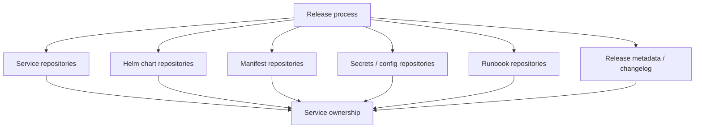
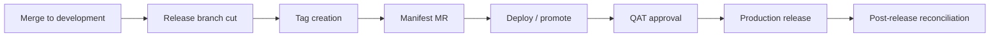

# Release Scope, Ownership And Approvals

This page captures the release scope, ownership and approval questions that should be clarified.

## Why Scope Matters

The phrase "all services" needs a clear definition.

Release risk is not limited to source branches. It may also include Helm charts, manifests, configuration, secrets, runbooks and deployment management repositories.

If scope is unclear, automation may process too much, too little or the wrong thing.



## Repositories To Classify

Confirm whether these are in scope for the same release process:

- Service repositories.
- Helm chart repositories.
- Cerberus deployment management repository.
- Manifest repositories.
- Secrets/config repositories.
- Liquibase/database change repositories or scripts.
- Runbook repositories.
- Any release metadata or changelog repositories.

## Service Scope Questions

- What does "all services" mean in practice?
- Are release branches created for all services or only changed services?
- Can the automation detect services with actual changes?
- Are there services without clear squad ownership?
- Are shared libraries or shared charts included?
- Are environment-only changes included in the same release scope?
- Are secrets and Liquibase/database changes included in the same release readiness check?

## Change Types To Track

A production or feature change may involve more than application code.

Track whether each release includes:

| Change Type | Included? | Notes |
| --- | --- | --- |
| Application/service code | TBD | Service repository changes. |
| Service chart changes | TBD | May remain partly manual until Drone pipelines are updated. |
| Manifest updates | TBD | Must match generated/expected tags. |
| Secrets/config changes | TBD | Needs careful handling and audit trail. |
| Liquibase/database changes | TBD | Needs release sequencing and rollback consideration. |
| Runbook steps | TBD | Needed for manual or environment-specific operations. |

## New Environment Readiness

Several setup points apply for new dev/test environments.

Before a new environment is treated as release-ready, confirm:

- Required values files exist.
- Environment names are configured in the relevant setup/deploy scripts.
- Drone secrets/tokens exist for the environment.
- Kube/robot token ownership is clear.
- ACU responsibilities are clear where token/environment provisioning depends on them.
- Deployment scope behaviour is known for live, historical or both.
- Secret chart entries exist and use the expected encrypted format.

## Cross-Repository Ticket Grouping

The proposed automation relies heavily on consistent ticket and branch naming.

If multiple repositories use the same ticket/branch name, their changes should update the same Cerberus chart branch. This allows one feature ticket to group service, config, secret, Liquibase and runbook changes together for deployment/testing.

Open items:

- Confirm the exact branch/ticket naming rule.
- Confirm which repositories participate in cross-repo grouping.
- Confirm what happens when one ticket depends on another ticket/branch.
- Confirm who can manually adjust chart entries for cross-ticket dependencies.
- Confirm who owns secret/config updates when the change spans multiple repositories.

## Ownership Areas

Ownership should be explicit for:

- Merge approval into `development`.
- Release branch creation.
- Tag creation.
- Manifest update.
- Release readiness for each service.
- Deployment execution.
- QAT approval.
- Production release approval.
- Hotfix approval.
- Rollback decision and execution.
- Post-release validation.
- Branch and manifest reconciliation.

## Approval Points

Potential approval points:

- Merge to `development`.
- Release branch cut.
- Tag creation.
- Manifest merge request.
- Promotion to SIT.
- Promotion to higher environments.
- QAT approval.
- Production release.
- Rollback or fix-forward decision.
- Post-release closure.

The team should decide which approval points are mandatory and which can be automated.



## Ownership Matrix Template

| Activity | Owner | Approver | Backup | Evidence |
| --- | --- | --- | --- | --- |
| Merge to `development` | Squad developer | Squad lead / peer reviewer | Another squad member | Merge request |
| Create release branch | Automation (Gareth/Achilles) | Release owner | TBD | Pipeline/job link |
| Create service tag | Automation or release management | Release owner | TBD | Tag + pipeline link |
| Update manifest | Automation (Gareth/Achilles) | Release owner | TBD | Manifest MR |
| Deploy to lower environment | Squad developer | Squad lead | Another squad member | Deployment job |
| Deploy to SIT and above | Release management | Release owner | TBD | Deployment job |
| QAT approval | QAT team | QAT lead | TBD | Approval record |
| Production release | Release management | Release owner | TBD | Release record |
| Hotfix | Squad developer + release mgmt | Release owner | TBD | Hotfix MR/tag |
| Rollback | Release management | Release owner + incident lead | TBD | Rollback record |
| Post-release reconciliation | Automation + release owner | Release owner | TBD | Merge records |

Note: Names marked TBD still need to be confirmed with team leads. Known automation ownership sits with Gareth/Achilles for the pilot phase.

## Access And Operational Constraints

The release process should document operational constraints, including:

- Whether Thursday is the standard release day.
- Whether PNR room/location access is required for higher environments.
- Which commands require tools pod access.
- Which steps depend on environment variables or secrets.
- Which runbook steps must be executed alongside release.
- How secret exposure during screen sharing/recording is prevented.
- What happens if a secret is exposed and rotation is required.

## Output Needed

The team should produce:

1. A repository scope list.
2. A service scope list.
3. A service ownership list.
4. A release approval map.
5. A manual access/runbook checklist.
6. A post-release reconciliation owner and checklist.

## Industry Best Practices For Ownership And Approvals

### RACI Model For Release Activities

RACI provides clarity on who does what:

```text
R = Responsible (does the work)
A = Accountable (owns the outcome, one person only)
C = Consulted (provides input before)
I = Informed (told after)
```

Example for a release:

| Activity | Squad Dev | Release Owner | QAT | Platform/DevOps |
| --- | --- | --- | --- | --- |
| Feature development | R | I | I | I |
| Merge to release branch | R | A | I | I |
| Release branch creation | I | A | I | R |
| Tag and artefact build | I | A | I | R |
| Deploy to SIT | I | R | C | I |
| Functional validation | C | I | R | I |
| Production deploy | I | R | A | C |
| Rollback decision | C | A | C | R |
| Post-release reconciliation | I | A | I | R |

The key principle: **one accountable person per activity**. If two people think they are accountable, nobody is.

### Platform Team vs Stream-Aligned Team Patterns

The ownership model should reflect team topology:

```text
Platform team: owns shared infrastructure, pipelines, Helm libraries, deployment tooling.
Stream-aligned teams (squads): own services, business logic, feature delivery.
```

For Cerberus:
- **Platform responsibility**: Drone pipelines, MMA Helm repo/library, deployment-management automation, secrets infrastructure, environment provisioning.
- **Squad responsibility**: Service code, feature flags, values file content (what config their service needs), Liquibase migrations, functional testing.
- **Shared responsibility**: Release timing, hotfix decisions, cross-service dependencies.

When ownership is unclear, default to the platform team for infrastructure/tooling and the squad for service behaviour.

### Automating Approvals With CODEOWNERS

GitLab (and GitHub) support CODEOWNERS files that automatically assign reviewers:

```text
# .gitlab/CODEOWNERS

# Platform team owns pipeline and Helm config
.drone.yml                    @platform-team
charts/                       @platform-team
scripts/                      @platform-team

# Squad owns their service code
src/                          @squad-lead
values-*.yaml                 @squad-lead @platform-team

# Release owner must approve manifest changes
deployment-management/        @release-owner
```

This removes "who should review this?" ambiguity. The system enforces it.

### Merge Rules That Prevent Common Problems

Recommended branch protection rules for the key branches:

| Branch | Rule |
| --- | --- |
| `main` | No direct push. Only merge from release branch. Requires release owner approval. |
| `release/*` | No direct push except by automation. MR requires squad lead + QAT approval for SIT+. |
| `feature/*` | Requires at least 1 peer review. Pipeline must be green. |
| `hotfix/*` | Requires release owner approval. Fast-track review allowed (1 reviewer, not 2). |

### Release Train Concept

For teams with multiple squads releasing on the same cadence, a "release train" model helps:

```text
Train departs: Start of sprint → release branch created.
Boarding: Features merge into release branch during sprint.
Departure deadline: End of sprint minus N days → no new features, only fixes.
Train arrives: Release deployed to production.
Next train: Starts immediately after.
```

If a feature misses the train, it waits for the next one — it does not delay the current release. This creates predictable cadence and removes "can we squeeze this in?" pressure.

The Cerberus model already describes something similar. Making it explicit as a "release train" helps squad communication and expectation setting.

---

← [Hotfix and rollback](hotfix-and-rollback.md) | → [Rollout decision proposals](rollout-decision-proposals.md)
