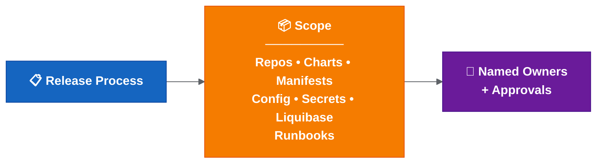
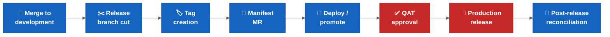

# Release Scope, Ownership And Approvals

This page captures the release scope, ownership and approval questions that should be clarified.

Open scope and ownership decisions are tracked in the [release decision register](release-decision-register.md), especially D20 and D21.

## Why Scope Matters

The phrase "all services" needs a clear definition.

Release risk is not limited to source branches. It may also include Helm charts, manifests, configuration, secrets, runbooks and deployment management repositories.

If scope is unclear, automation may process too much, too little or the wrong thing.

## Ownership Gap

Automation cannot replace accountability. If an automated step fails, someone still needs to decide whether to rerun, override, stop, roll back or fix forward. Without named owners, decisions are delayed and escalation is unclear.

| Area | Accountable Owner Needed | Why |
| --- | --- | --- |
| Release readiness | Release owner | Confirms release can progress. |
| Manifest/tag validation | Release owner / platform owner | Prevents wrong artefacts. |
| Drone secrets/tokens | Platform owner | Prevents environment failures. |
| Hotfix decision | Release owner / incident lead | Avoids production drift. |
| Rollback decision | Release owner / incident lead | Ensures fast incident response. |
| Changed-chart exclusion | Release owner | Prevents hidden deployment gaps. |
| Environment readiness | Platform / environment owner | Confirms deployability. |
| Alert response | Named squad/platform owner | Ensures failed automation is handled. |

## Repositories To Classify

Confirm whether these are in scope for the same release process:

- Service repositories.
- Helm chart repositories.
- Cerberus deployment management repository.
- Manifest repositories.
- Secrets/config repositories.
- Liquibase/database change repositories or scripts.
- Runbook repositories.
- Any release metadata or changelog repositories.

## Service Scope Questions

- What does "all services" mean in practice?
- Are release branches created for all services or only changed services?
- Can the automation detect services with actual changes?
- Are there services without clear squad ownership?
- Are shared libraries or shared charts included?
- Are environment-only changes included in the same release scope?
- Are secrets and Liquibase/database changes included in the same release readiness check?

## Change Types To Track

A production or feature change may involve more than application code.

Track whether each release includes:

| Change Type | Proposed Inclusion Status | Decision Needed | Notes |
| --- | --- | --- | --- |
| Application/service code | In scope by default | Confirm repository list | Service repository changes. |
| Service chart changes | In scope when changed | Confirm automation/manual boundary | May remain partly manual until Drone pipelines are updated. |
| Manifest updates | In scope by default | Confirm source of truth and approval point | Must match generated/expected tags. |
| Secrets/config changes | Needs decision per release | Confirm ownership and audit path | Needs careful handling and audit trail. |
| Liquibase/database changes | Needs decision per release | Confirm rollback/fix-forward plan | Needs release sequencing and rollback consideration. |
| Runbook steps | Needs decision per release | Confirm evidence and execution owner | Needed for manual or environment-specific operations. |

The release report should make these statuses visible for each release. If an item is excluded, the release owner should record the reason and approver.

## New Environment Readiness

Several setup points apply for new dev/test environments.

**An environment existing in Kubernetes does not mean it is release-ready.**

Before a new environment is treated as release-ready, confirm:

- [ ] Values files exist and match naming expectations.
- [ ] Environment name is supported by deployment scripts.
- [ ] Drone secrets/tokens are configured.
- [ ] Kube/robot token ownership is clear.
- [ ] Required secrets are present and encrypted correctly.
- [ ] Feature flag defaults are known and documented.
- [ ] External integrations are reachable.
- [ ] Required runbook steps are documented.
- [ ] Access and permissions are confirmed.
- [ ] Smoke test path is known and executable.

Known setup areas to verify:

- Required values files exist.
- Environment names are configured in the relevant setup/deploy scripts.
- Drone secrets/tokens exist for the environment.
- Kube/robot token ownership is clear.
- ACU responsibilities are clear where token/environment provisioning depends on them.
- Deployment scope behaviour is known for live, historical or both.
- Secret chart entries exist and use the expected encrypted format.

## Cross-Repository Ticket Grouping

The proposed automation relies heavily on consistent ticket and branch naming.

If multiple repositories use the same ticket/branch name, their changes should update the same Cerberus chart branch. This allows one feature ticket to group service, config, secret, Liquibase and runbook changes together for deployment/testing.

Open items:

- Confirm the exact branch/ticket naming rule.
- Confirm which repositories participate in cross-repo grouping.
- Confirm what happens when one ticket depends on another ticket/branch.
- Confirm who can manually adjust chart entries for cross-ticket dependencies.
- Confirm who owns secret/config updates when the change spans multiple repositories.

## Ownership Areas

Ownership should be explicit for:

- Merge approval into `development`.
- Release branch creation.
- Tag creation.
- Manifest update.
- Release readiness for each service.
- Deployment execution.
- QAT approval.
- Production release approval.
- Hotfix approval.
- Rollback decision and execution.
- Post-release validation.
- Branch and manifest reconciliation.

## Approval Points

Potential approval points:

- Merge to `development`.
- Release branch cut.
- Tag creation.
- Manifest merge request.
- Promotion to SIT.
- Promotion to higher environments.
- QAT approval.
- Production release.
- Rollback or fix-forward decision.
- Post-release closure.

The team should decide which approval points are mandatory and which can be automated.

## Ownership Matrix Template

| Activity | Owner | Approver | Backup | Evidence |
| --- | --- | --- | --- | --- |
| Merge to `development` | Squad developer | Squad lead / peer reviewer | Another squad member | Merge request |
| Create release branch | Automation (Gareth/Achilles during pilot) | Release owner | Backup owner to assign | Pipeline/job link |
| Create service tag | Automation or release management | Release owner | Backup owner to assign | Tag + pipeline link |
| Update manifest | Automation (Gareth/Achilles during pilot) | Release owner | Backup owner to assign | Manifest MR |
| Deploy to lower environment | Squad developer | Squad lead | Another squad member | Deployment job |
| Deploy to SIT and above | Release management | Release owner | Backup owner to assign | Deployment job |
| QAT approval | QAT team | QAT lead | Backup owner to assign | Approval record |
| Production release | Release management | Release owner | Backup owner to assign | Release record |
| Hotfix | Squad developer (implements fix) | Release owner (approves) + incident lead (decides urgency) | Backup owner to assign | Hotfix MR/tag |
| Rollback | Platform / DevOps (executes) | Release owner (approves) + incident lead (decides) | Backup owner to assign | Rollback record |
| Post-release reconciliation | Automation + release owner | Release owner | Backup owner to assign | Merge records |

Note: Backup owners still need to be confirmed with team leads before rollout expansion. Known automation ownership sits with Gareth/Achilles for the pilot phase only; the long-term owner should be recorded in the [release decision register](release-decision-register.md).

## Access And Operational Constraints

The release process should document operational constraints, including:

- Whether Thursday is the standard release day.
- Whether PNR room/location access is required for higher environments.
- Which commands require tools pod access.
- Which steps depend on environment variables or secrets.
- Which runbook steps must be executed alongside release.
- How secret exposure during screen sharing/recording is prevented.
- What happens if a secret is exposed and rotation is required.

## Output Needed

The team should produce:

1. A repository scope list.
2. A service scope list.
3. A service ownership list.
4. A release approval map.
5. A manual access/runbook checklist.
6. A post-release reconciliation owner and checklist.

## Related Best Practices

RACI, CODEOWNERS, branch protection, platform-vs-squad ownership and release-train guidance are summarised in [release engineering best practices](release-engineering-best-practices.md).

## Related Pages

- [Hotfix And Rollback](hotfix-and-rollback.md)
- [Rollout Decision Proposals - Summary](rollout-decision-proposals.md)
- [Release Decision Register](release-decision-register.md)
- [Transformation Programme — Delivery](transformation-programme-delivery.md)
