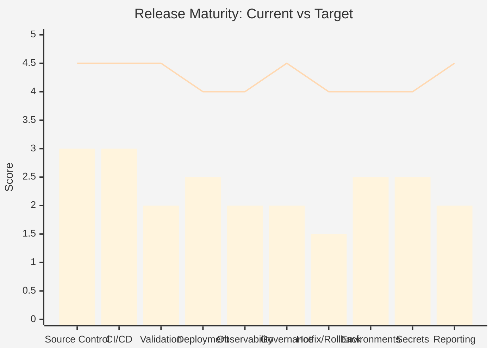
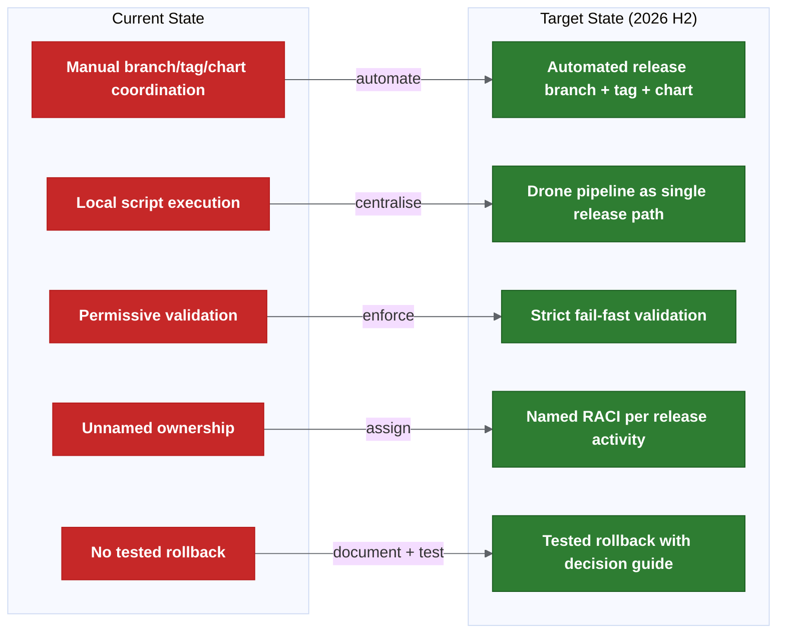
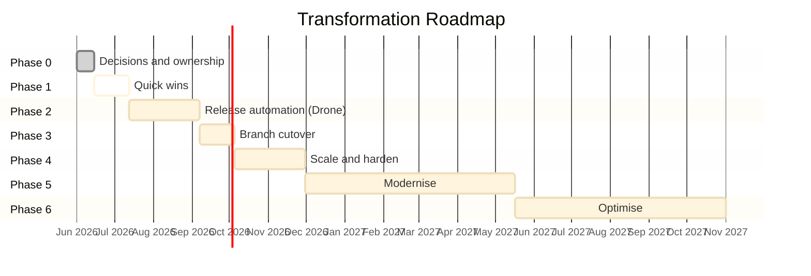

# System State, Problems, Solution Options And Risks

This is the decision-ready summary of the CI/CD, branching, release and deployment documentation.

This is an assessment and proposal, not an approved operating model. Items marked "Proposed" or "Needs confirmation" require team sign-off before implementation.

For the full detailed analysis, see [system state detailed analysis](reference/system-state-problems-solutions-detailed.md).

## Executive Assessment

### Current Situation In One Paragraph

Cerberus currently operates a GitFlow-like branching model, but the real release state is not contained within Git alone. It is fragmented across branches, tags, Docker images, Helm artefacts, the Cerberus deployment-management repository, manifests, environment-specific values files, Jira ticket metadata, secrets (managed through Git-crypt and Drone), Liquibase database scripts and runbooks. A branch rename or branching model simplification does not address this fragmentation. The release process is manual-heavy, validation is not strict enough, ownership is not fully assigned and operational procedures (hotfix, rollback, environment readiness) are not standardised. The automation pilot (Gareth/Achilles on the configuration service) is a strong first step, but it covers only part of the problem.

### Top Findings

| # | Finding | Impact | Recommended Action |
| --- | --- | --- | --- |
| 1 | The issue is broader than branching. | Changing the branch model alone does not fix the release process. | Stabilise the operating model before simplifying branches. |
| 2 | Release state is fragmented across multiple systems. | No single view of what constitutes a release. | Map all release state areas; validate consistency through automation. |
| 3 | Release preparation is manual-heavy. | Days of effort per sprint; inconsistency and audit gaps. | Move local scripts into Drone; automate branch/tag/chart creation. |
| 4 | Tag, artefact and manifest validation is not strict enough. | Wrong artefact or blocked work may reach production. | Fail fast on wrong tag, missing tag, manifest/tag mismatch. |
| 5 | Release scope is not fully explicit. | Automation may miss secrets, config, Liquibase or runbook changes. | Define and enforce a release scope checklist per release. |
| 6 | Hotfix and rollback are not operationally standardised. | Production fixes may drift from main, manifests and active releases. | Document and test both hotfix and rollback flows before next production incident. |
| 7 | Environment readiness is not a formal gate. | Deployment may fail due to incomplete setup (missing values, secrets, tokens). | Treat environment readiness as a mandatory pre-deployment gate. |
| 8 | Ownership and approval responsibilities are not fully named. | Decisions are delayed; escalation is unclear. | Assign named owners for every release activity. |
| 9 | Failed automation alerting and rerun rules are incomplete. | A failed step can leave release state unclear and unresolved. | Define alerting channels, rerun safety rules and manual-intervention triggers. |
| 10 | Trunk-based development would be risky without stronger feature flags, validation and rollback maturity. | Premature simplification may create instability. | Keep GitFlow-style baseline; reassess branch model after automation matures. |

### Main Message

> **Changing the branch model alone will not make releases safer.**
>
> The safer path is to make the current release state visible, repeatable, validated, owned and auditable first; then simplify the branch model after the automation proves what is actually being released.

## Release State Is Fragmented

The release process depends on multiple disconnected state areas. A problem in any one of them can invalidate the release.

| Release State Area | Current Location / Mechanism | Risk |
| --- | --- | --- |
| Source state | Git branches | Branch may not equal deployed state. |
| Release identity | Git tags / release versions | Wrong tag can create wrong artefact. |
| Build output | Docker images / Helm packages | Artefact may not match intended commit. |
| Deployment intent | Cerberus deployment-management / charts | Chart may not match release scope. |
| Environment config | Values files / feature flags | Deployed code may not be active. |
| Secrets | Git-crypt / managed secrets scripts / Drone secrets | Environment may not be ready. |
| Database changes | Liquibase | Rollback may be unsafe or impossible. |
| Release metadata | Jira labels / ticket fields | Release report may be incomplete. |
| Manual actions | Runbooks / release management | Audit trail may be weak. |
| Approval state | QAT / release owner decisions | Ownership may be unclear. |

**This is why a branch rename or branch-model change is not enough. Release safety depends on all of these states agreeing.**

## Business And Delivery Impact

| Problem | Delivery Impact | Operational Risk |
| --- | --- | --- |
| Manual release work | Release preparation takes days per sprint. | Human error and weak audit trail. |
| Weak validation | Wrong artefact may be released. | Production incident risk. |
| Unclear release scope | Config/secrets/DB changes may be missed. | Partial or broken release. |
| Weak rollback process | Recovery may be slow. | Longer incident duration. |
| Ownership gaps | Decisions are delayed. | Escalation confusion. |
| Environment readiness gaps | Late release failure. | Wasted release window. |
| Fragmented release state | Hard to prove what was deployed. | Audit and incident investigation risk. |

## Executive Summary

```text
Do not change the branching model first.
First make the release process visible, repeatable, validated and owned.
Then move to the target main = production model through a controlled cutover.
```

The current problem is broader than branching. The release state is spread across branches, tags, images, Helm packages, Cerberus charts, manifests, values, secrets, Liquibase changes, JIRA metadata, QAT approval and post-release reconciliation.

The proposed direction is good, but it should be treated as a phased operating-model change, not only a branch rename.

## Current System State

| Area | Current State | Confidence |
| --- | --- | --- |
| Branch model | GitFlow-like: feature -> `development` -> release branch -> `master` / production. | Medium |
| Target branch model | `main` represents production; release branches auto-created from `main`. | Proposed |
| Automation | Scripts work locally; Drone execution is the next step. | Medium |
| Pilot | Gareth/Achilles are testing on the new configuration service. | Medium |
| Artefact creation | Release tag triggers build, tests, scans and Helm artefact creation. | High |
| Deployment | Helm/package and Cerberus chart flow still has manual areas. | Medium |
| Release reporting | Expected to cross-reference JIRA, tags, services and chart changes. | Proposed |
| Validation | Existing scripts check some metadata, but strict fail/warn policy is not fully agreed. | Low/Medium |
| Hotfix/rollback | Concepts exist; operational runbook and reconciliation rules need approval. | Low/Medium |
| Environment readiness | Values, secrets, tokens and parity checks need clearer gates. | Low |
| Ownership | Templates exist; named owners and approvers are still incomplete. | Low |

## Main Problems

| # | Problem | Impact | Root Cause | Recommended Action |
| --- | --- | --- | --- | --- |
| P1 | The issue can be misframed as "branching only". | A branch change may move risk rather than reduce it. | Release state is distributed across many systems. | Stabilise the operating model before changing the branch model. |
| P2 | Release work is too manual and locally executed. | Slow releases, inconsistent execution, weak audit trail. | Automation is not yet the mandatory central path. | Complete Drone pilot; make pipeline the only release path. |
| P3 | Branch, tag and artefact timing rules are not strict enough. | Wrong artefacts or manifests can be produced. | Branch lifecycle and artefact lifecycle are different. | Enforce strict validation: wrong/missing tag = fail. |
| P4 | Release scope is unclear. | Secrets, config, Liquibase or runbook changes can be missed. | "All services" is not yet defined as a repo/change-type scope. | Define explicit release scope per repo and change type. |
| P5 | Manifest and ticket validation can be too permissive. | Blocked or wrong work can reach release. | Fail vs warning policy is still proposed. | Switch from warning to fail-fast after one dry-run release. |
| P6 | Changed-chart deployment is not yet a proven default. | Changed charts may be missed or unnecessary charts deployed. | Umbrella chart and service mapping need reliable detection. | Validate detection in pilot; deploy changed charts by default. |
| P7 | Hotfix and rollback are not operationally standardised. | Production can drift from branch, manifest and release records. | Rollback is treated as technical capability, not full process. | Document and test both flows before next production incident. |
| P8 | Environment readiness and parity are not explicit gates. | Release day failures can appear late. | Values, secrets, data, access and tokens are not centrally confirmed. | Formalise environment readiness as a mandatory gate. |
| P9 | Secrets/config management will get harder at scale. | Onboarding, rotation and audit risk increase. | Git-crypt/GPG is workable but operationally heavy. | Evaluate External Secrets Operator for medium-term. |
| P10 | Trunk-based development is risky without stronger feature flags. | Incomplete work may need branch or config workarounds. | Feature flags appear deploy-time rather than dynamic runtime. | Keep current model; add runtime flags before reconsidering. |
| P11 | Ownership and approval gaps can break the rollout. | Failures, overrides and rollback decisions become slow. | RACI is not yet fully named. | Assign named owners before expanding beyond pilot. |
| P12 | Alerting and rerun rules are incomplete. | Failed automation can leave state half-updated. | Failure modes are not yet production-readiness gates. | Define alerting channels and safe-rerun criteria. |

For detailed analysis of each problem, see the [detailed system analysis appendix](reference/system-state-problems-solutions-detailed.md).

## Recommended Solution Path

### 1. Stabilise The Current Operating Model

Keep the current GitFlow-style model temporarily while the release process is made explicit.

Do now:

- Approve or amend the rollout decisions.
- Define release scope across repos and change types.
- Decide fail vs warning validation rules.
- Name release, hotfix, rollback, environment and alert owners.
- Keep the current process visible until automation is proven.

Risk:

- This can look like "no branching progress" unless time-boxed.

Mitigation:

- Treat it as a one-sprint decision cleanup and publish the exit criteria.

### 2. Move Release Automation Into Drone

Make Drone the central path for release branch, tag, chart update and report generation.

Do next:

- Complete the configuration-service pilot.
- Test reruns and partial-failure recovery.
- Store release reports as pipeline artefacts or release records.
- Alert failures to the right squad/release channel.

Risk:

- Local scripts may fail in Drone because of token, proxy, secret or permission differences.

Mitigation:

- Keep pilot scope narrow and test both happy-path and failure-path cases.

### 3. Add Strict Release Validation

Recommended default:

```text
Wrong tag -> fail
Missing tag -> fail
Manifest/tag mismatch -> fail
Do-not-deploy marker -> fail unless explicitly overridden
Invalid ticket status -> fail or release-owner override
Unknown ownership -> fail or release-owner override
```

Risk:

- Early rollout may fail often because metadata quality is inconsistent.

Mitigation:

- Start with dry-run/report-only for one release, then switch to enforced fail-fast.

### 4. Cut Over To `main = Production`

Only cut over after the pilot and validation rules are green.

Correct cutover:

```text
Create or rename `main` from the confirmed production state.
Do not rename `development` to `main`.
```

Risk:

- `development` may contain work that has not reached production.

Mitigation:

- Freeze `development`, inventory open work and set branch protections before cutover.

### 5. Scale Changed-Chart Deployment

Default to deploying all changed charts, with exclusions requiring release-owner approval and an audit note.

Risk:

- Detection can miss a chart, especially with umbrella charts or cross-repo changes.

Mitigation:

- Keep mass diff and human review mandatory in the first rollout phases.

### 6. Make Hotfix And Rollback A Production Gate

Production release should not proceed without:

- hotfix flow,
- rollback vs fix-forward decision guide,
- manifest reconciliation checklist,
- branch reconciliation checklist,
- Liquibase rollback/fix-forward policy,
- named decision owner.

Risk:

- Rollback may be unsafe when DB/data changes are involved.

Mitigation:

- Require rollback blocks or explicit no-rollback justification for production Liquibase changes.

### 7. Modernise Later, Not First

Runtime feature flags, external secret management, canary rollout and progressive delivery are valuable future improvements.

They should come after the release pipeline, validation and ownership model are stable.

## Go / No-Go Criteria

### Go For Automation Rollout

- Drone pilot succeeds for the configuration service.
- Generated tags, versions, chart changes and release report match expectations.
- Rerun is tested and safe.
- Failure alerting is defined.
- Manual chart edits are exception-only and audited.
- Release owner and backup are named.

### No-Go For Automation Rollout

- Scripts only work locally.
- Pipeline failure can be silent.
- Rerun can create duplicate or conflicting state.
- Release report does not match actual chart/manifest state.
- Drone secrets/tokens are not owned.

### Go For Branch Cutover

- Confirmed production state is known.
- `main` branch protection is ready.
- Automation targets the correct branch.
- Open work on `development` is inventoried.
- Hotfix and rollback reconciliation are approved.
- Strict validation has passed at least the pilot.

### No-Go For Branch Cutover

- Production state cannot be tied to branch/tag/manifest.
- Drone pilot is not green.
- `development` contains unknown open work.
- Rollback reconciliation is unclear.
- Forward-merge ownership is missing.

## Final Recommendation

```text
Phase 0: approve decisions and ownership.
Phase 1: quick wins and strict validation dry-run.
Phase 2: Drone pilot.
Phase 3: controlled `main = production` cutover.
Phase 4: expand changed-chart deployment and shared dev.
Phase 5: optimise feature flags, secrets and progressive delivery.
```

The strongest recommendation is to avoid a big-bang branch change. The safer path is to make the release state auditable first, then simplify the branch model once the automation can prove what is actually being released.

For the full transformation programme including root cause analysis, maturity assessment, roadmap, RACI, metrics and cost/benefit analysis, see [transformation programme](transformation-programme.md).

## One-Page Summary

### Current State

Cerberus uses a GitFlow-like branching model with release branches, tags, Helm packaging and environment promotion. The release process is functional but manual-heavy, with fragmented state across branches, tags, images, charts, manifests, Jira, secrets and runbooks. Automation is being piloted on the configuration service by Gareth/Achilles.

### Top 5 Risks
| --- | --- | --- | --- |
| Source control and branching | 3.0 / 5 | 4.5 / 5 | Branch model clear but reconciliation and automation incomplete. |
| CI/CD pipeline | 3.0 / 5 | 4.5 / 5 | Pipeline exists but release steps are local/manual. |
| Release validation | 2.0 / 5 | 4.5 / 5 | Scripts exist but fail/warn policy not enforced. |
| Deployment automation | 2.5 / 5 | 4.0 / 5 | Helm/Drone works but manual chart updates and triggers remain. |
| Observability and monitoring | 2.0 / 5 | 4.0 / 5 | Health checks exist; no release-correlated observability gates. |
| Release governance and ownership | 2.0 / 5 | 4.5 / 5 | Templates exist; named owners and approval map incomplete. |
| Hotfix and rollback | 1.5 / 5 | 4.0 / 5 | Technical capability exists; no tested operational process. |
| Environment management | 2.5 / 5 | 4.0 / 5 | Environments exist but readiness is not gated. |
| Secrets and config management | 2.5 / 5 | 4.0 / 5 | Git-crypt works but onboarding and rotation are heavy. |
| Release reporting and audit | 2.0 / 5 | 4.5 / 5 | Scripts generate some metadata; not yet pipeline-driven or mandatory. |

**Overall: Current 2.3 / 5 → Target 4.3 / 5**



## Transformation Principles

1. **Do not change the branching model first.** Stabilise the release operating model before simplifying branches.
2. **Standardise release metadata.** Every release must be traceable from commit to production through tags, manifests, reports and Jira.
3. **Automate before reorganising.** Prove the automation works with the current model before introducing a new one.
4. **Improve visibility before restructuring.** Release reports, dashboards and alerting make problems visible so they can be fixed.
5. **Reduce manual release activities.** Every manual step is a consistency risk and a scaling bottleneck.
6. **Make ownership explicit.** Unnamed responsibilities are unowned responsibilities.
7. **Test rollback before you need it.** A rollback process that has never been tested is not a rollback process.
8. **Treat environment readiness as a gate, not an assumption.** An existing namespace is not a ready environment.

## Target State Architecture

### Current vs Target



### Target End State (2026 H2)

```text
- main = production baseline (always).
- Release branches auto-created, short-lived (1-2 weeks max).
- Feature/hotfix branches auto-generate deployable candidates.
- Cerberus charts auto-updated on merge.
- Changed-chart detection deploys only what changed.
- Release reports auto-generated with Jira cross-reference.
- Strict validation enforced (wrong tag = fail).
- Named owners for every release activity.
- Rollback tested and documented.
- Environment readiness gated.
- Alerting for all automation failures.
```

## Transformation Roadmap

| Phase | Timeframe | Focus | Key Deliverables |
| --- | --- | --- | --- |
| 0 | Now (Week 1-2) | Decisions and ownership | Approve rollout decisions; assign named owners; publish exit criteria. |
| 1 | Month 1 | Quick wins | Pre-commit hook; strict validation dry-run; environment readiness checklist; rollback documentation. |
| 2 | Month 2-3 | Release automation | Drone pilot green; auto branch/tag/chart; release reporting; alerting. |
| 3 | Month 3-4 | Branch cutover | Controlled `main = production` cutover; branch protections; forward-merge rules active. |
| 4 | Month 4-6 | Scale and harden | Changed-chart deployment default; shared dev auto-deploy; rerun safety; full RACI enforcement. |
| 5 | Month 6-12 | Modernise | Runtime feature flags; External Secrets Operator; SBOM generation; observability gates evaluation. |
| 6 | 12+ months | Optimise (if needed) | Trunk-based evaluation; GitOps (ArgoCD); progressive delivery; canary rollout. |



## Prioritisation Matrix

| Recommendation | Impact | Effort | Priority Quadrant |
| --- | --- | --- | --- |
| Strict tag/manifest validation | High | Low | **Do first** |
| Release metadata standardisation | High | Low | **Do first** |
| Named ownership (RACI) | High | Low | **Do first** |
| Rollback documentation and testing | High | Medium | **Do first** |
| Environment readiness gate | High | Low | **Do first** |
| Drone release automation pilot | High | Medium | **Do next** |
| Release reporting dashboard | High | Medium | **Do next** |
| Changed-chart detection and deployment | High | Medium | **Do next** |
| Alerting for failed automation | Medium | Low | **Do next** |
| Branch cutover (`main = production`) | Medium | Medium | **Plan** |
| External Secrets Operator | Medium | Medium | **Plan** |
| Runtime feature flags | Medium | High | **Defer** |
| SBOM generation | Low-Medium | Low | **Plan** |
| ArgoCD / GitOps | Medium | High | **Defer** |
| Canary / progressive delivery | Medium | Very High | **Defer** |
| Trunk-based development | Medium | Very High | **Defer** |

## RACI Matrix

| Activity | Dev / Squad | Tech Lead | Architect | Platform / DevOps | Release Owner | QAT |
| --- | --- | --- | --- | --- | --- | --- |
| Feature development | R | A | C | I | I | I |
| Merge to release branch | R | A | I | I | I | I |
| Release branch creation | I | I | I | R | A | I |
| Tag and artefact build | I | I | I | R | A | I |
| Manifest validation | I | C | C | R | A | I |
| Deploy to lower environments | R | A | I | C | I | I |
| Deploy to SIT and above | I | C | I | R | A | C |
| Functional validation | C | I | I | I | I | R/A |
| Production release approval | I | C | C | C | A | R |
| Hotfix decision | C | C | C | R | A | I |
| Rollback decision | C | C | C | R | A | I |
| Post-release reconciliation | I | I | I | R | A | I |
| Environment readiness | I | I | C | R/A | C | I |
| Alert response | R | A | I | R | C | I |
| Release reporting | I | I | C | R | A | I |

Legend: R = Responsible, A = Accountable, C = Consulted, I = Informed.

Note: Named individuals still need to be assigned. This matrix defines roles, not people. Needs confirmation with team leads.

## Success Metrics

| Metric | Current (Estimated) | Phase 2 Target | Phase 4 Target | Measurement Source |
| --- | --- | --- | --- | --- |
| Deployment frequency | Monthly (approx.) | Fortnightly | Weekly | Drone pipeline history |
| Lead time (commit to production) | 10-15 days (estimated) | 5-7 days | 2-3 days | Git + Drone timestamps |
| Change failure rate | Unknown (estimated 10-15%) | < 5% | < 2% | Incident records |
| Mean time to restore (MTTR) | Unknown (estimated 4-8h) | < 2h | < 1h | Incident records |
| Release preparation effort | Days per sprint | < 1 day | < 2 hours | Team time tracking |
| Manual steps per release | 10+ (estimated) | < 5 | < 2 (approve + trigger) | Process audit |
| Release report accuracy | Partial / manual | Auto-generated, reviewed | Auto-generated, trusted | Pipeline artefacts |
| Rollback test frequency | Never tested | Tested once per quarter | Tested every release cycle | Runbook execution log |
| Environment readiness failures | Unknown | Tracked and gated | Zero (gated) | Pre-deployment checks |

Note: Current values are estimates based on available information. Actual measurement should begin in Phase 1.

## Cost / Benefit Analysis

| Improvement | Estimated Cost | Expected Benefit | Payback |
| --- | --- | --- | --- |
| Strict validation (fail-fast) | Low (script/config change) | Prevents wrong artefacts reaching production. | Immediate |
| Named ownership (RACI) | Low (management decision) | Faster decisions during incidents and releases. | Immediate |
| Rollback documentation | Low-Medium (documentation + testing) | Confidence for production incidents. | First incident avoided |
| Drone release automation | Medium (pilot + rollout) | Days saved per sprint; consistent execution. | 2-3 releases |
| Release reporting dashboard | Medium (tooling + pipeline) | Visibility for all stakeholders; audit trail. | Ongoing |
| Environment readiness gate | Low (checklist + pre-deploy check) | Eliminates late release failures. | First prevented failure |
| Changed-chart deployment | Medium (detection logic + validation) | Faster deploys; no unnecessary chart pushes. | Ongoing |
| External Secrets Operator | Medium (infrastructure + migration) | Simpler rotation; better audit; easier onboarding. | 6 months |
| ArgoCD / GitOps | High (infrastructure + process change) | Drift detection; instant rollback via Git revert; full audit. | 12+ months |
| Trunk-based development | Very High (culture + tooling + flags) | Uncertain until feature flags and validation mature. | Unknown |

## Investment Recommendation

> **Recommended investment focus should be release governance, environment standardisation and deployment automation rather than immediate branching model replacement.**

The highest-return investments are low-cost, high-impact changes (strict validation, ownership, environment readiness) combined with the medium-cost automation pilot already in progress. Branch model simplification and platform modernisation (GitOps, progressive delivery) should follow naturally once the operating model is stable and measurable.

## Top 10 Recommendations

| # | Recommendation | Phase |
| --- | --- | --- |
| 1 | Standardise release metadata (tags, manifests, Jira fields, commit format). | 0-1 |
| 2 | Establish release governance (named owners, approval map, RACI). | 0 |
| 3 | Enforce strict release validation (wrong/missing tag = fail). | 1 |
| 4 | Complete Drone release automation pilot. | 2 |
| 5 | Document and test rollback process. | 1 |
| 6 | Formalise environment readiness as a deployment gate. | 1 |
| 7 | Create release reporting dashboard. | 2 |
| 8 | Introduce release KPIs (DORA metrics + custom). | 2 |
| 9 | Strengthen audit trail (pipeline artefacts, immutable reports). | 2-3 |
| 10 | Re-evaluate branching strategy after maturity improvements (Phase 4+). | 4+ |

## One-Page Summary

### Current State

Cerberus uses a GitFlow-like branching model with release branches, tags, Helm packaging and environment promotion. The release process is functional but manual-heavy, with fragmented state across branches, tags, images, charts, manifests, Jira, secrets and runbooks. Automation is being piloted on the configuration service by Gareth/Achilles.

### Top 5 Risks

| # | Risk | Likelihood | Impact |
| --- | --- | --- | --- |
| 1 | Wrong artefact deployed due to weak tag/manifest validation. | Medium | High |
| 2 | Production incident with no standardised rollback procedure. | Medium | Critical |
| 3 | Release scope incomplete (missing secrets, config or DB changes). | High | High |
| 4 | Ownership gaps delay decisions during incidents. | High | Medium |
| 5 | Environment readiness failure blocks release at deploy time. | Medium | Medium |

### Top 5 Recommendations

| # | Recommendation | Effort | Priority |
| --- | --- | --- | --- |
| 1 | Move release automation scripts into Drone (complete the pilot). | Medium | Immediate |
| 2 | Enforce strict tag/manifest validation (fail on mismatch). | Low | Immediate |
| 3 | Document and test hotfix and rollback flows. | Medium | Before next production incident |
| 4 | Assign named owners for all release activities. | Low | Before pilot expands |
| 5 | Formalise environment readiness as a pre-deployment gate. | Low | Before new environments are used |

### Go / No-Go Criteria For Rollout Expansion

Before expanding the automation beyond the pilot:

- [ ] Configuration-service pilot completes successfully in Drone.
- [ ] Generated chart changes, versions and tags are correct.
- [ ] Release report is produced and matches expected content.
- [ ] Changed-chart detection identifies expected charts.
- [ ] Alerting for failed steps is in place.
- [ ] Rollback procedure is documented and tested.
- [ ] Named release owner and platform owner are assigned.
- [ ] At least one squad lead has reviewed and confirmed understanding.

### Suggested Next Step

> **Validate the current-state assumptions with Gareth, Achilles, release management and one squad lead before asking for approval on the rollout decisions.**

---

<- [README](../README.md) | -> [Rollout decision proposals](rollout-decision-proposals.md)
