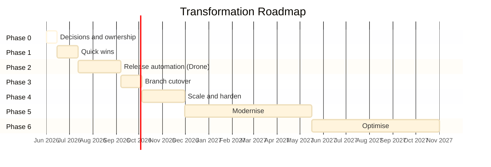

# Transformation Programme — Delivery

This page contains the roadmap, governance structures, metrics and recommendations for the release transformation.

For root cause analysis, risk assessment, maturity scorecard and target state architecture, see [transformation programme](transformation-programme.md).

## Transformation Roadmap

Roadmap status reflects execution readiness, not document-writing progress. Phase 0 remains active until the rollout decisions are approved, named owners/backups are assigned and exit criteria are published. See the [release decision register](release-decision-register.md) for the live approval tracker.

| Phase | Timeframe | Focus | Key Deliverables |
| --- | --- | --- | --- |
| 0 | Now (Week 1-2) | Decisions and ownership | Approve rollout decisions; assign named owners; publish exit criteria. Status: active / not yet closed. |
| 1 | Month 1 | Quick wins | Pre-commit hook; strict validation dry-run; environment readiness checklist; rollback documentation. Starts after Phase 0 decisions are closed. |
| 2 | Month 2-3 | Release automation | Drone pilot green; auto branch/tag/chart; release reporting; alerting. |
| 3 | Month 3-4 | Branch cutover | Controlled `main = production` cutover; branch protections; forward-merge rules active. |
| 4 | Month 4-6 | Scale and harden | Changed-chart deployment default; shared dev auto-deploy; rerun safety; full RACI enforcement. |
| 5 | Month 6-12 | Modernise | Runtime feature flags; External Secrets Operator; SBOM generation; observability gates evaluation; read-only deployment/release dashboard feasibility. |
| 6 | 12+ months | Optimise (if needed) | Trunk-based evaluation; GitOps (ArgoCD); progressive delivery; canary rollout; unified deployment control plane evaluation. |
| 7 | Future | Platform maturity | Controlled deployment trigger; rollback assistant; approval workflow integration; metrics/audit reporting through control plane. |

## Prioritisation Matrix

| Recommendation | Impact | Effort | Priority Quadrant |
| --- | --- | --- | --- |
| Strict tag/manifest validation | High | Low | **Do first** |
| Release metadata standardisation | High | Low | **Do first** |
| Named ownership (RACI) | High | Low | **Do first** |
| Rollback documentation and testing | High | Medium | **Do first** |
| Environment readiness gate | High | Low | **Do first** |
| Drone release automation pilot | High | Medium | **Do next** |
| Release reporting dashboard | High | Medium | **Do next** |
| Changed-chart detection and deployment | High | Medium | **Do next** |
| Alerting for failed automation | Medium | Low | **Do next** |
| Branch cutover (`main = production`) | Medium | Medium | **Plan** |
| External Secrets Operator | Medium | Medium | **Plan** |
| Runtime feature flags | Medium | High | **Defer** |
| SBOM generation | Low-Medium | Low | **Plan** |
| ArgoCD / GitOps | Medium | High | **Defer** |
| Canary / progressive delivery | Medium | Very High | **Defer** |
| Trunk-based development | Medium | Very High | **Defer** |

## RACI Matrix

| Activity | Dev / Squad | Tech Lead | Architect | Platform / DevOps | Release Owner | QAT |
| --- | --- | --- | --- | --- | --- | --- |
| Feature development | R | A | C | I | I | I |
| Merge to release branch | R | A | I | I | I | I |
| Release branch creation | I | I | I | R | A | I |
| Tag and artefact build | I | I | I | R | A | I |
| Manifest validation | I | C | C | R | A | I |
| Deploy to lower environments | R | A | I | C | I | I |
| Deploy to SIT and above | I | C | I | R | A | C |
| Functional validation | C | I | I | I | I | R/A |
| Production release approval | I | C | C | C | A | R |
| Hotfix decision | C | C | C | R | A | I |
| Rollback decision | C | C | C | R | A | I |
| Post-release reconciliation | I | I | I | R | A | I |
| Environment readiness | I | I | C | R/A | C | I |
| Alert response | R | A | I | R | C | I |
| Release reporting | I | I | C | R | A | I |

Legend: R = Responsible, A = Accountable, C = Consulted, I = Informed.

Note: Named individuals still need to be assigned. This matrix defines roles, not people. Needs confirmation with team leads.

## Indicative Success Metrics - To Be Baseline Measured

| Metric | Current (Estimated) | Phase 2 Target | Phase 4 Target | Measurement Source |
| --- | --- | --- | --- | --- |
| Deployment frequency | Monthly (approx.) | Fortnightly | Weekly | Drone pipeline history |
| Lead time (commit to production) | 10-15 days (estimated) | 5-7 days | 2-3 days | Git + Drone timestamps |
| Change failure rate | Unknown (estimated 10-15%) | < 5% | < 2% | Incident records |
| Mean time to restore (MTTR) | Unknown (estimated 4-8h) | < 2h | < 1h | Incident records |
| Release preparation effort | Days per sprint | < 1 day | < 2 hours | Team time tracking |
| Manual steps per release | 10+ (estimated) | < 5 | < 2 (approve + trigger) | Process audit |
| Release report accuracy | Partial / manual | Auto-generated, reviewed | Auto-generated, trusted | Pipeline artefacts |
| Rollback test frequency | Never tested | Tested once per quarter | Tested every release cycle | Runbook execution log |
| Environment readiness failures | Unknown | Tracked and gated | Zero (gated) | Pre-deployment checks |

Note: Current values are estimates based on available information. Actual baseline measurement should begin in Phase 1.

## Cost / Benefit Analysis

| Improvement | Estimated Cost | Expected Benefit | Payback |
| --- | --- | --- | --- |
| Strict validation (fail-fast) | Low (script/config change) | Prevents wrong artefacts reaching production. | Immediate |
| Named ownership (RACI) | Low (management decision) | Faster decisions during incidents and releases. | Immediate |
| Rollback documentation | Low-Medium (documentation + testing) | Confidence for production incidents. | First incident avoided |
| Drone release automation | Medium (pilot + rollout) | Days saved per sprint; consistent execution. | 2-3 releases |
| Release reporting dashboard | Medium (tooling + pipeline) | Visibility for all stakeholders; audit trail. | Ongoing |
| Environment readiness gate | Low (checklist + pre-deploy check) | Eliminates late release failures. | First prevented failure |
| Changed-chart deployment | Medium (detection logic + validation) | Faster deploys; no unnecessary chart pushes. | Ongoing |
| External Secrets Operator | Medium (infrastructure + migration) | Simpler rotation; better audit; easier onboarding. | 6 months |
| ArgoCD / GitOps | High (infrastructure + process change) | Drift detection; instant rollback via Git revert; full audit. | 12+ months |
| Trunk-based development | Very High (culture + tooling + flags) | Uncertain until feature flags and validation mature. | Unknown |

## Investment Recommendation

> **Recommended investment focus should be release governance, environment standardisation and deployment automation rather than immediate branching model replacement.**

The highest-return investments are low-cost, high-impact changes (strict validation, ownership, environment readiness) combined with the medium-cost automation pilot already in progress. Branch model simplification and platform modernisation (GitOps, progressive delivery) should follow naturally once the operating model is stable and measurable.

## Top 10 Recommendations

| # | Recommendation | Phase |
| --- | --- | --- |
| 1 | Standardise release metadata (tags, manifests, Jira fields, commit format). | 0-1 |
| 2 | Establish release governance (named owners, approval map, RACI). | 0 |
| 3 | Enforce strict release validation (wrong/missing tag = fail). | 1 |
| 4 | Complete Drone release automation pilot. | 2 |
| 5 | Document and test rollback process. | 1 |
| 6 | Formalise environment readiness as a deployment gate. | 1 |
| 7 | Create release reporting dashboard. | 2 |
| 8 | Introduce release KPIs (DORA metrics + custom). | 2 |
| 9 | Strengthen audit trail (pipeline artefacts, immutable reports). | 2-3 |
| 10 | Re-evaluate branching strategy after maturity improvements (Phase 4+). | 4+ |

**Long-term note:** After the immediate release operating model is stabilised, the team should evaluate whether a unified deployment and release control plane is justified. This should be treated as a platform product decision, not as part of the first automation rollout. See the Future State section above for the full description.

---

<- [System state, problems, solutions and risks](system-state-problems-solutions.md) | -> [Rollout decision proposals](rollout-decision-proposals.md)

---

← [Transformation programme](transformation-programme.md) | → [Rollout decision proposals](rollout-decision-proposals.md)
