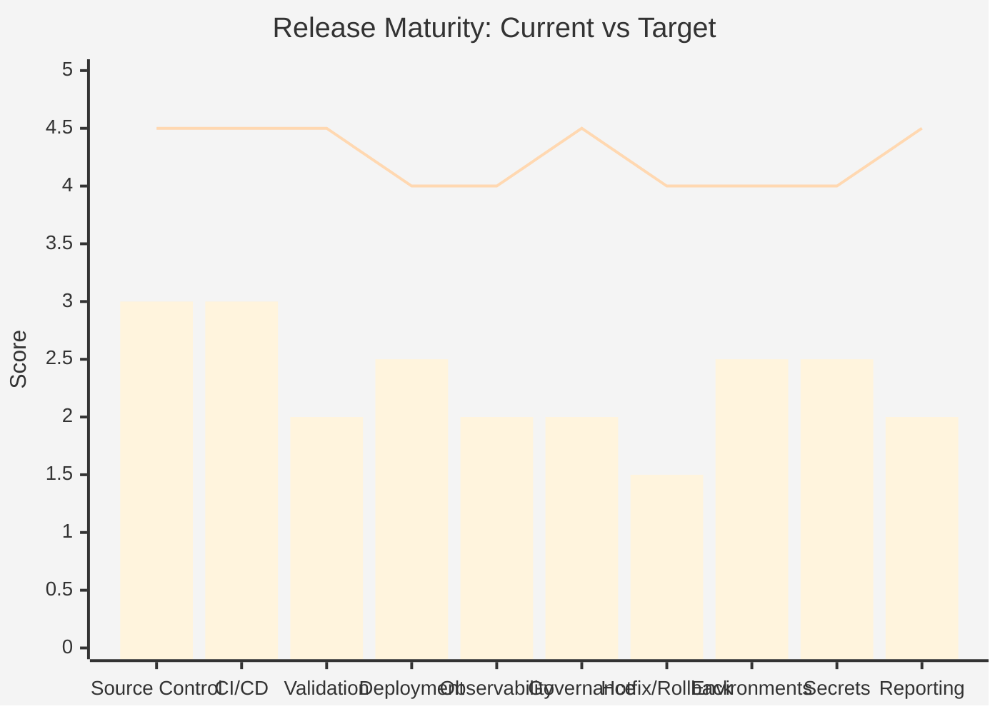
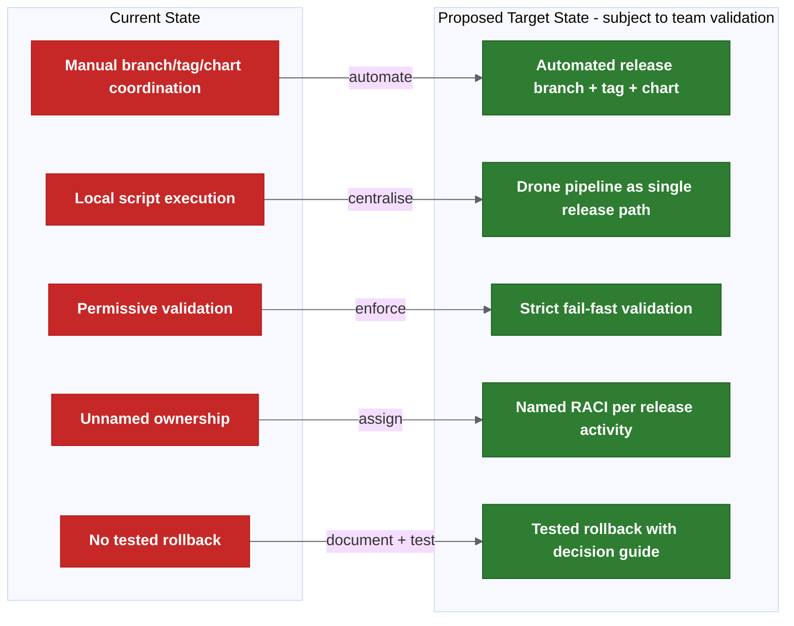

# Transformation Programme

This page contains the transformation analysis, planning and governance structures that sit alongside the assessment findings.

It answers: "Who does what, when, how do we measure success, and what does it cost?"

## Root Cause Analysis

| Problem | Root Cause | Evidence |
| --- | --- | --- |
| Failed or wrong release | Environment mismatch; tag/manifest validation not enforced. | Multiple tag versions created for same release (e.g. 581, 582, 583, 584). |
| Delayed release | Manual coordination across people, scripts and repos. | Release preparation reported to take days per sprint. |
| Rollback uncertainty | No tested operational rollback process; Liquibase may be forward-only. | Recent practical behaviour leans towards fix-forward. |
| Testing inconsistencies | Environment drift; lower envs deployed ad hoc while higher envs use chart releases. | Pre-prod may contain more data than production. |
| Unclear release content | Release metadata spread across Jira, Git tags, manifests and scripts. | Tag jump checker sometimes passes when it should fail. |
| Ownership confusion | RACI not assigned; "release management" is a function, not a named person per release. | Ownership matrix still requires named backup owners and formal approval. |

## Risk Assessment

| # | Risk | Likelihood | Impact | Priority | Mitigation |
| --- | --- | --- | --- | --- | --- |
| R1 | Production outage from wrong artefact. | Medium | Critical | P1 | Strict tag/manifest validation; fail on mismatch. |
| R2 | Extended incident due to no rollback process. | Medium | Critical | P1 | Document and test rollback flow; define time budget. |
| R3 | Release delays from manual coordination. | High | Medium | P2 | Automation pilot; Drone as single release path. |
| R4 | Partial release (missing secrets/config/DB). | High | High | P1 | Explicit release scope checklist per release. |
| R5 | Audit failure from weak release trail. | Medium | High | P2 | Pipeline-generated release reports; immutable artefacts. |
| R6 | Environment failure at deploy time. | Medium | Medium | P3 | Formal environment readiness gate. |
| R7 | Escalation confusion during incident. | High | Medium | P2 | Named owners per RACI. |
| R8 | Trunk-based instability. | Low (if deferred) | High | P3 | Do not adopt trunk-based until feature flags mature. |

## Current Release Maturity Assessment

| Area | Current Score | Target Score | Gap |
| --- | --- | --- | --- |
| Source control and branching | 3.0 / 5 | 4.5 / 5 | Branch model clear but reconciliation and automation incomplete. |
| CI/CD pipeline | 3.0 / 5 | 4.5 / 5 | Pipeline exists but release steps are local/manual. |
| Release validation | 2.0 / 5 | 4.5 / 5 | Scripts exist but fail/warn policy not enforced. |
| Deployment automation | 2.5 / 5 | 4.0 / 5 | Helm/Drone works but manual chart updates and triggers remain. |
| Observability and monitoring | 2.0 / 5 | 4.0 / 5 | Health checks exist; no release-correlated observability gates. |
| Release governance and ownership | 2.0 / 5 | 4.5 / 5 | Templates exist; named owners and approval map incomplete. |
| Hotfix and rollback | 1.5 / 5 | 4.0 / 5 | Technical capability exists; no tested operational process. |
| Environment management | 2.5 / 5 | 4.0 / 5 | Environments exist but readiness is not gated. |
| Secrets and config management | 2.5 / 5 | 4.0 / 5 | Git-crypt works but onboarding and rotation are heavy. |
| Release reporting and audit | 2.0 / 5 | 4.5 / 5 | Scripts generate some metadata; not yet pipeline-driven or mandatory. |

**Overall: Current 2.3 / 5 → Target 4.3 / 5**



## Transformation Principles

1. **Do not change the branching model first.** Stabilise the release operating model before simplifying branches.
2. **Standardise release metadata.** Every release must be traceable from commit to production through tags, manifests, reports and Jira.
3. **Automate before reorganising.** Prove the automation works with the current model before introducing a new one.
4. **Improve visibility before restructuring.** Release reports, dashboards and alerting make problems visible so they can be fixed.
5. **Reduce manual release activities.** Every manual step is a consistency risk and a scaling bottleneck.
6. **Make ownership explicit.** Unnamed responsibilities are unowned responsibilities.
7. **Test rollback before you need it.** A rollback process that has never been tested is not a rollback process.
8. **Treat environment readiness as a gate, not an assumption.** An existing namespace is not a ready environment.

## Target State Architecture

### Current vs Target



### Proposed Target End State - Subject To Team Validation

```text
- main = production baseline (always).
- Release branches auto-created, short-lived (proposed: 1-2 sprint duration — needs confirmation).
- Feature/hotfix branches auto-generate deployable candidates.
- Cerberus charts auto-updated on merge.
- Changed-chart detection deploys only what changed.
- Release reports auto-generated with Jira cross-reference.
- Strict validation enforced (wrong tag = fail).
- Named owners for every release activity.
- Rollback tested and documented.
- Environment readiness gated.
- Alerting for all automation failures.
```

## Future State: Unified Deployment And Release Control Plane

This is a future maturity option, not part of the immediate approval request. Once release metadata, strict validation, ownership, rollback and audit reporting are stable, Cerberus can evaluate a read-only release/deployment control plane that consolidates Git, Drone, Helm, deployment-management, Jira, Kubernetes and observability status into one operational view. The current approval should cover only the foundations that make that future option credible: reliable release state, named ownership, enforced gates, tested recovery and auditable evidence.

## Related Pages

- [Cerberus Release Engineering Assessment](../README.md)
- [System State, Problems, Solution Options And Risks](system-state-problems-solutions.md)
- [Transformation Programme — Delivery](transformation-programme-delivery.md)
- [Release Decision Register](release-decision-register.md)
- [Platform Engineering Strategy](platform-engineering-strategy.md)
