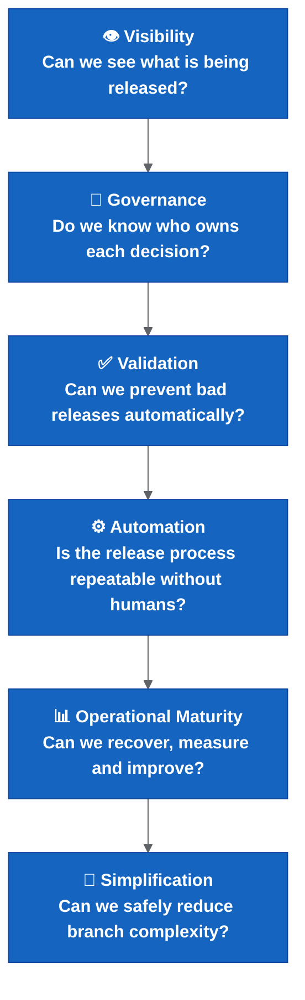
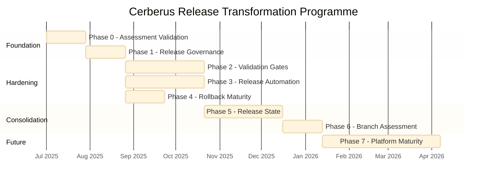
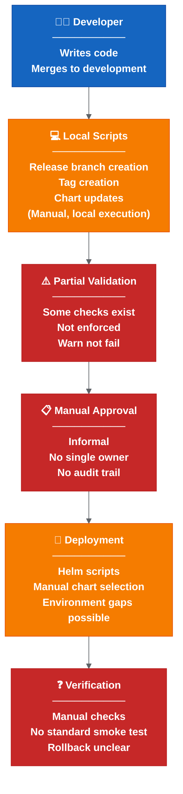
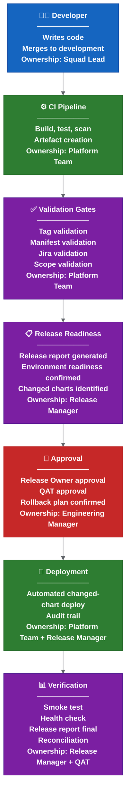

# Cerberus Release Transformation Programme

## Document Purpose

This document transforms the Cerberus Release Engineering Assessment into an executable transformation programme. It takes the findings, problems, risks and recommendations from the assessment and structures them into a phased, governed, measurable programme of work.

**Audience:** Engineering Managers, Release Managers, Platform Engineers, Squad Leads, Principal Engineers, Architects, Delivery Leadership.

**Status Classification:**

| Label | Meaning |
| --- | --- |
| Current understanding | Based on assessment evidence; may need validation |
| Needs confirmation | Assumed but not yet verified with the team |
| Proposed | Recommended but not yet approved |
| Future option | Not required now; available when maturity allows |

---

## Table Of Contents

1. [Transformation Strategy](#1-transformation-strategy)
2. [Transformation Roadmap](#2-transformation-roadmap)
3. [RACI Matrix](#3-raci-matrix)
4. [Success Metrics](#4-success-metrics)
5. [Prioritisation Matrix](#5-prioritisation-matrix)
6. [Go / No-Go Release Criteria](#6-go--no-go-release-criteria)
7. [Target Operating Model](#7-target-operating-model)
8. [Executive Investment View](#8-executive-investment-view)
9. [Final Recommendations](#9-final-recommendations)

---

## 1. Transformation Strategy

### Why Branching Should Not Be The First Change

The assessment consistently identifies that the current problem is broader than branching. Release state is distributed across branches, tags, images, Helm packages, Cerberus charts, manifests, values, secrets, Liquibase changes, JIRA metadata, QAT approval and post-release reconciliation.

Changing the branch model before these are visible and governed moves risk rather than reduces it:

- A branch rename does not fix invisible release state.
- A branch rename does not create accountability for rollback decisions.
- A branch rename does not validate that the correct artefacts reach production.
- A branch rename with unreliable automation creates new failure modes.

**Current understanding:** The team has recognised this and the assessment recommends stabilisation first.

### Why Release-State Visibility Comes First

You cannot improve what you cannot see. The assessment identifies that release state is fragmented across multiple systems with no single source of truth.

Before changing process:

- Every release must be traceable: commit → tag → image → chart → manifest → deployment.
- Release scope must be explicit: which repos, which change types, which services.
- Release reports must show what is being released before approval.

Without visibility, any change to the process (including branching) is a blind decision.

### Why Governance And Ownership Come Before Automation

The assessment identifies P11: ownership and approval gaps. Automation without ownership means:

- Nobody is accountable when automation fails.
- Nobody can approve an override when validation blocks a release.
- Nobody owns the rollback decision under time pressure.
- Escalation paths are unclear.

Governance creates the decision framework. Automation then executes within that framework. Reversing this order produces automation that nobody trusts, nobody maintains and nobody can override safely.

### Why Validation Comes Before Branch Simplification

The assessment identifies P5: validation is too permissive. Branch simplification (moving to trunk-based or simplified GitFlow) increases the importance of validation:

- With fewer branches, the wrong commit reaching `main` has immediate production impact.
- With fewer branches, feature isolation depends entirely on validation and feature flags.
- With fewer branches, rollback must be faster because there is less buffering.

Validation must be proven before reducing the branch safety net.

### Why Operational Maturity Is Required Before Trunk-Based Development

Trunk-based development requires:

- Reliable, fast CI/CD pipelines (not local scripts).
- Runtime feature flags (not deploy-time only).
- Automated rollback capability (not manual Helm rollback).
- High test coverage and fast feedback.
- Team discipline around small, frequent commits.

**Current understanding:** The assessment identifies that feature flags are deploy-time, automation is local, rollback is manual and test coverage is not yet measured. These are prerequisites, not optional extras.

### Transformation Philosophy

```text
Make the invisible visible.
Make the manual repeatable.
Make the repeatable automated.
Make the automated governed.
Make the governed measurable.
Only then simplify the model.
```

The programme follows a maturity ladder:



Each phase builds on the previous. Skipping a phase introduces risk that materialises under pressure (production incidents, release day failures, audit requirements).

---

## 2. Transformation Roadmap

### Phase 0 – Assessment Validation

**Goal:** Validate assumptions from the assessment before investing in change.

**Rationale:** The assessment is based on observation and documentation review. Several items are marked low confidence or needs confirmation. Phase 0 closes those gaps.

**Activities:**

| Activity | Status | Owner |
| --- | --- | --- |
| Confirm current release flow end-to-end | Needs confirmation | Release Manager |
| Confirm tag creation process and timing rules | Needs confirmation | Platform Team |
| Confirm deployment-management repo responsibilities | Needs confirmation | Platform Team |
| Confirm ownership model (who owns what today) | Needs confirmation | Engineering Manager |
| Confirm rollback process (what actually happens) | Needs confirmation | Release Manager |
| Confirm hotfix process (last 3 hotfixes reviewed) | Needs confirmation | Release Manager |
| Confirm environment readiness process | Needs confirmation | Platform Team |
| Confirm deployment approval flow | Needs confirmation | Release Manager |

**Deliverables:**

- Validated current-state model (confirmed or corrected)
- Ownership map (named individuals, not roles)
- Deployment flow diagram (actual, not aspirational)
- Release-state inventory (where is release state stored today)

**Success Criteria:**

- No major unknowns remain about the current release process.
- Assessment findings are confirmed, corrected or updated.
- Team agrees on the baseline.

**Suggested Duration:** 2–4 weeks.

**Risks:**

- People too busy with release work to validate the assessment.
- Validation reveals bigger problems than expected.

---

### Phase 1 – Release Governance

**Goal:** Establish clear accountability for every release decision.

**Rationale:** The assessment identifies that ownership gaps (P11) can break the rollout. Without named owners, failures become slow, rollback becomes political and automation becomes untrustable.

**Activities:**

| Activity | Status | Owner |
| --- | --- | --- |
| Define Release Owner (named person per release) | Proposed | Engineering Manager |
| Define Rollback Owner (who decides rollback vs fix-forward) | Proposed | Engineering Manager |
| Define Incident Owner (who leads during production issues) | Proposed | Engineering Manager |
| Define Platform Owner (who owns automation and pipelines) | Proposed | Engineering Manager |
| Define Environment Owner (who owns env readiness) | Proposed | Platform Team |
| Create approval matrix (which approvals, at which stage) | Proposed | Release Manager |
| Create RACI matrix (see Section 3) | Proposed | Release Manager |

**Deliverables:**

- Governance model document
- Approval model (mandatory vs optional approvals)
- Escalation path (what happens when the owner is unavailable)

**Success Criteria:**

- Every release decision has an accountable owner.
- Escalation paths are documented and agreed.
- Approval matrix is published and referenced by automation.

**Suggested Duration:** 2–4 weeks.

**Dependencies:** Phase 0 (validated current state).

---

### Phase 2 – Validation Gates

**Goal:** Prevent incorrect releases from progressing through the pipeline.

**Rationale:** The assessment identifies P3 (tag timing) and P5 (permissive validation). Invalid releases currently fail late (in production) rather than early (at creation).

**Activities:**

| Activity | Validation Rule | Status |
| --- | --- | --- |
| Tag validation | Wrong tag → fail. Missing tag → fail. | Proposed |
| Manifest validation | Manifest/tag mismatch → fail. | Proposed |
| Jira validation | Invalid ticket status → fail or release-owner override. | Proposed |
| Chart validation | Chart version does not match expected → fail. | Proposed |
| Release scope validation | Unknown service in scope → fail. Do-not-deploy marker → fail. | Proposed |
| Environment readiness validation | Missing values/secrets/tokens → fail. | Proposed |

**Deliverables:**

- Automated validation framework (integrated into Drone pipeline)
- Validation report per release (pass/fail with reasons)
- Override mechanism (release-owner can override with audit trail)

**Implementation Approach:**

```text
Sprint 1: Dry-run mode (report only, do not block).
Sprint 2: Enforce for pilot service (configuration service).
Sprint 3: Enforce for all services.
```

**Success Criteria:**

- Invalid releases fail automatically before reaching higher environments.
- Zero invalid artefacts reach production without explicit override.
- Override usage is auditable.

**Suggested Duration:** 4–8 weeks.

**Dependencies:** Phase 1 (owners must exist to handle overrides).

---

### Phase 3 – Release Automation

**Goal:** Reduce manual effort in release preparation and execution.

**Rationale:** The assessment identifies P2 (release work is too manual). Manual processes are slow, inconsistent and create audit gaps.

**Activities:**

| Activity | Current State | Target State |
| --- | --- | --- |
| Release reports | Manual or locally generated | Automated, stored as pipeline artefact |
| Release scope generation | Manual listing | Auto-detected from changed services |
| Deployment selection | Manual chart listing | Changed-chart detection with override |
| Manifest verification | Partial script validation | Automated pre-deployment check |

**Deliverables:**

- Automated release workflow in Drone
- Release report generation (automated)
- Changed-chart detection and deployment
- Failure alerting to release channel

**Success Criteria:**

- Release preparation reduced from days to hours (needs confirmation of current duration).
- No release requires manual local script execution.
- Every release produces an auditable report.

**Suggested Duration:** 4–8 weeks.

**Dependencies:** Phase 2 (validation must work before automation uses it).

---

### Phase 4 – Rollback And Hotfix Maturity

**Goal:** Ensure operational recovery is standardised, tested and owned.

**Rationale:** The assessment identifies P7 (hotfix and rollback not standardised). Production can drift from branch, manifest and release records after a rollback.

**Activities:**

| Activity | Status | Owner |
| --- | --- | --- |
| Rollback runbooks (step-by-step for each scenario) | Proposed | Release Manager + Platform Team |
| Hotfix workflow (source branch, back-merge, reconciliation) | Proposed | Platform Team |
| Release reconciliation (post-rollback state cleanup) | Proposed | Platform Team |
| Rollback ownership (named decision-maker under pressure) | Proposed | Engineering Manager |
| Rollback testing (rehearsal in non-prod) | Proposed | Platform Team + QAT |

**Deliverables:**

- Standard rollback model
- Hotfix workflow document
- Rollback rehearsal results
- Reconciliation checklist

**Success Criteria:**

- Rollback process is repeatable and does not require heroics.
- Rollback decision time < 15 minutes (target).
- Post-rollback state is reconciled within 24 hours.

**Suggested Duration:** 4 weeks.

**Dependencies:** Phase 1 (rollback owner must be named).

---

### Phase 5 – Release State Consolidation

**Goal:** Reduce fragmentation of release state across multiple systems.

**Rationale:** The assessment identifies that release state lives in branches, tags, images, charts, manifests, JIRA, QAT records and deployment logs. This fragmentation makes auditability difficult and incident response slow.

**Activities:**

| Activity | Status |
| --- | --- |
| Map all release state locations | Proposed |
| Reduce duplicate release metadata | Proposed |
| Standardise release identifiers (consistent naming across systems) | Proposed |
| Standardise deployment metadata (what, when, where, who, why) | Proposed |
| Create single release view (dashboard or report) | Proposed |

**Deliverables:**

- Release-state map (where state lives today)
- Simplified release-state model (where state should live)
- Migration plan for reducing duplication

**Success Criteria:**

- Any release can be fully traced in < 5 minutes.
- Audit queries can be answered from a single source.
- Easier auditability confirmed by release and compliance stakeholders.

**Suggested Duration:** 4–8 weeks.

**Dependencies:** Phase 3 (automation must produce consistent metadata).

---

### Phase 6 – Branching Simplification Assessment

**Goal:** Evaluate whether branch simplification is still needed after operational improvements.

**Rationale:** The assessment recommends not changing branching first. After Phases 0–5, the team should have data to make a branch decision based on evidence, not assumption.

**Activities:**

| Activity | Metric |
| --- | --- |
| Measure release performance | Time from code-complete to production |
| Measure validation effectiveness | Percentage of invalid releases caught before deployment |
| Measure deployment reliability | Deployment success rate per environment |
| Measure rollback maturity | Time to rollback decision + execution |

**Decision Framework:**

| If... | Then... |
| --- | --- |
| Release performance is acceptable and branching is not the bottleneck | Keep current model (simplified) |
| Branching overhead is still significant despite automation | Evaluate simplified GitFlow or trunk-based |
| Team maturity supports trunk-based (feature flags, fast CI, high coverage) | Propose trunk-based with controlled cutover |

**Success Criteria:**

- Decision is data-driven, not assumption-driven.
- Team consensus on the branch model for the next 12 months.

**Suggested Duration:** 2–4 weeks (assessment only).

**Dependencies:** Phases 0–5 complete.

---

### Phase 7 – Platform Maturity (Future Option)

**Goal:** Advance platform capabilities beyond the current operational requirements.

**Status:** Future option. Not required for the transformation programme to succeed. Should only be considered once Phases 0–5 are stable.

**Potential Areas:**

| Capability | Description | Prerequisite |
| --- | --- | --- |
| GitOps (ArgoCD) | Pull-based deployment, drift detection | Deployment-management repo is single source of truth |
| Argo Rollouts | Progressive delivery, canary deployments | Observability gates, ArgoCD in place |
| Progressive Delivery | Traffic-based validation before full rollout | Service mesh or ingress-based traffic splitting |
| SBOM Generation | Software Bill of Materials for every release | Trivy already runs; add SBOM flag |
| Supply Chain Security | Image signing, provenance attestation (SLSA) | SBOM, Cosign, admission policies |
| Observability Gates | Automated SLO-based promotion decisions | Prometheus/metrics infrastructure, SLO definitions |
| External Secrets | Move from git-crypt to External Secrets Operator | Kubernetes secrets infrastructure |

**Note:** These are documented in detail in [platform engineering strategy](platform-engineering-strategy.md).

---

### Roadmap Timeline Summary



**Note:** Phases 2, 3 and 4 can run in parallel after Phase 1 completes. Total programme duration (Phases 0–6): approximately 6–9 months. Phase 7 is ongoing and optional.

---

## 3. RACI Matrix

### Legend

| Letter | Meaning |
| --- | --- |
| R | Responsible (does the work) |
| A | Accountable (owns the decision, one per activity) |
| C | Consulted (provides input before decision) |
| I | Informed (told after decision) |

### Release Process RACI

| Activity | Release Manager | Platform Team | Squad Lead | Product Owner | QAT | Engineering Manager | Incident Lead |
| --- | --- | --- | --- | --- | --- | --- | --- |
| Release approval | R | C | C | C | C | A | I |
| Rollback approval | R | C | C | I | I | A | C |
| Hotfix approval | R | C | R | I | I | A | C |
| Manifest ownership | I | R/A | I | I | I | I | I |
| Chart ownership | I | R/A | C | I | I | I | I |
| Environment readiness | C | R/A | I | I | I | I | I |
| Secrets management | I | R/A | C | I | I | I | I |
| Incident response | C | C | C | I | I | I | R/A |
| Validation ownership | C | R/A | I | I | C | I | I |
| Deployment-management ownership | C | R/A | I | I | I | I | I |
| Release scope definition | R/A | C | C | C | C | I | I |
| Tag creation | I | R | I | I | I | A | I |
| QAT sign-off | I | I | I | I | R/A | I | I |
| Production deployment execution | R | R | I | I | I | A | I |
| Post-release reconciliation | R | R | I | I | I | A | I |
| Rollback execution | R | R | I | I | I | A | R |
| Escalation management | C | C | I | I | I | R/A | C |

**Status:** Proposed. Needs confirmation with Engineering Managers and Release Managers.

### Notes

- Engineering Manager is accountable for most decisions because they own delivery outcomes.
- Platform Team is responsible for technical execution of infrastructure-level activities.
- Release Manager is responsible for release coordination and execution.
- Incident Lead is accountable during active incidents only.
- Squad Lead is consulted for scope and hotfix decisions that affect their services.
- Product Owner is consulted for release scope (business priority) but does not own technical execution.

---

## 4. Success Metrics

### Current State vs Target Metrics

| Metric | Current State | Target | Measurement Method |
| --- | --- | --- | --- |
| Release preparation time | Unknown / Needs confirmation | < 2 hours | Pipeline duration from trigger to release-ready |
| Release validation failures caught before deployment | Unknown / Needs confirmation | 100% | Validation gate pass/fail ratio |
| Rollback decision time | Unknown / Needs confirmation | < 15 minutes | Time from incident detection to rollback decision |
| Rollback execution time | Unknown / Needs confirmation | < 30 minutes | Time from decision to rollback complete |
| Environment readiness failures during release | Unknown / Needs confirmation | 0 | Count of environment-related release day failures |
| Deployment auditability | Partial / Needs confirmation | 100% traceable | Every deployment traceable to: commit, tag, image, chart, manifest, Jira release scope |
| Manual steps in release process | High (Needs confirmation) | < 3 manual steps | Count of human interventions per release |
| Release report accuracy | Unknown | 100% match to actual deployment | Diff between report and deployed state |
| Mean time to production (from merge) | Unknown / Needs confirmation | < 1 day (after all gates pass) | Time from last merge to production deployment |
| Hotfix time to production | Unknown / Needs confirmation | < 4 hours | Time from hotfix decision to production deployment |
| Failed releases requiring rollback | Unknown / Needs confirmation | < 5% of releases | Percentage of releases requiring rollback |
| Automation pipeline success rate | Unknown / Needs confirmation | > 95% | Percentage of pipeline runs completing without failure |

### Leading Indicators

| Indicator | What It Tells You | Target |
| --- | --- | --- |
| Validation override frequency | How often validation is bypassed | Decreasing trend, < 5% of releases |
| Release-owner availability | Whether governance works in practice | 100% of releases have named owner at time of release |
| Reconciliation completion rate | Whether post-release cleanup happens | 100% within 24 hours |
| Release scope accuracy | Whether automation captures all changes | 100% (no surprises in production) |

### Measurement Approach

**Phase 0:** Baseline current metrics (even if estimated).
**Phase 1–3:** Measure improvement from baseline.
**Phase 4+:** Set targets and track against SLOs.

---

## 5. Prioritisation Matrix

| # | Recommendation | Effort | Impact | Priority | Phase |
| --- | --- | --- | --- | --- | --- |
| 1 | Ownership model (RACI, named owners) | Low | High | P1 | Phase 1 |
| 2 | Validation gates (tag, manifest, Jira) | Medium | High | P1 | Phase 2 |
| 3 | Environment readiness gates | Medium | High | P1 | Phase 2 |
| 4 | Rollback standardisation (runbook, testing) | Medium | High | P1 | Phase 4 |
| 5 | Release reports (automated, pipeline artefact) | Low | Medium | P2 | Phase 3 |
| 6 | Manifest validation (strict fail policy) | Low | High | P1 | Phase 2 |
| 7 | Release-state inventory (map all locations) | Low | Medium | P2 | Phase 5 |
| 8 | Changed-chart detection and deployment | Medium | High | P2 | Phase 3 |
| 9 | Alerting for failed automation | Low | Medium | P2 | Phase 3 |
| 10 | GitOps evaluation (ArgoCD) | High | Medium | P3 | Phase 7 |
| 11 | Branch simplification assessment | Low | Medium | P3 | Phase 6 |
| 12 | SBOM generation | Low | Low | P3 | Phase 7 |
| 13 | Progressive delivery (Argo Rollouts) | High | Medium | P3 | Phase 7 |
| 14 | External secrets management | High | Medium | P3 | Phase 7 |
| 15 | Observability gates | High | High | P3 | Phase 7 |
| 16 | Release scope definition | Low | High | P1 | Phase 0 |
| 17 | Hotfix workflow standardisation | Medium | High | P1 | Phase 4 |
| 18 | Deployment approval flow confirmation | Low | Medium | P2 | Phase 0 |
| 19 | Release automation to Drone | Medium | High | P1 | Phase 3 |
| 20 | Feature flag maturity (runtime) | High | Medium | P3 | Phase 7 |

### Priority Key

| Priority | Meaning | Action |
| --- | --- | --- |
| P1 | Critical for programme success | Must be delivered in Phases 0–4 |
| P2 | Important for operational improvement | Should be delivered in Phases 3–5 |
| P3 | Valuable for long-term maturity | Plan for Phase 6–7 or future |

---

## 6. Go / No-Go Release Criteria

### Mandatory Release Conditions

Every production release must meet ALL of the following conditions. Any failure results in No-Go.

| # | Condition | Validation Method | Owner |
| --- | --- | --- | --- |
| 1 | Valid release tag exists for every service in scope | Automated tag validation | Platform Team |
| 2 | Valid manifest matches expected tags | Automated manifest validation | Platform Team |
| 3 | Jira validation passes (no blocked tickets in scope) | Automated Jira check | Release Manager |
| 4 | Chart versions match expected release state | Automated chart validation | Platform Team |
| 5 | Environment readiness confirmed | Environment readiness gate | Platform Team |
| 6 | Required approvals complete (QAT + Release Owner) | Approval record check | Release Manager |
| 7 | Deployment artefacts generated and stored | Pipeline artefact check | Platform Team |
| 8 | Smoke test path defined (even if manual) | Smoke test plan exists | QAT |
| 9 | Rollback plan confirmed | Rollback plan documented | Release Manager |
| 10 | Release owner named and available | Governance check | Engineering Manager |
| 11 | No do-not-deploy markers present | Automated flag check | Platform Team |
| 12 | Release report generated and reviewed | Report exists in pipeline | Release Manager |

### No-Go Conditions (Automatic Block)

| Condition | Result |
| --- | --- |
| Missing or invalid release tag | No-Go |
| Manifest/tag mismatch | No-Go |
| Blocked Jira ticket in release scope | No-Go |
| Environment readiness check fails | No-Go |
| QAT approval missing | No-Go |
| Release owner not named or unavailable | No-Go |
| Do-not-deploy marker present without explicit override | No-Go |
| Rollback plan not confirmed | No-Go |
| Pipeline artefacts missing | No-Go |

### Override Process

In exceptional circumstances, a No-Go condition can be overridden:

1. Release Owner must explicitly approve the override.
2. Engineering Manager must be informed.
3. Override reason must be documented in the release record.
4. Post-release review must assess whether the override was justified.

**Note:** Overrides should be rare (< 5% of releases). Frequent overrides indicate a process problem, not a validation problem.

---

## 7. Target Operating Model

### Current State



**Current State Characteristics:**

- Manual-heavy release preparation (days of effort per sprint – needs confirmation).
- Local script execution (not centrally auditable).
- Partial validation (warns but does not block).
- Informal approvals (no single accountable owner).
- Manual deployment selection (charts listed by hand).
- Unclear verification and rollback process.

### Target State



**Target State Characteristics:**

- Automated release preparation (pipeline-driven, < 2 hours target).
- Central execution (Drone pipelines, auditable, repeatable).
- Strict validation (fails automatically on invalid state).
- Governed approvals (named owner, explicit sign-off, audit trail).
- Automated deployment (changed-chart detection, override with audit).
- Standard verification (smoke test, health check, reconciliation).
- Clear ownership at every stage.

### Ownership At Each Stage

| Stage | Primary Owner | Accountable | Backup |
| --- | --- | --- | --- |
| Code merge | Squad Developer | Squad Lead | Peer reviewer |
| CI pipeline | Platform Team | Platform Owner | Automation on-call |
| Validation | Platform Team | Platform Owner | Release Manager |
| Release readiness | Release Manager | Release Owner | Platform Team |
| Approval | Release Owner + QAT | Engineering Manager | Deputy EM |
| Deployment | Platform Team + Release Manager | Release Owner | Platform on-call |
| Verification | QAT + Release Manager | Release Owner | Platform Team |
| Rollback decision | Release Owner | Engineering Manager | Incident Lead |
| Post-release reconciliation | Platform Team | Release Owner | Release Manager |

---

## 8. Executive Investment View

### Why Fund This Programme

The Cerberus release process currently carries significant operational, delivery and business risk. The assessment identifies 12 distinct problems, each creating compounding risk. This programme addresses the root causes systematically rather than applying tactical fixes.

### Investment Case Per Recommendation

#### 1. Release Governance (Ownership Model)

| Dimension | Value |
| --- | --- |
| Business benefit | Faster incident resolution, clearer accountability for release failures |
| Operational benefit | Reduced confusion during releases, faster rollback decisions |
| Delivery benefit | Unblocks automation by providing decision-makers for overrides |
| Risk reduction | Eliminates "nobody owns this" failure mode |
| Implementation complexity | Low (people and process, not technology) |

#### 2. Validation Gates

| Dimension | Value |
| --- | --- |
| Business benefit | Prevents defective releases reaching production and affecting users |
| Operational benefit | Catches errors automatically rather than on release day |
| Delivery benefit | Reduces release-day firefighting, shorter release cycles |
| Risk reduction | Eliminates "wrong artefact in production" risk |
| Implementation complexity | Medium (scripting and pipeline integration) |

#### 3. Release Automation

| Dimension | Value |
| --- | --- |
| Business benefit | Faster time to market, more frequent releases possible |
| Operational benefit | Removes days of manual effort per sprint |
| Delivery benefit | Consistent, repeatable releases regardless of who executes |
| Risk reduction | Eliminates human error in release preparation |
| Implementation complexity | Medium (pipeline development, pilot required) |

#### 4. Rollback And Hotfix Maturity

| Dimension | Value |
| --- | --- |
| Business benefit | Faster recovery from production issues, reduced downtime |
| Operational benefit | Standard process instead of heroics under pressure |
| Delivery benefit | Teams can release with confidence knowing recovery is reliable |
| Risk reduction | Eliminates "we don't know how to rollback safely" risk |
| Implementation complexity | Medium (process, runbooks, rehearsal) |

#### 5. Release State Consolidation

| Dimension | Value |
| --- | --- |
| Business benefit | Faster audit response, compliance readiness |
| Operational benefit | Any question about "what is deployed" answerable in minutes |
| Delivery benefit | Reduced investigation time during incidents |
| Risk reduction | Eliminates "we don't know what's in production" risk |
| Implementation complexity | Medium (data mapping, tooling integration) |

### What Happens If Nothing Changes

| Risk | Likelihood | Impact |
| --- | --- | --- |
| Production incident with unclear rollback ownership | High | Service disruption, slow recovery |
| Invalid artefact reaching production | Medium | Data corruption, security exposure |
| Release taking multiple days of engineer time | Current reality | Delivery velocity reduced |
| Audit failure (cannot trace deployment to source) | Medium | Compliance risk, regulatory exposure |
| Knowledge loss (key person unavailable) | Medium | Release process blocked entirely |
| Failed release with no standard recovery path | Medium | Extended outage, customer impact |

### Investment Summary

| Phase | Effort (Person-Weeks) | Primary Cost | Return |
| --- | --- | --- | --- |
| Phase 0 | 2–4 | Time (workshops, validation) | Confidence in baseline |
| Phase 1 | 2–4 | Time (governance design) | Clear accountability |
| Phase 2 | 4–8 | Engineering (scripting, pipeline) | Automated quality gates |
| Phase 3 | 4–8 | Engineering (pipeline development) | Reduced manual effort |
| Phase 4 | 4 | Time + engineering | Operational resilience |
| Phase 5 | 4–8 | Engineering (integration) | Auditability |
| Phase 6 | 2–4 | Time (assessment) | Data-driven decision |
| **Total (Phases 0–6)** | **22–40 person-weeks** | | |

**Note:** Effort estimates are approximate. Needs confirmation with delivery leadership.

---

## 9. Final Recommendations

### Top 10 Recommendations (Ranked)

#### Recommendation 1: Establish Release Ownership Model

| Attribute | Detail |
| --- | --- |
| Why | No single accountable owner exists for release decisions. This creates delays during incidents, unclear escalation and automation that nobody can override safely. |
| Owner | Engineering Manager |
| Priority | P1 |
| Dependencies | Phase 0 (validated current state) |
| Expected outcome | Every release decision has a named, available owner. Rollback decisions happen in < 15 minutes. |
| Status | Proposed |

#### Recommendation 2: Implement Strict Validation Gates

| Attribute | Detail |
| --- | --- |
| Why | Invalid releases can currently progress to production. Wrong tags, manifest mismatches and blocked tickets are not automatically caught. |
| Owner | Platform Team |
| Priority | P1 |
| Dependencies | Phase 1 (owners must exist for override decisions) |
| Expected outcome | Zero invalid artefacts reach production without explicit, audited override. |
| Status | Proposed |

#### Recommendation 3: Define And Enforce Environment Readiness

| Attribute | Detail |
| --- | --- |
| Why | Environments can appear available but lack values, secrets, tokens or configuration. This creates release-day failures. |
| Owner | Platform Team |
| Priority | P1 |
| Dependencies | Phase 0 (confirm current environment state) |
| Expected outcome | No release fails due to environment configuration gaps. |
| Status | Proposed |

#### Recommendation 4: Standardise Rollback And Hotfix Process

| Attribute | Detail |
| --- | --- |
| Why | Production rollback is not operationally standardised. Drift between production, branches, manifests and release records can occur. |
| Owner | Release Manager + Platform Team |
| Priority | P1 |
| Dependencies | Phase 1 (rollback owner must be named) |
| Expected outcome | Rollback is repeatable, rehearsed and does not require heroics. |
| Status | Proposed |

#### Recommendation 5: Move Release Automation To Drone

| Attribute | Detail |
| --- | --- |
| Why | Release preparation currently runs via local scripts, creating audit gaps, inconsistency and single-person dependency. |
| Owner | Platform Team (Gareth/Achilles for pilot) |
| Priority | P1 |
| Dependencies | Configuration-service pilot green |
| Expected outcome | All release automation runs centrally with audit trail and alerting. |
| Status | Current understanding (pilot in progress) |

#### Recommendation 6: Define Release Scope Explicitly

| Attribute | Detail |
| --- | --- |
| Why | "All services" is not defined. Automation may miss secrets, config, Liquibase or runbook changes. |
| Owner | Release Manager + Engineering Manager |
| Priority | P1 |
| Dependencies | Phase 0 |
| Expected outcome | Clear repository scope, service scope and change-type scope for every release. |
| Status | Proposed |

#### Recommendation 7: Automate Release Reports

| Attribute | Detail |
| --- | --- |
| Why | Release reports provide the visibility needed for approval decisions and audit. Manual reports are inconsistent. |
| Owner | Platform Team |
| Priority | P2 |
| Dependencies | Phase 2 (validation data feeds into reports) |
| Expected outcome | Every release produces an automated, accurate report stored as a pipeline artefact. |
| Status | Proposed |

#### Recommendation 8: Implement Changed-Chart Detection

| Attribute | Detail |
| --- | --- |
| Why | Manual chart listing is the biggest time sink in release preparation. Changed-chart detection reduces this to automated detection with override. |
| Owner | Platform Team |
| Priority | P2 |
| Dependencies | Phase 3 (reliable chart version tracking) |
| Expected outcome | Deployment defaults to changed charts. Manual listing eliminated. |
| Status | Proposed |

#### Recommendation 9: Consolidate Release State

| Attribute | Detail |
| --- | --- |
| Why | Release state fragmentation makes audit queries slow, incident response slower and compliance difficult. |
| Owner | Platform Team + Release Manager |
| Priority | P2 |
| Dependencies | Phase 3 (automation produces consistent metadata) |
| Expected outcome | Release state queryable from a single source. Full traceability in < 5 minutes. |
| Status | Proposed |

#### Recommendation 10: Assess Branch Simplification (Data-Driven)

| Attribute | Detail |
| --- | --- |
| Why | The branching model may or may not be the problem. After operational improvements, data should drive the decision. |
| Owner | Engineering Manager + Platform Team |
| Priority | P3 |
| Dependencies | Phases 0–5 complete |
| Expected outcome | Evidence-based decision on whether to keep, simplify or replace the branch model. |
| Status | Proposed |

### Important Distinctions

| Type | Items |
| --- | --- |
| Current State Findings | Release is manual-heavy; validation is permissive; ownership gaps exist; rollback is not standardised |
| Recommendations | Establish governance; implement validation; automate releases; standardise rollback |
| Future Options | GitOps; Argo Rollouts; progressive delivery; SBOM; external secrets; trunk-based development |
| Needs Confirmation | Current release preparation time; current rollback time; environment readiness state; automation pilot status |

---

## Appendix: Document References

This transformation programme is based on findings from:

- [System state, problems, solution options and risks](system-state-problems-solutions.md)
- [Current release operating model](current-release-operating-model.md)
- [CI/CD deployment findings and actions](cicd-deployment-findings-and-actions.md)
- [Proposed release automation flow](proposed-release-automation-flow.md)
- [Automation and validation](automation-and-validation.md)
- [Hotfix and rollback](hotfix-and-rollback.md)
- [Release scope, ownership and approvals](scope-ownership-approvals.md)
- [Rollout decision proposals](rollout-decision-proposals.md)
- [Platform engineering strategy](platform-engineering-strategy.md)
- [Release engineering best practices](release-engineering-best-practices.md)

---

← [Platform engineering strategy](platform-engineering-strategy.md) | → [README](../README.md)
