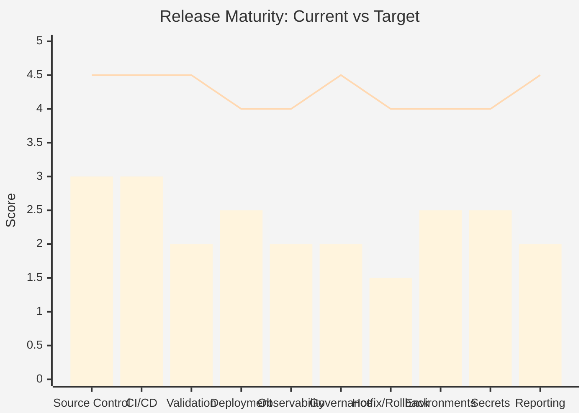
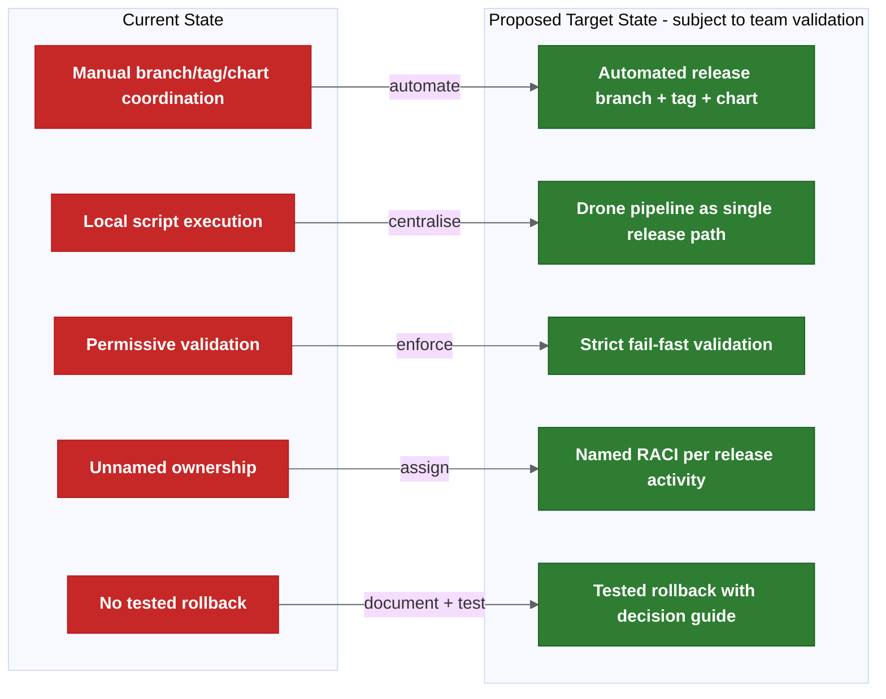
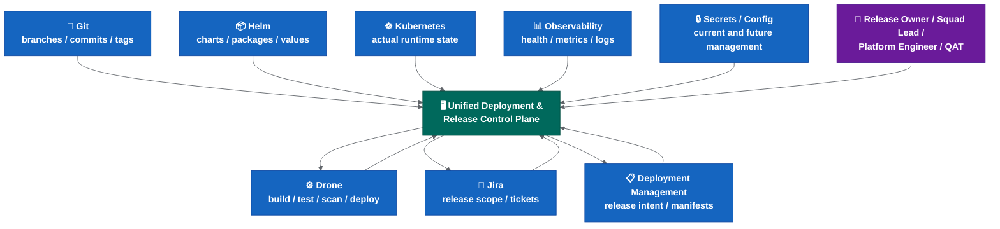

# Transformation Programme

This page contains the transformation analysis, planning and governance structures that sit alongside the assessment findings.

It answers: "Who does what, when, how do we measure success, and what does it cost?"

## Root Cause Analysis

| Problem | Root Cause | Evidence |
| --- | --- | --- |
| Failed or wrong release | Environment mismatch; tag/manifest validation not enforced. | Multiple tag versions created for same release (e.g. 581, 582, 583, 584). |
| Delayed release | Manual coordination across people, scripts and repos. | Release preparation reported to take days per sprint. |
| Rollback uncertainty | No tested operational rollback process; Liquibase may be forward-only. | Recent practical behaviour leans towards fix-forward. |
| Testing inconsistencies | Environment drift; lower envs deployed ad hoc while higher envs use chart releases. | Pre-prod may contain more data than production. |
| Unclear release content | Release metadata spread across Jira, Git tags, manifests and scripts. | Tag jump checker sometimes passes when it should fail. |
| Ownership confusion | RACI not assigned; "release management" is a function, not a named person per release. | Ownership matrix still requires named backup owners and formal approval. |

## Risk Assessment

| # | Risk | Likelihood | Impact | Priority | Mitigation |
| --- | --- | --- | --- | --- | --- |
| R1 | Production outage from wrong artefact. | Medium | Critical | P1 | Strict tag/manifest validation; fail on mismatch. |
| R2 | Extended incident due to no rollback process. | Medium | Critical | P1 | Document and test rollback flow; define time budget. |
| R3 | Release delays from manual coordination. | High | Medium | P2 | Automation pilot; Drone as single release path. |
| R4 | Partial release (missing secrets/config/DB). | High | High | P1 | Explicit release scope checklist per release. |
| R5 | Audit failure from weak release trail. | Medium | High | P2 | Pipeline-generated release reports; immutable artefacts. |
| R6 | Environment failure at deploy time. | Medium | Medium | P3 | Formal environment readiness gate. |
| R7 | Escalation confusion during incident. | High | Medium | P2 | Named owners per RACI. |
| R8 | Trunk-based instability. | Low (if deferred) | High | P3 | Do not adopt trunk-based until feature flags mature. |

## Current Release Maturity Assessment

| Area | Current Score | Target Score | Gap |
| --- | --- | --- | --- |
| Source control and branching | 3.0 / 5 | 4.5 / 5 | Branch model clear but reconciliation and automation incomplete. |
| CI/CD pipeline | 3.0 / 5 | 4.5 / 5 | Pipeline exists but release steps are local/manual. |
| Release validation | 2.0 / 5 | 4.5 / 5 | Scripts exist but fail/warn policy not enforced. |
| Deployment automation | 2.5 / 5 | 4.0 / 5 | Helm/Drone works but manual chart updates and triggers remain. |
| Observability and monitoring | 2.0 / 5 | 4.0 / 5 | Health checks exist; no release-correlated observability gates. |
| Release governance and ownership | 2.0 / 5 | 4.5 / 5 | Templates exist; named owners and approval map incomplete. |
| Hotfix and rollback | 1.5 / 5 | 4.0 / 5 | Technical capability exists; no tested operational process. |
| Environment management | 2.5 / 5 | 4.0 / 5 | Environments exist but readiness is not gated. |
| Secrets and config management | 2.5 / 5 | 4.0 / 5 | Git-crypt works but onboarding and rotation are heavy. |
| Release reporting and audit | 2.0 / 5 | 4.5 / 5 | Scripts generate some metadata; not yet pipeline-driven or mandatory. |

**Overall: Current 2.3 / 5 → Target 4.3 / 5**



## Transformation Principles

1. **Do not change the branching model first.** Stabilise the release operating model before simplifying branches.
2. **Standardise release metadata.** Every release must be traceable from commit to production through tags, manifests, reports and Jira.
3. **Automate before reorganising.** Prove the automation works with the current model before introducing a new one.
4. **Improve visibility before restructuring.** Release reports, dashboards and alerting make problems visible so they can be fixed.
5. **Reduce manual release activities.** Every manual step is a consistency risk and a scaling bottleneck.
6. **Make ownership explicit.** Unnamed responsibilities are unowned responsibilities.
7. **Test rollback before you need it.** A rollback process that has never been tested is not a rollback process.
8. **Treat environment readiness as a gate, not an assumption.** An existing namespace is not a ready environment.

## Target State Architecture

### Current vs Target



### Proposed Target End State - Subject To Team Validation

```text
- main = production baseline (always).
- Release branches auto-created, short-lived (proposed: 1-2 sprint duration — needs confirmation).
- Feature/hotfix branches auto-generate deployable candidates.
- Cerberus charts auto-updated on merge.
- Changed-chart detection deploys only what changed.
- Release reports auto-generated with Jira cross-reference.
- Strict validation enforced (wrong tag = fail).
- Named owners for every release activity.
- Rollback tested and documented.
- Environment readiness gated.
- Alerting for all automation failures.
```

## Future State: Unified Deployment And Release Control Plane

> **This is a future maturity option, not an immediate implementation requirement.**
>
> The technical implementation of this control plane is detailed in the [Deployment Knowledge Graph](deployment-knowledge-graph-design.md) architecture. The Knowledge Graph is the data/intelligence layer; the Control Plane is the operational interface layer. Together they form the long-term unified platform.

### Why This Matters

The current release process is spread across: Git branches, Git tags, Docker images, Helm charts, Cerberus deployment-management, manifests, environment values, secrets, Liquibase, Jira, QAT approvals, release reports, manual runbooks and Drone pipeline execution.

The current transformation plan improves these areas through automation and validation, but it still leaves teams interacting with several tools to answer basic questions like "what is in this release?" or "what is deployed where?"

A unified control plane would reduce cognitive load and provide one operational view of release and deployment state. It would not replace the underlying tools — it would orchestrate and visualise them.

### What The Control Plane Would Do

| Capability | Description |
| --- | --- |
| Release inventory | Show all active, planned and historical releases. |
| Environment state | Show what version is deployed in each environment. |
| Deployment intent | Show what should be deployed according to deployment-management. |
| Actual runtime state | Show what is actually running in Kubernetes. |
| Approval workflow | Capture release owner, QAT and production approvals. |
| Validation status | Show tag, image, chart, manifest, Jira and environment readiness validation. |
| Rollback/fix-forward decision support | Show available rollback targets and known constraints. |
| Audit trail | Record who approved, deployed, overrode, rolled back or excluded a chart. |
| Release report dashboard | Expose release reports without needing to inspect pipeline logs manually. |
| Ownership view | Show squad/service owner, release owner and platform owner. |
| Alerting integration | Route failed automation or deployment issues to the right owners. |
| Metrics and DORA reporting | Track deployment frequency, lead time, failure rate and recovery time. |

### Current Tooling Relationship

The control plane should not initially replace existing tools. It should orchestrate and visualise them:

- Git remains the source of code history.
- Deployment-management remains the source of deployment intent.
- Drone remains the automation engine.
- Helm remains the packaging/deployment mechanism.
- Jira remains the work and release metadata source.
- Kubernetes remains the runtime state.
- Observability tools remain the health signal source.

> **The control plane should not become a second source of truth. It should read from, validate and coordinate the existing sources of truth.**

### Conceptual Architecture



The platform gives a single operational view. It can trigger approved automation through Drone. It should not bypass existing validation gates. It should record decisions and overrides. It should reconcile intended state against actual state.

### Example User Journeys

**Release Owner Journey:**
1. Opens release dashboard.
2. Selects active release.
3. Reviews included services and Jira tickets.
4. Checks validation status.
5. Reviews changed charts.
6. Confirms environment readiness.
7. Approves promotion to SIT or production.
8. Sees deployment progress and post-deployment health.

**Squad Lead Journey:**
1. Checks whether squad services are included in release.
2. Reviews branch/tag/image/chart status.
3. Sees failed validations.
4. Fixes missing Jira tag, ownership or manifest mismatch.
5. Confirms service readiness.

**Platform Engineer Journey:**
1. Reviews failed pipeline or deployment automation.
2. Checks Drone job, manifest, Helm chart and Kubernetes state.
3. Determines whether rerun is safe.
4. Records manual intervention or override.
5. Confirms state reconciliation.

**Incident / Rollback Journey:**
1. Incident detected.
2. Control plane shows current deployed version.
3. Shows previous known good release.
4. Shows whether Liquibase rollback exists.
5. Shows whether config/secrets changed.
6. Release owner chooses rollback or fix-forward.
7. Decision is recorded.
8. Branch, manifest and Jira reconciliation tasks are created.

### Maturity Path

| Phase | Capability | Description |
| --- | --- | --- |
| Phase 1 | Read-only dashboard | View release, environment, manifest and deployment state. |
| Phase 2 | Validation dashboard | Show tag/image/chart/manifest/Jira/environment readiness status. |
| Phase 3 | Approval workflow | Capture release owner, QAT and production approvals. |
| Phase 4 | Controlled deployment trigger | Trigger Drone deployment jobs from the control plane after approval. |
| Phase 5 | Rollback assistant | Show rollback candidates and required reconciliation steps. |
| Phase 6 | Metrics and audit reporting | Provide DORA metrics, release KPIs and audit exports. |
| Phase 7 | GitOps / progressive delivery integration | Integrate with ArgoCD, Argo Rollouts or future deployment controllers if adopted. |

### Non-Goals For The First Version

- Do not replace Drone initially.
- Do not replace Helm initially.
- Do not replace deployment-management initially.
- Do not create a second deployment source of truth.
- Do not allow uncontrolled production deployment.
- Do not bypass QAT or release owner approval.
- Do not combine this with the first branch cutover.
- Do not implement progressive delivery at the same time as the first control-plane version.

### Risks And Mitigations

| Risk | Why It Matters | Mitigation |
| --- | --- | --- |
| Becomes another source of truth | Creates more fragmentation instead of reducing it. | Read from existing sources; write only approved decisions and audit records. |
| Too much scope too early | Could delay immediate release automation work. | Start read-only; separate from initial rollout. |
| Bypasses existing controls | Could weaken governance. | Integrate with existing approval gates and validation rules. |
| Poor data quality | Dashboard is only useful if underlying metadata is reliable. | Complete validation and metadata standardisation first. |
| Ownership unclear | Platform may become unowned tooling. | Assign product/platform ownership before build. |
| Security exposure | Dashboard may show sensitive release, secret or environment metadata. | Apply RBAC, audit logging and avoid showing raw secrets. |

### Success Criteria

- Release owner can answer "what is in this release?" from one place.
- Platform team can answer "what is deployed where?" from one place.
- Squad leads can see validation failures without reading pipeline logs.
- Production deployment approval is recorded in one auditable workflow.
- Rollback candidate and constraints are visible during incidents.
- Every production deployment links to: Git commit/tag, Docker image, Helm chart, deployment-management manifest, Jira release scope, approval record, deployment job and post-deployment health signal.

### Decision Required Before Starting

Before starting this future work, the team must decide:

- Whether the control plane is an internal platform product.
- Who owns it.
- Whether deployment-management remains the source of deployment intent.
- Whether the control plane can trigger Drone jobs or is read-only.
- What RBAC model applies.
- How approval records are stored.
- What audit/export requirements exist.
- Whether this integrates with future GitOps tooling.

For roadmap, RACI, metrics, cost/benefit and recommendations, see [transformation programme — delivery](transformation-programme-delivery.md).

## Related Pages

- [Cerberus Release Engineering Assessment](../README.md)
- [System State, Problems, Solution Options And Risks](system-state-problems-solutions.md)
- [Transformation Programme — Delivery](transformation-programme-delivery.md)
- [Deployment Knowledge Graph](deployment-knowledge-graph-design.md)
- [Advanced Architecture Sections](advanced-architecture-sections.md)
